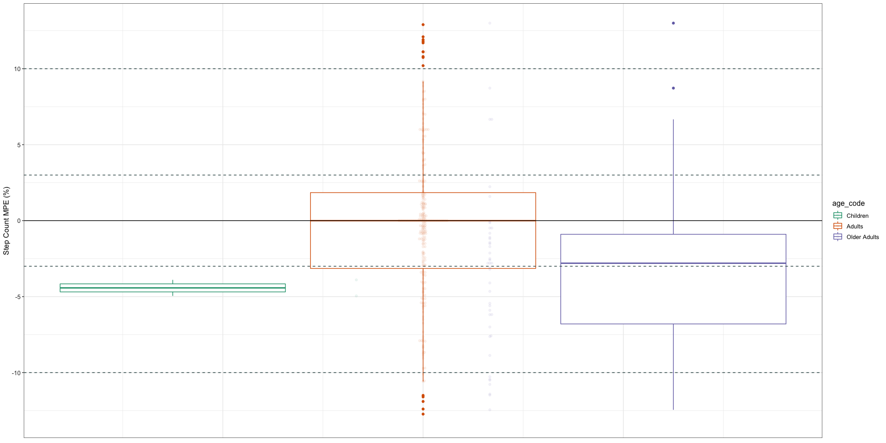

## Read in and glimpse the data


```r
df <- read.csv("wearable_review_data_validity_edited.csv")
```

## Data Cleaning 


```r
data <- df %>%
  select(Brand, device_name, Measured, Setting, age_code, BMI, population_m, population_f, MPE)
str(data)
```

```
## 'data.frame':	1672 obs. of  9 variables:
##  $ Brand       : chr  "Apple" "Apple" "Apple" "Apple" ...
##  $ device_name : chr  "Apple Watch" "Apple Watch" "Apple Watch" "Apple Watch Series 2" ...
##  $ Measured    : chr  "HR" "HR" "HR" "HR" ...
##  $ Setting     : chr  "Controlled" "Controlled" "Controlled" "Controlled" ...
##  $ age_code    : chr  "A" "A" "A" "A" ...
##  $ BMI         : chr  "24.6" "24.6" "24.6" "25.83" ...
##  $ population_m: chr  "26" "26" "26" "22" ...
##  $ population_f: chr  "36" "36" "36" "28" ...
##  $ MPE         : num  0.00719 0.0011 -0.00533 NA NA ...
```


```r
data$age_code <- as.factor(data$age_code)
data$Measured <- as.factor(data$Measured)
data$Setting <- as.factor(data$Setting)
data$population_f <- as.numeric(data$population_f)
```

```
## Warning: NAs introduced by coercion
```

```r
data$population_m <- as.numeric(data$population_m)
```

```
## Warning: NAs introduced by coercion
```

```r
data$BMI <- as.numeric(data$BMI)
```

```
## Warning: NAs introduced by coercion
```

```r
str(data)
```

```
## 'data.frame':	1672 obs. of  9 variables:
##  $ Brand       : chr  "Apple" "Apple" "Apple" "Apple" ...
##  $ device_name : chr  "Apple Watch" "Apple Watch" "Apple Watch" "Apple Watch Series 2" ...
##  $ Measured    : Factor w/ 3 levels "EE","HR","SC": 2 2 2 2 2 2 3 3 3 3 ...
##  $ Setting     : Factor w/ 2 levels "Controlled","Free-Living": 1 1 1 1 1 1 1 1 1 1 ...
##  $ age_code    : Factor w/ 3 levels "A","C","OA": 1 1 1 1 1 1 1 1 1 1 ...
##  $ BMI         : num  24.6 24.6 24.6 25.8 25.8 ...
##  $ population_m: num  26 26 26 22 22 22 16 16 16 16 ...
##  $ population_f: num  36 36 36 28 28 28 15 15 15 15 ...
##  $ MPE         : num  0.00719 0.0011 -0.00533 NA NA ...
```

## Data Cleaning by Variable

### MPE (Outcome Variable)


```r
#convert to percentage
data <- data %>%
  mutate(mpe_percent = MPE*100)

summary(data)
```

```
##     Brand           device_name        Measured         Setting     age_code 
##  Length:1672        Length:1672        EE: 334   Controlled :1561   A :1411  
##  Class :character   Class :character   HR: 271   Free-Living: 111   C :  28  
##  Mode  :character   Mode  :character   SC:1067                      OA: 233  
##                                                                              
##                                                                              
##                                                                              
##                                                                              
##       BMI         population_m    population_f        MPE          
##  Min.   :20.50   Min.   : 0.00   Min.   : 0.00   Min.   :-1.00000  
##  1st Qu.:23.40   1st Qu.: 8.00   1st Qu.: 9.50   1st Qu.:-0.10583  
##  Median :24.60   Median :12.00   Median :12.00   Median :-0.01450  
##  Mean   :24.55   Mean   :14.98   Mean   :14.44   Mean   :-0.04315  
##  3rd Qu.:25.83   3rd Qu.:19.00   3rd Qu.:18.00   3rd Qu.: 0.01396  
##  Max.   :30.80   Max.   :91.00   Max.   :96.00   Max.   : 5.30000  
##  NA's   :662     NA's   :33      NA's   :33      NA's   :294       
##   mpe_percent      
##  Min.   :-100.000  
##  1st Qu.: -10.582  
##  Median :  -1.450  
##  Mean   :  -4.315  
##  3rd Qu.:   1.396  
##  Max.   : 530.000  
##  NA's   :294
```


```r
data <- data %>% drop_na()
```


```r
summary(data)
```

```
##     Brand           device_name        Measured        Setting    age_code
##  Length:807         Length:807         EE:198   Controlled :747   A :724  
##  Class :character   Class :character   HR:109   Free-Living: 60   C :  3  
##  Mode  :character   Mode  :character   SC:500                     OA: 80  
##                                                                           
##                                                                           
##                                                                           
##       BMI         population_m    population_f        MPE          
##  Min.   :20.50   Min.   : 0.00   Min.   : 0.00   Min.   :-1.00000  
##  1st Qu.:23.10   1st Qu.: 9.00   1st Qu.:10.00   1st Qu.:-0.08256  
##  Median :24.60   Median :15.00   Median :14.00   Median :-0.01103  
##  Mean   :24.48   Mean   :16.06   Mean   :15.97   Mean   :-0.01269  
##  3rd Qu.:26.00   3rd Qu.:20.00   3rd Qu.:18.00   3rd Qu.: 0.01620  
##  Max.   :30.80   Max.   :89.00   Max.   :96.00   Max.   : 5.30000  
##   mpe_percent      
##  Min.   :-100.000  
##  1st Qu.:  -8.257  
##  Median :  -1.103  
##  Mean   :  -1.270  
##  3rd Qu.:   1.620  
##  Max.   : 530.000
```


```r
mpe_hist <- ggplot(data, aes(mpe_percent)) + 
                  geom_histogram(bins = 25) +
                  theme_classic()
plot(mpe_hist)
```

<!-- -->


```r
mpe_box <- ggplot(data, aes(mpe_percent)) + 
                geom_boxplot() +
                coord_flip() +
                theme_classic()
plot(mpe_box)
```

<!-- -->


```r
#creating a dataframe containing the extreme outliers
df_out <- data %>%
  identify_outliers("mpe_percent") %>%
        filter(is.extreme == TRUE)
```


```r
#merging the outlier dataframe with our original data
total <- merge(data, df_out, all.x = TRUE)
#renaming those not extreme as FALSE instead of NA
total$is.extreme[is.na(total$is.extreme)] <- FALSE
table(total$is.extreme)
```

```
## 
## FALSE  TRUE 
##   707   106
```


```r
#subsetting the non-outliers in the data
df <- subset(total, is.extreme != TRUE)
```


```r
summary(df)
```

```
##     Brand           device_name        Measured        Setting    age_code
##  Length:707         Length:707         EE:140   Controlled :656   A :645  
##  Class :character   Class :character   HR:109   Free-Living: 51   C :  3  
##  Mode  :character   Mode  :character   SC:458                     OA: 59  
##                                                                           
##                                                                           
##                                                                           
##       BMI         population_m    population_f        MPE          
##  Min.   :20.50   Min.   : 0.00   Min.   : 0.00   Min.   :-0.37500  
##  1st Qu.:22.84   1st Qu.: 9.00   1st Qu.:10.00   1st Qu.:-0.06315  
##  Median :24.40   Median :15.00   Median :13.00   Median :-0.01074  
##  Mean   :24.39   Mean   :15.82   Mean   :15.49   Mean   :-0.02869  
##  3rd Qu.:25.83   3rd Qu.:19.00   3rd Qu.:16.00   3rd Qu.: 0.01006  
##  Max.   :30.80   Max.   :89.00   Max.   :96.00   Max.   : 0.30461  
##   mpe_percent      is.outlier     is.extreme     
##  Min.   :-37.500   Mode:logical   Mode :logical  
##  1st Qu.: -6.315   NA's:707       FALSE:707      
##  Median : -1.074                                 
##  Mean   : -2.869                                 
##  3rd Qu.:  1.006                                 
##  Max.   : 30.461
```

```r
round(stat.desc(df$mpe_percent),2)
```

```
##      nbr.val     nbr.null       nbr.na          min          max        range 
##       707.00        45.00         0.00       -37.50        30.46        67.96 
##          sum       median         mean      SE.mean CI.mean.0.95          var 
##     -2028.67        -1.07        -2.87         0.41         0.80       118.04 
##      std.dev     coef.var 
##        10.86        -3.79
```


```r
mpe_hist_clean <- ggplot(df, aes(mpe_percent)) + 
                  geom_histogram(bins = 30) +
                  theme_classic()
plot(mpe_hist_clean)
```

<!-- -->


```r
mpe_box_clean <- ggplot(df, aes(mpe_percent)) + 
                  geom_boxplot() +
                  coord_flip() +
                  theme_classic()

plot(mpe_box_clean)
```

<!-- -->

### AGE


```r
levels(df$age_code) <- c("Adults", "Children", "Older Adults")
levels(df$age_code)
```

```
## [1] "Adults"       "Children"     "Older Adults"
```


### GENDER


```r
df <- df %>%
        mutate(sex = case_when(
                population_m > population_f ~ "Male",
                population_m < population_f ~ "Female"
        ))
```


```r
df$sex <- as.factor(df$sex)
df_sex <- drop_na(df, sex)
```

### BMI


```r
df <- df_sex %>%
        mutate(bmi_code = case_when(
                BMI >= 18.5 & BMI <= 24.9 ~ "Healthy weight",
                BMI > 24.9 & BMI <= 29.9 ~ "Overweight",
                BMI > 29.9 ~ "Obese"
        ))
```


```r
df$bmi_code <- as.factor(df$bmi_code)
summary(df)
```

```
##     Brand           device_name        Measured        Setting   
##  Length:534         Length:534         EE:105   Controlled :486  
##  Class :character   Class :character   HR: 95   Free-Living: 48  
##  Mode  :character   Mode  :character   SC:334                    
##                                                                  
##                                                                  
##                                                                  
##          age_code        BMI         population_m    population_f  
##  Adults      :472   Min.   :20.50   Min.   : 0.00   Min.   : 0.00  
##  Children    :  3   1st Qu.:23.10   1st Qu.: 8.00   1st Qu.: 9.00  
##  Older Adults: 59   Median :24.41   Median :16.00   Median :13.00  
##                     Mean   :24.41   Mean   :16.49   Mean   :16.05  
##                     3rd Qu.:25.60   3rd Qu.:20.00   3rd Qu.:18.00  
##                     Max.   :30.80   Max.   :89.00   Max.   :96.00  
##       MPE            mpe_percent      is.outlier     is.extreme     
##  Min.   :-0.37500   Min.   :-37.500   Mode:logical   Mode :logical  
##  1st Qu.:-0.06492   1st Qu.: -6.492   NA's:534       FALSE:534      
##  Median :-0.00852   Median : -0.852                                 
##  Mean   :-0.02331   Mean   : -2.331                                 
##  3rd Qu.: 0.01786   3rd Qu.:  1.786                                 
##  Max.   : 0.30461   Max.   : 30.461                                 
##      sex                bmi_code  
##  Female:238   Healthy weight:348  
##  Male  :296   Obese         :  2  
##               Overweight    :184  
##                                   
##                                   
## 
```


```r
#relevel factors
df$age_code <- fct_relevel(df$age_code, c("Children","Adults","Older Adults"))
df$bmi_code <- fct_relevel(df$bmi_code, c("Healthy weight","Overweight","Obese"))
```

## MPE for Step count, heart rate & energy expenditure across different groups


```r
#AGE GROUP
df %>%
    group_by(age_code, Measured) %>%
    get_summary_stats(mpe_percent, type = "mean_sd") %>%
    arrange(Measured)
```

<div class="kable-table">

|Measured |age_code     |variable    |   n|   mean|     sd|
|:--------|:------------|:-----------|---:|------:|------:|
|EE       |Adults       |mpe_percent | 105| -5.666| 15.898|
|HR       |Children     |mpe_percent |   1|  0.100|     NA|
|HR       |Adults       |mpe_percent |  94| -0.950|  7.256|
|SC       |Children     |mpe_percent |   2| -4.425|  0.746|
|SC       |Adults       |mpe_percent | 273| -0.203|  8.596|
|SC       |Older Adults |mpe_percent |  59| -8.411| 11.423|

</div>


```r
#SEX GROUP
df %>%
    group_by(sex, Measured) %>%
    get_summary_stats(mpe_percent, type = "mean_sd") %>%
    arrange(Measured)
```

<div class="kable-table">

|Measured |sex    |variable    |   n|   mean|     sd|
|:--------|:------|:-----------|---:|------:|------:|
|EE       |Female |mpe_percent |  40| -2.478| 13.874|
|EE       |Male   |mpe_percent |  65| -7.628| 16.827|
|HR       |Female |mpe_percent |  37| -1.371|  9.550|
|HR       |Male   |mpe_percent |  58| -0.662|  5.303|
|SC       |Female |mpe_percent | 161| -1.731| 10.413|
|SC       |Male   |mpe_percent | 173| -1.629|  8.893|

</div>


```r
#BMI GROUP
df %>%
    group_by(bmi_code, Measured) %>%
    get_summary_stats(mpe_percent, type = "mean_sd") %>%
    arrange(Measured)
```

<div class="kable-table">

|Measured |bmi_code       |variable    |   n|    mean|     sd|
|:--------|:--------------|:-----------|---:|-------:|------:|
|EE       |Healthy weight |mpe_percent |  70|  -8.385| 14.986|
|EE       |Overweight     |mpe_percent |  35|  -0.229| 16.481|
|HR       |Healthy weight |mpe_percent |  67|  -1.747|  7.873|
|HR       |Overweight     |mpe_percent |  28|   0.997|  4.935|
|SC       |Healthy weight |mpe_percent | 211|   0.972|  7.874|
|SC       |Overweight     |mpe_percent | 121|  -6.103| 10.535|
|SC       |Obese          |mpe_percent |   2| -13.618| 21.753|

</div>

## PLOTS

### Filtering the data by Measured


```r
val_data_sc <- filter(df, Measured == "SC")
val_data_hr <- filter(df, Measured == "HR")
val_data_ee <- filter(df, Measured == "EE")
```


### Validity of Step count by Age

* Dashed grey lines indicate ± 3% (in controlled settings) and ± 10% (in free-living settings) measurement error


```r
#options(repr.plot.width = 25, repr.plot.height = 8)
age_sc_plot <- ggplot(val_data_sc, aes(x = 1, y = mpe_percent, colour = age_code)) +
                    geom_boxplot(na.rm = TRUE) +
                    geom_beeswarm(dodge.width = 0.2, cex = 0.2, alpha = 0.08, groupOnX = TRUE, na.rm = TRUE) +   
                    geom_hline(yintercept = 0) +  
                    geom_hline(yintercept = 10, size = 0.5, colour = "darkslategray", linetype = "dashed") +
                    geom_hline(yintercept = -10, size = 0.5, colour = "darkslategray", linetype = "dashed") +
                    geom_hline(yintercept = 3, size = 0.5, colour = "darkslategray", linetype = "dashed") + 
                    geom_hline(yintercept = -3, size = 0.5, colour = "darkslategray", linetype = "dashed") +   
                    scale_y_continuous(limits=c(-13, 13)) +
                    ylab("Step Count MPE (%)") +
                    scale_colour_brewer(palette="Dark2") +
                    theme_bw() +
                    theme(axis.text.x = element_blank(),
                          axis.title.x = element_blank(),
                          axis.ticks.x = element_blank(),
                        axis.text.y = element_text(colour = "grey20", size = 10),
                        strip.text = element_text(face = "italic"),
                        text = element_text(size = 12)) 
plot(age_sc_plot)
```

```
## Warning: Removed 47 rows containing missing values (position_beeswarm).
```

<!-- -->
### Validity of step count by Sex


```r
sex_sc_plot <- ggplot(val_data_sc, aes(x = 1, y = mpe_percent, colour = sex)) +
                    geom_boxplot(na.rm = TRUE) +
                    geom_beeswarm(dodge.width = 0.2, cex = 0.2, alpha = 0.08, groupOnX = TRUE, na.rm = TRUE) +   
                    geom_hline(yintercept = 0) +  
                    geom_hline(yintercept = 10, size = 0.5, colour = "darkslategray", linetype = "dashed") +
                    geom_hline(yintercept = -10, size = 0.5, colour = "darkslategray", linetype = "dashed") +
                    geom_hline(yintercept = 3, size = 0.5, colour = "darkslategray", linetype = "dashed") + 
                    geom_hline(yintercept = -3, size = 0.5, colour = "darkslategray", linetype = "dashed") +   
                    scale_y_continuous(limits=c(-13, 13)) +
                    ylab("Step Count MPE (%)") +
                    scale_colour_brewer(palette="Dark2") +
                    theme_bw() +
                    theme(axis.text.x = element_blank(),
                          axis.title.x = element_blank(),
                          axis.ticks.x = element_blank(),
                        axis.text.y = element_text(colour = "grey20", size = 10),
                        strip.text = element_text(face = "italic"),
                        text = element_text(size = 12)) 
plot(sex_sc_plot)
```

```
## Warning: Removed 47 rows containing missing values (position_beeswarm).
```

<!-- -->

### Validity of step count by BMI


```r
bmi_sc_plot <- ggplot(val_data_sc, aes(x = 1, y = mpe_percent, colour = bmi_code)) +
                    geom_boxplot(na.rm = TRUE) +
                    geom_beeswarm(dodge.width = 0.2, cex = 0.2, alpha = 0.08, groupOnX = TRUE, na.rm = TRUE) +   
                    geom_hline(yintercept = 0) +  
                    geom_hline(yintercept = 10, size = 0.5, colour = "darkslategray", linetype = "dashed") +
                    geom_hline(yintercept = -10, size = 0.5, colour = "darkslategray", linetype = "dashed") +
                    geom_hline(yintercept = 3, size = 0.5, colour = "darkslategray", linetype = "dashed") + 
                    geom_hline(yintercept = -3, size = 0.5, colour = "darkslategray", linetype = "dashed") +   
                    scale_y_continuous(limits=c(-13, 13)) +
                    ylab("Step Count MPE (%)") +
                    scale_colour_brewer(palette="Dark2") +
                    theme_bw() +
                    theme(axis.text.x = element_blank(),
                          axis.title.x = element_blank(),
                          axis.ticks.x = element_blank(),
                        axis.text.y = element_text(colour = "grey20", size = 10),
                        strip.text = element_text(face = "italic"),
                        text = element_text(size = 12)) 
plot(bmi_sc_plot)
```

```
## Warning: Removed 47 rows containing missing values (position_beeswarm).
```

<!-- -->

### Validity of Heart rate by Age

* Dashed grey lines indicate ± 3% (in controlled settings) and ± 10% (in free-living settings) measurement error


```r
age_hr_plot <- ggplot(val_data_hr, aes(x = 1, y = mpe_percent, colour = age_code)) +
                    geom_boxplot(na.rm = TRUE) +
                    geom_beeswarm(dodge.width = 0.2, cex = 0.2, alpha = 0.08, groupOnX = TRUE, na.rm = TRUE) +   
                    geom_hline(yintercept = 0) +  
                    geom_hline(yintercept = 10, size = 0.5, colour = "darkslategray", linetype = "dashed") +
                    geom_hline(yintercept = -10, size = 0.5, colour = "darkslategray", linetype = "dashed") +
                    geom_hline(yintercept = 3, size = 0.5, colour = "darkslategray", linetype = "dashed") + 
                    geom_hline(yintercept = -3, size = 0.5, colour = "darkslategray", linetype = "dashed") +   
                    scale_y_continuous(limits=c(-13, 13)) +
                    ylab("Heart rate MPE (%)") +
                    scale_colour_brewer(palette="Dark2") +
                    theme_bw() +
                    theme(axis.text.x = element_blank(),
                          axis.title.x = element_blank(),
                          axis.ticks.x = element_blank(),
                        axis.text.y = element_text(colour = "grey20", size = 10),
                        strip.text = element_text(face = "italic"),
                        text = element_text(size = 12)) 
plot(age_hr_plot)
```

```
## Warning: Removed 8 rows containing missing values (position_beeswarm).
```

<!-- -->

### Validity of heart rate by sex


```r
sex_hr_plot <- ggplot(val_data_hr, aes(x = 1, y = mpe_percent, colour = sex)) +
                    geom_boxplot(na.rm = TRUE) +
                    geom_beeswarm(dodge.width = 0.2, cex = 0.2, alpha = 0.08, groupOnX = TRUE, na.rm = TRUE) +   
                    geom_hline(yintercept = 0) +  
                    geom_hline(yintercept = 10, size = 0.5, colour = "darkslategray", linetype = "dashed") +
                    geom_hline(yintercept = -10, size = 0.5, colour = "darkslategray", linetype = "dashed") +
                    geom_hline(yintercept = 3, size = 0.5, colour = "darkslategray", linetype = "dashed") + 
                    geom_hline(yintercept = -3, size = 0.5, colour = "darkslategray", linetype = "dashed") +   
                    scale_y_continuous(limits=c(-13, 13)) +
                    ylab("Heart rate MPE (%)") +
                    scale_colour_brewer(palette="Dark2") +
                    theme_bw() +
                    theme(axis.text.x = element_blank(),
                          axis.title.x = element_blank(),
                          axis.ticks.x = element_blank(),
                        axis.text.y = element_text(colour = "grey20", size = 10),
                        strip.text = element_text(face = "italic"),
                        text = element_text(size = 12)) 
plot(sex_hr_plot)
```

```
## Warning: Removed 8 rows containing missing values (position_beeswarm).
```

<!-- -->

### Validity of heart rate by BMI


```r
bmi_hr_plot <- ggplot(val_data_hr, aes(x = 1, y = mpe_percent, colour = bmi_code)) +
                    geom_boxplot(na.rm = TRUE) +
                    geom_beeswarm(dodge.width = 0.2, cex = 0.2, alpha = 0.08, groupOnX = TRUE, na.rm = TRUE) +   
                    geom_hline(yintercept = 0) +  
                    geom_hline(yintercept = 10, size = 0.5, colour = "darkslategray", linetype = "dashed") +
                    geom_hline(yintercept = -10, size = 0.5, colour = "darkslategray", linetype = "dashed") +
                    geom_hline(yintercept = 3, size = 0.5, colour = "darkslategray", linetype = "dashed") + 
                    geom_hline(yintercept = -3, size = 0.5, colour = "darkslategray", linetype = "dashed") +   
                    scale_y_continuous(limits=c(-13, 13)) +
                    ylab("Heart rate MPE (%)") +
                    scale_colour_brewer(palette="Dark2") +
                    theme_bw() +
                    theme(axis.text.x = element_blank(),
                          axis.title.x = element_blank(),
                          axis.ticks.x = element_blank(),
                        axis.text.y = element_text(colour = "grey20", size = 10),
                        strip.text = element_text(face = "italic"),
                        text = element_text(size = 12)) 
plot(bmi_hr_plot)
```

```
## Warning: Removed 8 rows containing missing values (position_beeswarm).
```

<!-- -->

### Validity of Energy expenditure by Age

* Dashed grey lines indicate ± 3% (in controlled settings) and ± 10% (in free-living settings) measurement error


```r
age_ee_plot <- ggplot(val_data_ee, aes(x = 1, y = mpe_percent, colour = age_code)) +
                    geom_boxplot(na.rm = TRUE) +
                    geom_beeswarm(dodge.width = 0.2, cex = 0.2, alpha = 0.08, groupOnX = TRUE, na.rm = TRUE) +   
                    geom_hline(yintercept = 0) +  
                    geom_hline(yintercept = 10, size = 0.5, colour = "darkslategray", linetype = "dashed") +
                    geom_hline(yintercept = -10, size = 0.5, colour = "darkslategray", linetype = "dashed") +
                    geom_hline(yintercept = 3, size = 0.5, colour = "darkslategray", linetype = "dashed") + 
                    geom_hline(yintercept = -3, size = 0.5, colour = "darkslategray", linetype = "dashed") +   
                    scale_y_continuous(limits=c(-13, 13)) +
                    ylab("Energy expenditure MPE (%)") +
                    scale_colour_brewer(palette="Dark2") +
                    theme_bw() +
                    theme(axis.text.x = element_blank(),
                          axis.title.x = element_blank(),
                          axis.ticks.x = element_blank(),
                        axis.text.y = element_text(colour = "grey20", size = 10),
                        strip.text = element_text(face = "italic"),
                        text = element_text(size = 12)) 
plot(age_ee_plot)
```

```
## Warning: Removed 46 rows containing missing values (position_beeswarm).
```

<!-- -->
### Validity of energy expenditure by sex


```r
sex_ee_plot <- ggplot(val_data_ee, aes(x = 1, y = mpe_percent, colour = sex)) +
                    geom_boxplot(na.rm = TRUE) +
                    geom_beeswarm(dodge.width = 0.2, cex = 0.2, alpha = 0.08, groupOnX = TRUE, na.rm = TRUE) +   
                    geom_hline(yintercept = 0) +  
                    geom_hline(yintercept = 10, size = 0.5, colour = "darkslategray", linetype = "dashed") +
                    geom_hline(yintercept = -10, size = 0.5, colour = "darkslategray", linetype = "dashed") +
                    geom_hline(yintercept = 3, size = 0.5, colour = "darkslategray", linetype = "dashed") + 
                    geom_hline(yintercept = -3, size = 0.5, colour = "darkslategray", linetype = "dashed") +   
                    scale_y_continuous(limits=c(-13, 13)) +
                    ylab("Energy expenditure MPE (%)") +
                    scale_colour_brewer(palette="Dark2") +
                    theme_bw() +
                    theme(axis.text.x = element_blank(),
                          axis.title.x = element_blank(),
                          axis.ticks.x = element_blank(),
                        axis.text.y = element_text(colour = "grey20", size = 10),
                        strip.text = element_text(face = "italic"),
                        text = element_text(size = 12))
plot(sex_ee_plot)
```

```
## Warning: Removed 46 rows containing missing values (position_beeswarm).
```

<!-- -->

### Validity of energy expenditure by BMI


```r
bmi_ee_plot <- ggplot(val_data_ee, aes(x =1, y = mpe_percent, colour = bmi_code)) +
                    geom_boxplot(na.rm = TRUE) +
                    geom_beeswarm(dodge.width = 0.2, cex = 0.2, alpha = 0.08, groupOnX = TRUE, na.rm = TRUE) +   
                    geom_hline(yintercept = 0) +  
                    geom_hline(yintercept = 10, size = 0.5, colour = "darkslategray", linetype = "dashed") +
                    geom_hline(yintercept = -10, size = 0.5, colour = "darkslategray", linetype = "dashed") +
                    geom_hline(yintercept = 3, size = 0.5, colour = "darkslategray", linetype = "dashed") + 
                    geom_hline(yintercept = -3, size = 0.5, colour = "darkslategray", linetype = "dashed") +   
                    scale_y_continuous(limits=c(-13, 13)) +
                    ylab("Energy Expenditure MPE (%)") +
                    scale_colour_brewer(palette="Dark2") +
                    theme_bw() +
                    theme(axis.text.x = element_blank(),
                          axis.title.x = element_blank(),
                          axis.ticks.x = element_blank(),
                        axis.text.y = element_text(colour = "grey20", size = 10),
                        strip.text = element_text(face = "italic"),
                        text = element_text(size = 12))
plot(bmi_ee_plot)
```

```
## Warning: Removed 46 rows containing missing values (position_beeswarm).
```

<!-- -->


```r
figure1 <- plot_grid(age_sc_plot, sex_sc_plot, bmi_sc_plot, labels = c('Age','Sex','BMI'), label_size = 12)
```

```
## Warning: Removed 47 rows containing missing values (position_beeswarm).

## Warning: Removed 47 rows containing missing values (position_beeswarm).

## Warning: Removed 47 rows containing missing values (position_beeswarm).
```

```r
figure2 <- plot_grid(age_ee_plot, sex_ee_plot, bmi_ee_plot, labels = c('Age','Sex','BMI'), label_size = 12)
```

```
## Warning: Removed 46 rows containing missing values (position_beeswarm).
```

```
## Warning: Removed 46 rows containing missing values (position_beeswarm).

## Warning: Removed 46 rows containing missing values (position_beeswarm).
```

```r
figure3 <- plot_grid(age_hr_plot, sex_hr_plot, bmi_hr_plot, labels = c('Age','Sex','BMI'), label_size = 12)
```

```
## Warning: Removed 8 rows containing missing values (position_beeswarm).
```

```
## Warning: Removed 8 rows containing missing values (position_beeswarm).

## Warning: Removed 8 rows containing missing values (position_beeswarm).
```


```r
ggsave("SC-figure.pdf", plot = figure1, width = 10, height = 7)
ggsave("EE-figure.pdf", plot = figure2, width = 10, height = 7)
ggsave("HR-figure.pdf", plot = figure3, width = 10, height = 7)
```


## ANOVA

### Step count validity with Age, Sex & BMI


```r
aov_sc_age <- aov(mpe_percent ~ age_code, data = val_data_sc)
summary(aov_sc_age)
```

```
##              Df Sum Sq Mean Sq F value   Pr(>F)    
## age_code      2   3284  1641.8   19.64 8.69e-09 ***
## Residuals   331  27667    83.6                     
## ---
## Signif. codes:  0 '***' 0.001 '**' 0.01 '*' 0.05 '.' 0.1 ' ' 1
```


```r
aov_sc_sex <- aov(mpe_percent ~ sex, data = val_data_sc)
summary(aov_sc_sex)
```

```
##              Df Sum Sq Mean Sq F value Pr(>F)
## sex           1      1    0.87   0.009  0.923
## Residuals   332  30949   93.22
```


```r
aov_sc_bmi <- aov(mpe_percent ~ bmi_code, data = val_data_sc)
summary(aov_sc_bmi)
```

```
##              Df Sum Sq Mean Sq F value   Pr(>F)    
## bmi_code      2   4136    2068   25.53 4.88e-11 ***
## Residuals   331  26814      81                     
## ---
## Signif. codes:  0 '***' 0.001 '**' 0.01 '*' 0.05 '.' 0.1 ' ' 1
```

### Energy Expenditure validity with Age, Sex & BMI


```r
#aov_ee_age <- aov(mpe_percent ~ age_code, data = val_data_ee)
#summary(aov_ee_age)
```


```r
aov_ee_sex <- aov(mpe_percent ~ sex, data = val_data_ee)
summary(aov_ee_sex)
```

```
##              Df Sum Sq Mean Sq F value Pr(>F)
## sex           1    657   656.8    2.64  0.107
## Residuals   103  25628   248.8
```


```r
aov_ee_bmi <- aov(mpe_percent ~ bmi_code, data = val_data_ee)
summary(aov_ee_bmi)
```

```
##              Df Sum Sq Mean Sq F value Pr(>F)  
## bmi_code      1   1552  1552.1   6.464 0.0125 *
## Residuals   103  24732   240.1                 
## ---
## Signif. codes:  0 '***' 0.001 '**' 0.01 '*' 0.05 '.' 0.1 ' ' 1
```

### Heart Rate validity with Age, Sex & BMI


```r
aov_hr_age <- aov(mpe_percent ~ age_code, data = val_data_hr)
summary(aov_hr_age)
```

```
##             Df Sum Sq Mean Sq F value Pr(>F)
## age_code     1      1    1.09   0.021  0.886
## Residuals   93   4896   52.64
```


```r
aov_hr_sex <- aov(mpe_percent ~ sex, data = val_data_hr)
summary(aov_hr_sex)
```

```
##             Df Sum Sq Mean Sq F value Pr(>F)
## sex          1     11   11.35   0.216  0.643
## Residuals   93   4886   52.53
```


```r
aov_hr_bmi <- aov(mpe_percent ~ bmi_code, data = val_data_hr)
summary(aov_hr_bmi)
```

```
##             Df Sum Sq Mean Sq F value Pr(>F)  
## bmi_code     1    149  148.77   2.914 0.0912 .
## Residuals   93   4748   51.06                 
## ---
## Signif. codes:  0 '***' 0.001 '**' 0.01 '*' 0.05 '.' 0.1 ' ' 1
```

## Post Hoc Test


```r
tuk_sc_age <- TukeyHSD(aov_sc_age)
tuk_sc_age
```

```
##   Tukey multiple comparisons of means
##     95% family-wise confidence level
## 
## Fit: aov(formula = mpe_percent ~ age_code, data = val_data_sc)
## 
## $age_code
##                            diff       lwr       upr     p adj
## Adults-Children        4.221235 -11.05432 19.496788 0.7921656
## Older Adults-Children -3.986636 -19.46235 11.489083 0.8166791
## Older Adults-Adults   -8.207871 -11.29809 -5.117656 0.0000000
```


```r
tuk_sc_bmi <- TukeyHSD(aov_sc_bmi)
tuk_sc_bmi
```

```
##   Tukey multiple comparisons of means
##     95% family-wise confidence level
## 
## Fit: aov(formula = mpe_percent ~ bmi_code, data = val_data_sc)
## 
## $bmi_code
##                                 diff        lwr        upr     p adj
## Overweight-Healthy weight  -7.075151  -9.491524 -4.6587768 0.0000000
## Obese-Healthy weight      -14.590049 -29.644418  0.4643203 0.0597846
## Obese-Overweight           -7.514898 -22.621746  7.5919497 0.4712685
```


```r
tuk_ee_bmi <- TukeyHSD(aov_ee_bmi)
tuk_ee_bmi
```

```
##   Tukey multiple comparisons of means
##     95% family-wise confidence level
## 
## Fit: aov(formula = mpe_percent ~ bmi_code, data = val_data_ee)
## 
## $bmi_code
##                               diff     lwr      upr     p adj
## Overweight-Healthy weight 8.155819 1.79362 14.51802 0.0124981
```

## Regression Analysis

### Step Count


```r
sc_reg1 <- lm(mpe_percent ~ age_code, val_data_sc)
summary(sc_reg1)
```

```
## 
## Call:
## lm(formula = mpe_percent ~ age_code, data = val_data_sc)
## 
## Residuals:
##      Min       1Q   Median       3Q      Max 
## -30.2031  -3.8601   0.2035   4.1785  30.5790 
## 
## Coefficients:
##                      Estimate Std. Error t value Pr(>|t|)
## (Intercept)            -4.425      6.465  -0.684    0.494
## age_codeAdults          4.221      6.488   0.651    0.516
## age_codeOlder Adults   -3.987      6.573  -0.606    0.545
## 
## Residual standard error: 9.142 on 331 degrees of freedom
## Multiple R-squared:  0.1061,	Adjusted R-squared:  0.1007 
## F-statistic: 19.64 on 2 and 331 DF,  p-value: 8.688e-09
```

```r
sc_reg2 <- lm(mpe_percent ~ sex, val_data_sc)
summary(sc_reg2)
```

```
## 
## Call:
## lm(formula = mpe_percent ~ sex, data = val_data_sc)
## 
## Residuals:
##     Min      1Q  Median      3Q     Max 
## -34.149  -3.778   1.142   3.369  32.107 
## 
## Coefficients:
##             Estimate Std. Error t value Pr(>|t|)  
## (Intercept)  -1.7314     0.7609  -2.275   0.0235 *
## sexMale       0.1019     1.0573   0.096   0.9232  
## ---
## Signif. codes:  0 '***' 0.001 '**' 0.01 '*' 0.05 '.' 0.1 ' ' 1
## 
## Residual standard error: 9.655 on 332 degrees of freedom
## Multiple R-squared:  2.8e-05,	Adjusted R-squared:  -0.002984 
## F-statistic: 0.009297 on 1 and 332 DF,  p-value: 0.9232
```

```r
sc_reg3 <- lm(mpe_percent ~ bmi_code, val_data_sc)
summary(sc_reg3)
```

```
## 
## Call:
## lm(formula = mpe_percent ~ bmi_code, data = val_data_sc)
## 
## Residuals:
##      Min       1Q   Median       3Q      Max 
## -31.0051  -4.3631  -0.6615   4.9672  29.4037 
## 
## Coefficients:
##                    Estimate Std. Error t value Pr(>|t|)    
## (Intercept)          0.9719     0.6196   1.569   0.1177    
## bmi_codeOverweight  -7.0752     1.0264  -6.893 2.76e-11 ***
## bmi_codeObese      -14.5900     6.3944  -2.282   0.0231 *  
## ---
## Signif. codes:  0 '***' 0.001 '**' 0.01 '*' 0.05 '.' 0.1 ' ' 1
## 
## Residual standard error: 9 on 331 degrees of freedom
## Multiple R-squared:  0.1336,	Adjusted R-squared:  0.1284 
## F-statistic: 25.53 on 2 and 331 DF,  p-value: 4.884e-11
```

### Energy Expenditure


```r
#ee_reg1 <- lm(mpe_percent ~ age_code, val_data_ee)
#summary(ee_reg1)
ee_reg2 <- lm(mpe_percent ~ sex, val_data_ee)
summary(ee_reg2)
```

```
## 
## Call:
## lm(formula = mpe_percent ~ sex, data = val_data_ee)
## 
## Residuals:
##     Min      1Q  Median      3Q     Max 
## -29.872 -12.372   0.378  10.713  36.240 
## 
## Coefficients:
##             Estimate Std. Error t value Pr(>|t|)
## (Intercept)   -2.478      2.494  -0.994    0.323
## sexMale       -5.150      3.170  -1.625    0.107
## 
## Residual standard error: 15.77 on 103 degrees of freedom
## Multiple R-squared:  0.02499,	Adjusted R-squared:  0.01552 
## F-statistic:  2.64 on 1 and 103 DF,  p-value: 0.1073
```

```r
ee_reg3 <- lm(mpe_percent ~ bmi_code, val_data_ee)
summary(ee_reg3)
```

```
## 
## Call:
## lm(formula = mpe_percent ~ bmi_code, data = val_data_ee)
## 
## Residuals:
##     Min      1Q  Median      3Q     Max 
## -29.771 -11.615   1.637   8.299  35.188 
## 
## Coefficients:
##                    Estimate Std. Error t value Pr(>|t|)    
## (Intercept)          -8.385      1.852  -4.527 1.61e-05 ***
## bmi_codeOverweight    8.156      3.208   2.542   0.0125 *  
## ---
## Signif. codes:  0 '***' 0.001 '**' 0.01 '*' 0.05 '.' 0.1 ' ' 1
## 
## Residual standard error: 15.5 on 103 degrees of freedom
## Multiple R-squared:  0.05905,	Adjusted R-squared:  0.04991 
## F-statistic: 6.464 on 1 and 103 DF,  p-value: 0.0125
```

### Heart Rate


```r
hr_reg1 <- lm(mpe_percent ~ age_code, val_data_hr)
summary(hr_reg1)
```

```
## 
## Call:
## lm(formula = mpe_percent ~ age_code, data = val_data_hr)
## 
## Residuals:
##     Min      1Q  Median      3Q     Max 
## -21.550  -2.799   0.000   2.120  19.351 
## 
## Coefficients:
##                Estimate Std. Error t value Pr(>|t|)
## (Intercept)      0.0995     7.2557   0.014    0.989
## age_codeAdults  -1.0490     7.2942  -0.144    0.886
## 
## Residual standard error: 7.256 on 93 degrees of freedom
## Multiple R-squared:  0.0002223,	Adjusted R-squared:  -0.01053 
## F-statistic: 0.02068 on 1 and 93 DF,  p-value: 0.886
```

```r
hr_reg2 <- lm(mpe_percent ~ sex, val_data_hr)
summary(hr_reg2)
```

```
## 
## Call:
## lm(formula = mpe_percent ~ sex, data = val_data_hr)
## 
## Residuals:
##      Min       1Q   Median       3Q      Max 
## -21.1288  -2.5566  -0.0895   2.0215  19.7726 
## 
## Coefficients:
##             Estimate Std. Error t value Pr(>|t|)
## (Intercept)  -1.3712     1.1916  -1.151    0.253
## sexMale       0.7088     1.5250   0.465    0.643
## 
## Residual standard error: 7.248 on 93 degrees of freedom
## Multiple R-squared:  0.002318,	Adjusted R-squared:  -0.00841 
## F-statistic: 0.216 on 1 and 93 DF,  p-value: 0.6432
```

```r
hr_reg3 <- lm(mpe_percent ~ bmi_code, val_data_hr)
summary(hr_reg3)
```

```
## 
## Call:
## lm(formula = mpe_percent ~ bmi_code, data = val_data_hr)
## 
## Residuals:
##      Min       1Q   Median       3Q      Max 
## -20.7525  -2.6694  -0.0981   2.3879  20.1488 
## 
## Coefficients:
##                    Estimate Std. Error t value Pr(>|t|)  
## (Intercept)          -1.748      0.873  -2.002   0.0482 *
## bmi_codeOverweight    2.745      1.608   1.707   0.0912 .
## ---
## Signif. codes:  0 '***' 0.001 '**' 0.01 '*' 0.05 '.' 0.1 ' ' 1
## 
## Residual standard error: 7.145 on 93 degrees of freedom
## Multiple R-squared:  0.03038,	Adjusted R-squared:  0.01995 
## F-statistic: 2.914 on 1 and 93 DF,  p-value: 0.09116
```


