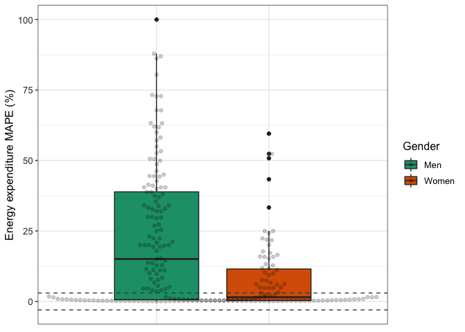

## Read in and glimpse the data


```r
data <- read.csv("wearable_review_data_validity_edited.csv")
```

## Data Cleaning 


```r
#data <- subset(val_data, Measured != "EE" & Measured != "HR")

glimpse(data)
```

```
## Rows: 1,672
## Columns: 107
## $ X1                          <int> 1, 2, 3, 4, 5, 6, 7, 8, 9, 10, 11, 12, 13,…
## $ Author                      <chr> "Dooley", "Dooley", "Dooley", "Boudreaux",…
## $ Year                        <int> 2017, 2017, 2017, 2018, 2018, 2018, 2017, …
## $ Substudy                    <chr> "-", "-", "-", "-", "-", "-", "-", "-", "-…
## $ Setting                     <chr> "Controlled", "Controlled", "Controlled", …
## $ Measured                    <chr> "HR", "HR", "HR", "HR", "HR", "HR", "SC", …
## $ Measure_Unit                <chr> "bpm", "bpm", "bpm", "bpm", "bpm", "bpm", …
## $ Brand                       <chr> "Apple", "Apple", "Apple", "Apple", "Apple…
## $ Device                      <chr> "Watch", "Watch", "Watch", "Watch Series 2…
## $ device_name                 <chr> "Apple Watch", "Apple Watch", "Apple Watch…
## $ device_year                 <int> 2015, 2015, 2015, 2016, 2016, 2016, 2015, …
## $ Wear_Location               <chr> "Wrist", "Wrist", "Wrist", "Wrist", "Wrist…
## $ Wear_Info                   <chr> "wrist, random", "wrist, random", "wrist, …
## $ Type                        <chr> "full-text", "full-text", "full-text", "fu…
## $ Good.                       <chr> "y", "y", "y", "y", "y", "y", "y", "y", "y…
## $ Criterion_Measure           <chr> "Heart rate sensor chest strap (Polar T31)…
## $ Criterion_Type              <chr> "chest strap", "chest strap", "chest strap…
## $ Wear_Info_crit              <chr> "chest", "chest", "chest", "upper torso", …
## $ Wear_Location_crit          <chr> "Torso", "Torso", "Torso", "Torso", "Torso…
## $ population_n                <chr> "62", "62", "62", "50", "50", "50", "31", …
## $ population_m                <chr> "26", "26", "26", "22", "22", "22", "16", …
## $ population_f                <chr> "36", "36", "36", "28", "28", "28", "15", …
## $ population                  <chr> "healthy adults", "healthy adults", "healt…
## $ age_code                    <chr> "A", "A", "A", "A", "A", "A", "A", "A", "A…
## $ health_code                 <chr> "H", "H", "H", "H", "H", "H", "H", "H", "H…
## $ age                         <chr> "22.55", "22.55", "22.55", "22.71", "22.71…
## $ age_SD                      <dbl> 4.34, 4.34, 4.34, 2.99, 2.99, 2.99, 12.00,…
## $ weight                      <chr> "72.02", "72.02", "72.02", "67.79", "67.79…
## $ weight_SD                   <dbl> 18.99, 18.99, 18.99, 14.01, 14.01, 14.01, …
## $ height                      <chr> "170", "170", "170", "162.71", "162.71", "…
## $ height_SD                   <dbl> 11.00, 11.00, 11.00, 5.79, 5.79, 5.79, NA,…
## $ BMI                         <chr> "24.6", "24.6", "24.6", "25.83", "25.83", …
## $ BMI_SD                      <dbl> 4.77, 4.77, 4.77, 4.83, 4.83, 4.83, 2.40, …
## $ location                    <chr> "TX, USA", "TX, USA", "TX, USA", "LA, USA"…
## $ activity_type               <chr> "Rest: Seated", "Rest: Seated", "Rest: Sea…
## $ test_type                   <chr> "Rest", "Rest", "Rest", "Rest", "Rest", "A…
## $ activity_type_code          <chr> "Se", "Se", "Se", "Se", "Se", "Mi", "At", …
## $ body_Motion                 <chr> NA, NA, NA, NA, NA, "Mi", "Nr", "Nr", "Nr"…
## $ pace_code                   <chr> NA, NA, NA, NA, NA, NA, "Nm", "Sl", "Sl", …
## $ pace_value                  <chr> NA, NA, NA, NA, NA, NA, "1.33", "0.89", "0…
## $ incline_code                <chr> "N", "N", "N", "N", "N", "N", "N", "N", "N…
## $ incline_pct                 <chr> NA, NA, NA, NA, NA, NA, NA, NA, NA, NA, NA…
## $ activity_details            <chr> "sedentary, seated baseline assessment, 10…
## $ bout_rest                   <chr> "yes", "yes", "no", NA, NA, NA, NA, NA, NA…
## $ epoch                       <chr> "unknown", "unknown", "unknown", "average …
## $ actual_n_analyzed           <int> 62, 62, 62, 50, 50, 50, 31, 31, 31, 31, 31…
## $ trend                       <chr> "good validity", "good validity", "underes…
## $ CC_type                     <chr> NA, NA, NA, "ICC", "ICC", "ICC", "ICC", "I…
## $ CC                          <dbl> NA, NA, NA, 0.990, 0.820, 0.900, 0.520, 0.…
## $ CC_bins                     <chr> NA, NA, NA, "VS", "VS", "VS", "MOD", "MOD"…
## $ CC_all                      <chr> NA, NA, NA, "0.99", "0.82", "0.9", "0.52",…
## $ CC_CI_pct                   <int> NA, NA, NA, NA, NA, NA, 95, 95, 95, 95, 95…
## $ CC_CI_upper                 <chr> NA, NA, NA, NA, NA, NA, "0.74", "0.77", "0…
## $ CC_CI_lower                 <chr> NA, NA, NA, NA, NA, NA, "0.21", "0.27", "0…
## $ CC_pvalue                   <chr> NA, NA, NA, NA, NA, NA, "< .01", "< .01", …
## $ CC_significance             <chr> NA, NA, NA, NA, NA, NA, "sig", "sig", "sig…
## $ ES_type                     <chr> "Cohen's d", "Cohen's d", "Cohen's d", NA,…
## $ ES                          <dbl> 0.04, 0.01, -0.03, NA, NA, NA, NA, NA, NA,…
## $ ES_CI_upper                 <dbl> NA, NA, NA, NA, NA, NA, NA, NA, NA, NA, NA…
## $ ES_CI_lower                 <dbl> NA, NA, NA, NA, NA, NA, NA, NA, NA, NA, NA…
## $ BA_LoA_upper                <chr> NA, NA, NA, NA, NA, NA, "159", "111", "124…
## $ BA_LoA_lower                <chr> NA, NA, NA, NA, NA, NA, "-101", "-74", "-9…
## $ BA_LoA_width                <dbl> NA, NA, NA, NA, NA, NA, 260.0, 185.0, 222.…
## $ devicemean                  <dbl> 72.84, 73.07, 84.02, NA, NA, NA, NA, NA, N…
## $ devicemean_SD               <dbl> 12.08, 11.45, 15.27, NA, NA, NA, NA, NA, N…
## $ critmean                    <dbl> 72.32, 72.99, 84.47, NA, NA, NA, 1108.00, …
## $ critmean_SD                 <dbl> 12.21, 11.30, 15.16, NA, NA, NA, 46.00, 46…
## $ device_v_crit               <chr> "over", "over", "under", "equal", "equal",…
## $ meandiff                    <chr> NA, NA, NA, "0.04", "0.02", "1.28", "29", …
## $ meandiff_SD                 <dbl> NA, NA, NA, 1.71, 1.71, 8.55, 12.00, 9.00,…
## $ meandiff_CI_upper           <dbl> NA, NA, NA, -3.31, -3.33, -15.46, NA, NA, …
## $ meandiff_CI_lower           <dbl> NA, NA, NA, 3.39, 3.37, 18.03, NA, NA, NA,…
## $ MPE                         <dbl> 0.007190265, 0.001096041, -0.005327335, NA…
## $ MPE_bin                     <chr> "± 3%", "± 3%", "± 3%", NA, NA, NA, "± 3%"…
## $ MPE_SD                      <chr> NA, NA, NA, NA, NA, NA, NA, NA, NA, NA, NA…
## $ MPE_significance_test       <chr> "0.78", "0.76", "< .001", NA, NA, NA, NA, …
## $ MPE_significance_num        <chr> "ns", "ns", "sig", NA, NA, NA, NA, NA, NA,…
## $ MAD                         <dbl> NA, NA, NA, NA, NA, NA, NA, NA, NA, NA, NA…
## $ MAD_SD                      <dbl> NA, NA, NA, NA, NA, NA, NA, NA, NA, NA, NA…
## $ MAD_CI_upper                <dbl> NA, NA, NA, NA, NA, NA, NA, NA, NA, NA, NA…
## $ MAD_CI_lower                <dbl> NA, NA, NA, NA, NA, NA, NA, NA, NA, NA, NA…
## $ MAPE                        <dbl> 0.0276, 0.0163, 0.0114, 0.0121, 0.0144, 0.…
## $ MAPE_bin                    <chr> "less 3%", "less 3%", "less 3%", "less 3%"…
## $ MAPE_SD                     <dbl> NA, NA, NA, NA, NA, NA, NA, NA, NA, NA, NA…
## $ MAPE_CI_upper               <dbl> NA, NA, NA, NA, NA, NA, NA, NA, NA, NA, NA…
## $ MAPE_CI_lower               <dbl> NA, NA, NA, NA, NA, NA, NA, NA, NA, NA, NA…
## $ RMSE                        <dbl> NA, NA, NA, NA, NA, NA, NA, NA, NA, NA, NA…
## $ equivalencetesting          <chr> NA, NA, NA, NA, NA, NA, "-2.20\nWilcoxon s…
## $ accuracypct                 <dbl> NA, NA, NA, NA, NA, NA, NA, NA, NA, NA, NA…
## $ accuracypct_CI_upper        <dbl> NA, NA, NA, NA, NA, NA, NA, NA, NA, NA, NA…
## $ accuracypct_CI_lower        <dbl> NA, NA, NA, NA, NA, NA, NA, NA, NA, NA, NA…
## $ TEEstandardized             <dbl> NA, NA, NA, NA, NA, NA, NA, NA, NA, NA, NA…
## $ TEEstandardized_CI_upper    <dbl> NA, NA, NA, NA, NA, NA, NA, NA, NA, NA, NA…
## $ TEEstandardized_CI_lower    <dbl> NA, NA, NA, NA, NA, NA, NA, NA, NA, NA, NA…
## $ deviceSE                    <dbl> NA, NA, NA, NA, NA, NA, NA, NA, NA, NA, NA…
## $ deviceCofV                  <dbl> NA, NA, NA, NA, NA, NA, NA, NA, NA, NA, NA…
## $ critCofV                    <dbl> NA, NA, NA, NA, NA, NA, NA, NA, NA, NA, NA…
## $ n_5pctofcrit                <chr> NA, NA, NA, NA, NA, NA, NA, NA, NA, NA, NA…
## $ n_10pctofcrit               <chr> NA, NA, NA, NA, NA, NA, NA, NA, NA, NA, NA…
## $ n_15pctofcrit               <lgl> NA, NA, NA, NA, NA, NA, NA, NA, NA, NA, NA…
## $ n_20pctofcrit               <dbl> NA, NA, NA, NA, NA, NA, NA, NA, NA, NA, NA…
## $ n_25pctofcrit               <int> NA, NA, NA, NA, NA, NA, NA, NA, NA, NA, NA…
## $ systematicbias_slope        <dbl> NA, NA, NA, NA, NA, NA, NA, NA, NA, NA, NA…
## $ systematicbias_intercept    <dbl> NA, NA, NA, NA, NA, NA, NA, NA, NA, NA, NA…
## $ systematicbias_probability  <chr> NA, NA, NA, NA, NA, NA, NA, NA, NA, NA, NA…
## $ systematicbias_significance <chr> NA, NA, NA, NA, NA, NA, NA, NA, NA, NA, NA…
## $ Other                       <chr> NA, NA, NA, NA, NA, NA, NA, NA, NA, NA, NA…
```


```r
data$X1 <- as.character(data$X1)
data$population_f <- as.numeric(data$population_f)
```

```
## Warning: NAs introduced by coercion
```

```r
data$population_m <- as.numeric(data$population_m)
```

```
## Warning: NAs introduced by coercion
```

```r
data$BMI <- as.numeric(data$BMI)
```

```
## Warning: NAs introduced by coercion
```

```r
data$age <- as.numeric(data$age)
```

```
## Warning: NAs introduced by coercion
```

## Data Cleaning by Variable

### MPE (Outcome Variable)


```r
#convert to percentage
data$MPE <- (data$MPE)*100
summary(data$MPE)
```

```
##     Min.  1st Qu.   Median     Mean  3rd Qu.     Max.     NA's 
## -100.000  -10.582   -1.450   -4.315    1.396  530.000      294
```


```r
#removing missing values and renaming our final data as df 
df <- drop_na(data, MPE)
```


```r
round(stat.desc(df$MPE),2)
```

```
##      nbr.val     nbr.null       nbr.na          min          max        range 
##      1378.00        56.00         0.00      -100.00       530.00       630.00 
##          sum       median         mean      SE.mean CI.mean.0.95          var 
##     -5946.51        -1.45        -4.32         0.89         1.75      1100.74 
##      std.dev     coef.var 
##        33.18        -7.69
```


```r
mpe_hist <- ggplot(df, aes(MPE)) + 
                  geom_histogram(bins = 25) +
                  theme_classic()
                  #facet_wrap(~ age_category)
plot(mpe_hist)
```

<!-- -->


```r
mpe_box <- ggplot(df, aes(MPE)) + 
                geom_boxplot() +
                coord_flip() +
                theme_classic()
                #facet_wrap(~ age_cat)
plot(mpe_box)
```

<!-- -->


```r
#creating a dataframe containing the extreme outliers
df_out <- df %>%
  identify_outliers("MPE") %>%
        filter(is.extreme == TRUE)
```


```r
#merging the outlier dataframe with our original data
total <- merge(df,df_out, all.x = TRUE)
table(total$is.extreme)
```

```
## 
## TRUE 
##  161
```


```r
#renaming those not extreme as FALSE instead of NA
total$is.extreme[is.na(total$is.extreme)] <- FALSE
table(total$is.extreme)
```

```
## 
## FALSE  TRUE 
##  1217   161
```


```r
#subsetting the non-outliers in the data
df_val <- subset(total, is.extreme != TRUE)
```


```r
summary(df_val$MPE)
```

```
##     Min.  1st Qu.   Median     Mean  3rd Qu.     Max. 
## -45.2700  -7.9365  -1.2500  -3.9293   0.8421  37.0000
```


```r
mpe_hist_clean <- ggplot(df_val, aes(MPE)) + 
                  geom_histogram(bins = 30) +
                  theme_classic()
                  #facet_wrap(~ age_cat)
plot(mpe_hist_clean)
```

<!-- -->

The distribution looks better now that the outliers have been removed


```r
mpe_box_clean <- ggplot(df_val, aes(MPE)) + 
                  geom_boxplot() +
                  coord_flip() +
                  theme_classic()
                  #facet_wrap(~ age_cat)
plot(mpe_box_clean)
```

<!-- -->

### AGE


```r
round(stat.desc(df_val$age), digits = 1)
```

```
##      nbr.val     nbr.null       nbr.na          min          max        range 
##        933.0          0.0        284.0          3.7         87.0         83.3 
##          sum       median         mean      SE.mean CI.mean.0.95          var 
##      31707.1         27.5         34.0          0.5          1.1        275.5 
##      std.dev     coef.var 
##         16.6          0.5
```

```r
df_val$age_code <- factor(df_val$age_code, c("C","A","OA"), labels = c("Children","Adults","Older Adults"))
```


```r
addmargins(table(df_val$age_code)) #frequency table of age, including the total
```

```
## 
##     Children       Adults Older Adults          Sum 
##           25         1019          173         1217
```

```r
round(prop.table(table(df_val$age_code))*100, digits = 0) #percentage proportion of each category
```

```
## 
##     Children       Adults Older Adults 
##            2           84           14
```

```r
sum(is.na(df_val$age_code))
```

```
## [1] 0
```

### GENDER


```r
df_val <- df_val %>%
        mutate(sex = case_when(
                population_m > population_f ~ "Male",
                population_m < population_f ~ "Female"
        ))
```


```r
df_val$sex <- as.factor(df_val$sex)
addmargins(table(df_val$sex))
```

```
## 
## Female   Male    Sum 
##    413    470    883
```

```r
round(prop.table(table(df_val$sex))*100, digits = 0)
```

```
## 
## Female   Male 
##     47     53
```

```r
sum(is.na(df_val$sex))
```

```
## [1] 334
```

```r
df_val_sex <- drop_na(df_val, sex)
```

### BMI


```r
round(stat.desc(df_val_sex$BMI), digits = 1)
```

```
##      nbr.val     nbr.null       nbr.na          min          max        range 
##        555.0          0.0        328.0         20.5         30.8         10.3 
##          sum       median         mean      SE.mean CI.mean.0.95          var 
##      13569.3         24.6         24.4          0.1          0.1          3.0 
##      std.dev     coef.var 
##          1.7          0.1
```

```r
df_val_sex <- df_val_sex %>%
        mutate(bmi_cat = case_when(
                BMI >= 18.5 & BMI <= 24.9 ~ "Healthy weight",
                BMI > 24.9 & BMI <= 29.9 ~ "Overweight",
                BMI > 29.9 ~ "Obese"
        ))
```


```r
addmargins(table(df_val_sex$bmi_cat))
```

```
## 
## Healthy weight          Obese     Overweight            Sum 
##            356              2            197            555
```

```r
round(prop.table(table(df_val_sex$bmi_cat))*100, digits = 0) #percentage
```

```
## 
## Healthy weight          Obese     Overweight 
##             64              0             35
```

```r
sum(is.na(df_val_sex$bmi_cat))
```

```
## [1] 328
```

```r
val_data <- drop_na(df_val_sex, bmi_cat)

#df <- filter(df, bmi_cat != "Obese")
```

There are not enough data for obese individuals.


```r
#relevel factors
val_data$age_code <- fct_relevel(val_data$age_code, c("Children","Adults","Older Adults"))
val_data$sex <- fct_relevel(val_data$sex, c("Female","Male"))
val_data$bmi_cat <- fct_relevel(val_data$bmi_cat, c("Healthy weight","Overweight","Obese"))
```

## MPE for Step count, heart rate & energy expenditure across different groups


```r
#AGE GROUP
val_data %>%
    group_by(age_code,Measured) %>%
    get_summary_stats(MPE, type = "mean_sd") %>%
    arrange(Measured)
```

<div class="kable-table">

|Measured |age_code     |variable |   n|    mean|     sd|
|:--------|:------------|:--------|---:|-------:|------:|
|EE       |Adults       |MPE      | 117|  -8.060| 18.865|
|HR       |Children     |MPE      |   1|   0.100|     NA|
|HR       |Adults       |MPE      |  94|  -0.950|  7.256|
|SC       |Children     |MPE      |   2|  -4.425|  0.746|
|SC       |Adults       |MPE      | 274|  -0.088|  8.790|
|SC       |Older Adults |MPE      |  67| -10.132| 16.656|

</div>


```r
#SEX GROUP
val_data %>%
    group_by(sex, Measured) %>%
    get_summary_stats(MPE, type = "mean_sd") %>%
    arrange(Measured)
```

<div class="kable-table">

|Measured |sex    |variable |   n|   mean|     sd|
|:--------|:------|:--------|---:|------:|------:|
|EE       |Female |MPE      |  46| -7.570| 18.545|
|EE       |Male   |MPE      |  71| -8.378| 19.194|
|HR       |Female |MPE      |  37| -1.371|  9.550|
|HR       |Male   |MPE      |  58| -0.662|  5.303|
|SC       |Female |MPE      | 167| -2.751| 12.651|
|SC       |Male   |MPE      | 176| -1.434| 10.178|

</div>


```r
#BMI GROUP
val_data %>%
    group_by(bmi_cat, Measured) %>%
    get_summary_stats(MPE, type = "mean_sd") %>%
    arrange(Measured)
```

<div class="kable-table">

|Measured |bmi_cat        |variable |   n|    mean|     sd|
|:--------|:--------------|:--------|---:|-------:|------:|
|EE       |Healthy weight |MPE      |  78| -10.783| 17.706|
|EE       |Overweight     |MPE      |  39|  -2.614| 20.135|
|HR       |Healthy weight |MPE      |  67|  -1.747|  7.873|
|HR       |Overweight     |MPE      |  28|   0.997|  4.935|
|SC       |Healthy weight |MPE      | 211|   0.972|  7.874|
|SC       |Overweight     |MPE      | 130|  -6.844| 14.243|
|SC       |Obese          |MPE      |   2| -13.618| 21.753|

</div>

### DEVICES


```r
#Age group, device & wear location
val_data %>%
    group_by(age_code, device_name, Wear_Location, Measured) %>%
    get_summary_stats(MPE, type = "mean_sd") %>%
    arrange(device_name) 
```

<div class="kable-table">

|Measured |device_name             |Wear_Location |age_code     |variable |  n|    mean|     sd|
|:--------|:-----------------------|:-------------|:------------|:--------|--:|-------:|------:|
|EE       |Apple Watch             |Wrist         |Adults       |MPE      | 13|   4.543| 14.772|
|HR       |Apple Watch             |Wrist         |Adults       |MPE      | 21|   2.305|  4.507|
|SC       |Apple Watch             |Wrist         |Adults       |MPE      | 14|   0.394|  2.379|
|SC       |Apple Watch             |Wrist         |Older Adults |MPE      |  1|   1.590|     NA|
|EE       |Apple Watch Series 2    |Wrist         |Adults       |MPE      |  1|  23.041|     NA|
|EE       |Fitbit Blaze            |Wrist         |Adults       |MPE      |  2| -22.037| 24.677|
|EE       |Fitbit Charge           |Wrist         |Adults       |MPE      |  4|  -6.495| 19.211|
|SC       |Fitbit Charge           |Wrist         |Adults       |MPE      |  3|  11.633| 13.261|
|SC       |Fitbit Charge           |Wrist         |Older Adults |MPE      |  3| -27.140|  8.175|
|EE       |Fitbit Charge 2         |Wrist         |Adults       |MPE      |  9| -22.529| 14.416|
|HR       |Fitbit Charge 2         |Wrist         |Adults       |MPE      |  8|  -5.525|  6.335|
|SC       |Fitbit Charge 2         |Wrist         |Adults       |MPE      |  5|  11.069| 14.843|
|SC       |Fitbit Charge 2         |Wrist         |Older Adults |MPE      |  1| -29.000|     NA|
|HR       |Fitbit Charge HR        |Wrist         |Children     |MPE      |  1|   0.100|     NA|
|EE       |Fitbit Charge HR        |Wrist         |Adults       |MPE      | 17|   2.498| 16.696|
|HR       |Fitbit Charge HR        |Wrist         |Adults       |MPE      | 30|  -1.931|  4.001|
|SC       |Fitbit Charge HR        |Wrist         |Adults       |MPE      | 28|  -3.611|  7.085|
|SC       |Fitbit Charge HR        |Wrist         |Older Adults |MPE      |  2|  28.235| 10.774|
|SC       |Fitbit Classic          |LAF           |Adults       |MPE      |  4|   6.250|  1.708|
|EE       |Fitbit Classic          |Waist/Hip     |Adults       |MPE      |  1| -27.295|     NA|
|SC       |Fitbit Classic          |Waist/Hip     |Adults       |MPE      |  5|   6.600|  0.894|
|EE       |Fitbit Flex             |Wrist         |Adults       |MPE      |  7|  -8.286| 17.571|
|SC       |Fitbit Flex             |Wrist         |Adults       |MPE      | 31|  -0.747| 13.984|
|SC       |Fitbit Flex             |Wrist         |Older Adults |MPE      |  4| -13.282| 18.061|
|SC       |Fitbit Force            |Wrist         |Adults       |MPE      |  5|  -5.574|  4.704|
|SC       |Fitbit One              |LAF           |Adults       |MPE      |  2|  -1.151|  4.121|
|EE       |Fitbit One              |Torso         |Adults       |MPE      |  4|  -1.000|  1.417|
|SC       |Fitbit One              |Torso         |Adults       |MPE      | 21|   2.378|  6.814|
|EE       |Fitbit One              |Waist/Hip     |Adults       |MPE      |  6| -10.156| 16.689|
|SC       |Fitbit One              |Waist/Hip     |Adults       |MPE      | 29|   1.767|  5.482|
|SC       |Fitbit One              |LAF           |Older Adults |MPE      |  7|  -5.114|  4.300|
|SC       |Fitbit One              |Waist/Hip     |Older Adults |MPE      | 11|  -7.188| 19.491|
|SC       |Fitbit Surge            |Wrist         |Adults       |MPE      |  6|  -2.938|  2.429|
|SC       |Fitbit Surge            |Wrist         |Older Adults |MPE      |  5| -14.919| 15.702|
|SC       |Fitbit Ultra            |Waist/Hip     |Adults       |MPE      |  3|  -9.731| 18.346|
|EE       |Fitbit Zip              |Waist/Hip     |Adults       |MPE      |  1| -16.539|     NA|
|SC       |Fitbit Zip              |Waist/Hip     |Adults       |MPE      | 13|  -1.330|  5.591|
|SC       |Fitbit Zip              |Torso         |Older Adults |MPE      |  9| -15.289| 20.233|
|SC       |Fitbit Zip              |Waist/Hip     |Older Adults |MPE      | 13| -12.144| 13.935|
|EE       |Garmin Fenix 3 HR       |Wrist         |Adults       |MPE      |  4|   2.242|  6.936|
|EE       |Garmin Forerunner 225   |Wrist         |Adults       |MPE      |  1|  26.690|     NA|
|HR       |Garmin Forerunner 225   |Wrist         |Adults       |MPE      |  6|  10.736|  8.472|
|HR       |Garmin Forerunner 235   |Wrist         |Adults       |MPE      |  9|  -4.575|  7.867|
|SC       |Garmin Forerunner 735XT |Wrist         |Adults       |MPE      |  2|  -0.910|  0.438|
|SC       |Garmin Forerunner 735XT |Wrist         |Older Adults |MPE      |  1|  -2.130|     NA|
|SC       |Garmin Vivofit          |Wrist         |Children     |MPE      |  1|  -3.897|     NA|
|EE       |Garmin Vivofit          |Wrist         |Adults       |MPE      | 13| -19.398| 20.778|
|SC       |Garmin Vivofit          |Wrist         |Adults       |MPE      | 23|  -1.523|  4.589|
|SC       |Garmin Vivofit          |Wrist         |Older Adults |MPE      |  5| -13.390| 16.808|
|SC       |Garmin Vivofit 3        |Wrist         |Children     |MPE      |  1|  -4.952|     NA|
|SC       |Garmin Vivosmart        |Wrist         |Adults       |MPE      |  6|   3.859|  5.228|
|EE       |Garmin Vivosmart HR     |Wrist         |Adults       |MPE      |  2|  19.266| 15.833|
|EE       |Garmin Vivosmart HR+    |Wrist         |Adults       |MPE      |  6|  -3.567| 12.448|
|HR       |Garmin Vivosmart HR+    |Wrist         |Adults       |MPE      | 12|  -5.783| 10.285|
|SC       |Garmin Vivosmart HR+    |Wrist         |Adults       |MPE      |  4|   1.429|  1.164|
|HR       |Mio Alpha               |Wrist         |Adults       |MPE      |  8|   1.329|  2.637|
|SC       |Mio Fuse                |Wrist         |Adults       |MPE      |  5| -13.691| 10.443|
|SC       |Misfit Flash            |Waist/Hip     |Adults       |MPE      |  6|  10.074|  5.255|
|SC       |Misfit Shine            |Waist/Hip     |Adults       |MPE      |  3|  -2.489|  5.401|
|EE       |Misfit Shine            |Wrist         |Adults       |MPE      |  3| -21.605| 10.819|
|SC       |Misfit Shine            |Wrist         |Adults       |MPE      |  4|  -8.925|  7.912|
|SC       |Misfit Shine            |Waist/Hip     |Older Adults |MPE      |  2|  -2.675|  6.941|
|SC       |Misfit Shine            |Wrist         |Older Adults |MPE      |  2|  -5.454|  7.523|
|EE       |Polar A360              |Wrist         |Adults       |MPE      |  1|  29.280|     NA|
|SC       |Polar A360              |Wrist         |Adults       |MPE      |  4|  -5.197|  2.750|
|SC       |Polar Active            |Wrist         |Adults       |MPE      |  5|  -9.912|  3.648|
|SC       |Polar Loop              |Wrist         |Adults       |MPE      |  9|  10.849| 13.884|
|SC       |Samsung Gear 2          |Wrist         |Adults       |MPE      |  4|  -5.120|  1.967|
|SC       |Samsung Gear S          |Wrist         |Adults       |MPE      |  6|   3.273|  1.965|
|SC       |Samsung Gear S2         |Wrist         |Adults       |MPE      |  2|  -2.630|  2.022|
|SC       |Samsung Gear S2         |Wrist         |Older Adults |MPE      |  1|  -3.090|     NA|
|EE       |Withings Pulse O2       |Torso         |Adults       |MPE      |  8| -16.813| 15.842|
|EE       |Withings Pulse O2       |Waist/Hip     |Adults       |MPE      |  9| -16.761| 13.730|
|SC       |Withings Pulse O2       |Waist/Hip     |Adults       |MPE      | 22|  -1.028|  2.376|
|EE       |Withings Pulse O2       |Wrist         |Adults       |MPE      |  5| -21.547| 13.950|

</div>


```r
#sex group, device & wear location
val_data %>%
    group_by(sex, device_name, Wear_Location, Measured) %>%
    get_summary_stats(MPE, type = "mean_sd") %>%
    arrange(device_name)
```

<div class="kable-table">

|Measured |device_name             |Wear_Location |sex    |variable |  n|    mean|     sd|
|:--------|:-----------------------|:-------------|:------|:--------|--:|-------:|------:|
|EE       |Apple Watch             |Wrist         |Female |MPE      |  4|   3.071| 18.808|
|HR       |Apple Watch             |Wrist         |Female |MPE      |  6|  -1.421|  2.487|
|SC       |Apple Watch             |Wrist         |Female |MPE      |  3|  -1.610|  2.787|
|EE       |Apple Watch             |Wrist         |Male   |MPE      |  9|   5.197| 13.897|
|HR       |Apple Watch             |Wrist         |Male   |MPE      | 15|   3.795|  4.298|
|SC       |Apple Watch             |Wrist         |Male   |MPE      | 12|   0.995|  1.979|
|EE       |Apple Watch Series 2    |Wrist         |Male   |MPE      |  1|  23.041|     NA|
|EE       |Fitbit Blaze            |Wrist         |Female |MPE      |  2| -22.037| 24.677|
|SC       |Fitbit Charge           |Wrist         |Female |MPE      |  5|  -8.584| 26.076|
|EE       |Fitbit Charge           |Wrist         |Male   |MPE      |  4|  -6.495| 19.211|
|SC       |Fitbit Charge           |Wrist         |Male   |MPE      |  1|  -3.600|     NA|
|EE       |Fitbit Charge 2         |Wrist         |Female |MPE      |  9| -22.529| 14.416|
|HR       |Fitbit Charge 2         |Wrist         |Female |MPE      |  7|  -6.338|  6.377|
|SC       |Fitbit Charge 2         |Wrist         |Female |MPE      |  6|   4.391| 21.068|
|HR       |Fitbit Charge 2         |Wrist         |Male   |MPE      |  1|   0.163|     NA|
|EE       |Fitbit Charge HR        |Wrist         |Female |MPE      |  4|  -7.924| 26.936|
|HR       |Fitbit Charge HR        |Wrist         |Female |MPE      |  6|   1.190|  5.665|
|SC       |Fitbit Charge HR        |Wrist         |Female |MPE      |  5|  -4.959|  6.102|
|EE       |Fitbit Charge HR        |Wrist         |Male   |MPE      | 13|   5.704| 11.956|
|HR       |Fitbit Charge HR        |Wrist         |Male   |MPE      | 25|  -2.599|  3.151|
|SC       |Fitbit Charge HR        |Wrist         |Male   |MPE      | 25|  -0.793| 11.444|
|SC       |Fitbit Classic          |LAF           |Female |MPE      |  4|   6.250|  1.708|
|SC       |Fitbit Classic          |Waist/Hip     |Female |MPE      |  5|   6.600|  0.894|
|EE       |Fitbit Classic          |Waist/Hip     |Male   |MPE      |  1| -27.295|     NA|
|EE       |Fitbit Flex             |Wrist         |Female |MPE      |  4|  -9.975|  5.754|
|SC       |Fitbit Flex             |Wrist         |Female |MPE      | 15|   1.389| 18.611|
|EE       |Fitbit Flex             |Wrist         |Male   |MPE      |  3|  -6.033| 29.380|
|SC       |Fitbit Flex             |Wrist         |Male   |MPE      | 20|  -4.855| 10.807|
|SC       |Fitbit Force            |Wrist         |Male   |MPE      |  5|  -5.574|  4.704|
|SC       |Fitbit One              |LAF           |Female |MPE      |  7|  -5.114|  4.300|
|EE       |Fitbit One              |Torso         |Female |MPE      |  4|  -1.000|  1.417|
|SC       |Fitbit One              |Torso         |Female |MPE      | 21|   2.378|  6.814|
|EE       |Fitbit One              |Waist/Hip     |Female |MPE      |  6| -10.156| 16.689|
|SC       |Fitbit One              |Waist/Hip     |Female |MPE      | 19|  -3.863| 14.016|
|SC       |Fitbit One              |LAF           |Male   |MPE      |  2|  -1.151|  4.121|
|SC       |Fitbit One              |Waist/Hip     |Male   |MPE      | 21|   2.170|  8.310|
|SC       |Fitbit Surge            |Wrist         |Female |MPE      |  3|  -5.027|  0.867|
|SC       |Fitbit Surge            |Wrist         |Male   |MPE      |  8|  -9.643| 13.934|
|SC       |Fitbit Ultra            |Waist/Hip     |Male   |MPE      |  3|  -9.731| 18.346|
|SC       |Fitbit Zip              |Torso         |Female |MPE      |  9| -15.289| 20.233|
|EE       |Fitbit Zip              |Waist/Hip     |Female |MPE      |  1| -16.539|     NA|
|SC       |Fitbit Zip              |Waist/Hip     |Female |MPE      | 12|  -7.077| 13.070|
|SC       |Fitbit Zip              |Waist/Hip     |Male   |MPE      | 14|  -6.446| 11.037|
|EE       |Garmin Fenix 3 HR       |Wrist         |Male   |MPE      |  4|   2.242|  6.936|
|EE       |Garmin Forerunner 225   |Wrist         |Female |MPE      |  1|  26.690|     NA|
|HR       |Garmin Forerunner 225   |Wrist         |Female |MPE      |  6|  10.736|  8.472|
|HR       |Garmin Forerunner 235   |Wrist         |Male   |MPE      |  9|  -4.575|  7.867|
|SC       |Garmin Forerunner 735XT |Wrist         |Female |MPE      |  3|  -1.317|  0.770|
|SC       |Garmin Vivofit          |Wrist         |Female |MPE      | 16|  -4.847| 10.615|
|EE       |Garmin Vivofit          |Wrist         |Male   |MPE      | 13| -19.398| 20.778|
|SC       |Garmin Vivofit          |Wrist         |Male   |MPE      | 13|  -2.178|  5.990|
|SC       |Garmin Vivofit 3        |Wrist         |Female |MPE      |  1|  -4.952|     NA|
|SC       |Garmin Vivosmart        |Wrist         |Male   |MPE      |  6|   3.859|  5.228|
|EE       |Garmin Vivosmart HR     |Wrist         |Female |MPE      |  2|  19.266| 15.833|
|EE       |Garmin Vivosmart HR+    |Wrist         |Female |MPE      |  6|  -3.567| 12.448|
|HR       |Garmin Vivosmart HR+    |Wrist         |Female |MPE      | 12|  -5.783| 10.285|
|SC       |Garmin Vivosmart HR+    |Wrist         |Male   |MPE      |  4|   1.429|  1.164|
|HR       |Mio Alpha               |Wrist         |Male   |MPE      |  8|   1.329|  2.637|
|SC       |Mio Fuse                |Wrist         |Female |MPE      |  5| -13.691| 10.443|
|SC       |Misfit Flash            |Waist/Hip     |Male   |MPE      |  6|  10.074|  5.255|
|SC       |Misfit Shine            |Waist/Hip     |Female |MPE      |  2|   0.619|  0.619|
|EE       |Misfit Shine            |Wrist         |Female |MPE      |  1| -15.940|     NA|
|SC       |Misfit Shine            |Wrist         |Female |MPE      |  1| -10.583|     NA|
|SC       |Misfit Shine            |Waist/Hip     |Male   |MPE      |  3|  -4.685|  6.018|
|EE       |Misfit Shine            |Wrist         |Male   |MPE      |  2| -24.437| 13.637|
|SC       |Misfit Shine            |Wrist         |Male   |MPE      |  5|  -7.205|  7.921|
|EE       |Polar A360              |Wrist         |Female |MPE      |  1|  29.280|     NA|
|SC       |Polar A360              |Wrist         |Male   |MPE      |  4|  -5.197|  2.750|
|SC       |Polar Active            |Wrist         |Male   |MPE      |  5|  -9.912|  3.648|
|SC       |Polar Loop              |Wrist         |Male   |MPE      |  9|  10.849| 13.884|
|SC       |Samsung Gear 2          |Wrist         |Male   |MPE      |  4|  -5.120|  1.967|
|SC       |Samsung Gear S          |Wrist         |Male   |MPE      |  6|   3.273|  1.965|
|SC       |Samsung Gear S2         |Wrist         |Female |MPE      |  3|  -2.783|  1.454|
|EE       |Withings Pulse O2       |Waist/Hip     |Female |MPE      |  1| -17.737|     NA|
|SC       |Withings Pulse O2       |Waist/Hip     |Female |MPE      | 22|  -1.028|  2.376|
|EE       |Withings Pulse O2       |Torso         |Male   |MPE      |  8| -16.813| 15.842|
|EE       |Withings Pulse O2       |Waist/Hip     |Male   |MPE      |  8| -16.639| 14.673|
|EE       |Withings Pulse O2       |Wrist         |Male   |MPE      |  5| -21.547| 13.950|

</div>


```r
#bmi group, device & wear location
val_data %>%
    group_by(bmi_cat, device_name, Wear_Location, Measured) %>%
    get_summary_stats(MPE, type = "mean_sd") %>%
    arrange(device_name)
```

<div class="kable-table">

|Measured |device_name             |Wear_Location |bmi_cat        |variable |  n|    mean|     sd|
|:--------|:-----------------------|:-------------|:--------------|:--------|--:|-------:|------:|
|EE       |Apple Watch             |Wrist         |Healthy weight |MPE      |  7|  -1.017| 14.338|
|HR       |Apple Watch             |Wrist         |Healthy weight |MPE      |  6|  -1.421|  2.487|
|SC       |Apple Watch             |Wrist         |Healthy weight |MPE      |  9|   0.748|  2.252|
|EE       |Apple Watch             |Wrist         |Overweight     |MPE      |  6|  11.029| 13.539|
|HR       |Apple Watch             |Wrist         |Overweight     |MPE      | 15|   3.795|  4.298|
|SC       |Apple Watch             |Wrist         |Overweight     |MPE      |  6|   0.063|  2.556|
|EE       |Apple Watch Series 2    |Wrist         |Healthy weight |MPE      |  1|  23.041|     NA|
|EE       |Fitbit Blaze            |Wrist         |Overweight     |MPE      |  2| -22.037| 24.677|
|EE       |Fitbit Charge           |Wrist         |Overweight     |MPE      |  4|  -6.495| 19.211|
|SC       |Fitbit Charge           |Wrist         |Overweight     |MPE      |  6|  -7.753| 23.411|
|EE       |Fitbit Charge 2         |Wrist         |Healthy weight |MPE      |  7| -21.839| 13.249|
|HR       |Fitbit Charge 2         |Wrist         |Healthy weight |MPE      |  8|  -5.525|  6.335|
|SC       |Fitbit Charge 2         |Wrist         |Healthy weight |MPE      |  5|  11.069| 14.843|
|EE       |Fitbit Charge 2         |Wrist         |Overweight     |MPE      |  2| -24.946| 24.377|
|SC       |Fitbit Charge 2         |Wrist         |Obese          |MPE      |  1| -29.000|     NA|
|EE       |Fitbit Charge HR        |Wrist         |Healthy weight |MPE      |  6|  -3.449| 27.761|
|HR       |Fitbit Charge HR        |Wrist         |Healthy weight |MPE      | 18|  -1.601|  4.333|
|SC       |Fitbit Charge HR        |Wrist         |Healthy weight |MPE      | 17|  -2.098|  5.525|
|EE       |Fitbit Charge HR        |Wrist         |Overweight     |MPE      | 11|   5.742|  5.279|
|HR       |Fitbit Charge HR        |Wrist         |Overweight     |MPE      | 13|  -2.231|  3.488|
|SC       |Fitbit Charge HR        |Wrist         |Overweight     |MPE      | 13|  -0.690| 15.441|
|SC       |Fitbit Classic          |LAF           |Healthy weight |MPE      |  4|   6.250|  1.708|
|SC       |Fitbit Classic          |Waist/Hip     |Healthy weight |MPE      |  5|   6.600|  0.894|
|EE       |Fitbit Classic          |Waist/Hip     |Overweight     |MPE      |  1| -27.295|     NA|
|EE       |Fitbit Flex             |Wrist         |Healthy weight |MPE      |  7|  -8.286| 17.571|
|SC       |Fitbit Flex             |Wrist         |Healthy weight |MPE      | 21|   2.921| 10.715|
|SC       |Fitbit Flex             |Wrist         |Overweight     |MPE      | 14|  -9.830| 16.963|
|SC       |Fitbit Force            |Wrist         |Healthy weight |MPE      |  5|  -5.574|  4.704|
|EE       |Fitbit One              |Torso         |Healthy weight |MPE      |  4|  -1.000|  1.417|
|SC       |Fitbit One              |Torso         |Healthy weight |MPE      | 18|   2.774|  7.312|
|EE       |Fitbit One              |Waist/Hip     |Healthy weight |MPE      |  5|  -9.026| 18.400|
|SC       |Fitbit One              |Waist/Hip     |Healthy weight |MPE      | 25|   1.371|  5.099|
|SC       |Fitbit One              |LAF           |Overweight     |MPE      |  8|  -4.983|  3.998|
|SC       |Fitbit One              |Torso         |Overweight     |MPE      |  3|   0.000|  0.000|
|EE       |Fitbit One              |Waist/Hip     |Overweight     |MPE      |  1| -15.807|     NA|
|SC       |Fitbit One              |Waist/Hip     |Overweight     |MPE      | 15|  -4.142| 17.670|
|SC       |Fitbit One              |LAF           |Obese          |MPE      |  1|   1.764|     NA|
|SC       |Fitbit Surge            |Wrist         |Healthy weight |MPE      |  5|  -2.404|  2.288|
|SC       |Fitbit Surge            |Wrist         |Overweight     |MPE      |  6| -13.368| 14.549|
|SC       |Fitbit Ultra            |Waist/Hip     |Overweight     |MPE      |  3|  -9.731| 18.346|
|SC       |Fitbit Zip              |Waist/Hip     |Healthy weight |MPE      |  8|  -0.566|  3.397|
|SC       |Fitbit Zip              |Torso         |Overweight     |MPE      |  9| -15.289| 20.233|
|EE       |Fitbit Zip              |Waist/Hip     |Overweight     |MPE      |  1| -16.539|     NA|
|SC       |Fitbit Zip              |Waist/Hip     |Overweight     |MPE      | 18|  -9.480| 13.161|
|EE       |Garmin Fenix 3 HR       |Wrist         |Healthy weight |MPE      |  4|   2.242|  6.936|
|EE       |Garmin Forerunner 225   |Wrist         |Healthy weight |MPE      |  1|  26.690|     NA|
|HR       |Garmin Forerunner 225   |Wrist         |Healthy weight |MPE      |  6|  10.736|  8.472|
|HR       |Garmin Forerunner 235   |Wrist         |Healthy weight |MPE      |  9|  -4.575|  7.867|
|SC       |Garmin Forerunner 735XT |Wrist         |Healthy weight |MPE      |  1|  -1.220|     NA|
|SC       |Garmin Forerunner 735XT |Wrist         |Overweight     |MPE      |  2|  -1.365|  1.082|
|EE       |Garmin Vivofit          |Wrist         |Healthy weight |MPE      |  7| -23.764| 13.642|
|SC       |Garmin Vivofit          |Wrist         |Healthy weight |MPE      | 18|  -0.525|  4.078|
|EE       |Garmin Vivofit          |Wrist         |Overweight     |MPE      |  6| -14.304| 27.478|
|SC       |Garmin Vivofit          |Wrist         |Overweight     |MPE      | 11|  -8.765| 11.939|
|SC       |Garmin Vivofit 3        |Wrist         |Healthy weight |MPE      |  1|  -4.952|     NA|
|SC       |Garmin Vivosmart        |Wrist         |Healthy weight |MPE      |  6|   3.859|  5.228|
|EE       |Garmin Vivosmart HR     |Wrist         |Overweight     |MPE      |  2|  19.266| 15.833|
|EE       |Garmin Vivosmart HR+    |Wrist         |Healthy weight |MPE      |  6|  -3.567| 12.448|
|HR       |Garmin Vivosmart HR+    |Wrist         |Healthy weight |MPE      | 12|  -5.783| 10.285|
|SC       |Garmin Vivosmart HR+    |Wrist         |Healthy weight |MPE      |  4|   1.429|  1.164|
|HR       |Mio Alpha               |Wrist         |Healthy weight |MPE      |  8|   1.329|  2.637|
|SC       |Mio Fuse                |Wrist         |Healthy weight |MPE      |  5| -13.691| 10.443|
|SC       |Misfit Flash            |Waist/Hip     |Healthy weight |MPE      |  6|  10.074|  5.255|
|SC       |Misfit Shine            |Waist/Hip     |Healthy weight |MPE      |  3|  -2.489|  5.401|
|EE       |Misfit Shine            |Wrist         |Healthy weight |MPE      |  2| -24.437| 13.637|
|SC       |Misfit Shine            |Waist/Hip     |Overweight     |MPE      |  2|  -2.675|  6.941|
|EE       |Misfit Shine            |Wrist         |Overweight     |MPE      |  1| -15.940|     NA|
|SC       |Misfit Shine            |Wrist         |Overweight     |MPE      |  6|  -7.768|  7.217|
|SC       |Polar A360              |Wrist         |Healthy weight |MPE      |  4|  -5.197|  2.750|
|EE       |Polar A360              |Wrist         |Overweight     |MPE      |  1|  29.280|     NA|
|SC       |Polar Active            |Wrist         |Healthy weight |MPE      |  5|  -9.912|  3.648|
|SC       |Polar Loop              |Wrist         |Healthy weight |MPE      |  8|  13.842| 11.320|
|SC       |Polar Loop              |Wrist         |Overweight     |MPE      |  1| -13.100|     NA|
|SC       |Samsung Gear 2          |Wrist         |Healthy weight |MPE      |  4|  -5.120|  1.967|
|SC       |Samsung Gear S          |Wrist         |Healthy weight |MPE      |  6|   3.273|  1.965|
|SC       |Samsung Gear S2         |Wrist         |Healthy weight |MPE      |  1|  -1.200|     NA|
|SC       |Samsung Gear S2         |Wrist         |Overweight     |MPE      |  2|  -3.575|  0.686|
|EE       |Withings Pulse O2       |Torso         |Healthy weight |MPE      |  8| -16.813| 15.842|
|EE       |Withings Pulse O2       |Waist/Hip     |Healthy weight |MPE      |  8| -16.639| 14.673|
|SC       |Withings Pulse O2       |Waist/Hip     |Healthy weight |MPE      | 17|  -0.977|  2.364|
|EE       |Withings Pulse O2       |Wrist         |Healthy weight |MPE      |  5| -21.547| 13.950|
|EE       |Withings Pulse O2       |Waist/Hip     |Overweight     |MPE      |  1| -17.737|     NA|
|SC       |Withings Pulse O2       |Waist/Hip     |Overweight     |MPE      |  5|  -1.202|  2.688|

</div>


```r
#df_new <- filter(df, Setting != "Free-Living", device_name == "Fitbit One" | device_name == "Fitbit Flex" | device_name == "Fitbit Zip" | device_name == "Fitbit Charge HR" | device_name == "Garmin Vivofit" | device_name == "Withings Pulse O2" | device_name == "Apple Watch")
```


## PLOTS

### Filtering the data by Measured


```r
val_data_sc <- filter(val_data, Measured == "SC")
val_data_hr <- filter(val_data, Measured == "HR")
val_data_ee <- filter(val_data, Measured == "EE")
```


### Validity of Step count by Age

* Dashed grey lines indicate ± 3% (in controlled settings) and ± 10% (in free-living settings) measurement error


```r
#options(repr.plot.width = 25, repr.plot.height = 8)
age_sc_plot <- ggplot(val_data_sc, aes(x = Brand, y = MPE, colour = Setting)) +
                    geom_boxplot(na.rm = TRUE) +
                    geom_beeswarm(dodge.width = 0.2, cex = 0.2, alpha = 0.08, groupOnX = TRUE, na.rm = TRUE) +   
                    geom_hline(yintercept = 0) +  
                    geom_hline(yintercept = 10, size = 0.5, colour = "darkslategray", linetype = "dashed") +
                    geom_hline(yintercept = -10, size = 0.5, colour = "darkslategray", linetype = "dashed") +
                    geom_hline(yintercept = 3, size = 0.5, colour = "darkslategray", linetype = "dashed") + 
                    geom_hline(yintercept = -3, size = 0.5, colour = "darkslategray", linetype = "dashed") +   
                    scale_y_continuous(limits=c(-13, 13)) +
                    ylab("Step Count MPE (%)") +
                    scale_colour_brewer(palette="Dark2") +
                    theme_bw() +
                    theme(axis.text.x = element_text(colour = "grey20", size = 10, angle = 90, hjust = 0.5, 
                                                     vjust = 0.5),
                        axis.text.y = element_text(colour = "grey20", size = 10),
                        strip.text = element_text(face = "italic"),
                        text = element_text(size = 12)) +
                    facet_wrap(~ age_code)
plot(age_sc_plot)
```

```
## Warning: Removed 31 rows containing missing values (position_beeswarm).
```

```
## Warning: Removed 25 rows containing missing values (position_beeswarm).
```

<!-- -->
### Validity of step count by sex


```r
sex_sc_plot <- ggplot(val_data_sc, aes(x = Brand, y = MPE, colour = Setting)) +
                    geom_boxplot(na.rm = TRUE) +
                    geom_beeswarm(dodge.width = 0.2, cex = 0.2, alpha = 0.08, groupOnX = TRUE, na.rm = TRUE) +   
                    geom_hline(yintercept = 0) +  
                    geom_hline(yintercept = 10, size = 0.5, colour = "darkslategray", linetype = "dashed") +
                    geom_hline(yintercept = -10, size = 0.5, colour = "darkslategray", linetype = "dashed") +
                    geom_hline(yintercept = 3, size = 0.5, colour = "darkslategray", linetype = "dashed") + 
                    geom_hline(yintercept = -3, size = 0.5, colour = "darkslategray", linetype = "dashed") +   
                    scale_y_continuous(limits=c(-13, 13)) +
                    ylab("Step Count MPE (%)") +
                    scale_colour_brewer(palette="Dark2") +
                    theme_bw() +
                    theme(axis.text.x = element_text(colour = "grey20", size = 10, angle = 90, hjust = 0.5, 
                                                     vjust = 0.5),
                        axis.text.y = element_text(colour = "grey20", size = 10),
                        strip.text = element_text(face = "italic"),
                        text = element_text(size = 12)) +
                    facet_wrap(~ sex)
plot(sex_sc_plot)
```

```
## Warning: Removed 33 rows containing missing values (position_beeswarm).
```

```
## Warning: Removed 23 rows containing missing values (position_beeswarm).
```

<!-- -->

### Validity of step count by BMI


```r
bmi_sc_plot <- ggplot(val_data_sc, aes(x = Brand, y = MPE, colour = Setting)) +
                    geom_boxplot(na.rm = TRUE) +
                    geom_beeswarm(dodge.width = 0.2, cex = 0.2, alpha = 0.08, groupOnX = TRUE, na.rm = TRUE) +   
                    geom_hline(yintercept = 0) +  
                    geom_hline(yintercept = 10, size = 0.5, colour = "darkslategray", linetype = "dashed") +
                    geom_hline(yintercept = -10, size = 0.5, colour = "darkslategray", linetype = "dashed") +
                    geom_hline(yintercept = 3, size = 0.5, colour = "darkslategray", linetype = "dashed") + 
                    geom_hline(yintercept = -3, size = 0.5, colour = "darkslategray", linetype = "dashed") +   
                    scale_y_continuous(limits=c(-13, 13)) +
                    ylab("Step Count MPE (%)") +
                    scale_colour_brewer(palette="Dark2") +
                    theme_bw() +
                    theme(axis.text.x = element_text(colour = "grey20", size = 10, angle = 90, hjust = 0.5, 
                                                     vjust = 0.5),
                        axis.text.y = element_text(colour = "grey20", size = 10),
                        strip.text = element_text(face = "italic"),
                        text = element_text(size = 12)) +
                    facet_wrap(~ bmi_cat)
plot(bmi_sc_plot)
```

```
## Warning: Removed 16 rows containing missing values (position_beeswarm).
```

```
## Warning: Removed 39 rows containing missing values (position_beeswarm).
```

```
## Warning: Removed 1 rows containing missing values (position_beeswarm).
```

<!-- -->

### Validity of Heart rate by Age

* Dashed grey lines indicate ± 3% (in controlled settings) and ± 10% (in free-living settings) measurement error


```r
#options(repr.plot.width = 25, repr.plot.height = 8)
age_hr_plot <- ggplot(val_data_hr, aes(x = Brand, y = MPE, colour = Setting)) +
                    geom_boxplot(na.rm = TRUE) +
                    geom_beeswarm(dodge.width = 0.2, cex = 0.2, alpha = 0.08, groupOnX = TRUE, na.rm = TRUE) +   
                    geom_hline(yintercept = 0) +  
                    geom_hline(yintercept = 10, size = 0.5, colour = "darkslategray", linetype = "dashed") +
                    geom_hline(yintercept = -10, size = 0.5, colour = "darkslategray", linetype = "dashed") +
                    geom_hline(yintercept = 3, size = 0.5, colour = "darkslategray", linetype = "dashed") + 
                    geom_hline(yintercept = -3, size = 0.5, colour = "darkslategray", linetype = "dashed") +   
                    scale_y_continuous(limits=c(-13, 13)) +
                    ylab("Heart rate MPE (%)") +
                    scale_colour_brewer(palette="Dark2") +
                    theme_bw() +
                    theme(axis.text.x = element_text(colour = "grey20", size = 10, angle = 90, hjust = 0.5, 
                                                     vjust = 0.5),
                        axis.text.y = element_text(colour = "grey20", size = 10),
                        strip.text = element_text(face = "italic"),
                        text = element_text(size = 12)) +
                    facet_wrap(~ age_code)
plot(age_hr_plot)
```

```
## Warning: Removed 8 rows containing missing values (position_beeswarm).
```

<!-- -->
### Validity of heart rate by sex


```r
sex_hr_plot <- ggplot(val_data_hr, aes(x = Brand, y = MPE, colour = Setting)) +
                    geom_boxplot(na.rm = TRUE) +
                    geom_beeswarm(dodge.width = 0.2, cex = 0.2, alpha = 0.08, groupOnX = TRUE, na.rm = TRUE) +   
                    geom_hline(yintercept = 0) +  
                    geom_hline(yintercept = 10, size = 0.5, colour = "darkslategray", linetype = "dashed") +
                    geom_hline(yintercept = -10, size = 0.5, colour = "darkslategray", linetype = "dashed") +
                    geom_hline(yintercept = 3, size = 0.5, colour = "darkslategray", linetype = "dashed") + 
                    geom_hline(yintercept = -3, size = 0.5, colour = "darkslategray", linetype = "dashed") +   
                    scale_y_continuous(limits=c(-13, 13)) +
                    ylab("Heart rate MPE (%)") +
                    scale_colour_brewer(palette="Dark2") +
                    theme_bw() +
                    theme(axis.text.x = element_text(colour = "grey20", size = 10, angle = 90, hjust = 0.5, 
                                                     vjust = 0.5),
                        axis.text.y = element_text(colour = "grey20", size = 10),
                        strip.text = element_text(face = "italic"),
                        text = element_text(size = 12)) +
                    facet_wrap(~ sex)
plot(sex_hr_plot)
```

```
## Warning: Removed 7 rows containing missing values (position_beeswarm).
```

```
## Warning: Removed 1 rows containing missing values (position_beeswarm).
```

<!-- -->

### Validity of heart rate by BMI


```r
bmi_hr_plot <- ggplot(val_data_hr, aes(x = Brand, y = MPE, colour = Setting)) +
                    geom_boxplot(na.rm = TRUE) +
                    geom_beeswarm(dodge.width = 0.2, cex = 0.2, alpha = 0.08, groupOnX = TRUE, na.rm = TRUE) +   
                    geom_hline(yintercept = 0) +  
                    geom_hline(yintercept = 10, size = 0.5, colour = "darkslategray", linetype = "dashed") +
                    geom_hline(yintercept = -10, size = 0.5, colour = "darkslategray", linetype = "dashed") +
                    geom_hline(yintercept = 3, size = 0.5, colour = "darkslategray", linetype = "dashed") + 
                    geom_hline(yintercept = -3, size = 0.5, colour = "darkslategray", linetype = "dashed") +   
                    scale_y_continuous(limits=c(-13, 13)) +
                    ylab("Heart rate MPE (%)") +
                    scale_colour_brewer(palette="Dark2") +
                    theme_bw() +
                    theme(axis.text.x = element_text(colour = "grey20", size = 10, angle = 90, hjust = 0.5, 
                                                     vjust = 0.5),
                        axis.text.y = element_text(colour = "grey20", size = 10),
                        strip.text = element_text(face = "italic"),
                        text = element_text(size = 12)) +
                    facet_wrap(~ bmi_cat)
plot(bmi_hr_plot)
```

```
## Warning: Removed 8 rows containing missing values (position_beeswarm).
```

<!-- -->

### Validity of Energy expenditure by Age

* Dashed grey lines indicate ± 3% (in controlled settings) and ± 10% (in free-living settings) measurement error


```r
#options(repr.plot.width = 25, repr.plot.height = 8)
age_ee_plot <- ggplot(val_data_ee, aes(x = Brand, y = MPE, colour = Setting)) +
                    geom_boxplot(na.rm = TRUE) +
                    geom_beeswarm(dodge.width = 0.2, cex = 0.2, alpha = 0.08, groupOnX = TRUE, na.rm = TRUE) +   
                    geom_hline(yintercept = 0) +  
                    geom_hline(yintercept = 10, size = 0.5, colour = "darkslategray", linetype = "dashed") +
                    geom_hline(yintercept = -10, size = 0.5, colour = "darkslategray", linetype = "dashed") +
                    geom_hline(yintercept = 3, size = 0.5, colour = "darkslategray", linetype = "dashed") + 
                    geom_hline(yintercept = -3, size = 0.5, colour = "darkslategray", linetype = "dashed") +   
                    scale_y_continuous(limits=c(-13, 13)) +
                    ylab("Energy expenditure MPE (%)") +
                    scale_colour_brewer(palette="Dark2") +
                    theme_bw() +
                    theme(axis.text.x = element_text(colour = "grey20", size = 10, angle = 90, hjust = 0.5, 
                                                     vjust = 0.5),
                        axis.text.y = element_text(colour = "grey20", size = 10),
                        strip.text = element_text(face = "italic"),
                        text = element_text(size = 12)) +
                    facet_wrap(~ age_code)
plot(age_ee_plot)
```

```
## Warning: Removed 58 rows containing missing values (position_beeswarm).
```

<!-- -->
### Validity of energy expenditure by sex


```r
sex_ee_plot <- ggplot(val_data_ee, aes(x = Brand, y = MPE, colour = Setting)) +
                    geom_boxplot(na.rm = TRUE) +
                    geom_beeswarm(dodge.width = 0.2, cex = 0.2, alpha = 0.08, groupOnX = TRUE, na.rm = TRUE) +   
                    geom_hline(yintercept = 0) +  
                    geom_hline(yintercept = 10, size = 0.5, colour = "darkslategray", linetype = "dashed") +
                    geom_hline(yintercept = -10, size = 0.5, colour = "darkslategray", linetype = "dashed") +
                    geom_hline(yintercept = 3, size = 0.5, colour = "darkslategray", linetype = "dashed") + 
                    geom_hline(yintercept = -3, size = 0.5, colour = "darkslategray", linetype = "dashed") +   
                    scale_y_continuous(limits=c(-13, 13)) +
                    ylab("Energy expenditure MPE (%)") +
                    scale_colour_brewer(palette="Dark2") +
                    theme_bw() +
                    theme(axis.text.x = element_text(colour = "grey20", size = 10, angle = 90, hjust = 0.5, 
                                                     vjust = 0.5),
                        axis.text.y = element_text(colour = "grey20", size = 10),
                        strip.text = element_text(face = "italic"),
                        text = element_text(size = 12)) +
                    facet_wrap(~ sex)
plot(sex_ee_plot)
```

```
## Warning: Removed 21 rows containing missing values (position_beeswarm).
```

```
## Warning: Removed 37 rows containing missing values (position_beeswarm).
```

<!-- -->

### Validity of energy expenditure by BMI


```r
bmi_ee_plot <- ggplot(val_data_ee, aes(x = Brand, y = MPE, colour = Setting)) +
                    geom_boxplot(na.rm = TRUE) +
                    geom_beeswarm(dodge.width = 0.2, cex = 0.2, alpha = 0.08, groupOnX = TRUE, na.rm = TRUE) +   
                    geom_hline(yintercept = 0) +  
                    geom_hline(yintercept = 10, size = 0.5, colour = "darkslategray", linetype = "dashed") +
                    geom_hline(yintercept = -10, size = 0.5, colour = "darkslategray", linetype = "dashed") +
                    geom_hline(yintercept = 3, size = 0.5, colour = "darkslategray", linetype = "dashed") + 
                    geom_hline(yintercept = -3, size = 0.5, colour = "darkslategray", linetype = "dashed") +   
                    scale_y_continuous(limits=c(-13, 13)) +
                    ylab("Energy Expenditure MPE (%)") +
                    scale_colour_brewer(palette="Dark2") +
                    theme_bw() +
                    theme(axis.text.x = element_text(colour = "grey20", size = 10, angle = 90, hjust = 0.5, 
                                                     vjust = 0.5),
                        axis.text.y = element_text(colour = "grey20", size = 10),
                        strip.text = element_text(face = "italic"),
                        text = element_text(size = 12)) +
                    facet_wrap(~ bmi_cat)
plot(bmi_ee_plot)
```

```
## Warning: Removed 39 rows containing missing values (position_beeswarm).
```

```
## Warning: Removed 19 rows containing missing values (position_beeswarm).
```

<!-- -->


```r
#figure1 <- plot_grid(df_new_age_plot, df_new_sex_plot, df_new_bmi_plot, labels = c('A','B','C'), label_size = 12)
```


```r
#ggsave("figure1.pdf", plot = figure1, width = 20, height = 16)
```


## Regression Analysis


```r
reg1 <- lm(MPE ~ Wear_Location, val_data)
reg2 <- lm(MPE ~ age_code + Wear_Location, val_data)
reg3 <- lm(MPE ~ sex + Wear_Location, val_data)
reg4 <- lm(MPE ~ bmi_cat + Wear_Location, val_data)
```


```r
summary(reg1)
```

```
## 
## Call:
## lm(formula = MPE ~ Wear_Location, data = val_data)
## 
## Residuals:
##     Min      1Q  Median      3Q     Max 
## -42.141  -4.622   2.124   5.385  39.800 
## 
## Coefficients:
##                        Estimate Std. Error t value Pr(>|t|)
## (Intercept)              -1.008      3.630  -0.278    0.781
## Wear_LocationTorso       -4.377      4.154  -1.054    0.293
## Wear_LocationWaist/Hip   -2.458      3.816  -0.644    0.520
## Wear_LocationWrist       -1.851      3.692  -0.501    0.616
## 
## Residual standard error: 13.09 on 551 degrees of freedom
## Multiple R-squared:  0.003311,	Adjusted R-squared:  -0.002115 
## F-statistic: 0.6102 on 3 and 551 DF,  p-value: 0.6086
```


```r
summary(reg2) #age
```

```
## 
## Call:
## lm(formula = MPE ~ age_code + Wear_Location, data = val_data)
## 
## Residuals:
##     Min      1Q  Median      3Q     Max 
## -42.713  -4.196   1.535   5.216  46.664 
## 
## Coefficients:
##                        Estimate Std. Error t value Pr(>|t|)  
## (Intercept)              2.9524     8.2894   0.356   0.7219  
## age_codeAdults           0.6294     7.4416   0.085   0.9326  
## age_codeOlder Adults    -7.8941     7.6165  -1.036   0.3004  
## Wear_LocationTorso      -7.1401     4.1130  -1.736   0.0831 .
## Wear_LocationWaist/Hip  -5.2608     3.7857  -1.390   0.1652  
## Wear_LocationWrist      -5.8690     3.7137  -1.580   0.1146  
## ---
## Signif. codes:  0 '***' 0.001 '**' 0.01 '*' 0.05 '.' 0.1 ' ' 1
## 
## Residual standard error: 12.84 on 549 degrees of freedom
## Multiple R-squared:  0.04487,	Adjusted R-squared:  0.03617 
## F-statistic: 5.158 on 5 and 549 DF,  p-value: 0.0001235
```


```r
summary(reg3) #sex 
```

```
## 
## Call:
## lm(formula = MPE ~ sex + Wear_Location, data = val_data)
## 
## Residuals:
##     Min      1Q  Median      3Q     Max 
## -42.248  -4.501   2.161   5.440  39.640 
## 
## Coefficients:
##                        Estimate Std. Error t value Pr(>|t|)
## (Intercept)             -1.0528     3.6376  -0.289    0.772
## sexMale                  0.2926     1.1672   0.251    0.802
## Wear_LocationTorso      -4.3877     4.1579  -1.055    0.292
## Wear_LocationWaist/Hip  -2.5456     3.8347  -0.664    0.507
## Wear_LocationWrist      -1.9922     3.7380  -0.533    0.594
## 
## Residual standard error: 13.1 on 550 degrees of freedom
## Multiple R-squared:  0.003425,	Adjusted R-squared:  -0.003822 
## F-statistic: 0.4726 on 4 and 550 DF,  p-value: 0.7559
```


```r
summary(reg4) #bmi
```

```
## 
## Call:
## lm(formula = MPE ~ bmi_cat + Wear_Location, data = val_data)
## 
## Residuals:
##     Min      1Q  Median      3Q     Max 
## -42.675  -4.836   1.737   5.289  41.623 
## 
## Coefficients:
##                        Estimate Std. Error t value Pr(>|t|)  
## (Intercept)               1.848      3.760   0.492   0.6233  
## bmi_catOverweight        -2.936      1.162  -2.526   0.0118 *
## bmi_catObese            -13.638      9.411  -1.449   0.1479  
## Wear_LocationTorso       -6.394      4.216  -1.517   0.1299  
## Wear_LocationWaist/Hip   -4.201      3.876  -1.084   0.2789  
## Wear_LocationWrist       -3.656      3.755  -0.974   0.3307  
## ---
## Signif. codes:  0 '***' 0.001 '**' 0.01 '*' 0.05 '.' 0.1 ' ' 1
## 
## Residual standard error: 13.02 on 549 degrees of freedom
## Multiple R-squared:  0.01773,	Adjusted R-squared:  0.00878 
## F-statistic: 1.981 on 5 and 549 DF,  p-value: 0.07972
```


