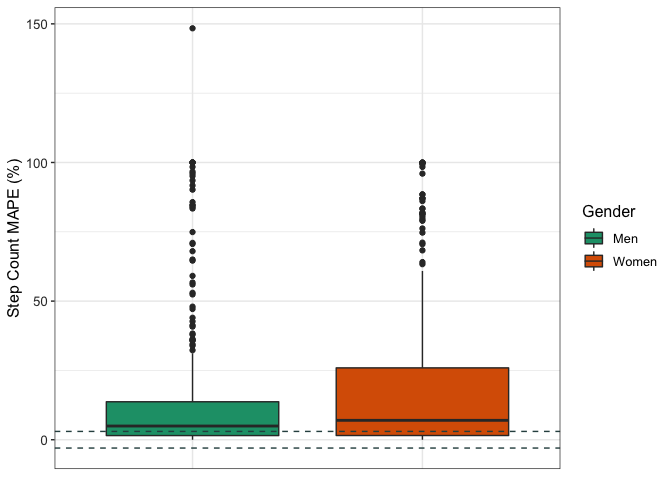

```r
df <- read.csv("wearable_review_data_validity_edited.csv")
head(df)
```

<div class="kable-table">

| X1|Author    | Year|Substudy |Setting    |Measured |Measure_Unit |Brand |Device         |device_name          | device_year|Wear_Location |Wear_Info     |Type      |Good. |Criterion_Measure                         |Criterion_Type |Wear_Info_crit |Wear_Location_crit |population_n |population_m |population_f |population     |age_code |health_code |age   | age_SD|weight | weight_SD|height | height_SD|BMI   | BMI_SD|location |activity_type |test_type |activity_type_code |body_Motion |pace_code |pace_value |incline_code |incline_pct |activity_details                                                                                |bout_rest |epoch              | actual_n_analyzed|trend                                                                                                                                                           |CC_type |   CC|CC_bins |CC_all | CC_CI_pct|CC_CI_upper |CC_CI_lower |CC_pvalue |CC_significance |ES_type   |    ES| ES_CI_upper| ES_CI_lower|BA_LoA_upper |BA_LoA_lower | BA_LoA_width| devicemean| devicemean_SD| critmean| critmean_SD|device_v_crit |meandiff | meandiff_SD| meandiff_CI_upper| meandiff_CI_lower|        MPE|MPE_bin |MPE_SD |MPE_significance_test |MPE_significance_num | MAD| MAD_SD| MAD_CI_upper| MAD_CI_lower|   MAPE|MAPE_bin | MAPE_SD| MAPE_CI_upper| MAPE_CI_lower| RMSE|equivalencetesting | accuracypct| accuracypct_CI_upper| accuracypct_CI_lower| TEEstandardized| TEEstandardized_CI_upper| TEEstandardized_CI_lower| deviceSE| deviceCofV| critCofV|n_5pctofcrit |n_10pctofcrit |n_15pctofcrit | n_20pctofcrit| n_25pctofcrit| systematicbias_slope| systematicbias_intercept|systematicbias_probability |systematicbias_significance |Other |
|--:|:---------|----:|:--------|:----------|:--------|:------------|:-----|:--------------|:--------------------|-----------:|:-------------|:-------------|:---------|:-----|:-----------------------------------------|:--------------|:--------------|:------------------|:------------|:------------|:------------|:--------------|:--------|:-----------|:-----|------:|:------|---------:|:------|---------:|:-----|------:|:--------|:-------------|:---------|:------------------|:-----------|:---------|:----------|:------------|:-----------|:-----------------------------------------------------------------------------------------------|:---------|:------------------|-----------------:|:---------------------------------------------------------------------------------------------------------------------------------------------------------------|:-------|----:|:-------|:------|---------:|:-----------|:-----------|:---------|:---------------|:---------|-----:|-----------:|-----------:|:------------|:------------|------------:|----------:|-------------:|--------:|-----------:|:-------------|:--------|-----------:|-----------------:|-----------------:|----------:|:-------|:------|:---------------------|:--------------------|---:|------:|------------:|------------:|------:|:--------|-------:|-------------:|-------------:|----:|:------------------|-----------:|--------------------:|--------------------:|---------------:|------------------------:|------------------------:|--------:|----------:|--------:|:------------|:-------------|:-------------|-------------:|-------------:|--------------------:|------------------------:|:--------------------------|:---------------------------|:-----|
|  1|Dooley    | 2017|-        |Controlled |HR       |bpm          |Apple |Watch          |Apple Watch          |        2015|Wrist         |wrist, random |full-text |y     |Heart rate sensor chest strap (Polar T31) |chest strap    |chest          |Torso              |62           |26           |36           |healthy adults |A        |H           |22.55 |   4.34|72.02  |     18.99|170    |     11.00|24.6  |   4.77|TX, USA  |Rest: Seated  |Rest      |Se                 |NA          |NA        |NA         |N            |NA          |sedentary, seated baseline assessment, 10 min, HR assessed 3.5 minutes into each activity stage |yes       |unknown            |                62|good validity                                                                                                                                                   |NA      |   NA|NA      |NA     |        NA|NA          |NA          |NA        |NA              |Cohen's d |  0.04|          NA|          NA|NA           |NA           |           NA|      72.84|         12.08|    72.32|       12.21|over          |NA       |          NA|                NA|                NA|  0.0071903|± 3%    |NA     |0.78                  |ns                   |  NA|     NA|           NA|           NA| 0.0276|less 3%  |      NA|            NA|            NA|   NA|NA                 |          NA|                   NA|                   NA|              NA|                       NA|                       NA|       NA|         NA|       NA|NA           |NA            |NA            |            NA|            NA|                   NA|                       NA|NA                         |NA                          |NA    |
|  2|Dooley    | 2017|-        |Controlled |HR       |bpm          |Apple |Watch          |Apple Watch          |        2015|Wrist         |wrist, random |full-text |y     |Heart rate sensor chest strap (Polar T31) |chest strap    |chest          |Torso              |62           |26           |36           |healthy adults |A        |H           |22.55 |   4.34|72.02  |     18.99|170    |     11.00|24.6  |   4.77|TX, USA  |Rest: Seated  |Rest      |Se                 |NA          |NA        |NA         |N            |NA          |sedentary, seated baseline assessment, 10 min, HR assessed 3.5 minutes into each activity stage |yes       |unknown            |                62|good validity                                                                                                                                                   |NA      |   NA|NA      |NA     |        NA|NA          |NA          |NA        |NA              |Cohen's d |  0.01|          NA|          NA|NA           |NA           |           NA|      73.07|         11.45|    72.99|       11.30|over          |NA       |          NA|                NA|                NA|  0.0010960|± 3%    |NA     |0.76                  |ns                   |  NA|     NA|           NA|           NA| 0.0163|less 3%  |      NA|            NA|            NA|   NA|NA                 |          NA|                   NA|                   NA|              NA|                       NA|                       NA|       NA|         NA|       NA|NA           |NA            |NA            |            NA|            NA|                   NA|                       NA|NA                         |NA                          |NA    |
|  3|Dooley    | 2017|-        |Controlled |HR       |bpm          |Apple |Watch          |Apple Watch          |        2015|Wrist         |wrist, random |full-text |y     |Heart rate sensor chest strap (Polar T31) |chest strap    |chest          |Torso              |62           |26           |36           |healthy adults |A        |H           |22.55 |   4.34|72.02  |     18.99|170    |     11.00|24.6  |   4.77|TX, USA  |Rest: Seated  |Rest      |Se                 |NA          |NA        |NA         |N            |NA          |rest, seated recovery period, 10 min, HR assessed 3.5 minutes into each activity stage          |no        |unknown            |                62|underestimate                                                                                                                                                   |NA      |   NA|NA      |NA     |        NA|NA          |NA          |NA        |NA              |Cohen's d | -0.03|          NA|          NA|NA           |NA           |           NA|      84.02|         15.27|    84.47|       15.16|under         |NA       |          NA|                NA|                NA| -0.0053273|± 3%    |NA     |< .001                |sig                  |  NA|     NA|           NA|           NA| 0.0114|less 3%  |      NA|            NA|            NA|   NA|NA                 |          NA|                   NA|                   NA|              NA|                       NA|                       NA|       NA|         NA|       NA|NA           |NA            |NA            |            NA|            NA|                   NA|                       NA|NA                         |NA                          |NA    |
|  4|Boudreaux | 2018|-        |Controlled |HR       |bpm          |Apple |Watch Series 2 |Apple Watch Series 2 |        2016|Wrist         |wrist, random |full-text |y     |Electrocardiography (Quinton Q4500)       |ECG            |upper torso    |Torso              |50           |22           |28           |healthy adults |A        |H           |22.71 |   2.99|67.79  |     14.01|162.71 |      5.79|25.83 |   4.83|LA, USA  |Rest: Seated  |Rest      |Se                 |NA          |NA        |NA         |N            |NA          |rest, 5 min, mean of session                                                                    |NA        |average of session |                50|Across all devices, as exercise intensity increased, there was greater underestimation of HR. No device was valid for EE during cycling or resistance exercise. |ICC     | 0.99|VS      |0.99   |        NA|NA          |NA          |NA        |NA              |NA        |    NA|          NA|          NA|NA           |NA           |           NA|         NA|            NA|       NA|          NA|equal         |0.04     |        1.71|             -3.31|              3.39|         NA|NA      |NA     |NA                    |NA                   |  NA|     NA|           NA|           NA| 0.0121|less 3%  |      NA|            NA|            NA|   NA|NA                 |          NA|                   NA|                   NA|              NA|                       NA|                       NA|       NA|         NA|       NA|NA           |NA            |NA            |            NA|            NA|                   NA|                       NA|NA                         |NA                          |NA    |
|  5|Boudreaux | 2018|-        |Controlled |HR       |bpm          |Apple |Watch Series 2 |Apple Watch Series 2 |        2016|Wrist         |wrist, random |full-text |y     |Electrocardiography (Quinton Q4500)       |ECG            |upper torso    |Torso              |50           |22           |28           |healthy adults |A        |H           |22.71 |   2.99|67.79  |     14.01|162.71 |      5.79|25.83 |   4.83|LA, USA  |Rest: Seated  |Rest      |Se                 |NA          |NA        |NA         |N            |NA          |rest, 5 min, mean of session                                                                    |NA        |average of session |                50|Across all devices, as exercise intensity increased, there was greater underestimation of HR. No device was valid for EE during cycling or resistance exercise. |ICC     | 0.82|VS      |0.82   |        NA|NA          |NA          |NA        |NA              |NA        |    NA|          NA|          NA|NA           |NA           |           NA|         NA|            NA|       NA|          NA|equal         |0.02     |        1.71|             -3.33|              3.37|         NA|NA      |NA     |NA                    |NA                   |  NA|     NA|           NA|           NA| 0.0144|less 3%  |      NA|            NA|            NA|   NA|NA                 |          NA|                   NA|                   NA|              NA|                       NA|                       NA|       NA|         NA|       NA|NA           |NA            |NA            |            NA|            NA|                   NA|                       NA|NA                         |NA                          |NA    |
|  6|Boudreaux | 2018|-        |Controlled |HR       |bpm          |Apple |Watch Series 2 |Apple Watch Series 2 |        2016|Wrist         |wrist, random |full-text |y     |Electrocardiography (Quinton Q4500)       |ECG            |upper torso    |Torso              |50           |22           |28           |healthy adults |A        |H           |22.71 |   2.99|67.79  |     14.01|162.71 |      5.79|25.83 |   4.83|LA, USA  |Cycle         |Activity  |Mi                 |Mi          |NA        |NA         |N            |NA          |cycling, graded exercise test, 50W, 2 min, mean of intensity                                    |NA        |6 time points      |                50|Across all devices, as exercise intensity increased, there was greater underestimation of HR. No device was valid for EE during cycling or resistance exercise. |ICC     | 0.90|VS      |0.9    |        NA|NA          |NA          |NA        |NA              |NA        |    NA|          NA|          NA|NA           |NA           |           NA|         NA|            NA|       NA|          NA|over          |1.28     |        8.55|            -15.46|             18.03|         NA|NA      |NA     |NA                    |NA                   |  NA|     NA|           NA|           NA| 0.0299|less 3%  |      NA|            NA|            NA|   NA|NA                 |          NA|                   NA|                   NA|              NA|                       NA|                       NA|       NA|         NA|       NA|NA           |NA            |NA            |            NA|            NA|                   NA|                       NA|NA                         |NA                          |NA    |

</div>


```r
summary(df$MPE)
```

```
##     Min.  1st Qu.   Median     Mean  3rd Qu.     Max.     NA's 
## -1.00000 -0.10583 -0.01450 -0.04315  0.01396  5.30000      294
```

```r
df$MPE[is.na(df$MPE)] <- (((df$devicemean - df$critmean)/df$critmean))
```

```
## Warning in df$MPE[is.na(df$MPE)] <- (((df$devicemean - df$critmean)/
## df$critmean)): number of items to replace is not a multiple of replacement
## length
```

```r
summary(df$MPE)
```

```
##     Min.  1st Qu.   Median     Mean  3rd Qu.     Max.     NA's 
## -1.00000 -0.09365 -0.01152 -0.03549  0.01493  5.30000       98
```

## Data Cleaning 


```r
data <- df %>%
  select(Brand, device_name, Measured, Setting, age_code, BMI, population_m, population_f, MPE)
str(data)
```

```
## 'data.frame':	1672 obs. of  9 variables:
##  $ Brand       : chr  "Apple" "Apple" "Apple" "Apple" ...
##  $ device_name : chr  "Apple Watch" "Apple Watch" "Apple Watch" "Apple Watch Series 2" ...
##  $ Measured    : chr  "HR" "HR" "HR" "HR" ...
##  $ Setting     : chr  "Controlled" "Controlled" "Controlled" "Controlled" ...
##  $ age_code    : chr  "A" "A" "A" "A" ...
##  $ BMI         : chr  "24.6" "24.6" "24.6" "25.83" ...
##  $ population_m: chr  "26" "26" "26" "22" ...
##  $ population_f: chr  "36" "36" "36" "28" ...
##  $ MPE         : num  0.00719 0.0011 -0.00533 0.00719 0.0011 ...
```


```r
data$age_code <- as.factor(data$age_code)
data$Measured <- as.factor(data$Measured)
data$Setting <- as.factor(data$Setting)
data$population_f <- as.numeric(data$population_f)
```

```
## Warning: NAs introduced by coercion
```

```r
data$population_m <- as.numeric(data$population_m)
```

```
## Warning: NAs introduced by coercion
```

```r
data$BMI <- as.numeric(data$BMI)
```

```
## Warning: NAs introduced by coercion
```

```r
str(data)
```

```
## 'data.frame':	1672 obs. of  9 variables:
##  $ Brand       : chr  "Apple" "Apple" "Apple" "Apple" ...
##  $ device_name : chr  "Apple Watch" "Apple Watch" "Apple Watch" "Apple Watch Series 2" ...
##  $ Measured    : Factor w/ 3 levels "EE","HR","SC": 2 2 2 2 2 2 3 3 3 3 ...
##  $ Setting     : Factor w/ 2 levels "Controlled","Free-Living": 1 1 1 1 1 1 1 1 1 1 ...
##  $ age_code    : Factor w/ 3 levels "A","C","OA": 1 1 1 1 1 1 1 1 1 1 ...
##  $ BMI         : num  24.6 24.6 24.6 25.8 25.8 ...
##  $ population_m: num  26 26 26 22 22 22 16 16 16 16 ...
##  $ population_f: num  36 36 36 28 28 28 15 15 15 15 ...
##  $ MPE         : num  0.00719 0.0011 -0.00533 0.00719 0.0011 ...
```

## Data Cleaning by Variable

### MPE (Outcome Variable)


```r
#convert to percentage
data <- data %>%
  mutate(mpe_percent = MPE*100)

summary(data)
```

```
##     Brand           device_name        Measured         Setting     age_code 
##  Length:1672        Length:1672        EE: 334   Controlled :1561   A :1411  
##  Class :character   Class :character   HR: 271   Free-Living: 111   C :  28  
##  Mode  :character   Mode  :character   SC:1067                      OA: 233  
##                                                                              
##                                                                              
##                                                                              
##                                                                              
##       BMI         population_m    population_f        MPE          
##  Min.   :20.50   Min.   : 0.00   Min.   : 0.00   Min.   :-1.00000  
##  1st Qu.:23.40   1st Qu.: 8.00   1st Qu.: 9.50   1st Qu.:-0.09365  
##  Median :24.60   Median :12.00   Median :12.00   Median :-0.01152  
##  Mean   :24.55   Mean   :14.98   Mean   :14.44   Mean   :-0.03549  
##  3rd Qu.:25.83   3rd Qu.:19.00   3rd Qu.:18.00   3rd Qu.: 0.01493  
##  Max.   :30.80   Max.   :91.00   Max.   :96.00   Max.   : 5.30000  
##  NA's   :662     NA's   :33      NA's   :33      NA's   :98        
##   mpe_percent      
##  Min.   :-100.000  
##  1st Qu.:  -9.365  
##  Median :  -1.152  
##  Mean   :  -3.549  
##  3rd Qu.:   1.493  
##  Max.   : 530.000  
##  NA's   :98
```


```r
data <- data %>% drop_na(mpe_percent)
```


```r
summary(data)
```

```
##     Brand           device_name        Measured         Setting     age_code 
##  Length:1574        Length:1574        EE: 331   Controlled :1468   A :1321  
##  Class :character   Class :character   HR: 236   Free-Living: 106   C :  28  
##  Mode  :character   Mode  :character   SC:1007                      OA: 225  
##                                                                              
##                                                                              
##                                                                              
##                                                                              
##       BMI         population_m    population_f        MPE          
##  Min.   :20.50   Min.   : 0.00   Min.   : 0.00   Min.   :-1.00000  
##  1st Qu.:23.40   1st Qu.: 8.00   1st Qu.:10.00   1st Qu.:-0.09365  
##  Median :24.60   Median :12.00   Median :12.00   Median :-0.01152  
##  Mean   :24.55   Mean   :14.88   Mean   :14.29   Mean   :-0.03549  
##  3rd Qu.:25.83   3rd Qu.:19.00   3rd Qu.:16.00   3rd Qu.: 0.01493  
##  Max.   :30.80   Max.   :91.00   Max.   :96.00   Max.   : 5.30000  
##  NA's   :615     NA's   :28      NA's   :28                        
##   mpe_percent      
##  Min.   :-100.000  
##  1st Qu.:  -9.365  
##  Median :  -1.152  
##  Mean   :  -3.549  
##  3rd Qu.:   1.493  
##  Max.   : 530.000  
## 
```


```r
mpe_hist <- ggplot(data, aes(mpe_percent)) + 
                  geom_histogram(bins = 25) +
                  theme_classic()
plot(mpe_hist)
```

<!-- -->


```r
mpe_box <- ggplot(data, aes(mpe_percent)) + 
                geom_boxplot() +
                coord_flip() +
                theme_classic()
plot(mpe_box)
```

<!-- -->


```r
#creating a dataframe containing the extreme outliers
df_out <- data %>%
  identify_outliers("mpe_percent") %>%
        filter(is.extreme == TRUE)
```


```r
#merging the outlier dataframe with our original data
total <- merge(data, df_out, all.x = TRUE)
#renaming those not extreme as FALSE instead of NA
total$is.extreme[is.na(total$is.extreme)] <- FALSE
table(total$is.extreme)
```

```
## 
## FALSE  TRUE 
##  1380   214
```


```r
#subsetting the non-outliers in the data
df <- subset(total, is.extreme != TRUE)
```


```r
summary(df)
```

```
##     Brand           device_name        Measured        Setting     age_code 
##  Length:1380        Length:1380        EE:258   Controlled :1286   A :1172  
##  Class :character   Class :character   HR:234   Free-Living:  94   C :  28  
##  Mode  :character   Mode  :character   SC:888                      OA: 180  
##                                                                             
##                                                                             
##                                                                             
##                                                                             
##       BMI         population_m    population_f        MPE           
##  Min.   :20.50   Min.   : 0.00   Min.   : 0.00   Min.   :-0.419310  
##  1st Qu.:23.10   1st Qu.: 9.00   1st Qu.:10.00   1st Qu.:-0.069250  
##  Median :24.40   Median :12.00   Median :12.00   Median :-0.010871  
##  Mean   :24.46   Mean   :14.84   Mean   :14.17   Mean   :-0.034387  
##  3rd Qu.:25.83   3rd Qu.:18.00   3rd Qu.:16.00   3rd Qu.: 0.008448  
##  Max.   :30.80   Max.   :91.00   Max.   :96.00   Max.   : 0.338415  
##  NA's   :523     NA's   :26      NA's   :26                         
##   mpe_percent       is.outlier     is.extreme     
##  Min.   :-41.9310   Mode:logical   Mode :logical  
##  1st Qu.: -6.9250   NA's:1380      FALSE:1380     
##  Median : -1.0872                                 
##  Mean   : -3.4387                                 
##  3rd Qu.:  0.8448                                 
##  Max.   : 33.8415                                 
## 
```

```r
round(stat.desc(df$mpe_percent),2)
```

```
##      nbr.val     nbr.null       nbr.na          min          max        range 
##      1380.00        66.00         0.00       -41.93        33.84        75.77 
##          sum       median         mean      SE.mean CI.mean.0.95          var 
##     -4745.43        -1.09        -3.44         0.32         0.63       143.01 
##      std.dev     coef.var 
##        11.96        -3.48
```


```r
mpe_hist_clean <- ggplot(df, aes(mpe_percent)) + 
                  geom_histogram(bins = 30) +
                  theme_classic()
plot(mpe_hist_clean)
```

<!-- -->


```r
mpe_box_clean <- ggplot(df, aes(mpe_percent)) + 
                  geom_boxplot() +
                  coord_flip() +
                  theme_classic()

plot(mpe_box_clean)
```

<!-- -->

### AGE


```r
levels(df$age_code) <- c("Adults", "Children", "Older Adults")
levels(df$age_code)
```

```
## [1] "Adults"       "Children"     "Older Adults"
```


### SEX


```r
df <- df %>%
        mutate(sex = case_when(
                population_m > population_f ~ "Male",
                population_m < population_f ~ "Female"
        ))
```


```r
df$sex <- as.factor(df$sex)
summary(df)
```

```
##     Brand           device_name        Measured        Setting    
##  Length:1380        Length:1380        EE:258   Controlled :1286  
##  Class :character   Class :character   HR:234   Free-Living:  94  
##  Mode  :character   Mode  :character   SC:888                     
##                                                                   
##                                                                   
##                                                                   
##                                                                   
##          age_code         BMI         population_m    population_f  
##  Adults      :1172   Min.   :20.50   Min.   : 0.00   Min.   : 0.00  
##  Children    :  28   1st Qu.:23.10   1st Qu.: 9.00   1st Qu.:10.00  
##  Older Adults: 180   Median :24.40   Median :12.00   Median :12.00  
##                      Mean   :24.46   Mean   :14.84   Mean   :14.17  
##                      3rd Qu.:25.83   3rd Qu.:18.00   3rd Qu.:16.00  
##                      Max.   :30.80   Max.   :91.00   Max.   :96.00  
##                      NA's   :523     NA's   :26      NA's   :26     
##       MPE             mpe_percent       is.outlier     is.extreme     
##  Min.   :-0.419310   Min.   :-41.9310   Mode:logical   Mode :logical  
##  1st Qu.:-0.069250   1st Qu.: -6.9250   NA's:1380      FALSE:1380     
##  Median :-0.010871   Median : -1.0872                                 
##  Mean   :-0.034387   Mean   : -3.4387                                 
##  3rd Qu.: 0.008448   3rd Qu.:  0.8448                                 
##  Max.   : 0.338415   Max.   : 33.8415                                 
##                                                                       
##      sex     
##  Female:531  
##  Male  :489  
##  NA's  :360  
##              
##              
##              
## 
```

```r
df_sex <- drop_na(df, sex)
```

### BMI


```r
df <- df_sex %>%
        mutate(bmi_code = case_when(
                BMI >= 18.5 & BMI <= 24.9 ~ "Healthy weight",
                BMI > 24.9 & BMI <= 29.9 ~ "Overweight",
                BMI > 29.9 ~ "Obese"
        ))
```


```r
df$bmi_code <- as.factor(df$bmi_code)
df <- drop_na(df, bmi_code)
summary(df)
```

```
##     Brand           device_name        Measured        Setting   
##  Length:660         Length:660         EE:119   Controlled :602  
##  Class :character   Class :character   HR:133   Free-Living: 58  
##  Mode  :character   Mode  :character   SC:408                    
##                                                                  
##                                                                  
##                                                                  
##          age_code        BMI         population_m    population_f  
##  Adults      :593   Min.   :20.50   Min.   : 0.00   Min.   : 0.00  
##  Children    :  4   1st Qu.:23.40   1st Qu.: 9.00   1st Qu.:10.00  
##  Older Adults: 63   Median :24.41   Median :17.00   Median :14.00  
##                     Mean   :24.50   Mean   :16.45   Mean   :16.85  
##                     3rd Qu.:25.60   3rd Qu.:21.00   3rd Qu.:22.00  
##                     Max.   :30.80   Max.   :89.00   Max.   :96.00  
##       MPE             mpe_percent       is.outlier     is.extreme     
##  Min.   :-0.419310   Min.   :-41.9310   Mode:logical   Mode :logical  
##  1st Qu.:-0.062152   1st Qu.: -6.2152   NA's:660       FALSE:660      
##  Median :-0.008063   Median : -0.8063                                 
##  Mean   :-0.027284   Mean   : -2.7284                                 
##  3rd Qu.: 0.015532   3rd Qu.:  1.5532                                 
##  Max.   : 0.327402   Max.   : 32.7402                                 
##      sex                bmi_code  
##  Female:353   Healthy weight:415  
##  Male  :307   Obese         :  2  
##               Overweight    :243  
##                                   
##                                   
## 
```


```r
#relevel factors
df$age_code <- fct_relevel(df$age_code, c("Children","Adults","Older Adults"))
df$bmi_code <- fct_relevel(df$bmi_code, c("Healthy weight","Overweight","Obese"))
```

## MPE for Step count, heart rate & energy expenditure across different groups


```r
#AGE GROUP
df %>%
    group_by(age_code, Measured) %>%
    get_summary_stats(mpe_percent, type = "mean_sd") %>%
    arrange(Measured)
```

<div class="kable-table">

|Measured |age_code     |variable    |   n|    mean|     sd|
|:--------|:------------|:-----------|---:|-------:|------:|
|EE       |Adults       |mpe_percent | 118|  -7.157| 18.199|
|EE       |Older Adults |mpe_percent |   1|   9.241|     NA|
|HR       |Children     |mpe_percent |   1|   0.100|     NA|
|HR       |Adults       |mpe_percent | 132|  -1.015|  6.574|
|SC       |Children     |mpe_percent |   3| -15.109| 18.513|
|SC       |Adults       |mpe_percent | 343|  -0.636|  8.904|
|SC       |Older Adults |mpe_percent |  62|  -9.161| 12.688|

</div>


```r
#SEX GROUP
df %>%
    group_by(sex, Measured) %>%
    get_summary_stats(mpe_percent, type = "mean_sd") %>%
    arrange(Measured)
```

<div class="kable-table">

|Measured |sex    |variable    |   n|   mean|     sd|
|:--------|:------|:-----------|---:|------:|------:|
|EE       |Female |mpe_percent |  48| -6.140| 17.405|
|EE       |Male   |mpe_percent |  71| -7.614| 18.790|
|HR       |Female |mpe_percent |  74| -1.357|  7.411|
|HR       |Male   |mpe_percent |  59| -0.568|  5.307|
|SC       |Female |mpe_percent | 231| -2.232| 10.785|
|SC       |Male   |mpe_percent | 177| -1.785|  9.286|

</div>


```r
#BMI GROUP
df %>%
    group_by(bmi_code, Measured) %>%
    get_summary_stats(mpe_percent, type = "mean_sd") %>%
    arrange(Measured)
```

<div class="kable-table">

|Measured |bmi_code       |variable    |   n|    mean|     sd|
|:--------|:--------------|:-----------|---:|-------:|------:|
|EE       |Healthy weight |mpe_percent |  80|  -9.868| 17.250|
|EE       |Overweight     |mpe_percent |  39|  -1.176| 18.867|
|HR       |Healthy weight |mpe_percent |  72|  -2.100|  8.039|
|HR       |Overweight     |mpe_percent |  61|   0.284|  3.845|
|SC       |Healthy weight |mpe_percent | 263|   0.240|  8.582|
|SC       |Overweight     |mpe_percent | 143|  -6.065| 11.331|
|SC       |Obese          |mpe_percent |   2| -13.618| 21.753|

</div>

## PLOTS

### Filtering the data by Measured


```r
val_data_sc <- filter(df, Measured == "SC")
val_data_hr <- filter(df, Measured == "HR")
val_data_ee <- filter(df, Measured == "EE")
```


### Validity of Step count by Age

* Dashed grey lines indicate ± 3% (in controlled settings) and ± 10% (in free-living settings) measurement error


```r
#options(repr.plot.width = 25, repr.plot.height = 8)
age_sc_plot <- ggplot(val_data_sc, aes(x = 1, y = mpe_percent, colour = age_code)) +
                    geom_boxplot(na.rm = TRUE) +
                    geom_beeswarm(dodge.width = 0.2, cex = 0.2, alpha = 0.08, groupOnX = TRUE, na.rm = TRUE) +   
                    geom_hline(yintercept = 0) +  
                    geom_hline(yintercept = 10, size = 0.5, colour = "darkslategray", linetype = "dashed") +
                    geom_hline(yintercept = -10, size = 0.5, colour = "darkslategray", linetype = "dashed") +
                    geom_hline(yintercept = 3, size = 0.5, colour = "darkslategray", linetype = "dashed") + 
                    geom_hline(yintercept = -3, size = 0.5, colour = "darkslategray", linetype = "dashed") +   
                    scale_y_continuous(limits=c(-13, 13)) +
                    ylab("Step Count MPE (%)") +
                    scale_colour_brewer(palette="Dark2") +
  facet_wrap(~ Setting) +
                    theme_bw() +
                    theme(axis.text.x = element_blank(),
                          axis.title.x = element_blank(),
                          axis.ticks.x = element_blank(),
                        axis.text.y = element_text(colour = "grey20", size = 10),
                        strip.text = element_text(face = "italic"),
                        text = element_text(size = 12)) 
plot(age_sc_plot)
```

```
## Warning: Removed 45 rows containing missing values (position_beeswarm).
```

```
## Warning: Removed 15 rows containing missing values (position_beeswarm).
```

<!-- -->
### Validity of step count by Sex


```r
sex_sc_plot <- ggplot(val_data_sc, aes(x = 1, y = mpe_percent, colour = sex)) +
                    geom_boxplot(na.rm = TRUE) +
                    geom_beeswarm(dodge.width = 0.2, cex = 0.2, alpha = 0.08, groupOnX = TRUE, na.rm = TRUE) +   
                    geom_hline(yintercept = 0) +  
                    geom_hline(yintercept = 10, size = 0.5, colour = "darkslategray", linetype = "dashed") +
                    geom_hline(yintercept = -10, size = 0.5, colour = "darkslategray", linetype = "dashed") +
                    geom_hline(yintercept = 3, size = 0.5, colour = "darkslategray", linetype = "dashed") + 
                    geom_hline(yintercept = -3, size = 0.5, colour = "darkslategray", linetype = "dashed") +   
                    scale_y_continuous(limits=c(-13, 13)) +
                    ylab("Step Count MPE (%)") +
                    scale_colour_brewer(palette="Dark2") +
  facet_wrap(~ Setting) +
                    theme_bw() +
                    theme(axis.text.x = element_blank(),
                          axis.title.x = element_blank(),
                          axis.ticks.x = element_blank(),
                        axis.text.y = element_text(colour = "grey20", size = 10),
                        strip.text = element_text(face = "italic"),
                        text = element_text(size = 12)) 
plot(sex_sc_plot)
```

```
## Warning: Removed 45 rows containing missing values (position_beeswarm).
```

```
## Warning: Removed 15 rows containing missing values (position_beeswarm).
```

<!-- -->

### Validity of step count by BMI


```r
bmi_sc_plot <- ggplot(val_data_sc, aes(x = 1, y = mpe_percent, colour = bmi_code)) +
                    geom_boxplot(na.rm = TRUE) +
                    geom_beeswarm(dodge.width = 0.2, cex = 0.2, alpha = 0.08, groupOnX = TRUE, na.rm = TRUE) +   
                    geom_hline(yintercept = 0) +  
                    geom_hline(yintercept = 10, size = 0.5, colour = "darkslategray", linetype = "dashed") +
                    geom_hline(yintercept = -10, size = 0.5, colour = "darkslategray", linetype = "dashed") +
                    geom_hline(yintercept = 3, size = 0.5, colour = "darkslategray", linetype = "dashed") + 
                    geom_hline(yintercept = -3, size = 0.5, colour = "darkslategray", linetype = "dashed") +   
                    scale_y_continuous(limits=c(-13, 13)) +
                    ylab("Step Count MPE (%)") +
                    scale_colour_brewer(palette="Dark2") +
  facet_wrap(~ Setting) +
                    theme_bw() +
                    theme(axis.text.x = element_blank(),
                          axis.title.x = element_blank(),
                          axis.ticks.x = element_blank(),
                        axis.text.y = element_text(colour = "grey20", size = 10),
                        strip.text = element_text(face = "italic"),
                        text = element_text(size = 12)) 
plot(bmi_sc_plot)
```

```
## Warning: Removed 45 rows containing missing values (position_beeswarm).
```

```
## Warning: Removed 15 rows containing missing values (position_beeswarm).
```

<!-- -->

### Validity of Heart rate by Age

* Dashed grey lines indicate ± 3% (in controlled settings) and ± 10% (in free-living settings) measurement error


```r
age_hr_plot <- ggplot(val_data_hr, aes(x = 1, y = mpe_percent, colour = age_code)) +
                    geom_boxplot(na.rm = TRUE) +
                    geom_beeswarm(dodge.width = 0.2, cex = 0.2, alpha = 0.08, groupOnX = TRUE, na.rm = TRUE) +   
                    geom_hline(yintercept = 0) +  
                    geom_hline(yintercept = 10, size = 0.5, colour = "darkslategray", linetype = "dashed") +
                    geom_hline(yintercept = -10, size = 0.5, colour = "darkslategray", linetype = "dashed") +
                    geom_hline(yintercept = 3, size = 0.5, colour = "darkslategray", linetype = "dashed") + 
                    geom_hline(yintercept = -3, size = 0.5, colour = "darkslategray", linetype = "dashed") +   
                    scale_y_continuous(limits=c(-13, 13)) +
                    ylab("Heart rate MPE (%)") +
                    scale_colour_brewer(palette="Dark2") +
  facet_wrap(~ Setting) +
                    theme_bw() +
                    theme(axis.text.x = element_blank(),
                          axis.title.x = element_blank(),
                          axis.ticks.x = element_blank(),
                        axis.text.y = element_text(colour = "grey20", size = 10),
                        strip.text = element_text(face = "italic"),
                        text = element_text(size = 12)) 
plot(age_hr_plot)
```

```
## Warning: Removed 9 rows containing missing values (position_beeswarm).
```

<!-- -->

### Validity of heart rate by sex


```r
sex_hr_plot <- ggplot(val_data_hr, aes(x = 1, y = mpe_percent, colour = sex)) +
                    geom_boxplot(na.rm = TRUE) +
                    geom_beeswarm(dodge.width = 0.2, cex = 0.2, alpha = 0.08, groupOnX = TRUE, na.rm = TRUE) +   
                    geom_hline(yintercept = 0) +  
                    geom_hline(yintercept = 10, size = 0.5, colour = "darkslategray", linetype = "dashed") +
                    geom_hline(yintercept = -10, size = 0.5, colour = "darkslategray", linetype = "dashed") +
                    geom_hline(yintercept = 3, size = 0.5, colour = "darkslategray", linetype = "dashed") + 
                    geom_hline(yintercept = -3, size = 0.5, colour = "darkslategray", linetype = "dashed") +   
                    scale_y_continuous(limits=c(-13, 13)) +
                    ylab("Heart rate MPE (%)") +
                    scale_colour_brewer(palette="Dark2") +
  facet_wrap(~ Setting) +
                    theme_bw() +
                    theme(axis.text.x = element_blank(),
                          axis.title.x = element_blank(),
                          axis.ticks.x = element_blank(),
                        axis.text.y = element_text(colour = "grey20", size = 10),
                        strip.text = element_text(face = "italic"),
                        text = element_text(size = 12)) 
plot(sex_hr_plot)
```

```
## Warning: Removed 9 rows containing missing values (position_beeswarm).
```

<!-- -->

### Validity of heart rate by BMI


```r
bmi_hr_plot <- ggplot(val_data_hr, aes(x = 1, y = mpe_percent, colour = bmi_code)) +
                    geom_boxplot(na.rm = TRUE) +
                    geom_beeswarm(dodge.width = 0.2, cex = 0.2, alpha = 0.08, groupOnX = TRUE, na.rm = TRUE) +   
                    geom_hline(yintercept = 0) +  
                    geom_hline(yintercept = 10, size = 0.5, colour = "darkslategray", linetype = "dashed") +
                    geom_hline(yintercept = -10, size = 0.5, colour = "darkslategray", linetype = "dashed") +
                    geom_hline(yintercept = 3, size = 0.5, colour = "darkslategray", linetype = "dashed") + 
                    geom_hline(yintercept = -3, size = 0.5, colour = "darkslategray", linetype = "dashed") +   
                    scale_y_continuous(limits=c(-13, 13)) +
                    ylab("Heart rate MPE (%)") +
                    scale_colour_brewer(palette="Dark2") +
  facet_wrap(~ Setting) +
                    theme_bw() +
                    theme(axis.text.x = element_blank(),
                          axis.title.x = element_blank(),
                          axis.ticks.x = element_blank(),
                        axis.text.y = element_text(colour = "grey20", size = 10),
                        strip.text = element_text(face = "italic"),
                        text = element_text(size = 12)) 
plot(bmi_hr_plot)
```

```
## Warning: Removed 9 rows containing missing values (position_beeswarm).
```

<!-- -->

### Validity of Energy expenditure by Age

* Dashed grey lines indicate ± 3% (in controlled settings) and ± 10% (in free-living settings) measurement error


```r
age_ee_plot <- ggplot(val_data_ee, aes(x = 1, y = mpe_percent, colour = age_code)) +
                    geom_boxplot(na.rm = TRUE) +
                    geom_beeswarm(dodge.width = 0.2, cex = 0.2, alpha = 0.08, groupOnX = TRUE, na.rm = TRUE) +   
                    geom_hline(yintercept = 0) +  
                    geom_hline(yintercept = 10, size = 0.5, colour = "darkslategray", linetype = "dashed") +
                    geom_hline(yintercept = -10, size = 0.5, colour = "darkslategray", linetype = "dashed") +
                    geom_hline(yintercept = 3, size = 0.5, colour = "darkslategray", linetype = "dashed") + 
                    geom_hline(yintercept = -3, size = 0.5, colour = "darkslategray", linetype = "dashed") +   
                    scale_y_continuous(limits=c(-13, 13)) +
                    ylab("Energy expenditure MPE (%)") +
                    scale_colour_brewer(palette="Dark2") +
                    facet_wrap(~ Setting) +
                    theme_bw() +
                    theme(axis.text.x = element_blank(),
                          axis.title.x = element_blank(),
                          axis.ticks.x = element_blank(),
                        axis.text.y = element_text(colour = "grey20", size = 10),
                        strip.text = element_text(face = "italic"),
                        text = element_text(size = 12)) 
plot(age_ee_plot)
```

```
## Warning: Removed 51 rows containing missing values (position_beeswarm).
```

```
## Warning: Removed 5 rows containing missing values (position_beeswarm).
```

<!-- -->
### Validity of energy expenditure by sex


```r
sex_ee_plot <- ggplot(val_data_ee, aes(x = 1, y = mpe_percent, colour = sex)) +
                    geom_boxplot(na.rm = TRUE) +
                    geom_beeswarm(dodge.width = 0.2, cex = 0.2, alpha = 0.08, groupOnX = TRUE, na.rm = TRUE) +   
                    geom_hline(yintercept = 0) +  
                    geom_hline(yintercept = 10, size = 0.5, colour = "darkslategray", linetype = "dashed") +
                    geom_hline(yintercept = -10, size = 0.5, colour = "darkslategray", linetype = "dashed") +
                    geom_hline(yintercept = 3, size = 0.5, colour = "darkslategray", linetype = "dashed") + 
                    geom_hline(yintercept = -3, size = 0.5, colour = "darkslategray", linetype = "dashed") +   
                    scale_y_continuous(limits=c(-13, 13)) +
                    ylab("Energy expenditure MPE (%)") +
                    scale_colour_brewer(palette="Dark2") +
                    theme_bw() +
                    facet_wrap(~ Setting) +
                    theme(axis.text.x = element_blank(),
                          axis.title.x = element_blank(),
                          axis.ticks.x = element_blank(),
                        axis.text.y = element_text(colour = "grey20", size = 10),
                        strip.text = element_text(face = "italic"),
                        text = element_text(size = 12))
plot(sex_ee_plot)
```

```
## Warning: Removed 51 rows containing missing values (position_beeswarm).
```

```
## Warning: Removed 5 rows containing missing values (position_beeswarm).
```

<!-- -->

### Validity of energy expenditure by BMI


```r
bmi_ee_plot <- ggplot(val_data_ee, aes(x =1, y = mpe_percent, colour = bmi_code)) +
                    geom_boxplot(na.rm = TRUE) +
                    geom_beeswarm(dodge.width = 0.2, cex = 0.2, alpha = 0.08, groupOnX = TRUE, na.rm = TRUE) +   
                    geom_hline(yintercept = 0) +  
                    geom_hline(yintercept = 10, size = 0.5, colour = "darkslategray", linetype = "dashed") +
                    geom_hline(yintercept = -10, size = 0.5, colour = "darkslategray", linetype = "dashed") +
                    geom_hline(yintercept = 3, size = 0.5, colour = "darkslategray", linetype = "dashed") + 
                    geom_hline(yintercept = -3, size = 0.5, colour = "darkslategray", linetype = "dashed") +   
                    scale_y_continuous(limits=c(-13, 13)) +
                    ylab("Energy Expenditure MPE (%)") +
                    scale_colour_brewer(palette="Dark2") +
  facet_wrap(~ Setting) +
                    theme_bw() +
                    theme(axis.text.x = element_blank(),
                          axis.title.x = element_blank(),
                          axis.ticks.x = element_blank(),
                        axis.text.y = element_text(colour = "grey20", size = 10),
                        strip.text = element_text(face = "italic"),
                        text = element_text(size = 12))
plot(bmi_ee_plot)
```

```
## Warning: Removed 51 rows containing missing values (position_beeswarm).
```

```
## Warning: Removed 5 rows containing missing values (position_beeswarm).
```

<!-- -->


```r
figure1 <- plot_grid(age_sc_plot, sex_sc_plot, bmi_sc_plot, labels = c('Age','Sex','BMI'), label_size = 12)
```

```
## Warning: Removed 45 rows containing missing values (position_beeswarm).
```

```
## Warning: Removed 15 rows containing missing values (position_beeswarm).
```

```
## Warning: Removed 45 rows containing missing values (position_beeswarm).
```

```
## Warning: Removed 15 rows containing missing values (position_beeswarm).
```

```
## Warning: Removed 45 rows containing missing values (position_beeswarm).
```

```
## Warning: Removed 15 rows containing missing values (position_beeswarm).
```

```r
figure2 <- plot_grid(age_ee_plot, sex_ee_plot, bmi_ee_plot, labels = c('Age','Sex','BMI'), label_size = 12)
```

```
## Warning: Removed 51 rows containing missing values (position_beeswarm).
```

```
## Warning: Removed 5 rows containing missing values (position_beeswarm).
```

```
## Warning: Removed 51 rows containing missing values (position_beeswarm).
```

```
## Warning: Removed 5 rows containing missing values (position_beeswarm).
```

```
## Warning: Removed 51 rows containing missing values (position_beeswarm).
```

```
## Warning: Removed 5 rows containing missing values (position_beeswarm).
```

```r
figure3 <- plot_grid(age_hr_plot, sex_hr_plot, bmi_hr_plot, labels = c('Age','Sex','BMI'), label_size = 12)
```

```
## Warning: Removed 9 rows containing missing values (position_beeswarm).
```

```
## Warning: Removed 9 rows containing missing values (position_beeswarm).

## Warning: Removed 9 rows containing missing values (position_beeswarm).
```


```r
ggsave("SC-figure.pdf", plot = figure1, width = 10, height = 7)
ggsave("EE-figure.pdf", plot = figure2, width = 10, height = 7)
ggsave("HR-figure.pdf", plot = figure3, width = 10, height = 7)
```


## ANOVA

### Step count validity with Age, Sex & BMI


```r
aov_sc_age <- aov(mpe_percent ~ age_code, data = val_data_sc)
summary(aov_sc_age)
```

```
##              Df Sum Sq Mean Sq F value   Pr(>F)    
## age_code      2   4333  2166.3   23.32 2.59e-10 ***
## Residuals   405  37619    92.9                     
## ---
## Signif. codes:  0 '***' 0.001 '**' 0.01 '*' 0.05 '.' 0.1 ' ' 1
```


```r
aov_sc_sex <- aov(mpe_percent ~ sex, data = val_data_sc)
summary(aov_sc_sex)
```

```
##              Df Sum Sq Mean Sq F value Pr(>F)
## sex           1     20    20.0   0.194   0.66
## Residuals   406  41931   103.3
```


```r
aov_sc_bmi <- aov(mpe_percent ~ bmi_code, data = val_data_sc)
summary(aov_sc_bmi)
```

```
##              Df Sum Sq Mean Sq F value   Pr(>F)    
## bmi_code      2   3952  1975.9   21.06 1.99e-09 ***
## Residuals   405  38000    93.8                     
## ---
## Signif. codes:  0 '***' 0.001 '**' 0.01 '*' 0.05 '.' 0.1 ' ' 1
```

### Energy Expenditure validity with Age, Sex & BMI


```r
aov_ee_age <- aov(mpe_percent ~ age_code, data = val_data_ee)
summary(aov_ee_age)
```

```
##              Df Sum Sq Mean Sq F value Pr(>F)
## age_code      1    267   266.6   0.805  0.371
## Residuals   117  38749   331.2
```


```r
aov_ee_sex <- aov(mpe_percent ~ sex, data = val_data_ee)
summary(aov_ee_sex)
```

```
##              Df Sum Sq Mean Sq F value Pr(>F)
## sex           1     62    62.2   0.187  0.666
## Residuals   117  38954   332.9
```


```r
aov_ee_bmi <- aov(mpe_percent ~ bmi_code, data = val_data_ee)
summary(aov_ee_bmi)
```

```
##              Df Sum Sq Mean Sq F value Pr(>F)  
## bmi_code      1   1981  1981.1   6.259 0.0137 *
## Residuals   117  37035   316.5                 
## ---
## Signif. codes:  0 '***' 0.001 '**' 0.01 '*' 0.05 '.' 0.1 ' ' 1
```

### Heart Rate validity with Age, Sex & BMI


```r
aov_hr_age <- aov(mpe_percent ~ age_code, data = val_data_hr)
summary(aov_hr_age)
```

```
##              Df Sum Sq Mean Sq F value Pr(>F)
## age_code      1      1    1.23   0.029  0.866
## Residuals   131   5662   43.22
```


```r
aov_hr_sex <- aov(mpe_percent ~ sex, data = val_data_hr)
summary(aov_hr_sex)
```

```
##              Df Sum Sq Mean Sq F value Pr(>F)
## sex           1     20   20.44   0.475  0.492
## Residuals   131   5642   43.07
```


```r
aov_hr_bmi <- aov(mpe_percent ~ bmi_code, data = val_data_hr)
summary(aov_hr_bmi)
```

```
##              Df Sum Sq Mean Sq F value Pr(>F)  
## bmi_code      1    188   187.7    4.49  0.036 *
## Residuals   131   5475    41.8                 
## ---
## Signif. codes:  0 '***' 0.001 '**' 0.01 '*' 0.05 '.' 0.1 ' ' 1
```

## Post Hoc Test


```r
tuk_sc_age <- TukeyHSD(aov_sc_age)
tuk_sc_age
```

```
##   Tukey multiple comparisons of means
##     95% family-wise confidence level
## 
## Fit: aov(formula = mpe_percent ~ age_code, data = val_data_sc)
## 
## $age_code
##                            diff        lwr       upr     p adj
## Adults-Children       14.472914   1.326452 27.619377 0.0268437
## Older Adults-Children  5.947673  -7.454609 19.349955 0.5495901
## Older Adults-Adults   -8.525242 -11.653936 -5.396547 0.0000000
```


```r
tuk_sc_bmi <- TukeyHSD(aov_sc_bmi)
tuk_sc_bmi
```

```
##   Tukey multiple comparisons of means
##     95% family-wise confidence level
## 
## Fit: aov(formula = mpe_percent ~ bmi_code, data = val_data_sc)
## 
## $bmi_code
##                                 diff        lwr       upr     p adj
## Overweight-Healthy weight  -6.304779  -8.672244 -3.937313 0.0000000
## Obese-Healthy weight      -13.857841 -30.031064  2.315383 0.1097432
## Obese-Overweight           -7.553062 -23.777419  8.671295 0.5176423
```


```r
tuk_ee_bmi <- TukeyHSD(aov_ee_bmi)
tuk_ee_bmi
```

```
##   Tukey multiple comparisons of means
##     95% family-wise confidence level
## 
## Fit: aov(formula = mpe_percent ~ bmi_code, data = val_data_ee)
## 
## $bmi_code
##                               diff      lwr      upr     p adj
## Overweight-Healthy weight 8.692698 1.811401 15.57399 0.0137395
```

## Regression Analysis

### Step Count


```r
sc_reg1 <- lm(mpe_percent ~ age_code, val_data_sc)
summary(sc_reg1)
```

```
## 
## Call:
## lm(formula = mpe_percent ~ age_code, data = val_data_sc)
## 
## Residuals:
##     Min      1Q  Median      3Q     Max 
## -34.323  -3.849   0.636   4.102  32.018 
## 
## Coefficients:
##                      Estimate Std. Error t value Pr(>|t|)   
## (Intercept)           -15.109      5.564  -2.715  0.00690 **
## age_codeAdults         14.473      5.589   2.590  0.00995 **
## age_codeOlder Adults    5.948      5.697   1.044  0.29714   
## ---
## Signif. codes:  0 '***' 0.001 '**' 0.01 '*' 0.05 '.' 0.1 ' ' 1
## 
## Residual standard error: 9.638 on 405 degrees of freedom
## Multiple R-squared:  0.1033,	Adjusted R-squared:  0.09885 
## F-statistic: 23.32 on 2 and 405 DF,  p-value: 2.589e-10
```

```r
sc_reg2 <- lm(mpe_percent ~ sex, val_data_sc)
summary(sc_reg2)
```

```
## 
## Call:
## lm(formula = mpe_percent ~ sex, data = val_data_sc)
## 
## Residuals:
##     Min      1Q  Median      3Q     Max 
## -38.168  -3.394   1.447   3.504  33.614 
## 
## Coefficients:
##             Estimate Std. Error t value Pr(>|t|)    
## (Intercept)  -2.2318     0.6687  -3.338 0.000922 ***
## sexMale       0.4467     1.0152   0.440 0.660163    
## ---
## Signif. codes:  0 '***' 0.001 '**' 0.01 '*' 0.05 '.' 0.1 ' ' 1
## 
## Residual standard error: 10.16 on 406 degrees of freedom
## Multiple R-squared:  0.0004766,	Adjusted R-squared:  -0.001985 
## F-statistic: 0.1936 on 1 and 406 DF,  p-value: 0.6602
```

```r
sc_reg3 <- lm(mpe_percent ~ bmi_code, val_data_sc)
summary(sc_reg3)
```

```
## 
## Call:
## lm(formula = mpe_percent ~ bmi_code, data = val_data_sc)
## 
## Residuals:
##     Min      1Q  Median      3Q     Max 
## -36.717  -3.667  -0.118   4.887  37.447 
## 
## Coefficients:
##                    Estimate Std. Error t value Pr(>|t|)    
## (Intercept)          0.2397     0.5973   0.401   0.6884    
## bmi_codeOverweight  -6.3048     1.0064  -6.265 9.56e-10 ***
## bmi_codeObese      -13.8578     6.8753  -2.016   0.0445 *  
## ---
## Signif. codes:  0 '***' 0.001 '**' 0.01 '*' 0.05 '.' 0.1 ' ' 1
## 
## Residual standard error: 9.686 on 405 degrees of freedom
## Multiple R-squared:  0.0942,	Adjusted R-squared:  0.08972 
## F-statistic: 21.06 on 2 and 405 DF,  p-value: 1.992e-09
```

```r
confint(sc_reg1)
```

```
##                           2.5 %    97.5 %
## (Intercept)          -26.047610 -4.170415
## age_codeAdults         3.486584 25.459245
## age_codeOlder Adults  -5.252442 17.147788
```

```r
confint(sc_reg2)
```

```
##                 2.5 %     97.5 %
## (Intercept) -3.546258 -0.9173508
## sexMale     -1.548978  2.4423611
```

```r
confint(sc_reg3)
```

```
##                         2.5 %     97.5 %
## (Intercept)         -0.934499  1.4138485
## bmi_codeOverweight  -8.283239 -4.3263184
## bmi_codeObese      -27.373596 -0.3420856
```

### Energy Expenditure


```r
ee_reg1 <- lm(mpe_percent ~ age_code, val_data_ee)
summary(ee_reg1)
```

```
## 
## Call:
## lm(formula = mpe_percent ~ age_code, data = val_data_ee)
## 
## Residuals:
##     Min      1Q  Median      3Q     Max 
## -34.774 -12.410   1.602  11.247  39.898 
## 
## Coefficients:
##                      Estimate Std. Error t value Pr(>|t|)    
## (Intercept)            -7.157      1.675  -4.272 3.96e-05 ***
## age_codeOlder Adults   16.398     18.276   0.897    0.371    
## ---
## Signif. codes:  0 '***' 0.001 '**' 0.01 '*' 0.05 '.' 0.1 ' ' 1
## 
## Residual standard error: 18.2 on 117 degrees of freedom
## Multiple R-squared:  0.006834,	Adjusted R-squared:  -0.001654 
## F-statistic: 0.8051 on 1 and 117 DF,  p-value: 0.3714
```

```r
ee_reg2 <- lm(mpe_percent ~ sex, val_data_ee)
summary(ee_reg2)
```

```
## 
## Call:
## lm(formula = mpe_percent ~ sex, data = val_data_ee)
## 
## Residuals:
##     Min      1Q  Median      3Q     Max 
## -35.791 -11.954   1.552  12.248  40.354 
## 
## Coefficients:
##             Estimate Std. Error t value Pr(>|t|)  
## (Intercept)   -6.140      2.634  -2.331   0.0214 *
## sexMale       -1.474      3.410  -0.432   0.6664  
## ---
## Signif. codes:  0 '***' 0.001 '**' 0.01 '*' 0.05 '.' 0.1 ' ' 1
## 
## Residual standard error: 18.25 on 117 degrees of freedom
## Multiple R-squared:  0.001594,	Adjusted R-squared:  -0.006939 
## F-statistic: 0.1868 on 1 and 117 DF,  p-value: 0.6664
```

```r
ee_reg3 <- lm(mpe_percent ~ bmi_code, val_data_ee)
summary(ee_reg3)
```

```
## 
## Call:
## lm(formula = mpe_percent ~ bmi_code, data = val_data_ee)
## 
## Residuals:
##     Min      1Q  Median      3Q     Max 
## -39.160 -11.155   2.196   9.818  42.168 
## 
## Coefficients:
##                    Estimate Std. Error t value Pr(>|t|)    
## (Intercept)          -9.868      1.989  -4.961  2.4e-06 ***
## bmi_codeOverweight    8.693      3.475   2.502   0.0137 *  
## ---
## Signif. codes:  0 '***' 0.001 '**' 0.01 '*' 0.05 '.' 0.1 ' ' 1
## 
## Residual standard error: 17.79 on 117 degrees of freedom
## Multiple R-squared:  0.05078,	Adjusted R-squared:  0.04267 
## F-statistic: 6.259 on 1 and 117 DF,  p-value: 0.01374
```

```r
confint(ee_reg1)
```

```
##                          2.5 %    97.5 %
## (Intercept)          -10.47522 -3.839471
## age_codeOlder Adults -19.79548 52.592021
```

```r
confint(ee_reg2)
```

```
##                  2.5 %     97.5 %
## (Intercept) -11.356114 -0.9244595
## sexMale      -8.226233  5.2788575
```

```r
confint(ee_reg3)
```

```
##                         2.5 %    97.5 %
## (Intercept)        -13.807804 -5.929022
## bmi_codeOverweight   1.811401 15.573995
```

### Heart Rate


```r
hr_reg1 <- lm(mpe_percent ~ age_code, val_data_hr)
summary(hr_reg1)
```

```
## 
## Call:
## lm(formula = mpe_percent ~ age_code, data = val_data_hr)
## 
## Residuals:
##      Min       1Q   Median       3Q      Max 
## -21.4850  -1.8402   0.4239   1.7341  19.4164 
## 
## Coefficients:
##                Estimate Std. Error t value Pr(>|t|)
## (Intercept)      0.0995     6.5741   0.015    0.988
## age_codeAdults  -1.1145     6.5989  -0.169    0.866
## 
## Residual standard error: 6.574 on 131 degrees of freedom
## Multiple R-squared:  0.0002177,	Adjusted R-squared:  -0.007414 
## F-statistic: 0.02853 on 1 and 131 DF,  p-value: 0.8661
```

```r
hr_reg2 <- lm(mpe_percent ~ sex, val_data_hr)
summary(hr_reg2)
```

```
## 
## Call:
## lm(formula = mpe_percent ~ sex, data = val_data_hr)
## 
## Residuals:
##      Min       1Q   Median       3Q      Max 
## -21.1433  -1.7324   0.5676   1.7223  19.7581 
## 
## Coefficients:
##             Estimate Std. Error t value Pr(>|t|)  
## (Intercept)  -1.3567     0.7629  -1.778   0.0777 .
## sexMale       0.7891     1.1455   0.689   0.4921  
## ---
## Signif. codes:  0 '***' 0.001 '**' 0.01 '*' 0.05 '.' 0.1 ' ' 1
## 
## Residual standard error: 6.563 on 131 degrees of freedom
## Multiple R-squared:  0.00361,	Adjusted R-squared:  -0.003996 
## F-statistic: 0.4746 on 1 and 131 DF,  p-value: 0.4921
```

```r
hr_reg3 <- lm(mpe_percent ~ bmi_code, val_data_hr)
summary(hr_reg3)
```

```
## 
## Call:
## lm(formula = mpe_percent ~ bmi_code, data = val_data_hr)
## 
## Residuals:
##      Min       1Q   Median       3Q      Max 
## -20.4000  -2.4592  -0.2839   2.2593  20.5013 
## 
## Coefficients:
##                    Estimate Std. Error t value Pr(>|t|)   
## (Intercept)         -2.1000     0.7619  -2.756  0.00668 **
## bmi_codeOverweight   2.3838     1.1250   2.119  0.03598 * 
## ---
## Signif. codes:  0 '***' 0.001 '**' 0.01 '*' 0.05 '.' 0.1 ' ' 1
## 
## Residual standard error: 6.465 on 131 degrees of freedom
## Multiple R-squared:  0.03314,	Adjusted R-squared:  0.02576 
## F-statistic:  4.49 on 1 and 131 DF,  p-value: 0.03598
```

```r
confint(hr_reg1)
```

```
##                    2.5 %   97.5 %
## (Intercept)    -12.90561 13.10462
## age_codeAdults -14.16881 11.93976
```

```r
confint(hr_reg2)
```

```
##                 2.5 %    97.5 %
## (Intercept) -2.865959 0.1525348
## sexMale     -1.476864 3.0551390
```

```r
confint(hr_reg3)
```

```
##                         2.5 %     97.5 %
## (Intercept)        -3.6072093 -0.5927636
## bmi_codeOverweight  0.1582902  4.6094006
```


