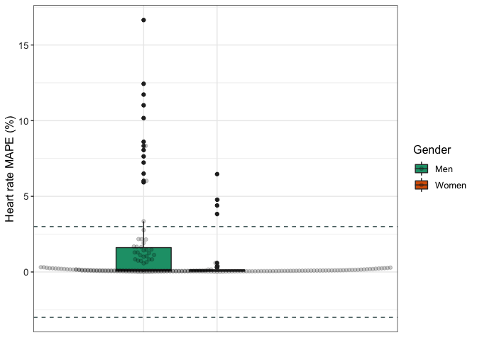
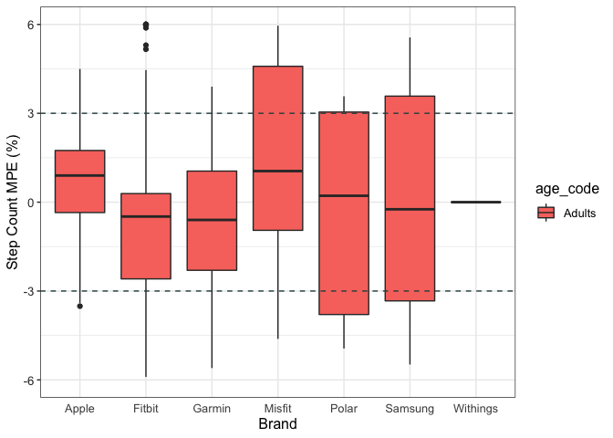

```r
df <- read.csv("val_data.csv")
df <- df[,-1]
```


```r
summary(df$MPE)
```

```
##     Min.  1st Qu.   Median     Mean  3rd Qu.     Max.     NA's 
## -1.00000 -0.10583 -0.01450 -0.04315  0.01396  5.30000      294
```

## Data Cleaning 


```r
data <- df %>%
  select(Author, Year, Brand, device_name, device_year, location, Measured, Setting, Wear_Location, age, age_code, BMI, population_n, population_m, population_f, MPE)
str(data)
```

```
## 'data.frame':	1672 obs. of  16 variables:
##  $ Author       : chr  "Dooley" "Dooley" "Dooley" "Boudreaux" ...
##  $ Year         : int  2017 2017 2017 2018 2018 2018 2017 2017 2017 2017 ...
##  $ Brand        : chr  "Apple" "Apple" "Apple" "Apple" ...
##  $ device_name  : chr  "Apple Watch" "Apple Watch" "Apple Watch" "Apple Watch Series 2" ...
##  $ device_year  : int  2015 2015 2015 2016 2016 2016 2015 2015 2015 2015 ...
##  $ location     : chr  "TX, USA" "TX, USA" "TX, USA" "LA, USA" ...
##  $ Measured     : chr  "HR" "HR" "HR" "HR" ...
##  $ Setting      : chr  "Controlled" "Controlled" "Controlled" "Controlled" ...
##  $ Wear_Location: chr  "Wrist" "Wrist" "Wrist" "Wrist" ...
##  $ age          : chr  "22.55" "22.55" "22.55" "22.71" ...
##  $ age_code     : chr  "A" "A" "A" "A" ...
##  $ BMI          : chr  "24.6" "24.6" "24.6" "25.83" ...
##  $ population_n : chr  "62" "62" "62" "50" ...
##  $ population_m : chr  "26" "26" "26" "22" ...
##  $ population_f : chr  "36" "36" "36" "28" ...
##  $ MPE          : num  0.00719 0.0011 -0.00533 NA NA ...
```


```r
data$age_code <- as.factor(data$age_code)
data$Brand <- as.factor(data$Brand)
data$Measured <- as.factor(data$Measured)
data$Setting <- as.factor(data$Setting)
data$Wear_Location <- as.factor(data$Wear_Location)
data$population_f <- as.numeric(data$population_f)
```

```
## Warning: NAs introduced by coercion
```

```r
data$population_m <- as.numeric(data$population_m)
```

```
## Warning: NAs introduced by coercion
```

```r
data$BMI <- as.numeric(data$BMI)
```

```
## Warning: NAs introduced by coercion
```

```r
data$age <- as.numeric(data$age)
```

```
## Warning: NAs introduced by coercion
```

```r
data$population_n <- as.numeric(data$population_n)
```

```
## Warning: NAs introduced by coercion
```

```r
str(data)
```

```
## 'data.frame':	1672 obs. of  16 variables:
##  $ Author       : chr  "Dooley" "Dooley" "Dooley" "Boudreaux" ...
##  $ Year         : int  2017 2017 2017 2018 2018 2018 2017 2017 2017 2017 ...
##  $ Brand        : Factor w/ 9 levels "Apple","Fitbit",..: 1 1 1 1 1 1 1 1 1 1 ...
##  $ device_name  : chr  "Apple Watch" "Apple Watch" "Apple Watch" "Apple Watch Series 2" ...
##  $ device_year  : int  2015 2015 2015 2016 2016 2016 2015 2015 2015 2015 ...
##  $ location     : chr  "TX, USA" "TX, USA" "TX, USA" "LA, USA" ...
##  $ Measured     : Factor w/ 3 levels "EE","HR","SC": 2 2 2 2 2 2 3 3 3 3 ...
##  $ Setting      : Factor w/ 2 levels "Controlled","Free-Living": 1 1 1 1 1 1 1 1 1 1 ...
##  $ Wear_Location: Factor w/ 6 levels "LAF","Thigh",..: 6 6 6 6 6 6 6 6 6 6 ...
##  $ age          : num  22.6 22.6 22.6 22.7 22.7 ...
##  $ age_code     : Factor w/ 3 levels "A","C","OA": 1 1 1 1 1 1 1 1 1 1 ...
##  $ BMI          : num  24.6 24.6 24.6 25.8 25.8 ...
##  $ population_n : num  62 62 62 50 50 50 31 31 31 31 ...
##  $ population_m : num  26 26 26 22 22 22 16 16 16 16 ...
##  $ population_f : num  36 36 36 28 28 28 15 15 15 15 ...
##  $ MPE          : num  0.00719 0.0011 -0.00533 NA NA ...
```

## Data Cleaning by Variable

### MPE (Outcome Variable)


```r
#convert to percentage
data <- data %>%
  mutate(mpe_percent = MPE*100)

summary(data)
```

```
##     Author               Year           Brand     device_name       
##  Length:1672        Min.   :2013   Fitbit  :961   Length:1672       
##  Class :character   1st Qu.:2016   Garmin  :282   Class :character  
##  Mode  :character   Median :2017   Withings:134   Mode  :character  
##                     Mean   :2017   Apple   :131                     
##                     3rd Qu.:2018   Polar   : 67                     
##                     Max.   :2019   Misfit  : 50                     
##                                    (Other) : 47                     
##   device_year     location         Measured         Setting    
##  Min.   :2008   Length:1672        EE: 334   Controlled :1561  
##  1st Qu.:2013   Class :character   HR: 271   Free-Living: 111  
##  Median :2014   Mode  :character   SC:1067                     
##  Mean   :2014                                                  
##  3rd Qu.:2015                                                  
##  Max.   :2016                                                  
##  NA's   :3                                                     
##    Wear_Location       age        age_code       BMI         population_n   
##  LAF      :  69   Min.   : 3.69   A :1411   Min.   :20.50   Min.   : 10.00  
##  Thigh    :   1   1st Qu.:23.60   C :  28   1st Qu.:23.40   1st Qu.: 19.00  
##  Torso    : 111   Median :30.80   OA: 233   Median :24.60   Median : 25.00  
##  Upper Arm:   6   Mean   :34.22             Mean   :24.55   Mean   : 29.38  
##  Waist/Hip: 389   3rd Qu.:35.80             3rd Qu.:25.83   3rd Qu.: 35.00  
##  Wrist    :1096   Max.   :87.00             Max.   :30.80   Max.   :185.00  
##                   NA's   :364               NA's   :767     NA's   :8       
##   population_m    population_f        MPE            mpe_percent      
##  Min.   : 0.00   Min.   : 0.00   Min.   :-1.00000   Min.   :-100.000  
##  1st Qu.: 8.00   1st Qu.: 9.50   1st Qu.:-0.10583   1st Qu.: -10.582  
##  Median :12.00   Median :12.00   Median :-0.01450   Median :  -1.450  
##  Mean   :14.98   Mean   :14.44   Mean   :-0.04315   Mean   :  -4.315  
##  3rd Qu.:19.00   3rd Qu.:18.00   3rd Qu.: 0.01396   3rd Qu.:   1.396  
##  Max.   :91.00   Max.   :96.00   Max.   : 5.30000   Max.   : 530.000  
##  NA's   :33      NA's   :33      NA's   :294        NA's   :294
```


```r
mpe_hist <- ggplot(data, aes(mpe_percent)) + 
                  geom_histogram(bins = 25) +
                  theme_classic()
plot(mpe_hist)
```

```
## Warning: Removed 294 rows containing non-finite values (stat_bin).
```

<!-- -->


```r
mpe_box <- ggplot(data, aes(mpe_percent)) + 
                geom_boxplot() +
                coord_flip() +
                theme_classic()
plot(mpe_box)
```

```
## Warning: Removed 294 rows containing non-finite values (stat_boxplot).
```

<!-- -->


```r
#creating a dataframe containing the extreme outliers
df_out <- data %>%
  identify_outliers("mpe_percent") %>%
        filter(is.outlier == TRUE)
```


```r
#merging the outlier dataframe with our original data
total <- merge(data, df_out, all.x = TRUE)
#renaming those not outliers as FALSE instead of NA
total$is.outlier[is.na(total$is.outlier)] <- FALSE
table(total$is.outlier)
```

```
## 
## FALSE  TRUE 
##  1388   290
```


```r
#subsetting the non-outliers in the data
df <- subset(total, is.outlier != TRUE)
```


```r
df <- df[-c(18:19)]
summary(df)
```

```
##     Author               Year           Brand     device_name       
##  Length:1388        Min.   :2013   Fitbit  :802   Length:1388       
##  Class :character   1st Qu.:2016   Garmin  :245   Class :character  
##  Mode  :character   Median :2017   Apple   :114   Mode  :character  
##                     Mean   :2017   Withings: 96                     
##                     3rd Qu.:2018   Polar   : 50                     
##                     Max.   :2019   Misfit  : 36                     
##                                    (Other) : 45                     
##   device_year     location         Measured        Setting       Wear_Location
##  Min.   :2008   Length:1388        EE:206   Controlled :1303   LAF      : 53  
##  1st Qu.:2013   Class :character   HR:271   Free-Living:  85   Thigh    :  0  
##  Median :2014   Mode  :character   SC:911                      Torso    : 84  
##  Mean   :2014                                                  Upper Arm:  6  
##  3rd Qu.:2015                                                  Waist/Hip:328  
##  Max.   :2016                                                  Wrist    :917  
##  NA's   :2                                                                    
##       age        age_code       BMI         population_n     population_m  
##  Min.   : 3.69   A :1186   Min.   :20.50   Min.   : 10.00   Min.   : 0.00  
##  1st Qu.:23.50   C :  26   1st Qu.:23.40   1st Qu.: 19.00   1st Qu.: 8.00  
##  Median :29.93   OA: 176   Median :24.60   Median : 26.00   Median :12.00  
##  Mean   :33.64             Mean   :24.46   Mean   : 29.24   Mean   :14.96  
##  3rd Qu.:35.80             3rd Qu.:25.83   3rd Qu.: 35.00   3rd Qu.:18.00  
##  Max.   :87.00             Max.   :30.80   Max.   :185.00   Max.   :91.00  
##  NA's   :317               NA's   :625     NA's   :7        NA's   :32     
##   population_f        MPE            mpe_percent      
##  Min.   : 0.00   Min.   :-0.27510   Min.   :-27.5100  
##  1st Qu.:10.00   1st Qu.:-0.06032   1st Qu.: -6.0323  
##  Median :12.00   Median :-0.01100   Median : -1.1000  
##  Mean   :14.31   Mean   :-0.02893   Mean   : -2.8933  
##  3rd Qu.:18.00   3rd Qu.: 0.00432   3rd Qu.:  0.4317  
##  Max.   :96.00   Max.   : 0.18964   Max.   : 18.9645  
##  NA's   :32      NA's   :294        NA's   :294
```

```r
round(stat.desc(df$mpe_percent),2)
```

```
##      nbr.val     nbr.null       nbr.na          min          max        range 
##      1094.00        56.00       294.00       -27.51        18.96        46.47 
##          sum       median         mean      SE.mean CI.mean.0.95          var 
##     -3165.33        -1.10        -2.89         0.25         0.49        67.01 
##      std.dev     coef.var 
##         8.19        -2.83
```


```r
df <- df %>% drop_na(mpe_percent)
```


```r
mpe_hist_clean <- ggplot(df, aes(mpe_percent)) + 
                  geom_histogram(bins = 30) +
                  theme_classic()
plot(mpe_hist_clean)
```

<!-- -->


```r
mpe_box_clean <- ggplot(df, aes(mpe_percent)) + 
                  geom_boxplot() +
                  coord_flip() +
                  theme_classic()

plot(mpe_box_clean)
```

<!-- -->

### AGE


```r
levels(df$age_code) <- c("Adults", "Children", "Older Adults")
levels(df$age_code)
```

```
## [1] "Adults"       "Children"     "Older Adults"
```


### SEX


```r
df <- df %>%
        mutate(sex = case_when(
                population_m > population_f ~ "Male",
                population_m < population_f ~ "Female"
        ))
```


```r
df$sex <- as.factor(df$sex)

df_sex <- drop_na(df, sex)
summary(df_sex)
```

```
##     Author               Year           Brand     device_name       
##  Length:789         Min.   :2013   Fitbit  :459   Length:789        
##  Class :character   1st Qu.:2016   Garmin  :142   Class :character  
##  Mode  :character   Median :2017   Apple   : 69   Mode  :character  
##                     Mean   :2017   Withings: 54                     
##                     3rd Qu.:2018   Misfit  : 22                     
##                     Max.   :2019   Polar   : 18                     
##                                    (Other) : 25                     
##   device_year     location         Measured        Setting      Wear_Location
##  Min.   :2008   Length:789         EE:136   Controlled :734   LAF      : 49  
##  1st Qu.:2013   Class :character   HR:157   Free-Living: 55   Thigh    :  0  
##  Median :2014   Mode  :character   SC:496                     Torso    : 48  
##  Mean   :2014                                                 Upper Arm:  0  
##  3rd Qu.:2015                                                 Waist/Hip:189  
##  Max.   :2016                                                 Wrist    :503  
##  NA's   :2                                                                   
##       age                age_code        BMI         population_n   
##  Min.   : 3.69   Adults      :614   Min.   :20.50   Min.   : 10.00  
##  1st Qu.:23.50   Children    : 21   1st Qu.:23.20   1st Qu.: 18.00  
##  Median :27.50   Older Adults:154   Median :24.60   Median : 23.00  
##  Mean   :34.56                      Mean   :24.47   Mean   : 29.33  
##  3rd Qu.:33.00                      3rd Qu.:25.60   3rd Qu.: 33.00  
##  Max.   :87.00                      Max.   :30.80   Max.   :185.00  
##  NA's   :153                        NA's   :363                     
##   population_m    population_f        MPE            mpe_percent     
##  Min.   : 0.00   Min.   : 0.00   Min.   :-0.27510   Min.   :-27.510  
##  1st Qu.: 8.00   1st Qu.: 8.00   1st Qu.:-0.06667   1st Qu.: -6.667  
##  Median :12.00   Median :12.00   Median :-0.01130   Median : -1.130  
##  Mean   :15.55   Mean   :13.78   Mean   :-0.02900   Mean   : -2.900  
##  3rd Qu.:20.00   3rd Qu.:15.00   3rd Qu.: 0.01200   3rd Qu.:  1.200  
##  Max.   :91.00   Max.   :96.00   Max.   : 0.18964   Max.   : 18.964  
##                                                                      
##      sex     
##  Female:371  
##  Male  :418  
##              
##              
##              
##              
## 
```

### BMI


```r
df <- df_sex %>%
        mutate(bmi_code = case_when(
                BMI >= 18.5 & BMI <= 24.9 ~ "Healthy weight",
                BMI > 24.9 & BMI <= 29.9 ~ "Overweight",
                BMI > 29.9 ~ "Obese"
        ))
```


```r
df$bmi_code <- as.factor(df$bmi_code)
df <- drop_na(df, bmi_code)
summary(df)
```

```
##     Author               Year           Brand     device_name       
##  Length:426         Min.   :2013   Fitbit  :236   Length:426        
##  Class :character   1st Qu.:2017   Garmin  : 75   Class :character  
##  Mode  :character   Median :2017   Apple   : 47   Mode  :character  
##                     Mean   :2017   Withings: 26                     
##                     3rd Qu.:2018   Misfit  : 15                     
##                     Max.   :2019   Samsung : 13                     
##                                    (Other) : 14                     
##   device_year     location         Measured        Setting      Wear_Location
##  Min.   :2008   Length:426         EE: 82   Controlled :401   LAF      : 13  
##  1st Qu.:2013   Class :character   HR: 78   Free-Living: 25   Thigh    :  0  
##  Median :2014   Mode  :character   SC:266                     Torso    : 28  
##  Mean   :2014                                                 Upper Arm:  0  
##  3rd Qu.:2015                                                 Waist/Hip: 96  
##  Max.   :2016                                                 Wrist    :289  
##                                                                              
##       age                age_code        BMI         population_n   
##  Min.   : 8.21   Adults      :371   Min.   :20.50   Min.   : 10.00  
##  1st Qu.:23.50   Children    :  1   1st Qu.:23.20   1st Qu.: 20.00  
##  Median :27.50   Older Adults: 54   Median :24.60   Median : 30.00  
##  Mean   :34.85                      Mean   :24.47   Mean   : 32.11  
##  3rd Qu.:32.00                      3rd Qu.:25.60   3rd Qu.: 39.00  
##  Max.   :87.00                      Max.   :30.80   Max.   :130.00  
##  NA's   :6                                                          
##   population_m    population_f        MPE             mpe_percent      
##  Min.   : 0.00   Min.   : 0.00   Min.   :-0.275100   Min.   :-27.5100  
##  1st Qu.: 9.00   1st Qu.: 9.00   1st Qu.:-0.060501   1st Qu.: -6.0501  
##  Median :16.00   Median :13.00   Median :-0.008755   Median : -0.8755  
##  Mean   :16.25   Mean   :15.85   Mean   :-0.023137   Mean   : -2.3137  
##  3rd Qu.:20.00   3rd Qu.:16.00   3rd Qu.: 0.017802   3rd Qu.:  1.7802  
##  Max.   :74.00   Max.   :75.00   Max.   : 0.189645   Max.   : 18.9645  
##                                                                        
##      sex                bmi_code  
##  Female:177   Healthy weight:267  
##  Male  :249   Obese         :  1  
##               Overweight    :158  
##                                   
##                                   
##                                   
## 
```


```r
table(df$location)
```

```
## 
##          AZ, USA          BC, CAN          Belgium          CA, USA 
##                4               11                3               11 
##            China          CO, USA   Czech Republic          DE, USA 
##               24                3                3                2 
##          Denmark          FL, USA          IA, USA          IO, USA 
##               10               15                2                9 
##          Ireland            Italy            Korea          LA, USA 
##               19                1                4                3 
##          MA, USA          MD, USA          MI, USA          MN, USA 
##                6                2               47                9 
##          NC, USA      Netherlands          NL, CAN         NSW, AUS 
##                7               39                3               16 
##          NV, USA          NY, USA          ON, CAN ON, CAN\nOR, USA 
##               16               28                2               27 
##          PA, USA          QC, CAN          QL, AUS        Singapore 
##               22                4                1                1 
##          TN, USA          TX, USA               UK          VA, USA 
##               19               25               23                2 
##         VIC, AUS 
##                3
```


```r
#relevel factors
df$bmi_code <- fct_relevel(df$bmi_code, c("Healthy weight","Overweight","Obese"))
```


## MPE for Step count, heart rate & energy expenditure across different groups


```r
#AGE GROUP
df %>%
    group_by(age_code, Measured) %>%
    get_summary_stats(mpe_percent, type = "mean_sd") %>%
    arrange(Measured)
```

<div class="kable-table">

|Measured |age_code     |variable    |   n|   mean|     sd|
|:--------|:------------|:-----------|---:|------:|------:|
|EE       |Adults       |mpe_percent |  82| -5.213| 10.884|
|HR       |Adults       |mpe_percent |  77| -0.806|  7.814|
|HR       |Children     |mpe_percent |   1|  0.100|     NA|
|SC       |Adults       |mpe_percent | 212| -0.498|  6.917|
|SC       |Older Adults |mpe_percent |  54| -7.234|  9.192|

</div>


```r
#SEX GROUP
df %>%
    group_by(sex, Measured) %>%
    get_summary_stats(mpe_percent, type = "mean_sd") %>%
    arrange(Measured)
```

<div class="kable-table">

|Measured |sex    |variable    |   n|   mean|     sd|
|:--------|:------|:-----------|---:|------:|------:|
|EE       |Female |mpe_percent |  32| -4.391| 10.008|
|EE       |Male   |mpe_percent |  50| -5.739| 11.478|
|HR       |Female |mpe_percent |  36| -1.230|  9.646|
|HR       |Male   |mpe_percent |  42| -0.421|  5.784|
|SC       |Female |mpe_percent | 109| -2.503|  9.109|
|SC       |Male   |mpe_percent | 157| -1.422|  6.929|

</div>


```r
#BMI GROUP
df %>%
    group_by(bmi_code, Measured) %>%
    get_summary_stats(mpe_percent, type = "mean_sd") %>%
    arrange(Measured)
```

<div class="kable-table">

|Measured |bmi_code       |variable    |   n|   mean|     sd|
|:--------|:--------------|:-----------|---:|------:|------:|
|EE       |Healthy weight |mpe_percent |  58| -7.158| 10.210|
|EE       |Overweight     |mpe_percent |  24| -0.513| 11.236|
|HR       |Healthy weight |mpe_percent |  50| -1.798|  8.856|
|HR       |Overweight     |mpe_percent |  28|  0.997|  4.935|
|SC       |Healthy weight |mpe_percent | 159|  0.618|  6.107|
|SC       |Overweight     |mpe_percent | 106| -5.624|  8.806|
|SC       |Obese          |mpe_percent |   1|  1.764|     NA|

</div>


```r
#number of studies for each population and measures
df <- df %>%
  group_by(Measured, bmi_code, sex, age_code) %>%
      mutate(n_studies = n())
```

## Brand


```r
# Filtering out brands with less than 10 comparisons
table(df$Brand)
```

```
## 
##    Apple   Fitbit   Garmin      Mio   Misfit    Polar  Samsung Withings 
##       47      236       75        4       15       10       13       26 
##   Xiaomi 
##        0
```

```r
df <- filter(df, Brand != "Mio" & Brand != "Xiaomi")
```


```r
df %>%
    group_by(Brand, bmi_code, Measured) %>%
    get_summary_stats(mpe_percent, type = "mean_sd") %>%
    arrange(Brand, Measured)
```

<div class="kable-table">

|Brand    |Measured |bmi_code       |variable    |  n|    mean|     sd|
|:--------|:--------|:--------------|:-----------|--:|-------:|------:|
|Apple    |EE       |Healthy weight |mpe_percent |  7|  -1.017| 14.338|
|Apple    |EE       |Overweight     |mpe_percent |  4|   3.341|  6.502|
|Apple    |HR       |Healthy weight |mpe_percent |  6|  -1.421|  2.487|
|Apple    |HR       |Overweight     |mpe_percent | 15|   3.795|  4.298|
|Apple    |SC       |Healthy weight |mpe_percent |  9|   0.748|  2.252|
|Apple    |SC       |Overweight     |mpe_percent |  6|   0.063|  2.556|
|Fitbit   |EE       |Healthy weight |mpe_percent | 22|  -6.480|  9.320|
|Fitbit   |EE       |Overweight     |mpe_percent | 17|  -1.401| 11.862|
|Fitbit   |HR       |Healthy weight |mpe_percent | 17|  -2.070|  6.071|
|Fitbit   |HR       |Overweight     |mpe_percent | 13|  -2.231|  3.488|
|Fitbit   |SC       |Healthy weight |mpe_percent | 92|   0.478|  6.239|
|Fitbit   |SC       |Overweight     |mpe_percent | 74|  -6.471|  9.911|
|Fitbit   |SC       |Obese          |mpe_percent |  1|   1.764|     NA|
|Garmin   |EE       |Healthy weight |mpe_percent | 13|  -7.063|  9.462|
|Garmin   |EE       |Overweight     |mpe_percent |  3|  -0.623| 15.049|
|Garmin   |HR       |Healthy weight |mpe_percent | 27|  -1.709| 11.129|
|Garmin   |SC       |Healthy weight |mpe_percent | 20|   1.374|  4.872|
|Garmin   |SC       |Overweight     |mpe_percent | 12|  -4.675|  3.813|
|Misfit   |EE       |Healthy weight |mpe_percent |  1| -14.795|     NA|
|Misfit   |SC       |Healthy weight |mpe_percent |  7|   7.391|  8.567|
|Misfit   |SC       |Overweight     |mpe_percent |  7|  -5.910|  7.399|
|Polar    |SC       |Healthy weight |mpe_percent |  9|   0.975|  6.641|
|Polar    |SC       |Overweight     |mpe_percent |  1| -13.100|     NA|
|Samsung  |SC       |Healthy weight |mpe_percent | 11|  -0.186|  4.484|
|Samsung  |SC       |Overweight     |mpe_percent |  2|  -3.575|  0.686|
|Withings |EE       |Healthy weight |mpe_percent | 15| -10.593|  9.639|
|Withings |SC       |Healthy weight |mpe_percent |  7|   0.000|  0.000|
|Withings |SC       |Overweight     |mpe_percent |  4|   0.000|  0.000|

</div>


```r
df %>%
    group_by(Brand, age_code, Measured) %>%
    get_summary_stats(mpe_percent, type = "mean_sd") %>%
    arrange(Brand, Measured)
```

<div class="kable-table">

|Brand    |Measured |age_code     |variable    |   n|    mean|     sd|
|:--------|:--------|:------------|:-----------|---:|-------:|------:|
|Apple    |EE       |Adults       |mpe_percent |  11|   0.568| 11.868|
|Apple    |HR       |Adults       |mpe_percent |  21|   2.305|  4.507|
|Apple    |SC       |Adults       |mpe_percent |  14|   0.394|  2.379|
|Apple    |SC       |Older Adults |mpe_percent |   1|   1.590|     NA|
|Fitbit   |EE       |Adults       |mpe_percent |  39|  -4.266| 10.666|
|Fitbit   |HR       |Adults       |mpe_percent |  29|  -2.217|  5.108|
|Fitbit   |HR       |Children     |mpe_percent |   1|   0.100|     NA|
|Fitbit   |SC       |Adults       |mpe_percent | 124|  -0.696|  7.457|
|Fitbit   |SC       |Older Adults |mpe_percent |  43|  -8.066|  9.926|
|Garmin   |EE       |Adults       |mpe_percent |  16|  -5.855| 10.419|
|Garmin   |HR       |Adults       |mpe_percent |  27|  -1.709| 11.129|
|Garmin   |SC       |Adults       |mpe_percent |  27|  -0.096|  5.310|
|Garmin   |SC       |Older Adults |mpe_percent |   5|  -5.206|  3.246|
|Misfit   |EE       |Adults       |mpe_percent |   1| -14.795|     NA|
|Misfit   |SC       |Adults       |mpe_percent |  10|   2.662| 11.286|
|Misfit   |SC       |Older Adults |mpe_percent |   4|  -4.065|  6.124|
|Polar    |SC       |Adults       |mpe_percent |  10|  -0.433|  7.682|
|Samsung  |SC       |Adults       |mpe_percent |  12|  -0.508|  4.420|
|Samsung  |SC       |Older Adults |mpe_percent |   1|  -3.090|     NA|
|Withings |EE       |Adults       |mpe_percent |  15| -10.593|  9.639|
|Withings |SC       |Adults       |mpe_percent |  11|   0.000|  0.000|

</div>


```r
df %>%
    group_by(Brand, sex, Measured) %>%
    get_summary_stats(mpe_percent, type = "mean_sd") %>%
    arrange(Brand, Measured)
```

<div class="kable-table">

|Brand    |Measured |sex    |variable    |  n|    mean|     sd|
|:--------|:--------|:------|:-----------|--:|-------:|------:|
|Apple    |EE       |Female |mpe_percent |  4|   3.071| 18.808|
|Apple    |EE       |Male   |mpe_percent |  7|  -0.863|  7.165|
|Apple    |HR       |Female |mpe_percent |  6|  -1.421|  2.487|
|Apple    |HR       |Male   |mpe_percent | 15|   3.795|  4.298|
|Apple    |SC       |Female |mpe_percent |  3|  -1.610|  2.787|
|Apple    |SC       |Male   |mpe_percent | 12|   0.995|  1.979|
|Fitbit   |EE       |Female |mpe_percent | 22|  -5.385|  8.479|
|Fitbit   |EE       |Male   |mpe_percent | 17|  -2.817| 13.110|
|Fitbit   |HR       |Female |mpe_percent | 12|  -2.563|  7.220|
|Fitbit   |HR       |Male   |mpe_percent | 18|  -1.858|  3.056|
|Fitbit   |SC       |Female |mpe_percent | 79|  -2.432| 10.423|
|Fitbit   |SC       |Male   |mpe_percent | 88|  -2.739|  6.976|
|Garmin   |EE       |Female |mpe_percent |  6|  -5.722|  7.467|
|Garmin   |EE       |Male   |mpe_percent | 10|  -5.936| 12.245|
|Garmin   |HR       |Female |mpe_percent | 18|  -0.277| 12.400|
|Garmin   |HR       |Male   |mpe_percent |  9|  -4.575|  7.867|
|Garmin   |SC       |Female |mpe_percent |  9|  -3.241|  3.276|
|Garmin   |SC       |Male   |mpe_percent | 23|   0.024|  5.762|
|Misfit   |EE       |Male   |mpe_percent |  1| -14.795|     NA|
|Misfit   |SC       |Male   |mpe_percent | 14|   0.740| 10.333|
|Polar    |SC       |Male   |mpe_percent | 10|  -0.433|  7.682|
|Samsung  |SC       |Female |mpe_percent |  3|  -2.783|  1.454|
|Samsung  |SC       |Male   |mpe_percent | 10|  -0.084|  4.714|
|Withings |EE       |Male   |mpe_percent | 15| -10.593|  9.639|
|Withings |SC       |Female |mpe_percent | 11|   0.000|  0.000|

</div>

## PLOTS BY Measures

### Filtering the data by Measured


```r
val_data_sc <- filter(df, Measured == "SC")
val_data_hr <- filter(df, Measured == "HR")
val_data_ee <- filter(df, Measured == "EE")
```


### Validity of Step count by Age

* Dashed grey lines indicate ± 3% measurement error


```r
#options(repr.plot.width = 25, repr.plot.height = 8)
age_sc_plot <- ggplot(val_data_sc, aes(x = 1, y = mpe_percent, fill = age_code)) +
                    geom_boxplot(na.rm = TRUE) +
                    geom_hline(yintercept = 3, size = 0.5, colour = "darkslategray", linetype = "dashed") + 
                    geom_hline(yintercept = -3, size = 0.5, colour = "darkslategray", linetype = "dashed") +   
                    scale_y_continuous(limits=c(-6, 6)) +
                    ylab("Step Count MPE (%)") +
                    scale_colour_brewer(palette="Dark2") +
                    theme_bw() +
                    theme(axis.text.x = element_blank(),
                          axis.title.x = element_blank(),
                          axis.ticks.x = element_blank(),
                        axis.text.y = element_text(colour = "grey20", size = 10),
                        strip.text = element_text(face = "italic"),
                        text = element_text(size = 12)) 
plot(age_sc_plot)
```

<!-- -->
### Validity of step count by Sex


```r
sex_sc_plot <- ggplot(val_data_sc, aes(x = 1, y = mpe_percent, fill = sex)) +
                    geom_boxplot(na.rm = TRUE) +
                    geom_hline(yintercept = 3, size = 0.5, colour = "darkslategray", linetype = "dashed") + 
                    geom_hline(yintercept = -3, size = 0.5, colour = "darkslategray", linetype = "dashed") +   
                    scale_y_continuous(limits=c(-6, 6)) +
                    ylab("Step Count MPE (%)") +
                    scale_colour_brewer(palette="Dark2") +
                    theme_bw() +
                    theme(axis.text.x = element_blank(),
                          axis.title.x = element_blank(),
                          axis.ticks.x = element_blank(),
                        axis.text.y = element_text(colour = "grey20", size = 10),
                        strip.text = element_text(face = "italic"),
                        text = element_text(size = 12)) 
plot(sex_sc_plot)
```

<!-- -->

### Validity of step count by BMI


```r
bmi_sc_plot <- ggplot(val_data_sc, aes(x = 1, y = mpe_percent, fill = bmi_code)) +
                    geom_boxplot(na.rm = TRUE) +
                    geom_hline(yintercept = 3, size = 0.5, colour = "darkslategray", linetype = "dashed") + 
                    geom_hline(yintercept = -3, size = 0.5, colour = "darkslategray", linetype = "dashed") +   
                    scale_y_continuous(limits=c(-6, 6)) +
                    ylab("Step Count MPE (%)") +
                    scale_colour_brewer(palette="Dark2") +
                    theme_bw() +
                    theme(axis.text.x = element_blank(),
                          axis.title.x = element_blank(),
                          axis.ticks.x = element_blank(),
                        axis.text.y = element_text(colour = "grey20", size = 10),
                        strip.text = element_text(face = "italic"),
                        text = element_text(size = 12)) 
plot(bmi_sc_plot)
```

<!-- -->

### Validity of Heart rate by Age

* Dashed grey lines indicate ± 3% measurement error


```r
age_hr_plot <- ggplot(val_data_hr, aes(x = 1, y = mpe_percent, fill = age_code)) +
                    geom_boxplot(na.rm = TRUE) + 
                    geom_hline(yintercept = 3, size = 0.5, colour = "darkslategray", linetype = "dashed") + 
                    geom_hline(yintercept = -3, size = 0.5, colour = "darkslategray", linetype = "dashed") +   
                    scale_y_continuous(limits=c(-6, 6)) +
                    ylab("Heart rate MPE (%)") +
                    scale_colour_brewer(palette="Dark2") +
                    theme_bw() +
                    theme(axis.text.x = element_blank(),
                          axis.title.x = element_blank(),
                          axis.ticks.x = element_blank(),
                        axis.text.y = element_text(colour = "grey20", size = 10),
                        strip.text = element_text(face = "italic"),
                        text = element_text(size = 12)) 
plot(age_hr_plot)
```

<!-- -->

### Validity of heart rate by sex


```r
sex_hr_plot <- ggplot(val_data_hr, aes(x = 1, y = mpe_percent, fill = sex)) +
                    geom_boxplot(na.rm = TRUE) + 
                    geom_hline(yintercept = 3, size = 0.5, colour = "darkslategray", linetype = "dashed") + 
                    geom_hline(yintercept = -3, size = 0.5, colour = "darkslategray", linetype = "dashed") +   
                    scale_y_continuous(limits=c(-6, 6)) +
                    ylab("Heart rate MPE (%)") +
                    scale_colour_brewer(palette="Dark2") +
                    theme_bw() +
                    theme(axis.text.x = element_blank(),
                          axis.title.x = element_blank(),
                          axis.ticks.x = element_blank(),
                        axis.text.y = element_text(colour = "grey20", size = 10),
                        strip.text = element_text(face = "italic"),
                        text = element_text(size = 12)) 
plot(sex_hr_plot)
```

<!-- -->

### Validity of heart rate by BMI


```r
bmi_hr_plot <- ggplot(val_data_hr, aes(x = 1, y = mpe_percent, fill = bmi_code)) +
                    geom_boxplot(na.rm = TRUE) + 
                    geom_hline(yintercept = 3, size = 0.5, colour = "darkslategray", linetype = "dashed") + 
                    geom_hline(yintercept = -3, size = 0.5, colour = "darkslategray", linetype = "dashed") +   
                    scale_y_continuous(limits=c(-6, 6)) +
                    ylab("Heart rate MPE (%)") +
                    scale_colour_brewer(palette="Dark2") +
                    theme_bw() +
                    theme(axis.text.x = element_blank(),
                          axis.title.x = element_blank(),
                          axis.ticks.x = element_blank(),
                        axis.text.y = element_text(colour = "grey20", size = 10),
                        strip.text = element_text(face = "italic"),
                        text = element_text(size = 12)) 
plot(bmi_hr_plot)
```

<!-- -->

### Validity of Energy expenditure by Age

* Dashed grey lines indicate ± 3% measurement error


```r
age_ee_plot <- ggplot(val_data_ee, aes(x = 1, y = mpe_percent, fill = age_code)) +
                    geom_boxplot(na.rm = TRUE) + 
                    geom_hline(yintercept = 3, size = 0.5, colour = "darkslategray", linetype = "dashed") + 
                    geom_hline(yintercept = -3, size = 0.5, colour = "darkslategray", linetype = "dashed") +   
                    scale_y_continuous(limits=c(-6, 6)) +
                    ylab("Energy expenditure MPE (%)") +
                    scale_colour_brewer(palette="Dark2") +
                    theme_bw() +
                    theme(axis.text.x = element_blank(),
                          axis.title.x = element_blank(),
                          axis.ticks.x = element_blank(),
                        axis.text.y = element_text(colour = "grey20", size = 10),
                        strip.text = element_text(face = "italic"),
                        text = element_text(size = 12)) 
plot(age_ee_plot)
```

<!-- -->
### Validity of energy expenditure by sex


```r
sex_ee_plot <- ggplot(val_data_ee, aes(x = 1, y = mpe_percent, fill = sex)) +
                    geom_boxplot(na.rm = TRUE) + 
                    geom_hline(yintercept = 3, size = 0.5, colour = "darkslategray", linetype = "dashed") + 
                    geom_hline(yintercept = -3, size = 0.5, colour = "darkslategray", linetype = "dashed") +   
                    scale_y_continuous(limits=c(-6, 6)) +
                    ylab("Energy expenditure MPE (%)") +
                    scale_colour_brewer(palette="Dark2") +
                    theme_bw() +
                    theme(axis.text.x = element_blank(),
                          axis.title.x = element_blank(),
                          axis.ticks.x = element_blank(),
                        axis.text.y = element_text(colour = "grey20", size = 10),
                        strip.text = element_text(face = "italic"),
                        text = element_text(size = 12))
plot(sex_ee_plot)
```

<!-- -->

### Validity of energy expenditure by BMI


```r
bmi_ee_plot <- ggplot(val_data_ee, aes(x =1, y = mpe_percent, fill = bmi_code)) +
                    geom_boxplot(na.rm = TRUE) +   
                    geom_hline(yintercept = 3, size = 0.5, colour = "darkslategray", linetype = "dashed") + 
                    geom_hline(yintercept = -3, size = 0.5, colour = "darkslategray", linetype = "dashed") +   
                    scale_y_continuous(limits=c(-6, 6)) +
                    ylab("Energy Expenditure MPE (%)") +
                    scale_colour_brewer(palette="Dark2") +
                    theme_bw() +
                    theme(axis.text.x = element_blank(),
                          axis.title.x = element_blank(),
                          axis.ticks.x = element_blank(),
                        axis.text.y = element_text(colour = "grey20", size = 10),
                        strip.text = element_text(face = "italic"),
                        text = element_text(size = 12))
plot(bmi_ee_plot)
```

<!-- -->


```r
figure1 <- cowplot::plot_grid(age_sc_plot, sex_sc_plot, bmi_sc_plot, age_ee_plot, sex_ee_plot, bmi_ee_plot, age_hr_plot, sex_hr_plot, bmi_hr_plot, labels = c("A","A","A","B","B","B","C","C","C"),label_size = 12)
```


```r
ggsave("figure1.png", plot = figure1, width = 16, height = 10)
```

## Step Count by Brand and Age


```r
age_sc_brand <- ggplot(val_data_sc, aes(x = Brand, y = mpe_percent, fill = age_code)) +
                    geom_boxplot(na.rm = TRUE) +   
                    geom_hline(yintercept = 3, size = 0.5, colour = "darkslategray", linetype = "dashed") + 
                    geom_hline(yintercept = -3, size = 0.5, colour = "darkslategray", linetype = "dashed") +   
                    scale_y_continuous(limits=c(-6, 6)) +
                    ylab("Step Count MPE (%)") +
                    scale_colour_brewer(palette="Dark2") +
                    theme_bw() +
                    theme(axis.ticks.x = element_blank(),
                        axis.text.y = element_text(colour = "grey20", size = 10),
                        strip.text = element_text(face = "italic"),
                        text = element_text(size = 12))
plot(age_sc_brand)
```

<!-- -->

## Step Count by Brand and BMI


```r
bmi_sc_brand <- ggplot(val_data_sc, aes(x = Brand, y = mpe_percent, fill = bmi_code)) +
                    geom_boxplot(na.rm = TRUE) +   
                    geom_hline(yintercept = 3, size = 0.5, colour = "darkslategray", linetype = "dashed") + 
                    geom_hline(yintercept = -3, size = 0.5, colour = "darkslategray", linetype = "dashed") +   
                    scale_y_continuous(limits=c(-6, 6)) +
                    ylab("Step Count MPE (%)") +
                    scale_colour_brewer(palette="Dark2") +
                    theme_bw() +
                    theme(axis.ticks.x = element_blank(),
                        axis.text.y = element_text(colour = "grey20", size = 10),
                        strip.text = element_text(face = "italic"),
                        text = element_text(size = 12))
plot(bmi_sc_brand)
```

<!-- -->

## Step Count by Brand and Sex


```r
sex_sc_brand <- ggplot(val_data_sc, aes(x = Brand, y = mpe_percent, fill = sex)) +
                    geom_boxplot(na.rm = TRUE) +   
                    geom_hline(yintercept = 3, size = 0.5, colour = "darkslategray", linetype = "dashed") + 
                    geom_hline(yintercept = -3, size = 0.5, colour = "darkslategray", linetype = "dashed") +   
                    scale_y_continuous(limits=c(-6, 6)) +
                    ylab("Step Count MPE (%)") +
                    scale_colour_brewer(palette="Dark2") +
                    theme_bw() +
                    theme(axis.ticks.x = element_blank(),
                        axis.text.y = element_text(colour = "grey20", size = 10),
                        strip.text = element_text(face = "italic"),
                        text = element_text(size = 12))
plot(sex_sc_brand)
```

<!-- -->

## Heart Rate by Brand and Age


```r
age_hr_brand <- ggplot(val_data_hr, aes(x = Brand, y = mpe_percent, fill = age_code)) +
                    geom_boxplot(na.rm = TRUE) +   
                    geom_hline(yintercept = 3, size = 0.5, colour = "darkslategray", linetype = "dashed") + 
                    geom_hline(yintercept = -3, size = 0.5, colour = "darkslategray", linetype = "dashed") +   
                    scale_y_continuous(limits=c(-6, 6)) +
                    ylab("Heart Rate MPE (%)") +
                    scale_colour_brewer(palette="Dark2") +
                    theme_bw() +
                    theme(axis.ticks.x = element_blank(),
                        axis.text.y = element_text(colour = "grey20", size = 10),
                        strip.text = element_text(face = "italic"),
                        text = element_text(size = 12))
plot(age_hr_brand)
```

<!-- -->

## Heart rate by Brand and BMI


```r
bmi_hr_brand <- ggplot(val_data_hr, aes(x = Brand, y = mpe_percent, fill = bmi_code)) +
                    geom_boxplot(na.rm = TRUE) +   
                    geom_hline(yintercept = 3, size = 0.5, colour = "darkslategray", linetype = "dashed") + 
                    geom_hline(yintercept = -3, size = 0.5, colour = "darkslategray", linetype = "dashed") +   
                    scale_y_continuous(limits=c(-6, 6)) +
                    ylab("Heart Rate MPE (%)") +
                    scale_colour_brewer(palette="Dark2") +
                    theme_bw() +
                    theme(axis.ticks.x = element_blank(),
                        axis.text.y = element_text(colour = "grey20", size = 10),
                        strip.text = element_text(face = "italic"),
                        text = element_text(size = 12))
plot(bmi_hr_brand)
```

<!-- -->

## Heart rate by Brand and Sex


```r
sex_hr_brand <- ggplot(val_data_hr, aes(x = Brand, y = mpe_percent, fill = sex)) +
                    geom_boxplot(na.rm = TRUE) +   
                    geom_hline(yintercept = 3, size = 0.5, colour = "darkslategray", linetype = "dashed") + 
                    geom_hline(yintercept = -3, size = 0.5, colour = "darkslategray", linetype = "dashed") +   
                    scale_y_continuous(limits=c(-6, 6)) +
                    ylab("Heart Rate MPE (%)") +
                    scale_colour_brewer(palette="Dark2") +
                    theme_bw() +
                    theme(axis.ticks.x = element_blank(),
                        axis.text.y = element_text(colour = "grey20", size = 10),
                        strip.text = element_text(face = "italic"),
                        text = element_text(size = 12))
plot(sex_hr_brand)
```

<!-- -->

## Energy Expenditure by Brand and BMI


```r
#options(repr.plot.width = 25, repr.plot.height = 8)
bmi_ee_brand <- ggplot(val_data_ee, aes(x = Brand, y = mpe_percent, fill = bmi_code)) +
                    geom_boxplot(na.rm = TRUE) +   
                    geom_hline(yintercept = 3, size = 0.5, colour = "darkslategray", linetype = "dashed") + 
                    geom_hline(yintercept = -3, size = 0.5, colour = "darkslategray", linetype = "dashed") +   
                    scale_y_continuous(limits=c(-6, 6)) +
                    ylab("Energy Expenditure MPE (%)") +
                    scale_colour_brewer(palette="Dark2") +
                    theme_bw() +
                    theme(axis.ticks.x = element_blank(),
                        axis.text.y = element_text(colour = "grey20", size = 10),
                        strip.text = element_text(face = "italic"),
                        text = element_text(size = 12))
plot(bmi_ee_brand)
```

<!-- -->

## Energy Expenditure by Brand and Age


```r
age_ee_brand <- ggplot(val_data_ee, aes(x = Brand, y = mpe_percent, fill = age_code)) +
                    geom_boxplot(na.rm = TRUE) +   
                    geom_hline(yintercept = 3, size = 0.5, colour = "darkslategray", linetype = "dashed") + 
                    geom_hline(yintercept = -3, size = 0.5, colour = "darkslategray", linetype = "dashed") +   
                    scale_y_continuous(limits=c(-6, 6)) +
                    ylab("Energy Expenditure MPE (%)") +
                    scale_colour_brewer(palette="Dark2") +
                    theme_bw() +
                    theme(axis.ticks.x = element_blank(),
                        axis.text.y = element_text(colour = "grey20", size = 10),
                        strip.text = element_text(face = "italic"),
                        text = element_text(size = 12))
plot(age_ee_brand)
```

<!-- -->

## Energy Expenditure by Brand and Sex


```r
sex_ee_brand <- ggplot(val_data_ee, aes(x = Brand, y = mpe_percent, fill = sex)) +
                    geom_boxplot(na.rm = TRUE) +   
                    geom_hline(yintercept = 3, size = 0.5, colour = "darkslategray", linetype = "dashed") + 
                    geom_hline(yintercept = -3, size = 0.5, colour = "darkslategray", linetype = "dashed") +   
                    scale_y_continuous(limits=c(-6, 6)) +
                    ylab("Energy Expenditure MPE (%)") +
                    scale_colour_brewer(palette="Dark2") +
                    theme_bw() +
                    theme(axis.ticks.x = element_blank(),
                        axis.text.y = element_text(colour = "grey20", size = 10),
                        strip.text = element_text(face = "italic"),
                        text = element_text(size = 12))
plot(sex_ee_brand)
```

<!-- -->

## ANOVA

### Step count validity with Age, Sex & BMI


```r
aov_sc_age <- aov(mpe_percent ~ age_code, data = val_data_sc)
summary(aov_sc_age)
```

```
##              Df Sum Sq Mean Sq F value   Pr(>F)    
## age_code      1   2047  2047.4   37.66 3.12e-09 ***
## Residuals   260  14134    54.4                     
## ---
## Signif. codes:  0 '***' 0.001 '**' 0.01 '*' 0.05 '.' 0.1 ' ' 1
```


```r
aov_sc_sex <- aov(mpe_percent ~ sex, data = val_data_sc)
summary(aov_sc_sex)
```

```
##              Df Sum Sq Mean Sq F value Pr(>F)
## sex           1     41   41.34   0.666  0.415
## Residuals   260  16140   62.08
```


```r
aov_sc_bmi <- aov(mpe_percent ~ bmi_code, data = val_data_sc)
summary(aov_sc_bmi)
```

```
##              Df Sum Sq Mean Sq F value   Pr(>F)    
## bmi_code      2   2677  1338.4   25.67 6.75e-11 ***
## Residuals   259  13504    52.1                     
## ---
## Signif. codes:  0 '***' 0.001 '**' 0.01 '*' 0.05 '.' 0.1 ' ' 1
```

### Energy Expenditure validity with Age, Sex & BMI


```r
#aov_ee_age <- aov(mpe_percent ~ age_code, data = val_data_ee)
#summary(aov_ee_age)
```


```r
aov_ee_sex <- aov(mpe_percent ~ sex, data = val_data_ee)
summary(aov_ee_sex)
```

```
##             Df Sum Sq Mean Sq F value Pr(>F)
## sex          1     35   35.45   0.297  0.588
## Residuals   80   9561  119.51
```


```r
aov_ee_bmi <- aov(mpe_percent ~ bmi_code, data = val_data_ee)
summary(aov_ee_bmi)
```

```
##             Df Sum Sq Mean Sq F value Pr(>F)  
## bmi_code     1    750   749.6   6.779  0.011 *
## Residuals   80   8846   110.6                 
## ---
## Signif. codes:  0 '***' 0.001 '**' 0.01 '*' 0.05 '.' 0.1 ' ' 1
```


### Heart Rate validity with Age, Sex & BMI


```r
aov_hr_age <- aov(mpe_percent ~ age_code, data = val_data_hr)
summary(aov_hr_age)
```

```
##             Df Sum Sq Mean Sq F value Pr(>F)
## age_code     1      1    0.81   0.013  0.909
## Residuals   76   4640   61.05
```


```r
aov_hr_sex <- aov(mpe_percent ~ sex, data = val_data_hr)
summary(aov_hr_sex)
```

```
##             Df Sum Sq Mean Sq F value Pr(>F)
## sex          1     13   12.67   0.208   0.65
## Residuals   76   4628   60.89
```


```r
aov_hr_bmi <- aov(mpe_percent ~ bmi_code, data = val_data_hr)
summary(aov_hr_bmi)
```

```
##             Df Sum Sq Mean Sq F value Pr(>F)
## bmi_code     1    140  140.20   2.368  0.128
## Residuals   76   4500   59.22
```

## Post Hoc Test


```r
tuk_sc_age <- TukeyHSD(aov_sc_age)
tuk_sc_age
```

```
##   Tukey multiple comparisons of means
##     95% family-wise confidence level
## 
## Fit: aov(formula = mpe_percent ~ age_code, data = val_data_sc)
## 
## $age_code
##                          diff       lwr       upr p adj
## Older Adults-Adults -6.910793 -9.128169 -4.693418     0
```


```r
tuk_sc_bmi <- TukeyHSD(aov_sc_bmi)
tuk_sc_bmi
```

```
##   Tukey multiple comparisons of means
##     95% family-wise confidence level
## 
## Fit: aov(formula = mpe_percent ~ bmi_code, data = val_data_sc)
## 
## $bmi_code
##                                 diff        lwr       upr     p adj
## Overweight-Healthy weight -6.5059067  -8.651256 -4.360558 0.0000000
## Obese-Healthy weight       0.8820518 -16.194216 17.958319 0.9918599
## Obese-Overweight           7.3879585  -9.713591 24.489508 0.5659458
```


```r
tuk_ee_bmi <- TukeyHSD(aov_ee_bmi)
tuk_ee_bmi
```

```
##   Tukey multiple comparisons of means
##     95% family-wise confidence level
## 
## Fit: aov(formula = mpe_percent ~ bmi_code, data = val_data_ee)
## 
## $bmi_code
##                               diff      lwr      upr     p adj
## Overweight-Healthy weight 6.644993 1.565823 11.72416 0.0109935
```

### Grouping measures by wear location


```r
df %>%
  group_by(Measured, Wear_Location) %>%
  get_summary_stats(mpe_percent, type = "mean_sd") %>%
  arrange(Measured)
```

<div class="kable-table">

|Measured |Wear_Location |variable    |   n|   mean|     sd|
|:--------|:-------------|:-----------|---:|------:|------:|
|EE       |Torso         |mpe_percent |  10| -6.391|  9.530|
|EE       |Waist/Hip     |mpe_percent |  11| -8.416| 10.747|
|EE       |Wrist         |mpe_percent |  61| -4.443| 11.151|
|HR       |Wrist         |mpe_percent |  78| -0.794|  7.763|
|SC       |LAF           |mpe_percent |  13| -1.008|  6.228|
|SC       |Torso         |mpe_percent |  18|  0.634|  8.239|
|SC       |Waist/Hip     |mpe_percent |  85| -0.691|  8.103|
|SC       |Wrist         |mpe_percent | 146| -2.722|  7.748|

</div>


## Regression Analysis

### Step Count validity by Age, sex and bmi


```r
sc_reg1 <- lm(mpe_percent ~ age_code, val_data_sc, offset = n_studies)

sc_reg2 <- lm(mpe_percent ~ sex, val_data_sc, offset = n_studies)

sc_reg3 <- lm(mpe_percent ~ bmi_code, val_data_sc, offset = n_studies)

tab_model(sc_reg1, sc_reg2, sc_reg3)
```

<table style="border-collapse:collapse; border:none;">
<tr>
<th style="border-top: double; text-align:center; font-style:normal; font-weight:bold; padding:0.2cm;  text-align:left; ">&nbsp;</th>
<th colspan="3" style="border-top: double; text-align:center; font-style:normal; font-weight:bold; padding:0.2cm; ">mpe percent</th>
<th colspan="3" style="border-top: double; text-align:center; font-style:normal; font-weight:bold; padding:0.2cm; ">mpe percent</th>
<th colspan="3" style="border-top: double; text-align:center; font-style:normal; font-weight:bold; padding:0.2cm; ">mpe percent</th>
</tr>
<tr>
<td style=" text-align:center; border-bottom:1px solid; font-style:italic; font-weight:normal;  text-align:left; ">Predictors</td>
<td style=" text-align:center; border-bottom:1px solid; font-style:italic; font-weight:normal;  ">Estimates</td>
<td style=" text-align:center; border-bottom:1px solid; font-style:italic; font-weight:normal;  ">CI</td>
<td style=" text-align:center; border-bottom:1px solid; font-style:italic; font-weight:normal;  ">p</td>
<td style=" text-align:center; border-bottom:1px solid; font-style:italic; font-weight:normal;  ">Estimates</td>
<td style=" text-align:center; border-bottom:1px solid; font-style:italic; font-weight:normal;  ">CI</td>
<td style=" text-align:center; border-bottom:1px solid; font-style:italic; font-weight:normal;  col7">p</td>
<td style=" text-align:center; border-bottom:1px solid; font-style:italic; font-weight:normal;  col8">Estimates</td>
<td style=" text-align:center; border-bottom:1px solid; font-style:italic; font-weight:normal;  col9">CI</td>
<td style=" text-align:center; border-bottom:1px solid; font-style:italic; font-weight:normal;  0">p</td>
</tr>
<tr>
<td style=" padding:0.2cm; text-align:left; vertical-align:top; text-align:left; ">(Intercept)</td>
<td style=" padding:0.2cm; text-align:left; vertical-align:top; text-align:center;  ">&#45;75.62</td>
<td style=" padding:0.2cm; text-align:left; vertical-align:top; text-align:center;  ">&#45;80.15&nbsp;&ndash;&nbsp;-71.09</td>
<td style=" padding:0.2cm; text-align:left; vertical-align:top; text-align:center;  "><strong>&lt;0.001</strong></td>
<td style=" padding:0.2cm; text-align:left; vertical-align:top; text-align:center;  ">&#45;43.23</td>
<td style=" padding:0.2cm; text-align:left; vertical-align:top; text-align:center;  ">&#45;48.87&nbsp;&ndash;&nbsp;-37.60</td>
<td style=" padding:0.2cm; text-align:left; vertical-align:top; text-align:center;  col7"><strong>&lt;0.001</strong></td>
<td style=" padding:0.2cm; text-align:left; vertical-align:top; text-align:center;  col8">&#45;90.61</td>
<td style=" padding:0.2cm; text-align:left; vertical-align:top; text-align:center;  col9">&#45;94.42&nbsp;&ndash;&nbsp;-86.79</td>
<td style=" padding:0.2cm; text-align:left; vertical-align:top; text-align:center;  0"><strong>&lt;0.001</strong></td>
</tr>
<tr>
<td style=" padding:0.2cm; text-align:left; vertical-align:top; text-align:left; ">age_code [Older Adults]</td>
<td style=" padding:0.2cm; text-align:left; vertical-align:top; text-align:center;  ">34.13</td>
<td style=" padding:0.2cm; text-align:left; vertical-align:top; text-align:center;  ">24.15&nbsp;&ndash;&nbsp;44.11</td>
<td style=" padding:0.2cm; text-align:left; vertical-align:top; text-align:center;  "><strong>&lt;0.001</strong></td>
<td style=" padding:0.2cm; text-align:left; vertical-align:top; text-align:center;  "></td>
<td style=" padding:0.2cm; text-align:left; vertical-align:top; text-align:center;  "></td>
<td style=" padding:0.2cm; text-align:left; vertical-align:top; text-align:center;  col7"></td>
<td style=" padding:0.2cm; text-align:left; vertical-align:top; text-align:center;  col8"></td>
<td style=" padding:0.2cm; text-align:left; vertical-align:top; text-align:center;  col9"></td>
<td style=" padding:0.2cm; text-align:left; vertical-align:top; text-align:center;  0"></td>
</tr>
<tr>
<td style=" padding:0.2cm; text-align:left; vertical-align:top; text-align:left; ">sex [Male]</td>
<td style=" padding:0.2cm; text-align:left; vertical-align:top; text-align:center;  "></td>
<td style=" padding:0.2cm; text-align:left; vertical-align:top; text-align:center;  "></td>
<td style=" padding:0.2cm; text-align:left; vertical-align:top; text-align:center;  "></td>
<td style=" padding:0.2cm; text-align:left; vertical-align:top; text-align:center;  ">&#45;42.31</td>
<td style=" padding:0.2cm; text-align:left; vertical-align:top; text-align:center;  ">&#45;49.59&nbsp;&ndash;&nbsp;-35.03</td>
<td style=" padding:0.2cm; text-align:left; vertical-align:top; text-align:center;  col7"><strong>&lt;0.001</strong></td>
<td style=" padding:0.2cm; text-align:left; vertical-align:top; text-align:center;  col8"></td>
<td style=" padding:0.2cm; text-align:left; vertical-align:top; text-align:center;  col9"></td>
<td style=" padding:0.2cm; text-align:left; vertical-align:top; text-align:center;  0"></td>
</tr>
<tr>
<td style=" padding:0.2cm; text-align:left; vertical-align:top; text-align:left; ">bmi_code [Overweight]</td>
<td style=" padding:0.2cm; text-align:left; vertical-align:top; text-align:center;  "></td>
<td style=" padding:0.2cm; text-align:left; vertical-align:top; text-align:center;  "></td>
<td style=" padding:0.2cm; text-align:left; vertical-align:top; text-align:center;  "></td>
<td style=" padding:0.2cm; text-align:left; vertical-align:top; text-align:center;  "></td>
<td style=" padding:0.2cm; text-align:left; vertical-align:top; text-align:center;  "></td>
<td style=" padding:0.2cm; text-align:left; vertical-align:top; text-align:center;  col7"></td>
<td style=" padding:0.2cm; text-align:left; vertical-align:top; text-align:center;  col8">53.57</td>
<td style=" padding:0.2cm; text-align:left; vertical-align:top; text-align:center;  col9">47.58&nbsp;&ndash;&nbsp;59.55</td>
<td style=" padding:0.2cm; text-align:left; vertical-align:top; text-align:center;  0"><strong>&lt;0.001</strong></td>
</tr>
<tr>
<td style=" padding:0.2cm; text-align:left; vertical-align:top; text-align:left; ">bmi_code [Obese]</td>
<td style=" padding:0.2cm; text-align:left; vertical-align:top; text-align:center;  "></td>
<td style=" padding:0.2cm; text-align:left; vertical-align:top; text-align:center;  "></td>
<td style=" padding:0.2cm; text-align:left; vertical-align:top; text-align:center;  "></td>
<td style=" padding:0.2cm; text-align:left; vertical-align:top; text-align:center;  "></td>
<td style=" padding:0.2cm; text-align:left; vertical-align:top; text-align:center;  "></td>
<td style=" padding:0.2cm; text-align:left; vertical-align:top; text-align:center;  col7"></td>
<td style=" padding:0.2cm; text-align:left; vertical-align:top; text-align:center;  col8">91.37</td>
<td style=" padding:0.2cm; text-align:left; vertical-align:top; text-align:center;  col9">43.73&nbsp;&ndash;&nbsp;139.02</td>
<td style=" padding:0.2cm; text-align:left; vertical-align:top; text-align:center;  0"><strong>&lt;0.001</strong></td>
</tr>
<tr>
<td style=" padding:0.2cm; text-align:left; vertical-align:top; text-align:left; padding-top:0.1cm; padding-bottom:0.1cm; border-top:1px solid;">Observations</td>
<td style=" padding:0.2cm; text-align:left; vertical-align:top; padding-top:0.1cm; padding-bottom:0.1cm; text-align:left; border-top:1px solid;" colspan="3">262</td>
<td style=" padding:0.2cm; text-align:left; vertical-align:top; padding-top:0.1cm; padding-bottom:0.1cm; text-align:left; border-top:1px solid;" colspan="3">262</td>
<td style=" padding:0.2cm; text-align:left; vertical-align:top; padding-top:0.1cm; padding-bottom:0.1cm; text-align:left; border-top:1px solid;" colspan="3">262</td>
</tr>
<tr>
<td style=" padding:0.2cm; text-align:left; vertical-align:top; text-align:left; padding-top:0.1cm; padding-bottom:0.1cm;">R<sup>2</sup> / R<sup>2</sup> adjusted</td>
<td style=" padding:0.2cm; text-align:left; vertical-align:top; padding-top:0.1cm; padding-bottom:0.1cm; text-align:left;" colspan="3">0.500 / 0.498</td>
<td style=" padding:0.2cm; text-align:left; vertical-align:top; padding-top:0.1cm; padding-bottom:0.1cm; text-align:left;" colspan="3">0.517 / 0.515</td>
<td style=" padding:0.2cm; text-align:left; vertical-align:top; padding-top:0.1cm; padding-bottom:0.1cm; text-align:left;" colspan="3">0.457 / 0.453</td>
</tr>

</table>

#### With wear location as a covariance


```r
sc_wl_reg1 <- lm(mpe_percent ~ age_code + Wear_Location, val_data_sc, offset = n_studies)

sc_wl_reg2 <- lm(mpe_percent ~ sex + Wear_Location, val_data_sc, offset = n_studies)

sc_wl_reg3 <- lm(mpe_percent ~ bmi_code + Wear_Location, val_data_sc, offset = n_studies)

tab_model(sc_wl_reg1, sc_wl_reg2, sc_wl_reg3)
```

<table style="border-collapse:collapse; border:none;">
<tr>
<th style="border-top: double; text-align:center; font-style:normal; font-weight:bold; padding:0.2cm;  text-align:left; ">&nbsp;</th>
<th colspan="3" style="border-top: double; text-align:center; font-style:normal; font-weight:bold; padding:0.2cm; ">mpe percent</th>
<th colspan="3" style="border-top: double; text-align:center; font-style:normal; font-weight:bold; padding:0.2cm; ">mpe percent</th>
<th colspan="3" style="border-top: double; text-align:center; font-style:normal; font-weight:bold; padding:0.2cm; ">mpe percent</th>
</tr>
<tr>
<td style=" text-align:center; border-bottom:1px solid; font-style:italic; font-weight:normal;  text-align:left; ">Predictors</td>
<td style=" text-align:center; border-bottom:1px solid; font-style:italic; font-weight:normal;  ">Estimates</td>
<td style=" text-align:center; border-bottom:1px solid; font-style:italic; font-weight:normal;  ">CI</td>
<td style=" text-align:center; border-bottom:1px solid; font-style:italic; font-weight:normal;  ">p</td>
<td style=" text-align:center; border-bottom:1px solid; font-style:italic; font-weight:normal;  ">Estimates</td>
<td style=" text-align:center; border-bottom:1px solid; font-style:italic; font-weight:normal;  ">CI</td>
<td style=" text-align:center; border-bottom:1px solid; font-style:italic; font-weight:normal;  col7">p</td>
<td style=" text-align:center; border-bottom:1px solid; font-style:italic; font-weight:normal;  col8">Estimates</td>
<td style=" text-align:center; border-bottom:1px solid; font-style:italic; font-weight:normal;  col9">CI</td>
<td style=" text-align:center; border-bottom:1px solid; font-style:italic; font-weight:normal;  0">p</td>
</tr>
<tr>
<td style=" padding:0.2cm; text-align:left; vertical-align:top; text-align:left; ">(Intercept)</td>
<td style=" padding:0.2cm; text-align:left; vertical-align:top; text-align:center;  ">&#45;56.89</td>
<td style=" padding:0.2cm; text-align:left; vertical-align:top; text-align:center;  ">&#45;75.29&nbsp;&ndash;&nbsp;-38.48</td>
<td style=" padding:0.2cm; text-align:left; vertical-align:top; text-align:center;  "><strong>&lt;0.001</strong></td>
<td style=" padding:0.2cm; text-align:left; vertical-align:top; text-align:center;  ">&#45;35.01</td>
<td style=" padding:0.2cm; text-align:left; vertical-align:top; text-align:center;  ">&#45;51.10&nbsp;&ndash;&nbsp;-18.91</td>
<td style=" padding:0.2cm; text-align:left; vertical-align:top; text-align:center;  col7"><strong>&lt;0.001</strong></td>
<td style=" padding:0.2cm; text-align:left; vertical-align:top; text-align:center;  col8">&#45;79.24</td>
<td style=" padding:0.2cm; text-align:left; vertical-align:top; text-align:center;  col9">&#45;92.73&nbsp;&ndash;&nbsp;-65.74</td>
<td style=" padding:0.2cm; text-align:left; vertical-align:top; text-align:center;  0"><strong>&lt;0.001</strong></td>
</tr>
<tr>
<td style=" padding:0.2cm; text-align:left; vertical-align:top; text-align:left; ">age_code [Older Adults]</td>
<td style=" padding:0.2cm; text-align:left; vertical-align:top; text-align:center;  ">29.20</td>
<td style=" padding:0.2cm; text-align:left; vertical-align:top; text-align:center;  ">19.18&nbsp;&ndash;&nbsp;39.23</td>
<td style=" padding:0.2cm; text-align:left; vertical-align:top; text-align:center;  "><strong>&lt;0.001</strong></td>
<td style=" padding:0.2cm; text-align:left; vertical-align:top; text-align:center;  "></td>
<td style=" padding:0.2cm; text-align:left; vertical-align:top; text-align:center;  "></td>
<td style=" padding:0.2cm; text-align:left; vertical-align:top; text-align:center;  col7"></td>
<td style=" padding:0.2cm; text-align:left; vertical-align:top; text-align:center;  col8"></td>
<td style=" padding:0.2cm; text-align:left; vertical-align:top; text-align:center;  col9"></td>
<td style=" padding:0.2cm; text-align:left; vertical-align:top; text-align:center;  0"></td>
</tr>
<tr>
<td style=" padding:0.2cm; text-align:left; vertical-align:top; text-align:left; ">Wear_Location [Torso]</td>
<td style=" padding:0.2cm; text-align:left; vertical-align:top; text-align:center;  ">6.12</td>
<td style=" padding:0.2cm; text-align:left; vertical-align:top; text-align:center;  ">&#45;17.07&nbsp;&ndash;&nbsp;29.31</td>
<td style=" padding:0.2cm; text-align:left; vertical-align:top; text-align:center;  ">0.604</td>
<td style=" padding:0.2cm; text-align:left; vertical-align:top; text-align:center;  ">&#45;6.02</td>
<td style=" padding:0.2cm; text-align:left; vertical-align:top; text-align:center;  ">&#45;27.12&nbsp;&ndash;&nbsp;15.07</td>
<td style=" padding:0.2cm; text-align:left; vertical-align:top; text-align:center;  col7">0.574</td>
<td style=" padding:0.2cm; text-align:left; vertical-align:top; text-align:center;  col8">12.27</td>
<td style=" padding:0.2cm; text-align:left; vertical-align:top; text-align:center;  col9">&#45;4.48&nbsp;&ndash;&nbsp;29.01</td>
<td style=" padding:0.2cm; text-align:left; vertical-align:top; text-align:center;  0">0.150</td>
</tr>
<tr>
<td style=" padding:0.2cm; text-align:left; vertical-align:top; text-align:left; ">Wear_Location [Waist/Hip]</td>
<td style=" padding:0.2cm; text-align:left; vertical-align:top; text-align:center;  ">&#45;14.99</td>
<td style=" padding:0.2cm; text-align:left; vertical-align:top; text-align:center;  ">&#45;34.09&nbsp;&ndash;&nbsp;4.12</td>
<td style=" padding:0.2cm; text-align:left; vertical-align:top; text-align:center;  ">0.124</td>
<td style=" padding:0.2cm; text-align:left; vertical-align:top; text-align:center;  ">&#45;8.60</td>
<td style=" padding:0.2cm; text-align:left; vertical-align:top; text-align:center;  ">&#45;26.09&nbsp;&ndash;&nbsp;8.88</td>
<td style=" padding:0.2cm; text-align:left; vertical-align:top; text-align:center;  col7">0.334</td>
<td style=" padding:0.2cm; text-align:left; vertical-align:top; text-align:center;  col8">&#45;6.44</td>
<td style=" padding:0.2cm; text-align:left; vertical-align:top; text-align:center;  col9">&#45;20.35&nbsp;&ndash;&nbsp;7.47</td>
<td style=" padding:0.2cm; text-align:left; vertical-align:top; text-align:center;  0">0.363</td>
</tr>
<tr>
<td style=" padding:0.2cm; text-align:left; vertical-align:top; text-align:left; ">Wear_Location [Wrist]</td>
<td style=" padding:0.2cm; text-align:left; vertical-align:top; text-align:center;  ">&#45;23.83</td>
<td style=" padding:0.2cm; text-align:left; vertical-align:top; text-align:center;  ">&#45;42.64&nbsp;&ndash;&nbsp;-5.01</td>
<td style=" padding:0.2cm; text-align:left; vertical-align:top; text-align:center;  "><strong>0.013</strong></td>
<td style=" padding:0.2cm; text-align:left; vertical-align:top; text-align:center;  ">&#45;11.50</td>
<td style=" padding:0.2cm; text-align:left; vertical-align:top; text-align:center;  ">&#45;28.97&nbsp;&ndash;&nbsp;5.97</td>
<td style=" padding:0.2cm; text-align:left; vertical-align:top; text-align:center;  col7">0.196</td>
<td style=" padding:0.2cm; text-align:left; vertical-align:top; text-align:center;  col8">&#45;16.86</td>
<td style=" padding:0.2cm; text-align:left; vertical-align:top; text-align:center;  col9">&#45;30.44&nbsp;&ndash;&nbsp;-3.28</td>
<td style=" padding:0.2cm; text-align:left; vertical-align:top; text-align:center;  0"><strong>0.015</strong></td>
</tr>
<tr>
<td style=" padding:0.2cm; text-align:left; vertical-align:top; text-align:left; ">sex [Male]</td>
<td style=" padding:0.2cm; text-align:left; vertical-align:top; text-align:center;  "></td>
<td style=" padding:0.2cm; text-align:left; vertical-align:top; text-align:center;  "></td>
<td style=" padding:0.2cm; text-align:left; vertical-align:top; text-align:center;  "></td>
<td style=" padding:0.2cm; text-align:left; vertical-align:top; text-align:center;  ">&#45;39.99</td>
<td style=" padding:0.2cm; text-align:left; vertical-align:top; text-align:center;  ">&#45;48.22&nbsp;&ndash;&nbsp;-31.77</td>
<td style=" padding:0.2cm; text-align:left; vertical-align:top; text-align:center;  col7"><strong>&lt;0.001</strong></td>
<td style=" padding:0.2cm; text-align:left; vertical-align:top; text-align:center;  col8"></td>
<td style=" padding:0.2cm; text-align:left; vertical-align:top; text-align:center;  col9"></td>
<td style=" padding:0.2cm; text-align:left; vertical-align:top; text-align:center;  0"></td>
</tr>
<tr>
<td style=" padding:0.2cm; text-align:left; vertical-align:top; text-align:left; ">bmi_code [Overweight]</td>
<td style=" padding:0.2cm; text-align:left; vertical-align:top; text-align:center;  "></td>
<td style=" padding:0.2cm; text-align:left; vertical-align:top; text-align:center;  "></td>
<td style=" padding:0.2cm; text-align:left; vertical-align:top; text-align:center;  "></td>
<td style=" padding:0.2cm; text-align:left; vertical-align:top; text-align:center;  "></td>
<td style=" padding:0.2cm; text-align:left; vertical-align:top; text-align:center;  "></td>
<td style=" padding:0.2cm; text-align:left; vertical-align:top; text-align:center;  col7"></td>
<td style=" padding:0.2cm; text-align:left; vertical-align:top; text-align:center;  col8">51.87</td>
<td style=" padding:0.2cm; text-align:left; vertical-align:top; text-align:center;  col9">46.16&nbsp;&ndash;&nbsp;57.58</td>
<td style=" padding:0.2cm; text-align:left; vertical-align:top; text-align:center;  0"><strong>&lt;0.001</strong></td>
</tr>
<tr>
<td style=" padding:0.2cm; text-align:left; vertical-align:top; text-align:left; ">bmi_code [Obese]</td>
<td style=" padding:0.2cm; text-align:left; vertical-align:top; text-align:center;  "></td>
<td style=" padding:0.2cm; text-align:left; vertical-align:top; text-align:center;  "></td>
<td style=" padding:0.2cm; text-align:left; vertical-align:top; text-align:center;  "></td>
<td style=" padding:0.2cm; text-align:left; vertical-align:top; text-align:center;  "></td>
<td style=" padding:0.2cm; text-align:left; vertical-align:top; text-align:center;  "></td>
<td style=" padding:0.2cm; text-align:left; vertical-align:top; text-align:center;  col7"></td>
<td style=" padding:0.2cm; text-align:left; vertical-align:top; text-align:center;  col8">80.00</td>
<td style=" padding:0.2cm; text-align:left; vertical-align:top; text-align:center;  col9">33.15&nbsp;&ndash;&nbsp;126.85</td>
<td style=" padding:0.2cm; text-align:left; vertical-align:top; text-align:center;  0"><strong>0.001</strong></td>
</tr>
<tr>
<td style=" padding:0.2cm; text-align:left; vertical-align:top; text-align:left; padding-top:0.1cm; padding-bottom:0.1cm; border-top:1px solid;">Observations</td>
<td style=" padding:0.2cm; text-align:left; vertical-align:top; padding-top:0.1cm; padding-bottom:0.1cm; text-align:left; border-top:1px solid;" colspan="3">262</td>
<td style=" padding:0.2cm; text-align:left; vertical-align:top; padding-top:0.1cm; padding-bottom:0.1cm; text-align:left; border-top:1px solid;" colspan="3">262</td>
<td style=" padding:0.2cm; text-align:left; vertical-align:top; padding-top:0.1cm; padding-bottom:0.1cm; text-align:left; border-top:1px solid;" colspan="3">262</td>
</tr>
<tr>
<td style=" padding:0.2cm; text-align:left; vertical-align:top; text-align:left; padding-top:0.1cm; padding-bottom:0.1cm;">R<sup>2</sup> / R<sup>2</sup> adjusted</td>
<td style=" padding:0.2cm; text-align:left; vertical-align:top; padding-top:0.1cm; padding-bottom:0.1cm; text-align:left;" colspan="3">0.506 / 0.499</td>
<td style=" padding:0.2cm; text-align:left; vertical-align:top; padding-top:0.1cm; padding-bottom:0.1cm; text-align:left;" colspan="3">0.518 / 0.511</td>
<td style=" padding:0.2cm; text-align:left; vertical-align:top; padding-top:0.1cm; padding-bottom:0.1cm; text-align:left;" colspan="3">0.464 / 0.454</td>
</tr>

</table>

### Energy Expenditure validity by age, sex & bmi


```r
#ee_reg1 <- lm(mpe_percent ~ age_code, val_data_ee, offset = n_studies)

ee_reg2 <- lm(mpe_percent ~ sex, val_data_ee, offset = n_studies)

ee_reg3 <- lm(mpe_percent ~ bmi_code, val_data_ee, offset = n_studies)

tab_model(ee_reg2, ee_reg3)
```

<table style="border-collapse:collapse; border:none;">
<tr>
<th style="border-top: double; text-align:center; font-style:normal; font-weight:bold; padding:0.2cm;  text-align:left; ">&nbsp;</th>
<th colspan="3" style="border-top: double; text-align:center; font-style:normal; font-weight:bold; padding:0.2cm; ">mpe percent</th>
<th colspan="3" style="border-top: double; text-align:center; font-style:normal; font-weight:bold; padding:0.2cm; ">mpe percent</th>
</tr>
<tr>
<td style=" text-align:center; border-bottom:1px solid; font-style:italic; font-weight:normal;  text-align:left; ">Predictors</td>
<td style=" text-align:center; border-bottom:1px solid; font-style:italic; font-weight:normal;  ">Estimates</td>
<td style=" text-align:center; border-bottom:1px solid; font-style:italic; font-weight:normal;  ">CI</td>
<td style=" text-align:center; border-bottom:1px solid; font-style:italic; font-weight:normal;  ">p</td>
<td style=" text-align:center; border-bottom:1px solid; font-style:italic; font-weight:normal;  ">Estimates</td>
<td style=" text-align:center; border-bottom:1px solid; font-style:italic; font-weight:normal;  ">CI</td>
<td style=" text-align:center; border-bottom:1px solid; font-style:italic; font-weight:normal;  col7">p</td>
</tr>
<tr>
<td style=" padding:0.2cm; text-align:left; vertical-align:top; text-align:left; ">(Intercept)</td>
<td style=" padding:0.2cm; text-align:left; vertical-align:top; text-align:center;  ">&#45;30.95</td>
<td style=" padding:0.2cm; text-align:left; vertical-align:top; text-align:center;  ">&#45;35.68&nbsp;&ndash;&nbsp;-26.23</td>
<td style=" padding:0.2cm; text-align:left; vertical-align:top; text-align:center;  "><strong>&lt;0.001</strong></td>
<td style=" padding:0.2cm; text-align:left; vertical-align:top; text-align:center;  ">&#45;36.16</td>
<td style=" padding:0.2cm; text-align:left; vertical-align:top; text-align:center;  ">&#45;39.02&nbsp;&ndash;&nbsp;-33.30</td>
<td style=" padding:0.2cm; text-align:left; vertical-align:top; text-align:center;  col7"><strong>&lt;0.001</strong></td>
</tr>
<tr>
<td style=" padding:0.2cm; text-align:left; vertical-align:top; text-align:left; ">sex [Male]</td>
<td style=" padding:0.2cm; text-align:left; vertical-align:top; text-align:center;  ">&#45;0.43</td>
<td style=" padding:0.2cm; text-align:left; vertical-align:top; text-align:center;  ">&#45;6.48&nbsp;&ndash;&nbsp;5.63</td>
<td style=" padding:0.2cm; text-align:left; vertical-align:top; text-align:center;  ">0.889</td>
<td style=" padding:0.2cm; text-align:left; vertical-align:top; text-align:center;  "></td>
<td style=" padding:0.2cm; text-align:left; vertical-align:top; text-align:center;  "></td>
<td style=" padding:0.2cm; text-align:left; vertical-align:top; text-align:center;  col7"></td>
</tr>
<tr>
<td style=" padding:0.2cm; text-align:left; vertical-align:top; text-align:left; ">bmi_code [Overweight]</td>
<td style=" padding:0.2cm; text-align:left; vertical-align:top; text-align:center;  "></td>
<td style=" padding:0.2cm; text-align:left; vertical-align:top; text-align:center;  "></td>
<td style=" padding:0.2cm; text-align:left; vertical-align:top; text-align:center;  "></td>
<td style=" padding:0.2cm; text-align:left; vertical-align:top; text-align:center;  ">16.89</td>
<td style=" padding:0.2cm; text-align:left; vertical-align:top; text-align:center;  ">11.60&nbsp;&ndash;&nbsp;22.19</td>
<td style=" padding:0.2cm; text-align:left; vertical-align:top; text-align:center;  col7"><strong>&lt;0.001</strong></td>
</tr>
<tr>
<td style=" padding:0.2cm; text-align:left; vertical-align:top; text-align:left; padding-top:0.1cm; padding-bottom:0.1cm; border-top:1px solid;">Observations</td>
<td style=" padding:0.2cm; text-align:left; vertical-align:top; padding-top:0.1cm; padding-bottom:0.1cm; text-align:left; border-top:1px solid;" colspan="3">82</td>
<td style=" padding:0.2cm; text-align:left; vertical-align:top; padding-top:0.1cm; padding-bottom:0.1cm; text-align:left; border-top:1px solid;" colspan="3">82</td>
</tr>
<tr>
<td style=" padding:0.2cm; text-align:left; vertical-align:top; text-align:left; padding-top:0.1cm; padding-bottom:0.1cm;">R<sup>2</sup> / R<sup>2</sup> adjusted</td>
<td style=" padding:0.2cm; text-align:left; vertical-align:top; padding-top:0.1cm; padding-bottom:0.1cm; text-align:left;" colspan="3">0.155 / 0.145</td>
<td style=" padding:0.2cm; text-align:left; vertical-align:top; padding-top:0.1cm; padding-bottom:0.1cm; text-align:left;" colspan="3">0.143 / 0.132</td>
</tr>

</table>

#### With wear location as a covariance


```r
#ee_wl_reg1 <- lm(mpe_percent ~ age_code + Wear_Location, val_data_ee, offset = n_studies)

ee_wl_reg2 <- lm(mpe_percent ~ sex + Wear_Location, val_data_ee, offset = n_studies)

ee_wl_reg3 <- lm(mpe_percent ~ bmi_code + Wear_Location, val_data_ee, offset = n_studies)

tab_model(ee_wl_reg2, ee_wl_reg3)
```

<table style="border-collapse:collapse; border:none;">
<tr>
<th style="border-top: double; text-align:center; font-style:normal; font-weight:bold; padding:0.2cm;  text-align:left; ">&nbsp;</th>
<th colspan="3" style="border-top: double; text-align:center; font-style:normal; font-weight:bold; padding:0.2cm; ">mpe percent</th>
<th colspan="3" style="border-top: double; text-align:center; font-style:normal; font-weight:bold; padding:0.2cm; ">mpe percent</th>
</tr>
<tr>
<td style=" text-align:center; border-bottom:1px solid; font-style:italic; font-weight:normal;  text-align:left; ">Predictors</td>
<td style=" text-align:center; border-bottom:1px solid; font-style:italic; font-weight:normal;  ">Estimates</td>
<td style=" text-align:center; border-bottom:1px solid; font-style:italic; font-weight:normal;  ">CI</td>
<td style=" text-align:center; border-bottom:1px solid; font-style:italic; font-weight:normal;  ">p</td>
<td style=" text-align:center; border-bottom:1px solid; font-style:italic; font-weight:normal;  ">Estimates</td>
<td style=" text-align:center; border-bottom:1px solid; font-style:italic; font-weight:normal;  ">CI</td>
<td style=" text-align:center; border-bottom:1px solid; font-style:italic; font-weight:normal;  col7">p</td>
</tr>
<tr>
<td style=" padding:0.2cm; text-align:left; vertical-align:top; text-align:left; ">(Intercept)</td>
<td style=" padding:0.2cm; text-align:left; vertical-align:top; text-align:center;  ">&#45;35.18</td>
<td style=" padding:0.2cm; text-align:left; vertical-align:top; text-align:center;  ">&#45;44.29&nbsp;&ndash;&nbsp;-26.08</td>
<td style=" padding:0.2cm; text-align:left; vertical-align:top; text-align:center;  "><strong>&lt;0.001</strong></td>
<td style=" padding:0.2cm; text-align:left; vertical-align:top; text-align:center;  ">&#45;35.39</td>
<td style=" padding:0.2cm; text-align:left; vertical-align:top; text-align:center;  ">&#45;42.35&nbsp;&ndash;&nbsp;-28.43</td>
<td style=" padding:0.2cm; text-align:left; vertical-align:top; text-align:center;  col7"><strong>&lt;0.001</strong></td>
</tr>
<tr>
<td style=" padding:0.2cm; text-align:left; vertical-align:top; text-align:left; ">sex [Male]</td>
<td style=" padding:0.2cm; text-align:left; vertical-align:top; text-align:center;  ">&#45;0.35</td>
<td style=" padding:0.2cm; text-align:left; vertical-align:top; text-align:center;  ">&#45;6.34&nbsp;&ndash;&nbsp;5.64</td>
<td style=" padding:0.2cm; text-align:left; vertical-align:top; text-align:center;  ">0.908</td>
<td style=" padding:0.2cm; text-align:left; vertical-align:top; text-align:center;  "></td>
<td style=" padding:0.2cm; text-align:left; vertical-align:top; text-align:center;  "></td>
<td style=" padding:0.2cm; text-align:left; vertical-align:top; text-align:center;  col7"></td>
</tr>
<tr>
<td style=" padding:0.2cm; text-align:left; vertical-align:top; text-align:left; ">Wear_Location [Waist/Hip]</td>
<td style=" padding:0.2cm; text-align:left; vertical-align:top; text-align:center;  ">&#45;1.29</td>
<td style=" padding:0.2cm; text-align:left; vertical-align:top; text-align:center;  ">&#45;12.84&nbsp;&ndash;&nbsp;10.27</td>
<td style=" padding:0.2cm; text-align:left; vertical-align:top; text-align:center;  ">0.825</td>
<td style=" padding:0.2cm; text-align:left; vertical-align:top; text-align:center;  ">&#45;2.81</td>
<td style=" padding:0.2cm; text-align:left; vertical-align:top; text-align:center;  ">&#45;12.45&nbsp;&ndash;&nbsp;6.82</td>
<td style=" padding:0.2cm; text-align:left; vertical-align:top; text-align:center;  col7">0.563</td>
</tr>
<tr>
<td style=" padding:0.2cm; text-align:left; vertical-align:top; text-align:left; ">Wear_Location [Wrist]</td>
<td style=" padding:0.2cm; text-align:left; vertical-align:top; text-align:center;  ">5.85</td>
<td style=" padding:0.2cm; text-align:left; vertical-align:top; text-align:center;  ">&#45;3.17&nbsp;&ndash;&nbsp;14.88</td>
<td style=" padding:0.2cm; text-align:left; vertical-align:top; text-align:center;  ">0.201</td>
<td style=" padding:0.2cm; text-align:left; vertical-align:top; text-align:center;  ">&#45;0.43</td>
<td style=" padding:0.2cm; text-align:left; vertical-align:top; text-align:center;  ">&#45;8.24&nbsp;&ndash;&nbsp;7.38</td>
<td style=" padding:0.2cm; text-align:left; vertical-align:top; text-align:center;  col7">0.913</td>
</tr>
<tr>
<td style=" padding:0.2cm; text-align:left; vertical-align:top; text-align:left; ">bmi_code [Overweight]</td>
<td style=" padding:0.2cm; text-align:left; vertical-align:top; text-align:center;  "></td>
<td style=" padding:0.2cm; text-align:left; vertical-align:top; text-align:center;  "></td>
<td style=" padding:0.2cm; text-align:left; vertical-align:top; text-align:center;  "></td>
<td style=" padding:0.2cm; text-align:left; vertical-align:top; text-align:center;  ">16.66</td>
<td style=" padding:0.2cm; text-align:left; vertical-align:top; text-align:center;  ">11.02&nbsp;&ndash;&nbsp;22.30</td>
<td style=" padding:0.2cm; text-align:left; vertical-align:top; text-align:center;  col7"><strong>&lt;0.001</strong></td>
</tr>
<tr>
<td style=" padding:0.2cm; text-align:left; vertical-align:top; text-align:left; padding-top:0.1cm; padding-bottom:0.1cm; border-top:1px solid;">Observations</td>
<td style=" padding:0.2cm; text-align:left; vertical-align:top; padding-top:0.1cm; padding-bottom:0.1cm; text-align:left; border-top:1px solid;" colspan="3">82</td>
<td style=" padding:0.2cm; text-align:left; vertical-align:top; padding-top:0.1cm; padding-bottom:0.1cm; text-align:left; border-top:1px solid;" colspan="3">82</td>
</tr>
<tr>
<td style=" padding:0.2cm; text-align:left; vertical-align:top; text-align:left; padding-top:0.1cm; padding-bottom:0.1cm;">R<sup>2</sup> / R<sup>2</sup> adjusted</td>
<td style=" padding:0.2cm; text-align:left; vertical-align:top; padding-top:0.1cm; padding-bottom:0.1cm; text-align:left;" colspan="3">0.160 / 0.127</td>
<td style=" padding:0.2cm; text-align:left; vertical-align:top; padding-top:0.1cm; padding-bottom:0.1cm; text-align:left;" colspan="3">0.147 / 0.114</td>
</tr>

</table>

### Heart Rate validity by age, sex & bmi


```r
hr_reg1 <- lm(mpe_percent ~ age_code, val_data_hr, offset = n_studies)

hr_reg2 <- lm(mpe_percent ~ sex, val_data_hr, offset = n_studies)

hr_reg3 <- lm(mpe_percent ~ bmi_code, val_data_hr, offset = n_studies)

tab_model(hr_reg1, hr_reg2, hr_reg3)
```

<table style="border-collapse:collapse; border:none;">
<tr>
<th style="border-top: double; text-align:center; font-style:normal; font-weight:bold; padding:0.2cm;  text-align:left; ">&nbsp;</th>
<th colspan="3" style="border-top: double; text-align:center; font-style:normal; font-weight:bold; padding:0.2cm; ">mpe percent</th>
<th colspan="3" style="border-top: double; text-align:center; font-style:normal; font-weight:bold; padding:0.2cm; ">mpe percent</th>
<th colspan="3" style="border-top: double; text-align:center; font-style:normal; font-weight:bold; padding:0.2cm; ">mpe percent</th>
</tr>
<tr>
<td style=" text-align:center; border-bottom:1px solid; font-style:italic; font-weight:normal;  text-align:left; ">Predictors</td>
<td style=" text-align:center; border-bottom:1px solid; font-style:italic; font-weight:normal;  ">Estimates</td>
<td style=" text-align:center; border-bottom:1px solid; font-style:italic; font-weight:normal;  ">CI</td>
<td style=" text-align:center; border-bottom:1px solid; font-style:italic; font-weight:normal;  ">p</td>
<td style=" text-align:center; border-bottom:1px solid; font-style:italic; font-weight:normal;  ">Estimates</td>
<td style=" text-align:center; border-bottom:1px solid; font-style:italic; font-weight:normal;  ">CI</td>
<td style=" text-align:center; border-bottom:1px solid; font-style:italic; font-weight:normal;  col7">p</td>
<td style=" text-align:center; border-bottom:1px solid; font-style:italic; font-weight:normal;  col8">Estimates</td>
<td style=" text-align:center; border-bottom:1px solid; font-style:italic; font-weight:normal;  col9">CI</td>
<td style=" text-align:center; border-bottom:1px solid; font-style:italic; font-weight:normal;  0">p</td>
</tr>
<tr>
<td style=" padding:0.2cm; text-align:left; vertical-align:top; text-align:left; ">(Intercept)</td>
<td style=" padding:0.2cm; text-align:left; vertical-align:top; text-align:center;  ">&#45;30.01</td>
<td style=" padding:0.2cm; text-align:left; vertical-align:top; text-align:center;  ">&#45;32.48&nbsp;&ndash;&nbsp;-27.55</td>
<td style=" padding:0.2cm; text-align:left; vertical-align:top; text-align:center;  "><strong>&lt;0.001</strong></td>
<td style=" padding:0.2cm; text-align:left; vertical-align:top; text-align:center;  ">&#45;37.23</td>
<td style=" padding:0.2cm; text-align:left; vertical-align:top; text-align:center;  ">&#45;40.16&nbsp;&ndash;&nbsp;-34.30</td>
<td style=" padding:0.2cm; text-align:left; vertical-align:top; text-align:center;  col7"><strong>&lt;0.001</strong></td>
<td style=" padding:0.2cm; text-align:left; vertical-align:top; text-align:center;  col8">&#45;31.12</td>
<td style=" padding:0.2cm; text-align:left; vertical-align:top; text-align:center;  col9">&#45;34.26&nbsp;&ndash;&nbsp;-27.97</td>
<td style=" padding:0.2cm; text-align:left; vertical-align:top; text-align:center;  0"><strong>&lt;0.001</strong></td>
</tr>
<tr>
<td style=" padding:0.2cm; text-align:left; vertical-align:top; text-align:left; ">age_code [Children]</td>
<td style=" padding:0.2cm; text-align:left; vertical-align:top; text-align:center;  ">29.11</td>
<td style=" padding:0.2cm; text-align:left; vertical-align:top; text-align:center;  ">7.37&nbsp;&ndash;&nbsp;50.86</td>
<td style=" padding:0.2cm; text-align:left; vertical-align:top; text-align:center;  "><strong>0.009</strong></td>
<td style=" padding:0.2cm; text-align:left; vertical-align:top; text-align:center;  "></td>
<td style=" padding:0.2cm; text-align:left; vertical-align:top; text-align:center;  "></td>
<td style=" padding:0.2cm; text-align:left; vertical-align:top; text-align:center;  col7"></td>
<td style=" padding:0.2cm; text-align:left; vertical-align:top; text-align:center;  col8"></td>
<td style=" padding:0.2cm; text-align:left; vertical-align:top; text-align:center;  col9"></td>
<td style=" padding:0.2cm; text-align:left; vertical-align:top; text-align:center;  0"></td>
</tr>
<tr>
<td style=" padding:0.2cm; text-align:left; vertical-align:top; text-align:left; ">sex [Male]</td>
<td style=" padding:0.2cm; text-align:left; vertical-align:top; text-align:center;  "></td>
<td style=" padding:0.2cm; text-align:left; vertical-align:top; text-align:center;  "></td>
<td style=" padding:0.2cm; text-align:left; vertical-align:top; text-align:center;  "></td>
<td style=" padding:0.2cm; text-align:left; vertical-align:top; text-align:center;  ">14.09</td>
<td style=" padding:0.2cm; text-align:left; vertical-align:top; text-align:center;  ">10.10&nbsp;&ndash;&nbsp;18.09</td>
<td style=" padding:0.2cm; text-align:left; vertical-align:top; text-align:center;  col7"><strong>&lt;0.001</strong></td>
<td style=" padding:0.2cm; text-align:left; vertical-align:top; text-align:center;  col8"></td>
<td style=" padding:0.2cm; text-align:left; vertical-align:top; text-align:center;  col9"></td>
<td style=" padding:0.2cm; text-align:left; vertical-align:top; text-align:center;  0"></td>
</tr>
<tr>
<td style=" padding:0.2cm; text-align:left; vertical-align:top; text-align:left; ">bmi_code [Overweight]</td>
<td style=" padding:0.2cm; text-align:left; vertical-align:top; text-align:center;  "></td>
<td style=" padding:0.2cm; text-align:left; vertical-align:top; text-align:center;  "></td>
<td style=" padding:0.2cm; text-align:left; vertical-align:top; text-align:center;  "></td>
<td style=" padding:0.2cm; text-align:left; vertical-align:top; text-align:center;  "></td>
<td style=" padding:0.2cm; text-align:left; vertical-align:top; text-align:center;  "></td>
<td style=" padding:0.2cm; text-align:left; vertical-align:top; text-align:center;  col7"></td>
<td style=" padding:0.2cm; text-align:left; vertical-align:top; text-align:center;  col8">4.11</td>
<td style=" padding:0.2cm; text-align:left; vertical-align:top; text-align:center;  col9">&#45;1.13&nbsp;&ndash;&nbsp;9.36</td>
<td style=" padding:0.2cm; text-align:left; vertical-align:top; text-align:center;  0">0.123</td>
</tr>
<tr>
<td style=" padding:0.2cm; text-align:left; vertical-align:top; text-align:left; padding-top:0.1cm; padding-bottom:0.1cm; border-top:1px solid;">Observations</td>
<td style=" padding:0.2cm; text-align:left; vertical-align:top; padding-top:0.1cm; padding-bottom:0.1cm; text-align:left; border-top:1px solid;" colspan="3">78</td>
<td style=" padding:0.2cm; text-align:left; vertical-align:top; padding-top:0.1cm; padding-bottom:0.1cm; text-align:left; border-top:1px solid;" colspan="3">78</td>
<td style=" padding:0.2cm; text-align:left; vertical-align:top; padding-top:0.1cm; padding-bottom:0.1cm; text-align:left; border-top:1px solid;" colspan="3">78</td>
</tr>
<tr>
<td style=" padding:0.2cm; text-align:left; vertical-align:top; text-align:left; padding-top:0.1cm; padding-bottom:0.1cm;">R<sup>2</sup> / R<sup>2</sup> adjusted</td>
<td style=" padding:0.2cm; text-align:left; vertical-align:top; padding-top:0.1cm; padding-bottom:0.1cm; text-align:left;" colspan="3">0.364 / 0.356</td>
<td style=" padding:0.2cm; text-align:left; vertical-align:top; padding-top:0.1cm; padding-bottom:0.1cm; text-align:left;" colspan="3">0.296 / 0.287</td>
<td style=" padding:0.2cm; text-align:left; vertical-align:top; padding-top:0.1cm; padding-bottom:0.1cm; text-align:left;" colspan="3">0.388 / 0.380</td>
</tr>

</table>

#### With wear location as a covariance


```r
#hr_wl_reg1 <- lm(mpe_percent ~ age_code + Wear_Location, val_data_hr, offset = n_studies)

#hr_wl_reg2 <- lm(mpe_percent ~ sex + Wear_Location, val_data_hr, offset = n_studies)

#hr_wl_reg3 <- lm(mpe_percent ~ bmi_code + Wear_Location, val_data_hr, offset = n_studies)

#tab_model(hr_wl_reg1, hr_wl_reg2, hr_wl_reg3)
```

## Analysis by Brand

### Filtering the data by Brand


```r
#Step count
val_data_sc_apple <- filter(val_data_sc, Brand == "Apple")
val_data_sc_fitbit <- filter(val_data_sc, Brand == "Fitbit")
val_data_sc_garmin <- filter(val_data_sc, Brand == "Garmin")
val_data_sc_misfit <- filter(val_data_sc, Brand == "Misfit")
val_data_sc_polar <- filter(val_data_sc, Brand == "Polar")
val_data_sc_samsung <- filter(val_data_sc, Brand == "Samsung")
val_data_sc_withings <- filter(val_data_sc, Brand == "Withings")

#Heart rate
val_data_hr_apple <- filter(val_data_hr, Brand == "Apple")
val_data_hr_fitbit <- filter(val_data_hr, Brand == "Fitbit")
val_data_hr_garmin <- filter(val_data_hr, Brand == "Garmin")
val_data_hr_misfit <- filter(val_data_hr, Brand == "Misfit")
val_data_hr_polar <- filter(val_data_hr, Brand == "Polar")
val_data_hr_samsung <- filter(val_data_hr, Brand == "Samsung")
val_data_hr_withings <- filter(val_data_hr, Brand == "Withings")

#Energy expenditure
val_data_ee_apple <- filter(val_data_ee, Brand == "Apple")
val_data_ee_fitbit <- filter(val_data_ee, Brand == "Fitbit")
val_data_ee_garmin <- filter(val_data_ee, Brand == "Garmin")
val_data_ee_misfit <- filter(val_data_ee, Brand == "Misfit")
val_data_ee_polar <- filter(val_data_ee, Brand == "Polar")
val_data_ee_samsung <- filter(val_data_ee, Brand == "Samsung")
val_data_ee_withings <- filter(val_data_ee, Brand == "Withings")
```

## Step Count validity by brand, age, sex & bmi

### Apple


```r
apple_sc_reg1 <- lm(mpe_percent ~ age_code, val_data_sc_apple, offset = n_studies)

apple_sc_reg2 <- lm(mpe_percent ~ sex, val_data_sc_apple, offset = n_studies)

apple_sc_reg3 <- lm(mpe_percent ~ bmi_code, val_data_sc_apple, offset = n_studies)

tab_model(apple_sc_reg1, apple_sc_reg2, apple_sc_reg3)
```

<table style="border-collapse:collapse; border:none;">
<tr>
<th style="border-top: double; text-align:center; font-style:normal; font-weight:bold; padding:0.2cm;  text-align:left; ">&nbsp;</th>
<th colspan="3" style="border-top: double; text-align:center; font-style:normal; font-weight:bold; padding:0.2cm; ">mpe percent</th>
<th colspan="3" style="border-top: double; text-align:center; font-style:normal; font-weight:bold; padding:0.2cm; ">mpe percent</th>
<th colspan="3" style="border-top: double; text-align:center; font-style:normal; font-weight:bold; padding:0.2cm; ">mpe percent</th>
</tr>
<tr>
<td style=" text-align:center; border-bottom:1px solid; font-style:italic; font-weight:normal;  text-align:left; ">Predictors</td>
<td style=" text-align:center; border-bottom:1px solid; font-style:italic; font-weight:normal;  ">Estimates</td>
<td style=" text-align:center; border-bottom:1px solid; font-style:italic; font-weight:normal;  ">CI</td>
<td style=" text-align:center; border-bottom:1px solid; font-style:italic; font-weight:normal;  ">p</td>
<td style=" text-align:center; border-bottom:1px solid; font-style:italic; font-weight:normal;  ">Estimates</td>
<td style=" text-align:center; border-bottom:1px solid; font-style:italic; font-weight:normal;  ">CI</td>
<td style=" text-align:center; border-bottom:1px solid; font-style:italic; font-weight:normal;  col7">p</td>
<td style=" text-align:center; border-bottom:1px solid; font-style:italic; font-weight:normal;  col8">Estimates</td>
<td style=" text-align:center; border-bottom:1px solid; font-style:italic; font-weight:normal;  col9">CI</td>
<td style=" text-align:center; border-bottom:1px solid; font-style:italic; font-weight:normal;  0">p</td>
</tr>
<tr>
<td style=" padding:0.2cm; text-align:left; vertical-align:top; text-align:left; ">(Intercept)</td>
<td style=" padding:0.2cm; text-align:left; vertical-align:top; text-align:center;  ">&#45;76.46</td>
<td style=" padding:0.2cm; text-align:left; vertical-align:top; text-align:center;  ">&#45;98.44&nbsp;&ndash;&nbsp;-54.49</td>
<td style=" padding:0.2cm; text-align:left; vertical-align:top; text-align:center;  "><strong>&lt;0.001</strong></td>
<td style=" padding:0.2cm; text-align:left; vertical-align:top; text-align:center;  ">&#45;37.94</td>
<td style=" padding:0.2cm; text-align:left; vertical-align:top; text-align:center;  ">&#45;80.64&nbsp;&ndash;&nbsp;4.76</td>
<td style=" padding:0.2cm; text-align:left; vertical-align:top; text-align:center;  col7">0.077</td>
<td style=" padding:0.2cm; text-align:left; vertical-align:top; text-align:center;  col8">&#45;101.70</td>
<td style=" padding:0.2cm; text-align:left; vertical-align:top; text-align:center;  col9">&#45;112.34&nbsp;&ndash;&nbsp;-91.05</td>
<td style=" padding:0.2cm; text-align:left; vertical-align:top; text-align:center;  0"><strong>&lt;0.001</strong></td>
</tr>
<tr>
<td style=" padding:0.2cm; text-align:left; vertical-align:top; text-align:left; ">age_code [Older Adults]</td>
<td style=" padding:0.2cm; text-align:left; vertical-align:top; text-align:center;  ">37.05</td>
<td style=" padding:0.2cm; text-align:left; vertical-align:top; text-align:center;  ">&#45;48.05&nbsp;&ndash;&nbsp;122.15</td>
<td style=" padding:0.2cm; text-align:left; vertical-align:top; text-align:center;  ">0.364</td>
<td style=" padding:0.2cm; text-align:left; vertical-align:top; text-align:center;  "></td>
<td style=" padding:0.2cm; text-align:left; vertical-align:top; text-align:center;  "></td>
<td style=" padding:0.2cm; text-align:left; vertical-align:top; text-align:center;  col7"></td>
<td style=" padding:0.2cm; text-align:left; vertical-align:top; text-align:center;  col8"></td>
<td style=" padding:0.2cm; text-align:left; vertical-align:top; text-align:center;  col9"></td>
<td style=" padding:0.2cm; text-align:left; vertical-align:top; text-align:center;  0"></td>
</tr>
<tr>
<td style=" padding:0.2cm; text-align:left; vertical-align:top; text-align:left; ">sex [Male]</td>
<td style=" padding:0.2cm; text-align:left; vertical-align:top; text-align:center;  "></td>
<td style=" padding:0.2cm; text-align:left; vertical-align:top; text-align:center;  "></td>
<td style=" padding:0.2cm; text-align:left; vertical-align:top; text-align:center;  "></td>
<td style=" padding:0.2cm; text-align:left; vertical-align:top; text-align:center;  ">&#45;45.06</td>
<td style=" padding:0.2cm; text-align:left; vertical-align:top; text-align:center;  ">&#45;92.80&nbsp;&ndash;&nbsp;2.68</td>
<td style=" padding:0.2cm; text-align:left; vertical-align:top; text-align:center;  col7">0.062</td>
<td style=" padding:0.2cm; text-align:left; vertical-align:top; text-align:center;  col8"></td>
<td style=" padding:0.2cm; text-align:left; vertical-align:top; text-align:center;  col9"></td>
<td style=" padding:0.2cm; text-align:left; vertical-align:top; text-align:center;  0"></td>
</tr>
<tr>
<td style=" padding:0.2cm; text-align:left; vertical-align:top; text-align:left; ">bmi_code [Overweight]</td>
<td style=" padding:0.2cm; text-align:left; vertical-align:top; text-align:center;  "></td>
<td style=" padding:0.2cm; text-align:left; vertical-align:top; text-align:center;  "></td>
<td style=" padding:0.2cm; text-align:left; vertical-align:top; text-align:center;  "></td>
<td style=" padding:0.2cm; text-align:left; vertical-align:top; text-align:center;  "></td>
<td style=" padding:0.2cm; text-align:left; vertical-align:top; text-align:center;  "></td>
<td style=" padding:0.2cm; text-align:left; vertical-align:top; text-align:center;  col7"></td>
<td style=" padding:0.2cm; text-align:left; vertical-align:top; text-align:center;  col8">69.26</td>
<td style=" padding:0.2cm; text-align:left; vertical-align:top; text-align:center;  col9">52.43&nbsp;&ndash;&nbsp;86.09</td>
<td style=" padding:0.2cm; text-align:left; vertical-align:top; text-align:center;  0"><strong>&lt;0.001</strong></td>
</tr>
<tr>
<td style=" padding:0.2cm; text-align:left; vertical-align:top; text-align:left; padding-top:0.1cm; padding-bottom:0.1cm; border-top:1px solid;">Observations</td>
<td style=" padding:0.2cm; text-align:left; vertical-align:top; padding-top:0.1cm; padding-bottom:0.1cm; text-align:left; border-top:1px solid;" colspan="3">15</td>
<td style=" padding:0.2cm; text-align:left; vertical-align:top; padding-top:0.1cm; padding-bottom:0.1cm; text-align:left; border-top:1px solid;" colspan="3">15</td>
<td style=" padding:0.2cm; text-align:left; vertical-align:top; padding-top:0.1cm; padding-bottom:0.1cm; text-align:left; border-top:1px solid;" colspan="3">15</td>
</tr>
<tr>
<td style=" padding:0.2cm; text-align:left; vertical-align:top; text-align:left; padding-top:0.1cm; padding-bottom:0.1cm;">R<sup>2</sup> / R<sup>2</sup> adjusted</td>
<td style=" padding:0.2cm; text-align:left; vertical-align:top; padding-top:0.1cm; padding-bottom:0.1cm; text-align:left;" colspan="3">0.513 / 0.475</td>
<td style=" padding:0.2cm; text-align:left; vertical-align:top; padding-top:0.1cm; padding-bottom:0.1cm; text-align:left;" colspan="3">0.505 / 0.467</td>
<td style=" padding:0.2cm; text-align:left; vertical-align:top; padding-top:0.1cm; padding-bottom:0.1cm; text-align:left;" colspan="3">0.544 / 0.509</td>
</tr>

</table>

### Fitbit


```r
fitbit_sc_reg1 <- lm(mpe_percent ~ age_code, val_data_sc_fitbit, offset = n_studies)

fitbit_sc_reg2 <- lm(mpe_percent ~ sex, val_data_sc_fitbit, offset = n_studies)

fitbit_sc_reg3 <- lm(mpe_percent ~ bmi_code, val_data_sc_fitbit, offset = n_studies)

tab_model(fitbit_sc_reg1, fitbit_sc_reg2, fitbit_sc_reg3)
```

<table style="border-collapse:collapse; border:none;">
<tr>
<th style="border-top: double; text-align:center; font-style:normal; font-weight:bold; padding:0.2cm;  text-align:left; ">&nbsp;</th>
<th colspan="3" style="border-top: double; text-align:center; font-style:normal; font-weight:bold; padding:0.2cm; ">mpe percent</th>
<th colspan="3" style="border-top: double; text-align:center; font-style:normal; font-weight:bold; padding:0.2cm; ">mpe percent</th>
<th colspan="3" style="border-top: double; text-align:center; font-style:normal; font-weight:bold; padding:0.2cm; ">mpe percent</th>
</tr>
<tr>
<td style=" text-align:center; border-bottom:1px solid; font-style:italic; font-weight:normal;  text-align:left; ">Predictors</td>
<td style=" text-align:center; border-bottom:1px solid; font-style:italic; font-weight:normal;  ">Estimates</td>
<td style=" text-align:center; border-bottom:1px solid; font-style:italic; font-weight:normal;  ">CI</td>
<td style=" text-align:center; border-bottom:1px solid; font-style:italic; font-weight:normal;  ">p</td>
<td style=" text-align:center; border-bottom:1px solid; font-style:italic; font-weight:normal;  ">Estimates</td>
<td style=" text-align:center; border-bottom:1px solid; font-style:italic; font-weight:normal;  ">CI</td>
<td style=" text-align:center; border-bottom:1px solid; font-style:italic; font-weight:normal;  col7">p</td>
<td style=" text-align:center; border-bottom:1px solid; font-style:italic; font-weight:normal;  col8">Estimates</td>
<td style=" text-align:center; border-bottom:1px solid; font-style:italic; font-weight:normal;  col9">CI</td>
<td style=" text-align:center; border-bottom:1px solid; font-style:italic; font-weight:normal;  0">p</td>
</tr>
<tr>
<td style=" padding:0.2cm; text-align:left; vertical-align:top; text-align:left; ">(Intercept)</td>
<td style=" padding:0.2cm; text-align:left; vertical-align:top; text-align:center;  ">&#45;72.13</td>
<td style=" padding:0.2cm; text-align:left; vertical-align:top; text-align:center;  ">&#45;77.96&nbsp;&ndash;&nbsp;-66.30</td>
<td style=" padding:0.2cm; text-align:left; vertical-align:top; text-align:center;  "><strong>&lt;0.001</strong></td>
<td style=" padding:0.2cm; text-align:left; vertical-align:top; text-align:center;  ">&#45;44.51</td>
<td style=" padding:0.2cm; text-align:left; vertical-align:top; text-align:center;  ">&#45;51.07&nbsp;&ndash;&nbsp;-37.95</td>
<td style=" padding:0.2cm; text-align:left; vertical-align:top; text-align:center;  col7"><strong>&lt;0.001</strong></td>
<td style=" padding:0.2cm; text-align:left; vertical-align:top; text-align:center;  col8">&#45;86.08</td>
<td style=" padding:0.2cm; text-align:left; vertical-align:top; text-align:center;  col9">&#45;91.40&nbsp;&ndash;&nbsp;-80.75</td>
<td style=" padding:0.2cm; text-align:left; vertical-align:top; text-align:center;  0"><strong>&lt;0.001</strong></td>
</tr>
<tr>
<td style=" padding:0.2cm; text-align:left; vertical-align:top; text-align:left; ">age_code [Older Adults]</td>
<td style=" padding:0.2cm; text-align:left; vertical-align:top; text-align:center;  ">28.93</td>
<td style=" padding:0.2cm; text-align:left; vertical-align:top; text-align:center;  ">17.44&nbsp;&ndash;&nbsp;40.41</td>
<td style=" padding:0.2cm; text-align:left; vertical-align:top; text-align:center;  "><strong>&lt;0.001</strong></td>
<td style=" padding:0.2cm; text-align:left; vertical-align:top; text-align:center;  "></td>
<td style=" padding:0.2cm; text-align:left; vertical-align:top; text-align:center;  "></td>
<td style=" padding:0.2cm; text-align:left; vertical-align:top; text-align:center;  col7"></td>
<td style=" padding:0.2cm; text-align:left; vertical-align:top; text-align:center;  col8"></td>
<td style=" padding:0.2cm; text-align:left; vertical-align:top; text-align:center;  col9"></td>
<td style=" padding:0.2cm; text-align:left; vertical-align:top; text-align:center;  0"></td>
</tr>
<tr>
<td style=" padding:0.2cm; text-align:left; vertical-align:top; text-align:left; ">sex [Male]</td>
<td style=" padding:0.2cm; text-align:left; vertical-align:top; text-align:center;  "></td>
<td style=" padding:0.2cm; text-align:left; vertical-align:top; text-align:center;  "></td>
<td style=" padding:0.2cm; text-align:left; vertical-align:top; text-align:center;  "></td>
<td style=" padding:0.2cm; text-align:left; vertical-align:top; text-align:center;  ">&#45;38.29</td>
<td style=" padding:0.2cm; text-align:left; vertical-align:top; text-align:center;  ">&#45;47.33&nbsp;&ndash;&nbsp;-29.25</td>
<td style=" padding:0.2cm; text-align:left; vertical-align:top; text-align:center;  col7"><strong>&lt;0.001</strong></td>
<td style=" padding:0.2cm; text-align:left; vertical-align:top; text-align:center;  col8"></td>
<td style=" padding:0.2cm; text-align:left; vertical-align:top; text-align:center;  col9"></td>
<td style=" padding:0.2cm; text-align:left; vertical-align:top; text-align:center;  0"></td>
</tr>
<tr>
<td style=" padding:0.2cm; text-align:left; vertical-align:top; text-align:left; ">bmi_code [Overweight]</td>
<td style=" padding:0.2cm; text-align:left; vertical-align:top; text-align:center;  "></td>
<td style=" padding:0.2cm; text-align:left; vertical-align:top; text-align:center;  "></td>
<td style=" padding:0.2cm; text-align:left; vertical-align:top; text-align:center;  "></td>
<td style=" padding:0.2cm; text-align:left; vertical-align:top; text-align:center;  "></td>
<td style=" padding:0.2cm; text-align:left; vertical-align:top; text-align:center;  "></td>
<td style=" padding:0.2cm; text-align:left; vertical-align:top; text-align:center;  col7"></td>
<td style=" padding:0.2cm; text-align:left; vertical-align:top; text-align:center;  col8">47.11</td>
<td style=" padding:0.2cm; text-align:left; vertical-align:top; text-align:center;  col9">39.13&nbsp;&ndash;&nbsp;55.08</td>
<td style=" padding:0.2cm; text-align:left; vertical-align:top; text-align:center;  0"><strong>&lt;0.001</strong></td>
</tr>
<tr>
<td style=" padding:0.2cm; text-align:left; vertical-align:top; text-align:left; ">bmi_code [Obese]</td>
<td style=" padding:0.2cm; text-align:left; vertical-align:top; text-align:center;  "></td>
<td style=" padding:0.2cm; text-align:left; vertical-align:top; text-align:center;  "></td>
<td style=" padding:0.2cm; text-align:left; vertical-align:top; text-align:center;  "></td>
<td style=" padding:0.2cm; text-align:left; vertical-align:top; text-align:center;  "></td>
<td style=" padding:0.2cm; text-align:left; vertical-align:top; text-align:center;  "></td>
<td style=" padding:0.2cm; text-align:left; vertical-align:top; text-align:center;  col7"></td>
<td style=" padding:0.2cm; text-align:left; vertical-align:top; text-align:center;  col8">86.84</td>
<td style=" padding:0.2cm; text-align:left; vertical-align:top; text-align:center;  col9">35.52&nbsp;&ndash;&nbsp;138.16</td>
<td style=" padding:0.2cm; text-align:left; vertical-align:top; text-align:center;  0"><strong>0.001</strong></td>
</tr>
<tr>
<td style=" padding:0.2cm; text-align:left; vertical-align:top; text-align:left; padding-top:0.1cm; padding-bottom:0.1cm; border-top:1px solid;">Observations</td>
<td style=" padding:0.2cm; text-align:left; vertical-align:top; padding-top:0.1cm; padding-bottom:0.1cm; text-align:left; border-top:1px solid;" colspan="3">167</td>
<td style=" padding:0.2cm; text-align:left; vertical-align:top; padding-top:0.1cm; padding-bottom:0.1cm; text-align:left; border-top:1px solid;" colspan="3">167</td>
<td style=" padding:0.2cm; text-align:left; vertical-align:top; padding-top:0.1cm; padding-bottom:0.1cm; text-align:left; border-top:1px solid;" colspan="3">167</td>
</tr>
<tr>
<td style=" padding:0.2cm; text-align:left; vertical-align:top; text-align:left; padding-top:0.1cm; padding-bottom:0.1cm;">R<sup>2</sup> / R<sup>2</sup> adjusted</td>
<td style=" padding:0.2cm; text-align:left; vertical-align:top; padding-top:0.1cm; padding-bottom:0.1cm; text-align:left;" colspan="3">0.483 / 0.480</td>
<td style=" padding:0.2cm; text-align:left; vertical-align:top; padding-top:0.1cm; padding-bottom:0.1cm; text-align:left;" colspan="3">0.505 / 0.502</td>
<td style=" padding:0.2cm; text-align:left; vertical-align:top; padding-top:0.1cm; padding-bottom:0.1cm; text-align:left;" colspan="3">0.438 / 0.431</td>
</tr>

</table>

### Garmin


```r
garmin_sc_reg1 <- lm(mpe_percent ~ age_code, val_data_sc_garmin, offset = n_studies)

garmin_sc_reg2 <- lm(mpe_percent ~ sex, val_data_sc_garmin, offset = n_studies)

garmin_sc_reg3 <- lm(mpe_percent ~ bmi_code, val_data_sc_garmin, offset = n_studies)

tab_model(garmin_sc_reg1,garmin_sc_reg2, garmin_sc_reg3)
```

<table style="border-collapse:collapse; border:none;">
<tr>
<th style="border-top: double; text-align:center; font-style:normal; font-weight:bold; padding:0.2cm;  text-align:left; ">&nbsp;</th>
<th colspan="3" style="border-top: double; text-align:center; font-style:normal; font-weight:bold; padding:0.2cm; ">mpe percent</th>
<th colspan="3" style="border-top: double; text-align:center; font-style:normal; font-weight:bold; padding:0.2cm; ">mpe percent</th>
<th colspan="3" style="border-top: double; text-align:center; font-style:normal; font-weight:bold; padding:0.2cm; ">mpe percent</th>
</tr>
<tr>
<td style=" text-align:center; border-bottom:1px solid; font-style:italic; font-weight:normal;  text-align:left; ">Predictors</td>
<td style=" text-align:center; border-bottom:1px solid; font-style:italic; font-weight:normal;  ">Estimates</td>
<td style=" text-align:center; border-bottom:1px solid; font-style:italic; font-weight:normal;  ">CI</td>
<td style=" text-align:center; border-bottom:1px solid; font-style:italic; font-weight:normal;  ">p</td>
<td style=" text-align:center; border-bottom:1px solid; font-style:italic; font-weight:normal;  ">Estimates</td>
<td style=" text-align:center; border-bottom:1px solid; font-style:italic; font-weight:normal;  ">CI</td>
<td style=" text-align:center; border-bottom:1px solid; font-style:italic; font-weight:normal;  col7">p</td>
<td style=" text-align:center; border-bottom:1px solid; font-style:italic; font-weight:normal;  col8">Estimates</td>
<td style=" text-align:center; border-bottom:1px solid; font-style:italic; font-weight:normal;  col9">CI</td>
<td style=" text-align:center; border-bottom:1px solid; font-style:italic; font-weight:normal;  0">p</td>
</tr>
<tr>
<td style=" padding:0.2cm; text-align:left; vertical-align:top; text-align:left; ">(Intercept)</td>
<td style=" padding:0.2cm; text-align:left; vertical-align:top; text-align:center;  ">&#45;84.10</td>
<td style=" padding:0.2cm; text-align:left; vertical-align:top; text-align:center;  ">&#45;96.71&nbsp;&ndash;&nbsp;-71.48</td>
<td style=" padding:0.2cm; text-align:left; vertical-align:top; text-align:center;  "><strong>&lt;0.001</strong></td>
<td style=" padding:0.2cm; text-align:left; vertical-align:top; text-align:center;  ">&#45;41.13</td>
<td style=" padding:0.2cm; text-align:left; vertical-align:top; text-align:center;  ">&#45;58.61&nbsp;&ndash;&nbsp;-23.65</td>
<td style=" padding:0.2cm; text-align:left; vertical-align:top; text-align:center;  col7"><strong>&lt;0.001</strong></td>
<td style=" padding:0.2cm; text-align:left; vertical-align:top; text-align:center;  col8">&#45;101.73</td>
<td style=" padding:0.2cm; text-align:left; vertical-align:top; text-align:center;  col9">&#45;108.89&nbsp;&ndash;&nbsp;-94.56</td>
<td style=" padding:0.2cm; text-align:left; vertical-align:top; text-align:center;  0"><strong>&lt;0.001</strong></td>
</tr>
<tr>
<td style=" padding:0.2cm; text-align:left; vertical-align:top; text-align:left; ">age_code [Older Adults]</td>
<td style=" padding:0.2cm; text-align:left; vertical-align:top; text-align:center;  ">37.89</td>
<td style=" padding:0.2cm; text-align:left; vertical-align:top; text-align:center;  ">5.97&nbsp;&ndash;&nbsp;69.81</td>
<td style=" padding:0.2cm; text-align:left; vertical-align:top; text-align:center;  "><strong>0.022</strong></td>
<td style=" padding:0.2cm; text-align:left; vertical-align:top; text-align:center;  "></td>
<td style=" padding:0.2cm; text-align:left; vertical-align:top; text-align:center;  "></td>
<td style=" padding:0.2cm; text-align:left; vertical-align:top; text-align:center;  col7"></td>
<td style=" padding:0.2cm; text-align:left; vertical-align:top; text-align:center;  col8"></td>
<td style=" padding:0.2cm; text-align:left; vertical-align:top; text-align:center;  col9"></td>
<td style=" padding:0.2cm; text-align:left; vertical-align:top; text-align:center;  0"></td>
</tr>
<tr>
<td style=" padding:0.2cm; text-align:left; vertical-align:top; text-align:left; ">sex [Male]</td>
<td style=" padding:0.2cm; text-align:left; vertical-align:top; text-align:center;  "></td>
<td style=" padding:0.2cm; text-align:left; vertical-align:top; text-align:center;  "></td>
<td style=" padding:0.2cm; text-align:left; vertical-align:top; text-align:center;  "></td>
<td style=" padding:0.2cm; text-align:left; vertical-align:top; text-align:center;  ">&#45;51.54</td>
<td style=" padding:0.2cm; text-align:left; vertical-align:top; text-align:center;  ">&#45;72.16&nbsp;&ndash;&nbsp;-30.92</td>
<td style=" padding:0.2cm; text-align:left; vertical-align:top; text-align:center;  col7"><strong>&lt;0.001</strong></td>
<td style=" padding:0.2cm; text-align:left; vertical-align:top; text-align:center;  col8"></td>
<td style=" padding:0.2cm; text-align:left; vertical-align:top; text-align:center;  col9"></td>
<td style=" padding:0.2cm; text-align:left; vertical-align:top; text-align:center;  0"></td>
</tr>
<tr>
<td style=" padding:0.2cm; text-align:left; vertical-align:top; text-align:left; ">bmi_code [Overweight]</td>
<td style=" padding:0.2cm; text-align:left; vertical-align:top; text-align:center;  "></td>
<td style=" padding:0.2cm; text-align:left; vertical-align:top; text-align:center;  "></td>
<td style=" padding:0.2cm; text-align:left; vertical-align:top; text-align:center;  "></td>
<td style=" padding:0.2cm; text-align:left; vertical-align:top; text-align:center;  "></td>
<td style=" padding:0.2cm; text-align:left; vertical-align:top; text-align:center;  "></td>
<td style=" padding:0.2cm; text-align:left; vertical-align:top; text-align:center;  col7"></td>
<td style=" padding:0.2cm; text-align:left; vertical-align:top; text-align:center;  col8">62.80</td>
<td style=" padding:0.2cm; text-align:left; vertical-align:top; text-align:center;  col9">51.09&nbsp;&ndash;&nbsp;74.51</td>
<td style=" padding:0.2cm; text-align:left; vertical-align:top; text-align:center;  0"><strong>&lt;0.001</strong></td>
</tr>
<tr>
<td style=" padding:0.2cm; text-align:left; vertical-align:top; text-align:left; padding-top:0.1cm; padding-bottom:0.1cm; border-top:1px solid;">Observations</td>
<td style=" padding:0.2cm; text-align:left; vertical-align:top; padding-top:0.1cm; padding-bottom:0.1cm; text-align:left; border-top:1px solid;" colspan="3">32</td>
<td style=" padding:0.2cm; text-align:left; vertical-align:top; padding-top:0.1cm; padding-bottom:0.1cm; text-align:left; border-top:1px solid;" colspan="3">32</td>
<td style=" padding:0.2cm; text-align:left; vertical-align:top; padding-top:0.1cm; padding-bottom:0.1cm; text-align:left; border-top:1px solid;" colspan="3">32</td>
</tr>
<tr>
<td style=" padding:0.2cm; text-align:left; vertical-align:top; text-align:left; padding-top:0.1cm; padding-bottom:0.1cm;">R<sup>2</sup> / R<sup>2</sup> adjusted</td>
<td style=" padding:0.2cm; text-align:left; vertical-align:top; padding-top:0.1cm; padding-bottom:0.1cm; text-align:left;" colspan="3">0.530 / 0.514</td>
<td style=" padding:0.2cm; text-align:left; vertical-align:top; padding-top:0.1cm; padding-bottom:0.1cm; text-align:left;" colspan="3">0.540 / 0.524</td>
<td style=" padding:0.2cm; text-align:left; vertical-align:top; padding-top:0.1cm; padding-bottom:0.1cm; text-align:left;" colspan="3">0.497 / 0.480</td>
</tr>

</table>

### Misfit


```r
misfit_sc_reg1 <- lm(mpe_percent ~ age_code, val_data_sc_misfit, offset = n_studies)

#misfit_sc_reg2 <- lm(mpe_percent ~ sex, val_data_sc_misfit, offset = n_studies)

misfit_sc_reg3 <- lm(mpe_percent ~ bmi_code, val_data_sc_misfit, offset = n_studies)

tab_model(misfit_sc_reg1, misfit_sc_reg3)
```

<table style="border-collapse:collapse; border:none;">
<tr>
<th style="border-top: double; text-align:center; font-style:normal; font-weight:bold; padding:0.2cm;  text-align:left; ">&nbsp;</th>
<th colspan="3" style="border-top: double; text-align:center; font-style:normal; font-weight:bold; padding:0.2cm; ">mpe percent</th>
<th colspan="3" style="border-top: double; text-align:center; font-style:normal; font-weight:bold; padding:0.2cm; ">mpe percent</th>
</tr>
<tr>
<td style=" text-align:center; border-bottom:1px solid; font-style:italic; font-weight:normal;  text-align:left; ">Predictors</td>
<td style=" text-align:center; border-bottom:1px solid; font-style:italic; font-weight:normal;  ">Estimates</td>
<td style=" text-align:center; border-bottom:1px solid; font-style:italic; font-weight:normal;  ">CI</td>
<td style=" text-align:center; border-bottom:1px solid; font-style:italic; font-weight:normal;  ">p</td>
<td style=" text-align:center; border-bottom:1px solid; font-style:italic; font-weight:normal;  ">Estimates</td>
<td style=" text-align:center; border-bottom:1px solid; font-style:italic; font-weight:normal;  ">CI</td>
<td style=" text-align:center; border-bottom:1px solid; font-style:italic; font-weight:normal;  col7">p</td>
</tr>
<tr>
<td style=" padding:0.2cm; text-align:left; vertical-align:top; text-align:left; ">(Intercept)</td>
<td style=" padding:0.2cm; text-align:left; vertical-align:top; text-align:center;  ">&#45;83.84</td>
<td style=" padding:0.2cm; text-align:left; vertical-align:top; text-align:center;  ">&#45;101.75&nbsp;&ndash;&nbsp;-65.93</td>
<td style=" padding:0.2cm; text-align:left; vertical-align:top; text-align:center;  "><strong>&lt;0.001</strong></td>
<td style=" padding:0.2cm; text-align:left; vertical-align:top; text-align:center;  ">&#45;101.61</td>
<td style=" padding:0.2cm; text-align:left; vertical-align:top; text-align:center;  ">&#45;111.79&nbsp;&ndash;&nbsp;-91.43</td>
<td style=" padding:0.2cm; text-align:left; vertical-align:top; text-align:center;  col7"><strong>&lt;0.001</strong></td>
</tr>
<tr>
<td style=" padding:0.2cm; text-align:left; vertical-align:top; text-align:left; ">age_code [Older Adults]</td>
<td style=" padding:0.2cm; text-align:left; vertical-align:top; text-align:center;  ">66.77</td>
<td style=" padding:0.2cm; text-align:left; vertical-align:top; text-align:center;  ">33.27&nbsp;&ndash;&nbsp;100.28</td>
<td style=" padding:0.2cm; text-align:left; vertical-align:top; text-align:center;  "><strong>0.001</strong></td>
<td style=" padding:0.2cm; text-align:left; vertical-align:top; text-align:center;  "></td>
<td style=" padding:0.2cm; text-align:left; vertical-align:top; text-align:center;  "></td>
<td style=" padding:0.2cm; text-align:left; vertical-align:top; text-align:center;  col7"></td>
</tr>
<tr>
<td style=" padding:0.2cm; text-align:left; vertical-align:top; text-align:left; ">bmi_code [Overweight]</td>
<td style=" padding:0.2cm; text-align:left; vertical-align:top; text-align:center;  "></td>
<td style=" padding:0.2cm; text-align:left; vertical-align:top; text-align:center;  "></td>
<td style=" padding:0.2cm; text-align:left; vertical-align:top; text-align:center;  "></td>
<td style=" padding:0.2cm; text-align:left; vertical-align:top; text-align:center;  ">73.70</td>
<td style=" padding:0.2cm; text-align:left; vertical-align:top; text-align:center;  ">59.30&nbsp;&ndash;&nbsp;88.10</td>
<td style=" padding:0.2cm; text-align:left; vertical-align:top; text-align:center;  col7"><strong>&lt;0.001</strong></td>
</tr>
<tr>
<td style=" padding:0.2cm; text-align:left; vertical-align:top; text-align:left; padding-top:0.1cm; padding-bottom:0.1cm; border-top:1px solid;">Observations</td>
<td style=" padding:0.2cm; text-align:left; vertical-align:top; padding-top:0.1cm; padding-bottom:0.1cm; text-align:left; border-top:1px solid;" colspan="3">14</td>
<td style=" padding:0.2cm; text-align:left; vertical-align:top; padding-top:0.1cm; padding-bottom:0.1cm; text-align:left; border-top:1px solid;" colspan="3">14</td>
</tr>
<tr>
<td style=" padding:0.2cm; text-align:left; vertical-align:top; text-align:left; padding-top:0.1cm; padding-bottom:0.1cm;">R<sup>2</sup> / R<sup>2</sup> adjusted</td>
<td style=" padding:0.2cm; text-align:left; vertical-align:top; padding-top:0.1cm; padding-bottom:0.1cm; text-align:left;" colspan="3">0.596 / 0.562</td>
<td style=" padding:0.2cm; text-align:left; vertical-align:top; padding-top:0.1cm; padding-bottom:0.1cm; text-align:left;" colspan="3">0.428 / 0.381</td>
</tr>

</table>

### Polar


```r
#polar_sc_reg1 <- lm(mpe_percent ~ age_code, val_data_sc_polar, offset = n_studies)

#polar_sc_reg2 <- lm(mpe_percent ~ sex, val_data_sc_polar, offset = n_studies)

polar_sc_reg3 <- lm(mpe_percent ~ bmi_code, val_data_sc_polar, offset = n_studies)

tab_model(polar_sc_reg3)
```

<table style="border-collapse:collapse; border:none;">
<tr>
<th style="border-top: double; text-align:center; font-style:normal; font-weight:bold; padding:0.2cm;  text-align:left; ">&nbsp;</th>
<th colspan="3" style="border-top: double; text-align:center; font-style:normal; font-weight:bold; padding:0.2cm; ">mpe percent</th>
</tr>
<tr>
<td style=" text-align:center; border-bottom:1px solid; font-style:italic; font-weight:normal;  text-align:left; ">Predictors</td>
<td style=" text-align:center; border-bottom:1px solid; font-style:italic; font-weight:normal;  ">Estimates</td>
<td style=" text-align:center; border-bottom:1px solid; font-style:italic; font-weight:normal;  ">CI</td>
<td style=" text-align:center; border-bottom:1px solid; font-style:italic; font-weight:normal;  ">p</td>
</tr>
<tr>
<td style=" padding:0.2cm; text-align:left; vertical-align:top; text-align:left; ">(Intercept)</td>
<td style=" padding:0.2cm; text-align:left; vertical-align:top; text-align:center;  ">&#45;108.03</td>
<td style=" padding:0.2cm; text-align:left; vertical-align:top; text-align:center;  ">&#45;113.13&nbsp;&ndash;&nbsp;-102.92</td>
<td style=" padding:0.2cm; text-align:left; vertical-align:top; text-align:center;  "><strong>&lt;0.001</strong></td>
</tr>
<tr>
<td style=" padding:0.2cm; text-align:left; vertical-align:top; text-align:left; ">bmi_code [Overweight]</td>
<td style=" padding:0.2cm; text-align:left; vertical-align:top; text-align:center;  ">60.93</td>
<td style=" padding:0.2cm; text-align:left; vertical-align:top; text-align:center;  ">44.78&nbsp;&ndash;&nbsp;77.07</td>
<td style=" padding:0.2cm; text-align:left; vertical-align:top; text-align:center;  "><strong>&lt;0.001</strong></td>
</tr>
<tr>
<td style=" padding:0.2cm; text-align:left; vertical-align:top; text-align:left; padding-top:0.1cm; padding-bottom:0.1cm; border-top:1px solid;">Observations</td>
<td style=" padding:0.2cm; text-align:left; vertical-align:top; padding-top:0.1cm; padding-bottom:0.1cm; text-align:left; border-top:1px solid;" colspan="3">10</td>
</tr>
<tr>
<td style=" padding:0.2cm; text-align:left; vertical-align:top; text-align:left; padding-top:0.1cm; padding-bottom:0.1cm;">R<sup>2</sup> / R<sup>2</sup> adjusted</td>
<td style=" padding:0.2cm; text-align:left; vertical-align:top; padding-top:0.1cm; padding-bottom:0.1cm; text-align:left;" colspan="3">0.336 / 0.253</td>
</tr>

</table>

### Samsung


```r
samsung_sc_reg1 <- lm(mpe_percent ~ age_code, val_data_sc_samsung, offset = n_studies)

samsung_sc_reg2 <- lm(mpe_percent ~ sex, val_data_sc_samsung, offset = n_studies)

samsung_sc_reg3 <- lm(mpe_percent ~ bmi_code, val_data_sc_samsung, offset = n_studies)

tab_model(samsung_sc_reg1, samsung_sc_reg2, samsung_sc_reg3)
```

<table style="border-collapse:collapse; border:none;">
<tr>
<th style="border-top: double; text-align:center; font-style:normal; font-weight:bold; padding:0.2cm;  text-align:left; ">&nbsp;</th>
<th colspan="3" style="border-top: double; text-align:center; font-style:normal; font-weight:bold; padding:0.2cm; ">mpe percent</th>
<th colspan="3" style="border-top: double; text-align:center; font-style:normal; font-weight:bold; padding:0.2cm; ">mpe percent</th>
<th colspan="3" style="border-top: double; text-align:center; font-style:normal; font-weight:bold; padding:0.2cm; ">mpe percent</th>
</tr>
<tr>
<td style=" text-align:center; border-bottom:1px solid; font-style:italic; font-weight:normal;  text-align:left; ">Predictors</td>
<td style=" text-align:center; border-bottom:1px solid; font-style:italic; font-weight:normal;  ">Estimates</td>
<td style=" text-align:center; border-bottom:1px solid; font-style:italic; font-weight:normal;  ">CI</td>
<td style=" text-align:center; border-bottom:1px solid; font-style:italic; font-weight:normal;  ">p</td>
<td style=" text-align:center; border-bottom:1px solid; font-style:italic; font-weight:normal;  ">Estimates</td>
<td style=" text-align:center; border-bottom:1px solid; font-style:italic; font-weight:normal;  ">CI</td>
<td style=" text-align:center; border-bottom:1px solid; font-style:italic; font-weight:normal;  col7">p</td>
<td style=" text-align:center; border-bottom:1px solid; font-style:italic; font-weight:normal;  col8">Estimates</td>
<td style=" text-align:center; border-bottom:1px solid; font-style:italic; font-weight:normal;  col9">CI</td>
<td style=" text-align:center; border-bottom:1px solid; font-style:italic; font-weight:normal;  0">p</td>
</tr>
<tr>
<td style=" padding:0.2cm; text-align:left; vertical-align:top; text-align:left; ">(Intercept)</td>
<td style=" padding:0.2cm; text-align:left; vertical-align:top; text-align:center;  ">&#45;97.01</td>
<td style=" padding:0.2cm; text-align:left; vertical-align:top; text-align:center;  ">&#45;115.56&nbsp;&ndash;&nbsp;-78.46</td>
<td style=" padding:0.2cm; text-align:left; vertical-align:top; text-align:center;  "><strong>&lt;0.001</strong></td>
<td style=" padding:0.2cm; text-align:left; vertical-align:top; text-align:center;  ">&#45;39.12</td>
<td style=" padding:0.2cm; text-align:left; vertical-align:top; text-align:center;  ">&#45;48.97&nbsp;&ndash;&nbsp;-29.26</td>
<td style=" padding:0.2cm; text-align:left; vertical-align:top; text-align:center;  col7"><strong>&lt;0.001</strong></td>
<td style=" padding:0.2cm; text-align:left; vertical-align:top; text-align:center;  col8">&#45;103.82</td>
<td style=" padding:0.2cm; text-align:left; vertical-align:top; text-align:center;  col9">&#45;115.64&nbsp;&ndash;&nbsp;-92.00</td>
<td style=" padding:0.2cm; text-align:left; vertical-align:top; text-align:center;  0"><strong>&lt;0.001</strong></td>
</tr>
<tr>
<td style=" padding:0.2cm; text-align:left; vertical-align:top; text-align:left; ">age_code [Older Adults]</td>
<td style=" padding:0.2cm; text-align:left; vertical-align:top; text-align:center;  ">52.92</td>
<td style=" padding:0.2cm; text-align:left; vertical-align:top; text-align:center;  ">&#45;13.96&nbsp;&ndash;&nbsp;119.79</td>
<td style=" padding:0.2cm; text-align:left; vertical-align:top; text-align:center;  ">0.109</td>
<td style=" padding:0.2cm; text-align:left; vertical-align:top; text-align:center;  "></td>
<td style=" padding:0.2cm; text-align:left; vertical-align:top; text-align:center;  "></td>
<td style=" padding:0.2cm; text-align:left; vertical-align:top; text-align:center;  col7"></td>
<td style=" padding:0.2cm; text-align:left; vertical-align:top; text-align:center;  col8"></td>
<td style=" padding:0.2cm; text-align:left; vertical-align:top; text-align:center;  col9"></td>
<td style=" padding:0.2cm; text-align:left; vertical-align:top; text-align:center;  0"></td>
</tr>
<tr>
<td style=" padding:0.2cm; text-align:left; vertical-align:top; text-align:left; ">sex [Male]</td>
<td style=" padding:0.2cm; text-align:left; vertical-align:top; text-align:center;  "></td>
<td style=" padding:0.2cm; text-align:left; vertical-align:top; text-align:center;  "></td>
<td style=" padding:0.2cm; text-align:left; vertical-align:top; text-align:center;  "></td>
<td style=" padding:0.2cm; text-align:left; vertical-align:top; text-align:center;  ">&#45;69.97</td>
<td style=" padding:0.2cm; text-align:left; vertical-align:top; text-align:center;  ">&#45;81.20&nbsp;&ndash;&nbsp;-58.73</td>
<td style=" padding:0.2cm; text-align:left; vertical-align:top; text-align:center;  col7"><strong>&lt;0.001</strong></td>
<td style=" padding:0.2cm; text-align:left; vertical-align:top; text-align:center;  col8"></td>
<td style=" padding:0.2cm; text-align:left; vertical-align:top; text-align:center;  col9"></td>
<td style=" padding:0.2cm; text-align:left; vertical-align:top; text-align:center;  0"></td>
</tr>
<tr>
<td style=" padding:0.2cm; text-align:left; vertical-align:top; text-align:left; ">bmi_code [Overweight]</td>
<td style=" padding:0.2cm; text-align:left; vertical-align:top; text-align:center;  "></td>
<td style=" padding:0.2cm; text-align:left; vertical-align:top; text-align:center;  "></td>
<td style=" padding:0.2cm; text-align:left; vertical-align:top; text-align:center;  "></td>
<td style=" padding:0.2cm; text-align:left; vertical-align:top; text-align:center;  "></td>
<td style=" padding:0.2cm; text-align:left; vertical-align:top; text-align:center;  "></td>
<td style=" padding:0.2cm; text-align:left; vertical-align:top; text-align:center;  col7"></td>
<td style=" padding:0.2cm; text-align:left; vertical-align:top; text-align:center;  col8">70.75</td>
<td style=" padding:0.2cm; text-align:left; vertical-align:top; text-align:center;  col9">40.62&nbsp;&ndash;&nbsp;100.88</td>
<td style=" padding:0.2cm; text-align:left; vertical-align:top; text-align:center;  0"><strong>&lt;0.001</strong></td>
</tr>
<tr>
<td style=" padding:0.2cm; text-align:left; vertical-align:top; text-align:left; padding-top:0.1cm; padding-bottom:0.1cm; border-top:1px solid;">Observations</td>
<td style=" padding:0.2cm; text-align:left; vertical-align:top; padding-top:0.1cm; padding-bottom:0.1cm; text-align:left; border-top:1px solid;" colspan="3">13</td>
<td style=" padding:0.2cm; text-align:left; vertical-align:top; padding-top:0.1cm; padding-bottom:0.1cm; text-align:left; border-top:1px solid;" colspan="3">13</td>
<td style=" padding:0.2cm; text-align:left; vertical-align:top; padding-top:0.1cm; padding-bottom:0.1cm; text-align:left; border-top:1px solid;" colspan="3">13</td>
</tr>
<tr>
<td style=" padding:0.2cm; text-align:left; vertical-align:top; text-align:left; padding-top:0.1cm; padding-bottom:0.1cm;">R<sup>2</sup> / R<sup>2</sup> adjusted</td>
<td style=" padding:0.2cm; text-align:left; vertical-align:top; padding-top:0.1cm; padding-bottom:0.1cm; text-align:left;" colspan="3">0.513 / 0.469</td>
<td style=" padding:0.2cm; text-align:left; vertical-align:top; padding-top:0.1cm; padding-bottom:0.1cm; text-align:left;" colspan="3">0.459 / 0.410</td>
<td style=" padding:0.2cm; text-align:left; vertical-align:top; padding-top:0.1cm; padding-bottom:0.1cm; text-align:left;" colspan="3">0.497 / 0.451</td>
</tr>

</table>

### Withings


```r
#withings_sc_reg1 <- lm(mpe_percent ~ age_code, val_data_sc_withings, offset = n_studies)

#withings_sc_reg2 <- lm(mpe_percent ~ sex, val_data_sc_withings, offset = n_studies)

withings_sc_reg3 <- lm(mpe_percent ~ bmi_code, val_data_sc_withings, offset = n_studies)

tab_model(withings_sc_reg3)
```

<table style="border-collapse:collapse; border:none;">
<tr>
<th style="border-top: double; text-align:center; font-style:normal; font-weight:bold; padding:0.2cm;  text-align:left; ">&nbsp;</th>
<th colspan="3" style="border-top: double; text-align:center; font-style:normal; font-weight:bold; padding:0.2cm; ">mpe percent</th>
</tr>
<tr>
<td style=" text-align:center; border-bottom:1px solid; font-style:italic; font-weight:normal;  text-align:left; ">Predictors</td>
<td style=" text-align:center; border-bottom:1px solid; font-style:italic; font-weight:normal;  ">Estimates</td>
<td style=" text-align:center; border-bottom:1px solid; font-style:italic; font-weight:normal;  ">CI</td>
<td style=" text-align:center; border-bottom:1px solid; font-style:italic; font-weight:normal;  ">p</td>
</tr>
<tr>
<td style=" padding:0.2cm; text-align:left; vertical-align:top; text-align:left; ">(Intercept)</td>
<td style=" padding:0.2cm; text-align:left; vertical-align:top; text-align:center;  ">&#45;50.00</td>
<td style=" padding:0.2cm; text-align:left; vertical-align:top; text-align:center;  ">&#45;50.00&nbsp;&ndash;&nbsp;-50.00</td>
<td style=" padding:0.2cm; text-align:left; vertical-align:top; text-align:center;  "><strong>&lt;0.001</strong></td>
</tr>
<tr>
<td style=" padding:0.2cm; text-align:left; vertical-align:top; text-align:left; ">bmi_code [Overweight]</td>
<td style=" padding:0.2cm; text-align:left; vertical-align:top; text-align:center;  ">32.00</td>
<td style=" padding:0.2cm; text-align:left; vertical-align:top; text-align:center;  ">32.00&nbsp;&ndash;&nbsp;32.00</td>
<td style=" padding:0.2cm; text-align:left; vertical-align:top; text-align:center;  "><strong>&lt;0.001</strong></td>
</tr>
<tr>
<td style=" padding:0.2cm; text-align:left; vertical-align:top; text-align:left; padding-top:0.1cm; padding-bottom:0.1cm; border-top:1px solid;">Observations</td>
<td style=" padding:0.2cm; text-align:left; vertical-align:top; padding-top:0.1cm; padding-bottom:0.1cm; text-align:left; border-top:1px solid;" colspan="3">11</td>
</tr>
<tr>
<td style=" padding:0.2cm; text-align:left; vertical-align:top; text-align:left; padding-top:0.1cm; padding-bottom:0.1cm;">R<sup>2</sup> / R<sup>2</sup> adjusted</td>
<td style=" padding:0.2cm; text-align:left; vertical-align:top; padding-top:0.1cm; padding-bottom:0.1cm; text-align:left;" colspan="3">0.467 / 0.407</td>
</tr>

</table>

## Heart Rate validity by brand, age, sex & bmi

### Apple


```r
#apple_hr_reg1 <- lm(mpe_percent ~ age_code, val_data_hr_apple, offset = n_studies)

apple_hr_reg2 <- lm(mpe_percent ~ sex, val_data_hr_apple, offset = n_studies)

apple_hr_reg3 <- lm(mpe_percent ~ bmi_code, val_data_hr_apple, offset = n_studies)

tab_model(apple_hr_reg2, apple_hr_reg3)
```

<table style="border-collapse:collapse; border:none;">
<tr>
<th style="border-top: double; text-align:center; font-style:normal; font-weight:bold; padding:0.2cm;  text-align:left; ">&nbsp;</th>
<th colspan="3" style="border-top: double; text-align:center; font-style:normal; font-weight:bold; padding:0.2cm; ">mpe percent</th>
<th colspan="3" style="border-top: double; text-align:center; font-style:normal; font-weight:bold; padding:0.2cm; ">mpe percent</th>
</tr>
<tr>
<td style=" text-align:center; border-bottom:1px solid; font-style:italic; font-weight:normal;  text-align:left; ">Predictors</td>
<td style=" text-align:center; border-bottom:1px solid; font-style:italic; font-weight:normal;  ">Estimates</td>
<td style=" text-align:center; border-bottom:1px solid; font-style:italic; font-weight:normal;  ">CI</td>
<td style=" text-align:center; border-bottom:1px solid; font-style:italic; font-weight:normal;  ">p</td>
<td style=" text-align:center; border-bottom:1px solid; font-style:italic; font-weight:normal;  ">Estimates</td>
<td style=" text-align:center; border-bottom:1px solid; font-style:italic; font-weight:normal;  ">CI</td>
<td style=" text-align:center; border-bottom:1px solid; font-style:italic; font-weight:normal;  col7">p</td>
</tr>
<tr>
<td style=" padding:0.2cm; text-align:left; vertical-align:top; text-align:left; ">(Intercept)</td>
<td style=" padding:0.2cm; text-align:left; vertical-align:top; text-align:center;  ">&#45;37.42</td>
<td style=" padding:0.2cm; text-align:left; vertical-align:top; text-align:center;  ">&#45;40.76&nbsp;&ndash;&nbsp;-34.09</td>
<td style=" padding:0.2cm; text-align:left; vertical-align:top; text-align:center;  "><strong>&lt;0.001</strong></td>
<td style=" padding:0.2cm; text-align:left; vertical-align:top; text-align:center;  ">&#45;37.42</td>
<td style=" padding:0.2cm; text-align:left; vertical-align:top; text-align:center;  ">&#45;40.76&nbsp;&ndash;&nbsp;-34.09</td>
<td style=" padding:0.2cm; text-align:left; vertical-align:top; text-align:center;  col7"><strong>&lt;0.001</strong></td>
</tr>
<tr>
<td style=" padding:0.2cm; text-align:left; vertical-align:top; text-align:left; ">sex [Male]</td>
<td style=" padding:0.2cm; text-align:left; vertical-align:top; text-align:center;  ">13.22</td>
<td style=" padding:0.2cm; text-align:left; vertical-align:top; text-align:center;  ">9.27&nbsp;&ndash;&nbsp;17.16</td>
<td style=" padding:0.2cm; text-align:left; vertical-align:top; text-align:center;  "><strong>&lt;0.001</strong></td>
<td style=" padding:0.2cm; text-align:left; vertical-align:top; text-align:center;  "></td>
<td style=" padding:0.2cm; text-align:left; vertical-align:top; text-align:center;  "></td>
<td style=" padding:0.2cm; text-align:left; vertical-align:top; text-align:center;  col7"></td>
</tr>
<tr>
<td style=" padding:0.2cm; text-align:left; vertical-align:top; text-align:left; ">bmi_code [Overweight]</td>
<td style=" padding:0.2cm; text-align:left; vertical-align:top; text-align:center;  "></td>
<td style=" padding:0.2cm; text-align:left; vertical-align:top; text-align:center;  "></td>
<td style=" padding:0.2cm; text-align:left; vertical-align:top; text-align:center;  "></td>
<td style=" padding:0.2cm; text-align:left; vertical-align:top; text-align:center;  ">13.22</td>
<td style=" padding:0.2cm; text-align:left; vertical-align:top; text-align:center;  ">9.27&nbsp;&ndash;&nbsp;17.16</td>
<td style=" padding:0.2cm; text-align:left; vertical-align:top; text-align:center;  col7"><strong>&lt;0.001</strong></td>
</tr>
<tr>
<td style=" padding:0.2cm; text-align:left; vertical-align:top; text-align:left; padding-top:0.1cm; padding-bottom:0.1cm; border-top:1px solid;">Observations</td>
<td style=" padding:0.2cm; text-align:left; vertical-align:top; padding-top:0.1cm; padding-bottom:0.1cm; text-align:left; border-top:1px solid;" colspan="3">21</td>
<td style=" padding:0.2cm; text-align:left; vertical-align:top; padding-top:0.1cm; padding-bottom:0.1cm; text-align:left; border-top:1px solid;" colspan="3">21</td>
</tr>
<tr>
<td style=" padding:0.2cm; text-align:left; vertical-align:top; text-align:left; padding-top:0.1cm; padding-bottom:0.1cm;">R<sup>2</sup> / R<sup>2</sup> adjusted</td>
<td style=" padding:0.2cm; text-align:left; vertical-align:top; padding-top:0.1cm; padding-bottom:0.1cm; text-align:left;" colspan="3">0.287 / 0.250</td>
<td style=" padding:0.2cm; text-align:left; vertical-align:top; padding-top:0.1cm; padding-bottom:0.1cm; text-align:left;" colspan="3">0.287 / 0.250</td>
</tr>

</table>

### Fitbit


```r
fitbit_hr_reg1 <- lm(mpe_percent ~ age_code, val_data_hr_fitbit, offset = n_studies)

fitbit_hr_reg2 <- lm(mpe_percent ~ sex, val_data_hr_fitbit, offset = n_studies)

fitbit_hr_reg3 <- lm(mpe_percent ~ bmi_code, val_data_hr_fitbit, offset = n_studies)

tab_model(fitbit_hr_reg1, fitbit_hr_reg2, fitbit_hr_reg3)
```

<table style="border-collapse:collapse; border:none;">
<tr>
<th style="border-top: double; text-align:center; font-style:normal; font-weight:bold; padding:0.2cm;  text-align:left; ">&nbsp;</th>
<th colspan="3" style="border-top: double; text-align:center; font-style:normal; font-weight:bold; padding:0.2cm; ">mpe percent</th>
<th colspan="3" style="border-top: double; text-align:center; font-style:normal; font-weight:bold; padding:0.2cm; ">mpe percent</th>
<th colspan="3" style="border-top: double; text-align:center; font-style:normal; font-weight:bold; padding:0.2cm; ">mpe percent</th>
</tr>
<tr>
<td style=" text-align:center; border-bottom:1px solid; font-style:italic; font-weight:normal;  text-align:left; ">Predictors</td>
<td style=" text-align:center; border-bottom:1px solid; font-style:italic; font-weight:normal;  ">Estimates</td>
<td style=" text-align:center; border-bottom:1px solid; font-style:italic; font-weight:normal;  ">CI</td>
<td style=" text-align:center; border-bottom:1px solid; font-style:italic; font-weight:normal;  ">p</td>
<td style=" text-align:center; border-bottom:1px solid; font-style:italic; font-weight:normal;  ">Estimates</td>
<td style=" text-align:center; border-bottom:1px solid; font-style:italic; font-weight:normal;  ">CI</td>
<td style=" text-align:center; border-bottom:1px solid; font-style:italic; font-weight:normal;  col7">p</td>
<td style=" text-align:center; border-bottom:1px solid; font-style:italic; font-weight:normal;  col8">Estimates</td>
<td style=" text-align:center; border-bottom:1px solid; font-style:italic; font-weight:normal;  col9">CI</td>
<td style=" text-align:center; border-bottom:1px solid; font-style:italic; font-weight:normal;  0">p</td>
</tr>
<tr>
<td style=" padding:0.2cm; text-align:left; vertical-align:top; text-align:left; ">(Intercept)</td>
<td style=" padding:0.2cm; text-align:left; vertical-align:top; text-align:center;  ">&#45;31.46</td>
<td style=" padding:0.2cm; text-align:left; vertical-align:top; text-align:center;  ">&#45;35.09&nbsp;&ndash;&nbsp;-27.83</td>
<td style=" padding:0.2cm; text-align:left; vertical-align:top; text-align:center;  "><strong>&lt;0.001</strong></td>
<td style=" padding:0.2cm; text-align:left; vertical-align:top; text-align:center;  ">&#45;38.56</td>
<td style=" padding:0.2cm; text-align:left; vertical-align:top; text-align:center;  ">&#45;43.72&nbsp;&ndash;&nbsp;-33.40</td>
<td style=" padding:0.2cm; text-align:left; vertical-align:top; text-align:center;  col7"><strong>&lt;0.001</strong></td>
<td style=" padding:0.2cm; text-align:left; vertical-align:top; text-align:center;  col8">&#45;30.60</td>
<td style=" padding:0.2cm; text-align:left; vertical-align:top; text-align:center;  col9">&#45;36.12&nbsp;&ndash;&nbsp;-25.08</td>
<td style=" padding:0.2cm; text-align:left; vertical-align:top; text-align:center;  0"><strong>&lt;0.001</strong></td>
</tr>
<tr>
<td style=" padding:0.2cm; text-align:left; vertical-align:top; text-align:left; ">age_code [Children]</td>
<td style=" padding:0.2cm; text-align:left; vertical-align:top; text-align:center;  ">30.56</td>
<td style=" padding:0.2cm; text-align:left; vertical-align:top; text-align:center;  ">10.67&nbsp;&ndash;&nbsp;50.44</td>
<td style=" padding:0.2cm; text-align:left; vertical-align:top; text-align:center;  "><strong>0.004</strong></td>
<td style=" padding:0.2cm; text-align:left; vertical-align:top; text-align:center;  "></td>
<td style=" padding:0.2cm; text-align:left; vertical-align:top; text-align:center;  "></td>
<td style=" padding:0.2cm; text-align:left; vertical-align:top; text-align:center;  col7"></td>
<td style=" padding:0.2cm; text-align:left; vertical-align:top; text-align:center;  col8"></td>
<td style=" padding:0.2cm; text-align:left; vertical-align:top; text-align:center;  col9"></td>
<td style=" padding:0.2cm; text-align:left; vertical-align:top; text-align:center;  0"></td>
</tr>
<tr>
<td style=" padding:0.2cm; text-align:left; vertical-align:top; text-align:left; ">sex [Male]</td>
<td style=" padding:0.2cm; text-align:left; vertical-align:top; text-align:center;  "></td>
<td style=" padding:0.2cm; text-align:left; vertical-align:top; text-align:center;  "></td>
<td style=" padding:0.2cm; text-align:left; vertical-align:top; text-align:center;  "></td>
<td style=" padding:0.2cm; text-align:left; vertical-align:top; text-align:center;  ">13.54</td>
<td style=" padding:0.2cm; text-align:left; vertical-align:top; text-align:center;  ">6.88&nbsp;&ndash;&nbsp;20.20</td>
<td style=" padding:0.2cm; text-align:left; vertical-align:top; text-align:center;  col7"><strong>&lt;0.001</strong></td>
<td style=" padding:0.2cm; text-align:left; vertical-align:top; text-align:center;  col8"></td>
<td style=" padding:0.2cm; text-align:left; vertical-align:top; text-align:center;  col9"></td>
<td style=" padding:0.2cm; text-align:left; vertical-align:top; text-align:center;  0"></td>
</tr>
<tr>
<td style=" padding:0.2cm; text-align:left; vertical-align:top; text-align:left; ">bmi_code [Overweight]</td>
<td style=" padding:0.2cm; text-align:left; vertical-align:top; text-align:center;  "></td>
<td style=" padding:0.2cm; text-align:left; vertical-align:top; text-align:center;  "></td>
<td style=" padding:0.2cm; text-align:left; vertical-align:top; text-align:center;  "></td>
<td style=" padding:0.2cm; text-align:left; vertical-align:top; text-align:center;  "></td>
<td style=" padding:0.2cm; text-align:left; vertical-align:top; text-align:center;  "></td>
<td style=" padding:0.2cm; text-align:left; vertical-align:top; text-align:center;  col7"></td>
<td style=" padding:0.2cm; text-align:left; vertical-align:top; text-align:center;  col8">0.37</td>
<td style=" padding:0.2cm; text-align:left; vertical-align:top; text-align:center;  col9">&#45;8.01&nbsp;&ndash;&nbsp;8.75</td>
<td style=" padding:0.2cm; text-align:left; vertical-align:top; text-align:center;  0">0.929</td>
</tr>
<tr>
<td style=" padding:0.2cm; text-align:left; vertical-align:top; text-align:left; padding-top:0.1cm; padding-bottom:0.1cm; border-top:1px solid;">Observations</td>
<td style=" padding:0.2cm; text-align:left; vertical-align:top; padding-top:0.1cm; padding-bottom:0.1cm; text-align:left; border-top:1px solid;" colspan="3">30</td>
<td style=" padding:0.2cm; text-align:left; vertical-align:top; padding-top:0.1cm; padding-bottom:0.1cm; text-align:left; border-top:1px solid;" colspan="3">30</td>
<td style=" padding:0.2cm; text-align:left; vertical-align:top; padding-top:0.1cm; padding-bottom:0.1cm; text-align:left; border-top:1px solid;" colspan="3">30</td>
</tr>
<tr>
<td style=" padding:0.2cm; text-align:left; vertical-align:top; text-align:left; padding-top:0.1cm; padding-bottom:0.1cm;">R<sup>2</sup> / R<sup>2</sup> adjusted</td>
<td style=" padding:0.2cm; text-align:left; vertical-align:top; padding-top:0.1cm; padding-bottom:0.1cm; text-align:left;" colspan="3">0.390 / 0.368</td>
<td style=" padding:0.2cm; text-align:left; vertical-align:top; padding-top:0.1cm; padding-bottom:0.1cm; text-align:left;" colspan="3">0.362 / 0.340</td>
<td style=" padding:0.2cm; text-align:left; vertical-align:top; padding-top:0.1cm; padding-bottom:0.1cm; text-align:left;" colspan="3">0.409 / 0.388</td>
</tr>

</table>

### Garmin


```r
#garmin_hr_reg1 <- lm(mpe_percent ~ age_code, val_data_hr_garmin, offset = n_studies)

garmin_hr_reg2 <- lm(mpe_percent ~ sex, val_data_hr_garmin, offset = n_studies)

#garmin_hr_reg3 <- lm(mpe_percent ~ bmi_code, val_data_hr_garmin, offset = n_studies)

tab_model(garmin_hr_reg2)
```

<table style="border-collapse:collapse; border:none;">
<tr>
<th style="border-top: double; text-align:center; font-style:normal; font-weight:bold; padding:0.2cm;  text-align:left; ">&nbsp;</th>
<th colspan="3" style="border-top: double; text-align:center; font-style:normal; font-weight:bold; padding:0.2cm; ">mpe percent</th>
</tr>
<tr>
<td style=" text-align:center; border-bottom:1px solid; font-style:italic; font-weight:normal;  text-align:left; ">Predictors</td>
<td style=" text-align:center; border-bottom:1px solid; font-style:italic; font-weight:normal;  ">Estimates</td>
<td style=" text-align:center; border-bottom:1px solid; font-style:italic; font-weight:normal;  ">CI</td>
<td style=" text-align:center; border-bottom:1px solid; font-style:italic; font-weight:normal;  ">p</td>
</tr>
<tr>
<td style=" padding:0.2cm; text-align:left; vertical-align:top; text-align:left; ">(Intercept)</td>
<td style=" padding:0.2cm; text-align:left; vertical-align:top; text-align:center;  ">&#45;36.28</td>
<td style=" padding:0.2cm; text-align:left; vertical-align:top; text-align:center;  ">&#45;41.69&nbsp;&ndash;&nbsp;-30.86</td>
<td style=" padding:0.2cm; text-align:left; vertical-align:top; text-align:center;  "><strong>&lt;0.001</strong></td>
</tr>
<tr>
<td style=" padding:0.2cm; text-align:left; vertical-align:top; text-align:left; ">sex [Male]</td>
<td style=" padding:0.2cm; text-align:left; vertical-align:top; text-align:center;  ">18.70</td>
<td style=" padding:0.2cm; text-align:left; vertical-align:top; text-align:center;  ">9.33&nbsp;&ndash;&nbsp;28.08</td>
<td style=" padding:0.2cm; text-align:left; vertical-align:top; text-align:center;  "><strong>&lt;0.001</strong></td>
</tr>
<tr>
<td style=" padding:0.2cm; text-align:left; vertical-align:top; text-align:left; padding-top:0.1cm; padding-bottom:0.1cm; border-top:1px solid;">Observations</td>
<td style=" padding:0.2cm; text-align:left; vertical-align:top; padding-top:0.1cm; padding-bottom:0.1cm; text-align:left; border-top:1px solid;" colspan="3">27</td>
</tr>
<tr>
<td style=" padding:0.2cm; text-align:left; vertical-align:top; text-align:left; padding-top:0.1cm; padding-bottom:0.1cm;">R<sup>2</sup> / R<sup>2</sup> adjusted</td>
<td style=" padding:0.2cm; text-align:left; vertical-align:top; padding-top:0.1cm; padding-bottom:0.1cm; text-align:left;" colspan="3">0.034 / -0.004</td>
</tr>

</table>

### Misfit


```r
#misfit_hr_reg1 <- lm(mpe_percent ~ age_code, val_data_hr_misfit, offset = n_studies)

#misfit_hr_reg2 <- lm(mpe_percent ~ sex, val_data_hr_misfit, offset = n_studies)

#misfit_hr_reg3 <- lm(mpe_percent ~ bmi_code, val_data_hr_misfit, offset = n_studies)

#tab_model(misfit_hr_reg3)
```

### Polar


```r
#polar_hr_reg1 <- lm(mpe_percent ~ age_code, val_data_hr_polar, offset = n_studies)

#polar_hr_reg2 <- lm(mpe_percent ~ sex, val_data_hr_polar, offset = n_studies)

#polar_hr_reg3 <- lm(mpe_percent ~ bmi_code, val_data_hr_polar, offset = n_studies)

#tab_model(polar_hr_reg1, polar_hr_reg2, polar_hr_reg3)
```

### Samsung


```r
#samsung_hr_reg1 <- lm(mpe_percent ~ age_code, val_data_hr_samsung, offset = n_studies)

#samsung_hr_reg2 <- lm(mpe_percent ~ sex, val_data_hr_samsung, offset = n_studies)

#samsung_hr_reg3 <- lm(mpe_percent ~ bmi_code, val_data_hr_samsung, offset = n_studies)

#tab_model(samsung_hr_reg1, samsung_hr_reg2, samsung_hr_reg3)
```

### Withings


```r
#withings_hr_reg1 <- lm(mpe_percent ~ age_code, val_data_hr_withings, offset = n_studies)

#withings_hr_reg2 <- lm(mpe_percent ~ sex, val_data_hr_withings, offset = n_studies)

#withings_hr_reg3 <- lm(mpe_percent ~ bmi_code, val_data_hr_withings, offset = n_studies)

#tab_model(withings_sc_reg3)
```

## Energy Expenditure validity by brand, age, sex & bmi

### Apple


```r
#apple_ee_reg1 <- lm(mpe_percent ~ age_code, val_data_ee_apple, offset = n_studies)

apple_ee_reg2 <- lm(mpe_percent ~ sex, val_data_ee_apple, offset = n_studies)

apple_ee_reg3 <- lm(mpe_percent ~ bmi_code, val_data_ee_apple, offset = n_studies)

tab_model(apple_ee_reg2, apple_ee_reg3)
```

<table style="border-collapse:collapse; border:none;">
<tr>
<th style="border-top: double; text-align:center; font-style:normal; font-weight:bold; padding:0.2cm;  text-align:left; ">&nbsp;</th>
<th colspan="3" style="border-top: double; text-align:center; font-style:normal; font-weight:bold; padding:0.2cm; ">mpe percent</th>
<th colspan="3" style="border-top: double; text-align:center; font-style:normal; font-weight:bold; padding:0.2cm; ">mpe percent</th>
</tr>
<tr>
<td style=" text-align:center; border-bottom:1px solid; font-style:italic; font-weight:normal;  text-align:left; ">Predictors</td>
<td style=" text-align:center; border-bottom:1px solid; font-style:italic; font-weight:normal;  ">Estimates</td>
<td style=" text-align:center; border-bottom:1px solid; font-style:italic; font-weight:normal;  ">CI</td>
<td style=" text-align:center; border-bottom:1px solid; font-style:italic; font-weight:normal;  ">p</td>
<td style=" text-align:center; border-bottom:1px solid; font-style:italic; font-weight:normal;  ">Estimates</td>
<td style=" text-align:center; border-bottom:1px solid; font-style:italic; font-weight:normal;  ">CI</td>
<td style=" text-align:center; border-bottom:1px solid; font-style:italic; font-weight:normal;  col7">p</td>
</tr>
<tr>
<td style=" padding:0.2cm; text-align:left; vertical-align:top; text-align:left; ">(Intercept)</td>
<td style=" padding:0.2cm; text-align:left; vertical-align:top; text-align:center;  ">&#45;25.93</td>
<td style=" padding:0.2cm; text-align:left; vertical-align:top; text-align:center;  ">&#45;41.69&nbsp;&ndash;&nbsp;-10.17</td>
<td style=" padding:0.2cm; text-align:left; vertical-align:top; text-align:center;  "><strong>0.005</strong></td>
<td style=" padding:0.2cm; text-align:left; vertical-align:top; text-align:center;  ">&#45;30.02</td>
<td style=" padding:0.2cm; text-align:left; vertical-align:top; text-align:center;  ">&#45;40.53&nbsp;&ndash;&nbsp;-19.51</td>
<td style=" padding:0.2cm; text-align:left; vertical-align:top; text-align:center;  col7"><strong>&lt;0.001</strong></td>
</tr>
<tr>
<td style=" padding:0.2cm; text-align:left; vertical-align:top; text-align:left; ">sex [Male]</td>
<td style=" padding:0.2cm; text-align:left; vertical-align:top; text-align:center;  ">0.64</td>
<td style=" padding:0.2cm; text-align:left; vertical-align:top; text-align:center;  ">&#45;19.12&nbsp;&ndash;&nbsp;20.40</td>
<td style=" padding:0.2cm; text-align:left; vertical-align:top; text-align:center;  ">0.943</td>
<td style=" padding:0.2cm; text-align:left; vertical-align:top; text-align:center;  "></td>
<td style=" padding:0.2cm; text-align:left; vertical-align:top; text-align:center;  "></td>
<td style=" padding:0.2cm; text-align:left; vertical-align:top; text-align:center;  col7"></td>
</tr>
<tr>
<td style=" padding:0.2cm; text-align:left; vertical-align:top; text-align:left; ">bmi_code [Overweight]</td>
<td style=" padding:0.2cm; text-align:left; vertical-align:top; text-align:center;  "></td>
<td style=" padding:0.2cm; text-align:left; vertical-align:top; text-align:center;  "></td>
<td style=" padding:0.2cm; text-align:left; vertical-align:top; text-align:center;  "></td>
<td style=" padding:0.2cm; text-align:left; vertical-align:top; text-align:center;  ">12.36</td>
<td style=" padding:0.2cm; text-align:left; vertical-align:top; text-align:center;  ">&#45;5.07&nbsp;&ndash;&nbsp;29.79</td>
<td style=" padding:0.2cm; text-align:left; vertical-align:top; text-align:center;  col7">0.143</td>
</tr>
<tr>
<td style=" padding:0.2cm; text-align:left; vertical-align:top; text-align:left; padding-top:0.1cm; padding-bottom:0.1cm; border-top:1px solid;">Observations</td>
<td style=" padding:0.2cm; text-align:left; vertical-align:top; padding-top:0.1cm; padding-bottom:0.1cm; text-align:left; border-top:1px solid;" colspan="3">11</td>
<td style=" padding:0.2cm; text-align:left; vertical-align:top; padding-top:0.1cm; padding-bottom:0.1cm; text-align:left; border-top:1px solid;" colspan="3">11</td>
</tr>
<tr>
<td style=" padding:0.2cm; text-align:left; vertical-align:top; text-align:left; padding-top:0.1cm; padding-bottom:0.1cm;">R<sup>2</sup> / R<sup>2</sup> adjusted</td>
<td style=" padding:0.2cm; text-align:left; vertical-align:top; padding-top:0.1cm; padding-bottom:0.1cm; text-align:left;" colspan="3">0.079 / -0.024</td>
<td style=" padding:0.2cm; text-align:left; vertical-align:top; padding-top:0.1cm; padding-bottom:0.1cm; text-align:left;" colspan="3">0.034 / -0.073</td>
</tr>

</table>

### Fitbit


```r
#fitbit_ee_reg1 <- lm(mpe_percent ~ age_code, val_data_ee_fitbit, offset = n_studies)

fitbit_ee_reg2 <- lm(mpe_percent ~ sex, val_data_ee_fitbit, offset = n_studies)

fitbit_ee_reg3 <- lm(mpe_percent ~ bmi_code, val_data_ee_fitbit, offset = n_studies)

tab_model(fitbit_ee_reg2, fitbit_ee_reg3)
```

<table style="border-collapse:collapse; border:none;">
<tr>
<th style="border-top: double; text-align:center; font-style:normal; font-weight:bold; padding:0.2cm;  text-align:left; ">&nbsp;</th>
<th colspan="3" style="border-top: double; text-align:center; font-style:normal; font-weight:bold; padding:0.2cm; ">mpe percent</th>
<th colspan="3" style="border-top: double; text-align:center; font-style:normal; font-weight:bold; padding:0.2cm; ">mpe percent</th>
</tr>
<tr>
<td style=" text-align:center; border-bottom:1px solid; font-style:italic; font-weight:normal;  text-align:left; ">Predictors</td>
<td style=" text-align:center; border-bottom:1px solid; font-style:italic; font-weight:normal;  ">Estimates</td>
<td style=" text-align:center; border-bottom:1px solid; font-style:italic; font-weight:normal;  ">CI</td>
<td style=" text-align:center; border-bottom:1px solid; font-style:italic; font-weight:normal;  ">p</td>
<td style=" text-align:center; border-bottom:1px solid; font-style:italic; font-weight:normal;  ">Estimates</td>
<td style=" text-align:center; border-bottom:1px solid; font-style:italic; font-weight:normal;  ">CI</td>
<td style=" text-align:center; border-bottom:1px solid; font-style:italic; font-weight:normal;  col7">p</td>
</tr>
<tr>
<td style=" padding:0.2cm; text-align:left; vertical-align:top; text-align:left; ">(Intercept)</td>
<td style=" padding:0.2cm; text-align:left; vertical-align:top; text-align:center;  ">&#45;32.02</td>
<td style=" padding:0.2cm; text-align:left; vertical-align:top; text-align:center;  ">&#45;37.53&nbsp;&ndash;&nbsp;-26.51</td>
<td style=" padding:0.2cm; text-align:left; vertical-align:top; text-align:center;  "><strong>&lt;0.001</strong></td>
<td style=" padding:0.2cm; text-align:left; vertical-align:top; text-align:center;  ">&#45;35.48</td>
<td style=" padding:0.2cm; text-align:left; vertical-align:top; text-align:center;  ">&#45;40.14&nbsp;&ndash;&nbsp;-30.82</td>
<td style=" padding:0.2cm; text-align:left; vertical-align:top; text-align:center;  col7"><strong>&lt;0.001</strong></td>
</tr>
<tr>
<td style=" padding:0.2cm; text-align:left; vertical-align:top; text-align:left; ">sex [Male]</td>
<td style=" padding:0.2cm; text-align:left; vertical-align:top; text-align:center;  ">7.26</td>
<td style=" padding:0.2cm; text-align:left; vertical-align:top; text-align:center;  ">&#45;1.08&nbsp;&ndash;&nbsp;15.61</td>
<td style=" padding:0.2cm; text-align:left; vertical-align:top; text-align:center;  ">0.086</td>
<td style=" padding:0.2cm; text-align:left; vertical-align:top; text-align:center;  "></td>
<td style=" padding:0.2cm; text-align:left; vertical-align:top; text-align:center;  "></td>
<td style=" padding:0.2cm; text-align:left; vertical-align:top; text-align:center;  col7"></td>
</tr>
<tr>
<td style=" padding:0.2cm; text-align:left; vertical-align:top; text-align:left; ">bmi_code [Overweight]</td>
<td style=" padding:0.2cm; text-align:left; vertical-align:top; text-align:center;  "></td>
<td style=" padding:0.2cm; text-align:left; vertical-align:top; text-align:center;  "></td>
<td style=" padding:0.2cm; text-align:left; vertical-align:top; text-align:center;  "></td>
<td style=" padding:0.2cm; text-align:left; vertical-align:top; text-align:center;  ">15.20</td>
<td style=" padding:0.2cm; text-align:left; vertical-align:top; text-align:center;  ">8.14&nbsp;&ndash;&nbsp;22.25</td>
<td style=" padding:0.2cm; text-align:left; vertical-align:top; text-align:center;  col7"><strong>&lt;0.001</strong></td>
</tr>
<tr>
<td style=" padding:0.2cm; text-align:left; vertical-align:top; text-align:left; padding-top:0.1cm; padding-bottom:0.1cm; border-top:1px solid;">Observations</td>
<td style=" padding:0.2cm; text-align:left; vertical-align:top; padding-top:0.1cm; padding-bottom:0.1cm; text-align:left; border-top:1px solid;" colspan="3">39</td>
<td style=" padding:0.2cm; text-align:left; vertical-align:top; padding-top:0.1cm; padding-bottom:0.1cm; text-align:left; border-top:1px solid;" colspan="3">39</td>
</tr>
<tr>
<td style=" padding:0.2cm; text-align:left; vertical-align:top; text-align:left; padding-top:0.1cm; padding-bottom:0.1cm;">R<sup>2</sup> / R<sup>2</sup> adjusted</td>
<td style=" padding:0.2cm; text-align:left; vertical-align:top; padding-top:0.1cm; padding-bottom:0.1cm; text-align:left;" colspan="3">0.189 / 0.168</td>
<td style=" padding:0.2cm; text-align:left; vertical-align:top; padding-top:0.1cm; padding-bottom:0.1cm; text-align:left;" colspan="3">0.160 / 0.137</td>
</tr>

</table>

### Garmin


```r
#garmin_ee_reg1 <- lm(mpe_percent ~ age_code, val_data_ee_garmin, offset = n_studies)

garmin_ee_reg2 <- lm(mpe_percent ~ sex, val_data_ee_garmin, offset = n_studies)

garmin_ee_reg3 <- lm(mpe_percent ~ bmi_code, val_data_ee_garmin, offset = n_studies)

tab_model(garmin_ee_reg2, garmin_ee_reg3)
```

<table style="border-collapse:collapse; border:none;">
<tr>
<th style="border-top: double; text-align:center; font-style:normal; font-weight:bold; padding:0.2cm;  text-align:left; ">&nbsp;</th>
<th colspan="3" style="border-top: double; text-align:center; font-style:normal; font-weight:bold; padding:0.2cm; ">mpe percent</th>
<th colspan="3" style="border-top: double; text-align:center; font-style:normal; font-weight:bold; padding:0.2cm; ">mpe percent</th>
</tr>
<tr>
<td style=" text-align:center; border-bottom:1px solid; font-style:italic; font-weight:normal;  text-align:left; ">Predictors</td>
<td style=" text-align:center; border-bottom:1px solid; font-style:italic; font-weight:normal;  ">Estimates</td>
<td style=" text-align:center; border-bottom:1px solid; font-style:italic; font-weight:normal;  ">CI</td>
<td style=" text-align:center; border-bottom:1px solid; font-style:italic; font-weight:normal;  ">p</td>
<td style=" text-align:center; border-bottom:1px solid; font-style:italic; font-weight:normal;  ">Estimates</td>
<td style=" text-align:center; border-bottom:1px solid; font-style:italic; font-weight:normal;  ">CI</td>
<td style=" text-align:center; border-bottom:1px solid; font-style:italic; font-weight:normal;  col7">p</td>
</tr>
<tr>
<td style=" padding:0.2cm; text-align:left; vertical-align:top; text-align:left; ">(Intercept)</td>
<td style=" padding:0.2cm; text-align:left; vertical-align:top; text-align:center;  ">&#45;30.39</td>
<td style=" padding:0.2cm; text-align:left; vertical-align:top; text-align:center;  ">&#45;43.30&nbsp;&ndash;&nbsp;-17.48</td>
<td style=" padding:0.2cm; text-align:left; vertical-align:top; text-align:center;  "><strong>&lt;0.001</strong></td>
<td style=" padding:0.2cm; text-align:left; vertical-align:top; text-align:center;  ">&#45;36.06</td>
<td style=" padding:0.2cm; text-align:left; vertical-align:top; text-align:center;  ">&#45;43.27&nbsp;&ndash;&nbsp;-28.85</td>
<td style=" padding:0.2cm; text-align:left; vertical-align:top; text-align:center;  col7"><strong>&lt;0.001</strong></td>
</tr>
<tr>
<td style=" padding:0.2cm; text-align:left; vertical-align:top; text-align:left; ">sex [Male]</td>
<td style=" padding:0.2cm; text-align:left; vertical-align:top; text-align:center;  ">&#45;2.95</td>
<td style=" padding:0.2cm; text-align:left; vertical-align:top; text-align:center;  ">&#45;19.27&nbsp;&ndash;&nbsp;13.38</td>
<td style=" padding:0.2cm; text-align:left; vertical-align:top; text-align:center;  ">0.704</td>
<td style=" padding:0.2cm; text-align:left; vertical-align:top; text-align:center;  "></td>
<td style=" padding:0.2cm; text-align:left; vertical-align:top; text-align:center;  "></td>
<td style=" padding:0.2cm; text-align:left; vertical-align:top; text-align:center;  col7"></td>
</tr>
<tr>
<td style=" padding:0.2cm; text-align:left; vertical-align:top; text-align:left; ">bmi_code [Overweight]</td>
<td style=" padding:0.2cm; text-align:left; vertical-align:top; text-align:center;  "></td>
<td style=" padding:0.2cm; text-align:left; vertical-align:top; text-align:center;  "></td>
<td style=" padding:0.2cm; text-align:left; vertical-align:top; text-align:center;  "></td>
<td style=" padding:0.2cm; text-align:left; vertical-align:top; text-align:center;  ">20.44</td>
<td style=" padding:0.2cm; text-align:left; vertical-align:top; text-align:center;  ">3.79&nbsp;&ndash;&nbsp;37.09</td>
<td style=" padding:0.2cm; text-align:left; vertical-align:top; text-align:center;  col7"><strong>0.020</strong></td>
</tr>
<tr>
<td style=" padding:0.2cm; text-align:left; vertical-align:top; text-align:left; padding-top:0.1cm; padding-bottom:0.1cm; border-top:1px solid;">Observations</td>
<td style=" padding:0.2cm; text-align:left; vertical-align:top; padding-top:0.1cm; padding-bottom:0.1cm; text-align:left; border-top:1px solid;" colspan="3">16</td>
<td style=" padding:0.2cm; text-align:left; vertical-align:top; padding-top:0.1cm; padding-bottom:0.1cm; text-align:left; border-top:1px solid;" colspan="3">16</td>
</tr>
<tr>
<td style=" padding:0.2cm; text-align:left; vertical-align:top; text-align:left; padding-top:0.1cm; padding-bottom:0.1cm;">R<sup>2</sup> / R<sup>2</sup> adjusted</td>
<td style=" padding:0.2cm; text-align:left; vertical-align:top; padding-top:0.1cm; padding-bottom:0.1cm; text-align:left;" colspan="3">0.180 / 0.121</td>
<td style=" padding:0.2cm; text-align:left; vertical-align:top; padding-top:0.1cm; padding-bottom:0.1cm; text-align:left;" colspan="3">0.134 / 0.072</td>
</tr>

</table>

### Misfit


```r
#misfit_ee_reg1 <- lm(mpe_percent ~ age_code, val_data_ee_misfit, offset = n_studies)

#misfit_ee_reg2 <- lm(mpe_percent ~ sex, val_data_ee_misfit, offset = n_studies)

#misfit_ee_reg3 <- lm(mpe_percent ~ bmi_code, val_data_ee_misfit, offset = n_studies)

#tab_model(misfit_ee_reg1, misfit_ee_reg2, misfit_ee_reg3)
```

### Polar


```r
#polar_ee_reg1 <- lm(mpe_percent ~ age_code, val_data_ee_polar, offset = n_studies)

#polar_ee_reg2 <- lm(mpe_percent ~ sex, val_data_ee_polar, offset = n_studies)

#polar_ee_reg3 <- lm(mpe_percent ~ bmi_code, val_data_ee_polar, offset = n_studies)

#tab_model(polar_ee_reg1, polar_ee_reg2)
```

### Samsung


```r
#samsung_ee_reg1 <- lm(mpe_percent ~ age_code, val_data_ee_samsung, offset = n_studies)

#samsung_ee_reg2 <- lm(mpe_percent ~ sex, val_data_ee_samsung, offset = n_studies)

#samsung_ee_reg3 <- lm(mpe_percent ~ bmi_code, val_data_ee_samsung, offset = n_studies)

#tab_model(samsung_ee_reg1, samsung_ee_reg2, samsung_ee_reg3)
```

### Withings


```r
#withings_ee_reg1 <- lm(mpe_percent ~ age_code, val_data_ee_withings, offset = n_studies)

#withings_ee_reg2 <- lm(mpe_percent ~ sex, val_data_ee_withings, offset = n_studies)

#withings_ee_reg3 <- lm(mpe_percent ~ bmi_code, val_data_ee_withings, offset = n_studies)

#tab_model(withings_ee_reg3)
```


