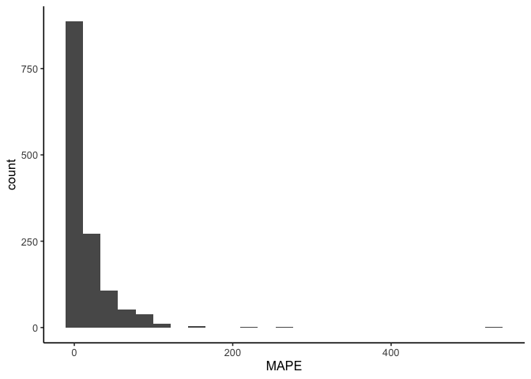

## Read in and glimpse the data


```r
data <- read.csv("wearable_review_data_validity_edited.csv")
```

## Data Cleaning 
### Subsetting the data to select Step count


```r
#data <- subset(val_data, Measured != "EE" & Measured != "HR")

glimpse(data)
```

```
## Rows: 1,672
## Columns: 107
## $ X1                          <int> 1, 2, 3, 4, 5, 6, 7, 8, 9, 10, 11, 12, 13,…
## $ Author                      <chr> "Dooley", "Dooley", "Dooley", "Boudreaux",…
## $ Year                        <int> 2017, 2017, 2017, 2018, 2018, 2018, 2017, …
## $ Substudy                    <chr> "-", "-", "-", "-", "-", "-", "-", "-", "-…
## $ Setting                     <chr> "Controlled", "Controlled", "Controlled", …
## $ Measured                    <chr> "HR", "HR", "HR", "HR", "HR", "HR", "SC", …
## $ Measure_Unit                <chr> "bpm", "bpm", "bpm", "bpm", "bpm", "bpm", …
## $ Brand                       <chr> "Apple", "Apple", "Apple", "Apple", "Apple…
## $ Device                      <chr> "Watch", "Watch", "Watch", "Watch Series 2…
## $ device_name                 <chr> "Apple Watch", "Apple Watch", "Apple Watch…
## $ device_year                 <int> 2015, 2015, 2015, 2016, 2016, 2016, 2015, …
## $ Wear_Location               <chr> "Wrist", "Wrist", "Wrist", "Wrist", "Wrist…
## $ Wear_Info                   <chr> "wrist, random", "wrist, random", "wrist, …
## $ Type                        <chr> "full-text", "full-text", "full-text", "fu…
## $ Good.                       <chr> "y", "y", "y", "y", "y", "y", "y", "y", "y…
## $ Criterion_Measure           <chr> "Heart rate sensor chest strap (Polar T31)…
## $ Criterion_Type              <chr> "chest strap", "chest strap", "chest strap…
## $ Wear_Info_crit              <chr> "chest", "chest", "chest", "upper torso", …
## $ Wear_Location_crit          <chr> "Torso", "Torso", "Torso", "Torso", "Torso…
## $ population_n                <chr> "62", "62", "62", "50", "50", "50", "31", …
## $ population_m                <chr> "26", "26", "26", "22", "22", "22", "16", …
## $ population_f                <chr> "36", "36", "36", "28", "28", "28", "15", …
## $ population                  <chr> "healthy adults", "healthy adults", "healt…
## $ age_code                    <chr> "A", "A", "A", "A", "A", "A", "A", "A", "A…
## $ health_code                 <chr> "H", "H", "H", "H", "H", "H", "H", "H", "H…
## $ age                         <chr> "22.55", "22.55", "22.55", "22.71", "22.71…
## $ age_SD                      <dbl> 4.34, 4.34, 4.34, 2.99, 2.99, 2.99, 12.00,…
## $ weight                      <chr> "72.02", "72.02", "72.02", "67.79", "67.79…
## $ weight_SD                   <dbl> 18.99, 18.99, 18.99, 14.01, 14.01, 14.01, …
## $ height                      <chr> "170", "170", "170", "162.71", "162.71", "…
## $ height_SD                   <dbl> 11.00, 11.00, 11.00, 5.79, 5.79, 5.79, NA,…
## $ BMI                         <chr> "24.6", "24.6", "24.6", "25.83", "25.83", …
## $ BMI_SD                      <dbl> 4.77, 4.77, 4.77, 4.83, 4.83, 4.83, 2.40, …
## $ location                    <chr> "TX, USA", "TX, USA", "TX, USA", "LA, USA"…
## $ activity_type               <chr> "Rest: Seated", "Rest: Seated", "Rest: Sea…
## $ test_type                   <chr> "Rest", "Rest", "Rest", "Rest", "Rest", "A…
## $ activity_type_code          <chr> "Se", "Se", "Se", "Se", "Se", "Mi", "At", …
## $ body_Motion                 <chr> NA, NA, NA, NA, NA, "Mi", "Nr", "Nr", "Nr"…
## $ pace_code                   <chr> NA, NA, NA, NA, NA, NA, "Nm", "Sl", "Sl", …
## $ pace_value                  <chr> NA, NA, NA, NA, NA, NA, "1.33", "0.89", "0…
## $ incline_code                <chr> "N", "N", "N", "N", "N", "N", "N", "N", "N…
## $ incline_pct                 <chr> NA, NA, NA, NA, NA, NA, NA, NA, NA, NA, NA…
## $ activity_details            <chr> "sedentary, seated baseline assessment, 10…
## $ bout_rest                   <chr> "yes", "yes", "no", NA, NA, NA, NA, NA, NA…
## $ epoch                       <chr> "unknown", "unknown", "unknown", "average …
## $ actual_n_analyzed           <int> 62, 62, 62, 50, 50, 50, 31, 31, 31, 31, 31…
## $ trend                       <chr> "good validity", "good validity", "underes…
## $ CC_type                     <chr> NA, NA, NA, "ICC", "ICC", "ICC", "ICC", "I…
## $ CC                          <dbl> NA, NA, NA, 0.990, 0.820, 0.900, 0.520, 0.…
## $ CC_bins                     <chr> NA, NA, NA, "VS", "VS", "VS", "MOD", "MOD"…
## $ CC_all                      <chr> NA, NA, NA, "0.99", "0.82", "0.9", "0.52",…
## $ CC_CI_pct                   <int> NA, NA, NA, NA, NA, NA, 95, 95, 95, 95, 95…
## $ CC_CI_upper                 <chr> NA, NA, NA, NA, NA, NA, "0.74", "0.77", "0…
## $ CC_CI_lower                 <chr> NA, NA, NA, NA, NA, NA, "0.21", "0.27", "0…
## $ CC_pvalue                   <chr> NA, NA, NA, NA, NA, NA, "< .01", "< .01", …
## $ CC_significance             <chr> NA, NA, NA, NA, NA, NA, "sig", "sig", "sig…
## $ ES_type                     <chr> "Cohen's d", "Cohen's d", "Cohen's d", NA,…
## $ ES                          <dbl> 0.04, 0.01, -0.03, NA, NA, NA, NA, NA, NA,…
## $ ES_CI_upper                 <dbl> NA, NA, NA, NA, NA, NA, NA, NA, NA, NA, NA…
## $ ES_CI_lower                 <dbl> NA, NA, NA, NA, NA, NA, NA, NA, NA, NA, NA…
## $ BA_LoA_upper                <chr> NA, NA, NA, NA, NA, NA, "159", "111", "124…
## $ BA_LoA_lower                <chr> NA, NA, NA, NA, NA, NA, "-101", "-74", "-9…
## $ BA_LoA_width                <dbl> NA, NA, NA, NA, NA, NA, 260.0, 185.0, 222.…
## $ devicemean                  <dbl> 72.84, 73.07, 84.02, NA, NA, NA, NA, NA, N…
## $ devicemean_SD               <dbl> 12.08, 11.45, 15.27, NA, NA, NA, NA, NA, N…
## $ critmean                    <dbl> 72.32, 72.99, 84.47, NA, NA, NA, 1108.00, …
## $ critmean_SD                 <dbl> 12.21, 11.30, 15.16, NA, NA, NA, 46.00, 46…
## $ device_v_crit               <chr> "over", "over", "under", "equal", "equal",…
## $ meandiff                    <chr> NA, NA, NA, "0.04", "0.02", "1.28", "29", …
## $ meandiff_SD                 <dbl> NA, NA, NA, 1.71, 1.71, 8.55, 12.00, 9.00,…
## $ meandiff_CI_upper           <dbl> NA, NA, NA, -3.31, -3.33, -15.46, NA, NA, …
## $ meandiff_CI_lower           <dbl> NA, NA, NA, 3.39, 3.37, 18.03, NA, NA, NA,…
## $ MPE                         <dbl> 0.007190265, 0.001096041, -0.005327335, NA…
## $ MPE_bin                     <chr> "± 3%", "± 3%", "± 3%", NA, NA, NA, "± 3%"…
## $ MPE_SD                      <chr> NA, NA, NA, NA, NA, NA, NA, NA, NA, NA, NA…
## $ MPE_significance_test       <chr> "0.78", "0.76", "< .001", NA, NA, NA, NA, …
## $ MPE_significance_num        <chr> "ns", "ns", "sig", NA, NA, NA, NA, NA, NA,…
## $ MAD                         <dbl> NA, NA, NA, NA, NA, NA, NA, NA, NA, NA, NA…
## $ MAD_SD                      <dbl> NA, NA, NA, NA, NA, NA, NA, NA, NA, NA, NA…
## $ MAD_CI_upper                <dbl> NA, NA, NA, NA, NA, NA, NA, NA, NA, NA, NA…
## $ MAD_CI_lower                <dbl> NA, NA, NA, NA, NA, NA, NA, NA, NA, NA, NA…
## $ MAPE                        <dbl> 0.0276, 0.0163, 0.0114, 0.0121, 0.0144, 0.…
## $ MAPE_bin                    <chr> "less 3%", "less 3%", "less 3%", "less 3%"…
## $ MAPE_SD                     <dbl> NA, NA, NA, NA, NA, NA, NA, NA, NA, NA, NA…
## $ MAPE_CI_upper               <dbl> NA, NA, NA, NA, NA, NA, NA, NA, NA, NA, NA…
## $ MAPE_CI_lower               <dbl> NA, NA, NA, NA, NA, NA, NA, NA, NA, NA, NA…
## $ RMSE                        <dbl> NA, NA, NA, NA, NA, NA, NA, NA, NA, NA, NA…
## $ equivalencetesting          <chr> NA, NA, NA, NA, NA, NA, "-2.20\nWilcoxon s…
## $ accuracypct                 <dbl> NA, NA, NA, NA, NA, NA, NA, NA, NA, NA, NA…
## $ accuracypct_CI_upper        <dbl> NA, NA, NA, NA, NA, NA, NA, NA, NA, NA, NA…
## $ accuracypct_CI_lower        <dbl> NA, NA, NA, NA, NA, NA, NA, NA, NA, NA, NA…
## $ TEEstandardized             <dbl> NA, NA, NA, NA, NA, NA, NA, NA, NA, NA, NA…
## $ TEEstandardized_CI_upper    <dbl> NA, NA, NA, NA, NA, NA, NA, NA, NA, NA, NA…
## $ TEEstandardized_CI_lower    <dbl> NA, NA, NA, NA, NA, NA, NA, NA, NA, NA, NA…
## $ deviceSE                    <dbl> NA, NA, NA, NA, NA, NA, NA, NA, NA, NA, NA…
## $ deviceCofV                  <dbl> NA, NA, NA, NA, NA, NA, NA, NA, NA, NA, NA…
## $ critCofV                    <dbl> NA, NA, NA, NA, NA, NA, NA, NA, NA, NA, NA…
## $ n_5pctofcrit                <chr> NA, NA, NA, NA, NA, NA, NA, NA, NA, NA, NA…
## $ n_10pctofcrit               <chr> NA, NA, NA, NA, NA, NA, NA, NA, NA, NA, NA…
## $ n_15pctofcrit               <lgl> NA, NA, NA, NA, NA, NA, NA, NA, NA, NA, NA…
## $ n_20pctofcrit               <dbl> NA, NA, NA, NA, NA, NA, NA, NA, NA, NA, NA…
## $ n_25pctofcrit               <int> NA, NA, NA, NA, NA, NA, NA, NA, NA, NA, NA…
## $ systematicbias_slope        <dbl> NA, NA, NA, NA, NA, NA, NA, NA, NA, NA, NA…
## $ systematicbias_intercept    <dbl> NA, NA, NA, NA, NA, NA, NA, NA, NA, NA, NA…
## $ systematicbias_probability  <chr> NA, NA, NA, NA, NA, NA, NA, NA, NA, NA, NA…
## $ systematicbias_significance <chr> NA, NA, NA, NA, NA, NA, NA, NA, NA, NA, NA…
## $ Other                       <chr> NA, NA, NA, NA, NA, NA, NA, NA, NA, NA, NA…
```


```r
data$X1 <- as.character(data$X1)
data$population_f <- as.numeric(data$population_f)
```

```
## Warning: NAs introduced by coercion
```

```r
data$population_m <- as.numeric(data$population_m)
```

```
## Warning: NAs introduced by coercion
```

```r
data$BMI <- as.numeric(data$BMI)
```

```
## Warning: NAs introduced by coercion
```

```r
data$age <- as.numeric(data$age)
```

```
## Warning: NAs introduced by coercion
```

## Data Cleaning by Variable

### MPE (Outcome Variable)


```r
#convert to percentage
data$MPE <- (data$MPE)*100
summary(data$MPE)
```

```
##     Min.  1st Qu.   Median     Mean  3rd Qu.     Max.     NA's 
## -100.000  -10.582   -1.450   -4.315    1.396  530.000      294
```


```r
#removing missing values and renaming our final data as df 
df <- drop_na(data, MPE)
```


```r
round(stat.desc(df$MPE),2)
```

```
##      nbr.val     nbr.null       nbr.na          min          max        range 
##      1378.00        56.00         0.00      -100.00       530.00       630.00 
##          sum       median         mean      SE.mean CI.mean.0.95          var 
##     -5946.51        -1.45        -4.32         0.89         1.75      1100.74 
##      std.dev     coef.var 
##        33.18        -7.69
```


```r
mpe_hist <- ggplot(df, aes(MPE)) + 
                  geom_histogram(bins = 25) +
                  theme_classic()
                  #facet_wrap(~ age_category)
plot(mpe_hist)
```

<!-- -->


```r
mpe_box <- ggplot(df, aes(MPE)) + 
                geom_boxplot() +
                coord_flip() +
                theme_classic()
                #facet_wrap(~ age_cat)
plot(mpe_box)
```

<!-- -->


```r
#creating a dataframe containing the extreme outliers
df_out <- df %>%
  identify_outliers("MPE") %>%
        filter(is.extreme == TRUE)
```


```r
#merging the outlier dataframe with our original data
total <- merge(df,df_out, all.x = TRUE)
table(total$is.extreme)
```

```
## 
## TRUE 
##  161
```


```r
#renaming those not extreme as FALSE instead of NA
total$is.extreme[is.na(total$is.extreme)] <- FALSE
table(total$is.extreme)
```

```
## 
## FALSE  TRUE 
##  1217   161
```


```r
#subsetting the non-outliers in the data
df_val <- subset(total, is.extreme != TRUE)
```


```r
summary(df_val$MPE)
```

```
##     Min.  1st Qu.   Median     Mean  3rd Qu.     Max. 
## -45.2700  -7.9365  -1.2500  -3.9293   0.8421  37.0000
```


```r
mpe_hist_clean <- ggplot(df_val, aes(MPE)) + 
                  geom_histogram(bins = 30) +
                  theme_classic()
                  #facet_wrap(~ age_cat)
plot(mpe_hist_clean)
```

<!-- -->

The distribution looks better now that the outliers have been removed


```r
mpe_box_clean <- ggplot(df_val, aes(MPE)) + 
                  geom_boxplot() +
                  coord_flip() +
                  theme_classic()
                  #facet_wrap(~ age_cat)
plot(mpe_box_clean)
```

<!-- -->

### AGE


```r
round(stat.desc(df_val$age), digits = 1)
```

```
##      nbr.val     nbr.null       nbr.na          min          max        range 
##        933.0          0.0        284.0          3.7         87.0         83.3 
##          sum       median         mean      SE.mean CI.mean.0.95          var 
##      31707.1         27.5         34.0          0.5          1.1        275.5 
##      std.dev     coef.var 
##         16.6          0.5
```

```r
df_val$age_code <- factor(df_val$age_code, c("C","A","OA"), labels = c("Children","Adults","Older Adults"))
```


```r
addmargins(table(df_val$age_code)) #frequency table of age, including the total
```

```
## 
##     Children       Adults Older Adults          Sum 
##           25         1019          173         1217
```

```r
round(prop.table(table(df_val$age_code))*100, digits = 0) #percentage proportion of each category
```

```
## 
##     Children       Adults Older Adults 
##            2           84           14
```

```r
sum(is.na(df_val$age_code))
```

```
## [1] 0
```

### GENDER


```r
df_val <- df_val %>%
        mutate(sex = case_when(
                population_m > population_f ~ "Male",
                population_m < population_f ~ "Female"
        ))
```


```r
df_val$sex <- as.factor(df_val$sex)
addmargins(table(df_val$sex))
```

```
## 
## Female   Male    Sum 
##    413    470    883
```

```r
round(prop.table(table(df_val$sex))*100, digits = 0)
```

```
## 
## Female   Male 
##     47     53
```

```r
sum(is.na(df_val$sex))
```

```
## [1] 334
```

```r
df_val_sex <- drop_na(df_val, sex)
```

### BMI


```r
round(stat.desc(df_val$BMI), digits = 1)
```

```
##      nbr.val     nbr.null       nbr.na          min          max        range 
##        742.0          0.0        475.0         20.5         30.8         10.3 
##          sum       median         mean      SE.mean CI.mean.0.95          var 
##      18136.4         24.6         24.4          0.1          0.1          3.3 
##      std.dev     coef.var 
##          1.8          0.1
```

```r
df_val <- df_val %>%
        mutate(bmi_cat = case_when(
                BMI >= 18.5 & BMI <= 24.9 ~ "Healthy weight",
                BMI > 24.9 & BMI <= 29.9 ~ "Overweight",
                BMI > 29.9 ~ "Obese"
        ))
```


```r
addmargins(table(df_val$bmi_cat))
```

```
## 
## Healthy weight          Obese     Overweight            Sum 
##            453              2            287            742
```

```r
round(prop.table(table(df_val$bmi_cat))*100, digits = 0) #percentage
```

```
## 
## Healthy weight          Obese     Overweight 
##             61              0             39
```

```r
sum(is.na(df_val$bmi_cat))
```

```
## [1] 475
```

```r
df_val_bmi <- drop_na(df_val, bmi_cat)

#df <- filter(df, bmi_cat != "Obese")
```

There are not enough data for obese individuals.


```r
#relevel factors
df_val$age_code <- fct_relevel(df_val$age_code, c("Children","Adults","Older Adults"))
df_val$sex <- fct_relevel(df_val$sex, c("Female","Male"))
df_val$bmi_cat <- fct_relevel(df_val$bmi_cat, c("Healthy weight","Overweight","Obese"))
```

## MPE for Step count, heart rate & energy expenditure across different groups


```r
#AGE GROUP
df_val %>%
    group_by(age_code,Measured) %>%
    get_summary_stats(MPE, type = "mean_sd") %>%
    arrange(Measured)
```

<div class="kable-table">

|Measured |age_code     |variable |   n|   mean|     sd|
|:--------|:------------|:--------|---:|------:|------:|
|EE       |Adults       |MPE      | 256| -6.954| 18.782|
|HR       |Children     |MPE      |   2|  1.500|  1.980|
|HR       |Adults       |MPE      | 144| -1.262|  6.368|
|HR       |Older Adults |MPE      |  32|  0.964|  2.536|
|SC       |Children     |MPE      |  23|  1.469| 10.671|
|SC       |Adults       |MPE      | 619| -2.736| 10.356|
|SC       |Older Adults |MPE      | 141| -8.467| 14.450|

</div>


```r
#SEX GROUP
df_val_sex %>%
    group_by(sex, Measured) %>%
    get_summary_stats(MPE, type = "mean_sd") %>%
    arrange(Measured)
```

<div class="kable-table">

|Measured |sex    |variable |   n|   mean|     sd|
|:--------|:------|:--------|---:|------:|------:|
|EE       |Female |MPE      |  74| -6.573| 16.740|
|EE       |Male   |MPE      | 107| -9.416| 20.159|
|HR       |Female |MPE      |  73| -0.103|  7.108|
|HR       |Male   |MPE      |  84| -0.463|  4.633|
|SC       |Female |MPE      | 266| -4.932| 13.488|
|SC       |Male   |MPE      | 279| -3.006| 10.872|

</div>


```r
#BMI GROUP
df_val_bmi %>%
    group_by(bmi_cat, Measured) %>%
    get_summary_stats(MPE, type = "mean_sd") %>%
    arrange(Measured)
```

<div class="kable-table">

|Measured |bmi_cat        |variable |   n|    mean|     sd|
|:--------|:--------------|:--------|---:|-------:|------:|
|EE       |Healthy weight |MPE      | 106| -10.376| 17.213|
|EE       |Overweight     |MPE      |  52|  -1.082| 20.247|
|HR       |Healthy weight |MPE      |  81|  -2.183|  7.452|
|HR       |Overweight     |MPE      |  28|   0.997|  4.935|
|SC       |Healthy weight |MPE      | 266|  -0.027|  8.856|
|SC       |Obese          |MPE      |   2| -13.618| 21.753|
|SC       |Overweight     |MPE      | 207|  -5.511| 12.615|

</div>

### DEVICES


```r
#Age group, device & wear location
df_val %>%
    group_by(age_code, device_name, Wear_Location, Measured) %>%
    get_summary_stats(MPE, type = "mean_sd") %>%
    arrange(device_name) 
```

<div class="kable-table">

|Measured |device_name             |Wear_Location |age_code     |variable |  n|    mean|     sd|
|:--------|:-----------------------|:-------------|:------------|:--------|--:|-------:|------:|
|EE       |Apple Watch             |Wrist         |Adults       |MPE      | 21|  -3.108| 19.017|
|HR       |Apple Watch             |Wrist         |Adults       |MPE      | 49|   0.326|  3.683|
|SC       |Apple Watch             |Wrist         |Adults       |MPE      | 18|  -0.752|  3.166|
|SC       |Apple Watch             |Wrist         |Older Adults |MPE      |  1|   1.590|     NA|
|EE       |Apple Watch Series 2    |Wrist         |Adults       |MPE      |  1|  23.041|     NA|
|SC       |Fitbit                  |Wrist         |Adults       |MPE      |  1|  20.592|     NA|
|SC       |Fitbit                  |Waist/Hip     |Older Adults |MPE      |  2|   6.500|  9.192|
|EE       |Fitbit Blaze            |Wrist         |Adults       |MPE      |  2| -22.037| 24.677|
|EE       |Fitbit Charge           |Wrist         |Adults       |MPE      |  9|   2.102| 17.935|
|SC       |Fitbit Charge           |Wrist         |Adults       |MPE      | 12|   0.218| 14.325|
|SC       |Fitbit Charge           |Wrist         |Older Adults |MPE      |  3| -27.140|  8.175|
|EE       |Fitbit Charge 2         |Wrist         |Adults       |MPE      |  9| -22.529| 14.416|
|HR       |Fitbit Charge 2         |Wrist         |Adults       |MPE      | 13|  -6.748|  5.492|
|SC       |Fitbit Charge 2         |Wrist         |Adults       |MPE      |  6|   6.641| 17.144|
|HR       |Fitbit Charge 2         |Wrist         |Older Adults |MPE      | 16|   1.775|  2.523|
|SC       |Fitbit Charge 2         |Wrist         |Older Adults |MPE      | 14|  -7.469| 17.519|
|HR       |Fitbit Charge HR        |Wrist         |Children     |MPE      |  2|   1.500|  1.980|
|SC       |Fitbit Charge HR        |Wrist         |Children     |MPE      |  1|  27.540|     NA|
|EE       |Fitbit Charge HR        |Wrist         |Adults       |MPE      | 29|   4.393| 16.557|
|HR       |Fitbit Charge HR        |Wrist         |Adults       |MPE      | 34|  -2.588|  4.196|
|SC       |Fitbit Charge HR        |Wrist         |Adults       |MPE      | 47|  -0.668|  8.829|
|SC       |Fitbit Charge HR        |Wrist         |Older Adults |MPE      | 13|   4.766| 12.044|
|SC       |Fitbit Classic          |LAF           |Adults       |MPE      |  4|   6.250|  1.708|
|EE       |Fitbit Classic          |Waist/Hip     |Adults       |MPE      | 18| -16.235| 15.664|
|SC       |Fitbit Classic          |Waist/Hip     |Adults       |MPE      |  9|   3.718|  3.658|
|SC       |Fitbit Classic          |Waist/Hip     |Older Adults |MPE      |  1| -39.243|     NA|
|SC       |Fitbit Flex             |Wrist         |Children     |MPE      |  1| -20.162|     NA|
|EE       |Fitbit Flex             |Wrist         |Adults       |MPE      | 20|   1.866| 18.830|
|SC       |Fitbit Flex             |Wrist         |Adults       |MPE      | 65|  -4.771| 13.788|
|SC       |Fitbit Flex             |Thigh         |Older Adults |MPE      |  1| -30.818|     NA|
|SC       |Fitbit Flex             |Wrist         |Older Adults |MPE      |  8| -13.206| 11.843|
|SC       |Fitbit Force            |Wrist         |Adults       |MPE      |  5|  -5.574|  4.704|
|SC       |Fitbit One              |Waist/Hip     |Children     |MPE      |  3|  -0.499|  0.865|
|SC       |Fitbit One              |LAF           |Adults       |MPE      |  8|  -6.195|  6.996|
|EE       |Fitbit One              |Torso         |Adults       |MPE      |  4|  -1.000|  1.417|
|SC       |Fitbit One              |Torso         |Adults       |MPE      | 21|   2.378|  6.814|
|EE       |Fitbit One              |Waist/Hip     |Adults       |MPE      | 26|  -3.325| 16.974|
|SC       |Fitbit One              |Waist/Hip     |Adults       |MPE      | 68|  -1.371|  7.957|
|SC       |Fitbit One              |Wrist         |Adults       |MPE      |  2|   1.900|  0.000|
|SC       |Fitbit One              |LAF           |Older Adults |MPE      | 15|  -6.553|  4.763|
|SC       |Fitbit One              |Waist/Hip     |Older Adults |MPE      | 16| -10.223| 17.773|
|EE       |Fitbit Surge            |Wrist         |Adults       |MPE      |  6|   0.233| 25.143|
|HR       |Fitbit Surge            |Wrist         |Adults       |MPE      |  7|   2.826|  4.417|
|SC       |Fitbit Surge            |Wrist         |Adults       |MPE      | 12|  -3.494|  4.357|
|SC       |Fitbit Surge            |Wrist         |Older Adults |MPE      |  5| -14.919| 15.702|
|EE       |Fitbit Ultra            |Torso         |Adults       |MPE      |  2| -15.006|  3.141|
|SC       |Fitbit Ultra            |Torso         |Adults       |MPE      |  8|  -1.450|  1.616|
|SC       |Fitbit Ultra            |Upper Arm     |Adults       |MPE      |  6|  -2.084|  2.036|
|EE       |Fitbit Ultra            |Waist/Hip     |Adults       |MPE      |  4| -21.652| 25.766|
|SC       |Fitbit Ultra            |Waist/Hip     |Adults       |MPE      | 19|  -6.765| 12.876|
|EE       |Fitbit Ultra            |Wrist         |Adults       |MPE      |  4|  -5.837|  7.771|
|SC       |Fitbit Ultra            |Wrist         |Adults       |MPE      |  4|  -6.487|  9.365|
|SC       |Fitbit Zip              |Torso         |Children     |MPE      |  2|  -6.518|  0.460|
|SC       |Fitbit Zip              |Waist/Hip     |Children     |MPE      | 14|   3.557|  9.138|
|SC       |Fitbit Zip              |LAF           |Adults       |MPE      | 26|  -5.612| 15.652|
|SC       |Fitbit Zip              |Torso         |Adults       |MPE      | 23|  -5.330| 11.334|
|EE       |Fitbit Zip              |Waist/Hip     |Adults       |MPE      |  5| -15.225| 15.735|
|SC       |Fitbit Zip              |Waist/Hip     |Adults       |MPE      | 50|  -3.830|  8.710|
|SC       |Fitbit Zip              |Torso         |Older Adults |MPE      |  9| -15.289| 20.233|
|SC       |Fitbit Zip              |Waist/Hip     |Older Adults |MPE      | 13| -12.144| 13.935|
|EE       |Garmin Fenix 3 HR       |Wrist         |Adults       |MPE      |  4|   2.242|  6.936|
|EE       |Garmin Forerunner 225   |Wrist         |Adults       |MPE      |  1|  26.690|     NA|
|HR       |Garmin Forerunner 225   |Wrist         |Adults       |MPE      | 10|   6.882|  8.105|
|HR       |Garmin Forerunner 235   |Wrist         |Adults       |MPE      |  9|  -4.575|  7.867|
|SC       |Garmin Forerunner 235   |Wrist         |Adults       |MPE      |  2|  -1.599|  1.338|
|SC       |Garmin Forerunner 405CX |Wrist         |Adults       |MPE      |  1|   3.448|     NA|
|SC       |Garmin Forerunner 735XT |Wrist         |Adults       |MPE      |  2|  -0.910|  0.438|
|SC       |Garmin Forerunner 735XT |Wrist         |Older Adults |MPE      |  1|  -2.130|     NA|
|EE       |Garmin Forerunner 920XT |Wrist         |Adults       |MPE      |  4| -19.200| 15.271|
|SC       |Garmin Forerunner 920XT |Wrist         |Adults       |MPE      |  6|  -0.122|  1.382|
|SC       |Garmin Vivoactive       |Wrist         |Adults       |MPE      |  6|  -0.167|  0.709|
|SC       |Garmin Vivofit          |Wrist         |Children     |MPE      |  1|  -3.897|     NA|
|EE       |Garmin Vivofit          |Wrist         |Adults       |MPE      | 25| -17.844| 16.874|
|SC       |Garmin Vivofit          |Wrist         |Adults       |MPE      | 54|  -3.505|  7.521|
|SC       |Garmin Vivofit          |Wrist         |Older Adults |MPE      |  5| -13.390| 16.808|
|SC       |Garmin Vivofit 2        |Wrist         |Adults       |MPE      |  2|  -2.750|  3.606|
|SC       |Garmin Vivofit 3        |Wrist         |Children     |MPE      |  1|  -4.952|     NA|
|SC       |Garmin Vivofit 3        |Wrist         |Adults       |MPE      |  5| -11.774| 10.541|
|SC       |Garmin Vivosmart        |Wrist         |Adults       |MPE      | 12|   1.785|  4.150|
|EE       |Garmin Vivosmart HR     |Wrist         |Adults       |MPE      |  2|  19.266| 15.833|
|SC       |Garmin Vivosmart HR     |Wrist         |Adults       |MPE      |  1|  -2.700|     NA|
|SC       |Garmin Vivosmart HR     |Wrist         |Older Adults |MPE      |  7|  -4.601| 13.770|
|EE       |Garmin Vivosmart HR+    |Wrist         |Adults       |MPE      |  6|  -3.567| 12.448|
|HR       |Garmin Vivosmart HR+    |Wrist         |Adults       |MPE      | 12|  -5.783| 10.285|
|SC       |Garmin Vivosmart HR+    |Wrist         |Adults       |MPE      |  4|   1.429|  1.164|
|HR       |Garmin Vivosmart HR+    |Wrist         |Older Adults |MPE      | 16|   0.152|  2.350|
|SC       |Garmin Vivosmart HR+    |Wrist         |Older Adults |MPE      | 14|  -6.814|  8.736|
|EE       |Mio Alpha               |Wrist         |Adults       |MPE      |  1| -35.570|     NA|
|HR       |Mio Alpha               |Wrist         |Adults       |MPE      |  9|   0.717|  3.075|
|SC       |Mio Fuse                |Wrist         |Adults       |MPE      |  5| -13.691| 10.443|
|SC       |Misfit Flash            |Waist/Hip     |Adults       |MPE      |  6|  10.074|  5.255|
|SC       |Misfit Shine            |Torso         |Adults       |MPE      |  2| -22.930| 16.971|
|SC       |Misfit Shine            |Waist/Hip     |Adults       |MPE      |  5| -17.490| 20.903|
|EE       |Misfit Shine            |Wrist         |Adults       |MPE      |  6|  -8.865| 17.538|
|SC       |Misfit Shine            |Wrist         |Adults       |MPE      |  6| -18.840| 16.566|
|SC       |Misfit Shine            |Waist/Hip     |Older Adults |MPE      |  2|  -2.675|  6.941|
|SC       |Misfit Shine            |Wrist         |Older Adults |MPE      |  2|  -5.454|  7.523|
|EE       |Polar A360              |Wrist         |Adults       |MPE      |  1|  29.280|     NA|
|SC       |Polar A360              |Wrist         |Adults       |MPE      |  6|  -6.067|  3.179|
|SC       |Polar Active            |Wrist         |Adults       |MPE      |  5|  -9.912|  3.648|
|EE       |Polar Loop              |Wrist         |Adults       |MPE      |  3|   9.789| 10.842|
|SC       |Polar Loop              |Wrist         |Adults       |MPE      | 15|   3.696| 14.104|
|EE       |Polar V800              |Wrist         |Adults       |MPE      |  6| -15.807| 20.102|
|SC       |Polar V800              |Wrist         |Adults       |MPE      |  1|  22.959|     NA|
|SC       |Samsung Gear 2          |Wrist         |Adults       |MPE      |  4|  -5.120|  1.967|
|EE       |Samsung Gear S          |Wrist         |Adults       |MPE      |  1|  -9.130|     NA|
|HR       |Samsung Gear S          |Wrist         |Adults       |MPE      |  1|  -6.480|     NA|
|SC       |Samsung Gear S          |Wrist         |Adults       |MPE      |  7|   1.970|  3.887|
|SC       |Samsung Gear S2         |Wrist         |Adults       |MPE      |  2|  -2.630|  2.022|
|SC       |Samsung Gear S2         |Wrist         |Older Adults |MPE      |  1|  -3.090|     NA|
|EE       |Withings Pulse O2       |Torso         |Adults       |MPE      |  8| -16.813| 15.842|
|SC       |Withings Pulse O2       |Torso         |Adults       |MPE      |  2| -15.295| 19.481|
|EE       |Withings Pulse O2       |Waist/Hip     |Adults       |MPE      |  9| -16.761| 13.730|
|SC       |Withings Pulse O2       |Waist/Hip     |Adults       |MPE      | 24|  -1.740|  4.189|
|EE       |Withings Pulse O2       |Wrist         |Adults       |MPE      |  8| -19.330| 11.428|
|SC       |Withings Pulse O2       |Wrist         |Adults       |MPE      |  3| -17.819| 11.067|
|EE       |Withings Pulse Ox       |Waist/Hip     |Adults       |MPE      |  5|   0.840| 12.546|
|SC       |Withings Pulse Ox       |Waist/Hip     |Adults       |MPE      |  6|  -0.934|  1.861|
|EE       |Withings Pulse Ox       |Wrist         |Adults       |MPE      |  6|  -6.233| 18.784|
|SC       |Withings Pulse Ox       |Wrist         |Adults       |MPE      |  6|  -4.100|  6.052|
|SC       |Withings Pulse Ox       |Wrist         |Older Adults |MPE      |  8|  -7.594|  8.000|
|SC       |Xiaomi Mi Band 2        |Wrist         |Adults       |MPE      |  5|  -0.090|  0.199|

</div>


```r
#sex group, device & wear location
df_val_sex %>%
    group_by(sex, device_name, Wear_Location, Measured) %>%
    get_summary_stats(MPE, type = "mean_sd") %>%
    arrange(device_name)
```

<div class="kable-table">

|Measured |device_name             |Wear_Location |sex    |variable |  n|    mean|     sd|
|:--------|:-----------------------|:-------------|:------|:--------|--:|-------:|------:|
|EE       |Apple Watch             |Wrist         |Female |MPE      |  4|   3.071| 18.808|
|HR       |Apple Watch             |Wrist         |Female |MPE      |  8|  -0.662|  2.792|
|SC       |Apple Watch             |Wrist         |Female |MPE      |  3|  -1.610|  2.787|
|EE       |Apple Watch             |Wrist         |Male   |MPE      |  9|   5.197| 13.897|
|HR       |Apple Watch             |Wrist         |Male   |MPE      | 35|   1.227|  3.656|
|SC       |Apple Watch             |Wrist         |Male   |MPE      | 12|   0.995|  1.979|
|EE       |Apple Watch Series 2    |Wrist         |Male   |MPE      |  1|  23.041|     NA|
|SC       |Fitbit                  |Waist/Hip     |Female |MPE      |  2|   6.500|  9.192|
|SC       |Fitbit                  |Wrist         |Female |MPE      |  1|  20.592|     NA|
|EE       |Fitbit Blaze            |Wrist         |Female |MPE      |  2| -22.037| 24.677|
|SC       |Fitbit Charge           |Wrist         |Female |MPE      |  5|  -8.584| 26.076|
|EE       |Fitbit Charge           |Wrist         |Male   |MPE      |  4|  -6.495| 19.211|
|SC       |Fitbit Charge           |Wrist         |Male   |MPE      |  1|  -3.600|     NA|
|EE       |Fitbit Charge 2         |Wrist         |Female |MPE      |  9| -22.529| 14.416|
|HR       |Fitbit Charge 2         |Wrist         |Female |MPE      | 23|  -0.694|  5.477|
|SC       |Fitbit Charge 2         |Wrist         |Female |MPE      | 19|  -2.591| 18.465|
|HR       |Fitbit Charge 2         |Wrist         |Male   |MPE      |  1|   0.163|     NA|
|EE       |Fitbit Charge HR        |Wrist         |Female |MPE      |  4|  -7.924| 26.936|
|HR       |Fitbit Charge HR        |Wrist         |Female |MPE      |  6|   1.190|  5.665|
|SC       |Fitbit Charge HR        |Wrist         |Female |MPE      | 10|  -1.269| 10.941|
|EE       |Fitbit Charge HR        |Wrist         |Male   |MPE      | 13|   5.704| 11.956|
|HR       |Fitbit Charge HR        |Wrist         |Male   |MPE      | 26|  -2.387|  3.270|
|SC       |Fitbit Charge HR        |Wrist         |Male   |MPE      | 32|   0.034| 10.505|
|SC       |Fitbit Classic          |LAF           |Female |MPE      |  4|   6.250|  1.708|
|SC       |Fitbit Classic          |Waist/Hip     |Female |MPE      |  6|  -1.041| 18.733|
|EE       |Fitbit Classic          |Waist/Hip     |Male   |MPE      |  5| -26.141| 15.139|
|SC       |Fitbit Classic          |Waist/Hip     |Male   |MPE      |  4|   0.116|  1.861|
|SC       |Fitbit Flex             |Thigh         |Female |MPE      |  1| -30.818|     NA|
|EE       |Fitbit Flex             |Wrist         |Female |MPE      | 11|  -0.069| 14.548|
|SC       |Fitbit Flex             |Wrist         |Female |MPE      | 30|  -7.603| 17.023|
|EE       |Fitbit Flex             |Wrist         |Male   |MPE      |  3|  -6.033| 29.380|
|SC       |Fitbit Flex             |Wrist         |Male   |MPE      | 24|  -5.741| 10.481|
|SC       |Fitbit Force            |Wrist         |Male   |MPE      |  5|  -5.574|  4.704|
|SC       |Fitbit One              |LAF           |Female |MPE      |  7|  -5.114|  4.300|
|EE       |Fitbit One              |Torso         |Female |MPE      |  4|  -1.000|  1.417|
|SC       |Fitbit One              |Torso         |Female |MPE      | 21|   2.378|  6.814|
|EE       |Fitbit One              |Waist/Hip     |Female |MPE      | 18|  -6.884| 13.430|
|SC       |Fitbit One              |Waist/Hip     |Female |MPE      | 31|  -2.827| 10.946|
|SC       |Fitbit One              |LAF           |Male   |MPE      | 15|  -6.744|  6.073|
|EE       |Fitbit One              |Waist/Hip     |Male   |MPE      |  3|  26.077| 10.290|
|SC       |Fitbit One              |Waist/Hip     |Male   |MPE      | 32|  -3.559| 13.188|
|HR       |Fitbit Surge            |Wrist         |Female |MPE      |  2|   4.585|  0.270|
|SC       |Fitbit Surge            |Wrist         |Female |MPE      |  3|  -5.027|  0.867|
|EE       |Fitbit Surge            |Wrist         |Male   |MPE      |  6|   0.233| 25.143|
|HR       |Fitbit Surge            |Wrist         |Male   |MPE      |  5|   2.122|  5.203|
|SC       |Fitbit Surge            |Wrist         |Male   |MPE      |  8|  -9.643| 13.934|
|EE       |Fitbit Ultra            |Torso         |Female |MPE      |  2| -15.006|  3.141|
|SC       |Fitbit Ultra            |Torso         |Female |MPE      |  2|   0.154|  0.589|
|EE       |Fitbit Ultra            |Waist/Hip     |Male   |MPE      |  4| -21.652| 25.766|
|SC       |Fitbit Ultra            |Waist/Hip     |Male   |MPE      |  7|  -4.002| 11.911|
|SC       |Fitbit Zip              |LAF           |Female |MPE      |  1| -26.100|     NA|
|SC       |Fitbit Zip              |Torso         |Female |MPE      | 11| -13.694| 18.442|
|EE       |Fitbit Zip              |Waist/Hip     |Female |MPE      |  1| -16.539|     NA|
|SC       |Fitbit Zip              |Waist/Hip     |Female |MPE      | 18|  -2.912| 12.465|
|SC       |Fitbit Zip              |LAF           |Male   |MPE      | 25|  -4.792| 15.394|
|SC       |Fitbit Zip              |Torso         |Male   |MPE      |  5| -10.480| 14.888|
|SC       |Fitbit Zip              |Waist/Hip     |Male   |MPE      | 32|  -5.219|  8.810|
|EE       |Garmin Fenix 3 HR       |Wrist         |Male   |MPE      |  4|   2.242|  6.936|
|EE       |Garmin Forerunner 225   |Wrist         |Female |MPE      |  1|  26.690|     NA|
|HR       |Garmin Forerunner 225   |Wrist         |Female |MPE      |  6|  10.736|  8.472|
|HR       |Garmin Forerunner 235   |Wrist         |Male   |MPE      |  9|  -4.575|  7.867|
|SC       |Garmin Forerunner 405CX |Wrist         |Male   |MPE      |  1|   3.448|     NA|
|SC       |Garmin Forerunner 735XT |Wrist         |Female |MPE      |  3|  -1.317|  0.770|
|EE       |Garmin Forerunner 920XT |Wrist         |Male   |MPE      |  4| -19.200| 15.271|
|EE       |Garmin Vivofit          |Wrist         |Female |MPE      |  2| -16.808|  6.953|
|SC       |Garmin Vivofit          |Wrist         |Female |MPE      | 19|  -5.168|  9.849|
|EE       |Garmin Vivofit          |Wrist         |Male   |MPE      | 23| -17.934| 17.559|
|SC       |Garmin Vivofit          |Wrist         |Male   |MPE      | 17|  -3.554|  6.417|
|SC       |Garmin Vivofit 3        |Wrist         |Female |MPE      |  1|  -4.952|     NA|
|SC       |Garmin Vivosmart        |Wrist         |Male   |MPE      |  6|   3.859|  5.228|
|EE       |Garmin Vivosmart HR     |Wrist         |Female |MPE      |  2|  19.266| 15.833|
|SC       |Garmin Vivosmart HR     |Wrist         |Male   |MPE      |  7|  -4.601| 13.770|
|EE       |Garmin Vivosmart HR+    |Wrist         |Female |MPE      |  6|  -3.567| 12.448|
|HR       |Garmin Vivosmart HR+    |Wrist         |Female |MPE      | 28|  -2.391|  7.424|
|SC       |Garmin Vivosmart HR+    |Wrist         |Female |MPE      | 14|  -6.814|  8.736|
|SC       |Garmin Vivosmart HR+    |Wrist         |Male   |MPE      |  4|   1.429|  1.164|
|HR       |Mio Alpha               |Wrist         |Male   |MPE      |  8|   1.329|  2.637|
|SC       |Mio Fuse                |Wrist         |Female |MPE      |  5| -13.691| 10.443|
|SC       |Misfit Flash            |Waist/Hip     |Male   |MPE      |  6|  10.074|  5.255|
|SC       |Misfit Shine            |Torso         |Female |MPE      |  2| -22.930| 16.971|
|SC       |Misfit Shine            |Waist/Hip     |Female |MPE      |  4| -19.686| 23.461|
|EE       |Misfit Shine            |Wrist         |Female |MPE      |  3|  -6.584| 11.418|
|SC       |Misfit Shine            |Wrist         |Female |MPE      |  3| -29.308| 16.286|
|SC       |Misfit Shine            |Waist/Hip     |Male   |MPE      |  3|  -4.685|  6.018|
|EE       |Misfit Shine            |Wrist         |Male   |MPE      |  2| -24.437| 13.637|
|SC       |Misfit Shine            |Wrist         |Male   |MPE      |  5|  -7.205|  7.921|
|EE       |Polar A360              |Wrist         |Female |MPE      |  1|  29.280|     NA|
|SC       |Polar A360              |Wrist         |Male   |MPE      |  4|  -5.197|  2.750|
|SC       |Polar Active            |Wrist         |Male   |MPE      |  5|  -9.912|  3.648|
|SC       |Polar Loop              |Wrist         |Male   |MPE      |  9|  10.849| 13.884|
|EE       |Polar V800              |Wrist         |Male   |MPE      |  5| -13.040| 21.158|
|SC       |Samsung Gear 2          |Wrist         |Male   |MPE      |  4|  -5.120|  1.967|
|SC       |Samsung Gear S          |Wrist         |Male   |MPE      |  6|   3.273|  1.965|
|SC       |Samsung Gear S2         |Wrist         |Female |MPE      |  3|  -2.783|  1.454|
|SC       |Withings Pulse O2       |Torso         |Female |MPE      |  2| -15.295| 19.481|
|EE       |Withings Pulse O2       |Waist/Hip     |Female |MPE      |  1| -17.737|     NA|
|SC       |Withings Pulse O2       |Waist/Hip     |Female |MPE      | 24|  -1.740|  4.189|
|EE       |Withings Pulse O2       |Wrist         |Female |MPE      |  3| -15.635|  5.925|
|SC       |Withings Pulse O2       |Wrist         |Female |MPE      |  3| -17.819| 11.067|
|EE       |Withings Pulse O2       |Torso         |Male   |MPE      |  8| -16.813| 15.842|
|EE       |Withings Pulse O2       |Waist/Hip     |Male   |MPE      |  8| -16.639| 14.673|
|EE       |Withings Pulse O2       |Wrist         |Male   |MPE      |  5| -21.547| 13.950|
|SC       |Withings Pulse Ox       |Wrist         |Female |MPE      |  8|  -7.594|  8.000|

</div>


```r
#bmi group, device & wear location
df_val_bmi %>%
    group_by(bmi_cat, device_name, Wear_Location, Measured) %>%
    get_summary_stats(MPE, type = "mean_sd") %>%
    arrange(device_name)
```

<div class="kable-table">

|Measured |device_name             |Wear_Location |bmi_cat        |variable |  n|    mean|     sd|
|:--------|:-----------------------|:-------------|:--------------|:--------|--:|-------:|------:|
|EE       |Apple Watch             |Wrist         |Healthy weight |MPE      | 14|  -6.405| 16.339|
|HR       |Apple Watch             |Wrist         |Healthy weight |MPE      | 11|  -2.651|  2.361|
|SC       |Apple Watch             |Wrist         |Healthy weight |MPE      |  9|   0.748|  2.252|
|EE       |Apple Watch             |Wrist         |Overweight     |MPE      |  6|  11.029| 13.539|
|HR       |Apple Watch             |Wrist         |Overweight     |MPE      | 15|   3.795|  4.298|
|SC       |Apple Watch             |Wrist         |Overweight     |MPE      |  8|  -0.799|  2.693|
|EE       |Apple Watch Series 2    |Wrist         |Healthy weight |MPE      |  1|  23.041|     NA|
|EE       |Fitbit Blaze            |Wrist         |Overweight     |MPE      |  2| -22.037| 24.677|
|SC       |Fitbit Charge           |Wrist         |Healthy weight |MPE      |  3|  -7.126| 25.692|
|EE       |Fitbit Charge           |Wrist         |Overweight     |MPE      |  4|  -6.495| 19.211|
|SC       |Fitbit Charge           |Wrist         |Overweight     |MPE      |  6|  -7.753| 23.411|
|EE       |Fitbit Charge 2         |Wrist         |Healthy weight |MPE      |  7| -21.839| 13.249|
|HR       |Fitbit Charge 2         |Wrist         |Healthy weight |MPE      | 13|  -6.748|  5.492|
|SC       |Fitbit Charge 2         |Wrist         |Healthy weight |MPE      |  6|   6.641| 17.144|
|SC       |Fitbit Charge 2         |Wrist         |Obese          |MPE      |  1| -29.000|     NA|
|EE       |Fitbit Charge 2         |Wrist         |Overweight     |MPE      |  2| -24.946| 24.377|
|EE       |Fitbit Charge HR        |Wrist         |Healthy weight |MPE      | 11|  -0.200| 22.146|
|HR       |Fitbit Charge HR        |Wrist         |Healthy weight |MPE      | 18|  -1.601|  4.333|
|SC       |Fitbit Charge HR        |Wrist         |Healthy weight |MPE      | 17|  -2.098|  5.525|
|EE       |Fitbit Charge HR        |Wrist         |Overweight     |MPE      | 12|   6.407|  5.536|
|HR       |Fitbit Charge HR        |Wrist         |Overweight     |MPE      | 13|  -2.231|  3.488|
|SC       |Fitbit Charge HR        |Wrist         |Overweight     |MPE      | 13|  -0.690| 15.441|
|SC       |Fitbit Classic          |LAF           |Healthy weight |MPE      |  4|   6.250|  1.708|
|EE       |Fitbit Classic          |Waist/Hip     |Healthy weight |MPE      | 13| -12.425| 14.648|
|SC       |Fitbit Classic          |Waist/Hip     |Healthy weight |MPE      |  5|   6.600|  0.894|
|EE       |Fitbit Classic          |Waist/Hip     |Overweight     |MPE      |  1| -27.295|     NA|
|EE       |Fitbit Flex             |Wrist         |Healthy weight |MPE      |  7|  -8.286| 17.571|
|SC       |Fitbit Flex             |Wrist         |Healthy weight |MPE      | 37|  -0.313| 11.266|
|EE       |Fitbit Flex             |Wrist         |Overweight     |MPE      |  5|  13.889| 20.702|
|SC       |Fitbit Flex             |Wrist         |Overweight     |MPE      | 17|  -6.567| 17.147|
|SC       |Fitbit Force            |Wrist         |Healthy weight |MPE      |  5|  -5.574|  4.704|
|EE       |Fitbit One              |Torso         |Healthy weight |MPE      |  4|  -1.000|  1.417|
|SC       |Fitbit One              |Torso         |Healthy weight |MPE      | 18|   2.774|  7.312|
|EE       |Fitbit One              |Waist/Hip     |Healthy weight |MPE      |  6|  -8.736| 16.473|
|SC       |Fitbit One              |Waist/Hip     |Healthy weight |MPE      | 40|   0.819|  4.071|
|SC       |Fitbit One              |LAF           |Obese          |MPE      |  1|   1.764|     NA|
|SC       |Fitbit One              |LAF           |Overweight     |MPE      |  8|  -4.983|  3.998|
|SC       |Fitbit One              |Torso         |Overweight     |MPE      |  3|   0.000|  0.000|
|EE       |Fitbit One              |Waist/Hip     |Overweight     |MPE      |  4|  -8.328| 18.101|
|SC       |Fitbit One              |Waist/Hip     |Overweight     |MPE      | 17|  -3.572| 16.609|
|SC       |Fitbit One              |Wrist         |Overweight     |MPE      |  2|   1.900|  0.000|
|SC       |Fitbit Surge            |Wrist         |Healthy weight |MPE      |  5|  -2.404|  2.288|
|SC       |Fitbit Surge            |Wrist         |Overweight     |MPE      |  8| -10.813| 13.945|
|SC       |Fitbit Ultra            |Torso         |Overweight     |MPE      |  6|  -1.985|  1.487|
|SC       |Fitbit Ultra            |Upper Arm     |Overweight     |MPE      |  6|  -2.084|  2.036|
|SC       |Fitbit Ultra            |Waist/Hip     |Overweight     |MPE      | 15|  -8.647| 13.954|
|EE       |Fitbit Zip              |Waist/Hip     |Healthy weight |MPE      |  1|   3.699|     NA|
|SC       |Fitbit Zip              |Waist/Hip     |Healthy weight |MPE      |  9|  -3.347|  8.927|
|SC       |Fitbit Zip              |Torso         |Overweight     |MPE      | 27|  -7.696| 14.966|
|EE       |Fitbit Zip              |Waist/Hip     |Overweight     |MPE      |  3| -17.877| 15.667|
|SC       |Fitbit Zip              |Waist/Hip     |Overweight     |MPE      | 38|  -5.946| 10.812|
|EE       |Garmin Fenix 3 HR       |Wrist         |Healthy weight |MPE      |  4|   2.242|  6.936|
|EE       |Garmin Forerunner 225   |Wrist         |Healthy weight |MPE      |  1|  26.690|     NA|
|HR       |Garmin Forerunner 225   |Wrist         |Healthy weight |MPE      | 10|   6.882|  8.105|
|HR       |Garmin Forerunner 235   |Wrist         |Healthy weight |MPE      |  9|  -4.575|  7.867|
|SC       |Garmin Forerunner 235   |Wrist         |Overweight     |MPE      |  2|  -1.599|  1.338|
|SC       |Garmin Forerunner 735XT |Wrist         |Healthy weight |MPE      |  1|  -1.220|     NA|
|SC       |Garmin Forerunner 735XT |Wrist         |Overweight     |MPE      |  2|  -1.365|  1.082|
|EE       |Garmin Vivofit          |Wrist         |Healthy weight |MPE      |  7| -23.764| 13.642|
|SC       |Garmin Vivofit          |Wrist         |Healthy weight |MPE      | 36|  -2.992|  8.509|
|EE       |Garmin Vivofit          |Wrist         |Overweight     |MPE      |  6| -14.304| 27.478|
|SC       |Garmin Vivofit          |Wrist         |Overweight     |MPE      | 11|  -8.765| 11.939|
|SC       |Garmin Vivofit 3        |Wrist         |Healthy weight |MPE      |  1|  -4.952|     NA|
|SC       |Garmin Vivosmart        |Wrist         |Healthy weight |MPE      |  6|   3.859|  5.228|
|EE       |Garmin Vivosmart HR     |Wrist         |Overweight     |MPE      |  2|  19.266| 15.833|
|EE       |Garmin Vivosmart HR+    |Wrist         |Healthy weight |MPE      |  6|  -3.567| 12.448|
|HR       |Garmin Vivosmart HR+    |Wrist         |Healthy weight |MPE      | 12|  -5.783| 10.285|
|SC       |Garmin Vivosmart HR+    |Wrist         |Healthy weight |MPE      |  4|   1.429|  1.164|
|HR       |Mio Alpha               |Wrist         |Healthy weight |MPE      |  8|   1.329|  2.637|
|SC       |Mio Fuse                |Wrist         |Healthy weight |MPE      |  5| -13.691| 10.443|
|SC       |Misfit Flash            |Waist/Hip     |Healthy weight |MPE      |  6|  10.074|  5.255|
|SC       |Misfit Shine            |Waist/Hip     |Healthy weight |MPE      |  3|  -2.489|  5.401|
|EE       |Misfit Shine            |Wrist         |Healthy weight |MPE      |  2| -24.437| 13.637|
|SC       |Misfit Shine            |Waist/Hip     |Overweight     |MPE      |  2|  -2.675|  6.941|
|EE       |Misfit Shine            |Wrist         |Overweight     |MPE      |  2|  -0.253| 22.185|
|SC       |Misfit Shine            |Wrist         |Overweight     |MPE      |  6|  -7.768|  7.217|
|SC       |Polar A360              |Wrist         |Healthy weight |MPE      |  4|  -5.197|  2.750|
|EE       |Polar A360              |Wrist         |Overweight     |MPE      |  1|  29.280|     NA|
|SC       |Polar A360              |Wrist         |Overweight     |MPE      |  2|  -7.805|  4.332|
|SC       |Polar Active            |Wrist         |Healthy weight |MPE      |  5|  -9.912|  3.648|
|SC       |Polar Loop              |Wrist         |Healthy weight |MPE      |  8|  13.842| 11.320|
|EE       |Polar Loop              |Wrist         |Overweight     |MPE      |  1|   1.666|     NA|
|SC       |Polar Loop              |Wrist         |Overweight     |MPE      |  1| -13.100|     NA|
|EE       |Polar V800              |Wrist         |Healthy weight |MPE      |  1| -29.643|     NA|
|SC       |Polar V800              |Wrist         |Healthy weight |MPE      |  1|  22.959|     NA|
|SC       |Samsung Gear 2          |Wrist         |Healthy weight |MPE      |  4|  -5.120|  1.967|
|SC       |Samsung Gear S          |Wrist         |Healthy weight |MPE      |  6|   3.273|  1.965|
|SC       |Samsung Gear S2         |Wrist         |Healthy weight |MPE      |  1|  -1.200|     NA|
|SC       |Samsung Gear S2         |Wrist         |Overweight     |MPE      |  2|  -3.575|  0.686|
|EE       |Withings Pulse O2       |Torso         |Healthy weight |MPE      |  8| -16.813| 15.842|
|EE       |Withings Pulse O2       |Waist/Hip     |Healthy weight |MPE      |  8| -16.639| 14.673|
|SC       |Withings Pulse O2       |Waist/Hip     |Healthy weight |MPE      | 17|  -0.977|  2.364|
|EE       |Withings Pulse O2       |Wrist         |Healthy weight |MPE      |  5| -21.547| 13.950|
|EE       |Withings Pulse O2       |Waist/Hip     |Overweight     |MPE      |  1| -17.737|     NA|
|SC       |Withings Pulse O2       |Waist/Hip     |Overweight     |MPE      |  5|  -1.202|  2.688|

</div>


```r
#df_new <- filter(df, Setting != "Free-Living", device_name == "Fitbit One" | device_name == "Fitbit Flex" | device_name == "Fitbit Zip" | device_name == "Fitbit Charge HR" | device_name == "Garmin Vivofit" | device_name == "Withings Pulse O2" | device_name == "Apple Watch")
```


## PLOTS

### Validity of Step count by Age in Controlled setting

* Dashed grey lines indicate ± 3% measurement error


```r
#options(repr.plot.width = 25, repr.plot.height = 8)
df_age_plot <- ggplot(df_val, aes(x = Brand, y = MPE, colour = Measured)) +
                    geom_boxplot(na.rm = TRUE) +
                    geom_beeswarm(dodge.width = 0.2, cex = 0.2, alpha = 0.08, groupOnX = TRUE, na.rm = TRUE) +   
                    geom_hline(yintercept = 0) +  
                    geom_hline(yintercept = 3, size = 0.5, colour = "grey", linetype = "dashed") + 
                    geom_hline(yintercept = -3, size = 0.5, colour = "grey", linetype = "dashed") +   
                    scale_y_continuous(limits=c(-10, 10)) +
                    ylab("Step MPE (%)") +
                    scale_colour_brewer(palette="Dark2") +
                    theme_bw() +
                    theme(axis.text.x = element_text(colour = "grey20", size = 10, angle = 90, hjust = 0.5, 
                                                     vjust = 0.5),
                        axis.text.y = element_text(colour = "grey20", size = 10),
                        strip.text = element_text(face = "italic"),
                        text = element_text(size = 12)) +
                    facet_wrap(~ age_code)
plot(df_age_plot)
```

```
## Warning: Removed 6 rows containing missing values (position_beeswarm).
```

```
## Warning: Removed 301 rows containing missing values (position_beeswarm).
```

```
## Warning: Removed 60 rows containing missing values (position_beeswarm).
```

<!-- -->
### Validity of step count by gender in controlled setting


```r
df_sex_plot <- ggplot(df_val_sex, aes(x = Brand, y = MPE, colour = Measured)) +
                    geom_boxplot(na.rm = TRUE) +
                    geom_beeswarm(dodge.width = 0.2, cex = 0.2, alpha = 0.08, groupOnX = TRUE, na.rm = TRUE) +   
                    geom_hline(yintercept = 0) +  
                    geom_hline(yintercept = 3, size = 0.5, colour = "grey", linetype = "dashed") + 
                    geom_hline(yintercept = -3, size = 0.5, colour = "grey", linetype = "dashed") +   
                    scale_y_continuous(limits=c(-10, 10)) +
                    ylab("Step MPE (%)") +
                    scale_colour_brewer(palette="Dark2") +
                    theme_bw() +
                    theme(axis.text.x = element_text(colour = "grey20", size = 10, angle = 90, hjust = 0.5, 
                                                     vjust = 0.5),
                        axis.text.y = element_text(colour = "grey20", size = 10),
                        strip.text = element_text(face = "italic"),
                        text = element_text(size = 12)) +
                    facet_wrap(~ sex)
plot(df_sex_plot)
```

```
## Warning: Removed 140 rows containing missing values (position_beeswarm).
```

```
## Warning: Removed 141 rows containing missing values (position_beeswarm).
```

<!-- -->

### Validity of step count by BMI in controlled setting


```r
df_bmi_plot <- ggplot(df_val_bmi, aes(x = Brand, y = MPE, colour = Measured)) +
                    geom_boxplot(na.rm = TRUE) +
                    geom_beeswarm(dodge.width = 0.2, cex = 0.2, alpha = 0.08, groupOnX = TRUE, na.rm = TRUE) +   
                    geom_hline(yintercept = 0) +  
                    geom_hline(yintercept = 3, size = 0.5, colour = "grey", linetype = "dashed") + 
                    geom_hline(yintercept = -3, size = 0.5, colour = "grey", linetype = "dashed") +   
                    scale_y_continuous(limits=c(-10, 10)) +
                    ylab("Step MPE (%)") +
                    scale_colour_brewer(palette="Dark2") +
                    theme_bw() +
                    theme(axis.text.x = element_text(colour = "grey20", size = 10, angle = 90, hjust = 0.5, 
                                                     vjust = 0.5),
                        axis.text.y = element_text(colour = "grey20", size = 10),
                        strip.text = element_text(face = "italic"),
                        text = element_text(size = 12)) +
                    facet_wrap(~ bmi_cat)
plot(df_bmi_plot)
```

```
## Warning: Removed 119 rows containing missing values (position_beeswarm).
```

```
## Warning: Removed 1 rows containing missing values (position_beeswarm).
```

```
## Warning: Removed 95 rows containing missing values (position_beeswarm).
```

<!-- -->


```r
#figure1 <- plot_grid(df_new_age_plot, df_new_sex_plot, df_new_bmi_plot, labels = c('A','B','C'), label_size = 12)
```


```r
#ggsave("figure1.pdf", plot = figure1, width = 20, height = 16)
```


## Regression Analysis


```r
reg1 <- lm(MPE ~ Wear_Location, df_val)
reg2 <- lm(MPE ~ age_code + Wear_Location, df_val)
reg3 <- lm(MPE ~ sex + Wear_Location, df_val)
reg4 <- lm(MPE ~ bmi_cat + Wear_Location, df_val)
```


```r
summary(reg1)
```

```
## 
## Call:
## lm(formula = MPE ~ Wear_Location, data = df_val)
## 
## Residuals:
##     Min      1Q  Median      3Q     Max 
## -41.702  -4.442   2.398   5.137  41.078 
## 
## Coefficients:
##                        Estimate Std. Error t value Pr(>|t|)   
## (Intercept)             -5.0709     1.7696  -2.866  0.00423 **
## Wear_LocationThigh     -25.7467    13.0037  -1.980  0.04794 * 
## Wear_LocationTorso      -0.8532     2.2760  -0.375  0.70782   
## Wear_LocationUpper Arm   2.9871     5.5491   0.538  0.59047   
## Wear_LocationWaist/Hip   0.3267     1.9172   0.170  0.86473   
## Wear_LocationWrist       1.7726     1.8294   0.969  0.33277   
## ---
## Signif. codes:  0 '***' 0.001 '**' 0.01 '*' 0.05 '.' 0.1 ' ' 1
## 
## Residual standard error: 12.88 on 1211 degrees of freedom
## Multiple R-squared:  0.008115,	Adjusted R-squared:  0.00402 
## F-statistic: 1.982 on 5 and 1211 DF,  p-value: 0.07873
```


```r
summary(reg2) #age
```

```
## 
## Call:
## lm(formula = MPE ~ age_code + Wear_Location, data = df_val)
## 
## Residuals:
##     Min      1Q  Median      3Q     Max 
## -42.110  -4.537   2.293   5.593  44.128 
## 
## Coefficients:
##                        Estimate Std. Error t value Pr(>|t|)   
## (Intercept)              1.6351     3.1605   0.517  0.60499   
## age_codeAdults          -5.8382     2.6225  -2.226  0.02619 * 
## age_codeOlder Adults    -8.9044     2.7789  -3.204  0.00139 **
## Wear_LocationThigh     -23.5484    12.9623  -1.817  0.06951 . 
## Wear_LocationTorso      -1.5245     2.2729  -0.671  0.50252   
## Wear_LocationUpper Arm   2.1193     5.5300   0.383  0.70161   
## Wear_LocationWaist/Hip  -0.5247     1.9213  -0.273  0.78482   
## Wear_LocationWrist       1.3127     1.8261   0.719  0.47237   
## ---
## Signif. codes:  0 '***' 0.001 '**' 0.01 '*' 0.05 '.' 0.1 ' ' 1
## 
## Residual standard error: 12.82 on 1209 degrees of freedom
## Multiple R-squared:  0.01945,	Adjusted R-squared:  0.01378 
## F-statistic: 3.427 on 7 and 1209 DF,  p-value: 0.001235
```


```r
summary(reg3) #sex 
```

```
## 
## Call:
## lm(formula = MPE ~ sex + Wear_Location, data = df_val)
## 
## Residuals:
##     Min      1Q  Median      3Q     Max 
## -41.387  -5.205   2.580   6.106  40.820 
## 
## Coefficients:
##                         Estimate Std. Error t value Pr(>|t|)  
## (Intercept)             -5.02129    1.97302  -2.545   0.0111 *
## sexMale                  0.08128    0.91538   0.089   0.9293  
## Wear_LocationThigh     -25.79632   13.43637  -1.920   0.0552 .
## Wear_LocationTorso      -1.97532    2.59642  -0.761   0.4470  
## Wear_LocationWaist/Hip   0.45338    2.07461   0.219   0.8271  
## Wear_LocationWrist       1.32671    1.93614   0.685   0.4934  
## ---
## Signif. codes:  0 '***' 0.001 '**' 0.01 '*' 0.05 '.' 0.1 ' ' 1
## 
## Residual standard error: 13.29 on 877 degrees of freedom
##   (334 observations deleted due to missingness)
## Multiple R-squared:  0.008783,	Adjusted R-squared:  0.003132 
## F-statistic: 1.554 on 5 and 877 DF,  p-value: 0.1706
```


```r
summary(reg4) #bmi
```

```
## 
## Call:
## lm(formula = MPE ~ bmi_cat + Wear_Location, data = df_val)
## 
## Residuals:
##     Min      1Q  Median      3Q     Max 
## -42.046  -4.054   2.248   5.004  41.260 
## 
## Coefficients:
##                        Estimate Std. Error t value Pr(>|t|)
## (Intercept)              0.6823     3.6772   0.186    0.853
## bmi_catOverweight       -1.1538     0.9857  -1.171    0.242
## bmi_catObese           -12.7407     9.2478  -1.378    0.169
## Wear_LocationTorso      -4.7236     3.9498  -1.196    0.232
## Wear_LocationUpper Arm  -1.6123     6.3663  -0.253    0.800
## Wear_LocationWaist/Hip  -4.4547     3.7409  -1.191    0.234
## Wear_LocationWrist      -3.1196     3.6792  -0.848    0.397
## 
## Residual standard error: 12.8 on 735 degrees of freedom
##   (475 observations deleted due to missingness)
## Multiple R-squared:  0.00819,	Adjusted R-squared:  9.329e-05 
## F-statistic: 1.012 on 6 and 735 DF,  p-value: 0.4164
```


