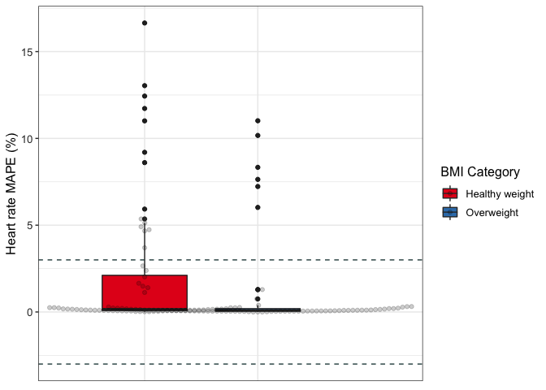

```r
df <- read.csv("val_data.csv")
df <- df[,-1]
```


```r
summary(df$MPE)
```

```
##     Min.  1st Qu.   Median     Mean  3rd Qu.     Max.     NA's 
## -1.00000 -0.10583 -0.01450 -0.04315  0.01396  5.30000      294
```

```r
df$MPE[is.na(df$MPE)] <- (((df$devicemean - df$critmean)/df$critmean))
```

```
## Warning in df$MPE[is.na(df$MPE)] <- (((df$devicemean - df$critmean)/
## df$critmean)): number of items to replace is not a multiple of replacement
## length
```

```r
summary(df$MPE)
```

```
##     Min.  1st Qu.   Median     Mean  3rd Qu.     Max.     NA's 
## -1.00000 -0.09365 -0.01152 -0.03549  0.01493  5.30000       98
```

## Data Cleaning 


```r
data <- df %>%
  select(Brand, device_name, Measured, Setting, Wear_Location, age_code, BMI, population_m, population_f, MPE)
str(data)
```

```
## 'data.frame':	1672 obs. of  10 variables:
##  $ Brand        : chr  "Apple" "Apple" "Apple" "Apple" ...
##  $ device_name  : chr  "Apple Watch" "Apple Watch" "Apple Watch" "Apple Watch Series 2" ...
##  $ Measured     : chr  "HR" "HR" "HR" "HR" ...
##  $ Setting      : chr  "Controlled" "Controlled" "Controlled" "Controlled" ...
##  $ Wear_Location: chr  "Wrist" "Wrist" "Wrist" "Wrist" ...
##  $ age_code     : chr  "A" "A" "A" "A" ...
##  $ BMI          : chr  "24.6" "24.6" "24.6" "25.83" ...
##  $ population_m : chr  "26" "26" "26" "22" ...
##  $ population_f : chr  "36" "36" "36" "28" ...
##  $ MPE          : num  0.00719 0.0011 -0.00533 0.00719 0.0011 ...
```


```r
data$age_code <- as.factor(data$age_code)
data$Brand <- as.factor(data$Brand)
data$Measured <- as.factor(data$Measured)
data$Setting <- as.factor(data$Setting)
data$Wear_Location <- as.factor(data$Wear_Location)
data$population_f <- as.numeric(data$population_f)
```

```
## Warning: NAs introduced by coercion
```

```r
data$population_m <- as.numeric(data$population_m)
```

```
## Warning: NAs introduced by coercion
```

```r
data$BMI <- as.numeric(data$BMI)
```

```
## Warning: NAs introduced by coercion
```

```r
str(data)
```

```
## 'data.frame':	1672 obs. of  10 variables:
##  $ Brand        : Factor w/ 9 levels "Apple","Fitbit",..: 1 1 1 1 1 1 1 1 1 1 ...
##  $ device_name  : chr  "Apple Watch" "Apple Watch" "Apple Watch" "Apple Watch Series 2" ...
##  $ Measured     : Factor w/ 3 levels "EE","HR","SC": 2 2 2 2 2 2 3 3 3 3 ...
##  $ Setting      : Factor w/ 2 levels "Controlled","Free-Living": 1 1 1 1 1 1 1 1 1 1 ...
##  $ Wear_Location: Factor w/ 6 levels "LAF","Thigh",..: 6 6 6 6 6 6 6 6 6 6 ...
##  $ age_code     : Factor w/ 3 levels "A","C","OA": 1 1 1 1 1 1 1 1 1 1 ...
##  $ BMI          : num  24.6 24.6 24.6 25.8 25.8 ...
##  $ population_m : num  26 26 26 22 22 22 16 16 16 16 ...
##  $ population_f : num  36 36 36 28 28 28 15 15 15 15 ...
##  $ MPE          : num  0.00719 0.0011 -0.00533 0.00719 0.0011 ...
```

## Data Cleaning by Variable

### MPE (Outcome Variable)


```r
#convert to percentage
data <- data %>%
  mutate(mpe_percent = MPE*100)

summary(data)
```

```
##       Brand     device_name        Measured         Setting    
##  Fitbit  :961   Length:1672        EE: 334   Controlled :1561  
##  Garmin  :282   Class :character   HR: 271   Free-Living: 111  
##  Withings:134   Mode  :character   SC:1067                     
##  Apple   :131                                                  
##  Polar   : 67                                                  
##  Misfit  : 50                                                  
##  (Other) : 47                                                  
##    Wear_Location  age_code       BMI         population_m    population_f  
##  LAF      :  69   A :1411   Min.   :20.50   Min.   : 0.00   Min.   : 0.00  
##  Thigh    :   1   C :  28   1st Qu.:23.40   1st Qu.: 8.00   1st Qu.: 9.50  
##  Torso    : 111   OA: 233   Median :24.60   Median :12.00   Median :12.00  
##  Upper Arm:   6             Mean   :24.55   Mean   :14.98   Mean   :14.44  
##  Waist/Hip: 389             3rd Qu.:25.83   3rd Qu.:19.00   3rd Qu.:18.00  
##  Wrist    :1096             Max.   :30.80   Max.   :91.00   Max.   :96.00  
##                             NA's   :767     NA's   :33      NA's   :33     
##       MPE            mpe_percent      
##  Min.   :-1.00000   Min.   :-100.000  
##  1st Qu.:-0.09365   1st Qu.:  -9.365  
##  Median :-0.01152   Median :  -1.152  
##  Mean   :-0.03549   Mean   :  -3.549  
##  3rd Qu.: 0.01493   3rd Qu.:   1.493  
##  Max.   : 5.30000   Max.   : 530.000  
##  NA's   :98         NA's   :98
```


```r
mpe_hist <- ggplot(data, aes(mpe_percent)) + 
                  geom_histogram(bins = 25) +
                  theme_classic()
plot(mpe_hist)
```

```
## Warning: Removed 98 rows containing non-finite values (stat_bin).
```

<!-- -->


```r
mpe_box <- ggplot(data, aes(mpe_percent)) + 
                geom_boxplot() +
                coord_flip() +
                theme_classic()
plot(mpe_box)
```

```
## Warning: Removed 98 rows containing non-finite values (stat_boxplot).
```

<!-- -->


```r
#creating a dataframe containing the extreme outliers
df_out <- data %>%
  identify_outliers("mpe_percent") %>%
        filter(is.extreme == TRUE)
```


```r
#merging the outlier dataframe with our original data
total <- merge(data, df_out, all.x = TRUE)
#renaming those not extreme as FALSE instead of NA
total$is.extreme[is.na(total$is.extreme)] <- FALSE
table(total$is.extreme)
```

```
## 
## FALSE  TRUE 
##  1478   200
```


```r
#subsetting the non-outliers in the data
df <- subset(total, is.extreme != TRUE)
```


```r
df <- df[-c(12:13)]
summary(df)
```

```
##       Brand     device_name        Measured        Setting       Wear_Location
##  Fitbit  :855   Length:1478        EE:261   Controlled :1379   LAF      : 55  
##  Garmin  :256   Class :character   HR:269   Free-Living:  99   Thigh    :  1  
##  Apple   :118   Mode  :character   SC:948                      Torso    : 89  
##  Withings:105                                                  Upper Arm:  6  
##  Polar   : 55                                                  Waist/Hip:349  
##  Misfit  : 42                                                  Wrist    :978  
##  (Other) : 47                                                                 
##  age_code       BMI         population_m    population_f        MPE          
##  A :1262   Min.   :20.50   Min.   : 0.00   Min.   : 0.00   Min.   :-0.41931  
##  C :  28   1st Qu.:23.40   1st Qu.: 8.00   1st Qu.:10.00   1st Qu.:-0.06925  
##  OA: 188   Median :24.60   Median :12.00   Median :12.00   Median :-0.01087  
##            Mean   :24.47   Mean   :14.94   Mean   :14.34   Mean   :-0.03439  
##            3rd Qu.:25.83   3rd Qu.:18.00   3rd Qu.:18.00   3rd Qu.: 0.00845  
##            Max.   :30.80   Max.   :91.00   Max.   :96.00   Max.   : 0.33841  
##            NA's   :671     NA's   :31      NA's   :31      NA's   :98        
##   mpe_percent      
##  Min.   :-41.9310  
##  1st Qu.: -6.9250  
##  Median : -1.0872  
##  Mean   : -3.4387  
##  3rd Qu.:  0.8448  
##  Max.   : 33.8415  
##  NA's   :98
```

```r
round(stat.desc(df$mpe_percent),2)
```

```
##      nbr.val     nbr.null       nbr.na          min          max        range 
##      1380.00        66.00        98.00       -41.93        33.84        75.77 
##          sum       median         mean      SE.mean CI.mean.0.95          var 
##     -4745.43        -1.09        -3.44         0.32         0.63       143.01 
##      std.dev     coef.var 
##        11.96        -3.48
```


```r
mpe_hist_clean <- ggplot(df, aes(mpe_percent)) + 
                  geom_histogram(bins = 30) +
                  theme_classic()
plot(mpe_hist_clean)
```

```
## Warning: Removed 98 rows containing non-finite values (stat_bin).
```

<!-- -->


```r
mpe_box_clean <- ggplot(df, aes(mpe_percent)) + 
                  geom_boxplot() +
                  coord_flip() +
                  theme_classic()

plot(mpe_box_clean)
```

```
## Warning: Removed 98 rows containing non-finite values (stat_boxplot).
```

<!-- -->

### AGE


```r
levels(df$age_code) <- c("Adults", "Children", "Older Adults")
levels(df$age_code)
```

```
## [1] "Adults"       "Children"     "Older Adults"
```


### SEX


```r
df <- df %>%
        mutate(sex = case_when(
                population_m > population_f ~ "Male",
                population_m < population_f ~ "Female"
        ))
```


```r
df$sex <- as.factor(df$sex)

df_sex <- drop_na(df, sex)
summary(df_sex)
```

```
##       Brand     device_name        Measured        Setting       Wear_Location
##  Fitbit  :618   Length:1096        EE:185   Controlled :1009   LAF      : 53  
##  Garmin  :187   Class :character   HR:228   Free-Living:  87   Thigh    :  1  
##  Apple   : 93   Mode  :character   SC:683                      Torso    : 65  
##  Withings: 82                                                  Upper Arm:  0  
##  Polar   : 41                                                  Waist/Hip:253  
##  Misfit  : 40                                                  Wrist    :724  
##  (Other) : 35                                                                 
##          age_code        BMI        population_m    population_f  
##  Adults      :884   Min.   :20.5   Min.   : 0.00   Min.   : 0.00  
##  Children    : 25   1st Qu.:23.6   1st Qu.: 8.00   1st Qu.: 9.00  
##  Older Adults:187   Median :24.6   Median :13.00   Median :13.00  
##                     Mean   :24.6   Mean   :15.79   Mean   :14.99  
##                     3rd Qu.:25.7   3rd Qu.:20.00   3rd Qu.:18.00  
##                     Max.   :30.8   Max.   :91.00   Max.   :96.00  
##                     NA's   :464                                   
##       MPE            mpe_percent          sex     
##  Min.   :-0.41931   Min.   :-41.931   Female:581  
##  1st Qu.:-0.07717   1st Qu.: -7.717   Male  :515  
##  Median :-0.01112   Median : -1.112               
##  Mean   :-0.03611   Mean   : -3.611               
##  3rd Qu.: 0.01406   3rd Qu.:  1.406               
##  Max.   : 0.33841   Max.   : 33.841               
##  NA's   :76         NA's   :76
```

### BMI


```r
df <- df_sex %>%
        mutate(bmi_code = case_when(
                BMI >= 18.5 & BMI <= 24.9 ~ "Healthy weight",
                BMI > 24.9 & BMI <= 29.9 ~ "Overweight",
                BMI > 29.9 ~ "Obese"
        ))
```


```r
df$bmi_code <- as.factor(df$bmi_code)
df <- drop_na(df, bmi_code)
summary(df)
```

```
##       Brand     device_name        Measured        Setting      Wear_Location
##  Fitbit  :329   Length:632         EE:115   Controlled :589   LAF      : 14  
##  Garmin  :111   Class :character   HR:136   Free-Living: 43   Thigh    :  0  
##  Apple   : 66   Mode  :character   SC:381                     Torso    : 36  
##  Withings: 47                                                 Upper Arm:  0  
##  Polar   : 31                                                 Waist/Hip:140  
##  Misfit  : 28                                                 Wrist    :442  
##  (Other) : 20                                                                
##          age_code        BMI        population_m    population_f 
##  Adults      :567   Min.   :20.5   Min.   : 0.00   Min.   : 0.0  
##  Children    :  2   1st Qu.:23.6   1st Qu.: 9.00   1st Qu.:11.0  
##  Older Adults: 63   Median :24.6   Median :17.00   Median :14.0  
##                     Mean   :24.6   Mean   :16.49   Mean   :17.2  
##                     3rd Qu.:25.7   3rd Qu.:21.00   3rd Qu.:23.0  
##                     Max.   :30.8   Max.   :74.00   Max.   :75.0  
##                                                                  
##       MPE            mpe_percent          sex                bmi_code  
##  Min.   :-0.41900   Min.   :-41.900   Female:346   Healthy weight:380  
##  1st Qu.:-0.06308   1st Qu.: -6.308   Male  :286   Obese         :  2  
##  Median :-0.00775   Median : -0.775                Overweight    :250  
##  Mean   :-0.02725   Mean   : -2.725                                    
##  3rd Qu.: 0.01771   3rd Qu.:  1.771                                    
##  Max.   : 0.32740   Max.   : 32.740                                    
##  NA's   :48         NA's   :48
```


```r
#relevel factors
df$bmi_code <- fct_relevel(df$bmi_code, c("Healthy weight","Overweight","Obese"))
```

## MPE for Step count, heart rate & energy expenditure across different groups


```r
#AGE GROUP
df %>%
    group_by(age_code, Measured) %>%
    get_summary_stats(mpe_percent, type = "mean_sd") %>%
    arrange(Measured)
```

<div class="kable-table">

|Measured |age_code     |variable    |   n|    mean|     sd|
|:--------|:------------|:-----------|---:|-------:|------:|
|EE       |Adults       |mpe_percent | 113|  -6.519| 18.211|
|EE       |Older Adults |mpe_percent |   1|   9.241|     NA|
|HR       |Adults       |mpe_percent | 115|  -0.929|  6.887|
|HR       |Children     |mpe_percent |   1|   0.100|     NA|
|SC       |Adults       |mpe_percent | 291|  -0.524|  9.001|
|SC       |Children     |mpe_percent |   1| -36.478|     NA|
|SC       |Older Adults |mpe_percent |  62|  -9.161| 12.688|

</div>


```r
#SEX GROUP
df %>%
    group_by(sex, Measured) %>%
    get_summary_stats(mpe_percent, type = "mean_sd") %>%
    arrange(Measured)
```

<div class="kable-table">

|Measured |sex    |variable    |   n|   mean|     sd|
|:--------|:------|:-----------|---:|------:|------:|
|EE       |Female |mpe_percent |  43| -4.344| 17.173|
|EE       |Male   |mpe_percent |  71| -7.614| 18.790|
|HR       |Female |mpe_percent |  73| -1.287|  7.437|
|HR       |Male   |mpe_percent |  43| -0.297|  5.773|
|SC       |Female |mpe_percent | 187| -2.890| 11.450|
|SC       |Male   |mpe_percent | 167| -1.298|  9.084|

</div>


```r
#BMI GROUP
df %>%
    group_by(bmi_code, Measured) %>%
    get_summary_stats(mpe_percent, type = "mean_sd") %>%
    arrange(Measured)
```

<div class="kable-table">

|Measured |bmi_code       |variable    |   n|    mean|     sd|
|:--------|:--------------|:-----------|---:|-------:|------:|
|EE       |Healthy weight |mpe_percent |  79|  -9.463| 16.972|
|EE       |Overweight     |mpe_percent |  35|   0.576| 19.157|
|HR       |Healthy weight |mpe_percent |  55|  -2.255|  8.960|
|HR       |Overweight     |mpe_percent |  61|   0.284|  3.845|
|SC       |Healthy weight |mpe_percent | 218|   0.372|  8.845|
|SC       |Overweight     |mpe_percent | 134|  -6.052| 11.362|
|SC       |Obese          |mpe_percent |   2| -13.618| 21.753|

</div>


```r
#number of studies for each population and measures
df <- df %>%
  group_by(Measured, bmi_code, sex, age_code) %>%
      mutate(n_studies = n())
```

## Brand


```r
df <- filter(df, Brand != "Mio" & Brand != "Xiaomi")
```


```r
df %>%
    group_by(Brand, bmi_code, Measured) %>%
    get_summary_stats(mpe_percent, type = "mean_sd") %>%
    arrange(Brand, Measured)
```

<div class="kable-table">

|Brand    |Measured |bmi_code       |variable    |   n|    mean|     sd|
|:--------|:--------|:--------------|:-----------|---:|-------:|------:|
|Apple    |EE       |Healthy weight |mpe_percent |   8|   1.990| 15.765|
|Apple    |EE       |Overweight     |mpe_percent |   6|  11.029| 13.539|
|Apple    |HR       |Healthy weight |mpe_percent |   6|  -1.421|  2.487|
|Apple    |HR       |Overweight     |mpe_percent |  27|   2.207|  3.714|
|Apple    |SC       |Healthy weight |mpe_percent |   9|   0.748|  2.252|
|Apple    |SC       |Overweight     |mpe_percent |   6|   0.063|  2.556|
|Fitbit   |EE       |Healthy weight |mpe_percent |  30|  -6.238| 16.171|
|Fitbit   |EE       |Overweight     |mpe_percent |  20|  -4.112| 17.154|
|Fitbit   |HR       |Healthy weight |mpe_percent |  20|  -3.731|  7.145|
|Fitbit   |HR       |Overweight     |mpe_percent |  27|  -1.773|  2.532|
|Fitbit   |SC       |Healthy weight |mpe_percent | 112|   0.657|  8.222|
|Fitbit   |SC       |Overweight     |mpe_percent |  95|  -7.228| 12.927|
|Fitbit   |SC       |Obese          |mpe_percent |   2| -13.618| 21.753|
|Garmin   |EE       |Healthy weight |mpe_percent |  18|  -8.449| 18.008|
|Garmin   |EE       |Overweight     |mpe_percent |   7|  -0.328| 25.723|
|Garmin   |HR       |Healthy weight |mpe_percent |  27|  -1.709| 11.129|
|Garmin   |HR       |Overweight     |mpe_percent |   2|   1.983|  0.307|
|Garmin   |SC       |Healthy weight |mpe_percent |  28|   0.993|  4.143|
|Garmin   |SC       |Overweight     |mpe_percent |  16|  -4.554|  3.631|
|Misfit   |EE       |Healthy weight |mpe_percent |   2| -24.437| 13.637|
|Misfit   |SC       |Healthy weight |mpe_percent |  15|   2.203|  8.949|
|Misfit   |SC       |Overweight     |mpe_percent |   7|  -5.910|  7.399|
|Polar    |EE       |Overweight     |mpe_percent |   2|  19.261| 14.170|
|Polar    |HR       |Overweight     |mpe_percent |   5|   0.328|  5.955|
|Polar    |SC       |Healthy weight |mpe_percent |  21|   1.945| 16.941|
|Polar    |SC       |Overweight     |mpe_percent |   2|  -2.347| 15.207|
|Samsung  |HR       |Healthy weight |mpe_percent |   1|   4.933|     NA|
|Samsung  |SC       |Healthy weight |mpe_percent |  11|  -0.186|  4.484|
|Samsung  |SC       |Overweight     |mpe_percent |   2|  -3.575|  0.686|
|Withings |EE       |Healthy weight |mpe_percent |  21| -17.874| 14.372|
|Withings |SC       |Healthy weight |mpe_percent |  17|  -1.785|  4.134|
|Withings |SC       |Overweight     |mpe_percent |   6|   0.235|  0.575|

</div>


```r
df %>%
    group_by(Brand, age_code, Measured) %>%
    get_summary_stats(mpe_percent, type = "mean_sd") %>%
    arrange(Brand, Measured)
```

<div class="kable-table">

|Brand    |Measured |age_code     |variable    |   n|    mean|     sd|
|:--------|:--------|:------------|:-----------|---:|-------:|------:|
|Apple    |EE       |Adults       |mpe_percent |  14|   5.864| 15.029|
|Apple    |HR       |Adults       |mpe_percent |  33|   1.547|  3.768|
|Apple    |SC       |Adults       |mpe_percent |  14|   0.394|  2.379|
|Apple    |SC       |Older Adults |mpe_percent |   1|   1.590|     NA|
|Fitbit   |EE       |Adults       |mpe_percent |  50|  -5.388| 16.431|
|Fitbit   |HR       |Adults       |mpe_percent |  46|  -2.665|  5.106|
|Fitbit   |HR       |Children     |mpe_percent |   1|   0.100|     NA|
|Fitbit   |SC       |Adults       |mpe_percent | 158|  -0.451|  9.142|
|Fitbit   |SC       |Children     |mpe_percent |   1| -36.478|     NA|
|Fitbit   |SC       |Older Adults |mpe_percent |  50| -10.652| 13.486|
|Garmin   |EE       |Adults       |mpe_percent |  25|  -6.175| 20.223|
|Garmin   |HR       |Adults       |mpe_percent |  29|  -1.455| 10.766|
|Garmin   |SC       |Adults       |mpe_percent |  39|  -0.488|  4.684|
|Garmin   |SC       |Older Adults |mpe_percent |   5|  -5.206|  3.246|
|Misfit   |EE       |Adults       |mpe_percent |   2| -24.437| 13.637|
|Misfit   |SC       |Adults       |mpe_percent |  18|   0.441|  9.655|
|Misfit   |SC       |Older Adults |mpe_percent |   4|  -4.065|  6.124|
|Polar    |EE       |Adults       |mpe_percent |   1|  29.280|     NA|
|Polar    |EE       |Older Adults |mpe_percent |   1|   9.241|     NA|
|Polar    |HR       |Adults       |mpe_percent |   5|   0.328|  5.955|
|Polar    |SC       |Adults       |mpe_percent |  22|   1.262| 16.841|
|Polar    |SC       |Older Adults |mpe_percent |   1|   8.406|     NA|
|Samsung  |HR       |Adults       |mpe_percent |   1|   4.933|     NA|
|Samsung  |SC       |Adults       |mpe_percent |  12|  -0.508|  4.420|
|Samsung  |SC       |Older Adults |mpe_percent |   1|  -3.090|     NA|
|Withings |EE       |Adults       |mpe_percent |  21| -17.874| 14.372|
|Withings |SC       |Adults       |mpe_percent |  23|  -1.258|  3.650|

</div>


```r
df %>%
    group_by(Brand, sex, Measured) %>%
    get_summary_stats(mpe_percent, type = "mean_sd") %>%
    arrange(Brand, Measured)
```

<div class="kable-table">

|Brand    |Measured |sex    |variable    |   n|    mean|     sd|
|:--------|:--------|:------|:-----------|---:|-------:|------:|
|Apple    |EE       |Female |mpe_percent |   4|   3.071| 18.808|
|Apple    |EE       |Male   |mpe_percent |  10|   6.982| 14.265|
|Apple    |HR       |Female |mpe_percent |  18|  -0.326|  1.824|
|Apple    |HR       |Male   |mpe_percent |  15|   3.795|  4.298|
|Apple    |SC       |Female |mpe_percent |   3|  -1.610|  2.787|
|Apple    |SC       |Male   |mpe_percent |  12|   0.995|  1.979|
|Fitbit   |EE       |Female |mpe_percent |  29|  -9.385| 14.797|
|Fitbit   |EE       |Male   |mpe_percent |  21|   0.133| 17.312|
|Fitbit   |HR       |Female |mpe_percent |  29|  -3.070|  5.993|
|Fitbit   |HR       |Male   |mpe_percent |  18|  -1.858|  3.056|
|Fitbit   |SC       |Female |mpe_percent | 115|  -2.751| 13.046|
|Fitbit   |SC       |Male   |mpe_percent |  94|  -3.447|  9.087|
|Garmin   |EE       |Female |mpe_percent |   9|   4.869| 17.114|
|Garmin   |EE       |Male   |mpe_percent |  16| -12.388| 19.590|
|Garmin   |HR       |Female |mpe_percent |  20|  -0.051| 11.750|
|Garmin   |HR       |Male   |mpe_percent |   9|  -4.575|  7.867|
|Garmin   |SC       |Female |mpe_percent |  21|  -2.173|  3.089|
|Garmin   |SC       |Male   |mpe_percent |  23|   0.024|  5.762|
|Misfit   |EE       |Male   |mpe_percent |   2| -24.437| 13.637|
|Misfit   |SC       |Female |mpe_percent |   8|  -2.336|  6.841|
|Misfit   |SC       |Male   |mpe_percent |  14|   0.740| 10.333|
|Polar    |EE       |Female |mpe_percent |   1|  29.280|     NA|
|Polar    |EE       |Male   |mpe_percent |   1|   9.241|     NA|
|Polar    |HR       |Female |mpe_percent |   5|   0.328|  5.955|
|Polar    |SC       |Female |mpe_percent |   9|  -5.455| 19.336|
|Polar    |SC       |Male   |mpe_percent |  14|   6.090| 13.254|
|Samsung  |HR       |Male   |mpe_percent |   1|   4.933|     NA|
|Samsung  |SC       |Female |mpe_percent |   3|  -2.783|  1.454|
|Samsung  |SC       |Male   |mpe_percent |  10|  -0.084|  4.714|
|Withings |EE       |Male   |mpe_percent |  21| -17.874| 14.372|
|Withings |SC       |Female |mpe_percent |  23|  -1.258|  3.650|

</div>

## PLOTS BY Measures

### Filtering the data by Measured


```r
val_data_sc <- filter(df, Measured == "SC")
val_data_hr <- filter(df, Measured == "HR")
val_data_ee <- filter(df, Measured == "EE")
```


### Validity of Step count by Age

* Dashed grey lines indicate ± 3% measurement error


```r
#options(repr.plot.width = 25, repr.plot.height = 8)
age_sc_plot <- ggplot(val_data_sc, aes(x = 1, y = mpe_percent, fill = age_code)) +
                    geom_boxplot(na.rm = TRUE) +
                    geom_hline(yintercept = 3, size = 0.5, colour = "darkslategray", linetype = "dashed") + 
                    geom_hline(yintercept = -3, size = 0.5, colour = "darkslategray", linetype = "dashed") +   
                    scale_y_continuous(limits=c(-6, 6)) +
                    ylab("Step Count MPE (%)") +
                    scale_colour_brewer(palette="Dark2") +
                    theme_bw() +
                    theme(axis.text.x = element_blank(),
                          axis.title.x = element_blank(),
                          axis.ticks.x = element_blank(),
                        axis.text.y = element_text(colour = "grey20", size = 10),
                        strip.text = element_text(face = "italic"),
                        text = element_text(size = 12)) 
plot(age_sc_plot)
```

<!-- -->
### Validity of step count by Sex


```r
sex_sc_plot <- ggplot(val_data_sc, aes(x = 1, y = mpe_percent, fill = sex)) +
                    geom_boxplot(na.rm = TRUE) +
                    geom_hline(yintercept = 3, size = 0.5, colour = "darkslategray", linetype = "dashed") + 
                    geom_hline(yintercept = -3, size = 0.5, colour = "darkslategray", linetype = "dashed") +   
                    scale_y_continuous(limits=c(-6, 6)) +
                    ylab("Step Count MPE (%)") +
                    scale_colour_brewer(palette="Dark2") +
                    theme_bw() +
                    theme(axis.text.x = element_blank(),
                          axis.title.x = element_blank(),
                          axis.ticks.x = element_blank(),
                        axis.text.y = element_text(colour = "grey20", size = 10),
                        strip.text = element_text(face = "italic"),
                        text = element_text(size = 12)) 
plot(sex_sc_plot)
```

<!-- -->

### Validity of step count by BMI


```r
bmi_sc_plot <- ggplot(val_data_sc, aes(x = 1, y = mpe_percent, fill = bmi_code)) +
                    geom_boxplot(na.rm = TRUE) +
                    geom_hline(yintercept = 3, size = 0.5, colour = "darkslategray", linetype = "dashed") + 
                    geom_hline(yintercept = -3, size = 0.5, colour = "darkslategray", linetype = "dashed") +   
                    scale_y_continuous(limits=c(-6, 6)) +
                    ylab("Step Count MPE (%)") +
                    scale_colour_brewer(palette="Dark2") +
                    theme_bw() +
                    theme(axis.text.x = element_blank(),
                          axis.title.x = element_blank(),
                          axis.ticks.x = element_blank(),
                        axis.text.y = element_text(colour = "grey20", size = 10),
                        strip.text = element_text(face = "italic"),
                        text = element_text(size = 12)) 
plot(bmi_sc_plot)
```

<!-- -->

### Validity of Heart rate by Age

* Dashed grey lines indicate ± 3% measurement error


```r
age_hr_plot <- ggplot(val_data_hr, aes(x = 1, y = mpe_percent, fill = age_code)) +
                    geom_boxplot(na.rm = TRUE) + 
                    geom_hline(yintercept = 3, size = 0.5, colour = "darkslategray", linetype = "dashed") + 
                    geom_hline(yintercept = -3, size = 0.5, colour = "darkslategray", linetype = "dashed") +   
                    scale_y_continuous(limits=c(-6, 6)) +
                    ylab("Heart rate MPE (%)") +
                    scale_colour_brewer(palette="Dark2") +
                    theme_bw() +
                    theme(axis.text.x = element_blank(),
                          axis.title.x = element_blank(),
                          axis.ticks.x = element_blank(),
                        axis.text.y = element_text(colour = "grey20", size = 10),
                        strip.text = element_text(face = "italic"),
                        text = element_text(size = 12)) 
plot(age_hr_plot)
```

<!-- -->

### Validity of heart rate by sex


```r
sex_hr_plot <- ggplot(val_data_hr, aes(x = 1, y = mpe_percent, fill = sex)) +
                    geom_boxplot(na.rm = TRUE) + 
                    geom_hline(yintercept = 3, size = 0.5, colour = "darkslategray", linetype = "dashed") + 
                    geom_hline(yintercept = -3, size = 0.5, colour = "darkslategray", linetype = "dashed") +   
                    scale_y_continuous(limits=c(-6, 6)) +
                    ylab("Heart rate MPE (%)") +
                    scale_colour_brewer(palette="Dark2") +
                    theme_bw() +
                    theme(axis.text.x = element_blank(),
                          axis.title.x = element_blank(),
                          axis.ticks.x = element_blank(),
                        axis.text.y = element_text(colour = "grey20", size = 10),
                        strip.text = element_text(face = "italic"),
                        text = element_text(size = 12)) 
plot(sex_hr_plot)
```

<!-- -->

### Validity of heart rate by BMI


```r
bmi_hr_plot <- ggplot(val_data_hr, aes(x = 1, y = mpe_percent, fill = bmi_code)) +
                    geom_boxplot(na.rm = TRUE) + 
                    geom_hline(yintercept = 3, size = 0.5, colour = "darkslategray", linetype = "dashed") + 
                    geom_hline(yintercept = -3, size = 0.5, colour = "darkslategray", linetype = "dashed") +   
                    scale_y_continuous(limits=c(-6, 6)) +
                    ylab("Heart rate MPE (%)") +
                    scale_colour_brewer(palette="Dark2") +
                    theme_bw() +
                    theme(axis.text.x = element_blank(),
                          axis.title.x = element_blank(),
                          axis.ticks.x = element_blank(),
                        axis.text.y = element_text(colour = "grey20", size = 10),
                        strip.text = element_text(face = "italic"),
                        text = element_text(size = 12)) 
plot(bmi_hr_plot)
```

<!-- -->

### Validity of Energy expenditure by Age

* Dashed grey lines indicate ± 3% measurement error


```r
age_ee_plot <- ggplot(val_data_ee, aes(x = 1, y = mpe_percent, fill = age_code)) +
                    geom_boxplot(na.rm = TRUE) + 
                    geom_hline(yintercept = 3, size = 0.5, colour = "darkslategray", linetype = "dashed") + 
                    geom_hline(yintercept = -3, size = 0.5, colour = "darkslategray", linetype = "dashed") +   
                    scale_y_continuous(limits=c(-6, 6)) +
                    ylab("Energy expenditure MPE (%)") +
                    scale_colour_brewer(palette="Dark2") +
                    theme_bw() +
                    theme(axis.text.x = element_blank(),
                          axis.title.x = element_blank(),
                          axis.ticks.x = element_blank(),
                        axis.text.y = element_text(colour = "grey20", size = 10),
                        strip.text = element_text(face = "italic"),
                        text = element_text(size = 12)) 
plot(age_ee_plot)
```

<!-- -->
### Validity of energy expenditure by sex


```r
sex_ee_plot <- ggplot(val_data_ee, aes(x = 1, y = mpe_percent, fill = sex)) +
                    geom_boxplot(na.rm = TRUE) + 
                    geom_hline(yintercept = 3, size = 0.5, colour = "darkslategray", linetype = "dashed") + 
                    geom_hline(yintercept = -3, size = 0.5, colour = "darkslategray", linetype = "dashed") +   
                    scale_y_continuous(limits=c(-6, 6)) +
                    ylab("Energy expenditure MPE (%)") +
                    scale_colour_brewer(palette="Dark2") +
                    theme_bw() +
                    theme(axis.text.x = element_blank(),
                          axis.title.x = element_blank(),
                          axis.ticks.x = element_blank(),
                        axis.text.y = element_text(colour = "grey20", size = 10),
                        strip.text = element_text(face = "italic"),
                        text = element_text(size = 12))
plot(sex_ee_plot)
```

<!-- -->

### Validity of energy expenditure by BMI


```r
bmi_ee_plot <- ggplot(val_data_ee, aes(x =1, y = mpe_percent, fill = bmi_code)) +
                    geom_boxplot(na.rm = TRUE) +   
                    geom_hline(yintercept = 3, size = 0.5, colour = "darkslategray", linetype = "dashed") + 
                    geom_hline(yintercept = -3, size = 0.5, colour = "darkslategray", linetype = "dashed") +   
                    scale_y_continuous(limits=c(-6, 6)) +
                    ylab("Energy Expenditure MPE (%)") +
                    scale_colour_brewer(palette="Dark2") +
                    theme_bw() +
                    theme(axis.text.x = element_blank(),
                          axis.title.x = element_blank(),
                          axis.ticks.x = element_blank(),
                        axis.text.y = element_text(colour = "grey20", size = 10),
                        strip.text = element_text(face = "italic"),
                        text = element_text(size = 12))
plot(bmi_ee_plot)
```

<!-- -->


```r
figure1 <- cowplot::plot_grid(age_sc_plot, sex_sc_plot, bmi_sc_plot, labels = c('Age','Sex','BMI'), label_size = 12)
figure2 <- cowplot::plot_grid(age_ee_plot, sex_ee_plot, bmi_ee_plot, labels = c('Age','Sex','BMI'), label_size = 12)
figure3 <- cowplot::plot_grid(age_hr_plot, sex_hr_plot, bmi_hr_plot, labels = c('Age','Sex','BMI'), label_size = 12)
```


```r
ggsave("SC-figure.pdf", plot = figure1, width = 12, height = 7)
ggsave("EE-figure.pdf", plot = figure2, width = 12, height = 7)
ggsave("HR-figure.pdf", plot = figure3, width = 12, height = 7)
```

## Step Count by Brand and Age


```r
age_sc_brand <- ggplot(val_data_sc, aes(x = Brand, y = mpe_percent, fill = age_code)) +
                    geom_boxplot(na.rm = TRUE) +   
                    geom_hline(yintercept = 3, size = 0.5, colour = "darkslategray", linetype = "dashed") + 
                    geom_hline(yintercept = -3, size = 0.5, colour = "darkslategray", linetype = "dashed") +   
                    scale_y_continuous(limits=c(-6, 6)) +
                    ylab("Step Count MPE (%)") +
                    scale_colour_brewer(palette="Dark2") +
                    theme_bw() +
                    theme(axis.ticks.x = element_blank(),
                        axis.text.y = element_text(colour = "grey20", size = 10),
                        strip.text = element_text(face = "italic"),
                        text = element_text(size = 12))
plot(age_sc_brand)
```

<!-- -->

## Step Count by Brand and BMI


```r
bmi_sc_brand <- ggplot(val_data_sc, aes(x = Brand, y = mpe_percent, fill = bmi_code)) +
                    geom_boxplot(na.rm = TRUE) +   
                    geom_hline(yintercept = 3, size = 0.5, colour = "darkslategray", linetype = "dashed") + 
                    geom_hline(yintercept = -3, size = 0.5, colour = "darkslategray", linetype = "dashed") +   
                    scale_y_continuous(limits=c(-6, 6)) +
                    ylab("Step Count MPE (%)") +
                    scale_colour_brewer(palette="Dark2") +
                    theme_bw() +
                    theme(axis.ticks.x = element_blank(),
                        axis.text.y = element_text(colour = "grey20", size = 10),
                        strip.text = element_text(face = "italic"),
                        text = element_text(size = 12))
plot(bmi_sc_brand)
```

<!-- -->

## Step Count by Brand and Sex


```r
sex_sc_brand <- ggplot(val_data_sc, aes(x = Brand, y = mpe_percent, fill = sex)) +
                    geom_boxplot(na.rm = TRUE) +   
                    geom_hline(yintercept = 3, size = 0.5, colour = "darkslategray", linetype = "dashed") + 
                    geom_hline(yintercept = -3, size = 0.5, colour = "darkslategray", linetype = "dashed") +   
                    scale_y_continuous(limits=c(-6, 6)) +
                    ylab("Step Count MPE (%)") +
                    scale_colour_brewer(palette="Dark2") +
                    theme_bw() +
                    theme(axis.ticks.x = element_blank(),
                        axis.text.y = element_text(colour = "grey20", size = 10),
                        strip.text = element_text(face = "italic"),
                        text = element_text(size = 12))
plot(sex_sc_brand)
```

<!-- -->

## Heart Rate by Brand and Age


```r
age_hr_brand <- ggplot(val_data_hr, aes(x = Brand, y = mpe_percent, fill = age_code)) +
                    geom_boxplot(na.rm = TRUE) +   
                    geom_hline(yintercept = 3, size = 0.5, colour = "darkslategray", linetype = "dashed") + 
                    geom_hline(yintercept = -3, size = 0.5, colour = "darkslategray", linetype = "dashed") +   
                    scale_y_continuous(limits=c(-6, 6)) +
                    ylab("Heart Rate MPE (%)") +
                    scale_colour_brewer(palette="Dark2") +
                    theme_bw() +
                    theme(axis.ticks.x = element_blank(),
                        axis.text.y = element_text(colour = "grey20", size = 10),
                        strip.text = element_text(face = "italic"),
                        text = element_text(size = 12))
plot(age_hr_brand)
```

<!-- -->

## Heart rate by Brand and BMI


```r
bmi_hr_brand <- ggplot(val_data_hr, aes(x = Brand, y = mpe_percent, fill = bmi_code)) +
                    geom_boxplot(na.rm = TRUE) +   
                    geom_hline(yintercept = 3, size = 0.5, colour = "darkslategray", linetype = "dashed") + 
                    geom_hline(yintercept = -3, size = 0.5, colour = "darkslategray", linetype = "dashed") +   
                    scale_y_continuous(limits=c(-6, 6)) +
                    ylab("Heart Rate MPE (%)") +
                    scale_colour_brewer(palette="Dark2") +
                    theme_bw() +
                    theme(axis.ticks.x = element_blank(),
                        axis.text.y = element_text(colour = "grey20", size = 10),
                        strip.text = element_text(face = "italic"),
                        text = element_text(size = 12))
plot(bmi_hr_brand)
```

<!-- -->

## Heart rate by Brand and Sex


```r
sex_hr_brand <- ggplot(val_data_hr, aes(x = Brand, y = mpe_percent, fill = sex)) +
                    geom_boxplot(na.rm = TRUE) +   
                    geom_hline(yintercept = 3, size = 0.5, colour = "darkslategray", linetype = "dashed") + 
                    geom_hline(yintercept = -3, size = 0.5, colour = "darkslategray", linetype = "dashed") +   
                    scale_y_continuous(limits=c(-6, 6)) +
                    ylab("Heart Rate MPE (%)") +
                    scale_colour_brewer(palette="Dark2") +
                    theme_bw() +
                    theme(axis.ticks.x = element_blank(),
                        axis.text.y = element_text(colour = "grey20", size = 10),
                        strip.text = element_text(face = "italic"),
                        text = element_text(size = 12))
plot(sex_hr_brand)
```

<!-- -->

## Energy Expenditure by Brand and BMI


```r
#options(repr.plot.width = 25, repr.plot.height = 8)
bmi_ee_brand <- ggplot(val_data_ee, aes(x = Brand, y = mpe_percent, fill = bmi_code)) +
                    geom_boxplot(na.rm = TRUE) +   
                    geom_hline(yintercept = 3, size = 0.5, colour = "darkslategray", linetype = "dashed") + 
                    geom_hline(yintercept = -3, size = 0.5, colour = "darkslategray", linetype = "dashed") +   
                    scale_y_continuous(limits=c(-6, 6)) +
                    ylab("Energy Expenditure MPE (%)") +
                    scale_colour_brewer(palette="Dark2") +
                    theme_bw() +
                    theme(axis.ticks.x = element_blank(),
                        axis.text.y = element_text(colour = "grey20", size = 10),
                        strip.text = element_text(face = "italic"),
                        text = element_text(size = 12))
plot(bmi_ee_brand)
```

<!-- -->

## Energy Expenditure by Brand and Age


```r
age_ee_brand <- ggplot(val_data_ee, aes(x = Brand, y = mpe_percent, fill = age_code)) +
                    geom_boxplot(na.rm = TRUE) +   
                    geom_hline(yintercept = 3, size = 0.5, colour = "darkslategray", linetype = "dashed") + 
                    geom_hline(yintercept = -3, size = 0.5, colour = "darkslategray", linetype = "dashed") +   
                    scale_y_continuous(limits=c(-6, 6)) +
                    ylab("Energy Expenditure MPE (%)") +
                    scale_colour_brewer(palette="Dark2") +
                    theme_bw() +
                    theme(axis.ticks.x = element_blank(),
                        axis.text.y = element_text(colour = "grey20", size = 10),
                        strip.text = element_text(face = "italic"),
                        text = element_text(size = 12))
plot(age_ee_brand)
```

<!-- -->

## Energy Expenditure by Brand and Sex


```r
sex_ee_brand <- ggplot(val_data_ee, aes(x = Brand, y = mpe_percent, fill = sex)) +
                    geom_boxplot(na.rm = TRUE) +   
                    geom_hline(yintercept = 3, size = 0.5, colour = "darkslategray", linetype = "dashed") + 
                    geom_hline(yintercept = -3, size = 0.5, colour = "darkslategray", linetype = "dashed") +   
                    scale_y_continuous(limits=c(-6, 6)) +
                    ylab("Energy Expenditure MPE (%)") +
                    scale_colour_brewer(palette="Dark2") +
                    theme_bw() +
                    theme(axis.ticks.x = element_blank(),
                        axis.text.y = element_text(colour = "grey20", size = 10),
                        strip.text = element_text(face = "italic"),
                        text = element_text(size = 12))
plot(sex_ee_brand)
```

<!-- -->

## ANOVA

### Step count validity with Age, Sex & BMI


```r
aov_sc_age <- aov(mpe_percent ~ age_code, data = val_data_sc)
summary(aov_sc_age)
```

```
##              Df Sum Sq Mean Sq F value   Pr(>F)    
## age_code      2   5200  2600.2   28.12 4.84e-12 ***
## Residuals   346  31995    92.5                     
## ---
## Signif. codes:  0 '***' 0.001 '**' 0.01 '*' 0.05 '.' 0.1 ' ' 1
## 27 observations deleted due to missingness
```


```r
aov_sc_sex <- aov(mpe_percent ~ sex, data = val_data_sc)
summary(aov_sc_sex)
```

```
##              Df Sum Sq Mean Sq F value Pr(>F)
## sex           1    146   146.1   1.369  0.243
## Residuals   347  37050   106.8               
## 27 observations deleted due to missingness
```


```r
aov_sc_bmi <- aov(mpe_percent ~ bmi_code, data = val_data_sc)
summary(aov_sc_bmi)
```

```
##              Df Sum Sq Mean Sq F value   Pr(>F)    
## bmi_code      2   4025  2012.7   20.99 2.48e-09 ***
## Residuals   346  33170    95.9                     
## ---
## Signif. codes:  0 '***' 0.001 '**' 0.01 '*' 0.05 '.' 0.1 ' ' 1
## 27 observations deleted due to missingness
```

### Energy Expenditure validity with Age, Sex & BMI


```r
aov_ee_age <- aov(mpe_percent ~ age_code, data = val_data_ee)
summary(aov_ee_age)
```

```
##              Df Sum Sq Mean Sq F value Pr(>F)
## age_code      1    246   246.2   0.742  0.391
## Residuals   112  37142   331.6               
## 1 observation deleted due to missingness
```


```r
aov_ee_sex <- aov(mpe_percent ~ sex, data = val_data_ee)
summary(aov_ee_sex)
```

```
##              Df Sum Sq Mean Sq F value Pr(>F)
## sex           1    286   286.4   0.865  0.354
## Residuals   112  37102   331.3               
## 1 observation deleted due to missingness
```


```r
aov_ee_bmi <- aov(mpe_percent ~ bmi_code, data = val_data_ee)
summary(aov_ee_bmi)
```

```
##              Df Sum Sq Mean Sq F value  Pr(>F)   
## bmi_code      1   2444    2444   7.834 0.00604 **
## Residuals   112  34944     312                   
## ---
## Signif. codes:  0 '***' 0.001 '**' 0.01 '*' 0.05 '.' 0.1 ' ' 1
## 1 observation deleted due to missingness
```


### Heart Rate validity with Age, Sex & BMI


```r
aov_hr_age <- aov(mpe_percent ~ age_code, data = val_data_hr)
summary(aov_hr_age)
```

```
##              Df Sum Sq Mean Sq F value Pr(>F)
## age_code      1      1    1.07   0.022  0.881
## Residuals   113   5406   47.84               
## 20 observations deleted due to missingness
```


```r
aov_hr_sex <- aov(mpe_percent ~ sex, data = val_data_hr)
summary(aov_hr_sex)
```

```
##              Df Sum Sq Mean Sq F value Pr(>F)
## sex           1     28   27.63    0.58  0.448
## Residuals   113   5379   47.61               
## 20 observations deleted due to missingness
```


```r
aov_hr_bmi <- aov(mpe_percent ~ bmi_code, data = val_data_hr)
summary(aov_hr_bmi)
```

```
##              Df Sum Sq Mean Sq F value Pr(>F)  
## bmi_code      1    192  191.68   4.153 0.0439 *
## Residuals   113   5215   46.15                 
## ---
## Signif. codes:  0 '***' 0.001 '**' 0.01 '*' 0.05 '.' 0.1 ' ' 1
## 20 observations deleted due to missingness
```

## Post Hoc Test


```r
tuk_sc_age <- TukeyHSD(aov_sc_age)
tuk_sc_age
```

```
##   Tukey multiple comparisons of means
##     95% family-wise confidence level
## 
## Fit: aov(formula = mpe_percent ~ age_code, data = val_data_sc)
## 
## $age_code
##                             diff        lwr        upr     p adj
## Children-Adults       -36.183450 -58.858137 -13.508763 0.0005918
## Older Adults-Adults    -8.867154 -12.038138  -5.696169 0.0000000
## Older Adults-Children  27.316296   4.499335  50.133257 0.0141157
```


```r
tuk_sc_bmi <- TukeyHSD(aov_sc_bmi)
tuk_sc_bmi
```

```
##   Tukey multiple comparisons of means
##     95% family-wise confidence level
## 
## Fit: aov(formula = mpe_percent ~ bmi_code, data = val_data_sc)
## 
## $bmi_code
##                                 diff        lwr       upr     p adj
## Overweight-Healthy weight  -6.754423  -9.295613 -4.213233 0.0000000
## Obese-Healthy weight      -14.320503 -30.693532  2.052525 0.1000804
## Obese-Overweight           -7.566081 -23.983944  8.851783 0.5241664
```


```r
tuk_ee_bmi <- TukeyHSD(aov_ee_bmi)
tuk_ee_bmi
```

```
##   Tukey multiple comparisons of means
##     95% family-wise confidence level
## 
## Fit: aov(formula = mpe_percent ~ bmi_code, data = val_data_ee)
## 
## $bmi_code
##                               diff      lwr     upr     p adj
## Overweight-Healthy weight 10.03885 2.932505 17.1452 0.0060377
```

## Regression Analysis

### Step Count validity by Age, sex and bmi


```r
sc_reg1 <- lm(mpe_percent ~ age_code, val_data_sc, offset = n_studies)

sc_reg2 <- lm(mpe_percent ~ sex, val_data_sc, offset = n_studies)

sc_reg3 <- lm(mpe_percent ~ bmi_code, val_data_sc, offset = n_studies)

tab_model(sc_reg1, sc_reg2, sc_reg3)
```

<table style="border-collapse:collapse; border:none;">
<tr>
<th style="border-top: double; text-align:center; font-style:normal; font-weight:bold; padding:0.2cm;  text-align:left; ">&nbsp;</th>
<th colspan="3" style="border-top: double; text-align:center; font-style:normal; font-weight:bold; padding:0.2cm; ">mpe percent</th>
<th colspan="3" style="border-top: double; text-align:center; font-style:normal; font-weight:bold; padding:0.2cm; ">mpe percent</th>
<th colspan="3" style="border-top: double; text-align:center; font-style:normal; font-weight:bold; padding:0.2cm; ">mpe percent</th>
</tr>
<tr>
<td style=" text-align:center; border-bottom:1px solid; font-style:italic; font-weight:normal;  text-align:left; ">Predictors</td>
<td style=" text-align:center; border-bottom:1px solid; font-style:italic; font-weight:normal;  ">Estimates</td>
<td style=" text-align:center; border-bottom:1px solid; font-style:italic; font-weight:normal;  ">CI</td>
<td style=" text-align:center; border-bottom:1px solid; font-style:italic; font-weight:normal;  ">p</td>
<td style=" text-align:center; border-bottom:1px solid; font-style:italic; font-weight:normal;  ">Estimates</td>
<td style=" text-align:center; border-bottom:1px solid; font-style:italic; font-weight:normal;  ">CI</td>
<td style=" text-align:center; border-bottom:1px solid; font-style:italic; font-weight:normal;  col7">p</td>
<td style=" text-align:center; border-bottom:1px solid; font-style:italic; font-weight:normal;  col8">Estimates</td>
<td style=" text-align:center; border-bottom:1px solid; font-style:italic; font-weight:normal;  col9">CI</td>
<td style=" text-align:center; border-bottom:1px solid; font-style:italic; font-weight:normal;  0">p</td>
</tr>
<tr>
<td style=" padding:0.2cm; text-align:left; vertical-align:top; text-align:left; ">(Intercept)</td>
<td style=" padding:0.2cm; text-align:left; vertical-align:top; text-align:center;  ">&#45;98.74</td>
<td style=" padding:0.2cm; text-align:left; vertical-align:top; text-align:center;  ">&#45;102.63&nbsp;&ndash;&nbsp;-94.85</td>
<td style=" padding:0.2cm; text-align:left; vertical-align:top; text-align:center;  "><strong>&lt;0.001</strong></td>
<td style=" padding:0.2cm; text-align:left; vertical-align:top; text-align:center;  ">&#45;91.77</td>
<td style=" padding:0.2cm; text-align:left; vertical-align:top; text-align:center;  ">&#45;97.46&nbsp;&ndash;&nbsp;-86.08</td>
<td style=" padding:0.2cm; text-align:left; vertical-align:top; text-align:center;  col7"><strong>&lt;0.001</strong></td>
<td style=" padding:0.2cm; text-align:left; vertical-align:top; text-align:center;  col8">&#45;118.29</td>
<td style=" padding:0.2cm; text-align:left; vertical-align:top; text-align:center;  col9">&#45;120.16&nbsp;&ndash;&nbsp;-116.42</td>
<td style=" padding:0.2cm; text-align:left; vertical-align:top; text-align:center;  0"><strong>&lt;0.001</strong></td>
</tr>
<tr>
<td style=" padding:0.2cm; text-align:left; vertical-align:top; text-align:left; ">age_code [Children]</td>
<td style=" padding:0.2cm; text-align:left; vertical-align:top; text-align:center;  ">61.26</td>
<td style=" padding:0.2cm; text-align:left; vertical-align:top; text-align:center;  ">&#45;4.59&nbsp;&ndash;&nbsp;127.11</td>
<td style=" padding:0.2cm; text-align:left; vertical-align:top; text-align:center;  ">0.068</td>
<td style=" padding:0.2cm; text-align:left; vertical-align:top; text-align:center;  "></td>
<td style=" padding:0.2cm; text-align:left; vertical-align:top; text-align:center;  "></td>
<td style=" padding:0.2cm; text-align:left; vertical-align:top; text-align:center;  col7"></td>
<td style=" padding:0.2cm; text-align:left; vertical-align:top; text-align:center;  col8"></td>
<td style=" padding:0.2cm; text-align:left; vertical-align:top; text-align:center;  col9"></td>
<td style=" padding:0.2cm; text-align:left; vertical-align:top; text-align:center;  0"></td>
</tr>
<tr>
<td style=" padding:0.2cm; text-align:left; vertical-align:top; text-align:left; ">age_code [Older Adults]</td>
<td style=" padding:0.2cm; text-align:left; vertical-align:top; text-align:center;  ">52.77</td>
<td style=" padding:0.2cm; text-align:left; vertical-align:top; text-align:center;  ">43.56&nbsp;&ndash;&nbsp;61.98</td>
<td style=" padding:0.2cm; text-align:left; vertical-align:top; text-align:center;  "><strong>&lt;0.001</strong></td>
<td style=" padding:0.2cm; text-align:left; vertical-align:top; text-align:center;  "></td>
<td style=" padding:0.2cm; text-align:left; vertical-align:top; text-align:center;  "></td>
<td style=" padding:0.2cm; text-align:left; vertical-align:top; text-align:center;  col7"></td>
<td style=" padding:0.2cm; text-align:left; vertical-align:top; text-align:center;  col8"></td>
<td style=" padding:0.2cm; text-align:left; vertical-align:top; text-align:center;  col9"></td>
<td style=" padding:0.2cm; text-align:left; vertical-align:top; text-align:center;  0"></td>
</tr>
<tr>
<td style=" padding:0.2cm; text-align:left; vertical-align:top; text-align:left; ">sex [Male]</td>
<td style=" padding:0.2cm; text-align:left; vertical-align:top; text-align:center;  "></td>
<td style=" padding:0.2cm; text-align:left; vertical-align:top; text-align:center;  "></td>
<td style=" padding:0.2cm; text-align:left; vertical-align:top; text-align:center;  "></td>
<td style=" padding:0.2cm; text-align:left; vertical-align:top; text-align:center;  ">5.39</td>
<td style=" padding:0.2cm; text-align:left; vertical-align:top; text-align:center;  ">&#45;2.83&nbsp;&ndash;&nbsp;13.62</td>
<td style=" padding:0.2cm; text-align:left; vertical-align:top; text-align:center;  col7">0.198</td>
<td style=" padding:0.2cm; text-align:left; vertical-align:top; text-align:center;  col8"></td>
<td style=" padding:0.2cm; text-align:left; vertical-align:top; text-align:center;  col9"></td>
<td style=" padding:0.2cm; text-align:left; vertical-align:top; text-align:center;  0"></td>
</tr>
<tr>
<td style=" padding:0.2cm; text-align:left; vertical-align:top; text-align:left; ">bmi_code [Overweight]</td>
<td style=" padding:0.2cm; text-align:left; vertical-align:top; text-align:center;  "></td>
<td style=" padding:0.2cm; text-align:left; vertical-align:top; text-align:center;  "></td>
<td style=" padding:0.2cm; text-align:left; vertical-align:top; text-align:center;  "></td>
<td style=" padding:0.2cm; text-align:left; vertical-align:top; text-align:center;  "></td>
<td style=" padding:0.2cm; text-align:left; vertical-align:top; text-align:center;  "></td>
<td style=" padding:0.2cm; text-align:left; vertical-align:top; text-align:center;  col7"></td>
<td style=" padding:0.2cm; text-align:left; vertical-align:top; text-align:center;  col8">74.24</td>
<td style=" padding:0.2cm; text-align:left; vertical-align:top; text-align:center;  col9">71.24&nbsp;&ndash;&nbsp;77.25</td>
<td style=" padding:0.2cm; text-align:left; vertical-align:top; text-align:center;  0"><strong>&lt;0.001</strong></td>
</tr>
<tr>
<td style=" padding:0.2cm; text-align:left; vertical-align:top; text-align:left; ">bmi_code [Obese]</td>
<td style=" padding:0.2cm; text-align:left; vertical-align:top; text-align:center;  "></td>
<td style=" padding:0.2cm; text-align:left; vertical-align:top; text-align:center;  "></td>
<td style=" padding:0.2cm; text-align:left; vertical-align:top; text-align:center;  "></td>
<td style=" padding:0.2cm; text-align:left; vertical-align:top; text-align:center;  "></td>
<td style=" padding:0.2cm; text-align:left; vertical-align:top; text-align:center;  "></td>
<td style=" padding:0.2cm; text-align:left; vertical-align:top; text-align:center;  col7"></td>
<td style=" padding:0.2cm; text-align:left; vertical-align:top; text-align:center;  col8">103.67</td>
<td style=" padding:0.2cm; text-align:left; vertical-align:top; text-align:center;  col9">84.30&nbsp;&ndash;&nbsp;123.04</td>
<td style=" padding:0.2cm; text-align:left; vertical-align:top; text-align:center;  0"><strong>&lt;0.001</strong></td>
</tr>
<tr>
<td style=" padding:0.2cm; text-align:left; vertical-align:top; text-align:left; padding-top:0.1cm; padding-bottom:0.1cm; border-top:1px solid;">Observations</td>
<td style=" padding:0.2cm; text-align:left; vertical-align:top; padding-top:0.1cm; padding-bottom:0.1cm; text-align:left; border-top:1px solid;" colspan="3">349</td>
<td style=" padding:0.2cm; text-align:left; vertical-align:top; padding-top:0.1cm; padding-bottom:0.1cm; text-align:left; border-top:1px solid;" colspan="3">349</td>
<td style=" padding:0.2cm; text-align:left; vertical-align:top; padding-top:0.1cm; padding-bottom:0.1cm; text-align:left; border-top:1px solid;" colspan="3">349</td>
</tr>
<tr>
<td style=" padding:0.2cm; text-align:left; vertical-align:top; text-align:left; padding-top:0.1cm; padding-bottom:0.1cm;">R<sup>2</sup> / R<sup>2</sup> adjusted</td>
<td style=" padding:0.2cm; text-align:left; vertical-align:top; padding-top:0.1cm; padding-bottom:0.1cm; text-align:left;" colspan="3">0.506 / 0.503</td>
<td style=" padding:0.2cm; text-align:left; vertical-align:top; padding-top:0.1cm; padding-bottom:0.1cm; text-align:left;" colspan="3">0.528 / 0.526</td>
<td style=" padding:0.2cm; text-align:left; vertical-align:top; padding-top:0.1cm; padding-bottom:0.1cm; text-align:left;" colspan="3">0.384 / 0.381</td>
</tr>

</table>

### Energy Expenditure validity by age, sex & bmi


```r
ee_reg1 <- lm(mpe_percent ~ age_code, val_data_ee, offset = n_studies)

ee_reg2 <- lm(mpe_percent ~ sex, val_data_ee, offset = n_studies)

ee_reg3 <- lm(mpe_percent ~ bmi_code, val_data_ee, offset = n_studies)

tab_model(ee_reg1, ee_reg2, ee_reg3)
```

<table style="border-collapse:collapse; border:none;">
<tr>
<th style="border-top: double; text-align:center; font-style:normal; font-weight:bold; padding:0.2cm;  text-align:left; ">&nbsp;</th>
<th colspan="3" style="border-top: double; text-align:center; font-style:normal; font-weight:bold; padding:0.2cm; ">mpe percent</th>
<th colspan="3" style="border-top: double; text-align:center; font-style:normal; font-weight:bold; padding:0.2cm; ">mpe percent</th>
<th colspan="3" style="border-top: double; text-align:center; font-style:normal; font-weight:bold; padding:0.2cm; ">mpe percent</th>
</tr>
<tr>
<td style=" text-align:center; border-bottom:1px solid; font-style:italic; font-weight:normal;  text-align:left; ">Predictors</td>
<td style=" text-align:center; border-bottom:1px solid; font-style:italic; font-weight:normal;  ">Estimates</td>
<td style=" text-align:center; border-bottom:1px solid; font-style:italic; font-weight:normal;  ">CI</td>
<td style=" text-align:center; border-bottom:1px solid; font-style:italic; font-weight:normal;  ">p</td>
<td style=" text-align:center; border-bottom:1px solid; font-style:italic; font-weight:normal;  ">Estimates</td>
<td style=" text-align:center; border-bottom:1px solid; font-style:italic; font-weight:normal;  ">CI</td>
<td style=" text-align:center; border-bottom:1px solid; font-style:italic; font-weight:normal;  col7">p</td>
<td style=" text-align:center; border-bottom:1px solid; font-style:italic; font-weight:normal;  col8">Estimates</td>
<td style=" text-align:center; border-bottom:1px solid; font-style:italic; font-weight:normal;  col9">CI</td>
<td style=" text-align:center; border-bottom:1px solid; font-style:italic; font-weight:normal;  0">p</td>
</tr>
<tr>
<td style=" padding:0.2cm; text-align:left; vertical-align:top; text-align:left; ">(Intercept)</td>
<td style=" padding:0.2cm; text-align:left; vertical-align:top; text-align:center;  ">&#45;41.30</td>
<td style=" padding:0.2cm; text-align:left; vertical-align:top; text-align:center;  ">&#45;45.47&nbsp;&ndash;&nbsp;-37.13</td>
<td style=" padding:0.2cm; text-align:left; vertical-align:top; text-align:center;  "><strong>&lt;0.001</strong></td>
<td style=" padding:0.2cm; text-align:left; vertical-align:top; text-align:center;  ">&#45;35.79</td>
<td style=" padding:0.2cm; text-align:left; vertical-align:top; text-align:center;  ">&#45;42.58&nbsp;&ndash;&nbsp;-28.99</td>
<td style=" padding:0.2cm; text-align:left; vertical-align:top; text-align:center;  col7"><strong>&lt;0.001</strong></td>
<td style=" padding:0.2cm; text-align:left; vertical-align:top; text-align:center;  col8">&#45;49.27</td>
<td style=" padding:0.2cm; text-align:left; vertical-align:top; text-align:center;  col9">&#45;53.50&nbsp;&ndash;&nbsp;-45.05</td>
<td style=" padding:0.2cm; text-align:left; vertical-align:top; text-align:center;  0"><strong>&lt;0.001</strong></td>
</tr>
<tr>
<td style=" padding:0.2cm; text-align:left; vertical-align:top; text-align:left; ">age_code [Older Adults]</td>
<td style=" padding:0.2cm; text-align:left; vertical-align:top; text-align:center;  ">49.54</td>
<td style=" padding:0.2cm; text-align:left; vertical-align:top; text-align:center;  ">5.03&nbsp;&ndash;&nbsp;94.05</td>
<td style=" padding:0.2cm; text-align:left; vertical-align:top; text-align:center;  "><strong>0.029</strong></td>
<td style=" padding:0.2cm; text-align:left; vertical-align:top; text-align:center;  "></td>
<td style=" padding:0.2cm; text-align:left; vertical-align:top; text-align:center;  "></td>
<td style=" padding:0.2cm; text-align:left; vertical-align:top; text-align:center;  col7"></td>
<td style=" padding:0.2cm; text-align:left; vertical-align:top; text-align:center;  col8"></td>
<td style=" padding:0.2cm; text-align:left; vertical-align:top; text-align:center;  col9"></td>
<td style=" padding:0.2cm; text-align:left; vertical-align:top; text-align:center;  0"></td>
</tr>
<tr>
<td style=" padding:0.2cm; text-align:left; vertical-align:top; text-align:left; ">sex [Male]</td>
<td style=" padding:0.2cm; text-align:left; vertical-align:top; text-align:center;  "></td>
<td style=" padding:0.2cm; text-align:left; vertical-align:top; text-align:center;  "></td>
<td style=" padding:0.2cm; text-align:left; vertical-align:top; text-align:center;  "></td>
<td style=" padding:0.2cm; text-align:left; vertical-align:top; text-align:center;  ">&#45;8.15</td>
<td style=" padding:0.2cm; text-align:left; vertical-align:top; text-align:center;  ">&#45;16.76&nbsp;&ndash;&nbsp;0.46</td>
<td style=" padding:0.2cm; text-align:left; vertical-align:top; text-align:center;  col7">0.063</td>
<td style=" padding:0.2cm; text-align:left; vertical-align:top; text-align:center;  col8"></td>
<td style=" padding:0.2cm; text-align:left; vertical-align:top; text-align:center;  col9"></td>
<td style=" padding:0.2cm; text-align:left; vertical-align:top; text-align:center;  0"></td>
</tr>
<tr>
<td style=" padding:0.2cm; text-align:left; vertical-align:top; text-align:left; ">bmi_code [Overweight]</td>
<td style=" padding:0.2cm; text-align:left; vertical-align:top; text-align:center;  "></td>
<td style=" padding:0.2cm; text-align:left; vertical-align:top; text-align:center;  "></td>
<td style=" padding:0.2cm; text-align:left; vertical-align:top; text-align:center;  "></td>
<td style=" padding:0.2cm; text-align:left; vertical-align:top; text-align:center;  "></td>
<td style=" padding:0.2cm; text-align:left; vertical-align:top; text-align:center;  "></td>
<td style=" padding:0.2cm; text-align:left; vertical-align:top; text-align:center;  col7"></td>
<td style=" padding:0.2cm; text-align:left; vertical-align:top; text-align:center;  col8">27.39</td>
<td style=" padding:0.2cm; text-align:left; vertical-align:top; text-align:center;  col9">19.76&nbsp;&ndash;&nbsp;35.02</td>
<td style=" padding:0.2cm; text-align:left; vertical-align:top; text-align:center;  0"><strong>&lt;0.001</strong></td>
</tr>
<tr>
<td style=" padding:0.2cm; text-align:left; vertical-align:top; text-align:left; padding-top:0.1cm; padding-bottom:0.1cm; border-top:1px solid;">Observations</td>
<td style=" padding:0.2cm; text-align:left; vertical-align:top; padding-top:0.1cm; padding-bottom:0.1cm; text-align:left; border-top:1px solid;" colspan="3">114</td>
<td style=" padding:0.2cm; text-align:left; vertical-align:top; padding-top:0.1cm; padding-bottom:0.1cm; text-align:left; border-top:1px solid;" colspan="3">114</td>
<td style=" padding:0.2cm; text-align:left; vertical-align:top; padding-top:0.1cm; padding-bottom:0.1cm; text-align:left; border-top:1px solid;" colspan="3">114</td>
</tr>
<tr>
<td style=" padding:0.2cm; text-align:left; vertical-align:top; text-align:left; padding-top:0.1cm; padding-bottom:0.1cm;">R<sup>2</sup> / R<sup>2</sup> adjusted</td>
<td style=" padding:0.2cm; text-align:left; vertical-align:top; padding-top:0.1cm; padding-bottom:0.1cm; text-align:left;" colspan="3">0.150 / 0.142</td>
<td style=" padding:0.2cm; text-align:left; vertical-align:top; padding-top:0.1cm; padding-bottom:0.1cm; text-align:left;" colspan="3">0.155 / 0.147</td>
<td style=" padding:0.2cm; text-align:left; vertical-align:top; padding-top:0.1cm; padding-bottom:0.1cm; text-align:left;" colspan="3">0.128 / 0.120</td>
</tr>

</table>

### Heart Rate validity by age, sex & bmi


```r
hr_reg1 <- lm(mpe_percent ~ age_code, val_data_hr, offset = n_studies)

hr_reg2 <- lm(mpe_percent ~ sex, val_data_hr, offset = n_studies)

hr_reg3 <- lm(mpe_percent ~ bmi_code, val_data_hr, offset = n_studies)

tab_model(hr_reg1, hr_reg2, hr_reg3)
```

<table style="border-collapse:collapse; border:none;">
<tr>
<th style="border-top: double; text-align:center; font-style:normal; font-weight:bold; padding:0.2cm;  text-align:left; ">&nbsp;</th>
<th colspan="3" style="border-top: double; text-align:center; font-style:normal; font-weight:bold; padding:0.2cm; ">mpe percent</th>
<th colspan="3" style="border-top: double; text-align:center; font-style:normal; font-weight:bold; padding:0.2cm; ">mpe percent</th>
<th colspan="3" style="border-top: double; text-align:center; font-style:normal; font-weight:bold; padding:0.2cm; ">mpe percent</th>
</tr>
<tr>
<td style=" text-align:center; border-bottom:1px solid; font-style:italic; font-weight:normal;  text-align:left; ">Predictors</td>
<td style=" text-align:center; border-bottom:1px solid; font-style:italic; font-weight:normal;  ">Estimates</td>
<td style=" text-align:center; border-bottom:1px solid; font-style:italic; font-weight:normal;  ">CI</td>
<td style=" text-align:center; border-bottom:1px solid; font-style:italic; font-weight:normal;  ">p</td>
<td style=" text-align:center; border-bottom:1px solid; font-style:italic; font-weight:normal;  ">Estimates</td>
<td style=" text-align:center; border-bottom:1px solid; font-style:italic; font-weight:normal;  ">CI</td>
<td style=" text-align:center; border-bottom:1px solid; font-style:italic; font-weight:normal;  col7">p</td>
<td style=" text-align:center; border-bottom:1px solid; font-style:italic; font-weight:normal;  col8">Estimates</td>
<td style=" text-align:center; border-bottom:1px solid; font-style:italic; font-weight:normal;  col9">CI</td>
<td style=" text-align:center; border-bottom:1px solid; font-style:italic; font-weight:normal;  0">p</td>
</tr>
<tr>
<td style=" padding:0.2cm; text-align:left; vertical-align:top; text-align:left; ">(Intercept)</td>
<td style=" padding:0.2cm; text-align:left; vertical-align:top; text-align:center;  ">&#45;37.95</td>
<td style=" padding:0.2cm; text-align:left; vertical-align:top; text-align:center;  ">&#45;40.24&nbsp;&ndash;&nbsp;-35.66</td>
<td style=" padding:0.2cm; text-align:left; vertical-align:top; text-align:center;  "><strong>&lt;0.001</strong></td>
<td style=" padding:0.2cm; text-align:left; vertical-align:top; text-align:center;  ">&#45;45.52</td>
<td style=" padding:0.2cm; text-align:left; vertical-align:top; text-align:center;  ">&#45;47.30&nbsp;&ndash;&nbsp;-43.74</td>
<td style=" padding:0.2cm; text-align:left; vertical-align:top; text-align:center;  col7"><strong>&lt;0.001</strong></td>
<td style=" padding:0.2cm; text-align:left; vertical-align:top; text-align:center;  col8">&#45;36.60</td>
<td style=" padding:0.2cm; text-align:left; vertical-align:top; text-align:center;  col9">&#45;40.04&nbsp;&ndash;&nbsp;-33.15</td>
<td style=" padding:0.2cm; text-align:left; vertical-align:top; text-align:center;  0"><strong>&lt;0.001</strong></td>
</tr>
<tr>
<td style=" padding:0.2cm; text-align:left; vertical-align:top; text-align:left; ">age_code [Children]</td>
<td style=" padding:0.2cm; text-align:left; vertical-align:top; text-align:center;  ">37.05</td>
<td style=" padding:0.2cm; text-align:left; vertical-align:top; text-align:center;  ">12.50&nbsp;&ndash;&nbsp;61.60</td>
<td style=" padding:0.2cm; text-align:left; vertical-align:top; text-align:center;  "><strong>0.003</strong></td>
<td style=" padding:0.2cm; text-align:left; vertical-align:top; text-align:center;  "></td>
<td style=" padding:0.2cm; text-align:left; vertical-align:top; text-align:center;  "></td>
<td style=" padding:0.2cm; text-align:left; vertical-align:top; text-align:center;  col7"></td>
<td style=" padding:0.2cm; text-align:left; vertical-align:top; text-align:center;  col8"></td>
<td style=" padding:0.2cm; text-align:left; vertical-align:top; text-align:center;  col9"></td>
<td style=" padding:0.2cm; text-align:left; vertical-align:top; text-align:center;  0"></td>
</tr>
<tr>
<td style=" padding:0.2cm; text-align:left; vertical-align:top; text-align:left; ">sex [Male]</td>
<td style=" padding:0.2cm; text-align:left; vertical-align:top; text-align:center;  "></td>
<td style=" padding:0.2cm; text-align:left; vertical-align:top; text-align:center;  "></td>
<td style=" padding:0.2cm; text-align:left; vertical-align:top; text-align:center;  "></td>
<td style=" padding:0.2cm; text-align:left; vertical-align:top; text-align:center;  ">21.11</td>
<td style=" padding:0.2cm; text-align:left; vertical-align:top; text-align:center;  ">18.19&nbsp;&ndash;&nbsp;24.02</td>
<td style=" padding:0.2cm; text-align:left; vertical-align:top; text-align:center;  col7"><strong>&lt;0.001</strong></td>
<td style=" padding:0.2cm; text-align:left; vertical-align:top; text-align:center;  col8"></td>
<td style=" padding:0.2cm; text-align:left; vertical-align:top; text-align:center;  col9"></td>
<td style=" padding:0.2cm; text-align:left; vertical-align:top; text-align:center;  0"></td>
</tr>
<tr>
<td style=" padding:0.2cm; text-align:left; vertical-align:top; text-align:left; ">bmi_code [Overweight]</td>
<td style=" padding:0.2cm; text-align:left; vertical-align:top; text-align:center;  "></td>
<td style=" padding:0.2cm; text-align:left; vertical-align:top; text-align:center;  "></td>
<td style=" padding:0.2cm; text-align:left; vertical-align:top; text-align:center;  "></td>
<td style=" padding:0.2cm; text-align:left; vertical-align:top; text-align:center;  "></td>
<td style=" padding:0.2cm; text-align:left; vertical-align:top; text-align:center;  "></td>
<td style=" padding:0.2cm; text-align:left; vertical-align:top; text-align:center;  col7"></td>
<td style=" padding:0.2cm; text-align:left; vertical-align:top; text-align:center;  col8">&#45;1.94</td>
<td style=" padding:0.2cm; text-align:left; vertical-align:top; text-align:center;  col9">&#45;6.67&nbsp;&ndash;&nbsp;2.79</td>
<td style=" padding:0.2cm; text-align:left; vertical-align:top; text-align:center;  0">0.419</td>
</tr>
<tr>
<td style=" padding:0.2cm; text-align:left; vertical-align:top; text-align:left; padding-top:0.1cm; padding-bottom:0.1cm; border-top:1px solid;">Observations</td>
<td style=" padding:0.2cm; text-align:left; vertical-align:top; padding-top:0.1cm; padding-bottom:0.1cm; text-align:left; border-top:1px solid;" colspan="3">115</td>
<td style=" padding:0.2cm; text-align:left; vertical-align:top; padding-top:0.1cm; padding-bottom:0.1cm; text-align:left; border-top:1px solid;" colspan="3">115</td>
<td style=" padding:0.2cm; text-align:left; vertical-align:top; padding-top:0.1cm; padding-bottom:0.1cm; text-align:left; border-top:1px solid;" colspan="3">115</td>
</tr>
<tr>
<td style=" padding:0.2cm; text-align:left; vertical-align:top; text-align:left; padding-top:0.1cm; padding-bottom:0.1cm;">R<sup>2</sup> / R<sup>2</sup> adjusted</td>
<td style=" padding:0.2cm; text-align:left; vertical-align:top; padding-top:0.1cm; padding-bottom:0.1cm; text-align:left;" colspan="3">0.410 / 0.405</td>
<td style=" padding:0.2cm; text-align:left; vertical-align:top; padding-top:0.1cm; padding-bottom:0.1cm; text-align:left;" colspan="3">0.266 / 0.260</td>
<td style=" padding:0.2cm; text-align:left; vertical-align:top; padding-top:0.1cm; padding-bottom:0.1cm; text-align:left;" colspan="3">0.410 / 0.405</td>
</tr>

</table>

## Analysis by Brand

### Filtering the data by Brand


```r
#Step count
val_data_sc_apple <- filter(val_data_sc, Brand == "Apple")
val_data_sc_fitbit <- filter(val_data_sc, Brand == "Fitbit")
val_data_sc_garmin <- filter(val_data_sc, Brand == "Garmin")
val_data_sc_misfit <- filter(val_data_sc, Brand == "Misfit")
val_data_sc_polar <- filter(val_data_sc, Brand == "Polar")
val_data_sc_samsung <- filter(val_data_sc, Brand == "Samsung")
val_data_sc_withings <- filter(val_data_sc, Brand == "Withings")

#Heart rate
val_data_hr_apple <- filter(val_data_hr, Brand == "Apple")
val_data_hr_fitbit <- filter(val_data_hr, Brand == "Fitbit")
val_data_hr_garmin <- filter(val_data_hr, Brand == "Garmin")
val_data_hr_misfit <- filter(val_data_hr, Brand == "Misfit")
val_data_hr_polar <- filter(val_data_hr, Brand == "Polar")
val_data_hr_samsung <- filter(val_data_hr, Brand == "Samsung")
val_data_hr_withings <- filter(val_data_hr, Brand == "Withings")

#Energy expenditure
val_data_ee_apple <- filter(val_data_ee, Brand == "Apple")
val_data_ee_fitbit <- filter(val_data_ee, Brand == "Fitbit")
val_data_ee_garmin <- filter(val_data_ee, Brand == "Garmin")
val_data_ee_misfit <- filter(val_data_ee, Brand == "Misfit")
val_data_ee_polar <- filter(val_data_ee, Brand == "Polar")
val_data_ee_samsung <- filter(val_data_ee, Brand == "Samsung")
val_data_ee_withings <- filter(val_data_ee, Brand == "Withings")
```

## Step Count validity by brand, age, sex & bmi

### Apple


```r
apple_sc_reg1 <- lm(mpe_percent ~ age_code, val_data_sc_apple, offset = n_studies)

apple_sc_reg2 <- lm(mpe_percent ~ sex, val_data_sc_apple, offset = n_studies)

apple_sc_reg3 <- lm(mpe_percent ~ bmi_code, val_data_sc_apple, offset = n_studies)

tab_model(apple_sc_reg1, apple_sc_reg2, apple_sc_reg3)
```

<table style="border-collapse:collapse; border:none;">
<tr>
<th style="border-top: double; text-align:center; font-style:normal; font-weight:bold; padding:0.2cm;  text-align:left; ">&nbsp;</th>
<th colspan="3" style="border-top: double; text-align:center; font-style:normal; font-weight:bold; padding:0.2cm; ">mpe percent</th>
<th colspan="3" style="border-top: double; text-align:center; font-style:normal; font-weight:bold; padding:0.2cm; ">mpe percent</th>
<th colspan="3" style="border-top: double; text-align:center; font-style:normal; font-weight:bold; padding:0.2cm; ">mpe percent</th>
</tr>
<tr>
<td style=" text-align:center; border-bottom:1px solid; font-style:italic; font-weight:normal;  text-align:left; ">Predictors</td>
<td style=" text-align:center; border-bottom:1px solid; font-style:italic; font-weight:normal;  ">Estimates</td>
<td style=" text-align:center; border-bottom:1px solid; font-style:italic; font-weight:normal;  ">CI</td>
<td style=" text-align:center; border-bottom:1px solid; font-style:italic; font-weight:normal;  ">p</td>
<td style=" text-align:center; border-bottom:1px solid; font-style:italic; font-weight:normal;  ">Estimates</td>
<td style=" text-align:center; border-bottom:1px solid; font-style:italic; font-weight:normal;  ">CI</td>
<td style=" text-align:center; border-bottom:1px solid; font-style:italic; font-weight:normal;  col7">p</td>
<td style=" text-align:center; border-bottom:1px solid; font-style:italic; font-weight:normal;  col8">Estimates</td>
<td style=" text-align:center; border-bottom:1px solid; font-style:italic; font-weight:normal;  col9">CI</td>
<td style=" text-align:center; border-bottom:1px solid; font-style:italic; font-weight:normal;  0">p</td>
</tr>
<tr>
<td style=" padding:0.2cm; text-align:left; vertical-align:top; text-align:left; ">(Intercept)</td>
<td style=" padding:0.2cm; text-align:left; vertical-align:top; text-align:center;  ">&#45;86.39</td>
<td style=" padding:0.2cm; text-align:left; vertical-align:top; text-align:center;  ">&#45;108.07&nbsp;&ndash;&nbsp;-64.71</td>
<td style=" padding:0.2cm; text-align:left; vertical-align:top; text-align:center;  "><strong>&lt;0.001</strong></td>
<td style=" padding:0.2cm; text-align:left; vertical-align:top; text-align:center;  ">&#45;72.28</td>
<td style=" padding:0.2cm; text-align:left; vertical-align:top; text-align:center;  ">&#45;120.67&nbsp;&ndash;&nbsp;-23.88</td>
<td style=" padding:0.2cm; text-align:left; vertical-align:top; text-align:center;  col7"><strong>0.007</strong></td>
<td style=" padding:0.2cm; text-align:left; vertical-align:top; text-align:center;  col8">&#45;113.03</td>
<td style=" padding:0.2cm; text-align:left; vertical-align:top; text-align:center;  col9">&#45;117.32&nbsp;&ndash;&nbsp;-108.74</td>
<td style=" padding:0.2cm; text-align:left; vertical-align:top; text-align:center;  0"><strong>&lt;0.001</strong></td>
</tr>
<tr>
<td style=" padding:0.2cm; text-align:left; vertical-align:top; text-align:left; ">age_code [Older Adults]</td>
<td style=" padding:0.2cm; text-align:left; vertical-align:top; text-align:center;  ">42.98</td>
<td style=" padding:0.2cm; text-align:left; vertical-align:top; text-align:center;  ">&#45;40.97&nbsp;&ndash;&nbsp;126.93</td>
<td style=" padding:0.2cm; text-align:left; vertical-align:top; text-align:center;  ">0.289</td>
<td style=" padding:0.2cm; text-align:left; vertical-align:top; text-align:center;  "></td>
<td style=" padding:0.2cm; text-align:left; vertical-align:top; text-align:center;  "></td>
<td style=" padding:0.2cm; text-align:left; vertical-align:top; text-align:center;  col7"></td>
<td style=" padding:0.2cm; text-align:left; vertical-align:top; text-align:center;  col8"></td>
<td style=" padding:0.2cm; text-align:left; vertical-align:top; text-align:center;  col9"></td>
<td style=" padding:0.2cm; text-align:left; vertical-align:top; text-align:center;  0"></td>
</tr>
<tr>
<td style=" padding:0.2cm; text-align:left; vertical-align:top; text-align:left; ">sex [Male]</td>
<td style=" padding:0.2cm; text-align:left; vertical-align:top; text-align:center;  "></td>
<td style=" padding:0.2cm; text-align:left; vertical-align:top; text-align:center;  "></td>
<td style=" padding:0.2cm; text-align:left; vertical-align:top; text-align:center;  "></td>
<td style=" padding:0.2cm; text-align:left; vertical-align:top; text-align:center;  ">&#45;14.06</td>
<td style=" padding:0.2cm; text-align:left; vertical-align:top; text-align:center;  ">&#45;68.17&nbsp;&ndash;&nbsp;40.05</td>
<td style=" padding:0.2cm; text-align:left; vertical-align:top; text-align:center;  col7">0.584</td>
<td style=" padding:0.2cm; text-align:left; vertical-align:top; text-align:center;  col8"></td>
<td style=" padding:0.2cm; text-align:left; vertical-align:top; text-align:center;  col9"></td>
<td style=" padding:0.2cm; text-align:left; vertical-align:top; text-align:center;  0"></td>
</tr>
<tr>
<td style=" padding:0.2cm; text-align:left; vertical-align:top; text-align:left; ">bmi_code [Overweight]</td>
<td style=" padding:0.2cm; text-align:left; vertical-align:top; text-align:center;  "></td>
<td style=" padding:0.2cm; text-align:left; vertical-align:top; text-align:center;  "></td>
<td style=" padding:0.2cm; text-align:left; vertical-align:top; text-align:center;  "></td>
<td style=" padding:0.2cm; text-align:left; vertical-align:top; text-align:center;  "></td>
<td style=" padding:0.2cm; text-align:left; vertical-align:top; text-align:center;  "></td>
<td style=" padding:0.2cm; text-align:left; vertical-align:top; text-align:center;  col7"></td>
<td style=" padding:0.2cm; text-align:left; vertical-align:top; text-align:center;  col8">73.76</td>
<td style=" padding:0.2cm; text-align:left; vertical-align:top; text-align:center;  col9">66.98&nbsp;&ndash;&nbsp;80.54</td>
<td style=" padding:0.2cm; text-align:left; vertical-align:top; text-align:center;  0"><strong>&lt;0.001</strong></td>
</tr>
<tr>
<td style=" padding:0.2cm; text-align:left; vertical-align:top; text-align:left; padding-top:0.1cm; padding-bottom:0.1cm; border-top:1px solid;">Observations</td>
<td style=" padding:0.2cm; text-align:left; vertical-align:top; padding-top:0.1cm; padding-bottom:0.1cm; text-align:left; border-top:1px solid;" colspan="3">15</td>
<td style=" padding:0.2cm; text-align:left; vertical-align:top; padding-top:0.1cm; padding-bottom:0.1cm; text-align:left; border-top:1px solid;" colspan="3">15</td>
<td style=" padding:0.2cm; text-align:left; vertical-align:top; padding-top:0.1cm; padding-bottom:0.1cm; text-align:left; border-top:1px solid;" colspan="3">15</td>
</tr>
<tr>
<td style=" padding:0.2cm; text-align:left; vertical-align:top; text-align:left; padding-top:0.1cm; padding-bottom:0.1cm;">R<sup>2</sup> / R<sup>2</sup> adjusted</td>
<td style=" padding:0.2cm; text-align:left; vertical-align:top; padding-top:0.1cm; padding-bottom:0.1cm; text-align:left;" colspan="3">0.504 / 0.465</td>
<td style=" padding:0.2cm; text-align:left; vertical-align:top; padding-top:0.1cm; padding-bottom:0.1cm; text-align:left;" colspan="3">0.500 / 0.461</td>
<td style=" padding:0.2cm; text-align:left; vertical-align:top; padding-top:0.1cm; padding-bottom:0.1cm; text-align:left;" colspan="3">0.368 / 0.320</td>
</tr>

</table>

### Fitbit


```r
fitbit_sc_reg1 <- lm(mpe_percent ~ age_code, val_data_sc_fitbit, offset = n_studies)

fitbit_sc_reg2 <- lm(mpe_percent ~ sex, val_data_sc_fitbit, offset = n_studies)

fitbit_sc_reg3 <- lm(mpe_percent ~ bmi_code, val_data_sc_fitbit, offset = n_studies)

tab_model(fitbit_sc_reg1, fitbit_sc_reg2, fitbit_sc_reg3)
```

<table style="border-collapse:collapse; border:none;">
<tr>
<th style="border-top: double; text-align:center; font-style:normal; font-weight:bold; padding:0.2cm;  text-align:left; ">&nbsp;</th>
<th colspan="3" style="border-top: double; text-align:center; font-style:normal; font-weight:bold; padding:0.2cm; ">mpe percent</th>
<th colspan="3" style="border-top: double; text-align:center; font-style:normal; font-weight:bold; padding:0.2cm; ">mpe percent</th>
<th colspan="3" style="border-top: double; text-align:center; font-style:normal; font-weight:bold; padding:0.2cm; ">mpe percent</th>
</tr>
<tr>
<td style=" text-align:center; border-bottom:1px solid; font-style:italic; font-weight:normal;  text-align:left; ">Predictors</td>
<td style=" text-align:center; border-bottom:1px solid; font-style:italic; font-weight:normal;  ">Estimates</td>
<td style=" text-align:center; border-bottom:1px solid; font-style:italic; font-weight:normal;  ">CI</td>
<td style=" text-align:center; border-bottom:1px solid; font-style:italic; font-weight:normal;  ">p</td>
<td style=" text-align:center; border-bottom:1px solid; font-style:italic; font-weight:normal;  ">Estimates</td>
<td style=" text-align:center; border-bottom:1px solid; font-style:italic; font-weight:normal;  ">CI</td>
<td style=" text-align:center; border-bottom:1px solid; font-style:italic; font-weight:normal;  col7">p</td>
<td style=" text-align:center; border-bottom:1px solid; font-style:italic; font-weight:normal;  col8">Estimates</td>
<td style=" text-align:center; border-bottom:1px solid; font-style:italic; font-weight:normal;  col9">CI</td>
<td style=" text-align:center; border-bottom:1px solid; font-style:italic; font-weight:normal;  0">p</td>
</tr>
<tr>
<td style=" padding:0.2cm; text-align:left; vertical-align:top; text-align:left; ">(Intercept)</td>
<td style=" padding:0.2cm; text-align:left; vertical-align:top; text-align:center;  ">&#45;95.81</td>
<td style=" padding:0.2cm; text-align:left; vertical-align:top; text-align:center;  ">&#45;101.10&nbsp;&ndash;&nbsp;-90.53</td>
<td style=" padding:0.2cm; text-align:left; vertical-align:top; text-align:center;  "><strong>&lt;0.001</strong></td>
<td style=" padding:0.2cm; text-align:left; vertical-align:top; text-align:center;  ">&#45;85.19</td>
<td style=" padding:0.2cm; text-align:left; vertical-align:top; text-align:center;  ">&#45;92.44&nbsp;&ndash;&nbsp;-77.95</td>
<td style=" padding:0.2cm; text-align:left; vertical-align:top; text-align:center;  col7"><strong>&lt;0.001</strong></td>
<td style=" padding:0.2cm; text-align:left; vertical-align:top; text-align:center;  col8">&#45;118.07</td>
<td style=" padding:0.2cm; text-align:left; vertical-align:top; text-align:center;  col9">&#45;120.74&nbsp;&ndash;&nbsp;-115.39</td>
<td style=" padding:0.2cm; text-align:left; vertical-align:top; text-align:center;  0"><strong>&lt;0.001</strong></td>
</tr>
<tr>
<td style=" padding:0.2cm; text-align:left; vertical-align:top; text-align:left; ">age_code [Children]</td>
<td style=" padding:0.2cm; text-align:left; vertical-align:top; text-align:center;  ">58.33</td>
<td style=" padding:0.2cm; text-align:left; vertical-align:top; text-align:center;  ">&#45;8.30&nbsp;&ndash;&nbsp;124.97</td>
<td style=" padding:0.2cm; text-align:left; vertical-align:top; text-align:center;  ">0.086</td>
<td style=" padding:0.2cm; text-align:left; vertical-align:top; text-align:center;  "></td>
<td style=" padding:0.2cm; text-align:left; vertical-align:top; text-align:center;  "></td>
<td style=" padding:0.2cm; text-align:left; vertical-align:top; text-align:center;  col7"></td>
<td style=" padding:0.2cm; text-align:left; vertical-align:top; text-align:center;  col8"></td>
<td style=" padding:0.2cm; text-align:left; vertical-align:top; text-align:center;  col9"></td>
<td style=" padding:0.2cm; text-align:left; vertical-align:top; text-align:center;  0"></td>
</tr>
<tr>
<td style=" padding:0.2cm; text-align:left; vertical-align:top; text-align:left; ">age_code [Older Adults]</td>
<td style=" padding:0.2cm; text-align:left; vertical-align:top; text-align:center;  ">47.42</td>
<td style=" padding:0.2cm; text-align:left; vertical-align:top; text-align:center;  ">36.64&nbsp;&ndash;&nbsp;58.20</td>
<td style=" padding:0.2cm; text-align:left; vertical-align:top; text-align:center;  "><strong>&lt;0.001</strong></td>
<td style=" padding:0.2cm; text-align:left; vertical-align:top; text-align:center;  "></td>
<td style=" padding:0.2cm; text-align:left; vertical-align:top; text-align:center;  "></td>
<td style=" padding:0.2cm; text-align:left; vertical-align:top; text-align:center;  col7"></td>
<td style=" padding:0.2cm; text-align:left; vertical-align:top; text-align:center;  col8"></td>
<td style=" padding:0.2cm; text-align:left; vertical-align:top; text-align:center;  col9"></td>
<td style=" padding:0.2cm; text-align:left; vertical-align:top; text-align:center;  0"></td>
</tr>
<tr>
<td style=" padding:0.2cm; text-align:left; vertical-align:top; text-align:left; ">sex [Male]</td>
<td style=" padding:0.2cm; text-align:left; vertical-align:top; text-align:center;  "></td>
<td style=" padding:0.2cm; text-align:left; vertical-align:top; text-align:center;  "></td>
<td style=" padding:0.2cm; text-align:left; vertical-align:top; text-align:center;  "></td>
<td style=" padding:0.2cm; text-align:left; vertical-align:top; text-align:center;  ">2.24</td>
<td style=" padding:0.2cm; text-align:left; vertical-align:top; text-align:center;  ">&#45;8.56&nbsp;&ndash;&nbsp;13.04</td>
<td style=" padding:0.2cm; text-align:left; vertical-align:top; text-align:center;  col7">0.683</td>
<td style=" padding:0.2cm; text-align:left; vertical-align:top; text-align:center;  col8"></td>
<td style=" padding:0.2cm; text-align:left; vertical-align:top; text-align:center;  col9"></td>
<td style=" padding:0.2cm; text-align:left; vertical-align:top; text-align:center;  0"></td>
</tr>
<tr>
<td style=" padding:0.2cm; text-align:left; vertical-align:top; text-align:left; ">bmi_code [Overweight]</td>
<td style=" padding:0.2cm; text-align:left; vertical-align:top; text-align:center;  "></td>
<td style=" padding:0.2cm; text-align:left; vertical-align:top; text-align:center;  "></td>
<td style=" padding:0.2cm; text-align:left; vertical-align:top; text-align:center;  "></td>
<td style=" padding:0.2cm; text-align:left; vertical-align:top; text-align:center;  "></td>
<td style=" padding:0.2cm; text-align:left; vertical-align:top; text-align:center;  "></td>
<td style=" padding:0.2cm; text-align:left; vertical-align:top; text-align:center;  col7"></td>
<td style=" padding:0.2cm; text-align:left; vertical-align:top; text-align:center;  col8">72.35</td>
<td style=" padding:0.2cm; text-align:left; vertical-align:top; text-align:center;  col9">68.40&nbsp;&ndash;&nbsp;76.31</td>
<td style=" padding:0.2cm; text-align:left; vertical-align:top; text-align:center;  0"><strong>&lt;0.001</strong></td>
</tr>
<tr>
<td style=" padding:0.2cm; text-align:left; vertical-align:top; text-align:left; ">bmi_code [Obese]</td>
<td style=" padding:0.2cm; text-align:left; vertical-align:top; text-align:center;  "></td>
<td style=" padding:0.2cm; text-align:left; vertical-align:top; text-align:center;  "></td>
<td style=" padding:0.2cm; text-align:left; vertical-align:top; text-align:center;  "></td>
<td style=" padding:0.2cm; text-align:left; vertical-align:top; text-align:center;  "></td>
<td style=" padding:0.2cm; text-align:left; vertical-align:top; text-align:center;  "></td>
<td style=" padding:0.2cm; text-align:left; vertical-align:top; text-align:center;  col7"></td>
<td style=" padding:0.2cm; text-align:left; vertical-align:top; text-align:center;  col8">103.45</td>
<td style=" padding:0.2cm; text-align:left; vertical-align:top; text-align:center;  col9">83.23&nbsp;&ndash;&nbsp;123.66</td>
<td style=" padding:0.2cm; text-align:left; vertical-align:top; text-align:center;  0"><strong>&lt;0.001</strong></td>
</tr>
<tr>
<td style=" padding:0.2cm; text-align:left; vertical-align:top; text-align:left; padding-top:0.1cm; padding-bottom:0.1cm; border-top:1px solid;">Observations</td>
<td style=" padding:0.2cm; text-align:left; vertical-align:top; padding-top:0.1cm; padding-bottom:0.1cm; text-align:left; border-top:1px solid;" colspan="3">209</td>
<td style=" padding:0.2cm; text-align:left; vertical-align:top; padding-top:0.1cm; padding-bottom:0.1cm; text-align:left; border-top:1px solid;" colspan="3">209</td>
<td style=" padding:0.2cm; text-align:left; vertical-align:top; padding-top:0.1cm; padding-bottom:0.1cm; text-align:left; border-top:1px solid;" colspan="3">209</td>
</tr>
<tr>
<td style=" padding:0.2cm; text-align:left; vertical-align:top; text-align:left; padding-top:0.1cm; padding-bottom:0.1cm;">R<sup>2</sup> / R<sup>2</sup> adjusted</td>
<td style=" padding:0.2cm; text-align:left; vertical-align:top; padding-top:0.1cm; padding-bottom:0.1cm; text-align:left;" colspan="3">0.511 / 0.507</td>
<td style=" padding:0.2cm; text-align:left; vertical-align:top; padding-top:0.1cm; padding-bottom:0.1cm; text-align:left;" colspan="3">0.537 / 0.534</td>
<td style=" padding:0.2cm; text-align:left; vertical-align:top; padding-top:0.1cm; padding-bottom:0.1cm; text-align:left;" colspan="3">0.427 / 0.421</td>
</tr>

</table>

### Garmin


```r
garmin_sc_reg1 <- lm(mpe_percent ~ age_code, val_data_sc_garmin, offset = n_studies)

garmin_sc_reg2 <- lm(mpe_percent ~ sex, val_data_sc_garmin, offset = n_studies)

garmin_sc_reg3 <- lm(mpe_percent ~ bmi_code, val_data_sc_garmin, offset = n_studies)

tab_model(garmin_sc_reg1,garmin_sc_reg2, garmin_sc_reg3)
```

<table style="border-collapse:collapse; border:none;">
<tr>
<th style="border-top: double; text-align:center; font-style:normal; font-weight:bold; padding:0.2cm;  text-align:left; ">&nbsp;</th>
<th colspan="3" style="border-top: double; text-align:center; font-style:normal; font-weight:bold; padding:0.2cm; ">mpe percent</th>
<th colspan="3" style="border-top: double; text-align:center; font-style:normal; font-weight:bold; padding:0.2cm; ">mpe percent</th>
<th colspan="3" style="border-top: double; text-align:center; font-style:normal; font-weight:bold; padding:0.2cm; ">mpe percent</th>
</tr>
<tr>
<td style=" text-align:center; border-bottom:1px solid; font-style:italic; font-weight:normal;  text-align:left; ">Predictors</td>
<td style=" text-align:center; border-bottom:1px solid; font-style:italic; font-weight:normal;  ">Estimates</td>
<td style=" text-align:center; border-bottom:1px solid; font-style:italic; font-weight:normal;  ">CI</td>
<td style=" text-align:center; border-bottom:1px solid; font-style:italic; font-weight:normal;  ">p</td>
<td style=" text-align:center; border-bottom:1px solid; font-style:italic; font-weight:normal;  ">Estimates</td>
<td style=" text-align:center; border-bottom:1px solid; font-style:italic; font-weight:normal;  ">CI</td>
<td style=" text-align:center; border-bottom:1px solid; font-style:italic; font-weight:normal;  col7">p</td>
<td style=" text-align:center; border-bottom:1px solid; font-style:italic; font-weight:normal;  col8">Estimates</td>
<td style=" text-align:center; border-bottom:1px solid; font-style:italic; font-weight:normal;  col9">CI</td>
<td style=" text-align:center; border-bottom:1px solid; font-style:italic; font-weight:normal;  0">p</td>
</tr>
<tr>
<td style=" padding:0.2cm; text-align:left; vertical-align:top; text-align:left; ">(Intercept)</td>
<td style=" padding:0.2cm; text-align:left; vertical-align:top; text-align:center;  ">&#45;95.87</td>
<td style=" padding:0.2cm; text-align:left; vertical-align:top; text-align:center;  ">&#45;106.54&nbsp;&ndash;&nbsp;-85.20</td>
<td style=" padding:0.2cm; text-align:left; vertical-align:top; text-align:center;  "><strong>&lt;0.001</strong></td>
<td style=" padding:0.2cm; text-align:left; vertical-align:top; text-align:center;  ">&#45;84.98</td>
<td style=" padding:0.2cm; text-align:left; vertical-align:top; text-align:center;  ">&#45;100.74&nbsp;&ndash;&nbsp;-69.23</td>
<td style=" padding:0.2cm; text-align:left; vertical-align:top; text-align:center;  col7"><strong>&lt;0.001</strong></td>
<td style=" padding:0.2cm; text-align:left; vertical-align:top; text-align:center;  col8">&#45;116.72</td>
<td style=" padding:0.2cm; text-align:left; vertical-align:top; text-align:center;  col9">&#45;119.86&nbsp;&ndash;&nbsp;-113.58</td>
<td style=" padding:0.2cm; text-align:left; vertical-align:top; text-align:center;  0"><strong>&lt;0.001</strong></td>
</tr>
<tr>
<td style=" padding:0.2cm; text-align:left; vertical-align:top; text-align:left; ">age_code [Older Adults]</td>
<td style=" padding:0.2cm; text-align:left; vertical-align:top; text-align:center;  ">45.67</td>
<td style=" padding:0.2cm; text-align:left; vertical-align:top; text-align:center;  ">14.01&nbsp;&ndash;&nbsp;77.33</td>
<td style=" padding:0.2cm; text-align:left; vertical-align:top; text-align:center;  "><strong>0.006</strong></td>
<td style=" padding:0.2cm; text-align:left; vertical-align:top; text-align:center;  "></td>
<td style=" padding:0.2cm; text-align:left; vertical-align:top; text-align:center;  "></td>
<td style=" padding:0.2cm; text-align:left; vertical-align:top; text-align:center;  col7"></td>
<td style=" padding:0.2cm; text-align:left; vertical-align:top; text-align:center;  col8"></td>
<td style=" padding:0.2cm; text-align:left; vertical-align:top; text-align:center;  col9"></td>
<td style=" padding:0.2cm; text-align:left; vertical-align:top; text-align:center;  0"></td>
</tr>
<tr>
<td style=" padding:0.2cm; text-align:left; vertical-align:top; text-align:left; ">sex [Male]</td>
<td style=" padding:0.2cm; text-align:left; vertical-align:top; text-align:center;  "></td>
<td style=" padding:0.2cm; text-align:left; vertical-align:top; text-align:center;  "></td>
<td style=" padding:0.2cm; text-align:left; vertical-align:top; text-align:center;  "></td>
<td style=" padding:0.2cm; text-align:left; vertical-align:top; text-align:center;  ">&#45;10.91</td>
<td style=" padding:0.2cm; text-align:left; vertical-align:top; text-align:center;  ">&#45;32.70&nbsp;&ndash;&nbsp;10.88</td>
<td style=" padding:0.2cm; text-align:left; vertical-align:top; text-align:center;  col7">0.318</td>
<td style=" padding:0.2cm; text-align:left; vertical-align:top; text-align:center;  col8"></td>
<td style=" padding:0.2cm; text-align:left; vertical-align:top; text-align:center;  col9"></td>
<td style=" padding:0.2cm; text-align:left; vertical-align:top; text-align:center;  0"></td>
</tr>
<tr>
<td style=" padding:0.2cm; text-align:left; vertical-align:top; text-align:left; ">bmi_code [Overweight]</td>
<td style=" padding:0.2cm; text-align:left; vertical-align:top; text-align:center;  "></td>
<td style=" padding:0.2cm; text-align:left; vertical-align:top; text-align:center;  "></td>
<td style=" padding:0.2cm; text-align:left; vertical-align:top; text-align:center;  "></td>
<td style=" padding:0.2cm; text-align:left; vertical-align:top; text-align:center;  "></td>
<td style=" padding:0.2cm; text-align:left; vertical-align:top; text-align:center;  "></td>
<td style=" padding:0.2cm; text-align:left; vertical-align:top; text-align:center;  col7"></td>
<td style=" padding:0.2cm; text-align:left; vertical-align:top; text-align:center;  col8">71.61</td>
<td style=" padding:0.2cm; text-align:left; vertical-align:top; text-align:center;  col9">66.40&nbsp;&ndash;&nbsp;76.81</td>
<td style=" padding:0.2cm; text-align:left; vertical-align:top; text-align:center;  0"><strong>&lt;0.001</strong></td>
</tr>
<tr>
<td style=" padding:0.2cm; text-align:left; vertical-align:top; text-align:left; padding-top:0.1cm; padding-bottom:0.1cm; border-top:1px solid;">Observations</td>
<td style=" padding:0.2cm; text-align:left; vertical-align:top; padding-top:0.1cm; padding-bottom:0.1cm; text-align:left; border-top:1px solid;" colspan="3">44</td>
<td style=" padding:0.2cm; text-align:left; vertical-align:top; padding-top:0.1cm; padding-bottom:0.1cm; text-align:left; border-top:1px solid;" colspan="3">44</td>
<td style=" padding:0.2cm; text-align:left; vertical-align:top; padding-top:0.1cm; padding-bottom:0.1cm; text-align:left; border-top:1px solid;" colspan="3">44</td>
</tr>
<tr>
<td style=" padding:0.2cm; text-align:left; vertical-align:top; text-align:left; padding-top:0.1cm; padding-bottom:0.1cm;">R<sup>2</sup> / R<sup>2</sup> adjusted</td>
<td style=" padding:0.2cm; text-align:left; vertical-align:top; padding-top:0.1cm; padding-bottom:0.1cm; text-align:left;" colspan="3">0.528 / 0.517</td>
<td style=" padding:0.2cm; text-align:left; vertical-align:top; padding-top:0.1cm; padding-bottom:0.1cm; text-align:left;" colspan="3">0.530 / 0.519</td>
<td style=" padding:0.2cm; text-align:left; vertical-align:top; padding-top:0.1cm; padding-bottom:0.1cm; text-align:left;" colspan="3">0.425 / 0.412</td>
</tr>

</table>

### Misfit


```r
misfit_sc_reg1 <- lm(mpe_percent ~ age_code, val_data_sc_misfit, offset = n_studies)

misfit_sc_reg2 <- lm(mpe_percent ~ sex, val_data_sc_misfit, offset = n_studies)

misfit_sc_reg3 <- lm(mpe_percent ~ bmi_code, val_data_sc_misfit, offset = n_studies)

tab_model(misfit_sc_reg1, misfit_sc_reg2, misfit_sc_reg3)
```

<table style="border-collapse:collapse; border:none;">
<tr>
<th style="border-top: double; text-align:center; font-style:normal; font-weight:bold; padding:0.2cm;  text-align:left; ">&nbsp;</th>
<th colspan="3" style="border-top: double; text-align:center; font-style:normal; font-weight:bold; padding:0.2cm; ">mpe percent</th>
<th colspan="3" style="border-top: double; text-align:center; font-style:normal; font-weight:bold; padding:0.2cm; ">mpe percent</th>
<th colspan="3" style="border-top: double; text-align:center; font-style:normal; font-weight:bold; padding:0.2cm; ">mpe percent</th>
</tr>
<tr>
<td style=" text-align:center; border-bottom:1px solid; font-style:italic; font-weight:normal;  text-align:left; ">Predictors</td>
<td style=" text-align:center; border-bottom:1px solid; font-style:italic; font-weight:normal;  ">Estimates</td>
<td style=" text-align:center; border-bottom:1px solid; font-style:italic; font-weight:normal;  ">CI</td>
<td style=" text-align:center; border-bottom:1px solid; font-style:italic; font-weight:normal;  ">p</td>
<td style=" text-align:center; border-bottom:1px solid; font-style:italic; font-weight:normal;  ">Estimates</td>
<td style=" text-align:center; border-bottom:1px solid; font-style:italic; font-weight:normal;  ">CI</td>
<td style=" text-align:center; border-bottom:1px solid; font-style:italic; font-weight:normal;  col7">p</td>
<td style=" text-align:center; border-bottom:1px solid; font-style:italic; font-weight:normal;  col8">Estimates</td>
<td style=" text-align:center; border-bottom:1px solid; font-style:italic; font-weight:normal;  col9">CI</td>
<td style=" text-align:center; border-bottom:1px solid; font-style:italic; font-weight:normal;  0">p</td>
</tr>
<tr>
<td style=" padding:0.2cm; text-align:left; vertical-align:top; text-align:left; ">(Intercept)</td>
<td style=" padding:0.2cm; text-align:left; vertical-align:top; text-align:center;  ">&#45;106.34</td>
<td style=" padding:0.2cm; text-align:left; vertical-align:top; text-align:center;  ">&#45;120.45&nbsp;&ndash;&nbsp;-92.22</td>
<td style=" padding:0.2cm; text-align:left; vertical-align:top; text-align:center;  "><strong>&lt;0.001</strong></td>
<td style=" padding:0.2cm; text-align:left; vertical-align:top; text-align:center;  ">&#45;130.34</td>
<td style=" padding:0.2cm; text-align:left; vertical-align:top; text-align:center;  ">&#45;154.26&nbsp;&ndash;&nbsp;-106.41</td>
<td style=" padding:0.2cm; text-align:left; vertical-align:top; text-align:center;  col7"><strong>&lt;0.001</strong></td>
<td style=" padding:0.2cm; text-align:left; vertical-align:top; text-align:center;  col8">&#45;118.33</td>
<td style=" padding:0.2cm; text-align:left; vertical-align:top; text-align:center;  col9">&#45;126.61&nbsp;&ndash;&nbsp;-110.05</td>
<td style=" padding:0.2cm; text-align:left; vertical-align:top; text-align:center;  0"><strong>&lt;0.001</strong></td>
</tr>
<tr>
<td style=" padding:0.2cm; text-align:left; vertical-align:top; text-align:left; ">age_code [Older Adults]</td>
<td style=" padding:0.2cm; text-align:left; vertical-align:top; text-align:center;  ">86.27</td>
<td style=" padding:0.2cm; text-align:left; vertical-align:top; text-align:center;  ">53.17&nbsp;&ndash;&nbsp;119.37</td>
<td style=" padding:0.2cm; text-align:left; vertical-align:top; text-align:center;  "><strong>&lt;0.001</strong></td>
<td style=" padding:0.2cm; text-align:left; vertical-align:top; text-align:center;  "></td>
<td style=" padding:0.2cm; text-align:left; vertical-align:top; text-align:center;  "></td>
<td style=" padding:0.2cm; text-align:left; vertical-align:top; text-align:center;  col7"></td>
<td style=" padding:0.2cm; text-align:left; vertical-align:top; text-align:center;  col8"></td>
<td style=" padding:0.2cm; text-align:left; vertical-align:top; text-align:center;  col9"></td>
<td style=" padding:0.2cm; text-align:left; vertical-align:top; text-align:center;  0"></td>
</tr>
<tr>
<td style=" padding:0.2cm; text-align:left; vertical-align:top; text-align:left; ">sex [Male]</td>
<td style=" padding:0.2cm; text-align:left; vertical-align:top; text-align:center;  "></td>
<td style=" padding:0.2cm; text-align:left; vertical-align:top; text-align:center;  "></td>
<td style=" padding:0.2cm; text-align:left; vertical-align:top; text-align:center;  "></td>
<td style=" padding:0.2cm; text-align:left; vertical-align:top; text-align:center;  ">62.36</td>
<td style=" padding:0.2cm; text-align:left; vertical-align:top; text-align:center;  ">32.38&nbsp;&ndash;&nbsp;92.35</td>
<td style=" padding:0.2cm; text-align:left; vertical-align:top; text-align:center;  col7"><strong>&lt;0.001</strong></td>
<td style=" padding:0.2cm; text-align:left; vertical-align:top; text-align:center;  col8"></td>
<td style=" padding:0.2cm; text-align:left; vertical-align:top; text-align:center;  col9"></td>
<td style=" padding:0.2cm; text-align:left; vertical-align:top; text-align:center;  0"></td>
</tr>
<tr>
<td style=" padding:0.2cm; text-align:left; vertical-align:top; text-align:left; ">bmi_code [Overweight]</td>
<td style=" padding:0.2cm; text-align:left; vertical-align:top; text-align:center;  "></td>
<td style=" padding:0.2cm; text-align:left; vertical-align:top; text-align:center;  "></td>
<td style=" padding:0.2cm; text-align:left; vertical-align:top; text-align:center;  "></td>
<td style=" padding:0.2cm; text-align:left; vertical-align:top; text-align:center;  "></td>
<td style=" padding:0.2cm; text-align:left; vertical-align:top; text-align:center;  "></td>
<td style=" padding:0.2cm; text-align:left; vertical-align:top; text-align:center;  col7"></td>
<td style=" padding:0.2cm; text-align:left; vertical-align:top; text-align:center;  col8">86.99</td>
<td style=" padding:0.2cm; text-align:left; vertical-align:top; text-align:center;  col9">72.32&nbsp;&ndash;&nbsp;101.66</td>
<td style=" padding:0.2cm; text-align:left; vertical-align:top; text-align:center;  0"><strong>&lt;0.001</strong></td>
</tr>
<tr>
<td style=" padding:0.2cm; text-align:left; vertical-align:top; text-align:left; padding-top:0.1cm; padding-bottom:0.1cm; border-top:1px solid;">Observations</td>
<td style=" padding:0.2cm; text-align:left; vertical-align:top; padding-top:0.1cm; padding-bottom:0.1cm; text-align:left; border-top:1px solid;" colspan="3">22</td>
<td style=" padding:0.2cm; text-align:left; vertical-align:top; padding-top:0.1cm; padding-bottom:0.1cm; text-align:left; border-top:1px solid;" colspan="3">22</td>
<td style=" padding:0.2cm; text-align:left; vertical-align:top; padding-top:0.1cm; padding-bottom:0.1cm; text-align:left; border-top:1px solid;" colspan="3">22</td>
</tr>
<tr>
<td style=" padding:0.2cm; text-align:left; vertical-align:top; text-align:left; padding-top:0.1cm; padding-bottom:0.1cm;">R<sup>2</sup> / R<sup>2</sup> adjusted</td>
<td style=" padding:0.2cm; text-align:left; vertical-align:top; padding-top:0.1cm; padding-bottom:0.1cm; text-align:left;" colspan="3">0.523 / 0.499</td>
<td style=" padding:0.2cm; text-align:left; vertical-align:top; padding-top:0.1cm; padding-bottom:0.1cm; text-align:left;" colspan="3">0.563 / 0.541</td>
<td style=" padding:0.2cm; text-align:left; vertical-align:top; padding-top:0.1cm; padding-bottom:0.1cm; text-align:left;" colspan="3">0.308 / 0.273</td>
</tr>

</table>

### Polar


```r
polar_sc_reg1 <- lm(mpe_percent ~ age_code, val_data_sc_polar, offset = n_studies)

polar_sc_reg2 <- lm(mpe_percent ~ sex, val_data_sc_polar, offset = n_studies)

polar_sc_reg3 <- lm(mpe_percent ~ bmi_code, val_data_sc_polar, offset = n_studies)

tab_model(polar_sc_reg1, polar_sc_reg2, polar_sc_reg3)
```

<table style="border-collapse:collapse; border:none;">
<tr>
<th style="border-top: double; text-align:center; font-style:normal; font-weight:bold; padding:0.2cm;  text-align:left; ">&nbsp;</th>
<th colspan="3" style="border-top: double; text-align:center; font-style:normal; font-weight:bold; padding:0.2cm; ">mpe percent</th>
<th colspan="3" style="border-top: double; text-align:center; font-style:normal; font-weight:bold; padding:0.2cm; ">mpe percent</th>
<th colspan="3" style="border-top: double; text-align:center; font-style:normal; font-weight:bold; padding:0.2cm; ">mpe percent</th>
</tr>
<tr>
<td style=" text-align:center; border-bottom:1px solid; font-style:italic; font-weight:normal;  text-align:left; ">Predictors</td>
<td style=" text-align:center; border-bottom:1px solid; font-style:italic; font-weight:normal;  ">Estimates</td>
<td style=" text-align:center; border-bottom:1px solid; font-style:italic; font-weight:normal;  ">CI</td>
<td style=" text-align:center; border-bottom:1px solid; font-style:italic; font-weight:normal;  ">p</td>
<td style=" text-align:center; border-bottom:1px solid; font-style:italic; font-weight:normal;  ">Estimates</td>
<td style=" text-align:center; border-bottom:1px solid; font-style:italic; font-weight:normal;  ">CI</td>
<td style=" text-align:center; border-bottom:1px solid; font-style:italic; font-weight:normal;  col7">p</td>
<td style=" text-align:center; border-bottom:1px solid; font-style:italic; font-weight:normal;  col8">Estimates</td>
<td style=" text-align:center; border-bottom:1px solid; font-style:italic; font-weight:normal;  col9">CI</td>
<td style=" text-align:center; border-bottom:1px solid; font-style:italic; font-weight:normal;  0">p</td>
</tr>
<tr>
<td style=" padding:0.2cm; text-align:left; vertical-align:top; text-align:left; ">(Intercept)</td>
<td style=" padding:0.2cm; text-align:left; vertical-align:top; text-align:center;  ">&#45;113.92</td>
<td style=" padding:0.2cm; text-align:left; vertical-align:top; text-align:center;  ">&#45;125.09&nbsp;&ndash;&nbsp;-102.75</td>
<td style=" padding:0.2cm; text-align:left; vertical-align:top; text-align:center;  "><strong>&lt;0.001</strong></td>
<td style=" padding:0.2cm; text-align:left; vertical-align:top; text-align:center;  ">&#45;133.46</td>
<td style=" padding:0.2cm; text-align:left; vertical-align:top; text-align:center;  ">&#45;152.29&nbsp;&ndash;&nbsp;-114.62</td>
<td style=" padding:0.2cm; text-align:left; vertical-align:top; text-align:center;  col7"><strong>&lt;0.001</strong></td>
<td style=" padding:0.2cm; text-align:left; vertical-align:top; text-align:center;  col8">&#45;116.91</td>
<td style=" padding:0.2cm; text-align:left; vertical-align:top; text-align:center;  col9">&#45;126.88&nbsp;&ndash;&nbsp;-106.94</td>
<td style=" padding:0.2cm; text-align:left; vertical-align:top; text-align:center;  0"><strong>&lt;0.001</strong></td>
</tr>
<tr>
<td style=" padding:0.2cm; text-align:left; vertical-align:top; text-align:left; ">age_code [Older Adults]</td>
<td style=" padding:0.2cm; text-align:left; vertical-align:top; text-align:center;  ">106.33</td>
<td style=" padding:0.2cm; text-align:left; vertical-align:top; text-align:center;  ">52.77&nbsp;&ndash;&nbsp;159.88</td>
<td style=" padding:0.2cm; text-align:left; vertical-align:top; text-align:center;  "><strong>&lt;0.001</strong></td>
<td style=" padding:0.2cm; text-align:left; vertical-align:top; text-align:center;  "></td>
<td style=" padding:0.2cm; text-align:left; vertical-align:top; text-align:center;  "></td>
<td style=" padding:0.2cm; text-align:left; vertical-align:top; text-align:center;  col7"></td>
<td style=" padding:0.2cm; text-align:left; vertical-align:top; text-align:center;  col8"></td>
<td style=" padding:0.2cm; text-align:left; vertical-align:top; text-align:center;  col9"></td>
<td style=" padding:0.2cm; text-align:left; vertical-align:top; text-align:center;  0"></td>
</tr>
<tr>
<td style=" padding:0.2cm; text-align:left; vertical-align:top; text-align:left; ">sex [Male]</td>
<td style=" padding:0.2cm; text-align:left; vertical-align:top; text-align:center;  "></td>
<td style=" padding:0.2cm; text-align:left; vertical-align:top; text-align:center;  "></td>
<td style=" padding:0.2cm; text-align:left; vertical-align:top; text-align:center;  "></td>
<td style=" padding:0.2cm; text-align:left; vertical-align:top; text-align:center;  ">39.69</td>
<td style=" padding:0.2cm; text-align:left; vertical-align:top; text-align:center;  ">15.54&nbsp;&ndash;&nbsp;63.83</td>
<td style=" padding:0.2cm; text-align:left; vertical-align:top; text-align:center;  col7"><strong>0.003</strong></td>
<td style=" padding:0.2cm; text-align:left; vertical-align:top; text-align:center;  col8"></td>
<td style=" padding:0.2cm; text-align:left; vertical-align:top; text-align:center;  col9"></td>
<td style=" padding:0.2cm; text-align:left; vertical-align:top; text-align:center;  0"></td>
</tr>
<tr>
<td style=" padding:0.2cm; text-align:left; vertical-align:top; text-align:left; ">bmi_code [Overweight]</td>
<td style=" padding:0.2cm; text-align:left; vertical-align:top; text-align:center;  "></td>
<td style=" padding:0.2cm; text-align:left; vertical-align:top; text-align:center;  "></td>
<td style=" padding:0.2cm; text-align:left; vertical-align:top; text-align:center;  "></td>
<td style=" padding:0.2cm; text-align:left; vertical-align:top; text-align:center;  "></td>
<td style=" padding:0.2cm; text-align:left; vertical-align:top; text-align:center;  "></td>
<td style=" padding:0.2cm; text-align:left; vertical-align:top; text-align:center;  col7"></td>
<td style=" padding:0.2cm; text-align:left; vertical-align:top; text-align:center;  col8">87.56</td>
<td style=" padding:0.2cm; text-align:left; vertical-align:top; text-align:center;  col9">53.76&nbsp;&ndash;&nbsp;121.37</td>
<td style=" padding:0.2cm; text-align:left; vertical-align:top; text-align:center;  0"><strong>&lt;0.001</strong></td>
</tr>
<tr>
<td style=" padding:0.2cm; text-align:left; vertical-align:top; text-align:left; padding-top:0.1cm; padding-bottom:0.1cm; border-top:1px solid;">Observations</td>
<td style=" padding:0.2cm; text-align:left; vertical-align:top; padding-top:0.1cm; padding-bottom:0.1cm; text-align:left; border-top:1px solid;" colspan="3">23</td>
<td style=" padding:0.2cm; text-align:left; vertical-align:top; padding-top:0.1cm; padding-bottom:0.1cm; text-align:left; border-top:1px solid;" colspan="3">23</td>
<td style=" padding:0.2cm; text-align:left; vertical-align:top; padding-top:0.1cm; padding-bottom:0.1cm; text-align:left; border-top:1px solid;" colspan="3">23</td>
</tr>
<tr>
<td style=" padding:0.2cm; text-align:left; vertical-align:top; text-align:left; padding-top:0.1cm; padding-bottom:0.1cm;">R<sup>2</sup> / R<sup>2</sup> adjusted</td>
<td style=" padding:0.2cm; text-align:left; vertical-align:top; padding-top:0.1cm; padding-bottom:0.1cm; text-align:left;" colspan="3">0.363 / 0.333</td>
<td style=" padding:0.2cm; text-align:left; vertical-align:top; padding-top:0.1cm; padding-bottom:0.1cm; text-align:left;" colspan="3">0.463 / 0.437</td>
<td style=" padding:0.2cm; text-align:left; vertical-align:top; padding-top:0.1cm; padding-bottom:0.1cm; text-align:left;" colspan="3">0.136 / 0.095</td>
</tr>

</table>

### Samsung


```r
samsung_sc_reg1 <- lm(mpe_percent ~ age_code, val_data_sc_samsung, offset = n_studies)

samsung_sc_reg2 <- lm(mpe_percent ~ sex, val_data_sc_samsung, offset = n_studies)

samsung_sc_reg3 <- lm(mpe_percent ~ bmi_code, val_data_sc_samsung, offset = n_studies)

tab_model(samsung_sc_reg1, samsung_sc_reg2, samsung_sc_reg3)
```

<table style="border-collapse:collapse; border:none;">
<tr>
<th style="border-top: double; text-align:center; font-style:normal; font-weight:bold; padding:0.2cm;  text-align:left; ">&nbsp;</th>
<th colspan="3" style="border-top: double; text-align:center; font-style:normal; font-weight:bold; padding:0.2cm; ">mpe percent</th>
<th colspan="3" style="border-top: double; text-align:center; font-style:normal; font-weight:bold; padding:0.2cm; ">mpe percent</th>
<th colspan="3" style="border-top: double; text-align:center; font-style:normal; font-weight:bold; padding:0.2cm; ">mpe percent</th>
</tr>
<tr>
<td style=" text-align:center; border-bottom:1px solid; font-style:italic; font-weight:normal;  text-align:left; ">Predictors</td>
<td style=" text-align:center; border-bottom:1px solid; font-style:italic; font-weight:normal;  ">Estimates</td>
<td style=" text-align:center; border-bottom:1px solid; font-style:italic; font-weight:normal;  ">CI</td>
<td style=" text-align:center; border-bottom:1px solid; font-style:italic; font-weight:normal;  ">p</td>
<td style=" text-align:center; border-bottom:1px solid; font-style:italic; font-weight:normal;  ">Estimates</td>
<td style=" text-align:center; border-bottom:1px solid; font-style:italic; font-weight:normal;  ">CI</td>
<td style=" text-align:center; border-bottom:1px solid; font-style:italic; font-weight:normal;  col7">p</td>
<td style=" text-align:center; border-bottom:1px solid; font-style:italic; font-weight:normal;  col8">Estimates</td>
<td style=" text-align:center; border-bottom:1px solid; font-style:italic; font-weight:normal;  col9">CI</td>
<td style=" text-align:center; border-bottom:1px solid; font-style:italic; font-weight:normal;  0">p</td>
</tr>
<tr>
<td style=" padding:0.2cm; text-align:left; vertical-align:top; text-align:left; ">(Intercept)</td>
<td style=" padding:0.2cm; text-align:left; vertical-align:top; text-align:center;  ">&#45;107.76</td>
<td style=" padding:0.2cm; text-align:left; vertical-align:top; text-align:center;  ">&#45;121.35&nbsp;&ndash;&nbsp;-94.17</td>
<td style=" padding:0.2cm; text-align:left; vertical-align:top; text-align:center;  "><strong>&lt;0.001</strong></td>
<td style=" padding:0.2cm; text-align:left; vertical-align:top; text-align:center;  ">&#45;73.45</td>
<td style=" padding:0.2cm; text-align:left; vertical-align:top; text-align:center;  ">&#45;100.20&nbsp;&ndash;&nbsp;-46.70</td>
<td style=" padding:0.2cm; text-align:left; vertical-align:top; text-align:center;  col7"><strong>&lt;0.001</strong></td>
<td style=" padding:0.2cm; text-align:left; vertical-align:top; text-align:center;  col8">&#45;113.64</td>
<td style=" padding:0.2cm; text-align:left; vertical-align:top; text-align:center;  col9">&#45;118.02&nbsp;&ndash;&nbsp;-109.26</td>
<td style=" padding:0.2cm; text-align:left; vertical-align:top; text-align:center;  0"><strong>&lt;0.001</strong></td>
</tr>
<tr>
<td style=" padding:0.2cm; text-align:left; vertical-align:top; text-align:left; ">age_code [Older Adults]</td>
<td style=" padding:0.2cm; text-align:left; vertical-align:top; text-align:center;  ">59.67</td>
<td style=" padding:0.2cm; text-align:left; vertical-align:top; text-align:center;  ">10.67&nbsp;&ndash;&nbsp;108.67</td>
<td style=" padding:0.2cm; text-align:left; vertical-align:top; text-align:center;  "><strong>0.021</strong></td>
<td style=" padding:0.2cm; text-align:left; vertical-align:top; text-align:center;  "></td>
<td style=" padding:0.2cm; text-align:left; vertical-align:top; text-align:center;  "></td>
<td style=" padding:0.2cm; text-align:left; vertical-align:top; text-align:center;  col7"></td>
<td style=" padding:0.2cm; text-align:left; vertical-align:top; text-align:center;  col8"></td>
<td style=" padding:0.2cm; text-align:left; vertical-align:top; text-align:center;  col9"></td>
<td style=" padding:0.2cm; text-align:left; vertical-align:top; text-align:center;  0"></td>
</tr>
<tr>
<td style=" padding:0.2cm; text-align:left; vertical-align:top; text-align:left; ">sex [Male]</td>
<td style=" padding:0.2cm; text-align:left; vertical-align:top; text-align:center;  "></td>
<td style=" padding:0.2cm; text-align:left; vertical-align:top; text-align:center;  "></td>
<td style=" padding:0.2cm; text-align:left; vertical-align:top; text-align:center;  "></td>
<td style=" padding:0.2cm; text-align:left; vertical-align:top; text-align:center;  ">&#45;38.63</td>
<td style=" padding:0.2cm; text-align:left; vertical-align:top; text-align:center;  ">&#45;69.13&nbsp;&ndash;&nbsp;-8.13</td>
<td style=" padding:0.2cm; text-align:left; vertical-align:top; text-align:center;  col7"><strong>0.018</strong></td>
<td style=" padding:0.2cm; text-align:left; vertical-align:top; text-align:center;  col8"></td>
<td style=" padding:0.2cm; text-align:left; vertical-align:top; text-align:center;  col9"></td>
<td style=" padding:0.2cm; text-align:left; vertical-align:top; text-align:center;  0"></td>
</tr>
<tr>
<td style=" padding:0.2cm; text-align:left; vertical-align:top; text-align:left; ">bmi_code [Overweight]</td>
<td style=" padding:0.2cm; text-align:left; vertical-align:top; text-align:center;  "></td>
<td style=" padding:0.2cm; text-align:left; vertical-align:top; text-align:center;  "></td>
<td style=" padding:0.2cm; text-align:left; vertical-align:top; text-align:center;  "></td>
<td style=" padding:0.2cm; text-align:left; vertical-align:top; text-align:center;  "></td>
<td style=" padding:0.2cm; text-align:left; vertical-align:top; text-align:center;  "></td>
<td style=" padding:0.2cm; text-align:left; vertical-align:top; text-align:center;  col7"></td>
<td style=" padding:0.2cm; text-align:left; vertical-align:top; text-align:center;  col8">68.07</td>
<td style=" padding:0.2cm; text-align:left; vertical-align:top; text-align:center;  col9">56.90&nbsp;&ndash;&nbsp;79.23</td>
<td style=" padding:0.2cm; text-align:left; vertical-align:top; text-align:center;  0"><strong>&lt;0.001</strong></td>
</tr>
<tr>
<td style=" padding:0.2cm; text-align:left; vertical-align:top; text-align:left; padding-top:0.1cm; padding-bottom:0.1cm; border-top:1px solid;">Observations</td>
<td style=" padding:0.2cm; text-align:left; vertical-align:top; padding-top:0.1cm; padding-bottom:0.1cm; text-align:left; border-top:1px solid;" colspan="3">13</td>
<td style=" padding:0.2cm; text-align:left; vertical-align:top; padding-top:0.1cm; padding-bottom:0.1cm; text-align:left; border-top:1px solid;" colspan="3">13</td>
<td style=" padding:0.2cm; text-align:left; vertical-align:top; padding-top:0.1cm; padding-bottom:0.1cm; text-align:left; border-top:1px solid;" colspan="3">13</td>
</tr>
<tr>
<td style=" padding:0.2cm; text-align:left; vertical-align:top; text-align:left; padding-top:0.1cm; padding-bottom:0.1cm;">R<sup>2</sup> / R<sup>2</sup> adjusted</td>
<td style=" padding:0.2cm; text-align:left; vertical-align:top; padding-top:0.1cm; padding-bottom:0.1cm; text-align:left;" colspan="3">0.514 / 0.470</td>
<td style=" padding:0.2cm; text-align:left; vertical-align:top; padding-top:0.1cm; padding-bottom:0.1cm; text-align:left;" colspan="3">0.505 / 0.460</td>
<td style=" padding:0.2cm; text-align:left; vertical-align:top; padding-top:0.1cm; padding-bottom:0.1cm; text-align:left;" colspan="3">0.361 / 0.303</td>
</tr>

</table>

### Withings


```r
#withings_sc_reg1 <- lm(mpe_percent ~ age_code, val_data_sc_withings, offset = n_studies)

#withings_sc_reg2 <- lm(mpe_percent ~ sex, val_data_sc_withings, offset = n_studies)

withings_sc_reg3 <- lm(mpe_percent ~ bmi_code, val_data_sc_withings, offset = n_studies)

tab_model(withings_sc_reg3)
```

<table style="border-collapse:collapse; border:none;">
<tr>
<th style="border-top: double; text-align:center; font-style:normal; font-weight:bold; padding:0.2cm;  text-align:left; ">&nbsp;</th>
<th colspan="3" style="border-top: double; text-align:center; font-style:normal; font-weight:bold; padding:0.2cm; ">mpe percent</th>
</tr>
<tr>
<td style=" text-align:center; border-bottom:1px solid; font-style:italic; font-weight:normal;  text-align:left; ">Predictors</td>
<td style=" text-align:center; border-bottom:1px solid; font-style:italic; font-weight:normal;  ">Estimates</td>
<td style=" text-align:center; border-bottom:1px solid; font-style:italic; font-weight:normal;  ">CI</td>
<td style=" text-align:center; border-bottom:1px solid; font-style:italic; font-weight:normal;  ">p</td>
</tr>
<tr>
<td style=" padding:0.2cm; text-align:left; vertical-align:top; text-align:left; ">(Intercept)</td>
<td style=" padding:0.2cm; text-align:left; vertical-align:top; text-align:center;  ">&#45;129.78</td>
<td style=" padding:0.2cm; text-align:left; vertical-align:top; text-align:center;  ">&#45;131.61&nbsp;&ndash;&nbsp;-127.96</td>
<td style=" padding:0.2cm; text-align:left; vertical-align:top; text-align:center;  "><strong>&lt;0.001</strong></td>
</tr>
<tr>
<td style=" padding:0.2cm; text-align:left; vertical-align:top; text-align:left; ">bmi_code [Overweight]</td>
<td style=" padding:0.2cm; text-align:left; vertical-align:top; text-align:center;  ">91.02</td>
<td style=" padding:0.2cm; text-align:left; vertical-align:top; text-align:center;  ">87.45&nbsp;&ndash;&nbsp;94.59</td>
<td style=" padding:0.2cm; text-align:left; vertical-align:top; text-align:center;  "><strong>&lt;0.001</strong></td>
</tr>
<tr>
<td style=" padding:0.2cm; text-align:left; vertical-align:top; text-align:left; padding-top:0.1cm; padding-bottom:0.1cm; border-top:1px solid;">Observations</td>
<td style=" padding:0.2cm; text-align:left; vertical-align:top; padding-top:0.1cm; padding-bottom:0.1cm; text-align:left; border-top:1px solid;" colspan="3">23</td>
</tr>
<tr>
<td style=" padding:0.2cm; text-align:left; vertical-align:top; text-align:left; padding-top:0.1cm; padding-bottom:0.1cm;">R<sup>2</sup> / R<sup>2</sup> adjusted</td>
<td style=" padding:0.2cm; text-align:left; vertical-align:top; padding-top:0.1cm; padding-bottom:0.1cm; text-align:left;" colspan="3">0.062 / 0.017</td>
</tr>

</table>

## Heart Rate validity by brand, age, sex & bmi

### Apple


```r
#apple_hr_reg1 <- lm(mpe_percent ~ age_code, val_data_hr_apple, offset = n_studies)

apple_hr_reg2 <- lm(mpe_percent ~ sex, val_data_hr_apple, offset = n_studies)

apple_hr_reg3 <- lm(mpe_percent ~ bmi_code, val_data_hr_apple, offset = n_studies)

tab_model(apple_hr_reg2, apple_hr_reg3)
```

<table style="border-collapse:collapse; border:none;">
<tr>
<th style="border-top: double; text-align:center; font-style:normal; font-weight:bold; padding:0.2cm;  text-align:left; ">&nbsp;</th>
<th colspan="3" style="border-top: double; text-align:center; font-style:normal; font-weight:bold; padding:0.2cm; ">mpe percent</th>
<th colspan="3" style="border-top: double; text-align:center; font-style:normal; font-weight:bold; padding:0.2cm; ">mpe percent</th>
</tr>
<tr>
<td style=" text-align:center; border-bottom:1px solid; font-style:italic; font-weight:normal;  text-align:left; ">Predictors</td>
<td style=" text-align:center; border-bottom:1px solid; font-style:italic; font-weight:normal;  ">Estimates</td>
<td style=" text-align:center; border-bottom:1px solid; font-style:italic; font-weight:normal;  ">CI</td>
<td style=" text-align:center; border-bottom:1px solid; font-style:italic; font-weight:normal;  ">p</td>
<td style=" text-align:center; border-bottom:1px solid; font-style:italic; font-weight:normal;  ">Estimates</td>
<td style=" text-align:center; border-bottom:1px solid; font-style:italic; font-weight:normal;  ">CI</td>
<td style=" text-align:center; border-bottom:1px solid; font-style:italic; font-weight:normal;  col7">p</td>
</tr>
<tr>
<td style=" padding:0.2cm; text-align:left; vertical-align:top; text-align:left; ">(Intercept)</td>
<td style=" padding:0.2cm; text-align:left; vertical-align:top; text-align:center;  ">&#45;45.99</td>
<td style=" padding:0.2cm; text-align:left; vertical-align:top; text-align:center;  ">&#45;47.76&nbsp;&ndash;&nbsp;-44.23</td>
<td style=" padding:0.2cm; text-align:left; vertical-align:top; text-align:center;  "><strong>&lt;0.001</strong></td>
<td style=" padding:0.2cm; text-align:left; vertical-align:top; text-align:center;  ">&#45;42.42</td>
<td style=" padding:0.2cm; text-align:left; vertical-align:top; text-align:center;  ">&#45;51.89&nbsp;&ndash;&nbsp;-32.95</td>
<td style=" padding:0.2cm; text-align:left; vertical-align:top; text-align:center;  col7"><strong>&lt;0.001</strong></td>
</tr>
<tr>
<td style=" padding:0.2cm; text-align:left; vertical-align:top; text-align:left; ">sex [Male]</td>
<td style=" padding:0.2cm; text-align:left; vertical-align:top; text-align:center;  ">21.79</td>
<td style=" padding:0.2cm; text-align:left; vertical-align:top; text-align:center;  ">19.17&nbsp;&ndash;&nbsp;24.41</td>
<td style=" padding:0.2cm; text-align:left; vertical-align:top; text-align:center;  "><strong>&lt;0.001</strong></td>
<td style=" padding:0.2cm; text-align:left; vertical-align:top; text-align:center;  "></td>
<td style=" padding:0.2cm; text-align:left; vertical-align:top; text-align:center;  "></td>
<td style=" padding:0.2cm; text-align:left; vertical-align:top; text-align:center;  col7"></td>
</tr>
<tr>
<td style=" padding:0.2cm; text-align:left; vertical-align:top; text-align:left; ">bmi_code [Overweight]</td>
<td style=" padding:0.2cm; text-align:left; vertical-align:top; text-align:center;  "></td>
<td style=" padding:0.2cm; text-align:left; vertical-align:top; text-align:center;  "></td>
<td style=" padding:0.2cm; text-align:left; vertical-align:top; text-align:center;  "></td>
<td style=" padding:0.2cm; text-align:left; vertical-align:top; text-align:center;  ">7.74</td>
<td style=" padding:0.2cm; text-align:left; vertical-align:top; text-align:center;  ">&#45;2.73&nbsp;&ndash;&nbsp;18.21</td>
<td style=" padding:0.2cm; text-align:left; vertical-align:top; text-align:center;  col7">0.142</td>
</tr>
<tr>
<td style=" padding:0.2cm; text-align:left; vertical-align:top; text-align:left; padding-top:0.1cm; padding-bottom:0.1cm; border-top:1px solid;">Observations</td>
<td style=" padding:0.2cm; text-align:left; vertical-align:top; padding-top:0.1cm; padding-bottom:0.1cm; text-align:left; border-top:1px solid;" colspan="3">33</td>
<td style=" padding:0.2cm; text-align:left; vertical-align:top; padding-top:0.1cm; padding-bottom:0.1cm; text-align:left; border-top:1px solid;" colspan="3">33</td>
</tr>
<tr>
<td style=" padding:0.2cm; text-align:left; vertical-align:top; text-align:left; padding-top:0.1cm; padding-bottom:0.1cm;">R<sup>2</sup> / R<sup>2</sup> adjusted</td>
<td style=" padding:0.2cm; text-align:left; vertical-align:top; padding-top:0.1cm; padding-bottom:0.1cm; text-align:left;" colspan="3">0.444 / 0.426</td>
<td style=" padding:0.2cm; text-align:left; vertical-align:top; padding-top:0.1cm; padding-bottom:0.1cm; text-align:left;" colspan="3">0.405 / 0.386</td>
</tr>

</table>

### Fitbit


```r
fitbit_hr_reg1 <- lm(mpe_percent ~ age_code, val_data_hr_fitbit, offset = n_studies)

fitbit_hr_reg2 <- lm(mpe_percent ~ sex, val_data_hr_fitbit, offset = n_studies)

fitbit_hr_reg3 <- lm(mpe_percent ~ bmi_code, val_data_hr_fitbit, offset = n_studies)

tab_model(fitbit_hr_reg1, fitbit_hr_reg2, fitbit_hr_reg3)
```

<table style="border-collapse:collapse; border:none;">
<tr>
<th style="border-top: double; text-align:center; font-style:normal; font-weight:bold; padding:0.2cm;  text-align:left; ">&nbsp;</th>
<th colspan="3" style="border-top: double; text-align:center; font-style:normal; font-weight:bold; padding:0.2cm; ">mpe percent</th>
<th colspan="3" style="border-top: double; text-align:center; font-style:normal; font-weight:bold; padding:0.2cm; ">mpe percent</th>
<th colspan="3" style="border-top: double; text-align:center; font-style:normal; font-weight:bold; padding:0.2cm; ">mpe percent</th>
</tr>
<tr>
<td style=" text-align:center; border-bottom:1px solid; font-style:italic; font-weight:normal;  text-align:left; ">Predictors</td>
<td style=" text-align:center; border-bottom:1px solid; font-style:italic; font-weight:normal;  ">Estimates</td>
<td style=" text-align:center; border-bottom:1px solid; font-style:italic; font-weight:normal;  ">CI</td>
<td style=" text-align:center; border-bottom:1px solid; font-style:italic; font-weight:normal;  ">p</td>
<td style=" text-align:center; border-bottom:1px solid; font-style:italic; font-weight:normal;  ">Estimates</td>
<td style=" text-align:center; border-bottom:1px solid; font-style:italic; font-weight:normal;  ">CI</td>
<td style=" text-align:center; border-bottom:1px solid; font-style:italic; font-weight:normal;  col7">p</td>
<td style=" text-align:center; border-bottom:1px solid; font-style:italic; font-weight:normal;  col8">Estimates</td>
<td style=" text-align:center; border-bottom:1px solid; font-style:italic; font-weight:normal;  col9">CI</td>
<td style=" text-align:center; border-bottom:1px solid; font-style:italic; font-weight:normal;  0">p</td>
</tr>
<tr>
<td style=" padding:0.2cm; text-align:left; vertical-align:top; text-align:left; ">(Intercept)</td>
<td style=" padding:0.2cm; text-align:left; vertical-align:top; text-align:center;  ">&#45;40.12</td>
<td style=" padding:0.2cm; text-align:left; vertical-align:top; text-align:center;  ">&#45;43.48&nbsp;&ndash;&nbsp;-36.76</td>
<td style=" padding:0.2cm; text-align:left; vertical-align:top; text-align:center;  "><strong>&lt;0.001</strong></td>
<td style=" padding:0.2cm; text-align:left; vertical-align:top; text-align:center;  ">&#45;47.45</td>
<td style=" padding:0.2cm; text-align:left; vertical-align:top; text-align:center;  ">&#45;50.08&nbsp;&ndash;&nbsp;-44.82</td>
<td style=" padding:0.2cm; text-align:left; vertical-align:top; text-align:center;  col7"><strong>&lt;0.001</strong></td>
<td style=" padding:0.2cm; text-align:left; vertical-align:top; text-align:center;  col8">&#45;38.13</td>
<td style=" padding:0.2cm; text-align:left; vertical-align:top; text-align:center;  col9">&#45;43.84&nbsp;&ndash;&nbsp;-32.42</td>
<td style=" padding:0.2cm; text-align:left; vertical-align:top; text-align:center;  0"><strong>&lt;0.001</strong></td>
</tr>
<tr>
<td style=" padding:0.2cm; text-align:left; vertical-align:top; text-align:left; ">age_code [Children]</td>
<td style=" padding:0.2cm; text-align:left; vertical-align:top; text-align:center;  ">39.22</td>
<td style=" padding:0.2cm; text-align:left; vertical-align:top; text-align:center;  ">16.18&nbsp;&ndash;&nbsp;62.26</td>
<td style=" padding:0.2cm; text-align:left; vertical-align:top; text-align:center;  "><strong>0.001</strong></td>
<td style=" padding:0.2cm; text-align:left; vertical-align:top; text-align:center;  "></td>
<td style=" padding:0.2cm; text-align:left; vertical-align:top; text-align:center;  "></td>
<td style=" padding:0.2cm; text-align:left; vertical-align:top; text-align:center;  col7"></td>
<td style=" padding:0.2cm; text-align:left; vertical-align:top; text-align:center;  col8"></td>
<td style=" padding:0.2cm; text-align:left; vertical-align:top; text-align:center;  col9"></td>
<td style=" padding:0.2cm; text-align:left; vertical-align:top; text-align:center;  0"></td>
</tr>
<tr>
<td style=" padding:0.2cm; text-align:left; vertical-align:top; text-align:left; ">sex [Male]</td>
<td style=" padding:0.2cm; text-align:left; vertical-align:top; text-align:center;  "></td>
<td style=" padding:0.2cm; text-align:left; vertical-align:top; text-align:center;  "></td>
<td style=" padding:0.2cm; text-align:left; vertical-align:top; text-align:center;  "></td>
<td style=" padding:0.2cm; text-align:left; vertical-align:top; text-align:center;  ">21.31</td>
<td style=" padding:0.2cm; text-align:left; vertical-align:top; text-align:center;  ">17.06&nbsp;&ndash;&nbsp;25.56</td>
<td style=" padding:0.2cm; text-align:left; vertical-align:top; text-align:center;  col7"><strong>&lt;0.001</strong></td>
<td style=" padding:0.2cm; text-align:left; vertical-align:top; text-align:center;  col8"></td>
<td style=" padding:0.2cm; text-align:left; vertical-align:top; text-align:center;  col9"></td>
<td style=" padding:0.2cm; text-align:left; vertical-align:top; text-align:center;  0"></td>
</tr>
<tr>
<td style=" padding:0.2cm; text-align:left; vertical-align:top; text-align:left; ">bmi_code [Overweight]</td>
<td style=" padding:0.2cm; text-align:left; vertical-align:top; text-align:center;  "></td>
<td style=" padding:0.2cm; text-align:left; vertical-align:top; text-align:center;  "></td>
<td style=" padding:0.2cm; text-align:left; vertical-align:top; text-align:center;  "></td>
<td style=" padding:0.2cm; text-align:left; vertical-align:top; text-align:center;  "></td>
<td style=" padding:0.2cm; text-align:left; vertical-align:top; text-align:center;  "></td>
<td style=" padding:0.2cm; text-align:left; vertical-align:top; text-align:center;  col7"></td>
<td style=" padding:0.2cm; text-align:left; vertical-align:top; text-align:center;  col8">&#45;2.01</td>
<td style=" padding:0.2cm; text-align:left; vertical-align:top; text-align:center;  col9">&#45;9.54&nbsp;&ndash;&nbsp;5.52</td>
<td style=" padding:0.2cm; text-align:left; vertical-align:top; text-align:center;  0">0.593</td>
</tr>
<tr>
<td style=" padding:0.2cm; text-align:left; vertical-align:top; text-align:left; padding-top:0.1cm; padding-bottom:0.1cm; border-top:1px solid;">Observations</td>
<td style=" padding:0.2cm; text-align:left; vertical-align:top; padding-top:0.1cm; padding-bottom:0.1cm; text-align:left; border-top:1px solid;" colspan="3">47</td>
<td style=" padding:0.2cm; text-align:left; vertical-align:top; padding-top:0.1cm; padding-bottom:0.1cm; text-align:left; border-top:1px solid;" colspan="3">47</td>
<td style=" padding:0.2cm; text-align:left; vertical-align:top; padding-top:0.1cm; padding-bottom:0.1cm; text-align:left; border-top:1px solid;" colspan="3">47</td>
</tr>
<tr>
<td style=" padding:0.2cm; text-align:left; vertical-align:top; text-align:left; padding-top:0.1cm; padding-bottom:0.1cm;">R<sup>2</sup> / R<sup>2</sup> adjusted</td>
<td style=" padding:0.2cm; text-align:left; vertical-align:top; padding-top:0.1cm; padding-bottom:0.1cm; text-align:left;" colspan="3">0.434 / 0.422</td>
<td style=" padding:0.2cm; text-align:left; vertical-align:top; padding-top:0.1cm; padding-bottom:0.1cm; text-align:left;" colspan="3">0.360 / 0.346</td>
<td style=" padding:0.2cm; text-align:left; vertical-align:top; padding-top:0.1cm; padding-bottom:0.1cm; text-align:left;" colspan="3">0.436 / 0.424</td>
</tr>

</table>

### Garmin


```r
#garmin_hr_reg1 <- lm(mpe_percent ~ age_code, val_data_hr_garmin, offset = n_studies)

garmin_hr_reg2 <- lm(mpe_percent ~ sex, val_data_hr_garmin, offset = n_studies)

garmin_hr_reg3 <- lm(mpe_percent ~ bmi_code, val_data_hr_garmin, offset = n_studies)

tab_model(garmin_hr_reg2, garmin_hr_reg3)
```

<table style="border-collapse:collapse; border:none;">
<tr>
<th style="border-top: double; text-align:center; font-style:normal; font-weight:bold; padding:0.2cm;  text-align:left; ">&nbsp;</th>
<th colspan="3" style="border-top: double; text-align:center; font-style:normal; font-weight:bold; padding:0.2cm; ">mpe percent</th>
<th colspan="3" style="border-top: double; text-align:center; font-style:normal; font-weight:bold; padding:0.2cm; ">mpe percent</th>
</tr>
<tr>
<td style=" text-align:center; border-bottom:1px solid; font-style:italic; font-weight:normal;  text-align:left; ">Predictors</td>
<td style=" text-align:center; border-bottom:1px solid; font-style:italic; font-weight:normal;  ">Estimates</td>
<td style=" text-align:center; border-bottom:1px solid; font-style:italic; font-weight:normal;  ">CI</td>
<td style=" text-align:center; border-bottom:1px solid; font-style:italic; font-weight:normal;  ">p</td>
<td style=" text-align:center; border-bottom:1px solid; font-style:italic; font-weight:normal;  ">Estimates</td>
<td style=" text-align:center; border-bottom:1px solid; font-style:italic; font-weight:normal;  ">CI</td>
<td style=" text-align:center; border-bottom:1px solid; font-style:italic; font-weight:normal;  col7">p</td>
</tr>
<tr>
<td style=" padding:0.2cm; text-align:left; vertical-align:top; text-align:left; ">(Intercept)</td>
<td style=" padding:0.2cm; text-align:left; vertical-align:top; text-align:center;  ">&#45;41.75</td>
<td style=" padding:0.2cm; text-align:left; vertical-align:top; text-align:center;  ">&#45;46.71&nbsp;&ndash;&nbsp;-36.80</td>
<td style=" padding:0.2cm; text-align:left; vertical-align:top; text-align:center;  "><strong>&lt;0.001</strong></td>
<td style=" padding:0.2cm; text-align:left; vertical-align:top; text-align:center;  ">&#45;35.04</td>
<td style=" padding:0.2cm; text-align:left; vertical-align:top; text-align:center;  ">&#45;40.53&nbsp;&ndash;&nbsp;-29.56</td>
<td style=" padding:0.2cm; text-align:left; vertical-align:top; text-align:center;  col7"><strong>&lt;0.001</strong></td>
</tr>
<tr>
<td style=" padding:0.2cm; text-align:left; vertical-align:top; text-align:left; ">sex [Male]</td>
<td style=" padding:0.2cm; text-align:left; vertical-align:top; text-align:center;  ">19.18</td>
<td style=" padding:0.2cm; text-align:left; vertical-align:top; text-align:center;  ">10.28&nbsp;&ndash;&nbsp;28.07</td>
<td style=" padding:0.2cm; text-align:left; vertical-align:top; text-align:center;  "><strong>&lt;0.001</strong></td>
<td style=" padding:0.2cm; text-align:left; vertical-align:top; text-align:center;  "></td>
<td style=" padding:0.2cm; text-align:left; vertical-align:top; text-align:center;  "></td>
<td style=" padding:0.2cm; text-align:left; vertical-align:top; text-align:center;  col7"></td>
</tr>
<tr>
<td style=" padding:0.2cm; text-align:left; vertical-align:top; text-align:left; ">bmi_code [Overweight]</td>
<td style=" padding:0.2cm; text-align:left; vertical-align:top; text-align:center;  "></td>
<td style=" padding:0.2cm; text-align:left; vertical-align:top; text-align:center;  "></td>
<td style=" padding:0.2cm; text-align:left; vertical-align:top; text-align:center;  "></td>
<td style=" padding:0.2cm; text-align:left; vertical-align:top; text-align:center;  ">&#45;10.97</td>
<td style=" padding:0.2cm; text-align:left; vertical-align:top; text-align:center;  ">&#45;31.86&nbsp;&ndash;&nbsp;9.91</td>
<td style=" padding:0.2cm; text-align:left; vertical-align:top; text-align:center;  col7">0.290</td>
</tr>
<tr>
<td style=" padding:0.2cm; text-align:left; vertical-align:top; text-align:left; padding-top:0.1cm; padding-bottom:0.1cm; border-top:1px solid;">Observations</td>
<td style=" padding:0.2cm; text-align:left; vertical-align:top; padding-top:0.1cm; padding-bottom:0.1cm; text-align:left; border-top:1px solid;" colspan="3">29</td>
<td style=" padding:0.2cm; text-align:left; vertical-align:top; padding-top:0.1cm; padding-bottom:0.1cm; text-align:left; border-top:1px solid;" colspan="3">29</td>
</tr>
<tr>
<td style=" padding:0.2cm; text-align:left; vertical-align:top; text-align:left; padding-top:0.1cm; padding-bottom:0.1cm;">R<sup>2</sup> / R<sup>2</sup> adjusted</td>
<td style=" padding:0.2cm; text-align:left; vertical-align:top; padding-top:0.1cm; padding-bottom:0.1cm; text-align:left;" colspan="3">0.064 / 0.029</td>
<td style=" padding:0.2cm; text-align:left; vertical-align:top; padding-top:0.1cm; padding-bottom:0.1cm; text-align:left;" colspan="3">0.381 / 0.358</td>
</tr>

</table>

### Misfit


```r
#misfit_hr_reg1 <- lm(mpe_percent ~ age_code, val_data_hr_misfit, offset = n_studies)

#misfit_hr_reg2 <- lm(mpe_percent ~ sex, val_data_hr_misfit, offset = n_studies)

#misfit_hr_reg3 <- lm(mpe_percent ~ bmi_code, val_data_hr_misfit, offset = n_studies)

#tab_model(misfit_hr_reg3)
```

### Polar


```r
#polar_hr_reg1 <- lm(mpe_percent ~ age_code, val_data_hr_polar, offset = n_studies)

#polar_hr_reg2 <- lm(mpe_percent ~ sex, val_data_hr_polar, offset = n_studies)

#polar_hr_reg3 <- lm(mpe_percent ~ bmi_code, val_data_hr_polar, offset = n_studies)

#tab_model(polar_hr_reg1, polar_hr_reg2, polar_hr_reg3)
```

### Samsung


```r
#samsung_hr_reg1 <- lm(mpe_percent ~ age_code, val_data_hr_samsung, offset = n_studies)

#samsung_hr_reg2 <- lm(mpe_percent ~ sex, val_data_hr_samsung, offset = n_studies)

#samsung_hr_reg3 <- lm(mpe_percent ~ bmi_code, val_data_hr_samsung, offset = n_studies)

#tab_model(samsung_hr_reg1, samsung_hr_reg2, samsung_hr_reg3)
```

### Withings


```r
#withings_hr_reg1 <- lm(mpe_percent ~ age_code, val_data_hr_withings, offset = n_studies)

#withings_hr_reg2 <- lm(mpe_percent ~ sex, val_data_hr_withings, offset = n_studies)

#withings_hr_reg3 <- lm(mpe_percent ~ bmi_code, val_data_hr_withings, offset = n_studies)

#tab_model(withings_sc_reg3)
```

## Energy Expenditure validity by brand, age, sex & bmi

### Apple


```r
#apple_ee_reg1 <- lm(mpe_percent ~ age_code, val_data_ee_apple, offset = n_studies)

apple_ee_reg2 <- lm(mpe_percent ~ sex, val_data_ee_apple, offset = n_studies)

apple_ee_reg3 <- lm(mpe_percent ~ bmi_code, val_data_ee_apple, offset = n_studies)

tab_model(apple_ee_reg2, apple_ee_reg3)
```

<table style="border-collapse:collapse; border:none;">
<tr>
<th style="border-top: double; text-align:center; font-style:normal; font-weight:bold; padding:0.2cm;  text-align:left; ">&nbsp;</th>
<th colspan="3" style="border-top: double; text-align:center; font-style:normal; font-weight:bold; padding:0.2cm; ">mpe percent</th>
<th colspan="3" style="border-top: double; text-align:center; font-style:normal; font-weight:bold; padding:0.2cm; ">mpe percent</th>
</tr>
<tr>
<td style=" text-align:center; border-bottom:1px solid; font-style:italic; font-weight:normal;  text-align:left; ">Predictors</td>
<td style=" text-align:center; border-bottom:1px solid; font-style:italic; font-weight:normal;  ">Estimates</td>
<td style=" text-align:center; border-bottom:1px solid; font-style:italic; font-weight:normal;  ">CI</td>
<td style=" text-align:center; border-bottom:1px solid; font-style:italic; font-weight:normal;  ">p</td>
<td style=" text-align:center; border-bottom:1px solid; font-style:italic; font-weight:normal;  ">Estimates</td>
<td style=" text-align:center; border-bottom:1px solid; font-style:italic; font-weight:normal;  ">CI</td>
<td style=" text-align:center; border-bottom:1px solid; font-style:italic; font-weight:normal;  col7">p</td>
</tr>
<tr>
<td style=" padding:0.2cm; text-align:left; vertical-align:top; text-align:left; ">(Intercept)</td>
<td style=" padding:0.2cm; text-align:left; vertical-align:top; text-align:center;  ">&#45;32.93</td>
<td style=" padding:0.2cm; text-align:left; vertical-align:top; text-align:center;  ">&#45;53.51&nbsp;&ndash;&nbsp;-12.34</td>
<td style=" padding:0.2cm; text-align:left; vertical-align:top; text-align:center;  "><strong>0.005</strong></td>
<td style=" padding:0.2cm; text-align:left; vertical-align:top; text-align:center;  ">&#45;37.51</td>
<td style=" padding:0.2cm; text-align:left; vertical-align:top; text-align:center;  ">&#45;49.31&nbsp;&ndash;&nbsp;-25.71</td>
<td style=" padding:0.2cm; text-align:left; vertical-align:top; text-align:center;  col7"><strong>&lt;0.001</strong></td>
</tr>
<tr>
<td style=" padding:0.2cm; text-align:left; vertical-align:top; text-align:left; ">sex [Male]</td>
<td style=" padding:0.2cm; text-align:left; vertical-align:top; text-align:center;  ">6.51</td>
<td style=" padding:0.2cm; text-align:left; vertical-align:top; text-align:center;  ">&#45;17.84&nbsp;&ndash;&nbsp;30.87</td>
<td style=" padding:0.2cm; text-align:left; vertical-align:top; text-align:center;  ">0.571</td>
<td style=" padding:0.2cm; text-align:left; vertical-align:top; text-align:center;  "></td>
<td style=" padding:0.2cm; text-align:left; vertical-align:top; text-align:center;  "></td>
<td style=" padding:0.2cm; text-align:left; vertical-align:top; text-align:center;  col7"></td>
</tr>
<tr>
<td style=" padding:0.2cm; text-align:left; vertical-align:top; text-align:left; ">bmi_code [Overweight]</td>
<td style=" padding:0.2cm; text-align:left; vertical-align:top; text-align:center;  "></td>
<td style=" padding:0.2cm; text-align:left; vertical-align:top; text-align:center;  "></td>
<td style=" padding:0.2cm; text-align:left; vertical-align:top; text-align:center;  "></td>
<td style=" padding:0.2cm; text-align:left; vertical-align:top; text-align:center;  ">21.54</td>
<td style=" padding:0.2cm; text-align:left; vertical-align:top; text-align:center;  ">3.52&nbsp;&ndash;&nbsp;39.56</td>
<td style=" padding:0.2cm; text-align:left; vertical-align:top; text-align:center;  col7"><strong>0.023</strong></td>
</tr>
<tr>
<td style=" padding:0.2cm; text-align:left; vertical-align:top; text-align:left; padding-top:0.1cm; padding-bottom:0.1cm; border-top:1px solid;">Observations</td>
<td style=" padding:0.2cm; text-align:left; vertical-align:top; padding-top:0.1cm; padding-bottom:0.1cm; text-align:left; border-top:1px solid;" colspan="3">14</td>
<td style=" padding:0.2cm; text-align:left; vertical-align:top; padding-top:0.1cm; padding-bottom:0.1cm; text-align:left; border-top:1px solid;" colspan="3">14</td>
</tr>
<tr>
<td style=" padding:0.2cm; text-align:left; vertical-align:top; text-align:left; padding-top:0.1cm; padding-bottom:0.1cm;">R<sup>2</sup> / R<sup>2</sup> adjusted</td>
<td style=" padding:0.2cm; text-align:left; vertical-align:top; padding-top:0.1cm; padding-bottom:0.1cm; text-align:left;" colspan="3">0.133 / 0.061</td>
<td style=" padding:0.2cm; text-align:left; vertical-align:top; padding-top:0.1cm; padding-bottom:0.1cm; text-align:left;" colspan="3">0.118 / 0.045</td>
</tr>

</table>

### Fitbit


```r
#fitbit_ee_reg1 <- lm(mpe_percent ~ age_code, val_data_ee_fitbit, offset = n_studies)

fitbit_ee_reg2 <- lm(mpe_percent ~ sex, val_data_ee_fitbit, offset = n_studies)

fitbit_ee_reg3 <- lm(mpe_percent ~ bmi_code, val_data_ee_fitbit, offset = n_studies)

tab_model(fitbit_ee_reg2, fitbit_ee_reg3)
```

<table style="border-collapse:collapse; border:none;">
<tr>
<th style="border-top: double; text-align:center; font-style:normal; font-weight:bold; padding:0.2cm;  text-align:left; ">&nbsp;</th>
<th colspan="3" style="border-top: double; text-align:center; font-style:normal; font-weight:bold; padding:0.2cm; ">mpe percent</th>
<th colspan="3" style="border-top: double; text-align:center; font-style:normal; font-weight:bold; padding:0.2cm; ">mpe percent</th>
</tr>
<tr>
<td style=" text-align:center; border-bottom:1px solid; font-style:italic; font-weight:normal;  text-align:left; ">Predictors</td>
<td style=" text-align:center; border-bottom:1px solid; font-style:italic; font-weight:normal;  ">Estimates</td>
<td style=" text-align:center; border-bottom:1px solid; font-style:italic; font-weight:normal;  ">CI</td>
<td style=" text-align:center; border-bottom:1px solid; font-style:italic; font-weight:normal;  ">p</td>
<td style=" text-align:center; border-bottom:1px solid; font-style:italic; font-weight:normal;  ">Estimates</td>
<td style=" text-align:center; border-bottom:1px solid; font-style:italic; font-weight:normal;  ">CI</td>
<td style=" text-align:center; border-bottom:1px solid; font-style:italic; font-weight:normal;  col7">p</td>
</tr>
<tr>
<td style=" padding:0.2cm; text-align:left; vertical-align:top; text-align:left; ">(Intercept)</td>
<td style=" padding:0.2cm; text-align:left; vertical-align:top; text-align:center;  ">&#45;41.52</td>
<td style=" padding:0.2cm; text-align:left; vertical-align:top; text-align:center;  ">&#45;47.67&nbsp;&ndash;&nbsp;-35.38</td>
<td style=" padding:0.2cm; text-align:left; vertical-align:top; text-align:center;  "><strong>&lt;0.001</strong></td>
<td style=" padding:0.2cm; text-align:left; vertical-align:top; text-align:center;  ">&#45;43.40</td>
<td style=" padding:0.2cm; text-align:left; vertical-align:top; text-align:center;  ">&#45;49.04&nbsp;&ndash;&nbsp;-37.77</td>
<td style=" padding:0.2cm; text-align:left; vertical-align:top; text-align:center;  col7"><strong>&lt;0.001</strong></td>
</tr>
<tr>
<td style=" padding:0.2cm; text-align:left; vertical-align:top; text-align:left; ">sex [Male]</td>
<td style=" padding:0.2cm; text-align:left; vertical-align:top; text-align:center;  ">10.85</td>
<td style=" padding:0.2cm; text-align:left; vertical-align:top; text-align:center;  ">1.37&nbsp;&ndash;&nbsp;20.33</td>
<td style=" padding:0.2cm; text-align:left; vertical-align:top; text-align:center;  "><strong>0.026</strong></td>
<td style=" padding:0.2cm; text-align:left; vertical-align:top; text-align:center;  "></td>
<td style=" padding:0.2cm; text-align:left; vertical-align:top; text-align:center;  "></td>
<td style=" padding:0.2cm; text-align:left; vertical-align:top; text-align:center;  col7"></td>
</tr>
<tr>
<td style=" padding:0.2cm; text-align:left; vertical-align:top; text-align:left; ">bmi_code [Overweight]</td>
<td style=" padding:0.2cm; text-align:left; vertical-align:top; text-align:center;  "></td>
<td style=" padding:0.2cm; text-align:left; vertical-align:top; text-align:center;  "></td>
<td style=" padding:0.2cm; text-align:left; vertical-align:top; text-align:center;  "></td>
<td style=" padding:0.2cm; text-align:left; vertical-align:top; text-align:center;  ">16.09</td>
<td style=" padding:0.2cm; text-align:left; vertical-align:top; text-align:center;  ">7.18&nbsp;&ndash;&nbsp;25.01</td>
<td style=" padding:0.2cm; text-align:left; vertical-align:top; text-align:center;  col7"><strong>0.001</strong></td>
</tr>
<tr>
<td style=" padding:0.2cm; text-align:left; vertical-align:top; text-align:left; padding-top:0.1cm; padding-bottom:0.1cm; border-top:1px solid;">Observations</td>
<td style=" padding:0.2cm; text-align:left; vertical-align:top; padding-top:0.1cm; padding-bottom:0.1cm; text-align:left; border-top:1px solid;" colspan="3">50</td>
<td style=" padding:0.2cm; text-align:left; vertical-align:top; padding-top:0.1cm; padding-bottom:0.1cm; text-align:left; border-top:1px solid;" colspan="3">50</td>
</tr>
<tr>
<td style=" padding:0.2cm; text-align:left; vertical-align:top; text-align:left; padding-top:0.1cm; padding-bottom:0.1cm;">R<sup>2</sup> / R<sup>2</sup> adjusted</td>
<td style=" padding:0.2cm; text-align:left; vertical-align:top; padding-top:0.1cm; padding-bottom:0.1cm; text-align:left;" colspan="3">0.269 / 0.254</td>
<td style=" padding:0.2cm; text-align:left; vertical-align:top; padding-top:0.1cm; padding-bottom:0.1cm; text-align:left;" colspan="3">0.111 / 0.092</td>
</tr>

</table>

### Garmin


```r
#garmin_ee_reg1 <- lm(mpe_percent ~ age_code, val_data_ee_garmin, offset = n_studies)

garmin_ee_reg2 <- lm(mpe_percent ~ sex, val_data_ee_garmin, offset = n_studies)

garmin_ee_reg3 <- lm(mpe_percent ~ bmi_code, val_data_ee_garmin, offset = n_studies)

tab_model(garmin_ee_reg2, garmin_ee_reg3)
```

<table style="border-collapse:collapse; border:none;">
<tr>
<th style="border-top: double; text-align:center; font-style:normal; font-weight:bold; padding:0.2cm;  text-align:left; ">&nbsp;</th>
<th colspan="3" style="border-top: double; text-align:center; font-style:normal; font-weight:bold; padding:0.2cm; ">mpe percent</th>
<th colspan="3" style="border-top: double; text-align:center; font-style:normal; font-weight:bold; padding:0.2cm; ">mpe percent</th>
</tr>
<tr>
<td style=" text-align:center; border-bottom:1px solid; font-style:italic; font-weight:normal;  text-align:left; ">Predictors</td>
<td style=" text-align:center; border-bottom:1px solid; font-style:italic; font-weight:normal;  ">Estimates</td>
<td style=" text-align:center; border-bottom:1px solid; font-style:italic; font-weight:normal;  ">CI</td>
<td style=" text-align:center; border-bottom:1px solid; font-style:italic; font-weight:normal;  ">p</td>
<td style=" text-align:center; border-bottom:1px solid; font-style:italic; font-weight:normal;  ">Estimates</td>
<td style=" text-align:center; border-bottom:1px solid; font-style:italic; font-weight:normal;  ">CI</td>
<td style=" text-align:center; border-bottom:1px solid; font-style:italic; font-weight:normal;  col7">p</td>
</tr>
<tr>
<td style=" padding:0.2cm; text-align:left; vertical-align:top; text-align:left; ">(Intercept)</td>
<td style=" padding:0.2cm; text-align:left; vertical-align:top; text-align:center;  ">&#45;24.91</td>
<td style=" padding:0.2cm; text-align:left; vertical-align:top; text-align:center;  ">&#45;40.98&nbsp;&ndash;&nbsp;-8.84</td>
<td style=" padding:0.2cm; text-align:left; vertical-align:top; text-align:center;  "><strong>0.004</strong></td>
<td style=" padding:0.2cm; text-align:left; vertical-align:top; text-align:center;  ">&#45;48.73</td>
<td style=" padding:0.2cm; text-align:left; vertical-align:top; text-align:center;  ">&#45;60.14&nbsp;&ndash;&nbsp;-37.32</td>
<td style=" padding:0.2cm; text-align:left; vertical-align:top; text-align:center;  col7"><strong>&lt;0.001</strong></td>
</tr>
<tr>
<td style=" padding:0.2cm; text-align:left; vertical-align:top; text-align:left; ">sex [Male]</td>
<td style=" padding:0.2cm; text-align:left; vertical-align:top; text-align:center;  ">&#45;25.48</td>
<td style=" padding:0.2cm; text-align:left; vertical-align:top; text-align:center;  ">&#45;45.56&nbsp;&ndash;&nbsp;-5.40</td>
<td style=" padding:0.2cm; text-align:left; vertical-align:top; text-align:center;  "><strong>0.015</strong></td>
<td style=" padding:0.2cm; text-align:left; vertical-align:top; text-align:center;  "></td>
<td style=" padding:0.2cm; text-align:left; vertical-align:top; text-align:center;  "></td>
<td style=" padding:0.2cm; text-align:left; vertical-align:top; text-align:center;  col7"></td>
</tr>
<tr>
<td style=" padding:0.2cm; text-align:left; vertical-align:top; text-align:left; ">bmi_code [Overweight]</td>
<td style=" padding:0.2cm; text-align:left; vertical-align:top; text-align:center;  "></td>
<td style=" padding:0.2cm; text-align:left; vertical-align:top; text-align:center;  "></td>
<td style=" padding:0.2cm; text-align:left; vertical-align:top; text-align:center;  "></td>
<td style=" padding:0.2cm; text-align:left; vertical-align:top; text-align:center;  ">26.83</td>
<td style=" padding:0.2cm; text-align:left; vertical-align:top; text-align:center;  ">5.26&nbsp;&ndash;&nbsp;48.39</td>
<td style=" padding:0.2cm; text-align:left; vertical-align:top; text-align:center;  col7"><strong>0.017</strong></td>
</tr>
<tr>
<td style=" padding:0.2cm; text-align:left; vertical-align:top; text-align:left; padding-top:0.1cm; padding-bottom:0.1cm; border-top:1px solid;">Observations</td>
<td style=" padding:0.2cm; text-align:left; vertical-align:top; padding-top:0.1cm; padding-bottom:0.1cm; text-align:left; border-top:1px solid;" colspan="3">25</td>
<td style=" padding:0.2cm; text-align:left; vertical-align:top; padding-top:0.1cm; padding-bottom:0.1cm; text-align:left; border-top:1px solid;" colspan="3">25</td>
</tr>
<tr>
<td style=" padding:0.2cm; text-align:left; vertical-align:top; text-align:left; padding-top:0.1cm; padding-bottom:0.1cm;">R<sup>2</sup> / R<sup>2</sup> adjusted</td>
<td style=" padding:0.2cm; text-align:left; vertical-align:top; padding-top:0.1cm; padding-bottom:0.1cm; text-align:left;" colspan="3">0.234 / 0.201</td>
<td style=" padding:0.2cm; text-align:left; vertical-align:top; padding-top:0.1cm; padding-bottom:0.1cm; text-align:left;" colspan="3">0.077 / 0.037</td>
</tr>

</table>

### Misfit


```r
#misfit_ee_reg1 <- lm(mpe_percent ~ age_code, val_data_ee_misfit, offset = n_studies)

#misfit_ee_reg2 <- lm(mpe_percent ~ sex, val_data_ee_misfit, offset = n_studies)

#misfit_ee_reg3 <- lm(mpe_percent ~ bmi_code, val_data_ee_misfit, offset = n_studies)

#tab_model(misfit_ee_reg1, misfit_ee_reg2, misfit_ee_reg3)
```

### Polar


```r
polar_ee_reg1 <- lm(mpe_percent ~ age_code, val_data_ee_polar, offset = n_studies)

polar_ee_reg2 <- lm(mpe_percent ~ sex, val_data_ee_polar, offset = n_studies)

#polar_ee_reg3 <- lm(mpe_percent ~ bmi_code, val_data_ee_polar, offset = n_studies)

tab_model(polar_ee_reg1, polar_ee_reg2)
```

```
## Warning: Model has zero degrees of freedom!

## Warning: Model has zero degrees of freedom!

## Warning: Model has zero degrees of freedom!

## Warning: Model has zero degrees of freedom!
```

<table style="border-collapse:collapse; border:none;">
<tr>
<th style="border-top: double; text-align:center; font-style:normal; font-weight:bold; padding:0.2cm;  text-align:left; ">&nbsp;</th>
<th colspan="3" style="border-top: double; text-align:center; font-style:normal; font-weight:bold; padding:0.2cm; ">mpe percent</th>
<th colspan="3" style="border-top: double; text-align:center; font-style:normal; font-weight:bold; padding:0.2cm; ">mpe percent</th>
</tr>
<tr>
<td style=" text-align:center; border-bottom:1px solid; font-style:italic; font-weight:normal;  text-align:left; ">Predictors</td>
<td style=" text-align:center; border-bottom:1px solid; font-style:italic; font-weight:normal;  ">Estimates</td>
<td style=" text-align:center; border-bottom:1px solid; font-style:italic; font-weight:normal;  ">CI</td>
<td style=" text-align:center; border-bottom:1px solid; font-style:italic; font-weight:normal;  ">p</td>
<td style=" text-align:center; border-bottom:1px solid; font-style:italic; font-weight:normal;  ">Estimates</td>
<td style=" text-align:center; border-bottom:1px solid; font-style:italic; font-weight:normal;  ">CI</td>
<td style=" text-align:center; border-bottom:1px solid; font-style:italic; font-weight:normal;  col7">p</td>
</tr>
<tr>
<td style=" padding:0.2cm; text-align:left; vertical-align:top; text-align:left; ">(Intercept)</td>
<td style=" padding:0.2cm; text-align:left; vertical-align:top; text-align:center;  ">21.28</td>
<td style=" padding:0.2cm; text-align:left; vertical-align:top; text-align:center;  ">NaN&nbsp;&ndash;&nbsp;NaN</td>
<td style=" padding:0.2cm; text-align:left; vertical-align:top; text-align:center;  ">NaN</td>
<td style=" padding:0.2cm; text-align:left; vertical-align:top; text-align:center;  ">21.28</td>
<td style=" padding:0.2cm; text-align:left; vertical-align:top; text-align:center;  ">NaN&nbsp;&ndash;&nbsp;NaN</td>
<td style=" padding:0.2cm; text-align:left; vertical-align:top; text-align:center;  col7">NaN</td>
</tr>
<tr>
<td style=" padding:0.2cm; text-align:left; vertical-align:top; text-align:left; ">age_code [Older Adults]</td>
<td style=" padding:0.2cm; text-align:left; vertical-align:top; text-align:center;  ">&#45;13.04</td>
<td style=" padding:0.2cm; text-align:left; vertical-align:top; text-align:center;  ">NaN&nbsp;&ndash;&nbsp;NaN</td>
<td style=" padding:0.2cm; text-align:left; vertical-align:top; text-align:center;  ">NaN</td>
<td style=" padding:0.2cm; text-align:left; vertical-align:top; text-align:center;  "></td>
<td style=" padding:0.2cm; text-align:left; vertical-align:top; text-align:center;  "></td>
<td style=" padding:0.2cm; text-align:left; vertical-align:top; text-align:center;  col7"></td>
</tr>
<tr>
<td style=" padding:0.2cm; text-align:left; vertical-align:top; text-align:left; ">sex [Male]</td>
<td style=" padding:0.2cm; text-align:left; vertical-align:top; text-align:center;  "></td>
<td style=" padding:0.2cm; text-align:left; vertical-align:top; text-align:center;  "></td>
<td style=" padding:0.2cm; text-align:left; vertical-align:top; text-align:center;  "></td>
<td style=" padding:0.2cm; text-align:left; vertical-align:top; text-align:center;  ">&#45;13.04</td>
<td style=" padding:0.2cm; text-align:left; vertical-align:top; text-align:center;  ">NaN&nbsp;&ndash;&nbsp;NaN</td>
<td style=" padding:0.2cm; text-align:left; vertical-align:top; text-align:center;  col7">NaN</td>
</tr>
<tr>
<td style=" padding:0.2cm; text-align:left; vertical-align:top; text-align:left; padding-top:0.1cm; padding-bottom:0.1cm; border-top:1px solid;">Observations</td>
<td style=" padding:0.2cm; text-align:left; vertical-align:top; padding-top:0.1cm; padding-bottom:0.1cm; text-align:left; border-top:1px solid;" colspan="3">2</td>
<td style=" padding:0.2cm; text-align:left; vertical-align:top; padding-top:0.1cm; padding-bottom:0.1cm; text-align:left; border-top:1px solid;" colspan="3">2</td>
</tr>
<tr>
<td style=" padding:0.2cm; text-align:left; vertical-align:top; text-align:left; padding-top:0.1cm; padding-bottom:0.1cm;">R<sup>2</sup> / R<sup>2</sup> adjusted</td>
<td style=" padding:0.2cm; text-align:left; vertical-align:top; padding-top:0.1cm; padding-bottom:0.1cm; text-align:left;" colspan="3">1.000 / NaN</td>
<td style=" padding:0.2cm; text-align:left; vertical-align:top; padding-top:0.1cm; padding-bottom:0.1cm; text-align:left;" colspan="3">1.000 / NaN</td>
</tr>

</table>

### Samsung


```r
#samsung_ee_reg1 <- lm(mpe_percent ~ age_code, val_data_ee_samsung, offset = n_studies)

#samsung_ee_reg2 <- lm(mpe_percent ~ sex, val_data_ee_samsung, offset = n_studies)

#samsung_ee_reg3 <- lm(mpe_percent ~ bmi_code, val_data_ee_samsung, offset = n_studies)

#tab_model(samsung_ee_reg1, samsung_ee_reg2, samsung_ee_reg3)
```

### Withings


```r
#withings_ee_reg1 <- lm(mpe_percent ~ age_code, val_data_ee_withings, offset = n_studies)

#withings_ee_reg2 <- lm(mpe_percent ~ sex, val_data_ee_withings, offset = n_studies)

#withings_ee_reg3 <- lm(mpe_percent ~ bmi_code, val_data_ee_withings, offset = n_studies)

#tab_model(withings_ee_reg3)
```


