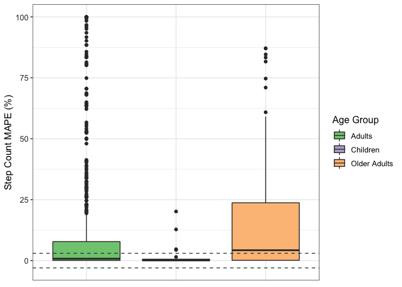

## Read in and glimpse the data


```r
val_data <- read.csv("wearable_review_data_validity_edited.csv")
```

## Data Cleaning 
### Subsetting the data to select Step count


```r
data <- subset(val_data, Measured != "EE" & Measured != "HR")

glimpse(data)
```

```
## Rows: 1,067
## Columns: 107
## $ X1                          <int> 7, 8, 9, 10, 11, 12, 16, 17, 18, 19, 20, 2…
## $ Author                      <chr> "Fokkema", "Fokkema", "Fokkema", "Fokkema"…
## $ Year                        <int> 2017, 2017, 2017, 2017, 2017, 2017, 2017, …
## $ Substudy                    <chr> "-", "-", "-", "-", "-", "-", "-", "-", "-…
## $ Setting                     <chr> "Controlled", "Controlled", "Controlled", …
## $ Measured                    <chr> "SC", "SC", "SC", "SC", "SC", "SC", "SC", …
## $ Measure_Unit                <chr> "steps/10 min", "steps/10 min", "steps/10 …
## $ Brand                       <chr> "Apple", "Apple", "Apple", "Apple", "Apple…
## $ Device                      <chr> "Watch", "Watch", "Watch", "Watch", "Watch…
## $ device_name                 <chr> "Apple Watch", "Apple Watch", "Apple Watch…
## $ device_year                 <int> 2015, 2015, 2015, 2015, 2015, 2015, 2015, …
## $ Wear_Location               <chr> "Wrist", "Wrist", "Wrist", "Wrist", "Wrist…
## $ Wear_Info                   <chr> "wrist, left", "wrist, left", "wrist, left…
## $ Type                        <chr> "full-text", "full-text", "full-text", "fu…
## $ Good.                       <chr> "y", "y", "y", "y", "y", "y", "y", "y", "y…
## $ Criterion_Measure           <chr> "Manual count", "Manual count", "Manual co…
## $ Criterion_Type              <chr> "manual count", "manual count", "manual co…
## $ Wear_Info_crit              <chr> NA, NA, NA, NA, NA, NA, NA, NA, "thigh, ri…
## $ Wear_Location_crit          <chr> NA, NA, NA, NA, NA, NA, NA, NA, "Thigh", "…
## $ population_n                <chr> "31", "31", "31", "31", "31", "31", "31", …
## $ population_m                <chr> "16", "16", "16", "16", "16", "16", "16", …
## $ population_f                <chr> "15", "15", "15", "15", "15", "15", "15", …
## $ population                  <chr> "healthy adults", "healthy adults", "healt…
## $ age_code                    <chr> "A", "A", "A", "A", "A", "A", "A", "A", "O…
## $ health_code                 <chr> "H", "H", "H", "H", "H", "H", "H", "H", "N…
## $ age                         <chr> "32", "32", "32", "32", "32", "32", "32", …
## $ age_SD                      <dbl> 12.0, 12.0, 12.0, 12.0, 12.0, 12.0, 12.0, …
## $ weight                      <chr> NA, NA, NA, NA, NA, NA, NA, NA, NA, NA, "7…
## $ weight_SD                   <dbl> NA, NA, NA, NA, NA, NA, NA, NA, NA, NA, 3,…
## $ height                      <chr> NA, NA, NA, NA, NA, NA, NA, NA, NA, NA, "1…
## $ height_SD                   <dbl> NA, NA, NA, NA, NA, NA, NA, NA, NA, NA, 1.…
## $ BMI                         <chr> "22.6", "22.6", "22.6", "22.6", "22.6", "2…
## $ BMI_SD                      <dbl> 2.40, 2.40, 2.40, 2.40, 2.40, 2.40, 2.40, …
## $ location                    <chr> "Netherlands", "Netherlands", "Netherlands…
## $ activity_type               <chr> "Walk: Treadmill", "Walk: Treadmill", "Wal…
## $ test_type                   <chr> NA, NA, NA, NA, NA, NA, NA, NA, NA, NA, NA…
## $ activity_type_code          <chr> "At", "At", "At", "At", "At", "At", "At", …
## $ body_Motion                 <chr> "Nr", "Nr", "Nr", "Nr", "Nr", "Nr", "Nr", …
## $ pace_code                   <chr> "Nm", "Sl", "Sl", "Nm", "Nm", "Nm", "Nm", …
## $ pace_value                  <chr> "1.33", "0.89", "0.89", "1.78", "1.78", "1…
## $ incline_code                <chr> "N", "N", "N", "N", "N", "N", "N", "N", "N…
## $ incline_pct                 <chr> NA, NA, NA, NA, NA, NA, NA, NA, NA, NA, NA…
## $ activity_details            <chr> "walk, 4.8 km/h, 10 min, Session 2", "walk…
## $ bout_rest                   <chr> NA, NA, NA, NA, NA, NA, NA, NA, NA, NA, "y…
## $ epoch                       <chr> "unknown", "unknown", "unknown", "unknown"…
## $ actual_n_analyzed           <int> 31, 31, 31, 31, 31, 31, 31, 31, 33, 33, 32…
## $ trend                       <chr> "good validity", "good validity", "good va…
## $ CC_type                     <chr> "ICC", "ICC", "ICC", "ICC", "ICC", "ICC", …
## $ CC                          <dbl> 0.520, 0.570, 0.730, 0.910, 0.860, 0.930, …
## $ CC_bins                     <chr> "MOD", "MOD", "ST", "VS", "VS", "VS", "WK"…
## $ CC_all                      <chr> "0.52", "0.57", "0.73", "0.91", "0.86", "0…
## $ CC_CI_pct                   <int> 95, 95, 95, 95, 95, 95, 95, 95, 95, 95, NA…
## $ CC_CI_upper                 <chr> "0.74", "0.77", "0.86", "0.95", "0.93", "0…
## $ CC_CI_lower                 <chr> "0.21", "0.27", "0.52", "0.82", "0.72", "0…
## $ CC_pvalue                   <chr> "< .01", "< .01", "< .01", "< .01", "< .01…
## $ CC_significance             <chr> "sig", "sig", "sig", "sig", "sig", "sig", …
## $ ES_type                     <chr> NA, NA, NA, NA, NA, NA, NA, NA, NA, NA, NA…
## $ ES                          <dbl> NA, NA, NA, NA, NA, NA, NA, NA, NA, NA, NA…
## $ ES_CI_upper                 <dbl> NA, NA, NA, NA, NA, NA, NA, NA, NA, NA, NA…
## $ ES_CI_lower                 <dbl> NA, NA, NA, NA, NA, NA, NA, NA, NA, NA, NA…
## $ BA_LoA_upper                <chr> "159", "111", "124", "56", "67", "35", "16…
## $ BA_LoA_lower                <chr> "-101", "-74", "-98", "-45", "-65", "-36",…
## $ BA_LoA_width                <dbl> 260.0, 185.0, 222.0, 101.0, 132.0, 71.0, 2…
## $ devicemean                  <dbl> NA, NA, NA, NA, NA, NA, NA, NA, 219.0, 677…
## $ devicemean_SD               <dbl> NA, NA, NA, NA, NA, NA, NA, NA, 20.3, 66.7…
## $ critmean                    <dbl> 1108.0, 953.0, 940.0, 1259.0, 1251.0, 1117…
## $ critmean_SD                 <dbl> 46.0, 46.0, 61.0, 53.0, 54.0, 44.0, 44.0, …
## $ device_v_crit               <chr> "over", "over", "over", "over", "over", "e…
## $ meandiff                    <chr> "29", "18", "13", "6", "1", "0", "22", "19…
## $ meandiff_SD                 <dbl> 12.0, 9.0, 10.0, 5.0, 6.0, 3.0, 13.0, 13.0…
## $ meandiff_CI_upper           <dbl> NA, NA, NA, NA, NA, NA, NA, NA, NA, NA, NA…
## $ meandiff_CI_lower           <dbl> NA, NA, NA, NA, NA, NA, NA, NA, NA, NA, NA…
## $ MPE                         <dbl> 0.026173285, 0.018887723, 0.013829787, 0.0…
## $ MPE_bin                     <chr> "± 3%", "± 3%", "± 3%", "± 3%", "± 3%", "±…
## $ MPE_SD                      <chr> NA, NA, NA, NA, NA, NA, NA, NA, NA, NA, NA…
## $ MPE_significance_test       <chr> NA, NA, NA, NA, NA, NA, NA, NA, NA, NA, NA…
## $ MPE_significance_num        <chr> NA, NA, NA, NA, NA, NA, NA, NA, NA, NA, "n…
## $ MAD                         <dbl> NA, NA, NA, NA, NA, NA, NA, NA, NA, NA, NA…
## $ MAD_SD                      <dbl> NA, NA, NA, NA, NA, NA, NA, NA, NA, NA, NA…
## $ MAD_CI_upper                <dbl> NA, NA, NA, NA, NA, NA, NA, NA, NA, NA, NA…
## $ MAD_CI_lower                <dbl> NA, NA, NA, NA, NA, NA, NA, NA, NA, NA, NA…
## $ MAPE                        <dbl> 0.0260, 0.0190, 0.0140, 0.0050, 0.0010, 0.…
## $ MAPE_bin                    <chr> "less 3%", "less 3%", "less 3%", "less 3%"…
## $ MAPE_SD                     <dbl> NA, NA, NA, NA, NA, NA, NA, NA, NA, NA, 0.…
## $ MAPE_CI_upper               <dbl> NA, NA, NA, NA, NA, NA, NA, NA, NA, NA, NA…
## $ MAPE_CI_lower               <dbl> NA, NA, NA, NA, NA, NA, NA, NA, NA, NA, NA…
## $ RMSE                        <dbl> NA, NA, NA, NA, NA, NA, NA, NA, NA, NA, NA…
## $ equivalencetesting          <chr> "-2.20\nWilcoxon signed-rank test in case …
## $ accuracypct                 <dbl> NA, NA, NA, NA, NA, NA, NA, NA, NA, NA, NA…
## $ accuracypct_CI_upper        <dbl> NA, NA, NA, NA, NA, NA, NA, NA, NA, NA, NA…
## $ accuracypct_CI_lower        <dbl> NA, NA, NA, NA, NA, NA, NA, NA, NA, NA, NA…
## $ TEEstandardized             <dbl> NA, NA, NA, NA, NA, NA, NA, NA, NA, NA, NA…
## $ TEEstandardized_CI_upper    <dbl> NA, NA, NA, NA, NA, NA, NA, NA, NA, NA, NA…
## $ TEEstandardized_CI_lower    <dbl> NA, NA, NA, NA, NA, NA, NA, NA, NA, NA, NA…
## $ deviceSE                    <dbl> NA, NA, NA, NA, NA, NA, NA, NA, NA, NA, NA…
## $ deviceCofV                  <dbl> NA, NA, NA, NA, NA, NA, NA, NA, NA, NA, NA…
## $ critCofV                    <dbl> NA, NA, NA, NA, NA, NA, NA, NA, NA, NA, NA…
## $ n_5pctofcrit                <chr> NA, NA, NA, NA, NA, NA, NA, NA, NA, NA, NA…
## $ n_10pctofcrit               <chr> NA, NA, NA, NA, NA, NA, NA, NA, NA, NA, NA…
## $ n_15pctofcrit               <lgl> NA, NA, NA, NA, NA, NA, NA, NA, NA, NA, NA…
## $ n_20pctofcrit               <dbl> NA, NA, NA, NA, NA, NA, NA, NA, NA, NA, NA…
## $ n_25pctofcrit               <int> NA, NA, NA, NA, NA, NA, NA, NA, NA, NA, NA…
## $ systematicbias_slope        <dbl> NA, NA, NA, NA, NA, NA, NA, NA, NA, NA, NA…
## $ systematicbias_intercept    <dbl> NA, NA, NA, NA, NA, NA, NA, NA, NA, NA, NA…
## $ systematicbias_probability  <chr> NA, NA, NA, NA, NA, NA, NA, NA, NA, NA, NA…
## $ systematicbias_significance <chr> NA, NA, NA, NA, NA, NA, NA, NA, NA, NA, NA…
## $ Other                       <chr> NA, NA, NA, NA, NA, NA, NA, NA, NA, NA, NA…
```


```r
data$X1 <- as.character(data$X1)
data$population_f <- as.numeric(data$population_f)
```

```
## Warning: NAs introduced by coercion
```

```r
data$population_m <- as.numeric(data$population_m)
```

```
## Warning: NAs introduced by coercion
```

```r
data$BMI <- as.numeric(data$BMI)
```

```
## Warning: NAs introduced by coercion
```

```r
data$age <- as.numeric(data$age)
```

```
## Warning: NAs introduced by coercion
```

## Data Cleaning by Variable

### MPE (Outcome Variable)


```r
#convert to percentage
data$MPE <- (data$MPE)*100
summary(data$MPE)
```

```
##      Min.   1st Qu.    Median      Mean   3rd Qu.      Max.      NA's 
## -100.0000  -10.1000   -1.4690   -6.8892    0.2578  530.0000       189
```


```r
#removing missing values and renaming our final data as df 
df <- drop_na(data, MPE)
```


```r
round(stat.desc(df$MPE),2)
```

```
##      nbr.val     nbr.null       nbr.na          min          max        range 
##       878.00        46.00         0.00      -100.00       530.00       630.00 
##          sum       median         mean      SE.mean CI.mean.0.95          var 
##     -6048.69        -1.47        -6.89         1.15         2.25      1153.13 
##      std.dev     coef.var 
##        33.96        -4.93
```


```r
mpe_hist <- ggplot(df, aes(MPE)) + 
                  geom_histogram(bins = 25) +
                  theme_classic()
                  #facet_wrap(~ age_category)
plot(mpe_hist)
```

<!-- -->


```r
mpe_box <- ggplot(df, aes(MPE)) + 
                geom_boxplot() +
                coord_flip() +
                theme_classic()
                #facet_wrap(~ age_cat)
plot(mpe_box)
```

<!-- -->


```r
#creating a dataframe containing the extreme outliers
df_out <- df %>%
  identify_outliers("MPE") %>%
        filter(is.extreme == TRUE)
```


```r
#merging the outlier dataframe with our original data
total <- merge(df,df_out, all.x = TRUE)
table(total$is.extreme)
```

```
## 
## TRUE 
##  105
```


```r
#renaming those not extreme as FALSE instead of NA
total$is.extreme[is.na(total$is.extreme)] <- FALSE
table(total$is.extreme)
```

```
## 
## FALSE  TRUE 
##   773   105
```


```r
#subsetting the non-outliers in the data
df_val <- subset(total, is.extreme != TRUE)
```


```r
summary(df_val$MPE)
```

```
##     Min.  1st Qu.   Median     Mean  3rd Qu.     Max. 
## -40.9300  -6.0099  -0.9281  -3.4358   0.2700  30.3755
```


```r
mpe_hist_clean <- ggplot(df_val, aes(MPE)) + 
                  geom_histogram(bins = 30) +
                  theme_classic()
                  #facet_wrap(~ age_cat)
plot(mpe_hist_clean)
```

<!-- -->

The distribution looks better now that the outliers have been removed


```r
mpe_box_clean <- ggplot(df_val, aes(MPE)) + 
                  geom_boxplot() +
                  coord_flip() +
                  theme_classic()
                  #facet_wrap(~ age_cat)
plot(mpe_box_clean)
```

<!-- -->

### AGE


```r
round(stat.desc(df_val$age), digits = 1)
```

```
##      nbr.val     nbr.null       nbr.na          min          max        range 
##        603.0          0.0        170.0          3.7         87.0         83.3 
##          sum       median         mean      SE.mean CI.mean.0.95          var 
##      22446.5         31.1         37.2          0.8          1.5        347.2 
##      std.dev     coef.var 
##         18.6          0.5
```

```r
df_val$age_code <- factor(df_val$age_code, c("C","A","OA"), labels = c("Children","Adults","Older Adults"))
```


```r
addmargins(table(df_val$age_code)) #frequency table of age, including the total
```

```
## 
##     Children       Adults Older Adults          Sum 
##           23          616          134          773
```

```r
round(prop.table(table(df_val$age_code))*100, digits = 0) #percentage proportion of each category
```

```
## 
##     Children       Adults Older Adults 
##            3           80           17
```

```r
sum(is.na(df_val$age_code))
```

```
## [1] 0
```

### GENDER


```r
df_val <- df_val %>%
        mutate(sex = case_when(
                population_m > population_f ~ "Male",
                population_m < population_f ~ "Female"
        ))
```


```r
df_val$sex <- as.factor(df_val$sex)
addmargins(table(df_val$sex))
```

```
## 
## Female   Male    Sum 
##    261    275    536
```

```r
round(prop.table(table(df_val$sex))*100, digits = 0)
```

```
## 
## Female   Male 
##     49     51
```

```r
sum(is.na(df_val$sex))
```

```
## [1] 237
```

```r
df_val_sex <- drop_na(df_val, sex)
```

### BMI


```r
round(stat.desc(df_val$BMI), digits = 1)
```

```
##      nbr.val     nbr.null       nbr.na          min          max        range 
##        467.0          0.0        306.0         20.8         30.8         10.0 
##          sum       median         mean      SE.mean CI.mean.0.95          var 
##      11391.8         24.3         24.4          0.1          0.2          4.2 
##      std.dev     coef.var 
##          2.0          0.1
```

```r
df_val_sex <- df_val_sex %>%
        mutate(bmi_cat = case_when(
                BMI >= 18.5 & BMI <= 24.9 ~ "Healthy weight",
                BMI > 24.9 & BMI <= 29.9 ~ "Overweight",
                BMI > 29.9 ~ "Obese"
        ))
```


```r
addmargins(table(df_val_sex$bmi_cat))
```

```
## 
## Healthy weight          Obese     Overweight            Sum 
##            211              2            123            336
```

```r
round(prop.table(table(df_val_sex$bmi_cat))*100, digits = 0) #percentage
```

```
## 
## Healthy weight          Obese     Overweight 
##             63              1             37
```

```r
sum(is.na(df_val_sex$bmi_cat))
```

```
## [1] 200
```

```r
df <- drop_na(df_val_sex, bmi_cat)

df <- filter(df, bmi_cat != "Obese")
```

There are not enough data for obese individuals.

### Devices


```r
df %>%
        group_by(device_name, Setting) %>%
        summarize(count = n()) %>%
        arrange(desc(count)) %>%
        filter(count > 10)
```

```
## `summarise()` has grouped output by 'device_name'. You can override using the `.groups` argument.
```

```
## # A tibble: 7 x 3
## # Groups:   device_name [7]
##   device_name       Setting    count
##   <chr>             <chr>      <int>
## 1 Fitbit One        Controlled    61
## 2 Fitbit Flex       Controlled    28
## 3 Fitbit Zip        Controlled    28
## 4 Fitbit Charge HR  Controlled    27
## 5 Garmin Vivofit    Controlled    24
## 6 Withings Pulse O2 Controlled    20
## 7 Apple Watch       Controlled    14
```


```r
df_new <- filter(df, Setting != "Free-Living", device_name == "Fitbit One" | device_name == "Fitbit Flex" | device_name == "Fitbit Zip" | device_name == "Fitbit Charge HR" | device_name == "Garmin Vivofit" | device_name == "Withings Pulse O2" | device_name == "Apple Watch")
```

### Summary statistics by the groups


```r
#By age groups
df_new %>%
        group_by(device_name,age_code) %>%
        get_summary_stats(MPE, type = "mean_sd") %>%
        arrange(desc(n))
```

```
## # A tibble: 12 x 6
##    device_name       age_code     variable     n    mean    sd
##    <chr>             <fct>        <chr>    <dbl>   <dbl> <dbl>
##  1 Fitbit One        Adults       MPE         45   0.928  5.69
##  2 Fitbit Charge HR  Adults       MPE         27  -3.83   7.12
##  3 Fitbit Flex       Adults       MPE         25  -2.26  12.1 
##  4 Garmin Vivofit    Adults       MPE         20  -1.82   3.68
##  5 Withings Pulse O2 Adults       MPE         20  -0.434  1.43
##  6 Fitbit Zip        Older Adults MPE         19  -9.42  13.4 
##  7 Fitbit One        Older Adults MPE         16 -10.0   10.5 
##  8 Apple Watch       Adults       MPE         13   0.079  2.15
##  9 Fitbit Zip        Adults       MPE          9  -0.685  3.12
## 10 Garmin Vivofit    Older Adults MPE          4  -5.98   3.18
## 11 Fitbit Flex       Older Adults MPE          3 -22.0    5.36
## 12 Apple Watch       Older Adults MPE          1   1.59  NA
```


```r
#By sex groups
df_new %>%
        group_by(device_name, sex) %>%
        get_summary_stats(MPE, type = "mean_sd") %>%
        arrange(desc(n))
```

```
## # A tibble: 13 x 6
##    device_name       sex    variable     n   mean    sd
##    <chr>             <fct>  <chr>    <dbl>  <dbl> <dbl>
##  1 Fitbit One        Female MPE         41 -2.80  10.4 
##  2 Fitbit Charge HR  Male   MPE         23 -3.32   7.37
##  3 Fitbit One        Male   MPE         20 -0.178  2.29
##  4 Withings Pulse O2 Female MPE         20 -0.434  1.43
##  5 Fitbit Flex       Male   MPE         18 -4.43   8.55
##  6 Fitbit Zip        Female MPE         16 -8.73  13.3 
##  7 Garmin Vivofit    Female MPE         14 -2.19   3.17
##  8 Fitbit Zip        Male   MPE         12 -3.80   9.25
##  9 Apple Watch       Male   MPE         11  0.677  1.72
## 10 Fitbit Flex       Female MPE         10 -4.30  19.3 
## 11 Garmin Vivofit    Male   MPE         10 -2.98   4.84
## 12 Fitbit Charge HR  Female MPE          4 -6.75   5.31
## 13 Apple Watch       Female MPE          3 -1.61   2.79
```


```r
#by BMI groups
df_new %>%
        group_by(device_name, bmi_cat) %>%
        get_summary_stats(MPE, type = "mean_sd") %>%
        arrange(desc(n))
```

```
## # A tibble: 14 x 6
##    device_name       bmi_cat        variable     n    mean    sd
##    <chr>             <chr>          <chr>    <dbl>   <dbl> <dbl>
##  1 Fitbit One        Healthy weight MPE         40   1.33   5.82
##  2 Fitbit One        Overweight     MPE         21  -8.16   9.84
##  3 Fitbit Zip        Overweight     MPE         21  -8.55  13.0 
##  4 Fitbit Flex       Healthy weight MPE         17   1.70  11.4 
##  5 Fitbit Charge HR  Healthy weight MPE         16  -2.37   5.59
##  6 Withings Pulse O2 Healthy weight MPE         16  -0.542  1.59
##  7 Garmin Vivofit    Healthy weight MPE         15  -0.829  2.66
##  8 Fitbit Charge HR  Overweight     MPE         11  -5.95   8.76
##  9 Fitbit Flex       Overweight     MPE         11 -13.8    9.62
## 10 Garmin Vivofit    Overweight     MPE          9  -5.33   4.07
## 11 Apple Watch       Healthy weight MPE          8   0.279  1.88
## 12 Fitbit Zip        Healthy weight MPE          7  -0.819  3.59
## 13 Apple Watch       Overweight     MPE          6   0.063  2.56
## 14 Withings Pulse O2 Overweight     MPE          4   0      0
```


```r
#relevel factors
df_new$age_code <- fct_relevel(df_new$age_code, c("Adults","Older Adults"))
df_new$sex <- fct_relevel(df_new$sex, c("Female","Male"))
df_new$bmi_cat <- fct_relevel(df_new$bmi_cat, c("Healthy weight","Overweight"))
```

## PLOTS

### Validity of Step count by Age in Controlled setting

* Dashed grey lines indicate ± 3% measurement error


```r
#options(repr.plot.width = 25, repr.plot.height = 8)
df_new_age_plot <- ggplot(df_new, aes(x = device_name, y = MPE, colour = device_name)) +
                    geom_boxplot() +
                    geom_beeswarm(dodge.width = 0.2, cex = 0.2, alpha = 0.08) +   
                    geom_hline(yintercept = 0) +  
                    geom_hline(yintercept = 3, size = 0.5, colour = "grey", linetype = "dashed") + 
                    geom_hline(yintercept = -3, size = 0.5, colour = "grey", linetype = "dashed") +   
                    scale_y_continuous(limits=c(-10, 10)) +
                    ylab("Step MPE (%)") +
                    scale_colour_brewer(palette="Dark2") +
                    theme_bw() +
                    theme(axis.text.x = element_text(colour = "grey20", size = 10, angle = 90, hjust = 0.5, 
                                                     vjust = 0.5),
                        axis.text.y = element_text(colour = "grey20", size = 10),
                        strip.text = element_text(face = "italic"),
                        text = element_text(size = 12)) +
                    facet_wrap(~ age_code)
plot(df_new_age_plot)
```

```
## Warning: Removed 38 rows containing non-finite values (stat_boxplot).
```

```
## Warning: Removed 20 rows containing missing values (position_beeswarm).
```

```
## Warning: Removed 18 rows containing missing values (position_beeswarm).
```

<!-- -->
### Validity of step count by gender in controlled setting


```r
df_new_sex_plot <- ggplot(df_new, aes(x = device_name, y = MPE, colour = device_name)) +
                    geom_boxplot() +
                    geom_beeswarm(dodge.width = 0.2, cex = 0.2, alpha = 0.08) +   
                    geom_hline(yintercept = 0) +  
                    geom_hline(yintercept = 3, size = 0.5, colour = "grey", linetype = "dashed") + 
                    geom_hline(yintercept = -3, size = 0.5, colour = "grey", linetype = "dashed") +   
                    scale_y_continuous(limits=c(-10, 10)) +
                    ylab("Step MPE (%)") +
                    scale_colour_brewer(palette="Dark2") +
                    theme_bw() +
                    theme(axis.text.x = element_text(colour = "grey20", size = 10, angle = 90, hjust = 0.5, 
                                                     vjust = 0.5),
                        axis.text.y = element_text(colour = "grey20", size = 10),
                        strip.text = element_text(face = "italic"),
                        text = element_text(size = 12)) +
                    facet_wrap(~ sex)
plot(df_new_sex_plot)
```

```
## Warning: Removed 38 rows containing non-finite values (stat_boxplot).
```

```
## Warning: Removed 26 rows containing missing values (position_beeswarm).
```

```
## Warning: Removed 12 rows containing missing values (position_beeswarm).
```

<!-- -->

### Validity of step count by BMI in controlled setting


```r
df_new_bmi_plot <- ggplot(df_new, aes(x = device_name, y = MPE, colour = device_name)) +
                    geom_boxplot() +
                    geom_beeswarm(dodge.width = 0.2, cex = 0.2, alpha = 0.08) +   
                    geom_hline(yintercept = 0) +  
                    geom_hline(yintercept = 3, size = 0.5, colour = "grey", linetype = "dashed") + 
                    geom_hline(yintercept = -3, size = 0.5, colour = "grey", linetype = "dashed") +   
                    scale_y_continuous(limits=c(-10, 10)) +
                    ylab("Step MPE (%)") +
                    scale_colour_brewer(palette="Dark2") +
                    theme_bw() +
                    theme(axis.text.x = element_text(colour = "grey20", size = 10, angle = 90, hjust = 0.5, 
                                                     vjust = 0.5),
                        axis.text.y = element_text(colour = "grey20", size = 10),
                        strip.text = element_text(face = "italic"),
                        text = element_text(size = 12)) +
                    facet_wrap(~ bmi_cat)
plot(df_new_bmi_plot)
```

```
## Warning: Removed 38 rows containing non-finite values (stat_boxplot).
```

```
## Warning: Removed 11 rows containing missing values (position_beeswarm).
```

```
## Warning: Removed 27 rows containing missing values (position_beeswarm).
```

<!-- -->


```r
figure1 <- plot_grid(df_new_age_plot, df_new_sex_plot, df_new_bmi_plot, labels = c('A','B','C'), label_size = 12)
```

```
## Warning: Removed 38 rows containing non-finite values (stat_boxplot).
```

```
## Warning: Removed 20 rows containing missing values (position_beeswarm).
```

```
## Warning: Removed 18 rows containing missing values (position_beeswarm).
```

```
## Warning: Removed 38 rows containing non-finite values (stat_boxplot).
```

```
## Warning: Removed 26 rows containing missing values (position_beeswarm).
```

```
## Warning: Removed 12 rows containing missing values (position_beeswarm).
```

```
## Warning: Removed 38 rows containing non-finite values (stat_boxplot).
```

```
## Warning: Removed 11 rows containing missing values (position_beeswarm).
```

```
## Warning: Removed 27 rows containing missing values (position_beeswarm).
```

```r
plot(figure1)
```

<!-- -->


```r
ggsave("figure1.pdf", plot = figure1, width = 20, height = 16)
```


## Regression Analysis


```r
reg1 <- lm(MPE ~ 1, df_new)
reg2 <- lm(MPE ~ age_code, df_new)
reg3 <- lm(MPE ~ age_code + bmi_cat, df_new)
reg4 <- lm(MPE ~ age_code + bmi_cat + sex, df_new)

anova(reg1,reg2,reg3,reg4)
```

```
## Analysis of Variance Table
## 
## Model 1: MPE ~ 1
## Model 2: MPE ~ age_code
## Model 3: MPE ~ age_code + bmi_cat
## Model 4: MPE ~ age_code + bmi_cat + sex
##   Res.Df   RSS Df Sum of Sq       F    Pr(>F)    
## 1    201 15427                                   
## 2    200 12758  1   2669.47 44.1997 2.818e-10 ***
## 3    199 12050  1    708.18 11.7258 0.0007492 ***
## 4    198 11958  1     91.25  1.5108 0.2204752    
## ---
## Signif. codes:  0 '***' 0.001 '**' 0.01 '*' 0.05 '.' 0.1 ' ' 1
```


```r
summary(reg2)
```

```
## 
## Call:
## lm(formula = MPE ~ age_code, data = df_new)
## 
## Residuals:
##     Min      1Q  Median      3Q     Max 
## -30.460  -2.341   1.060   2.746  30.459 
## 
## Coefficients:
##                      Estimate Std. Error t value Pr(>|t|)    
## (Intercept)           -1.0595     0.6334  -1.673    0.096 .  
## age_codeOlder Adults  -8.8809     1.3728  -6.469 7.43e-10 ***
## ---
## Signif. codes:  0 '***' 0.001 '**' 0.01 '*' 0.05 '.' 0.1 ' ' 1
## 
## Residual standard error: 7.987 on 200 degrees of freedom
## Multiple R-squared:  0.173,	Adjusted R-squared:  0.1689 
## F-statistic: 41.85 on 1 and 200 DF,  p-value: 7.426e-10
```


```r
summary(reg3)
```

```
## 
## Call:
## lm(formula = MPE ~ age_code + bmi_cat, data = df_new)
## 
## Residuals:
##      Min       1Q   Median       3Q      Max 
## -30.4597  -2.8394  -0.1641   4.5542  29.2359 
## 
## Coefficients:
##                      Estimate Std. Error t value Pr(>|t|)    
## (Intercept)            0.1641     0.7133   0.230  0.81827    
## age_codeOlder Adults  -5.2407     1.7094  -3.066  0.00247 ** 
## bmi_catOverweight     -4.8637     1.4222  -3.420  0.00076 ***
## ---
## Signif. codes:  0 '***' 0.001 '**' 0.01 '*' 0.05 '.' 0.1 ' ' 1
## 
## Residual standard error: 7.781 on 199 degrees of freedom
## Multiple R-squared:  0.2189,	Adjusted R-squared:  0.2111 
## F-statistic: 27.89 on 2 and 199 DF,  p-value: 2.099e-11
```


```r
summary(reg4)
```

```
## 
## Call:
## lm(formula = MPE ~ age_code + bmi_cat + sex, data = df_new)
## 
## Residuals:
##      Min       1Q   Median       3Q      Max 
## -30.5979  -3.0971  -0.2555   3.7719  28.4743 
## 
## Coefficients:
##                      Estimate Std. Error t value Pr(>|t|)   
## (Intercept)            0.9257     0.9442   0.980  0.32805   
## age_codeOlder Adults  -6.1797     1.8703  -3.304  0.00113 **
## bmi_catOverweight     -4.5481     1.4434  -3.151  0.00188 **
## sexMale               -1.4858     1.2088  -1.229  0.22048   
## ---
## Signif. codes:  0 '***' 0.001 '**' 0.01 '*' 0.05 '.' 0.1 ' ' 1
## 
## Residual standard error: 7.771 on 198 degrees of freedom
## Multiple R-squared:  0.2249,	Adjusted R-squared:  0.2131 
## F-statistic: 19.15 on 3 and 198 DF,  p-value: 6.082e-11
```


```r
confint(reg3)
```

```
##                          2.5 %    97.5 %
## (Intercept)          -1.242525  1.570756
## age_codeOlder Adults -8.611511 -1.869934
## bmi_catOverweight    -7.668191 -2.059239
```


