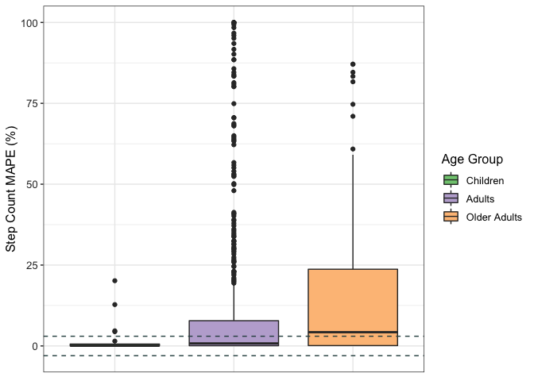

## Read in and glimpse the data


```r
val_data <- read.csv("wearable_review_data_validity_edited.csv")
```

## Data Cleaning 
### Subsetting the data to select Step count


```r
data <- subset(val_data, Measured != "EE" & Measured != "HR")

glimpse(data)
```

```
## Rows: 1,067
## Columns: 107
## $ X1                          <int> 7, 8, 9, 10, 11, 12, 16, 17, 18, 19, 20, 2…
## $ Author                      <chr> "Fokkema", "Fokkema", "Fokkema", "Fokkema"…
## $ Year                        <int> 2017, 2017, 2017, 2017, 2017, 2017, 2017, …
## $ Substudy                    <chr> "-", "-", "-", "-", "-", "-", "-", "-", "-…
## $ Setting                     <chr> "Controlled", "Controlled", "Controlled", …
## $ Measured                    <chr> "SC", "SC", "SC", "SC", "SC", "SC", "SC", …
## $ Measure_Unit                <chr> "steps/10 min", "steps/10 min", "steps/10 …
## $ Brand                       <chr> "Apple", "Apple", "Apple", "Apple", "Apple…
## $ Device                      <chr> "Watch", "Watch", "Watch", "Watch", "Watch…
## $ device_name                 <chr> "Apple Watch", "Apple Watch", "Apple Watch…
## $ device_year                 <int> 2015, 2015, 2015, 2015, 2015, 2015, 2015, …
## $ Wear_Location               <chr> "Wrist", "Wrist", "Wrist", "Wrist", "Wrist…
## $ Wear_Info                   <chr> "wrist, left", "wrist, left", "wrist, left…
## $ Type                        <chr> "full-text", "full-text", "full-text", "fu…
## $ Good.                       <chr> "y", "y", "y", "y", "y", "y", "y", "y", "y…
## $ Criterion_Measure           <chr> "Manual count", "Manual count", "Manual co…
## $ Criterion_Type              <chr> "manual count", "manual count", "manual co…
## $ Wear_Info_crit              <chr> NA, NA, NA, NA, NA, NA, NA, NA, "thigh, ri…
## $ Wear_Location_crit          <chr> NA, NA, NA, NA, NA, NA, NA, NA, "Thigh", "…
## $ population_n                <chr> "31", "31", "31", "31", "31", "31", "31", …
## $ population_m                <chr> "16", "16", "16", "16", "16", "16", "16", …
## $ population_f                <chr> "15", "15", "15", "15", "15", "15", "15", …
## $ population                  <chr> "healthy adults", "healthy adults", "healt…
## $ age_code                    <chr> "A", "A", "A", "A", "A", "A", "A", "A", "O…
## $ health_code                 <chr> "H", "H", "H", "H", "H", "H", "H", "H", "N…
## $ age                         <chr> "32", "32", "32", "32", "32", "32", "32", …
## $ age_SD                      <dbl> 12.0, 12.0, 12.0, 12.0, 12.0, 12.0, 12.0, …
## $ weight                      <chr> NA, NA, NA, NA, NA, NA, NA, NA, NA, NA, "7…
## $ weight_SD                   <dbl> NA, NA, NA, NA, NA, NA, NA, NA, NA, NA, 3,…
## $ height                      <chr> NA, NA, NA, NA, NA, NA, NA, NA, NA, NA, "1…
## $ height_SD                   <dbl> NA, NA, NA, NA, NA, NA, NA, NA, NA, NA, 1.…
## $ BMI                         <chr> "22.6", "22.6", "22.6", "22.6", "22.6", "2…
## $ BMI_SD                      <dbl> 2.40, 2.40, 2.40, 2.40, 2.40, 2.40, 2.40, …
## $ location                    <chr> "Netherlands", "Netherlands", "Netherlands…
## $ activity_type               <chr> "Walk: Treadmill", "Walk: Treadmill", "Wal…
## $ test_type                   <chr> NA, NA, NA, NA, NA, NA, NA, NA, NA, NA, NA…
## $ activity_type_code          <chr> "At", "At", "At", "At", "At", "At", "At", …
## $ body_Motion                 <chr> "Nr", "Nr", "Nr", "Nr", "Nr", "Nr", "Nr", …
## $ pace_code                   <chr> "Nm", "Sl", "Sl", "Nm", "Nm", "Nm", "Nm", …
## $ pace_value                  <chr> "1.33", "0.89", "0.89", "1.78", "1.78", "1…
## $ incline_code                <chr> "N", "N", "N", "N", "N", "N", "N", "N", "N…
## $ incline_pct                 <chr> NA, NA, NA, NA, NA, NA, NA, NA, NA, NA, NA…
## $ activity_details            <chr> "walk, 4.8 km/h, 10 min, Session 2", "walk…
## $ bout_rest                   <chr> NA, NA, NA, NA, NA, NA, NA, NA, NA, NA, "y…
## $ epoch                       <chr> "unknown", "unknown", "unknown", "unknown"…
## $ actual_n_analyzed           <int> 31, 31, 31, 31, 31, 31, 31, 31, 33, 33, 32…
## $ trend                       <chr> "good validity", "good validity", "good va…
## $ CC_type                     <chr> "ICC", "ICC", "ICC", "ICC", "ICC", "ICC", …
## $ CC                          <dbl> 0.520, 0.570, 0.730, 0.910, 0.860, 0.930, …
## $ CC_bins                     <chr> "MOD", "MOD", "ST", "VS", "VS", "VS", "WK"…
## $ CC_all                      <chr> "0.52", "0.57", "0.73", "0.91", "0.86", "0…
## $ CC_CI_pct                   <int> 95, 95, 95, 95, 95, 95, 95, 95, 95, 95, NA…
## $ CC_CI_upper                 <chr> "0.74", "0.77", "0.86", "0.95", "0.93", "0…
## $ CC_CI_lower                 <chr> "0.21", "0.27", "0.52", "0.82", "0.72", "0…
## $ CC_pvalue                   <chr> "< .01", "< .01", "< .01", "< .01", "< .01…
## $ CC_significance             <chr> "sig", "sig", "sig", "sig", "sig", "sig", …
## $ ES_type                     <chr> NA, NA, NA, NA, NA, NA, NA, NA, NA, NA, NA…
## $ ES                          <dbl> NA, NA, NA, NA, NA, NA, NA, NA, NA, NA, NA…
## $ ES_CI_upper                 <dbl> NA, NA, NA, NA, NA, NA, NA, NA, NA, NA, NA…
## $ ES_CI_lower                 <dbl> NA, NA, NA, NA, NA, NA, NA, NA, NA, NA, NA…
## $ BA_LoA_upper                <chr> "159", "111", "124", "56", "67", "35", "16…
## $ BA_LoA_lower                <chr> "-101", "-74", "-98", "-45", "-65", "-36",…
## $ BA_LoA_width                <dbl> 260.0, 185.0, 222.0, 101.0, 132.0, 71.0, 2…
## $ devicemean                  <dbl> NA, NA, NA, NA, NA, NA, NA, NA, 219.0, 677…
## $ devicemean_SD               <dbl> NA, NA, NA, NA, NA, NA, NA, NA, 20.3, 66.7…
## $ critmean                    <dbl> 1108.0, 953.0, 940.0, 1259.0, 1251.0, 1117…
## $ critmean_SD                 <dbl> 46.0, 46.0, 61.0, 53.0, 54.0, 44.0, 44.0, …
## $ device_v_crit               <chr> "over", "over", "over", "over", "over", "e…
## $ meandiff                    <chr> "29", "18", "13", "6", "1", "0", "22", "19…
## $ meandiff_SD                 <dbl> 12.0, 9.0, 10.0, 5.0, 6.0, 3.0, 13.0, 13.0…
## $ meandiff_CI_upper           <dbl> NA, NA, NA, NA, NA, NA, NA, NA, NA, NA, NA…
## $ meandiff_CI_lower           <dbl> NA, NA, NA, NA, NA, NA, NA, NA, NA, NA, NA…
## $ MPE                         <dbl> 0.026173285, 0.018887723, 0.013829787, 0.0…
## $ MPE_bin                     <chr> "± 3%", "± 3%", "± 3%", "± 3%", "± 3%", "±…
## $ MPE_SD                      <chr> NA, NA, NA, NA, NA, NA, NA, NA, NA, NA, NA…
## $ MPE_significance_test       <chr> NA, NA, NA, NA, NA, NA, NA, NA, NA, NA, NA…
## $ MPE_significance_num        <chr> NA, NA, NA, NA, NA, NA, NA, NA, NA, NA, "n…
## $ MAD                         <dbl> NA, NA, NA, NA, NA, NA, NA, NA, NA, NA, NA…
## $ MAD_SD                      <dbl> NA, NA, NA, NA, NA, NA, NA, NA, NA, NA, NA…
## $ MAD_CI_upper                <dbl> NA, NA, NA, NA, NA, NA, NA, NA, NA, NA, NA…
## $ MAD_CI_lower                <dbl> NA, NA, NA, NA, NA, NA, NA, NA, NA, NA, NA…
## $ MAPE                        <dbl> 0.0260, 0.0190, 0.0140, 0.0050, 0.0010, 0.…
## $ MAPE_bin                    <chr> "less 3%", "less 3%", "less 3%", "less 3%"…
## $ MAPE_SD                     <dbl> NA, NA, NA, NA, NA, NA, NA, NA, NA, NA, 0.…
## $ MAPE_CI_upper               <dbl> NA, NA, NA, NA, NA, NA, NA, NA, NA, NA, NA…
## $ MAPE_CI_lower               <dbl> NA, NA, NA, NA, NA, NA, NA, NA, NA, NA, NA…
## $ RMSE                        <dbl> NA, NA, NA, NA, NA, NA, NA, NA, NA, NA, NA…
## $ equivalencetesting          <chr> "-2.20\nWilcoxon signed-rank test in case …
## $ accuracypct                 <dbl> NA, NA, NA, NA, NA, NA, NA, NA, NA, NA, NA…
## $ accuracypct_CI_upper        <dbl> NA, NA, NA, NA, NA, NA, NA, NA, NA, NA, NA…
## $ accuracypct_CI_lower        <dbl> NA, NA, NA, NA, NA, NA, NA, NA, NA, NA, NA…
## $ TEEstandardized             <dbl> NA, NA, NA, NA, NA, NA, NA, NA, NA, NA, NA…
## $ TEEstandardized_CI_upper    <dbl> NA, NA, NA, NA, NA, NA, NA, NA, NA, NA, NA…
## $ TEEstandardized_CI_lower    <dbl> NA, NA, NA, NA, NA, NA, NA, NA, NA, NA, NA…
## $ deviceSE                    <dbl> NA, NA, NA, NA, NA, NA, NA, NA, NA, NA, NA…
## $ deviceCofV                  <dbl> NA, NA, NA, NA, NA, NA, NA, NA, NA, NA, NA…
## $ critCofV                    <dbl> NA, NA, NA, NA, NA, NA, NA, NA, NA, NA, NA…
## $ n_5pctofcrit                <chr> NA, NA, NA, NA, NA, NA, NA, NA, NA, NA, NA…
## $ n_10pctofcrit               <chr> NA, NA, NA, NA, NA, NA, NA, NA, NA, NA, NA…
## $ n_15pctofcrit               <lgl> NA, NA, NA, NA, NA, NA, NA, NA, NA, NA, NA…
## $ n_20pctofcrit               <dbl> NA, NA, NA, NA, NA, NA, NA, NA, NA, NA, NA…
## $ n_25pctofcrit               <int> NA, NA, NA, NA, NA, NA, NA, NA, NA, NA, NA…
## $ systematicbias_slope        <dbl> NA, NA, NA, NA, NA, NA, NA, NA, NA, NA, NA…
## $ systematicbias_intercept    <dbl> NA, NA, NA, NA, NA, NA, NA, NA, NA, NA, NA…
## $ systematicbias_probability  <chr> NA, NA, NA, NA, NA, NA, NA, NA, NA, NA, NA…
## $ systematicbias_significance <chr> NA, NA, NA, NA, NA, NA, NA, NA, NA, NA, NA…
## $ Other                       <chr> NA, NA, NA, NA, NA, NA, NA, NA, NA, NA, NA…
```


```r
data$X1 <- as.character(data$X1)
data$population_f <- as.numeric(data$population_f)
```

```
## Warning: NAs introduced by coercion
```

```r
data$population_m <- as.numeric(data$population_m)
```

```
## Warning: NAs introduced by coercion
```

```r
data$BMI <- as.numeric(data$BMI)
```

```
## Warning: NAs introduced by coercion
```

```r
data$age <- as.numeric(data$age)
```

```
## Warning: NAs introduced by coercion
```

## Data Cleaning by Variable

### MPE (Outcome Variable)


```r
#convert to percentage
data$MPE <- (data$MPE)*100
summary(data$MPE)
```

```
##      Min.   1st Qu.    Median      Mean   3rd Qu.      Max.      NA's 
## -100.0000  -10.1000   -1.4690   -6.8892    0.2578  530.0000       189
```


```r
#removing missing values and renaming our final data as df 
df <- drop_na(data, MPE)
```


```r
round(stat.desc(df$MPE),2)
```

```
##      nbr.val     nbr.null       nbr.na          min          max        range 
##       878.00        46.00         0.00      -100.00       530.00       630.00 
##          sum       median         mean      SE.mean CI.mean.0.95          var 
##     -6048.69        -1.47        -6.89         1.15         2.25      1153.13 
##      std.dev     coef.var 
##        33.96        -4.93
```


```r
mpe_hist <- ggplot(df, aes(MPE)) + 
                  geom_histogram(bins = 25) +
                  theme_classic()
                  #facet_wrap(~ age_category)
plot(mpe_hist)
```

<!-- -->


```r
mpe_box <- ggplot(df, aes(MPE)) + 
                geom_boxplot() +
                coord_flip() +
                theme_classic()
                #facet_wrap(~ age_cat)
plot(mpe_box)
```

<!-- -->


```r
#creating a dataframe containing the extreme outliers
df_out <- df %>%
  identify_outliers("MPE") %>%
        filter(is.extreme == TRUE)
```


```r
#merging the outlier dataframe with our original data
total <- merge(df,df_out, all.x = TRUE)
table(total$is.extreme)
```

```
## 
## TRUE 
##  105
```


```r
#renaming those not extreme as FALSE instead of NA
total$is.extreme[is.na(total$is.extreme)] <- FALSE
table(total$is.extreme)
```

```
## 
## FALSE  TRUE 
##   773   105
```


```r
#subsetting the non-outliers in the data
df_val <- subset(total, is.extreme != TRUE)
```


```r
summary(df_val$MPE)
```

```
##     Min.  1st Qu.   Median     Mean  3rd Qu.     Max. 
## -40.9300  -6.0099  -0.9281  -3.4358   0.2700  30.3755
```


```r
mpe_hist_clean <- ggplot(df_val, aes(MPE)) + 
                  geom_histogram(bins = 30) +
                  theme_classic()
                  #facet_wrap(~ age_cat)
plot(mpe_hist_clean)
```

<!-- -->

The distribution looks better now that the outliers have been removed


```r
mpe_box_clean <- ggplot(df_val, aes(MPE)) + 
                  geom_boxplot() +
                  coord_flip() +
                  theme_classic()
                  #facet_wrap(~ age_cat)
plot(mpe_box_clean)
```

<!-- -->

### AGE


```r
round(stat.desc(df_val$age), digits = 1)
```

```
##      nbr.val     nbr.null       nbr.na          min          max        range 
##        603.0          0.0        170.0          3.7         87.0         83.3 
##          sum       median         mean      SE.mean CI.mean.0.95          var 
##      22446.5         31.1         37.2          0.8          1.5        347.2 
##      std.dev     coef.var 
##         18.6          0.5
```

```r
df_val$age_code <- factor(df_val$age_code, c("C","A","OA"), labels = c("Children","Adults","Older Adults"))
```


```r
addmargins(table(df_val$age_code)) #frequency table of age, including the total
```

```
## 
##     Children       Adults Older Adults          Sum 
##           23          616          134          773
```

```r
round(prop.table(table(df_val$age_code))*100, digits = 0) #percentage proportion of each category
```

```
## 
##     Children       Adults Older Adults 
##            3           80           17
```

```r
sum(is.na(df_val$age_code))
```

```
## [1] 0
```

### GENDER


```r
df_val <- df_val %>%
        mutate(sex = case_when(
                population_m > population_f ~ "Male",
                population_m < population_f ~ "Female"
        ))
```


```r
df_val$sex <- as.factor(df_val$sex)
addmargins(table(df_val$sex))
```

```
## 
## Female   Male    Sum 
##    261    275    536
```

```r
round(prop.table(table(df_val$sex))*100, digits = 0)
```

```
## 
## Female   Male 
##     49     51
```

```r
sum(is.na(df_val$sex))
```

```
## [1] 237
```

```r
df_val_sex <- drop_na(df_val, sex)
```

### BMI


```r
round(stat.desc(df_val$BMI), digits = 1)
```

```
##      nbr.val     nbr.null       nbr.na          min          max        range 
##        467.0          0.0        306.0         20.8         30.8         10.0 
##          sum       median         mean      SE.mean CI.mean.0.95          var 
##      11391.8         24.3         24.4          0.1          0.2          4.2 
##      std.dev     coef.var 
##          2.0          0.1
```

```r
df_val <- df_val %>%
        mutate(bmi_cat = case_when(
                BMI >= 18.5 & BMI <= 24.9 ~ "Healthy weight",
                BMI > 24.9 & BMI <= 29.9 ~ "Overweight",
                BMI > 29.9 ~ "Obese"
        ))
```


```r
addmargins(table(df_val$bmi_cat))
```

```
## 
## Healthy weight          Obese     Overweight            Sum 
##            266              2            199            467
```

```r
round(prop.table(table(df_val$bmi_cat))*100, digits = 0) #percentage
```

```
## 
## Healthy weight          Obese     Overweight 
##             57              0             43
```

```r
sum(is.na(df_val$bmi_cat))
```

```
## [1] 306
```

```r
df_val_bmi <- drop_na(df_val, bmi_cat)

#df <- filter(df, bmi_cat != "Obese")
```

There are not enough data for obese individuals.


```r
#relevel factors
df_val$age_code <- fct_relevel(df_val$age_code, c("Children","Adults","Older Adults"))
df_val$sex <- fct_relevel(df_val$sex, c("Female","Male"))
df_val$bmi_cat <- fct_relevel(df_val$bmi_cat, c("Healthy weight","Overweight","Obese"))
```

## MPE across different groups


```r
#AGE GROUP
df_val %>%
    group_by(age_code) %>%
    get_summary_stats(MPE, type = "mean_sd")
```

```
## # A tibble: 3 x 5
##   age_code     variable     n  mean    sd
##   <fct>        <chr>    <dbl> <dbl> <dbl>
## 1 Children     MPE         23  1.47  10.7
## 2 Adults       MPE        616 -2.66  10.0
## 3 Older Adults MPE        134 -7.82  12.0
```


```r
#SEX GROUP
df_val_sex %>%
    group_by(sex) %>%
    get_summary_stats(MPE, type = "mean_sd")
```

```
## # A tibble: 2 x 5
##   sex    variable     n  mean    sd
##   <fct>  <chr>    <dbl> <dbl> <dbl>
## 1 Female MPE        261 -4.48 12.5 
## 2 Male   MPE        275 -3.01  9.88
```


```r
#BMI GROUP
df_val_bmi %>%
    group_by(bmi_cat) %>%
    get_summary_stats(MPE, type = "mean_sd")
```

```
## # A tibble: 3 x 5
##   bmi_cat        variable     n    mean    sd
##   <chr>          <chr>    <dbl>   <dbl> <dbl>
## 1 Healthy weight MPE        266  -0.027  8.86
## 2 Obese          MPE          2 -13.6   21.8 
## 3 Overweight     MPE        199  -5.16  10.2
```

### DEVICES


```r
#Age group, device & wear location
df_val %>%
    group_by(age_code, device_name, Wear_Location) %>%
    get_summary_stats(MPE, type = "mean_sd") %>%
    arrange(device_name)
```

```
## # A tibble: 78 x 7
##    device_name      Wear_Location age_code     variable     n    mean    sd
##    <chr>            <chr>         <fct>        <chr>    <dbl>   <dbl> <dbl>
##  1 Apple Watch      Wrist         Adults       MPE         18  -0.752  3.17
##  2 Apple Watch      Wrist         Older Adults MPE          1   1.59  NA   
##  3 Fitbit           Wrist         Adults       MPE          1  20.6   NA   
##  4 Fitbit           Waist/Hip     Older Adults MPE          2   6.5    9.19
##  5 Fitbit Charge    Wrist         Adults       MPE         12   0.218 14.3 
##  6 Fitbit Charge    Wrist         Older Adults MPE          3 -27.1    8.18
##  7 Fitbit Charge 2  Wrist         Adults       MPE          6   6.64  17.1 
##  8 Fitbit Charge 2  Wrist         Older Adults MPE         13  -4.71  14.7 
##  9 Fitbit Charge HR Wrist         Children     MPE          1  27.5   NA   
## 10 Fitbit Charge HR Wrist         Adults       MPE         47  -0.668  8.83
## # … with 68 more rows
```


```r
#sex group, device & wear location
df_val_sex %>%
    group_by(sex, device_name, Wear_Location) %>%
    get_summary_stats(MPE, type = "mean_sd") %>%
    arrange(device_name)
```

```
## # A tibble: 57 x 7
##    device_name      Wear_Location sex    variable     n   mean    sd
##    <chr>            <chr>         <fct>  <chr>    <dbl>  <dbl> <dbl>
##  1 Apple Watch      Wrist         Female MPE          3 -1.61   2.79
##  2 Apple Watch      Wrist         Male   MPE         12  0.995  1.98
##  3 Fitbit           Waist/Hip     Female MPE          2  6.5    9.19
##  4 Fitbit           Wrist         Female MPE          1 20.6   NA   
##  5 Fitbit Charge    Wrist         Female MPE          5 -8.58  26.1 
##  6 Fitbit Charge    Wrist         Male   MPE          1 -3.6   NA   
##  7 Fitbit Charge 2  Wrist         Female MPE         18 -0.329 16.1 
##  8 Fitbit Charge HR Wrist         Female MPE         10 -1.27  10.9 
##  9 Fitbit Charge HR Wrist         Male   MPE         31 -1.12   8.36
## 10 Fitbit Classic   LAF           Female MPE          4  6.25   1.71
## # … with 47 more rows
```


```r
#bmi group, device & wear location
df_val_bmi %>%
    group_by(bmi_cat, device_name, Wear_Location) %>%
    get_summary_stats(MPE, type = "mean_sd") %>%
    arrange(device_name)
```

```
## # A tibble: 53 x 7
##    device_name      Wear_Location bmi_cat        variable     n    mean     sd
##    <chr>            <chr>         <chr>          <chr>    <dbl>   <dbl>  <dbl>
##  1 Apple Watch      Wrist         Healthy weight MPE          9   0.748  2.25 
##  2 Apple Watch      Wrist         Overweight     MPE          8  -0.799  2.69 
##  3 Fitbit Charge    Wrist         Healthy weight MPE          3  -7.13  25.7  
##  4 Fitbit Charge    Wrist         Overweight     MPE          6  -7.75  23.4  
##  5 Fitbit Charge 2  Wrist         Healthy weight MPE          6   6.64  17.1  
##  6 Fitbit Charge 2  Wrist         Obese          MPE          1 -29     NA    
##  7 Fitbit Charge HR Wrist         Healthy weight MPE         17  -2.10   5.52 
##  8 Fitbit Charge HR Wrist         Overweight     MPE         12  -3.74  11.3  
##  9 Fitbit Classic   LAF           Healthy weight MPE          4   6.25   1.71 
## 10 Fitbit Classic   Waist/Hip     Healthy weight MPE          5   6.6    0.894
## # … with 43 more rows
```


```r
#df_new <- filter(df, Setting != "Free-Living", device_name == "Fitbit One" | device_name == "Fitbit Flex" | device_name == "Fitbit Zip" | device_name == "Fitbit Charge HR" | device_name == "Garmin Vivofit" | device_name == "Withings Pulse O2" | device_name == "Apple Watch")
```


## PLOTS

### Validity of Step count by Age in Controlled setting

* Dashed grey lines indicate ± 3% measurement error


```r
#options(repr.plot.width = 25, repr.plot.height = 8)
df_age_plot <- ggplot(df_val, aes(x = device_name, y = MPE, colour = Brand)) +
                    geom_boxplot(na.rm = TRUE) +
                    geom_beeswarm(dodge.width = 0.2, cex = 0.2, alpha = 0.08, groupOnX = TRUE, na.rm = TRUE) +   
                    geom_hline(yintercept = 0) +  
                    geom_hline(yintercept = 3, size = 0.5, colour = "grey", linetype = "dashed") + 
                    geom_hline(yintercept = -3, size = 0.5, colour = "grey", linetype = "dashed") +   
                    scale_y_continuous(limits=c(-10, 10)) +
                    ylab("Step MPE (%)") +
                    scale_colour_brewer(palette="Set1") +
                    theme_bw() +
                    theme(axis.text.x = element_text(colour = "grey20", size = 10, angle = 90, hjust = 0.5, 
                                                     vjust = 0.5),
                        axis.text.y = element_text(colour = "grey20", size = 10),
                        strip.text = element_text(face = "italic"),
                        text = element_text(size = 12)) +
                    facet_wrap(~ age_code)
plot(df_age_plot)
```

```
## Warning: Removed 6 rows containing missing values (position_beeswarm).
```

```
## Warning: Removed 129 rows containing missing values (position_beeswarm).
```

```
## Warning: Removed 53 rows containing missing values (position_beeswarm).
```

<!-- -->
### Validity of step count by gender in controlled setting


```r
df_sex_plot <- ggplot(df_val_sex, aes(x = device_name, y = MPE, colour = Brand)) +
                    geom_boxplot(na.rm = TRUE) +
                    geom_beeswarm(dodge.width = 0.2, cex = 0.2, alpha = 0.08, groupOnX = TRUE, na.rm = TRUE) +   
                    geom_hline(yintercept = 0) +  
                    geom_hline(yintercept = 3, size = 0.5, colour = "grey", linetype = "dashed") + 
                    geom_hline(yintercept = -3, size = 0.5, colour = "grey", linetype = "dashed") +   
                    scale_y_continuous(limits=c(-10, 10)) +
                    ylab("Step MPE (%)") +
                    scale_colour_brewer(palette="Dark2") +
                    theme_bw() +
                    theme(axis.text.x = element_text(colour = "grey20", size = 10, angle = 90, hjust = 0.5, 
                                                     vjust = 0.5),
                        axis.text.y = element_text(colour = "grey20", size = 10),
                        strip.text = element_text(face = "italic"),
                        text = element_text(size = 12)) +
                    facet_wrap(~ sex)
plot(df_sex_plot)
```

```
## Warning: Removed 85 rows containing missing values (position_beeswarm).
```

```
## Warning: Removed 62 rows containing missing values (position_beeswarm).
```

<!-- -->

### Validity of step count by BMI in controlled setting


```r
df_bmi_plot <- ggplot(df_val_bmi, aes(x = device_name, y = MPE, colour = Brand)) +
                    geom_boxplot(na.rm = TRUE) +
                    geom_beeswarm(dodge.width = 0.2, cex = 0.2, alpha = 0.08, groupOnX = TRUE, na.rm = TRUE) +   
                    geom_hline(yintercept = 0) +  
                    geom_hline(yintercept = 3, size = 0.5, colour = "grey", linetype = "dashed") + 
                    geom_hline(yintercept = -3, size = 0.5, colour = "grey", linetype = "dashed") +   
                    scale_y_continuous(limits=c(-10, 10)) +
                    ylab("Step MPE (%)") +
                    scale_colour_brewer(palette="Dark2") +
                    theme_bw() +
                    theme(axis.text.x = element_text(colour = "grey20", size = 10, angle = 90, hjust = 0.5, 
                                                     vjust = 0.5),
                        axis.text.y = element_text(colour = "grey20", size = 10),
                        strip.text = element_text(face = "italic"),
                        text = element_text(size = 12)) +
                    facet_wrap(~ bmi_cat)
plot(df_bmi_plot)
```

```
## Warning: Removed 42 rows containing missing values (position_beeswarm).
```

```
## Warning: Removed 1 rows containing missing values (position_beeswarm).
```

```
## Warning: Removed 53 rows containing missing values (position_beeswarm).
```

<!-- -->


```r
#figure1 <- plot_grid(df_new_age_plot, df_new_sex_plot, df_new_bmi_plot, labels = c('A','B','C'), label_size = 12)
```


```r
#ggsave("figure1.pdf", plot = figure1, width = 20, height = 16)
```


## Regression Analysis


```r
reg1 <- lm(MPE ~ Wear_Location, df_val)
reg2 <- lm(MPE ~ age_code + Wear_Location, df_val)
reg3 <- lm(MPE ~ sex + Wear_Location, df_val)
reg4 <- lm(MPE ~ bmi_cat + Wear_Location, df_val)
```


```r
summary(reg1)
```

```
## 
## Call:
## lm(formula = MPE ~ Wear_Location, data = df_val)
## 
## Residuals:
##     Min      1Q  Median      3Q     Max 
## -37.739  -2.609   2.321   3.610  33.789 
## 
## Coefficients:
##                        Estimate Std. Error t value Pr(>|t|)   
## (Intercept)             -4.3742     1.4708  -2.974  0.00303 **
## Wear_LocationThigh     -26.4435    10.7079  -2.470  0.01375 * 
## Wear_LocationTorso       0.9520     1.9733   0.482  0.62962   
## Wear_LocationUpper Arm   2.2904     4.5730   0.501  0.61663   
## Wear_LocationWaist/Hip   1.1834     1.6248   0.728  0.46662   
## Wear_LocationWrist       0.9609     1.5607   0.616  0.53828   
## ---
## Signif. codes:  0 '***' 0.001 '**' 0.01 '*' 0.05 '.' 0.1 ' ' 1
## 
## Residual standard error: 10.61 on 767 degrees of freedom
## Multiple R-squared:  0.009424,	Adjusted R-squared:  0.002967 
## F-statistic: 1.459 on 5 and 767 DF,  p-value: 0.2008
```


```r
summary(reg2)
```

```
## 
## Call:
## lm(formula = MPE ~ age_code + Wear_Location, data = df_val)
## 
## Residuals:
##     Min      1Q  Median      3Q     Max 
## -38.132  -2.899   2.088   3.898  32.887 
## 
## Coefficients:
##                         Estimate Std. Error t value Pr(>|t|)    
## (Intercept)              1.30172    2.66724   0.488 0.625662    
## age_codeAdults          -4.23579    2.24331  -1.888 0.059379 .  
## age_codeOlder Adults    -9.22807    2.39306  -3.856 0.000125 ***
## Wear_LocationThigh     -22.89126   10.54303  -2.171 0.030221 *  
## Wear_LocationTorso      -0.08073    1.94774  -0.041 0.966948    
## Wear_LocationUpper Arm   0.85028    4.50161   0.189 0.850235    
## Wear_LocationWaist/Hip   0.13631    1.61017   0.085 0.932557    
## Wear_LocationWrist       0.42266    1.53645   0.275 0.783320    
## ---
## Signif. codes:  0 '***' 0.001 '**' 0.01 '*' 0.05 '.' 0.1 ' ' 1
## 
## Residual standard error: 10.42 on 765 degrees of freedom
## Multiple R-squared:  0.04658,	Adjusted R-squared:  0.03786 
## F-statistic: 5.339 on 7 and 765 DF,  p-value: 5.562e-06
```


```r
summary(reg3)
```

```
## 
## Call:
## lm(formula = MPE ~ sex + Wear_Location, data = df_val)
## 
## Residuals:
##     Min      1Q  Median      3Q     Max 
## -36.860  -3.967   2.180   4.690  35.066 
## 
## Coefficients:
##                        Estimate Std. Error t value Pr(>|t|)   
## (Intercept)             -5.4589     1.7502  -3.119  0.00191 **
## sexMale                  1.5859     1.0081   1.573  0.11628   
## Wear_LocationThigh     -25.3587    11.3572  -2.233  0.02598 * 
## Wear_LocationTorso       1.8427     2.4413   0.755  0.45072   
## Wear_LocationWaist/Hip   1.3886     1.8147   0.765  0.44450   
## Wear_LocationWrist       0.7687     1.7260   0.445  0.65625   
## ---
## Signif. codes:  0 '***' 0.001 '**' 0.01 '*' 0.05 '.' 0.1 ' ' 1
## 
## Residual standard error: 11.22 on 530 degrees of freedom
##   (237 observations deleted due to missingness)
## Multiple R-squared:  0.0162,	Adjusted R-squared:  0.006918 
## F-statistic: 1.745 on 5 and 530 DF,  p-value: 0.1225
```


```r
summary(reg4)
```

```
## 
## Call:
## lm(formula = MPE ~ bmi_cat + Wear_Location, data = df_val)
## 
## Residuals:
##     Min      1Q  Median      3Q     Max 
## -38.101  -2.964  -0.065   4.707  31.010 
## 
## Coefficients:
##                         Estimate Std. Error t value Pr(>|t|)    
## (Intercept)              3.70087    2.75182   1.345   0.1793    
## bmi_catOverweight       -5.75764    0.92566  -6.220 1.12e-09 ***
## bmi_catObese           -15.15132    6.86642  -2.207   0.0278 *  
## Wear_LocationTorso      -1.49123    2.98997  -0.499   0.6182    
## Wear_LocationUpper Arm  -0.02704    4.72496  -0.006   0.9954    
## Wear_LocationWaist/Hip  -3.17185    2.79520  -1.135   0.2571    
## Wear_LocationWrist      -4.33544    2.76559  -1.568   0.1177    
## ---
## Signif. codes:  0 '***' 0.001 '**' 0.01 '*' 0.05 '.' 0.1 ' ' 1
## 
## Residual standard error: 9.491 on 460 degrees of freedom
##   (306 observations deleted due to missingness)
## Multiple R-squared:  0.08481,	Adjusted R-squared:  0.07287 
## F-statistic: 7.105 on 6 and 460 DF,  p-value: 2.972e-07
```


