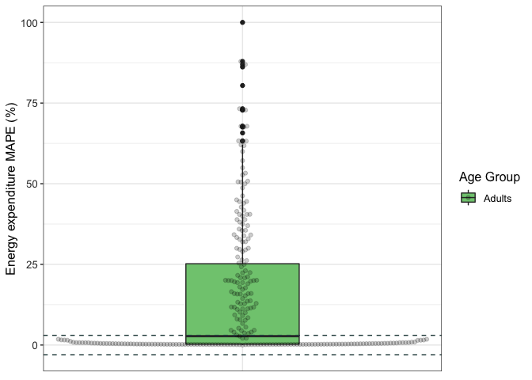
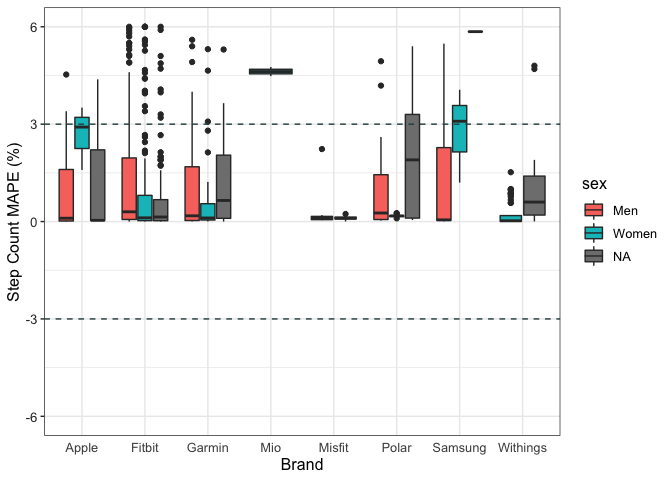

```r
df <- read_csv("wearable_review_data_validity.csv")
head(df)
```

<div class="kable-table">

| X1|Author    | Year|Substudy |Setting    |Measured |Measure_Unit |Brand |Device         |device_name          | device_year|Wear_Location |Wear_Info     |Type      |Good? |Criterion_Measure                         |Criterion_Type |Wear_Info_crit |Wear_Location_crit |population_n |population_m |population_f |population     |age_code |health_code |age   | age_SD|weight | weight_SD|height | height_SD|BMI   | BMI_SD|location |activity_type |test_type |activity_type_code |body_Motion |pace_code |pace_value |incline_code |incline_pct |activity_details                                                                                |bout_rest |epoch              | actual_n_analyzed|trend                                                                                                                                                           |CC_type |   CC|CC_bins |CC_all | CC_CI_pct|CC_CI_upper |CC_CI_lower |CC_pvalue |CC_significance |ES_type   |    ES| ES_CI_upper| ES_CI_lower|BA_LoA_upper |BA_LoA_lower | BA_LoA_width| devicemean| devicemean_SD| critmean| critmean_SD|device_v_crit |meandiff | meandiff_SD| meandiff_CI_upper| meandiff_CI_lower|        MPE|MPE_bin |MPE_SD |MPE_significance_test |MPE_significance_num | MAD| MAD_SD| MAD_CI_upper| MAD_CI_lower|   MAPE|MAPE_bin | MAPE_SD| MAPE_CI_upper| MAPE_CI_lower| RMSE|equivalencetesting | accuracypct| accuracypct_CI_upper| accuracypct_CI_lower| TEEstandardized| TEEstandardized_CI_upper| TEEstandardized_CI_lower| deviceSE| deviceCofV| critCofV|n_5pctofcrit |n_10pctofcrit |n_15pctofcrit | n_20pctofcrit| n_25pctofcrit| systematicbias_slope| systematicbias_intercept|systematicbias_probability |systematicbias_significance |Other |
|--:|:---------|----:|:--------|:----------|:--------|:------------|:-----|:--------------|:--------------------|-----------:|:-------------|:-------------|:---------|:-----|:-----------------------------------------|:--------------|:--------------|:------------------|:------------|:------------|:------------|:--------------|:--------|:-----------|:-----|------:|:------|---------:|:------|---------:|:-----|------:|:--------|:-------------|:---------|:------------------|:-----------|:---------|:----------|:------------|:-----------|:-----------------------------------------------------------------------------------------------|:---------|:------------------|-----------------:|:---------------------------------------------------------------------------------------------------------------------------------------------------------------|:-------|----:|:-------|:------|---------:|:-----------|:-----------|:---------|:---------------|:---------|-----:|-----------:|-----------:|:------------|:------------|------------:|----------:|-------------:|--------:|-----------:|:-------------|:--------|-----------:|-----------------:|-----------------:|----------:|:-------|:------|:---------------------|:--------------------|---:|------:|------------:|------------:|------:|:--------|-------:|-------------:|-------------:|----:|:------------------|-----------:|--------------------:|--------------------:|---------------:|------------------------:|------------------------:|--------:|----------:|--------:|:------------|:-------------|:-------------|-------------:|-------------:|--------------------:|------------------------:|:--------------------------|:---------------------------|:-----|
|  1|Dooley    | 2017|-        |Controlled |HR       |bpm          |Apple |Watch          |Apple Watch          |        2015|Wrist         |wrist, random |full-text |y     |Heart rate sensor chest strap (Polar T31) |chest strap    |chest          |Torso              |62           |26           |36           |healthy adults |A        |H           |22.55 |   4.34|72.02  |     18.99|170    |     11.00|24.6  |   4.77|TX, USA  |Rest: Seated  |Rest      |Se                 |NA          |NA        |NA         |N            |NA          |sedentary, seated baseline assessment, 10 min, HR assessed 3.5 minutes into each activity stage |yes       |unknown            |                62|good validity                                                                                                                                                   |NA      |   NA|NA      |NA     |        NA|NA          |NA          |NA        |NA              |Cohen's d |  0.04|          NA|          NA|NA           |NA           |           NA|      72.84|         12.08|    72.32|       12.21|over          |NA       |          NA|                NA|                NA|  0.0071903|± 3%    |NA     |0.78                  |ns                   |  NA|     NA|           NA|           NA| 0.0276|less 3%  |      NA|            NA|            NA|   NA|NA                 |          NA|                   NA|                   NA|              NA|                       NA|                       NA|       NA|         NA|       NA|NA           |NA            |NA            |            NA|            NA|                   NA|                       NA|NA                         |NA                          |NA    |
|  2|Dooley    | 2017|-        |Controlled |HR       |bpm          |Apple |Watch          |Apple Watch          |        2015|Wrist         |wrist, random |full-text |y     |Heart rate sensor chest strap (Polar T31) |chest strap    |chest          |Torso              |62           |26           |36           |healthy adults |A        |H           |22.55 |   4.34|72.02  |     18.99|170    |     11.00|24.6  |   4.77|TX, USA  |Rest: Seated  |Rest      |Se                 |NA          |NA        |NA         |N            |NA          |sedentary, seated baseline assessment, 10 min, HR assessed 3.5 minutes into each activity stage |yes       |unknown            |                62|good validity                                                                                                                                                   |NA      |   NA|NA      |NA     |        NA|NA          |NA          |NA        |NA              |Cohen's d |  0.01|          NA|          NA|NA           |NA           |           NA|      73.07|         11.45|    72.99|       11.30|over          |NA       |          NA|                NA|                NA|  0.0010960|± 3%    |NA     |0.76                  |ns                   |  NA|     NA|           NA|           NA| 0.0163|less 3%  |      NA|            NA|            NA|   NA|NA                 |          NA|                   NA|                   NA|              NA|                       NA|                       NA|       NA|         NA|       NA|NA           |NA            |NA            |            NA|            NA|                   NA|                       NA|NA                         |NA                          |NA    |
|  3|Dooley    | 2017|-        |Controlled |HR       |bpm          |Apple |Watch          |Apple Watch          |        2015|Wrist         |wrist, random |full-text |y     |Heart rate sensor chest strap (Polar T31) |chest strap    |chest          |Torso              |62           |26           |36           |healthy adults |A        |H           |22.55 |   4.34|72.02  |     18.99|170    |     11.00|24.6  |   4.77|TX, USA  |Rest: Seated  |Rest      |Se                 |NA          |NA        |NA         |N            |NA          |rest, seated recovery period, 10 min, HR assessed 3.5 minutes into each activity stage          |no        |unknown            |                62|underestimate                                                                                                                                                   |NA      |   NA|NA      |NA     |        NA|NA          |NA          |NA        |NA              |Cohen's d | -0.03|          NA|          NA|NA           |NA           |           NA|      84.02|         15.27|    84.47|       15.16|under         |NA       |          NA|                NA|                NA| -0.0053273|± 3%    |NA     |< .001                |sig                  |  NA|     NA|           NA|           NA| 0.0114|less 3%  |      NA|            NA|            NA|   NA|NA                 |          NA|                   NA|                   NA|              NA|                       NA|                       NA|       NA|         NA|       NA|NA           |NA            |NA            |            NA|            NA|                   NA|                       NA|NA                         |NA                          |NA    |
|  4|Boudreaux | 2018|-        |Controlled |HR       |bpm          |Apple |Watch Series 2 |Apple Watch Series 2 |        2016|Wrist         |wrist, random |full-text |y     |Electrocardiography (Quinton Q4500)       |ECG            |upper torso    |Torso              |50           |22           |28           |healthy adults |A        |H           |22.71 |   2.99|67.79  |     14.01|162.71 |      5.79|25.83 |   4.83|LA, USA  |Rest: Seated  |Rest      |Se                 |NA          |NA        |NA         |N            |NA          |rest, 5 min, mean of session                                                                    |NA        |average of session |                50|Across all devices, as exercise intensity increased, there was greater underestimation of HR. No device was valid for EE during cycling or resistance exercise. |ICC     | 0.99|VS      |0.99   |        NA|NA          |NA          |NA        |NA              |NA        |    NA|          NA|          NA|NA           |NA           |           NA|         NA|            NA|       NA|          NA|equal         |0.04     |        1.71|             -3.31|              3.39|         NA|NA      |NA     |NA                    |NA                   |  NA|     NA|           NA|           NA| 0.0121|less 3%  |      NA|            NA|            NA|   NA|NA                 |          NA|                   NA|                   NA|              NA|                       NA|                       NA|       NA|         NA|       NA|NA           |NA            |NA            |            NA|            NA|                   NA|                       NA|NA                         |NA                          |NA    |
|  5|Boudreaux | 2018|-        |Controlled |HR       |bpm          |Apple |Watch Series 2 |Apple Watch Series 2 |        2016|Wrist         |wrist, random |full-text |y     |Electrocardiography (Quinton Q4500)       |ECG            |upper torso    |Torso              |50           |22           |28           |healthy adults |A        |H           |22.71 |   2.99|67.79  |     14.01|162.71 |      5.79|25.83 |   4.83|LA, USA  |Rest: Seated  |Rest      |Se                 |NA          |NA        |NA         |N            |NA          |rest, 5 min, mean of session                                                                    |NA        |average of session |                50|Across all devices, as exercise intensity increased, there was greater underestimation of HR. No device was valid for EE during cycling or resistance exercise. |ICC     | 0.82|VS      |0.82   |        NA|NA          |NA          |NA        |NA              |NA        |    NA|          NA|          NA|NA           |NA           |           NA|         NA|            NA|       NA|          NA|equal         |0.02     |        1.71|             -3.33|              3.37|         NA|NA      |NA     |NA                    |NA                   |  NA|     NA|           NA|           NA| 0.0144|less 3%  |      NA|            NA|            NA|   NA|NA                 |          NA|                   NA|                   NA|              NA|                       NA|                       NA|       NA|         NA|       NA|NA           |NA            |NA            |            NA|            NA|                   NA|                       NA|NA                         |NA                          |NA    |
|  6|Boudreaux | 2018|-        |Controlled |HR       |bpm          |Apple |Watch Series 2 |Apple Watch Series 2 |        2016|Wrist         |wrist, random |full-text |y     |Electrocardiography (Quinton Q4500)       |ECG            |upper torso    |Torso              |50           |22           |28           |healthy adults |A        |H           |22.71 |   2.99|67.79  |     14.01|162.71 |      5.79|25.83 |   4.83|LA, USA  |Cycle         |Activity  |Mi                 |Mi          |NA        |NA         |N            |NA          |cycling, graded exercise test, 50W, 2 min, mean of intensity                                    |NA        |6 time points      |                50|Across all devices, as exercise intensity increased, there was greater underestimation of HR. No device was valid for EE during cycling or resistance exercise. |ICC     | 0.90|VS      |0.9    |        NA|NA          |NA          |NA        |NA              |NA        |    NA|          NA|          NA|NA           |NA           |           NA|         NA|            NA|       NA|          NA|over          |1.28     |        8.55|            -15.46|             18.03|         NA|NA      |NA     |NA                    |NA                   |  NA|     NA|           NA|           NA| 0.0299|less 3%  |      NA|            NA|            NA|   NA|NA                 |          NA|                   NA|                   NA|              NA|                       NA|                       NA|       NA|         NA|       NA|NA           |NA            |NA            |            NA|            NA|                   NA|                       NA|NA                         |NA                          |NA    |

</div>


```r
summary(df$MAPE)
```

```
##    Min. 1st Qu.  Median    Mean 3rd Qu.    Max.    NA's 
##  0.0000  0.0410  0.0984  0.1973  0.2120  5.9590    1014
```


## Data Cleaning 


```r
data <- df %>% 
    select(Author, Year, Brand, device_name, device_year, location, Measured, Setting, Wear_Location, age, age_code, 
           BMI, population_n, population_m, population_f, MPE, MAPE)
glimpse(data)
```

```
## Rows: 1,672
## Columns: 17
## $ Author        <chr> "Dooley", "Dooley", "Dooley", "Boudreaux", "Boudreaux", …
## $ Year          <dbl> 2017, 2017, 2017, 2018, 2018, 2018, 2017, 2017, 2017, 20…
## $ Brand         <chr> "Apple", "Apple", "Apple", "Apple", "Apple", "Apple", "A…
## $ device_name   <chr> "Apple Watch", "Apple Watch", "Apple Watch", "Apple Watc…
## $ device_year   <dbl> 2015, 2015, 2015, 2016, 2016, 2016, 2015, 2015, 2015, 20…
## $ location      <chr> "TX, USA", "TX, USA", "TX, USA", "LA, USA", "LA, USA", "…
## $ Measured      <chr> "HR", "HR", "HR", "HR", "HR", "HR", "SC", "SC", "SC", "S…
## $ Setting       <chr> "Controlled", "Controlled", "Controlled", "Controlled", …
## $ Wear_Location <chr> "Wrist", "Wrist", "Wrist", "Wrist", "Wrist", "Wrist", "W…
## $ age           <chr> "22.55", "22.55", "22.55", "22.71", "22.71", "22.71", "3…
## $ age_code      <chr> "A", "A", "A", "A", "A", "A", "A", "A", "A", "A", "A", "…
## $ BMI           <chr> "24.6", "24.6", "24.6", "25.83", "25.83", "25.83", "22.6…
## $ population_n  <chr> "62", "62", "62", "50", "50", "50", "31", "31", "31", "3…
## $ population_m  <chr> "26", "26", "26", "22", "22", "22", "16", "16", "16", "1…
## $ population_f  <chr> "36", "36", "36", "28", "28", "28", "15", "15", "15", "1…
## $ MPE           <dbl> 0.007190265, 0.001096041, -0.005327335, NA, NA, NA, 0.02…
## $ MAPE          <dbl> 0.0276, 0.0163, 0.0114, 0.0121, 0.0144, 0.0299, 0.0260, …
```


### MAPE - missing values


```r
data <- data %>% 
  mutate(MAPE = ifelse(is.na(MAPE),
                            abs(MPE*100),
                            MAPE))
```


```r
summary(data$MAPE)
```

```
##    Min. 1st Qu.  Median    Mean 3rd Qu.    Max.    NA's 
##   0.000   0.092   0.600   9.546   8.416 150.794     128
```


```r
data$population_f <- as.numeric(data$population_f)
data$population_m <- as.numeric(data$population_m)
data$BMI <- as.numeric(data$BMI)
data$age <- as.numeric(data$age)
data$population_n <- as.numeric(data$population_n)
```


```r
data <- data %>% mutate_if(is.character, as.factor) %>% drop_na(MAPE)

str(data)
```

```
## tibble [1,544 × 17] (S3: tbl_df/tbl/data.frame)
##  $ Author       : Factor w/ 148 levels "Abt","Adam Noah",..: 40 40 40 17 17 17 47 47 47 47 ...
##  $ Year         : num [1:1544] 2017 2017 2017 2018 2018 ...
##  $ Brand        : Factor w/ 9 levels "Apple","Fitbit",..: 1 1 1 1 1 1 1 1 1 1 ...
##  $ device_name  : Factor w/ 45 levels "Apple Watch",..: 1 1 1 2 2 2 1 1 1 1 ...
##  $ device_year  : num [1:1544] 2015 2015 2015 2016 2016 ...
##  $ location     : Factor w/ 63 levels "ACT, AUS","AZ, USA",..: 57 57 57 27 27 27 35 35 35 35 ...
##  $ Measured     : Factor w/ 3 levels "EE","HR","SC": 2 2 2 2 2 2 3 3 3 3 ...
##  $ Setting      : Factor w/ 2 levels "Controlled","Free-Living": 1 1 1 1 1 1 1 1 1 1 ...
##  $ Wear_Location: Factor w/ 6 levels "LAF","Thigh",..: 6 6 6 6 6 6 6 6 6 6 ...
##  $ age          : num [1:1544] 22.6 22.6 22.6 22.7 22.7 ...
##  $ age_code     : Factor w/ 2 levels "A","C": 1 1 1 1 1 1 1 1 1 1 ...
##  $ BMI          : num [1:1544] 24.6 24.6 24.6 25.8 25.8 ...
##  $ population_n : num [1:1544] 62 62 62 50 50 50 31 31 31 31 ...
##  $ population_m : num [1:1544] 26 26 26 22 22 22 16 16 16 16 ...
##  $ population_f : num [1:1544] 36 36 36 28 28 28 15 15 15 15 ...
##  $ MPE          : num [1:1544] 0.00719 0.0011 -0.00533 NA NA ...
##  $ MAPE         : num [1:1544] 0.0276 0.0163 0.0114 0.0121 0.0144 0.0299 0.026 0.019 0.014 0.005 ...
```

148 observations removed because of missing data on MAPE.

## Data Cleaning by Variable


```r
summary(data)
```

```
##        Author          Year           Brand               device_name 
##  Tedesco  :  85   Min.   :2013   Fitbit  :882   Fitbit Zip      :194  
##  Wahl     :  84   1st Qu.:2016   Garmin  :262   Fitbit One      :179  
##  An       :  72   Median :2017   Withings:126   Fitbit Charge HR:140  
##  Diaz     :  64   Mean   :2017   Apple   :117   Fitbit Flex     :125  
##  Singh    :  60   3rd Qu.:2018   Polar   : 65   Garmin Vivofit  :107  
##  Boudreaux:  50   Max.   :2019   Misfit  : 49   Apple Watch     :101  
##  (Other)  :1129                  (Other) : 43   (Other)         :698  
##   device_year      location    Measured        Setting       Wear_Location
##  Min.   :2008   Ireland: 128   EE:330   Controlled :1440   LAF      : 67  
##  1st Qu.:2013   NE, USA: 100   HR:238   Free-Living: 104   Thigh    :  1  
##  Median :2014   Germany:  84   SC:976                      Torso    :102  
##  Mean   :2014   NY, USA:  78                               Upper Arm:  6  
##  3rd Qu.:2015   TX, USA:  73                               Waist/Hip:370  
##  Max.   :2016   Denmark:  70                               Wrist    :998  
##  NA's   :3      (Other):1011                                              
##       age        age_code      BMI         population_n    population_m  
##  Min.   : 3.69   A:1519   Min.   :20.50   Min.   : 10.0   Min.   : 0.00  
##  1st Qu.:23.60   C:  25   1st Qu.:23.40   1st Qu.: 20.0   1st Qu.: 8.00  
##  Median :29.93            Median :24.60   Median : 25.0   Median :13.00  
##  Mean   :34.02            Mean   :24.51   Mean   : 29.5   Mean   :15.12  
##  3rd Qu.:34.50            3rd Qu.:25.83   3rd Qu.: 35.0   3rd Qu.:19.00  
##  Max.   :87.00            Max.   :30.80   Max.   :185.0   Max.   :91.00  
##  NA's   :343              NA's   :703     NA's   :4       NA's   :27     
##   population_f        MPE                MAPE        
##  Min.   : 0.00   Min.   :-1.00000   Min.   :  0.000  
##  1st Qu.:10.00   1st Qu.:-0.10583   1st Qu.:  0.092  
##  Median :12.00   Median :-0.01450   Median :  0.600  
##  Mean   :14.38   Mean   :-0.04315   Mean   :  9.546  
##  3rd Qu.:17.00   3rd Qu.: 0.01396   3rd Qu.:  8.416  
##  Max.   :96.00   Max.   : 5.30000   Max.   :150.794  
##  NA's   :27      NA's   :166
```


```r
ggplot(data, aes(MAPE)) + 
  geom_histogram(bins = 25) +
  theme_classic(base_size = 12)
```

<!-- -->


```r
ggplot(data, aes(MAPE)) + 
                geom_boxplot() +
                coord_flip() +
                theme_classic(base_size = 12)
```

<!-- -->

### Outlier Analysis

#### Run


```r
data_no_outliers <- filter(data, MAPE < 150) #1544 before outlier removal
glimpse(data_no_outliers)
```

```
## Rows: 1,543
## Columns: 17
## $ Author        <fct> Dooley, Dooley, Dooley, Boudreaux, Boudreaux, Boudreaux,…
## $ Year          <dbl> 2017, 2017, 2017, 2018, 2018, 2018, 2017, 2017, 2017, 20…
## $ Brand         <fct> Apple, Apple, Apple, Apple, Apple, Apple, Apple, Apple, …
## $ device_name   <fct> Apple Watch, Apple Watch, Apple Watch, Apple Watch Serie…
## $ device_year   <dbl> 2015, 2015, 2015, 2016, 2016, 2016, 2015, 2015, 2015, 20…
## $ location      <fct> "TX, USA", "TX, USA", "TX, USA", "LA, USA", "LA, USA", "…
## $ Measured      <fct> HR, HR, HR, HR, HR, HR, SC, SC, SC, SC, SC, SC, HR, HR, …
## $ Setting       <fct> Controlled, Controlled, Controlled, Controlled, Controll…
## $ Wear_Location <fct> Wrist, Wrist, Wrist, Wrist, Wrist, Wrist, Wrist, Wrist, …
## $ age           <dbl> 22.55, 22.55, 22.55, 22.71, 22.71, 22.71, 32.00, 32.00, …
## $ age_code      <fct> A, A, A, A, A, A, A, A, A, A, A, A, A, A, A, A, A, A, A,…
## $ BMI           <dbl> 24.60, 24.60, 24.60, 25.83, 25.83, 25.83, 22.60, 22.60, …
## $ population_n  <dbl> 62, 62, 62, 50, 50, 50, 31, 31, 31, 31, 31, 31, 62, 50, …
## $ population_m  <dbl> 26, 26, 26, 22, 22, 22, 16, 16, 16, 16, 16, 16, 26, 32, …
## $ population_f  <dbl> 36, 36, 36, 28, 28, 28, 15, 15, 15, 15, 15, 15, 36, 18, …
## $ MPE           <dbl> 0.007190265, 0.001096041, -0.005327335, NA, NA, NA, 0.02…
## $ MAPE          <dbl> 0.0276, 0.0163, 0.0114, 0.0121, 0.0144, 0.0299, 0.0260, …
```

1 case removed for having MAPE percent greater than 150%


```r
ggplot(data_no_outliers, aes(MAPE)) + 
                  geom_histogram(bins = 30) +
                  theme_classic()
```

<!-- -->


```r
ggplot(data_no_outliers, aes(MAPE)) + 
                  geom_boxplot() +
                  coord_flip() +
                  theme_classic()
```

<!-- -->

### AGE


```r
data_no_outliers <- data_no_outliers %>% 
  mutate(age_code = case_when(
    age <= 17.9 ~ "Children",
    age >= 18.0 & age <= 64.9 ~ "Adults",
    age >= 65.0 ~ "Older Adults"))
```


```r
data_no_outliers$age_code <- as.factor(data_no_outliers$age_code)
data_no_outliers$age_code <- fct_relevel(data_no_outliers$age_code, c("Adults","Children", "Older Adults"))
table(data_no_outliers$age, data_no_outliers$age_code)
```

```
##        
##         Adults Children Older Adults
##   3.69       0        2            0
##   8          0        1            0
##   8.21       0        1            0
##   9.6        0        4            0
##   11.15      0        1            0
##   12.74      0        1            0
##   12.76      0        1            0
##   13         0        1            0
##   15.4       0        8            0
##   15.9       0        2            0
##   20.2       6        0            0
##   20.35      5        0            0
##   21         3        0            0
##   21.1      24        0            0
##   21.2       4        0            0
##   21.23      3        0            0
##   21.4      12        0            0
##   21.5      35        0            0
##   21.6      10        0            0
##   22        10        0            0
##   22.2      16        0            0
##   22.55     33        0            0
##   22.71     45        0            0
##   23        12        0            0
##   23.3       3        0            0
##   23.4       6        0            0
##   23.5      48        0            0
##   23.6      12        0            0
##   23.7       6        0            0
##   23.9      23        0            0
##   24        18        0            0
##   24.1      15        0            0
##   24.3      15        0            0
##   24.5       4        0            0
##   24.6       4        0            0
##   24.8       3        0            0
##   24.9      11        0            0
##   25.1       1        0            0
##   25.4       3        0            0
##   25.5      44        0            0
##   25.6      18        0            0
##   25.7       2        0            0
##   25.8      10        0            0
##   25.96      3        0            0
##   26.2       5        0            0
##   26.6       8        0            0
##   26.65      8        0            0
##   26.9       1        0            0
##   27        18        0            0
##   27.5      30        0            0
##   27.9       1        0            0
##   28         4        0            0
##   28.1       1        0            0
##   28.3       1        0            0
##   28.5       6        0            0
##   28.87      3        0            0
##   29         9        0            0
##   29.6      15        0            0
##   29.93      3        0            0
##   30         3        0            0
##   30.8      64        0            0
##   31        85        0            0
##   31.1       8        0            0
##   31.4      12        0            0
##   32        83        0            0
##   32.1      10        0            0
##   32.7       2        0            0
##   32.8       8        0            0
##   33         4        0            0
##   34         5        0            0
##   34.5      28        0            0
##   35         5        0            0
##   37.1       7        0            0
##   38        16        0            0
##   39        40        0            0
##   39.43      2        0            0
##   39.6       1        0            0
##   40         7        0            0
##   40.4       2        0            0
##   41.8       1        0            0
##   43         9        0            0
##   46.7       4        0            0
##   48         1        0            0
##   48.9      15        0            0
##   49.2       6        0            0
##   49.7       4        0            0
##   53.7       5        0            0
##   53.9       7        0            0
##   54         6        0            0
##   55         1        0            0
##   55.4       1        0            0
##   57         2        0            0
##   57.8       1        0            0
##   58.6       1        0            0
##   61.3       2        0            0
##   61.5       2        0            0
##   61.9       4        0            0
##   62.6       1        0            0
##   63.4       1        0            0
##   64.4       6        0            0
##   65         0        0           17
##   65.48      0        0            8
##   65.6       0        0            1
##   66         0        0            2
##   67         0        0            2
##   67.7       0        0            2
##   68         0        0            2
##   69         0        0           14
##   69.2       0        0            4
##   70.9       0        0            5
##   72.5       0        0            6
##   73         0        0           14
##   74.2       0        0            8
##   74.3       0        0            2
##   77.6       0        0            2
##   79.2       0        0            2
##   80         0        0            4
##   84.2       0        0            1
##   84.8       0        0            2
##   87         0        0           28
```

```r
table(data_no_outliers$age_code)
```

```
## 
##       Adults     Children Older Adults 
##         1052           22          126
```

### SEX


```r
data_no_outliers <- data_no_outliers %>%
        mutate(man_pre = (population_m/population_n*100)
        )

data_no_outliers <- data_no_outliers %>%
        mutate(sex = case_when(
                population_m > population_f ~ "Men",
                population_m < population_f ~ "Women"
        ))

data_no_outliers <- data_no_outliers %>%
        mutate(sex_10 = case_when(
                man_pre >= 60 & man_pre <= 100 ~ "Men",
                man_pre <= 40 & man_pre >= 0 ~ "Women",
                TRUE ~ "Even"
        ))

table(data_no_outliers$sex_10)
```

```
## 
##  Even   Men Women 
##   923   363   257
```

```r
data_no_outliers$sex_10 <- fct_relevel(data_no_outliers$sex_10, c("Women","Even","Men"))
```


```r
data_no_outliers$sex <- as.factor(data_no_outliers$sex)
data_no_outliers$sex_10 <- as.factor(data_no_outliers$sex_10)
```

### BMI


```r
data_no_outliers <- data_no_outliers %>%
        mutate(bmi_code = case_when(
                BMI >= 18.5 & BMI <= 24.9 ~ "Healthy weight",
                BMI > 24.9 & BMI <= 29.9 ~ "Overweight",
                BMI > 29.9 ~ "Obese"
        ))

table(data_no_outliers$BMI, data_no_outliers$bmi_code)
```

```
##        
##         Healthy weight Obese Overweight
##   20.5               1     0          0
##   20.9              12     0          0
##   21.4              12     0          0
##   21.5              35     0          0
##   21.6               1     0          0
##   22.14              4     0          0
##   22.25              3     0          0
##   22.35              3     0          0
##   22.4               1     0          0
##   22.5              30     0          0
##   22.6              37     0          0
##   22.7              15     0          0
##   22.84             10     0          0
##   22.9               2     0          0
##   23                 7     0          0
##   23.2              16     0          0
##   23.22              2     0          0
##   23.25              2     0          0
##   23.4              25     0          0
##   23.5              13     0          0
##   23.6              15     0          0
##   23.66              1     0          0
##   23.7               9     0          0
##   23.8              75     0          0
##   23.86              1     0          0
##   23.9              15     0          0
##   23.95              1     0          0
##   24                 6     0          0
##   24.05              2     0          0
##   24.09              1     0          0
##   24.2              24     0          0
##   24.3               8     0          0
##   24.41              2     0          0
##   24.6              43     0          0
##   24.62              2     0          0
##   24.7              27     0          0
##   24.9              44     0          0
##   25                 0     0         21
##   25.05              0     0          8
##   25.1               0     0         20
##   25.3               0     0          4
##   25.6               0     0         36
##   25.7               0     0         15
##   25.81              0     0          3
##   25.83              0     0         45
##   25.9               0     0          1
##   26                 0     0         40
##   26.1               0     0         54
##   26.3               0     0         15
##   26.4               0     0          8
##   26.6               0     0          4
##   26.7               0     0          2
##   27                 0     0         16
##   27.4               0     0          8
##   27.7               0     0          2
##   27.9               0     0          1
##   28                 0     0         14
##   28.1               0     0          4
##   28.3               0     0          4
##   28.9               0     0          1
##   29                 0     0          2
##   29.6               0     0          1
##   29.9               0     0          1
##   30                 0     2          0
##   30.8               0     1          0
```

```r
table(data_no_outliers$bmi_code)
```

```
## 
## Healthy weight          Obese     Overweight 
##            507              3            330
```

### Wear Location


```r
table(data_no_outliers$Wear_Location)
```

```
## 
##       LAF     Thigh     Torso Upper Arm Waist/Hip     Wrist 
##        67         1       102         6       370       997
```

```r
data_no_outliers <- data_no_outliers %>%
        mutate(wear_loc = case_when(
                Wear_Location == "Wrist" ~ "Wrist",
                Wear_Location == "Waist/Hip" ~ "Hip",
                Wear_Location == "LAF" ~ "Other",
                Wear_Location == "Thigh" ~ "Other",
                Wear_Location == "Torso" ~ "Other",
                Wear_Location == "Upper Arm" ~ "Other"
        ))

table(data_no_outliers$Wear_Location, data_no_outliers$wear_loc)
```

```
##            
##             Hip Other Wrist
##   LAF         0    67     0
##   Thigh       0     1     0
##   Torso       0   102     0
##   Upper Arm   0     6     0
##   Waist/Hip 370     0     0
##   Wrist       0     0   997
```

```r
table(data_no_outliers$wear_loc)
```

```
## 
##   Hip Other Wrist 
##   370   176   997
```


```r
data_no_outliers$bmi_code <- as.factor(data_no_outliers$bmi_code)
data_no_outliers$bmi_code <- fct_relevel(data_no_outliers$bmi_code, c("Healthy weight","Overweight","Obese"))
```


## Brand


```r
# Filtering out brands with less than 10 comparisons
table(data_no_outliers$Brand)
```

```
## 
##    Apple   Fitbit   Garmin      Mio   Misfit    Polar  Samsung Withings 
##      116      882      262       18       49       65       18      126 
##   Xiaomi 
##        7
```

```r
data_no_outliers <- filter(data_no_outliers, Brand != "Xiaomi")
```


## MAPE for Step count, heart rate & energy expenditure across different groups


```r
#AGE GROUP
data_no_outliers %>%
    group_by(Measured, age_code) %>%
    get_summary_stats(MAPE, type = "mean_sd") %>%
    arrange(Measured)
```

<div class="kable-table">

|Measured |age_code     |variable |   n|   mean|     sd|
|:--------|:------------|:--------|---:|------:|------:|
|EE       |Adults       |MAPE     | 251| 15.742| 21.713|
|EE       |NA           |MAPE     |  77| 18.934| 19.174|
|HR       |Adults       |MAPE     | 182|  1.513|  2.975|
|HR       |Children     |MAPE     |   2|  0.084|  0.022|
|HR       |NA           |MAPE     |  54|  0.210|  0.871|
|SC       |Adults       |MAPE     | 614| 10.311| 21.472|
|SC       |Children     |MAPE     |  20|  2.220|  5.206|
|SC       |Older Adults |MAPE     | 126| 15.857| 23.102|
|SC       |NA           |MAPE     | 210|  2.463|  5.666|

</div>


```r
#SEX GROUP
data_no_outliers %>%
    group_by(sex, Measured) %>%
    get_summary_stats(MAPE, type = "mean_sd") %>%
    arrange(Measured)
```

<div class="kable-table">

|Measured |sex   |variable |   n|   mean|     sd|
|:--------|:-----|:--------|---:|------:|------:|
|EE       |Men   |MAPE     | 145| 22.944| 24.433|
|EE       |Women |MAPE     |  91|  7.749| 12.217|
|EE       |NA    |MAPE     |  92| 14.970| 19.275|
|HR       |Men   |MAPE     |  86|  1.866|  3.417|
|HR       |Women |MAPE     | 126|  0.262|  0.859|
|HR       |NA    |MAPE     |  26|  3.595|  3.644|
|SC       |Men   |MAPE     | 339| 10.933| 22.717|
|SC       |Women |MAPE     | 389|  9.798| 20.335|
|SC       |NA    |MAPE     | 242|  5.674| 11.944|

</div>


```r
#BMI GROUP
data_no_outliers %>%
    group_by(bmi_code, Measured) %>%
    get_summary_stats(MAPE, type = "mean_sd") %>%
    arrange(Measured)
```

<div class="kable-table">

|Measured |bmi_code       |variable |   n|   mean|     sd|
|:--------|:--------------|:--------|---:|------:|------:|
|EE       |Healthy weight |MAPE     | 139| 17.524| 23.302|
|EE       |Overweight     |MAPE     |  58|  7.457| 16.474|
|EE       |NA             |MAPE     | 131| 19.396| 19.616|
|HR       |Healthy weight |MAPE     |  64|  2.107|  3.849|
|HR       |Overweight     |MAPE     |  78|  0.779|  2.276|
|HR       |NA             |MAPE     |  96|  0.951|  1.808|
|SC       |Healthy weight |MAPE     | 304|  4.511| 11.296|
|SC       |Overweight     |MAPE     | 194|  9.366| 18.627|
|SC       |Obese          |MAPE     |   3| 22.718| 20.170|
|SC       |NA             |MAPE     | 469| 12.013| 23.389|

</div>


```r
#number of studies for each population and measures
data_no_outliers <- data_no_outliers %>%
    group_by(Measured, bmi_code, sex, age_code) %>%
    mutate(n_studies = n())
glimpse(data_no_outliers)
```

```
## Rows: 1,536
## Columns: 23
## Groups: Measured, bmi_code, sex, age_code [47]
## $ Author        <fct> Dooley, Dooley, Dooley, Boudreaux, Boudreaux, Boudreaux,…
## $ Year          <dbl> 2017, 2017, 2017, 2018, 2018, 2018, 2017, 2017, 2017, 20…
## $ Brand         <fct> Apple, Apple, Apple, Apple, Apple, Apple, Apple, Apple, …
## $ device_name   <fct> Apple Watch, Apple Watch, Apple Watch, Apple Watch Serie…
## $ device_year   <dbl> 2015, 2015, 2015, 2016, 2016, 2016, 2015, 2015, 2015, 20…
## $ location      <fct> "TX, USA", "TX, USA", "TX, USA", "LA, USA", "LA, USA", "…
## $ Measured      <fct> HR, HR, HR, HR, HR, HR, SC, SC, SC, SC, SC, SC, HR, HR, …
## $ Setting       <fct> Controlled, Controlled, Controlled, Controlled, Controll…
## $ Wear_Location <fct> Wrist, Wrist, Wrist, Wrist, Wrist, Wrist, Wrist, Wrist, …
## $ age           <dbl> 22.55, 22.55, 22.55, 22.71, 22.71, 22.71, 32.00, 32.00, …
## $ age_code      <fct> Adults, Adults, Adults, Adults, Adults, Adults, Adults, …
## $ BMI           <dbl> 24.60, 24.60, 24.60, 25.83, 25.83, 25.83, 22.60, 22.60, …
## $ population_n  <dbl> 62, 62, 62, 50, 50, 50, 31, 31, 31, 31, 31, 31, 62, 50, …
## $ population_m  <dbl> 26, 26, 26, 22, 22, 22, 16, 16, 16, 16, 16, 16, 26, 32, …
## $ population_f  <dbl> 36, 36, 36, 28, 28, 28, 15, 15, 15, 15, 15, 15, 36, 18, …
## $ MPE           <dbl> 0.007190265, 0.001096041, -0.005327335, NA, NA, NA, 0.02…
## $ MAPE          <dbl> 0.0276, 0.0163, 0.0114, 0.0121, 0.0144, 0.0299, 0.0260, …
## $ man_pre       <dbl> -10, -10, -10, -6, -6, -6, 1, 1, 1, 1, 1, 1, -10, 14, 14…
## $ sex           <fct> Women, Women, Women, Women, Women, Women, Men, Men, Men,…
## $ sex_10        <fct> Women, Women, Women, Even, Even, Even, Even, Even, Even,…
## $ bmi_code      <fct> Healthy weight, Healthy weight, Healthy weight, Overweig…
## $ wear_loc      <chr> "Wrist", "Wrist", "Wrist", "Wrist", "Wrist", "Wrist", "W…
## $ n_studies     <int> 36, 36, 36, 50, 50, 50, 116, 116, 116, 116, 116, 116, 36…
```


```r
data_no_outliers %>% group_by(Measured) %>% count()
```

<div class="kable-table">

|Measured |   n|
|:--------|---:|
|EE       | 328|
|HR       | 238|
|SC       | 970|

</div>


```r
data_no_outliers %>%
    group_by(Brand, bmi_code, Measured) %>%
    get_summary_stats(MAPE, type = "mean_sd") %>%
    arrange(Brand, Measured)
```

<div class="kable-table">

|Brand    |Measured |bmi_code       |variable |   n|   mean|     sd|
|:--------|:--------|:--------------|:--------|---:|------:|------:|
|Apple    |EE       |Healthy weight |MAPE     |  21|  9.185| 21.947|
|Apple    |EE       |Overweight     |MAPE     |   9|  8.540| 11.133|
|Apple    |EE       |NA             |MAPE     |   2| 21.130| 29.189|
|Apple    |HR       |Healthy weight |MAPE     |  11|  1.895|  2.248|
|Apple    |HR       |Overweight     |MAPE     |  27|  2.020|  3.589|
|Apple    |HR       |NA             |MAPE     |  24|  1.168|  0.828|
|Apple    |SC       |Healthy weight |MAPE     |  11|  0.898|  1.630|
|Apple    |SC       |Overweight     |MAPE     |   8|  1.634|  1.272|
|Apple    |SC       |NA             |MAPE     |   3|  4.233|  3.742|
|Fitbit   |EE       |Healthy weight |MAPE     |  54|  8.714| 13.548|
|Fitbit   |EE       |Overweight     |MAPE     |  35|  3.476|  8.466|
|Fitbit   |EE       |NA             |MAPE     |  78| 22.124| 20.892|
|Fitbit   |HR       |Healthy weight |MAPE     |  22|  2.055|  4.000|
|Fitbit   |HR       |Overweight     |MAPE     |  32|  0.108|  0.077|
|Fitbit   |HR       |NA             |MAPE     |  40|  1.253|  2.408|
|Fitbit   |SC       |Healthy weight |MAPE     | 163|  6.369| 13.797|
|Fitbit   |SC       |Overweight     |MAPE     | 152|  9.823| 19.021|
|Fitbit   |SC       |Obese          |MAPE     |   3| 22.718| 20.170|
|Fitbit   |SC       |NA             |MAPE     | 303| 13.051| 24.340|
|Garmin   |EE       |Healthy weight |MAPE     |  26| 17.163| 23.346|
|Garmin   |EE       |Overweight     |MAPE     |   9| 25.782| 32.021|
|Garmin   |EE       |NA             |MAPE     |  17|  9.786| 13.178|
|Garmin   |HR       |Healthy weight |MAPE     |  31|  2.220|  4.265|
|Garmin   |HR       |Overweight     |MAPE     |  12|  0.148|  0.111|
|Garmin   |HR       |NA             |MAPE     |  18|  0.088|  0.063|
|Garmin   |SC       |Healthy weight |MAPE     |  50|  2.668|  6.905|
|Garmin   |SC       |Overweight     |MAPE     |  18| 14.968| 24.548|
|Garmin   |SC       |NA             |MAPE     |  81|  3.627| 12.332|
|Mio      |EE       |NA             |MAPE     |   1| 35.570|     NA|
|Mio      |HR       |NA             |MAPE     |  12|  0.394|  1.193|
|Mio      |SC       |Healthy weight |MAPE     |   5| 13.691| 10.443|
|Misfit   |EE       |Healthy weight |MAPE     |   3| 30.807| 29.127|
|Misfit   |EE       |Overweight     |MAPE     |   2|  0.452|  0.424|
|Misfit   |EE       |NA             |MAPE     |   3| 10.677|  4.940|
|Misfit   |SC       |Healthy weight |MAPE     |  19|  0.118|  0.050|
|Misfit   |SC       |Overweight     |MAPE     |   7|  3.002|  4.388|
|Misfit   |SC       |NA             |MAPE     |  15| 37.436| 22.472|
|Polar    |EE       |Healthy weight |MAPE     |   2| 47.692| 25.524|
|Polar    |EE       |Overweight     |MAPE     |   3|  0.347|  0.202|
|Polar    |EE       |NA             |MAPE     |  11| 21.040| 24.587|
|Polar    |HR       |Overweight     |MAPE     |   7|  0.143|  0.057|
|Polar    |HR       |NA             |MAPE     |   1|  0.351|     NA|
|Polar    |SC       |Healthy weight |MAPE     |  26|  3.735| 10.609|
|Polar    |SC       |Overweight     |MAPE     |   3|  4.418|  7.519|
|Polar    |SC       |NA             |MAPE     |  12| 11.313| 11.008|
|Samsung  |EE       |NA             |MAPE     |   2|  4.755|  6.187|
|Samsung  |HR       |NA             |MAPE     |   1|  6.480|     NA|
|Samsung  |SC       |Healthy weight |MAPE     |  11|  1.989|  2.727|
|Samsung  |SC       |Overweight     |MAPE     |   2|  3.575|  0.686|
|Samsung  |SC       |NA             |MAPE     |   2|  3.030|  3.988|
|Withings |EE       |Healthy weight |MAPE     |  33| 34.496| 26.271|
|Withings |EE       |NA             |MAPE     |  17| 17.532| 14.759|
|Withings |SC       |Healthy weight |MAPE     |  19|  0.014|  0.022|
|Withings |SC       |Overweight     |MAPE     |   4|  0.000|  0.000|
|Withings |SC       |NA             |MAPE     |  53| 12.642| 27.876|

</div>


```r
data_no_outliers %>%
    group_by(Brand, age_code, Measured) %>%
    get_summary_stats(MAPE, type = "mean_sd") %>%
    arrange(Brand, Measured)
```

<div class="kable-table">

|Brand    |Measured |age_code     |variable |   n|   mean|     sd|
|:--------|:--------|:------------|:--------|---:|------:|------:|
|Apple    |EE       |Adults       |MAPE     |  31| 10.049| 19.720|
|Apple    |EE       |NA           |MAPE     |   1|  0.490|     NA|
|Apple    |HR       |Adults       |MAPE     |  61|  1.694|  2.609|
|Apple    |HR       |NA           |MAPE     |   1|  0.072|     NA|
|Apple    |SC       |Adults       |MAPE     |  16|  1.571|  2.394|
|Apple    |SC       |Older Adults |MAPE     |   1|  1.590|     NA|
|Apple    |SC       |NA           |MAPE     |   5|  1.784|  1.220|
|Fitbit   |EE       |Adults       |MAPE     | 119| 12.198| 17.737|
|Fitbit   |EE       |NA           |MAPE     |  48| 18.049| 19.576|
|Fitbit   |HR       |Adults       |MAPE     |  65|  1.378|  2.939|
|Fitbit   |HR       |Children     |MAPE     |   2|  0.084|  0.022|
|Fitbit   |HR       |NA           |MAPE     |  27|  0.335|  1.228|
|Fitbit   |SC       |Adults       |MAPE     | 390| 11.821| 22.782|
|Fitbit   |SC       |Children     |MAPE     |  18|  2.454|  5.451|
|Fitbit   |SC       |Older Adults |MAPE     | 103| 15.979| 22.735|
|Fitbit   |SC       |NA           |MAPE     | 110|  2.306|  5.274|
|Garmin   |EE       |Adults       |MAPE     |  50| 16.221| 23.083|
|Garmin   |EE       |NA           |MAPE     |   2| 16.808|  6.953|
|Garmin   |HR       |Adults       |MAPE     |  44|  1.606|  3.689|
|Garmin   |HR       |NA           |MAPE     |  17|  0.089|  0.065|
|Garmin   |SC       |Adults       |MAPE     |  81|  3.584| 10.498|
|Garmin   |SC       |Children     |MAPE     |   2|  0.116|  0.002|
|Garmin   |SC       |Older Adults |MAPE     |  17| 19.219| 28.396|
|Garmin   |SC       |NA           |MAPE     |  49|  1.618|  4.641|
|Mio      |EE       |Adults       |MAPE     |   1| 35.570|     NA|
|Mio      |HR       |Adults       |MAPE     |   4|  1.095|  2.057|
|Mio      |HR       |NA           |MAPE     |   8|  0.044|  0.049|
|Mio      |SC       |Adults       |MAPE     |   5| 13.691| 10.443|
|Misfit   |EE       |Adults       |MAPE     |   3|  5.614|  8.947|
|Misfit   |EE       |NA           |MAPE     |   5| 21.702| 24.113|
|Misfit   |SC       |Adults       |MAPE     |  35| 16.116| 23.641|
|Misfit   |SC       |Older Adults |MAPE     |   4|  5.181|  4.872|
|Misfit   |SC       |NA           |MAPE     |   2|  0.006|  0.006|
|Polar    |EE       |Adults       |MAPE     |  10|  9.756| 21.729|
|Polar    |EE       |NA           |MAPE     |   6| 38.383| 20.368|
|Polar    |HR       |Adults       |MAPE     |   7|  0.143|  0.057|
|Polar    |HR       |NA           |MAPE     |   1|  0.351|     NA|
|Polar    |SC       |Adults       |MAPE     |  29|  3.806| 10.226|
|Polar    |SC       |NA           |MAPE     |  12| 11.313| 11.008|
|Samsung  |EE       |Adults       |MAPE     |   1|  9.130|     NA|
|Samsung  |EE       |NA           |MAPE     |   1|  0.380|     NA|
|Samsung  |HR       |Adults       |MAPE     |   1|  6.480|     NA|
|Samsung  |SC       |Adults       |MAPE     |  13|  2.445|  2.752|
|Samsung  |SC       |Older Adults |MAPE     |   1|  3.090|     NA|
|Samsung  |SC       |NA           |MAPE     |   1|  0.210|     NA|
|Withings |EE       |Adults       |MAPE     |  36| 33.837| 25.722|
|Withings |EE       |NA           |MAPE     |  14| 15.590| 13.262|
|Withings |SC       |Adults       |MAPE     |  45| 14.019| 30.045|
|Withings |SC       |NA           |MAPE     |  31|  1.272|  2.962|

</div>


```r
data_no_outliers %>%
    group_by(Brand, sex, Measured) %>%
    get_summary_stats(MAPE, type = "mean_sd") %>%
    arrange(Brand, Measured)
```

<div class="kable-table">

|Brand    |Measured |sex   |variable |   n|   mean|     sd|
|:--------|:--------|:-----|:--------|---:|------:|------:|
|Apple    |EE       |Men   |MAPE     |  14| 17.057| 25.395|
|Apple    |EE       |Women |MAPE     |   8|  3.637|  8.363|
|Apple    |EE       |NA    |MAPE     |  10|  4.412| 13.127|
|Apple    |HR       |Men   |MAPE     |  35|  2.185|  3.021|
|Apple    |HR       |Women |MAPE     |  20|  0.258|  0.850|
|Apple    |HR       |NA    |MAPE     |   7|  3.109|  1.978|
|Apple    |SC       |Men   |MAPE     |  15|  1.019|  1.449|
|Apple    |SC       |Women |MAPE     |   3|  2.670|  0.982|
|Apple    |SC       |NA    |MAPE     |   4|  3.088|  3.805|
|Fitbit   |EE       |Men   |MAPE     |  51| 20.618| 21.447|
|Fitbit   |EE       |Women |MAPE     |  58|  8.388| 12.917|
|Fitbit   |EE       |NA    |MAPE     |  58| 13.445| 18.601|
|Fitbit   |HR       |Men   |MAPE     |  33|  0.753|  1.873|
|Fitbit   |HR       |Women |MAPE     |  50|  0.416|  1.246|
|Fitbit   |HR       |NA    |MAPE     |  11|  4.834|  4.957|
|Fitbit   |SC       |Men   |MAPE     | 242| 13.927| 25.702|
|Fitbit   |SC       |Women |MAPE     | 217|  9.934| 18.945|
|Fitbit   |SC       |NA    |MAPE     | 162|  6.345| 13.194|
|Garmin   |EE       |Men   |MAPE     |  37| 21.715| 24.614|
|Garmin   |EE       |Women |MAPE     |  15|  2.747|  6.019|
|Garmin   |HR       |Men   |MAPE     |  10|  5.880|  6.126|
|Garmin   |HR       |Women |MAPE     |  46|  0.127|  0.080|
|Garmin   |HR       |NA    |MAPE     |   5|  1.506|  0.883|
|Garmin   |SC       |Men   |MAPE     |  38|  3.934| 11.732|
|Garmin   |SC       |Women |MAPE     |  58|  6.311| 17.989|
|Garmin   |SC       |NA    |MAPE     |  53|  3.416|  7.776|
|Mio      |EE       |NA    |MAPE     |   1| 35.570|     NA|
|Mio      |HR       |Men   |MAPE     |   8|  0.044|  0.049|
|Mio      |HR       |Women |MAPE     |   3|  0.067|  0.051|
|Mio      |HR       |NA    |MAPE     |   1|  4.180|     NA|
|Mio      |SC       |Women |MAPE     |   5| 13.691| 10.443|
|Misfit   |EE       |Men   |MAPE     |   4| 23.293| 28.132|
|Misfit   |EE       |Women |MAPE     |   3| 10.677|  4.940|
|Misfit   |EE       |NA    |MAPE     |   1|  0.152|     NA|
|Misfit   |SC       |Men   |MAPE     |  14|  1.552|  3.340|
|Misfit   |SC       |Women |MAPE     |  27| 20.854| 25.077|
|Polar    |EE       |Men   |MAPE     |   5|  0.228|  0.125|
|Polar    |EE       |Women |MAPE     |   2|  0.456|  0.104|
|Polar    |EE       |NA    |MAPE     |   9| 36.201| 23.237|
|Polar    |HR       |Women |MAPE     |   7|  0.143|  0.057|
|Polar    |HR       |NA    |MAPE     |   1|  0.351|     NA|
|Polar    |SC       |Men   |MAPE     |  19|  6.766| 10.310|
|Polar    |SC       |Women |MAPE     |  12|  0.174|  0.042|
|Polar    |SC       |NA    |MAPE     |  10| 11.549| 15.274|
|Samsung  |EE       |Men   |MAPE     |   1|  0.380|     NA|
|Samsung  |EE       |NA    |MAPE     |   1|  9.130|     NA|
|Samsung  |HR       |NA    |MAPE     |   1|  6.480|     NA|
|Samsung  |SC       |Men   |MAPE     |  11|  1.899|  2.772|
|Samsung  |SC       |Women |MAPE     |   3|  2.783|  1.454|
|Samsung  |SC       |NA    |MAPE     |   1|  5.850|     NA|
|Withings |EE       |Men   |MAPE     |  33| 34.496| 26.271|
|Withings |EE       |Women |MAPE     |   5| 23.087| 16.072|
|Withings |EE       |NA    |MAPE     |  12| 15.217| 14.249|
|Withings |SC       |Women |MAPE     |  64|  9.998| 25.873|
|Withings |SC       |NA    |MAPE     |  12|  2.534|  4.568|

</div>

## PLOTS BY Measures

### Filtering the data by Measured


```r
val_data_sc <- filter(data_no_outliers, Measured == "SC") 
val_data_hr <- filter(data_no_outliers, Measured == "HR")
val_data_ee <- filter(data_no_outliers, Measured == "EE")
```


### Validity of Step count by Age

* Dashed grey lines indicate ± 3% measurement error


```r
#options(repr.plot.width = 25, repr.plot.height = 8)
age_sc_plot <- ggplot(data=subset(val_data_sc, !is.na(age_code)), aes(x = age_code, y = MAPE, fill = age_code)) +
                    geom_boxplot(na.rm = TRUE) +
                    #geom_beeswarm(alpha = 0.2, dodge.width=0.2, cex=2, na.rm = TRUE) +  
                    geom_hline(yintercept = 3, size = 0.5, colour = "darkslategray", linetype = "dashed") + 
                    geom_hline(yintercept = -3, size = 0.5, colour = "darkslategray", linetype = "dashed") +   
                    ylab("Step Count MAPE (%)") +
                    scale_fill_brewer(palette="Accent") +
                    theme_bw() +
                    labs(fill = "Age Group") +
                    theme(axis.text.x = element_blank(),
                          axis.title.x = element_blank(),
                          axis.ticks.x = element_blank(),
                        axis.text.y = element_text(colour = "grey20", size = 10),
                        strip.text = element_text(face = "italic"),
                        text = element_text(size = 12)) 
plot(age_sc_plot)
```

<!-- -->

### Validity of step count by Sex


```r
sex_sc_plot <- ggplot(data=subset(val_data_sc, !is.na(sex)), aes(x = sex, y = MAPE, fill = sex)) +
                    geom_boxplot(na.rm = TRUE) +
                    #geom_beeswarm(alpha = 0.2, dodge.width=0.2, cex=2, na.rm = TRUE) +  
                    geom_hline(yintercept = 3, size = 0.5, colour = "darkslategray", linetype = "dashed") + 
                    geom_hline(yintercept = -3, size = 0.5, colour = "darkslategray", linetype = "dashed") +   
                    ylab("Step Count MAPE (%)") +
                    scale_fill_brewer(palette="Dark2") +
                    theme_bw() +
                    labs(fill = "Gender") +
                    theme(axis.text.x = element_blank(),
                          axis.title.x = element_blank(),
                          axis.ticks.x = element_blank(),
                        axis.text.y = element_text(colour = "grey20", size = 10),
                        strip.text = element_text(face = "italic"),
                        text = element_text(size = 12)) 
plot(sex_sc_plot)
```

<!-- -->

### Validity of step count by BMI


```r
bmi_sc_plot <- ggplot(data=subset(val_data_sc, !is.na(bmi_code)), aes(x = bmi_code, y = MAPE, fill = bmi_code)) +
                    geom_boxplot(na.rm = TRUE) +                    
                    #geom_beeswarm(alpha = 0.2, dodge.width=0.2, cex=2, na.rm = TRUE) +  
                    geom_hline(yintercept = 3, size = 0.5, colour = "darkslategray", linetype = "dashed") + 
                    geom_hline(yintercept = -3, size = 0.5, colour = "darkslategray", linetype = "dashed") +   
                    ylab("Step Count MAPE (%)") +
                    scale_fill_brewer(palette="Set1") +
                    theme_bw() +
                    labs(fill = "BMI Category") +
                    theme(axis.text.x = element_blank(),
                          axis.title.x = element_blank(),
                          axis.ticks.x = element_blank(),
                        axis.text.y = element_text(colour = "grey20", size = 10),
                        strip.text = element_text(face = "italic"),
                        text = element_text(size = 12)) 
plot(bmi_sc_plot)
```

<!-- -->

### Validity of Heart rate by Age

* Dashed grey lines indicate ± 3% measurement error


```r
age_hr_plot <- ggplot(data=subset(val_data_hr, !is.na(age_code)), aes(x = age_code, y = MAPE, fill = age_code)) +
                    geom_boxplot(na.rm = TRUE) + 
                    geom_beeswarm(alpha = 0.2, dodge.width=0.2, cex=2, na.rm = TRUE) +  
                    geom_hline(yintercept = 3, size = 0.5, colour = "darkslategray", linetype = "dashed") + 
                    geom_hline(yintercept = -3, size = 0.5, colour = "darkslategray", linetype = "dashed") +   
                    ylab("Heart rate MAPE (%)") +
                    scale_fill_brewer(palette="Accent") +
                    theme_bw() +
                    labs(fill = "Age Group") +
                    theme(axis.text.x = element_blank(),
                          axis.title.x = element_blank(),
                          axis.ticks.x = element_blank(),
                        axis.text.y = element_text(colour = "grey20", size = 10),
                        strip.text = element_text(face = "italic"),
                        text = element_text(size = 12)) 
plot(age_hr_plot)
```

<!-- -->

### Validity of heart rate by sex


```r
sex_hr_plot <- ggplot(data=subset(val_data_hr, !is.na(sex)), aes(x = sex, y = MAPE, fill = sex)) +
                    geom_boxplot(na.rm = TRUE) + 
                    geom_beeswarm(alpha = 0.2, dodge.width=0.2, cex=2, na.rm = TRUE) +  
                    geom_hline(yintercept = 3, size = 0.5, colour = "darkslategray", linetype = "dashed") + 
                    geom_hline(yintercept = -3, size = 0.5, colour = "darkslategray", linetype = "dashed") +   
                    ylab("Heart rate MAPE (%)") +
                    scale_fill_brewer(palette="Dark2") +
                    theme_bw() +
                    labs(fill = "Gender") +
                    theme(axis.text.x = element_blank(),
                          axis.title.x = element_blank(),
                          axis.ticks.x = element_blank(),
                        axis.text.y = element_text(colour = "grey20", size = 10),
                        strip.text = element_text(face = "italic"),
                        text = element_text(size = 12)) 
plot(sex_hr_plot)
```

<!-- -->

### Validity of heart rate by BMI


```r
bmi_hr_plot <- ggplot(data=subset(val_data_hr, !is.na(bmi_code)), aes(x = bmi_code, y = MAPE, fill = bmi_code)) +
                    geom_boxplot(na.rm = TRUE) + 
                    geom_beeswarm(alpha = 0.2, dodge.width=0.2, cex=2, na.rm = TRUE) +  
                    geom_hline(yintercept = 3, size = 0.5, colour = "darkslategray", linetype = "dashed") + 
                    geom_hline(yintercept = -3, size = 0.5, colour = "darkslategray", linetype = "dashed") +   
                    ylab("Heart rate MAPE (%)") +
                    scale_fill_brewer(palette="Set1") +
                    theme_bw() +
                    labs(fill = "BMI Category") +
                    theme(axis.text.x = element_blank(),
                          axis.title.x = element_blank(),
                          axis.ticks.x = element_blank(),
                        axis.text.y = element_text(colour = "grey20", size = 10),
                        strip.text = element_text(face = "italic"),
                        text = element_text(size = 12)) 
plot(bmi_hr_plot)
```

<!-- -->

### Validity of Energy expenditure by Age

* Dashed grey lines indicate ± 3% measurement error


```r
age_ee_plot <- ggplot(data=subset(val_data_ee, !is.na(age_code)), aes(x = age_code, y = MAPE, fill = age_code)) +
                    geom_boxplot(na.rm = TRUE) + 
                    geom_beeswarm(alpha = 0.2, dodge.width=0.2, cex=2, na.rm = TRUE) +  
                    geom_hline(yintercept = 3, size = 0.5, colour = "darkslategray", linetype = "dashed") + 
                    geom_hline(yintercept = -3, size = 0.5, colour = "darkslategray", linetype = "dashed") +   
                    ylab("Energy expenditure MAPE (%)") +
                    scale_fill_brewer(palette="Accent") +
                    theme_bw() +
                    labs(fill = "Age Group") +
                    theme(axis.text.x = element_blank(),
                          axis.title.x = element_blank(),
                          axis.ticks.x = element_blank(),
                        axis.text.y = element_text(colour = "grey20", size = 10),
                        strip.text = element_text(face = "italic"),
                        text = element_text(size = 12)) 
plot(age_ee_plot)
```

<!-- -->

### Validity of energy expenditure by sex


```r
sex_ee_plot <- ggplot(data=subset(val_data_ee, !is.na(sex)), aes(x = sex, y = MAPE, fill = sex)) +
                    geom_boxplot(na.rm = TRUE) +
                    geom_beeswarm(alpha = 0.2, dodge.width=0.2, cex=2, na.rm = TRUE) +  
                    geom_hline(yintercept = 3, size = 0.5, colour = "darkslategray", linetype = "dashed") + 
                    geom_hline(yintercept = -3, size = 0.5, colour = "darkslategray", linetype = "dashed") +   
                    ylab("Energy expenditure MAPE (%)") +
                    scale_fill_brewer(palette="Dark2") +
                    theme_bw() +
                    labs(fill = "Gender") +
                    theme(axis.text.x = element_blank(),
                          axis.title.x = element_blank(),
                          axis.ticks.x = element_blank(),
                        axis.text.y = element_text(colour = "grey20", size = 10),
                        strip.text = element_text(face = "italic"),
                        text = element_text(size = 12))
plot(sex_ee_plot)
```

<!-- -->

### Validity of energy expenditure by BMI


```r
bmi_ee_plot <- ggplot(data=subset(val_data_ee, !is.na(bmi_code)), aes(x = bmi_code, y = MAPE, fill = bmi_code)) +
                    geom_boxplot(na.rm = TRUE) +   
                    geom_beeswarm(alpha = 0.2, dodge.width=0.2, cex=2, na.rm = TRUE) +  
                    geom_hline(yintercept = 3, size = 0.5, colour = "darkslategray", linetype = "dashed") + 
                    geom_hline(yintercept = -3, size = 0.5, colour = "darkslategray", linetype = "dashed") +   
                    ylab("Energy Expenditure MAPE (%)") +
                    scale_fill_brewer(palette="Set1") +
                    theme_bw() +
                    labs(fill = "BMI Category") +
                    theme(axis.text.x = element_blank(),
                          axis.title.x = element_blank(),
                          axis.ticks.x = element_blank(),
                        axis.text.y = element_text(colour = "grey20", size = 10),
                        strip.text = element_text(face = "italic"),
                        text = element_text(size = 12))
plot(bmi_ee_plot)
```

<!-- -->


```r
figure1 <- cowplot::plot_grid(age_sc_plot, sex_sc_plot, bmi_sc_plot, age_ee_plot, sex_ee_plot, bmi_ee_plot, age_hr_plot, sex_hr_plot, bmi_hr_plot, labels = c("A1","A2","A3","B1","B2","B3","C1","C2","C3"),label_size = 12)
```


```r
ggsave("figure1.png", plot = figure1, width = 16, height = 10)
```

## Regression Analysis

### Create a unique column for each study 


```r
val_data_sc$study_n <- str_c(val_data_sc$Author,"_", val_data_sc$Year, "_", val_data_sc$Brand)
val_data_hr$study_n <- str_c(val_data_hr$Author,"_", val_data_hr$Year, "_", val_data_hr$Brand)
val_data_ee$study_n <- str_c(val_data_ee$Author,"_", val_data_ee$Year, "_", val_data_ee$Brand)
```

## Step Count Models

### Step Count validity by Age


```r
sc_age_lm <- lm(MAPE ~ age_code + wear_loc, data = val_data_sc)
summary(sc_age_lm)
```

```
## 
## Call:
## lm(formula = MAPE ~ age_code + wear_loc, data = val_data_sc)
## 
## Residuals:
##     Min      1Q  Median      3Q     Max 
## -24.774  -9.539  -7.260  -0.278  90.426 
## 
## Coefficients:
##                      Estimate Std. Error t value Pr(>|t|)    
## (Intercept)             9.574      1.444   6.631 6.36e-11 ***
## age_codeChildren       -7.909      4.831  -1.637  0.10201    
## age_codeOlder Adults    5.353      2.060   2.598  0.00955 ** 
## wear_locOther           9.872      2.243   4.401 1.23e-05 ***
## wear_locWrist          -2.159      1.757  -1.229  0.21939    
## ---
## Signif. codes:  0 '***' 0.001 '**' 0.01 '*' 0.05 '.' 0.1 ' ' 1
## 
## Residual standard error: 21.05 on 755 degrees of freedom
##   (210 observations deleted due to missingness)
## Multiple R-squared:  0.0563,	Adjusted R-squared:  0.0513 
## F-statistic: 11.26 on 4 and 755 DF,  p-value: 7.043e-09
```

```r
aov(sc_age_lm)
```

```
## Call:
##    aov(formula = sc_age_lm)
## 
## Terms:
##                 age_code wear_loc Residuals
## Sum of Squares    4804.9  15161.6  334697.3
## Deg. of Freedom        2        2       755
## 
## Residual standard error: 21.05487
## Estimated effects may be unbalanced
## 210 observations deleted due to missingness
```

```r
sc_age_lmer <- lmer(MAPE ~ age_code + wear_loc + (1 | study_n), data = val_data_sc)
summary(sc_age_lmer)
```

```
## Linear mixed model fit by REML ['lmerMod']
## Formula: MAPE ~ age_code + wear_loc + (1 | study_n)
##    Data: val_data_sc
## 
## REML criterion at convergence: 6581.2
## 
## Scaled residuals: 
##     Min      1Q  Median      3Q     Max 
## -2.5381 -0.2770 -0.1093 -0.0189  4.6665 
## 
## Random effects:
##  Groups   Name        Variance Std.Dev.
##  study_n  (Intercept) 123.9    11.13   
##  Residual             290.8    17.05   
## Number of obs: 760, groups:  study_n, 138
## 
## Fixed effects:
##                      Estimate Std. Error t value
## (Intercept)             6.385      1.962   3.254
## age_codeChildren       -4.179      6.429  -0.650
## age_codeOlder Adults    9.991      3.149   3.173
## wear_locOther          -2.999      2.288  -1.311
## wear_locWrist           2.235      2.039   1.096
## 
## Correlation of Fixed Effects:
##             (Intr) ag_cdC ag_cOA wr_lcO
## ag_cdChldrn -0.226                     
## ag_cdOldrAd -0.309  0.090              
## wear_lcOthr -0.310  0.018  0.012       
## wear_lcWrst -0.695  0.107  0.046  0.277
```

```r
multilevelR2(sc_age_lmer)
```

```
##         RB1         RB2          SB         MVP 
## -0.23739773 -0.16169618 -0.21376934  0.04227846
```

```r
tab_model(sc_age_lm, sc_age_lmer)
```

<table style="border-collapse:collapse; border:none;">
<tr>
<th style="border-top: double; text-align:center; font-style:normal; font-weight:bold; padding:0.2cm;  text-align:left; ">&nbsp;</th>
<th colspan="3" style="border-top: double; text-align:center; font-style:normal; font-weight:bold; padding:0.2cm; ">MAPE</th>
<th colspan="3" style="border-top: double; text-align:center; font-style:normal; font-weight:bold; padding:0.2cm; ">MAPE</th>
</tr>
<tr>
<td style=" text-align:center; border-bottom:1px solid; font-style:italic; font-weight:normal;  text-align:left; ">Predictors</td>
<td style=" text-align:center; border-bottom:1px solid; font-style:italic; font-weight:normal;  ">Estimates</td>
<td style=" text-align:center; border-bottom:1px solid; font-style:italic; font-weight:normal;  ">CI</td>
<td style=" text-align:center; border-bottom:1px solid; font-style:italic; font-weight:normal;  ">p</td>
<td style=" text-align:center; border-bottom:1px solid; font-style:italic; font-weight:normal;  ">Estimates</td>
<td style=" text-align:center; border-bottom:1px solid; font-style:italic; font-weight:normal;  ">CI</td>
<td style=" text-align:center; border-bottom:1px solid; font-style:italic; font-weight:normal;  col7">p</td>
</tr>
<tr>
<td style=" padding:0.2cm; text-align:left; vertical-align:top; text-align:left; ">(Intercept)</td>
<td style=" padding:0.2cm; text-align:left; vertical-align:top; text-align:center;  ">9.57</td>
<td style=" padding:0.2cm; text-align:left; vertical-align:top; text-align:center;  ">6.74&nbsp;&ndash;&nbsp;12.41</td>
<td style=" padding:0.2cm; text-align:left; vertical-align:top; text-align:center;  "><strong>&lt;0.001</strong></td>
<td style=" padding:0.2cm; text-align:left; vertical-align:top; text-align:center;  ">6.39</td>
<td style=" padding:0.2cm; text-align:left; vertical-align:top; text-align:center;  ">2.53&nbsp;&ndash;&nbsp;10.24</td>
<td style=" padding:0.2cm; text-align:left; vertical-align:top; text-align:center;  col7"><strong>0.001</strong></td>
</tr>
<tr>
<td style=" padding:0.2cm; text-align:left; vertical-align:top; text-align:left; ">age code [Children]</td>
<td style=" padding:0.2cm; text-align:left; vertical-align:top; text-align:center;  ">&#45;7.91</td>
<td style=" padding:0.2cm; text-align:left; vertical-align:top; text-align:center;  ">&#45;17.39&nbsp;&ndash;&nbsp;1.57</td>
<td style=" padding:0.2cm; text-align:left; vertical-align:top; text-align:center;  ">0.102</td>
<td style=" padding:0.2cm; text-align:left; vertical-align:top; text-align:center;  ">&#45;4.18</td>
<td style=" padding:0.2cm; text-align:left; vertical-align:top; text-align:center;  ">&#45;16.80&nbsp;&ndash;&nbsp;8.44</td>
<td style=" padding:0.2cm; text-align:left; vertical-align:top; text-align:center;  col7">0.516</td>
</tr>
<tr>
<td style=" padding:0.2cm; text-align:left; vertical-align:top; text-align:left; ">age code [Older Adults]</td>
<td style=" padding:0.2cm; text-align:left; vertical-align:top; text-align:center;  ">5.35</td>
<td style=" padding:0.2cm; text-align:left; vertical-align:top; text-align:center;  ">1.31&nbsp;&ndash;&nbsp;9.40</td>
<td style=" padding:0.2cm; text-align:left; vertical-align:top; text-align:center;  "><strong>0.010</strong></td>
<td style=" padding:0.2cm; text-align:left; vertical-align:top; text-align:center;  ">9.99</td>
<td style=" padding:0.2cm; text-align:left; vertical-align:top; text-align:center;  ">3.81&nbsp;&ndash;&nbsp;16.17</td>
<td style=" padding:0.2cm; text-align:left; vertical-align:top; text-align:center;  col7"><strong>0.002</strong></td>
</tr>
<tr>
<td style=" padding:0.2cm; text-align:left; vertical-align:top; text-align:left; ">wear loc [Other]</td>
<td style=" padding:0.2cm; text-align:left; vertical-align:top; text-align:center;  ">9.87</td>
<td style=" padding:0.2cm; text-align:left; vertical-align:top; text-align:center;  ">5.47&nbsp;&ndash;&nbsp;14.28</td>
<td style=" padding:0.2cm; text-align:left; vertical-align:top; text-align:center;  "><strong>&lt;0.001</strong></td>
<td style=" padding:0.2cm; text-align:left; vertical-align:top; text-align:center;  ">&#45;3.00</td>
<td style=" padding:0.2cm; text-align:left; vertical-align:top; text-align:center;  ">&#45;7.49&nbsp;&ndash;&nbsp;1.49</td>
<td style=" padding:0.2cm; text-align:left; vertical-align:top; text-align:center;  col7">0.190</td>
</tr>
<tr>
<td style=" padding:0.2cm; text-align:left; vertical-align:top; text-align:left; ">wear loc [Wrist]</td>
<td style=" padding:0.2cm; text-align:left; vertical-align:top; text-align:center;  ">&#45;2.16</td>
<td style=" padding:0.2cm; text-align:left; vertical-align:top; text-align:center;  ">&#45;5.61&nbsp;&ndash;&nbsp;1.29</td>
<td style=" padding:0.2cm; text-align:left; vertical-align:top; text-align:center;  ">0.219</td>
<td style=" padding:0.2cm; text-align:left; vertical-align:top; text-align:center;  ">2.23</td>
<td style=" padding:0.2cm; text-align:left; vertical-align:top; text-align:center;  ">&#45;1.77&nbsp;&ndash;&nbsp;6.24</td>
<td style=" padding:0.2cm; text-align:left; vertical-align:top; text-align:center;  col7">0.274</td>
</tr>
<tr>
<td colspan="7" style="font-weight:bold; text-align:left; padding-top:.8em;">Random Effects</td>
</tr>

<tr>
<td style=" padding:0.2cm; text-align:left; vertical-align:top; text-align:left; padding-top:0.1cm; padding-bottom:0.1cm;">&sigma;<sup>2</sup></td>
<td style=" padding:0.2cm; text-align:left; vertical-align:top; padding-top:0.1cm; padding-bottom:0.1cm; text-align:left;" colspan="3">&nbsp;</td>
<td style=" padding:0.2cm; text-align:left; vertical-align:top; padding-top:0.1cm; padding-bottom:0.1cm; text-align:left;" colspan="3">290.81</td>
</tr>

<tr>
<td style=" padding:0.2cm; text-align:left; vertical-align:top; text-align:left; padding-top:0.1cm; padding-bottom:0.1cm;">&tau;<sub>00</sub></td>
<td style=" padding:0.2cm; text-align:left; vertical-align:top; padding-top:0.1cm; padding-bottom:0.1cm; text-align:left;" colspan="3">&nbsp;</td>
<td style=" padding:0.2cm; text-align:left; vertical-align:top; padding-top:0.1cm; padding-bottom:0.1cm; text-align:left;" colspan="3">123.89 <sub>study_n</sub></td>

<tr>
<td style=" padding:0.2cm; text-align:left; vertical-align:top; text-align:left; padding-top:0.1cm; padding-bottom:0.1cm;">ICC</td>
<td style=" padding:0.2cm; text-align:left; vertical-align:top; padding-top:0.1cm; padding-bottom:0.1cm; text-align:left;" colspan="3">&nbsp;</td>
<td style=" padding:0.2cm; text-align:left; vertical-align:top; padding-top:0.1cm; padding-bottom:0.1cm; text-align:left;" colspan="3">0.30</td>

<tr>
<td style=" padding:0.2cm; text-align:left; vertical-align:top; text-align:left; padding-top:0.1cm; padding-bottom:0.1cm;">N</td>
<td style=" padding:0.2cm; text-align:left; vertical-align:top; padding-top:0.1cm; padding-bottom:0.1cm; text-align:left;" colspan="3">&nbsp;</td>
<td style=" padding:0.2cm; text-align:left; vertical-align:top; padding-top:0.1cm; padding-bottom:0.1cm; text-align:left;" colspan="3">138 <sub>study_n</sub></td>
<tr>
<td style=" padding:0.2cm; text-align:left; vertical-align:top; text-align:left; padding-top:0.1cm; padding-bottom:0.1cm; border-top:1px solid;">Observations</td>
<td style=" padding:0.2cm; text-align:left; vertical-align:top; padding-top:0.1cm; padding-bottom:0.1cm; text-align:left; border-top:1px solid;" colspan="3">760</td>
<td style=" padding:0.2cm; text-align:left; vertical-align:top; padding-top:0.1cm; padding-bottom:0.1cm; text-align:left; border-top:1px solid;" colspan="3">760</td>
</tr>
<tr>
<td style=" padding:0.2cm; text-align:left; vertical-align:top; text-align:left; padding-top:0.1cm; padding-bottom:0.1cm;">R<sup>2</sup> / R<sup>2</sup> adjusted</td>
<td style=" padding:0.2cm; text-align:left; vertical-align:top; padding-top:0.1cm; padding-bottom:0.1cm; text-align:left;" colspan="3">0.056 / 0.051</td>
<td style=" padding:0.2cm; text-align:left; vertical-align:top; padding-top:0.1cm; padding-bottom:0.1cm; text-align:left;" colspan="3">0.042 / 0.328</td>
</tr>

</table>

### Step Count validity by BMI


```r
sc_bmi_lm <- lm(MAPE ~ bmi_code + wear_loc, data = val_data_sc)
summary(sc_bmi_lm)
```

```
## 
## Call:
## lm(formula = MAPE ~ bmi_code + wear_loc, data = val_data_sc)
## 
## Residuals:
##     Min      1Q  Median      3Q     Max 
## -23.171  -6.814  -4.016   0.045  97.345 
## 
## Coefficients:
##                    Estimate Std. Error t value Pr(>|t|)    
## (Intercept)           2.655      1.300   2.042 0.041648 *  
## bmi_codeOverweight    4.869      1.394   3.494 0.000519 ***
## bmi_codeObese        17.179      8.490   2.023 0.043566 *  
## wear_locOther         3.492      2.273   1.537 0.125021    
## wear_locWrist         2.581      1.455   1.774 0.076675 .  
## ---
## Signif. codes:  0 '***' 0.001 '**' 0.01 '*' 0.05 '.' 0.1 ' ' 1
## 
## Residual standard error: 14.59 on 496 degrees of freedom
##   (469 observations deleted due to missingness)
## Multiple R-squared:  0.04036,	Adjusted R-squared:  0.03262 
## F-statistic: 5.215 on 4 and 496 DF,  p-value: 0.0004026
```

```r
aov(sc_bmi_lm)
```

```
## Call:
##    aov(formula = sc_bmi_lm)
## 
## Terms:
##                  bmi_code  wear_loc Residuals
## Sum of Squares    3585.29    855.09 105585.68
## Deg. of Freedom         2         2       496
## 
## Residual standard error: 14.59021
## Estimated effects may be unbalanced
## 469 observations deleted due to missingness
```

```r
sc_bmi_lmer <- lmer(MAPE ~ bmi_code + wear_loc + (1 | study_n), data = val_data_sc)
summary(sc_bmi_lmer)
```

```
## Linear mixed model fit by REML ['lmerMod']
## Formula: MAPE ~ bmi_code + wear_loc + (1 | study_n)
##    Data: val_data_sc
## 
## REML criterion at convergence: 3984.5
## 
## Scaled residuals: 
##     Min      1Q  Median      3Q     Max 
## -2.2619 -0.3304 -0.1078  0.0461  6.7023 
## 
## Random effects:
##  Groups   Name        Variance Std.Dev.
##  study_n  (Intercept)  61.2     7.823  
##  Residual             146.2    12.090  
## Number of obs: 501, groups:  study_n, 84
## 
## Fixed effects:
##                    Estimate Std. Error t value
## (Intercept)          0.8073     1.8854   0.428
## bmi_codeOverweight   2.9357     2.0670   1.420
## bmi_codeObese       16.4768     8.8905   1.853
## wear_locOther       -1.8352     2.2355  -0.821
## wear_locWrist        5.8696     1.7266   3.400
## 
## Correlation of Fixed Effects:
##             (Intr) bm_cdOv bm_cdOb wr_lcO
## bm_cdOvrwgh -0.502                       
## bmi_codeObs -0.108  0.126                
## wear_lcOthr -0.208 -0.034  -0.050        
## wear_lcWrst -0.657  0.064  -0.009   0.228
```

```r
multilevelR2(sc_bmi_lmer)
```

```
##        RB1        RB2         SB        MVP 
## 0.37806774 0.42607395 0.39305170 0.05265331
```

```r
tab_model(sc_bmi_lm, sc_bmi_lmer)
```

<table style="border-collapse:collapse; border:none;">
<tr>
<th style="border-top: double; text-align:center; font-style:normal; font-weight:bold; padding:0.2cm;  text-align:left; ">&nbsp;</th>
<th colspan="3" style="border-top: double; text-align:center; font-style:normal; font-weight:bold; padding:0.2cm; ">MAPE</th>
<th colspan="3" style="border-top: double; text-align:center; font-style:normal; font-weight:bold; padding:0.2cm; ">MAPE</th>
</tr>
<tr>
<td style=" text-align:center; border-bottom:1px solid; font-style:italic; font-weight:normal;  text-align:left; ">Predictors</td>
<td style=" text-align:center; border-bottom:1px solid; font-style:italic; font-weight:normal;  ">Estimates</td>
<td style=" text-align:center; border-bottom:1px solid; font-style:italic; font-weight:normal;  ">CI</td>
<td style=" text-align:center; border-bottom:1px solid; font-style:italic; font-weight:normal;  ">p</td>
<td style=" text-align:center; border-bottom:1px solid; font-style:italic; font-weight:normal;  ">Estimates</td>
<td style=" text-align:center; border-bottom:1px solid; font-style:italic; font-weight:normal;  ">CI</td>
<td style=" text-align:center; border-bottom:1px solid; font-style:italic; font-weight:normal;  col7">p</td>
</tr>
<tr>
<td style=" padding:0.2cm; text-align:left; vertical-align:top; text-align:left; ">(Intercept)</td>
<td style=" padding:0.2cm; text-align:left; vertical-align:top; text-align:center;  ">2.65</td>
<td style=" padding:0.2cm; text-align:left; vertical-align:top; text-align:center;  ">0.10&nbsp;&ndash;&nbsp;5.21</td>
<td style=" padding:0.2cm; text-align:left; vertical-align:top; text-align:center;  "><strong>0.042</strong></td>
<td style=" padding:0.2cm; text-align:left; vertical-align:top; text-align:center;  ">0.81</td>
<td style=" padding:0.2cm; text-align:left; vertical-align:top; text-align:center;  ">&#45;2.90&nbsp;&ndash;&nbsp;4.51</td>
<td style=" padding:0.2cm; text-align:left; vertical-align:top; text-align:center;  col7">0.669</td>
</tr>
<tr>
<td style=" padding:0.2cm; text-align:left; vertical-align:top; text-align:left; ">bmi code [Overweight]</td>
<td style=" padding:0.2cm; text-align:left; vertical-align:top; text-align:center;  ">4.87</td>
<td style=" padding:0.2cm; text-align:left; vertical-align:top; text-align:center;  ">2.13&nbsp;&ndash;&nbsp;7.61</td>
<td style=" padding:0.2cm; text-align:left; vertical-align:top; text-align:center;  "><strong>0.001</strong></td>
<td style=" padding:0.2cm; text-align:left; vertical-align:top; text-align:center;  ">2.94</td>
<td style=" padding:0.2cm; text-align:left; vertical-align:top; text-align:center;  ">&#45;1.13&nbsp;&ndash;&nbsp;7.00</td>
<td style=" padding:0.2cm; text-align:left; vertical-align:top; text-align:center;  col7">0.156</td>
</tr>
<tr>
<td style=" padding:0.2cm; text-align:left; vertical-align:top; text-align:left; ">bmi code [Obese]</td>
<td style=" padding:0.2cm; text-align:left; vertical-align:top; text-align:center;  ">17.18</td>
<td style=" padding:0.2cm; text-align:left; vertical-align:top; text-align:center;  ">0.50&nbsp;&ndash;&nbsp;33.86</td>
<td style=" padding:0.2cm; text-align:left; vertical-align:top; text-align:center;  "><strong>0.044</strong></td>
<td style=" padding:0.2cm; text-align:left; vertical-align:top; text-align:center;  ">16.48</td>
<td style=" padding:0.2cm; text-align:left; vertical-align:top; text-align:center;  ">&#45;0.99&nbsp;&ndash;&nbsp;33.94</td>
<td style=" padding:0.2cm; text-align:left; vertical-align:top; text-align:center;  col7">0.064</td>
</tr>
<tr>
<td style=" padding:0.2cm; text-align:left; vertical-align:top; text-align:left; ">wear loc [Other]</td>
<td style=" padding:0.2cm; text-align:left; vertical-align:top; text-align:center;  ">3.49</td>
<td style=" padding:0.2cm; text-align:left; vertical-align:top; text-align:center;  ">&#45;0.97&nbsp;&ndash;&nbsp;7.96</td>
<td style=" padding:0.2cm; text-align:left; vertical-align:top; text-align:center;  ">0.125</td>
<td style=" padding:0.2cm; text-align:left; vertical-align:top; text-align:center;  ">&#45;1.84</td>
<td style=" padding:0.2cm; text-align:left; vertical-align:top; text-align:center;  ">&#45;6.23&nbsp;&ndash;&nbsp;2.56</td>
<td style=" padding:0.2cm; text-align:left; vertical-align:top; text-align:center;  col7">0.412</td>
</tr>
<tr>
<td style=" padding:0.2cm; text-align:left; vertical-align:top; text-align:left; ">wear loc [Wrist]</td>
<td style=" padding:0.2cm; text-align:left; vertical-align:top; text-align:center;  ">2.58</td>
<td style=" padding:0.2cm; text-align:left; vertical-align:top; text-align:center;  ">&#45;0.28&nbsp;&ndash;&nbsp;5.44</td>
<td style=" padding:0.2cm; text-align:left; vertical-align:top; text-align:center;  ">0.077</td>
<td style=" padding:0.2cm; text-align:left; vertical-align:top; text-align:center;  ">5.87</td>
<td style=" padding:0.2cm; text-align:left; vertical-align:top; text-align:center;  ">2.48&nbsp;&ndash;&nbsp;9.26</td>
<td style=" padding:0.2cm; text-align:left; vertical-align:top; text-align:center;  col7"><strong>0.001</strong></td>
</tr>
<tr>
<td colspan="7" style="font-weight:bold; text-align:left; padding-top:.8em;">Random Effects</td>
</tr>

<tr>
<td style=" padding:0.2cm; text-align:left; vertical-align:top; text-align:left; padding-top:0.1cm; padding-bottom:0.1cm;">&sigma;<sup>2</sup></td>
<td style=" padding:0.2cm; text-align:left; vertical-align:top; padding-top:0.1cm; padding-bottom:0.1cm; text-align:left;" colspan="3">&nbsp;</td>
<td style=" padding:0.2cm; text-align:left; vertical-align:top; padding-top:0.1cm; padding-bottom:0.1cm; text-align:left;" colspan="3">146.17</td>
</tr>

<tr>
<td style=" padding:0.2cm; text-align:left; vertical-align:top; text-align:left; padding-top:0.1cm; padding-bottom:0.1cm;">&tau;<sub>00</sub></td>
<td style=" padding:0.2cm; text-align:left; vertical-align:top; padding-top:0.1cm; padding-bottom:0.1cm; text-align:left;" colspan="3">&nbsp;</td>
<td style=" padding:0.2cm; text-align:left; vertical-align:top; padding-top:0.1cm; padding-bottom:0.1cm; text-align:left;" colspan="3">61.20 <sub>study_n</sub></td>

<tr>
<td style=" padding:0.2cm; text-align:left; vertical-align:top; text-align:left; padding-top:0.1cm; padding-bottom:0.1cm;">ICC</td>
<td style=" padding:0.2cm; text-align:left; vertical-align:top; padding-top:0.1cm; padding-bottom:0.1cm; text-align:left;" colspan="3">&nbsp;</td>
<td style=" padding:0.2cm; text-align:left; vertical-align:top; padding-top:0.1cm; padding-bottom:0.1cm; text-align:left;" colspan="3">0.30</td>

<tr>
<td style=" padding:0.2cm; text-align:left; vertical-align:top; text-align:left; padding-top:0.1cm; padding-bottom:0.1cm;">N</td>
<td style=" padding:0.2cm; text-align:left; vertical-align:top; padding-top:0.1cm; padding-bottom:0.1cm; text-align:left;" colspan="3">&nbsp;</td>
<td style=" padding:0.2cm; text-align:left; vertical-align:top; padding-top:0.1cm; padding-bottom:0.1cm; text-align:left;" colspan="3">84 <sub>study_n</sub></td>
<tr>
<td style=" padding:0.2cm; text-align:left; vertical-align:top; text-align:left; padding-top:0.1cm; padding-bottom:0.1cm; border-top:1px solid;">Observations</td>
<td style=" padding:0.2cm; text-align:left; vertical-align:top; padding-top:0.1cm; padding-bottom:0.1cm; text-align:left; border-top:1px solid;" colspan="3">501</td>
<td style=" padding:0.2cm; text-align:left; vertical-align:top; padding-top:0.1cm; padding-bottom:0.1cm; text-align:left; border-top:1px solid;" colspan="3">501</td>
</tr>
<tr>
<td style=" padding:0.2cm; text-align:left; vertical-align:top; text-align:left; padding-top:0.1cm; padding-bottom:0.1cm;">R<sup>2</sup> / R<sup>2</sup> adjusted</td>
<td style=" padding:0.2cm; text-align:left; vertical-align:top; padding-top:0.1cm; padding-bottom:0.1cm; text-align:left;" colspan="3">0.040 / 0.033</td>
<td style=" padding:0.2cm; text-align:left; vertical-align:top; padding-top:0.1cm; padding-bottom:0.1cm; text-align:left;" colspan="3">0.053 / 0.332</td>
</tr>

</table>

### Step Count validity by sex


```r
sc_sex_lm <- lm(MAPE ~ sex + wear_loc, data = val_data_sc)
summary(sc_sex_lm)
```

```
## 
## Call:
## lm(formula = MAPE ~ sex + wear_loc, data = val_data_sc)
## 
## Residuals:
##     Min      1Q  Median      3Q     Max 
## -21.150  -9.495  -6.881  -1.793  90.391 
## 
## Coefficients:
##               Estimate Std. Error t value Pr(>|t|)    
## (Intercept)     9.9783     1.6490   6.051 2.30e-09 ***
## sexWomen       -0.3696     1.5588  -0.237    0.813    
## wear_locOther  11.1767     2.3450   4.766 2.27e-06 ***
## wear_locWrist  -2.6323     1.7740  -1.484    0.138    
## ---
## Signif. codes:  0 '***' 0.001 '**' 0.01 '*' 0.05 '.' 0.1 ' ' 1
## 
## Residual standard error: 20.92 on 724 degrees of freedom
##   (242 observations deleted due to missingness)
## Multiple R-squared:  0.05464,	Adjusted R-squared:  0.05072 
## F-statistic: 13.95 on 3 and 724 DF,  p-value: 7.531e-09
```

```r
aov(sc_sex_lm)
```

```
## Call:
##    aov(formula = sc_sex_lm)
## 
## Terms:
##                      sex wear_loc Residuals
## Sum of Squares     233.3  18077.4  316791.8
## Deg. of Freedom        1        2       724
## 
## Residual standard error: 20.91788
## Estimated effects may be unbalanced
## 242 observations deleted due to missingness
```

```r
sc_sex_lmer <- lmer(MAPE ~ sex + wear_loc + (1 | study_n), data = val_data_sc)
summary(sc_sex_lmer)
```

```
## Linear mixed model fit by REML ['lmerMod']
## Formula: MAPE ~ sex + wear_loc + (1 | study_n)
##    Data: val_data_sc
## 
## REML criterion at convergence: 6263.1
## 
## Scaled residuals: 
##     Min      1Q  Median      3Q     Max 
## -2.7724 -0.2125 -0.0975 -0.0156  4.8018 
## 
## Random effects:
##  Groups   Name        Variance Std.Dev.
##  study_n  (Intercept) 146.6    12.11   
##  Residual             265.5    16.29   
## Number of obs: 728, groups:  study_n, 126
## 
## Fixed effects:
##               Estimate Std. Error t value
## (Intercept)      5.406      2.337   2.313
## sexWomen         3.562      2.702   1.318
## wear_locOther   -4.053      2.399  -1.690
## wear_locWrist    3.009      1.961   1.534
## 
## Correlation of Fixed Effects:
##             (Intr) sexWmn wr_lcO
## sexWomen    -0.613              
## wear_lcOthr -0.235 -0.033       
## wear_lcWrst -0.566  0.061  0.282
```

```r
multilevelR2(sc_sex_lmer)
```

```
##         RB1         RB2          SB         MVP 
## -0.12955392 -0.37511655 -0.20620029  0.02524937
```

```r
tab_model(sc_sex_lm, sc_sex_lmer)
```

<table style="border-collapse:collapse; border:none;">
<tr>
<th style="border-top: double; text-align:center; font-style:normal; font-weight:bold; padding:0.2cm;  text-align:left; ">&nbsp;</th>
<th colspan="3" style="border-top: double; text-align:center; font-style:normal; font-weight:bold; padding:0.2cm; ">MAPE</th>
<th colspan="3" style="border-top: double; text-align:center; font-style:normal; font-weight:bold; padding:0.2cm; ">MAPE</th>
</tr>
<tr>
<td style=" text-align:center; border-bottom:1px solid; font-style:italic; font-weight:normal;  text-align:left; ">Predictors</td>
<td style=" text-align:center; border-bottom:1px solid; font-style:italic; font-weight:normal;  ">Estimates</td>
<td style=" text-align:center; border-bottom:1px solid; font-style:italic; font-weight:normal;  ">CI</td>
<td style=" text-align:center; border-bottom:1px solid; font-style:italic; font-weight:normal;  ">p</td>
<td style=" text-align:center; border-bottom:1px solid; font-style:italic; font-weight:normal;  ">Estimates</td>
<td style=" text-align:center; border-bottom:1px solid; font-style:italic; font-weight:normal;  ">CI</td>
<td style=" text-align:center; border-bottom:1px solid; font-style:italic; font-weight:normal;  col7">p</td>
</tr>
<tr>
<td style=" padding:0.2cm; text-align:left; vertical-align:top; text-align:left; ">(Intercept)</td>
<td style=" padding:0.2cm; text-align:left; vertical-align:top; text-align:center;  ">9.98</td>
<td style=" padding:0.2cm; text-align:left; vertical-align:top; text-align:center;  ">6.74&nbsp;&ndash;&nbsp;13.22</td>
<td style=" padding:0.2cm; text-align:left; vertical-align:top; text-align:center;  "><strong>&lt;0.001</strong></td>
<td style=" padding:0.2cm; text-align:left; vertical-align:top; text-align:center;  ">5.41</td>
<td style=" padding:0.2cm; text-align:left; vertical-align:top; text-align:center;  ">0.82&nbsp;&ndash;&nbsp;9.99</td>
<td style=" padding:0.2cm; text-align:left; vertical-align:top; text-align:center;  col7"><strong>0.021</strong></td>
</tr>
<tr>
<td style=" padding:0.2cm; text-align:left; vertical-align:top; text-align:left; ">sex [Women]</td>
<td style=" padding:0.2cm; text-align:left; vertical-align:top; text-align:center;  ">&#45;0.37</td>
<td style=" padding:0.2cm; text-align:left; vertical-align:top; text-align:center;  ">&#45;3.43&nbsp;&ndash;&nbsp;2.69</td>
<td style=" padding:0.2cm; text-align:left; vertical-align:top; text-align:center;  ">0.813</td>
<td style=" padding:0.2cm; text-align:left; vertical-align:top; text-align:center;  ">3.56</td>
<td style=" padding:0.2cm; text-align:left; vertical-align:top; text-align:center;  ">&#45;1.74&nbsp;&ndash;&nbsp;8.87</td>
<td style=" padding:0.2cm; text-align:left; vertical-align:top; text-align:center;  col7">0.188</td>
</tr>
<tr>
<td style=" padding:0.2cm; text-align:left; vertical-align:top; text-align:left; ">wear loc [Other]</td>
<td style=" padding:0.2cm; text-align:left; vertical-align:top; text-align:center;  ">11.18</td>
<td style=" padding:0.2cm; text-align:left; vertical-align:top; text-align:center;  ">6.57&nbsp;&ndash;&nbsp;15.78</td>
<td style=" padding:0.2cm; text-align:left; vertical-align:top; text-align:center;  "><strong>&lt;0.001</strong></td>
<td style=" padding:0.2cm; text-align:left; vertical-align:top; text-align:center;  ">&#45;4.05</td>
<td style=" padding:0.2cm; text-align:left; vertical-align:top; text-align:center;  ">&#45;8.76&nbsp;&ndash;&nbsp;0.66</td>
<td style=" padding:0.2cm; text-align:left; vertical-align:top; text-align:center;  col7">0.092</td>
</tr>
<tr>
<td style=" padding:0.2cm; text-align:left; vertical-align:top; text-align:left; ">wear loc [Wrist]</td>
<td style=" padding:0.2cm; text-align:left; vertical-align:top; text-align:center;  ">&#45;2.63</td>
<td style=" padding:0.2cm; text-align:left; vertical-align:top; text-align:center;  ">&#45;6.12&nbsp;&ndash;&nbsp;0.85</td>
<td style=" padding:0.2cm; text-align:left; vertical-align:top; text-align:center;  ">0.138</td>
<td style=" padding:0.2cm; text-align:left; vertical-align:top; text-align:center;  ">3.01</td>
<td style=" padding:0.2cm; text-align:left; vertical-align:top; text-align:center;  ">&#45;0.84&nbsp;&ndash;&nbsp;6.86</td>
<td style=" padding:0.2cm; text-align:left; vertical-align:top; text-align:center;  col7">0.125</td>
</tr>
<tr>
<td colspan="7" style="font-weight:bold; text-align:left; padding-top:.8em;">Random Effects</td>
</tr>

<tr>
<td style=" padding:0.2cm; text-align:left; vertical-align:top; text-align:left; padding-top:0.1cm; padding-bottom:0.1cm;">&sigma;<sup>2</sup></td>
<td style=" padding:0.2cm; text-align:left; vertical-align:top; padding-top:0.1cm; padding-bottom:0.1cm; text-align:left;" colspan="3">&nbsp;</td>
<td style=" padding:0.2cm; text-align:left; vertical-align:top; padding-top:0.1cm; padding-bottom:0.1cm; text-align:left;" colspan="3">265.47</td>
</tr>

<tr>
<td style=" padding:0.2cm; text-align:left; vertical-align:top; text-align:left; padding-top:0.1cm; padding-bottom:0.1cm;">&tau;<sub>00</sub></td>
<td style=" padding:0.2cm; text-align:left; vertical-align:top; padding-top:0.1cm; padding-bottom:0.1cm; text-align:left;" colspan="3">&nbsp;</td>
<td style=" padding:0.2cm; text-align:left; vertical-align:top; padding-top:0.1cm; padding-bottom:0.1cm; text-align:left;" colspan="3">146.64 <sub>study_n</sub></td>

<tr>
<td style=" padding:0.2cm; text-align:left; vertical-align:top; text-align:left; padding-top:0.1cm; padding-bottom:0.1cm;">ICC</td>
<td style=" padding:0.2cm; text-align:left; vertical-align:top; padding-top:0.1cm; padding-bottom:0.1cm; text-align:left;" colspan="3">&nbsp;</td>
<td style=" padding:0.2cm; text-align:left; vertical-align:top; padding-top:0.1cm; padding-bottom:0.1cm; text-align:left;" colspan="3">0.36</td>

<tr>
<td style=" padding:0.2cm; text-align:left; vertical-align:top; text-align:left; padding-top:0.1cm; padding-bottom:0.1cm;">N</td>
<td style=" padding:0.2cm; text-align:left; vertical-align:top; padding-top:0.1cm; padding-bottom:0.1cm; text-align:left;" colspan="3">&nbsp;</td>
<td style=" padding:0.2cm; text-align:left; vertical-align:top; padding-top:0.1cm; padding-bottom:0.1cm; text-align:left;" colspan="3">126 <sub>study_n</sub></td>
<tr>
<td style=" padding:0.2cm; text-align:left; vertical-align:top; text-align:left; padding-top:0.1cm; padding-bottom:0.1cm; border-top:1px solid;">Observations</td>
<td style=" padding:0.2cm; text-align:left; vertical-align:top; padding-top:0.1cm; padding-bottom:0.1cm; text-align:left; border-top:1px solid;" colspan="3">728</td>
<td style=" padding:0.2cm; text-align:left; vertical-align:top; padding-top:0.1cm; padding-bottom:0.1cm; text-align:left; border-top:1px solid;" colspan="3">728</td>
</tr>
<tr>
<td style=" padding:0.2cm; text-align:left; vertical-align:top; text-align:left; padding-top:0.1cm; padding-bottom:0.1cm;">R<sup>2</sup> / R<sup>2</sup> adjusted</td>
<td style=" padding:0.2cm; text-align:left; vertical-align:top; padding-top:0.1cm; padding-bottom:0.1cm; text-align:left;" colspan="3">0.055 / 0.051</td>
<td style=" padding:0.2cm; text-align:left; vertical-align:top; padding-top:0.1cm; padding-bottom:0.1cm; text-align:left;" colspan="3">0.025 / 0.372</td>
</tr>

</table>

## Energy Expenditure Models

### Energy Expenditure validity by Age

No EE studies on people other than adults.


```r
#ee_age_lm <- lm(MAPE ~ age_code + wear_loc, data = val_data_ee)
#summary(ee_age_lm)
#aov(ee_age_lm)

#ee_age_lmer <- lmer(MAPE ~ age_code + wear_loc + (1 | study_n), data = val_data_ee)
#summary(ee_age_lmer)

#tab_model(ee_age_lm, ee_age_lmer)
```

### Energy Expenditure validity by BMI


```r
val_data_ee <- filter(val_data_ee, bmi_code != "Obese")

ee_bmi_lm <- lm(MAPE ~ bmi_code + wear_loc, data = val_data_ee)
summary(ee_bmi_lm)
```

```
## 
## Call:
## lm(formula = MAPE ~ bmi_code + wear_loc, data = val_data_ee)
## 
## Residuals:
##     Min      1Q  Median      3Q     Max 
## -21.440 -15.904  -6.736   6.988  93.024 
## 
## Coefficients:
##                    Estimate Std. Error t value Pr(>|t|)    
## (Intercept)          19.401      3.545   5.472 1.37e-07 ***
## bmi_codeOverweight   -9.324      3.449  -2.703  0.00748 ** 
## wear_locOther         2.040      6.604   0.309  0.75774    
## wear_locWrist        -3.100      3.917  -0.792  0.42959    
## ---
## Signif. codes:  0 '***' 0.001 '**' 0.01 '*' 0.05 '.' 0.1 ' ' 1
## 
## Residual standard error: 21.58 on 193 degrees of freedom
## Multiple R-squared:  0.04968,	Adjusted R-squared:  0.03491 
## F-statistic: 3.363 on 3 and 193 DF,  p-value: 0.0198
```

```r
aov(ee_bmi_lm)
```

```
## Call:
##    aov(formula = ee_bmi_lm)
## 
## Terms:
##                 bmi_code wear_loc Residuals
## Sum of Squares   4147.28   549.60  89849.77
## Deg. of Freedom        1        2       193
## 
## Residual standard error: 21.57644
## Estimated effects may be unbalanced
```

```r
ee_bmi_lmer <- lmer(MAPE ~ bmi_code + wear_loc + (1 | study_n), data = val_data_ee)
summary(ee_bmi_lmer)
```

```
## Linear mixed model fit by REML ['lmerMod']
## Formula: MAPE ~ bmi_code + wear_loc + (1 | study_n)
##    Data: val_data_ee
## 
## REML criterion at convergence: 1682
## 
## Scaled residuals: 
##     Min      1Q  Median      3Q     Max 
## -2.2039 -0.2857 -0.1311  0.1219  4.1669 
## 
## Random effects:
##  Groups   Name        Variance Std.Dev.
##  study_n  (Intercept) 196.6    14.02   
##  Residual             258.4    16.08   
## Number of obs: 197, groups:  study_n, 39
## 
## Fixed effects:
##                    Estimate Std. Error t value
## (Intercept)           8.423      5.328   1.581
## bmi_codeOverweight   -7.506      5.507  -1.363
## wear_locOther        -2.866      5.552  -0.516
## wear_locWrist         7.381      4.458   1.656
## 
## Correlation of Fixed Effects:
##             (Intr) bm_cdO wr_lcO
## bm_cdOvrwgh -0.464              
## wear_lcOthr -0.348  0.045       
## wear_lcWrst -0.735  0.026  0.426
```

```r
multilevelR2(ee_bmi_lmer)
```

```
##         RB1         RB2          SB         MVP 
##  0.03046773 -0.08203152 -0.01513459  0.04354889
```

```r
tab_model(ee_bmi_lm, ee_bmi_lmer)
```

<table style="border-collapse:collapse; border:none;">
<tr>
<th style="border-top: double; text-align:center; font-style:normal; font-weight:bold; padding:0.2cm;  text-align:left; ">&nbsp;</th>
<th colspan="3" style="border-top: double; text-align:center; font-style:normal; font-weight:bold; padding:0.2cm; ">MAPE</th>
<th colspan="3" style="border-top: double; text-align:center; font-style:normal; font-weight:bold; padding:0.2cm; ">MAPE</th>
</tr>
<tr>
<td style=" text-align:center; border-bottom:1px solid; font-style:italic; font-weight:normal;  text-align:left; ">Predictors</td>
<td style=" text-align:center; border-bottom:1px solid; font-style:italic; font-weight:normal;  ">Estimates</td>
<td style=" text-align:center; border-bottom:1px solid; font-style:italic; font-weight:normal;  ">CI</td>
<td style=" text-align:center; border-bottom:1px solid; font-style:italic; font-weight:normal;  ">p</td>
<td style=" text-align:center; border-bottom:1px solid; font-style:italic; font-weight:normal;  ">Estimates</td>
<td style=" text-align:center; border-bottom:1px solid; font-style:italic; font-weight:normal;  ">CI</td>
<td style=" text-align:center; border-bottom:1px solid; font-style:italic; font-weight:normal;  col7">p</td>
</tr>
<tr>
<td style=" padding:0.2cm; text-align:left; vertical-align:top; text-align:left; ">(Intercept)</td>
<td style=" padding:0.2cm; text-align:left; vertical-align:top; text-align:center;  ">19.40</td>
<td style=" padding:0.2cm; text-align:left; vertical-align:top; text-align:center;  ">12.41&nbsp;&ndash;&nbsp;26.39</td>
<td style=" padding:0.2cm; text-align:left; vertical-align:top; text-align:center;  "><strong>&lt;0.001</strong></td>
<td style=" padding:0.2cm; text-align:left; vertical-align:top; text-align:center;  ">8.42</td>
<td style=" padding:0.2cm; text-align:left; vertical-align:top; text-align:center;  ">&#45;2.09&nbsp;&ndash;&nbsp;18.93</td>
<td style=" padding:0.2cm; text-align:left; vertical-align:top; text-align:center;  col7">0.116</td>
</tr>
<tr>
<td style=" padding:0.2cm; text-align:left; vertical-align:top; text-align:left; ">bmi code [Overweight]</td>
<td style=" padding:0.2cm; text-align:left; vertical-align:top; text-align:center;  ">&#45;9.32</td>
<td style=" padding:0.2cm; text-align:left; vertical-align:top; text-align:center;  ">&#45;16.13&nbsp;&ndash;&nbsp;-2.52</td>
<td style=" padding:0.2cm; text-align:left; vertical-align:top; text-align:center;  "><strong>0.007</strong></td>
<td style=" padding:0.2cm; text-align:left; vertical-align:top; text-align:center;  ">&#45;7.51</td>
<td style=" padding:0.2cm; text-align:left; vertical-align:top; text-align:center;  ">&#45;18.37&nbsp;&ndash;&nbsp;3.36</td>
<td style=" padding:0.2cm; text-align:left; vertical-align:top; text-align:center;  col7">0.175</td>
</tr>
<tr>
<td style=" padding:0.2cm; text-align:left; vertical-align:top; text-align:left; ">wear loc [Other]</td>
<td style=" padding:0.2cm; text-align:left; vertical-align:top; text-align:center;  ">2.04</td>
<td style=" padding:0.2cm; text-align:left; vertical-align:top; text-align:center;  ">&#45;10.98&nbsp;&ndash;&nbsp;15.06</td>
<td style=" padding:0.2cm; text-align:left; vertical-align:top; text-align:center;  ">0.758</td>
<td style=" padding:0.2cm; text-align:left; vertical-align:top; text-align:center;  ">&#45;2.87</td>
<td style=" padding:0.2cm; text-align:left; vertical-align:top; text-align:center;  ">&#45;13.82&nbsp;&ndash;&nbsp;8.09</td>
<td style=" padding:0.2cm; text-align:left; vertical-align:top; text-align:center;  col7">0.606</td>
</tr>
<tr>
<td style=" padding:0.2cm; text-align:left; vertical-align:top; text-align:left; ">wear loc [Wrist]</td>
<td style=" padding:0.2cm; text-align:left; vertical-align:top; text-align:center;  ">&#45;3.10</td>
<td style=" padding:0.2cm; text-align:left; vertical-align:top; text-align:center;  ">&#45;10.83&nbsp;&ndash;&nbsp;4.62</td>
<td style=" padding:0.2cm; text-align:left; vertical-align:top; text-align:center;  ">0.430</td>
<td style=" padding:0.2cm; text-align:left; vertical-align:top; text-align:center;  ">7.38</td>
<td style=" padding:0.2cm; text-align:left; vertical-align:top; text-align:center;  ">&#45;1.41&nbsp;&ndash;&nbsp;16.17</td>
<td style=" padding:0.2cm; text-align:left; vertical-align:top; text-align:center;  col7">0.099</td>
</tr>
<tr>
<td colspan="7" style="font-weight:bold; text-align:left; padding-top:.8em;">Random Effects</td>
</tr>

<tr>
<td style=" padding:0.2cm; text-align:left; vertical-align:top; text-align:left; padding-top:0.1cm; padding-bottom:0.1cm;">&sigma;<sup>2</sup></td>
<td style=" padding:0.2cm; text-align:left; vertical-align:top; padding-top:0.1cm; padding-bottom:0.1cm; text-align:left;" colspan="3">&nbsp;</td>
<td style=" padding:0.2cm; text-align:left; vertical-align:top; padding-top:0.1cm; padding-bottom:0.1cm; text-align:left;" colspan="3">258.44</td>
</tr>

<tr>
<td style=" padding:0.2cm; text-align:left; vertical-align:top; text-align:left; padding-top:0.1cm; padding-bottom:0.1cm;">&tau;<sub>00</sub></td>
<td style=" padding:0.2cm; text-align:left; vertical-align:top; padding-top:0.1cm; padding-bottom:0.1cm; text-align:left;" colspan="3">&nbsp;</td>
<td style=" padding:0.2cm; text-align:left; vertical-align:top; padding-top:0.1cm; padding-bottom:0.1cm; text-align:left;" colspan="3">196.62 <sub>study_n</sub></td>

<tr>
<td style=" padding:0.2cm; text-align:left; vertical-align:top; text-align:left; padding-top:0.1cm; padding-bottom:0.1cm;">ICC</td>
<td style=" padding:0.2cm; text-align:left; vertical-align:top; padding-top:0.1cm; padding-bottom:0.1cm; text-align:left;" colspan="3">&nbsp;</td>
<td style=" padding:0.2cm; text-align:left; vertical-align:top; padding-top:0.1cm; padding-bottom:0.1cm; text-align:left;" colspan="3">0.43</td>

<tr>
<td style=" padding:0.2cm; text-align:left; vertical-align:top; text-align:left; padding-top:0.1cm; padding-bottom:0.1cm;">N</td>
<td style=" padding:0.2cm; text-align:left; vertical-align:top; padding-top:0.1cm; padding-bottom:0.1cm; text-align:left;" colspan="3">&nbsp;</td>
<td style=" padding:0.2cm; text-align:left; vertical-align:top; padding-top:0.1cm; padding-bottom:0.1cm; text-align:left;" colspan="3">39 <sub>study_n</sub></td>
<tr>
<td style=" padding:0.2cm; text-align:left; vertical-align:top; text-align:left; padding-top:0.1cm; padding-bottom:0.1cm; border-top:1px solid;">Observations</td>
<td style=" padding:0.2cm; text-align:left; vertical-align:top; padding-top:0.1cm; padding-bottom:0.1cm; text-align:left; border-top:1px solid;" colspan="3">197</td>
<td style=" padding:0.2cm; text-align:left; vertical-align:top; padding-top:0.1cm; padding-bottom:0.1cm; text-align:left; border-top:1px solid;" colspan="3">197</td>
</tr>
<tr>
<td style=" padding:0.2cm; text-align:left; vertical-align:top; text-align:left; padding-top:0.1cm; padding-bottom:0.1cm;">R<sup>2</sup> / R<sup>2</sup> adjusted</td>
<td style=" padding:0.2cm; text-align:left; vertical-align:top; padding-top:0.1cm; padding-bottom:0.1cm; text-align:left;" colspan="3">0.050 / 0.035</td>
<td style=" padding:0.2cm; text-align:left; vertical-align:top; padding-top:0.1cm; padding-bottom:0.1cm; text-align:left;" colspan="3">0.044 / 0.457</td>
</tr>

</table>

### Energy Expenditure validity by sex


```r
ee_sex_lm <- lm(MAPE ~ sex + wear_loc, data = val_data_ee)
summary(ee_sex_lm)
```

```
## 
## Call:
## lm(formula = MAPE ~ sex + wear_loc, data = val_data_ee)
## 
## Residuals:
##     Min      1Q  Median      3Q     Max 
## -27.255 -16.020  -1.424   6.635  76.560 
## 
## Coefficients:
##               Estimate Std. Error t value Pr(>|t|)    
## (Intercept)     25.375      5.026   5.049 1.32e-06 ***
## sexWomen       -21.806      3.599  -6.058 1.14e-08 ***
## wear_locOther    1.880      7.306   0.257    0.797    
## wear_locWrist   -1.935      5.311  -0.364    0.716    
## ---
## Signif. codes:  0 '***' 0.001 '**' 0.01 '*' 0.05 '.' 0.1 ' ' 1
## 
## Residual standard error: 20.9 on 144 degrees of freedom
##   (49 observations deleted due to missingness)
## Multiple R-squared:  0.2104,	Adjusted R-squared:  0.1939 
## F-statistic: 12.79 on 3 and 144 DF,  p-value: 1.86e-07
```

```r
aov(ee_sex_lm)
```

```
## Call:
##    aov(formula = ee_sex_lm)
## 
## Terms:
##                      sex wear_loc Residuals
## Sum of Squares  16529.46   226.56  62887.24
## Deg. of Freedom        1        2       144
## 
## Residual standard error: 20.89777
## Estimated effects may be unbalanced
## 49 observations deleted due to missingness
```

```r
ee_sex_lmer <- lmer(MAPE ~ sex + wear_loc + (1 | study_n), data = val_data_ee)
summary(ee_sex_lmer)
```

```
## Linear mixed model fit by REML ['lmerMod']
## Formula: MAPE ~ sex + wear_loc + (1 | study_n)
##    Data: val_data_ee
## 
## REML criterion at convergence: 1271.7
## 
## Scaled residuals: 
##     Min      1Q  Median      3Q     Max 
## -2.0557 -0.4283 -0.0718  0.1787  3.8166 
## 
## Random effects:
##  Groups   Name        Variance Std.Dev.
##  study_n  (Intercept) 134.7    11.61   
##  Residual             304.1    17.44   
## Number of obs: 148, groups:  study_n, 30
## 
## Fixed effects:
##               Estimate Std. Error t value
## (Intercept)    10.4466     6.1210   1.707
## sexWomen      -16.4822     5.6442  -2.920
## wear_locOther  -0.5591     6.1874  -0.090
## wear_locWrist   9.7625     5.4533   1.790
## 
## Correlation of Fixed Effects:
##             (Intr) sexWmn wr_lcO
## sexWomen    -0.383              
## wear_lcOthr -0.410 -0.016       
## wear_lcWrst -0.793 -0.023  0.486
```

```r
multilevelR2(ee_sex_lmer)
```

```
##         RB1         RB2          SB         MVP 
## -0.14077361  0.25872944  0.02116761  0.14439259
```

```r
tab_model(ee_sex_lm, ee_sex_lmer)
```

<table style="border-collapse:collapse; border:none;">
<tr>
<th style="border-top: double; text-align:center; font-style:normal; font-weight:bold; padding:0.2cm;  text-align:left; ">&nbsp;</th>
<th colspan="3" style="border-top: double; text-align:center; font-style:normal; font-weight:bold; padding:0.2cm; ">MAPE</th>
<th colspan="3" style="border-top: double; text-align:center; font-style:normal; font-weight:bold; padding:0.2cm; ">MAPE</th>
</tr>
<tr>
<td style=" text-align:center; border-bottom:1px solid; font-style:italic; font-weight:normal;  text-align:left; ">Predictors</td>
<td style=" text-align:center; border-bottom:1px solid; font-style:italic; font-weight:normal;  ">Estimates</td>
<td style=" text-align:center; border-bottom:1px solid; font-style:italic; font-weight:normal;  ">CI</td>
<td style=" text-align:center; border-bottom:1px solid; font-style:italic; font-weight:normal;  ">p</td>
<td style=" text-align:center; border-bottom:1px solid; font-style:italic; font-weight:normal;  ">Estimates</td>
<td style=" text-align:center; border-bottom:1px solid; font-style:italic; font-weight:normal;  ">CI</td>
<td style=" text-align:center; border-bottom:1px solid; font-style:italic; font-weight:normal;  col7">p</td>
</tr>
<tr>
<td style=" padding:0.2cm; text-align:left; vertical-align:top; text-align:left; ">(Intercept)</td>
<td style=" padding:0.2cm; text-align:left; vertical-align:top; text-align:center;  ">25.37</td>
<td style=" padding:0.2cm; text-align:left; vertical-align:top; text-align:center;  ">15.44&nbsp;&ndash;&nbsp;35.31</td>
<td style=" padding:0.2cm; text-align:left; vertical-align:top; text-align:center;  "><strong>&lt;0.001</strong></td>
<td style=" padding:0.2cm; text-align:left; vertical-align:top; text-align:center;  ">10.45</td>
<td style=" padding:0.2cm; text-align:left; vertical-align:top; text-align:center;  ">&#45;1.65&nbsp;&ndash;&nbsp;22.55</td>
<td style=" padding:0.2cm; text-align:left; vertical-align:top; text-align:center;  col7">0.090</td>
</tr>
<tr>
<td style=" padding:0.2cm; text-align:left; vertical-align:top; text-align:left; ">sex [Women]</td>
<td style=" padding:0.2cm; text-align:left; vertical-align:top; text-align:center;  ">&#45;21.81</td>
<td style=" padding:0.2cm; text-align:left; vertical-align:top; text-align:center;  ">&#45;28.92&nbsp;&ndash;&nbsp;-14.69</td>
<td style=" padding:0.2cm; text-align:left; vertical-align:top; text-align:center;  "><strong>&lt;0.001</strong></td>
<td style=" padding:0.2cm; text-align:left; vertical-align:top; text-align:center;  ">&#45;16.48</td>
<td style=" padding:0.2cm; text-align:left; vertical-align:top; text-align:center;  ">&#45;27.64&nbsp;&ndash;&nbsp;-5.32</td>
<td style=" padding:0.2cm; text-align:left; vertical-align:top; text-align:center;  col7"><strong>0.004</strong></td>
</tr>
<tr>
<td style=" padding:0.2cm; text-align:left; vertical-align:top; text-align:left; ">wear loc [Other]</td>
<td style=" padding:0.2cm; text-align:left; vertical-align:top; text-align:center;  ">1.88</td>
<td style=" padding:0.2cm; text-align:left; vertical-align:top; text-align:center;  ">&#45;12.56&nbsp;&ndash;&nbsp;16.32</td>
<td style=" padding:0.2cm; text-align:left; vertical-align:top; text-align:center;  ">0.797</td>
<td style=" padding:0.2cm; text-align:left; vertical-align:top; text-align:center;  ">&#45;0.56</td>
<td style=" padding:0.2cm; text-align:left; vertical-align:top; text-align:center;  ">&#45;12.79&nbsp;&ndash;&nbsp;11.67</td>
<td style=" padding:0.2cm; text-align:left; vertical-align:top; text-align:center;  col7">0.928</td>
</tr>
<tr>
<td style=" padding:0.2cm; text-align:left; vertical-align:top; text-align:left; ">wear loc [Wrist]</td>
<td style=" padding:0.2cm; text-align:left; vertical-align:top; text-align:center;  ">&#45;1.93</td>
<td style=" padding:0.2cm; text-align:left; vertical-align:top; text-align:center;  ">&#45;12.43&nbsp;&ndash;&nbsp;8.56</td>
<td style=" padding:0.2cm; text-align:left; vertical-align:top; text-align:center;  ">0.716</td>
<td style=" padding:0.2cm; text-align:left; vertical-align:top; text-align:center;  ">9.76</td>
<td style=" padding:0.2cm; text-align:left; vertical-align:top; text-align:center;  ">&#45;1.02&nbsp;&ndash;&nbsp;20.54</td>
<td style=" padding:0.2cm; text-align:left; vertical-align:top; text-align:center;  col7">0.076</td>
</tr>
<tr>
<td colspan="7" style="font-weight:bold; text-align:left; padding-top:.8em;">Random Effects</td>
</tr>

<tr>
<td style=" padding:0.2cm; text-align:left; vertical-align:top; text-align:left; padding-top:0.1cm; padding-bottom:0.1cm;">&sigma;<sup>2</sup></td>
<td style=" padding:0.2cm; text-align:left; vertical-align:top; padding-top:0.1cm; padding-bottom:0.1cm; text-align:left;" colspan="3">&nbsp;</td>
<td style=" padding:0.2cm; text-align:left; vertical-align:top; padding-top:0.1cm; padding-bottom:0.1cm; text-align:left;" colspan="3">304.09</td>
</tr>

<tr>
<td style=" padding:0.2cm; text-align:left; vertical-align:top; text-align:left; padding-top:0.1cm; padding-bottom:0.1cm;">&tau;<sub>00</sub></td>
<td style=" padding:0.2cm; text-align:left; vertical-align:top; padding-top:0.1cm; padding-bottom:0.1cm; text-align:left;" colspan="3">&nbsp;</td>
<td style=" padding:0.2cm; text-align:left; vertical-align:top; padding-top:0.1cm; padding-bottom:0.1cm; text-align:left;" colspan="3">134.70 <sub>study_n</sub></td>

<tr>
<td style=" padding:0.2cm; text-align:left; vertical-align:top; text-align:left; padding-top:0.1cm; padding-bottom:0.1cm;">ICC</td>
<td style=" padding:0.2cm; text-align:left; vertical-align:top; padding-top:0.1cm; padding-bottom:0.1cm; text-align:left;" colspan="3">&nbsp;</td>
<td style=" padding:0.2cm; text-align:left; vertical-align:top; padding-top:0.1cm; padding-bottom:0.1cm; text-align:left;" colspan="3">0.31</td>

<tr>
<td style=" padding:0.2cm; text-align:left; vertical-align:top; text-align:left; padding-top:0.1cm; padding-bottom:0.1cm;">N</td>
<td style=" padding:0.2cm; text-align:left; vertical-align:top; padding-top:0.1cm; padding-bottom:0.1cm; text-align:left;" colspan="3">&nbsp;</td>
<td style=" padding:0.2cm; text-align:left; vertical-align:top; padding-top:0.1cm; padding-bottom:0.1cm; text-align:left;" colspan="3">30 <sub>study_n</sub></td>
<tr>
<td style=" padding:0.2cm; text-align:left; vertical-align:top; text-align:left; padding-top:0.1cm; padding-bottom:0.1cm; border-top:1px solid;">Observations</td>
<td style=" padding:0.2cm; text-align:left; vertical-align:top; padding-top:0.1cm; padding-bottom:0.1cm; text-align:left; border-top:1px solid;" colspan="3">148</td>
<td style=" padding:0.2cm; text-align:left; vertical-align:top; padding-top:0.1cm; padding-bottom:0.1cm; text-align:left; border-top:1px solid;" colspan="3">148</td>
</tr>
<tr>
<td style=" padding:0.2cm; text-align:left; vertical-align:top; text-align:left; padding-top:0.1cm; padding-bottom:0.1cm;">R<sup>2</sup> / R<sup>2</sup> adjusted</td>
<td style=" padding:0.2cm; text-align:left; vertical-align:top; padding-top:0.1cm; padding-bottom:0.1cm; text-align:left;" colspan="3">0.210 / 0.194</td>
<td style=" padding:0.2cm; text-align:left; vertical-align:top; padding-top:0.1cm; padding-bottom:0.1cm; text-align:left;" colspan="3">0.144 / 0.407</td>
</tr>

</table>

## Heart Rate Models

### Heart Rate validity by Age


```r
hr_age_lm <- lm(MAPE ~ age_code, data = val_data_hr)
summary(hr_age_lm)
```

```
## 
## Call:
## lm(formula = MAPE ~ age_code, data = val_data_hr)
## 
## Residuals:
##    Min     1Q Median     3Q    Max 
## -1.513 -1.448 -1.367 -0.196 15.136 
## 
## Coefficients:
##                  Estimate Std. Error t value Pr(>|t|)    
## (Intercept)        1.5134     0.2199   6.883 9.16e-11 ***
## age_codeChildren  -1.4292     2.1090  -0.678    0.499    
## ---
## Signif. codes:  0 '***' 0.001 '**' 0.01 '*' 0.05 '.' 0.1 ' ' 1
## 
## Residual standard error: 2.966 on 182 degrees of freedom
##   (54 observations deleted due to missingness)
## Multiple R-squared:  0.002517,	Adjusted R-squared:  -0.002964 
## F-statistic: 0.4592 on 1 and 182 DF,  p-value: 0.4988
```

```r
aov(hr_age_lm)
```

```
## Call:
##    aov(formula = hr_age_lm)
## 
## Terms:
##                  age_code Residuals
## Sum of Squares     4.0407 1601.4331
## Deg. of Freedom         1       182
## 
## Residual standard error: 2.966325
## Estimated effects may be unbalanced
## 54 observations deleted due to missingness
```

```r
hr_age_lmer <- lmer(MAPE ~ age_code + (1 | study_n), data = val_data_hr)
summary(hr_age_lmer)
```

```
## Linear mixed model fit by REML ['lmerMod']
## Formula: MAPE ~ age_code + (1 | study_n)
##    Data: val_data_hr
## 
## REML criterion at convergence: 837.9
## 
## Scaled residuals: 
##     Min      1Q  Median      3Q     Max 
## -3.0129 -0.1354 -0.0832 -0.0123  5.2205 
## 
## Random effects:
##  Groups   Name        Variance Std.Dev.
##  study_n  (Intercept) 5.135    2.266   
##  Residual             4.055    2.014   
## Number of obs: 184, groups:  study_n, 36
## 
## Fixed effects:
##                  Estimate Std. Error t value
## (Intercept)        1.7219     0.4351   3.957
## age_codeChildren  -1.6376     2.1872  -0.749
## 
## Correlation of Fixed Effects:
##             (Intr)
## ag_cdChldrn -0.199
```

```r
tab_model(hr_age_lm, hr_age_lmer)
```

<table style="border-collapse:collapse; border:none;">
<tr>
<th style="border-top: double; text-align:center; font-style:normal; font-weight:bold; padding:0.2cm;  text-align:left; ">&nbsp;</th>
<th colspan="3" style="border-top: double; text-align:center; font-style:normal; font-weight:bold; padding:0.2cm; ">MAPE</th>
<th colspan="3" style="border-top: double; text-align:center; font-style:normal; font-weight:bold; padding:0.2cm; ">MAPE</th>
</tr>
<tr>
<td style=" text-align:center; border-bottom:1px solid; font-style:italic; font-weight:normal;  text-align:left; ">Predictors</td>
<td style=" text-align:center; border-bottom:1px solid; font-style:italic; font-weight:normal;  ">Estimates</td>
<td style=" text-align:center; border-bottom:1px solid; font-style:italic; font-weight:normal;  ">CI</td>
<td style=" text-align:center; border-bottom:1px solid; font-style:italic; font-weight:normal;  ">p</td>
<td style=" text-align:center; border-bottom:1px solid; font-style:italic; font-weight:normal;  ">Estimates</td>
<td style=" text-align:center; border-bottom:1px solid; font-style:italic; font-weight:normal;  ">CI</td>
<td style=" text-align:center; border-bottom:1px solid; font-style:italic; font-weight:normal;  col7">p</td>
</tr>
<tr>
<td style=" padding:0.2cm; text-align:left; vertical-align:top; text-align:left; ">(Intercept)</td>
<td style=" padding:0.2cm; text-align:left; vertical-align:top; text-align:center;  ">1.51</td>
<td style=" padding:0.2cm; text-align:left; vertical-align:top; text-align:center;  ">1.08&nbsp;&ndash;&nbsp;1.95</td>
<td style=" padding:0.2cm; text-align:left; vertical-align:top; text-align:center;  "><strong>&lt;0.001</strong></td>
<td style=" padding:0.2cm; text-align:left; vertical-align:top; text-align:center;  ">1.72</td>
<td style=" padding:0.2cm; text-align:left; vertical-align:top; text-align:center;  ">0.86&nbsp;&ndash;&nbsp;2.58</td>
<td style=" padding:0.2cm; text-align:left; vertical-align:top; text-align:center;  col7"><strong>&lt;0.001</strong></td>
</tr>
<tr>
<td style=" padding:0.2cm; text-align:left; vertical-align:top; text-align:left; ">age code [Children]</td>
<td style=" padding:0.2cm; text-align:left; vertical-align:top; text-align:center;  ">&#45;1.43</td>
<td style=" padding:0.2cm; text-align:left; vertical-align:top; text-align:center;  ">&#45;5.59&nbsp;&ndash;&nbsp;2.73</td>
<td style=" padding:0.2cm; text-align:left; vertical-align:top; text-align:center;  ">0.499</td>
<td style=" padding:0.2cm; text-align:left; vertical-align:top; text-align:center;  ">&#45;1.64</td>
<td style=" padding:0.2cm; text-align:left; vertical-align:top; text-align:center;  ">&#45;5.95&nbsp;&ndash;&nbsp;2.68</td>
<td style=" padding:0.2cm; text-align:left; vertical-align:top; text-align:center;  col7">0.455</td>
</tr>
<tr>
<td colspan="7" style="font-weight:bold; text-align:left; padding-top:.8em;">Random Effects</td>
</tr>

<tr>
<td style=" padding:0.2cm; text-align:left; vertical-align:top; text-align:left; padding-top:0.1cm; padding-bottom:0.1cm;">&sigma;<sup>2</sup></td>
<td style=" padding:0.2cm; text-align:left; vertical-align:top; padding-top:0.1cm; padding-bottom:0.1cm; text-align:left;" colspan="3">&nbsp;</td>
<td style=" padding:0.2cm; text-align:left; vertical-align:top; padding-top:0.1cm; padding-bottom:0.1cm; text-align:left;" colspan="3">4.05</td>
</tr>

<tr>
<td style=" padding:0.2cm; text-align:left; vertical-align:top; text-align:left; padding-top:0.1cm; padding-bottom:0.1cm;">&tau;<sub>00</sub></td>
<td style=" padding:0.2cm; text-align:left; vertical-align:top; padding-top:0.1cm; padding-bottom:0.1cm; text-align:left;" colspan="3">&nbsp;</td>
<td style=" padding:0.2cm; text-align:left; vertical-align:top; padding-top:0.1cm; padding-bottom:0.1cm; text-align:left;" colspan="3">5.13 <sub>study_n</sub></td>

<tr>
<td style=" padding:0.2cm; text-align:left; vertical-align:top; text-align:left; padding-top:0.1cm; padding-bottom:0.1cm;">ICC</td>
<td style=" padding:0.2cm; text-align:left; vertical-align:top; padding-top:0.1cm; padding-bottom:0.1cm; text-align:left;" colspan="3">&nbsp;</td>
<td style=" padding:0.2cm; text-align:left; vertical-align:top; padding-top:0.1cm; padding-bottom:0.1cm; text-align:left;" colspan="3">0.56</td>

<tr>
<td style=" padding:0.2cm; text-align:left; vertical-align:top; text-align:left; padding-top:0.1cm; padding-bottom:0.1cm;">N</td>
<td style=" padding:0.2cm; text-align:left; vertical-align:top; padding-top:0.1cm; padding-bottom:0.1cm; text-align:left;" colspan="3">&nbsp;</td>
<td style=" padding:0.2cm; text-align:left; vertical-align:top; padding-top:0.1cm; padding-bottom:0.1cm; text-align:left;" colspan="3">36 <sub>study_n</sub></td>
<tr>
<td style=" padding:0.2cm; text-align:left; vertical-align:top; text-align:left; padding-top:0.1cm; padding-bottom:0.1cm; border-top:1px solid;">Observations</td>
<td style=" padding:0.2cm; text-align:left; vertical-align:top; padding-top:0.1cm; padding-bottom:0.1cm; text-align:left; border-top:1px solid;" colspan="3">184</td>
<td style=" padding:0.2cm; text-align:left; vertical-align:top; padding-top:0.1cm; padding-bottom:0.1cm; text-align:left; border-top:1px solid;" colspan="3">184</td>
</tr>
<tr>
<td style=" padding:0.2cm; text-align:left; vertical-align:top; text-align:left; padding-top:0.1cm; padding-bottom:0.1cm;">R<sup>2</sup> / R<sup>2</sup> adjusted</td>
<td style=" padding:0.2cm; text-align:left; vertical-align:top; padding-top:0.1cm; padding-bottom:0.1cm; text-align:left;" colspan="3">0.003 / -0.003</td>
<td style=" padding:0.2cm; text-align:left; vertical-align:top; padding-top:0.1cm; padding-bottom:0.1cm; text-align:left;" colspan="3">0.003 / 0.560</td>
</tr>

</table>

Not run. Only 2 studies with children for heart rate and no studies with older adults. 

### Heart Rate validity by BMI


```r
hr_bmi_lm <- lm(MAPE ~ bmi_code, data = val_data_hr)
summary(hr_bmi_lm)
```

```
## 
## Call:
## lm(formula = MAPE ~ bmi_code, data = val_data_hr)
## 
## Residuals:
##     Min      1Q  Median      3Q     Max 
## -2.0959 -1.9250 -0.7196 -0.5741 14.5421 
## 
## Coefficients:
##                    Estimate Std. Error t value Pr(>|t|)    
## (Intercept)          2.1073     0.3856   5.466 2.05e-07 ***
## bmi_codeOverweight  -1.3283     0.5202  -2.553   0.0117 *  
## ---
## Signif. codes:  0 '***' 0.001 '**' 0.01 '*' 0.05 '.' 0.1 ' ' 1
## 
## Residual standard error: 3.085 on 140 degrees of freedom
##   (96 observations deleted due to missingness)
## Multiple R-squared:  0.04449,	Adjusted R-squared:  0.03767 
## F-statistic: 6.519 on 1 and 140 DF,  p-value: 0.01174
```

```r
aov(hr_bmi_lm)
```

```
## Call:
##    aov(formula = hr_bmi_lm)
## 
## Terms:
##                 bmi_code Residuals
## Sum of Squares    62.024  1331.993
## Deg. of Freedom        1       140
## 
## Residual standard error: 3.084516
## Estimated effects may be unbalanced
## 96 observations deleted due to missingness
```

```r
hr_bmi_lmer <- lmer(MAPE ~ bmi_code + (1 | study_n), data = val_data_hr)
summary(hr_bmi_lmer)
```

```
## Linear mixed model fit by REML ['lmerMod']
## Formula: MAPE ~ bmi_code + (1 | study_n)
##    Data: val_data_hr
## 
## REML criterion at convergence: 660
## 
## Scaled residuals: 
##     Min      1Q  Median      3Q     Max 
## -2.7974 -0.1083 -0.0428 -0.0099  4.8889 
## 
## Random effects:
##  Groups   Name        Variance Std.Dev.
##  study_n  (Intercept) 5.088    2.256   
##  Residual             4.653    2.157   
## Number of obs: 142, groups:  study_n, 22
## 
## Fixed effects:
##                    Estimate Std. Error t value
## (Intercept)          1.9666     0.7271   2.705
## bmi_codeOverweight  -1.4000     1.0534  -1.329
## 
## Correlation of Fixed Effects:
##             (Intr)
## bm_cdOvrwgh -0.690
```

```r
multilevelR2(hr_bmi_lmer)
```

```
##         RB1         RB2          SB         MVP 
## -0.51884858  0.01275938 -0.18541696  0.04777172
```

```r
tab_model(hr_bmi_lm, hr_bmi_lmer)
```

<table style="border-collapse:collapse; border:none;">
<tr>
<th style="border-top: double; text-align:center; font-style:normal; font-weight:bold; padding:0.2cm;  text-align:left; ">&nbsp;</th>
<th colspan="3" style="border-top: double; text-align:center; font-style:normal; font-weight:bold; padding:0.2cm; ">MAPE</th>
<th colspan="3" style="border-top: double; text-align:center; font-style:normal; font-weight:bold; padding:0.2cm; ">MAPE</th>
</tr>
<tr>
<td style=" text-align:center; border-bottom:1px solid; font-style:italic; font-weight:normal;  text-align:left; ">Predictors</td>
<td style=" text-align:center; border-bottom:1px solid; font-style:italic; font-weight:normal;  ">Estimates</td>
<td style=" text-align:center; border-bottom:1px solid; font-style:italic; font-weight:normal;  ">CI</td>
<td style=" text-align:center; border-bottom:1px solid; font-style:italic; font-weight:normal;  ">p</td>
<td style=" text-align:center; border-bottom:1px solid; font-style:italic; font-weight:normal;  ">Estimates</td>
<td style=" text-align:center; border-bottom:1px solid; font-style:italic; font-weight:normal;  ">CI</td>
<td style=" text-align:center; border-bottom:1px solid; font-style:italic; font-weight:normal;  col7">p</td>
</tr>
<tr>
<td style=" padding:0.2cm; text-align:left; vertical-align:top; text-align:left; ">(Intercept)</td>
<td style=" padding:0.2cm; text-align:left; vertical-align:top; text-align:center;  ">2.11</td>
<td style=" padding:0.2cm; text-align:left; vertical-align:top; text-align:center;  ">1.35&nbsp;&ndash;&nbsp;2.87</td>
<td style=" padding:0.2cm; text-align:left; vertical-align:top; text-align:center;  "><strong>&lt;0.001</strong></td>
<td style=" padding:0.2cm; text-align:left; vertical-align:top; text-align:center;  ">1.97</td>
<td style=" padding:0.2cm; text-align:left; vertical-align:top; text-align:center;  ">0.53&nbsp;&ndash;&nbsp;3.40</td>
<td style=" padding:0.2cm; text-align:left; vertical-align:top; text-align:center;  col7"><strong>0.008</strong></td>
</tr>
<tr>
<td style=" padding:0.2cm; text-align:left; vertical-align:top; text-align:left; ">bmi code [Overweight]</td>
<td style=" padding:0.2cm; text-align:left; vertical-align:top; text-align:center;  ">&#45;1.33</td>
<td style=" padding:0.2cm; text-align:left; vertical-align:top; text-align:center;  ">&#45;2.36&nbsp;&ndash;&nbsp;-0.30</td>
<td style=" padding:0.2cm; text-align:left; vertical-align:top; text-align:center;  "><strong>0.012</strong></td>
<td style=" padding:0.2cm; text-align:left; vertical-align:top; text-align:center;  ">&#45;1.40</td>
<td style=" padding:0.2cm; text-align:left; vertical-align:top; text-align:center;  ">&#45;3.48&nbsp;&ndash;&nbsp;0.68</td>
<td style=" padding:0.2cm; text-align:left; vertical-align:top; text-align:center;  col7">0.186</td>
</tr>
<tr>
<td colspan="7" style="font-weight:bold; text-align:left; padding-top:.8em;">Random Effects</td>
</tr>

<tr>
<td style=" padding:0.2cm; text-align:left; vertical-align:top; text-align:left; padding-top:0.1cm; padding-bottom:0.1cm;">&sigma;<sup>2</sup></td>
<td style=" padding:0.2cm; text-align:left; vertical-align:top; padding-top:0.1cm; padding-bottom:0.1cm; text-align:left;" colspan="3">&nbsp;</td>
<td style=" padding:0.2cm; text-align:left; vertical-align:top; padding-top:0.1cm; padding-bottom:0.1cm; text-align:left;" colspan="3">4.65</td>
</tr>

<tr>
<td style=" padding:0.2cm; text-align:left; vertical-align:top; text-align:left; padding-top:0.1cm; padding-bottom:0.1cm;">&tau;<sub>00</sub></td>
<td style=" padding:0.2cm; text-align:left; vertical-align:top; padding-top:0.1cm; padding-bottom:0.1cm; text-align:left;" colspan="3">&nbsp;</td>
<td style=" padding:0.2cm; text-align:left; vertical-align:top; padding-top:0.1cm; padding-bottom:0.1cm; text-align:left;" colspan="3">5.09 <sub>study_n</sub></td>

<tr>
<td style=" padding:0.2cm; text-align:left; vertical-align:top; text-align:left; padding-top:0.1cm; padding-bottom:0.1cm;">ICC</td>
<td style=" padding:0.2cm; text-align:left; vertical-align:top; padding-top:0.1cm; padding-bottom:0.1cm; text-align:left;" colspan="3">&nbsp;</td>
<td style=" padding:0.2cm; text-align:left; vertical-align:top; padding-top:0.1cm; padding-bottom:0.1cm; text-align:left;" colspan="3">0.52</td>

<tr>
<td style=" padding:0.2cm; text-align:left; vertical-align:top; text-align:left; padding-top:0.1cm; padding-bottom:0.1cm;">N</td>
<td style=" padding:0.2cm; text-align:left; vertical-align:top; padding-top:0.1cm; padding-bottom:0.1cm; text-align:left;" colspan="3">&nbsp;</td>
<td style=" padding:0.2cm; text-align:left; vertical-align:top; padding-top:0.1cm; padding-bottom:0.1cm; text-align:left;" colspan="3">22 <sub>study_n</sub></td>
<tr>
<td style=" padding:0.2cm; text-align:left; vertical-align:top; text-align:left; padding-top:0.1cm; padding-bottom:0.1cm; border-top:1px solid;">Observations</td>
<td style=" padding:0.2cm; text-align:left; vertical-align:top; padding-top:0.1cm; padding-bottom:0.1cm; text-align:left; border-top:1px solid;" colspan="3">142</td>
<td style=" padding:0.2cm; text-align:left; vertical-align:top; padding-top:0.1cm; padding-bottom:0.1cm; text-align:left; border-top:1px solid;" colspan="3">142</td>
</tr>
<tr>
<td style=" padding:0.2cm; text-align:left; vertical-align:top; text-align:left; padding-top:0.1cm; padding-bottom:0.1cm;">R<sup>2</sup> / R<sup>2</sup> adjusted</td>
<td style=" padding:0.2cm; text-align:left; vertical-align:top; padding-top:0.1cm; padding-bottom:0.1cm; text-align:left;" colspan="3">0.044 / 0.038</td>
<td style=" padding:0.2cm; text-align:left; vertical-align:top; padding-top:0.1cm; padding-bottom:0.1cm; text-align:left;" colspan="3">0.048 / 0.545</td>
</tr>

</table>

### Heart Rate validity by sex


```r
hr_sex_lm <- lm(MAPE ~ sex, data = val_data_hr)
summary(hr_sex_lm)
```

```
## 
## Call:
## lm(formula = MAPE ~ sex, data = val_data_hr)
## 
## Residuals:
##    Min     1Q Median     3Q    Max 
## -1.866 -1.028 -0.200 -0.124 14.783 
## 
## Coefficients:
##             Estimate Std. Error t value Pr(>|t|)    
## (Intercept)   1.8662     0.2451   7.614 8.87e-13 ***
## sexWomen     -1.6044     0.3179  -5.047 9.72e-07 ***
## ---
## Signif. codes:  0 '***' 0.001 '**' 0.01 '*' 0.05 '.' 0.1 ' ' 1
## 
## Residual standard error: 2.273 on 210 degrees of freedom
##   (26 observations deleted due to missingness)
## Multiple R-squared:  0.1082,	Adjusted R-squared:  0.1039 
## F-statistic: 25.47 on 1 and 210 DF,  p-value: 9.723e-07
```

```r
aov(hr_sex_lm)
```

```
## Call:
##    aov(formula = hr_sex_lm)
## 
## Terms:
##                       sex Residuals
## Sum of Squares   131.5623 1084.7868
## Deg. of Freedom         1       210
## 
## Residual standard error: 2.272807
## Estimated effects may be unbalanced
## 26 observations deleted due to missingness
```

```r
hr_sex_lmer <- lmer(MAPE ~ sex + (1 | study_n), data = val_data_hr)
summary(hr_sex_lmer)
```

```
## Linear mixed model fit by REML ['lmerMod']
## Formula: MAPE ~ sex + (1 | study_n)
##    Data: val_data_hr
## 
## REML criterion at convergence: 889.7
## 
## Scaled residuals: 
##     Min      1Q  Median      3Q     Max 
## -3.3522 -0.0877 -0.0494 -0.0120  6.1308 
## 
## Random effects:
##  Groups   Name        Variance Std.Dev.
##  study_n  (Intercept) 2.526    1.589   
##  Residual             3.057    1.748   
## Number of obs: 212, groups:  study_n, 33
## 
## Fixed effects:
##             Estimate Std. Error t value
## (Intercept)   1.5144     0.4906   3.087
## sexWomen     -0.9256     0.6451  -1.435
## 
## Correlation of Fixed Effects:
##          (Intr)
## sexWomen -0.761
```

```r
multilevelR2(hr_sex_lmer)
```

```
##         RB1         RB2          SB         MVP 
## 0.002180717 0.509795423 0.320563450 0.035844105
```

```r
tab_model(hr_sex_lm, hr_sex_lmer)
```

<table style="border-collapse:collapse; border:none;">
<tr>
<th style="border-top: double; text-align:center; font-style:normal; font-weight:bold; padding:0.2cm;  text-align:left; ">&nbsp;</th>
<th colspan="3" style="border-top: double; text-align:center; font-style:normal; font-weight:bold; padding:0.2cm; ">MAPE</th>
<th colspan="3" style="border-top: double; text-align:center; font-style:normal; font-weight:bold; padding:0.2cm; ">MAPE</th>
</tr>
<tr>
<td style=" text-align:center; border-bottom:1px solid; font-style:italic; font-weight:normal;  text-align:left; ">Predictors</td>
<td style=" text-align:center; border-bottom:1px solid; font-style:italic; font-weight:normal;  ">Estimates</td>
<td style=" text-align:center; border-bottom:1px solid; font-style:italic; font-weight:normal;  ">CI</td>
<td style=" text-align:center; border-bottom:1px solid; font-style:italic; font-weight:normal;  ">p</td>
<td style=" text-align:center; border-bottom:1px solid; font-style:italic; font-weight:normal;  ">Estimates</td>
<td style=" text-align:center; border-bottom:1px solid; font-style:italic; font-weight:normal;  ">CI</td>
<td style=" text-align:center; border-bottom:1px solid; font-style:italic; font-weight:normal;  col7">p</td>
</tr>
<tr>
<td style=" padding:0.2cm; text-align:left; vertical-align:top; text-align:left; ">(Intercept)</td>
<td style=" padding:0.2cm; text-align:left; vertical-align:top; text-align:center;  ">1.87</td>
<td style=" padding:0.2cm; text-align:left; vertical-align:top; text-align:center;  ">1.38&nbsp;&ndash;&nbsp;2.35</td>
<td style=" padding:0.2cm; text-align:left; vertical-align:top; text-align:center;  "><strong>&lt;0.001</strong></td>
<td style=" padding:0.2cm; text-align:left; vertical-align:top; text-align:center;  ">1.51</td>
<td style=" padding:0.2cm; text-align:left; vertical-align:top; text-align:center;  ">0.55&nbsp;&ndash;&nbsp;2.48</td>
<td style=" padding:0.2cm; text-align:left; vertical-align:top; text-align:center;  col7"><strong>0.002</strong></td>
</tr>
<tr>
<td style=" padding:0.2cm; text-align:left; vertical-align:top; text-align:left; ">sex [Women]</td>
<td style=" padding:0.2cm; text-align:left; vertical-align:top; text-align:center;  ">&#45;1.60</td>
<td style=" padding:0.2cm; text-align:left; vertical-align:top; text-align:center;  ">&#45;2.23&nbsp;&ndash;&nbsp;-0.98</td>
<td style=" padding:0.2cm; text-align:left; vertical-align:top; text-align:center;  "><strong>&lt;0.001</strong></td>
<td style=" padding:0.2cm; text-align:left; vertical-align:top; text-align:center;  ">&#45;0.93</td>
<td style=" padding:0.2cm; text-align:left; vertical-align:top; text-align:center;  ">&#45;2.20&nbsp;&ndash;&nbsp;0.35</td>
<td style=" padding:0.2cm; text-align:left; vertical-align:top; text-align:center;  col7">0.153</td>
</tr>
<tr>
<td colspan="7" style="font-weight:bold; text-align:left; padding-top:.8em;">Random Effects</td>
</tr>

<tr>
<td style=" padding:0.2cm; text-align:left; vertical-align:top; text-align:left; padding-top:0.1cm; padding-bottom:0.1cm;">&sigma;<sup>2</sup></td>
<td style=" padding:0.2cm; text-align:left; vertical-align:top; padding-top:0.1cm; padding-bottom:0.1cm; text-align:left;" colspan="3">&nbsp;</td>
<td style=" padding:0.2cm; text-align:left; vertical-align:top; padding-top:0.1cm; padding-bottom:0.1cm; text-align:left;" colspan="3">3.06</td>
</tr>

<tr>
<td style=" padding:0.2cm; text-align:left; vertical-align:top; text-align:left; padding-top:0.1cm; padding-bottom:0.1cm;">&tau;<sub>00</sub></td>
<td style=" padding:0.2cm; text-align:left; vertical-align:top; padding-top:0.1cm; padding-bottom:0.1cm; text-align:left;" colspan="3">&nbsp;</td>
<td style=" padding:0.2cm; text-align:left; vertical-align:top; padding-top:0.1cm; padding-bottom:0.1cm; text-align:left;" colspan="3">2.53 <sub>study_n</sub></td>

<tr>
<td style=" padding:0.2cm; text-align:left; vertical-align:top; text-align:left; padding-top:0.1cm; padding-bottom:0.1cm;">ICC</td>
<td style=" padding:0.2cm; text-align:left; vertical-align:top; padding-top:0.1cm; padding-bottom:0.1cm; text-align:left;" colspan="3">&nbsp;</td>
<td style=" padding:0.2cm; text-align:left; vertical-align:top; padding-top:0.1cm; padding-bottom:0.1cm; text-align:left;" colspan="3">0.45</td>

<tr>
<td style=" padding:0.2cm; text-align:left; vertical-align:top; text-align:left; padding-top:0.1cm; padding-bottom:0.1cm;">N</td>
<td style=" padding:0.2cm; text-align:left; vertical-align:top; padding-top:0.1cm; padding-bottom:0.1cm; text-align:left;" colspan="3">&nbsp;</td>
<td style=" padding:0.2cm; text-align:left; vertical-align:top; padding-top:0.1cm; padding-bottom:0.1cm; text-align:left;" colspan="3">33 <sub>study_n</sub></td>
<tr>
<td style=" padding:0.2cm; text-align:left; vertical-align:top; text-align:left; padding-top:0.1cm; padding-bottom:0.1cm; border-top:1px solid;">Observations</td>
<td style=" padding:0.2cm; text-align:left; vertical-align:top; padding-top:0.1cm; padding-bottom:0.1cm; text-align:left; border-top:1px solid;" colspan="3">212</td>
<td style=" padding:0.2cm; text-align:left; vertical-align:top; padding-top:0.1cm; padding-bottom:0.1cm; text-align:left; border-top:1px solid;" colspan="3">212</td>
</tr>
<tr>
<td style=" padding:0.2cm; text-align:left; vertical-align:top; text-align:left; padding-top:0.1cm; padding-bottom:0.1cm;">R<sup>2</sup> / R<sup>2</sup> adjusted</td>
<td style=" padding:0.2cm; text-align:left; vertical-align:top; padding-top:0.1cm; padding-bottom:0.1cm; text-align:left;" colspan="3">0.108 / 0.104</td>
<td style=" padding:0.2cm; text-align:left; vertical-align:top; padding-top:0.1cm; padding-bottom:0.1cm; text-align:left;" colspan="3">0.036 / 0.472</td>
</tr>

</table>

# Gender sensitivity analysis


```r
sc_sex_lmer <- lmer(MAPE ~ sex_10 + wear_loc + (1 | study_n), data = val_data_sc)
summary(sc_sex_lmer)
```

```
## Linear mixed model fit by REML ['lmerMod']
## Formula: MAPE ~ sex_10 + wear_loc + (1 | study_n)
##    Data: val_data_sc
## 
## REML criterion at convergence: 8056
## 
## Scaled residuals: 
##     Min      1Q  Median      3Q     Max 
## -2.8418 -0.2586 -0.0872 -0.0043  5.2088 
## 
## Random effects:
##  Groups   Name        Variance Std.Dev.
##  study_n  (Intercept) 112.1    10.59   
##  Residual             233.7    15.29   
## Number of obs: 953, groups:  study_n, 156
## 
## Fixed effects:
##               Estimate Std. Error t value
## (Intercept)     14.810      3.218   4.603
## sex_10Even     -10.018      3.287  -3.048
## sex_10Men       -5.359      4.285  -1.251
## wear_locOther   -2.814      1.909  -1.474
## wear_locWrist    3.133      1.666   1.880
## 
## Correlation of Fixed Effects:
##             (Intr) sx_10E sx_10M wr_lcO
## sex_10Even  -0.873                     
## sex_10Men   -0.682  0.700              
## wear_lcOthr -0.174  0.037  0.041       
## wear_lcWrst -0.257 -0.088 -0.049  0.250
```

```r
multilevelR2(sc_sex_lmer)
```

```
##          RB1          RB2           SB          MVP 
##  0.005530146 -0.051610593 -0.012304939  0.035444758
```

```r
ee_sex_lmer <- lmer(MAPE ~ sex_10 + wear_loc + (1 | study_n), data = val_data_ee)
summary(ee_sex_lmer)
```

```
## Linear mixed model fit by REML ['lmerMod']
## Formula: MAPE ~ sex_10 + wear_loc + (1 | study_n)
##    Data: val_data_ee
## 
## REML criterion at convergence: 1632
## 
## Scaled residuals: 
##     Min      1Q  Median      3Q     Max 
## -2.1974 -0.3168 -0.1002  0.0944  4.0868 
## 
## Random effects:
##  Groups   Name        Variance Std.Dev.
##  study_n  (Intercept) 185.2    13.61   
##  Residual             264.5    16.26   
## Number of obs: 192, groups:  study_n, 35
## 
## Fixed effects:
##               Estimate Std. Error t value
## (Intercept)     -4.580      8.526  -0.537
## sex_10Even       9.698      8.262   1.174
## sex_10Men       18.684     10.522   1.776
## wear_locOther   -2.292      5.612  -0.408
## wear_locWrist    7.869      4.496   1.750
## 
## Correlation of Fixed Effects:
##             (Intr) sx_10E sx_10M wr_lcO
## sex_10Even  -0.815                     
## sex_10Men   -0.662  0.660              
## wear_lcOthr -0.242  0.049  0.021       
## wear_lcWrst -0.456 -0.005  0.050  0.421
```

```r
multilevelR2(ee_sex_lmer)
```

```
##          RB1          RB2           SB          MVP 
##  0.007747845 -0.019057364 -0.003117825  0.081630878
```

```r
hr_sex_lmer <- lmer(MAPE ~ sex_10 + (1 | study_n), data = val_data_hr)
summary(hr_sex_lmer)
```

```
## Linear mixed model fit by REML ['lmerMod']
## Formula: MAPE ~ sex_10 + (1 | study_n)
##    Data: val_data_hr
## 
## REML criterion at convergence: 1005.2
## 
## Scaled residuals: 
##     Min      1Q  Median      3Q     Max 
## -3.4786 -0.1061 -0.0508 -0.0101  5.8822 
## 
## Random effects:
##  Groups   Name        Variance Std.Dev.
##  study_n  (Intercept) 5.285    2.299   
##  Residual             3.137    1.771   
## Number of obs: 233, groups:  study_n, 41
## 
## Fixed effects:
##             Estimate Std. Error t value
## (Intercept)  0.09149    1.39138   0.066
## sex_10Even   1.69246    1.46659   1.154
## sex_10Men    1.34124    1.64833   0.814
## 
## Correlation of Fixed Effects:
##            (Intr) sx_10E
## sex_10Even -0.949       
## sex_10Men  -0.844  0.801
```

```r
multilevelR2(hr_sex_lmer)
```

```
##         RB1         RB2          SB         MVP 
## -0.02405524 -0.02545095 -0.02493065  0.02382192
```

```r
tab_model(sc_sex_lmer, ee_sex_lmer, hr_sex_lmer)
```

<table style="border-collapse:collapse; border:none;">
<tr>
<th style="border-top: double; text-align:center; font-style:normal; font-weight:bold; padding:0.2cm;  text-align:left; ">&nbsp;</th>
<th colspan="3" style="border-top: double; text-align:center; font-style:normal; font-weight:bold; padding:0.2cm; ">MAPE</th>
<th colspan="3" style="border-top: double; text-align:center; font-style:normal; font-weight:bold; padding:0.2cm; ">MAPE</th>
<th colspan="3" style="border-top: double; text-align:center; font-style:normal; font-weight:bold; padding:0.2cm; ">MAPE</th>
</tr>
<tr>
<td style=" text-align:center; border-bottom:1px solid; font-style:italic; font-weight:normal;  text-align:left; ">Predictors</td>
<td style=" text-align:center; border-bottom:1px solid; font-style:italic; font-weight:normal;  ">Estimates</td>
<td style=" text-align:center; border-bottom:1px solid; font-style:italic; font-weight:normal;  ">CI</td>
<td style=" text-align:center; border-bottom:1px solid; font-style:italic; font-weight:normal;  ">p</td>
<td style=" text-align:center; border-bottom:1px solid; font-style:italic; font-weight:normal;  ">Estimates</td>
<td style=" text-align:center; border-bottom:1px solid; font-style:italic; font-weight:normal;  ">CI</td>
<td style=" text-align:center; border-bottom:1px solid; font-style:italic; font-weight:normal;  col7">p</td>
<td style=" text-align:center; border-bottom:1px solid; font-style:italic; font-weight:normal;  col8">Estimates</td>
<td style=" text-align:center; border-bottom:1px solid; font-style:italic; font-weight:normal;  col9">CI</td>
<td style=" text-align:center; border-bottom:1px solid; font-style:italic; font-weight:normal;  0">p</td>
</tr>
<tr>
<td style=" padding:0.2cm; text-align:left; vertical-align:top; text-align:left; ">(Intercept)</td>
<td style=" padding:0.2cm; text-align:left; vertical-align:top; text-align:center;  ">14.81</td>
<td style=" padding:0.2cm; text-align:left; vertical-align:top; text-align:center;  ">8.50&nbsp;&ndash;&nbsp;21.12</td>
<td style=" padding:0.2cm; text-align:left; vertical-align:top; text-align:center;  "><strong>&lt;0.001</strong></td>
<td style=" padding:0.2cm; text-align:left; vertical-align:top; text-align:center;  ">&#45;4.58</td>
<td style=" padding:0.2cm; text-align:left; vertical-align:top; text-align:center;  ">&#45;21.40&nbsp;&ndash;&nbsp;12.24</td>
<td style=" padding:0.2cm; text-align:left; vertical-align:top; text-align:center;  col7">0.592</td>
<td style=" padding:0.2cm; text-align:left; vertical-align:top; text-align:center;  col8">0.09</td>
<td style=" padding:0.2cm; text-align:left; vertical-align:top; text-align:center;  col9">&#45;2.65&nbsp;&ndash;&nbsp;2.83</td>
<td style=" padding:0.2cm; text-align:left; vertical-align:top; text-align:center;  0">0.948</td>
</tr>
<tr>
<td style=" padding:0.2cm; text-align:left; vertical-align:top; text-align:left; ">sex 10 [Even]</td>
<td style=" padding:0.2cm; text-align:left; vertical-align:top; text-align:center;  ">&#45;10.02</td>
<td style=" padding:0.2cm; text-align:left; vertical-align:top; text-align:center;  ">&#45;16.47&nbsp;&ndash;&nbsp;-3.57</td>
<td style=" padding:0.2cm; text-align:left; vertical-align:top; text-align:center;  "><strong>0.002</strong></td>
<td style=" padding:0.2cm; text-align:left; vertical-align:top; text-align:center;  ">9.70</td>
<td style=" padding:0.2cm; text-align:left; vertical-align:top; text-align:center;  ">&#45;6.60&nbsp;&ndash;&nbsp;26.00</td>
<td style=" padding:0.2cm; text-align:left; vertical-align:top; text-align:center;  col7">0.242</td>
<td style=" padding:0.2cm; text-align:left; vertical-align:top; text-align:center;  col8">1.69</td>
<td style=" padding:0.2cm; text-align:left; vertical-align:top; text-align:center;  col9">&#45;1.20&nbsp;&ndash;&nbsp;4.58</td>
<td style=" padding:0.2cm; text-align:left; vertical-align:top; text-align:center;  0">0.250</td>
</tr>
<tr>
<td style=" padding:0.2cm; text-align:left; vertical-align:top; text-align:left; ">sex 10 [Men]</td>
<td style=" padding:0.2cm; text-align:left; vertical-align:top; text-align:center;  ">&#45;5.36</td>
<td style=" padding:0.2cm; text-align:left; vertical-align:top; text-align:center;  ">&#45;13.77&nbsp;&ndash;&nbsp;3.05</td>
<td style=" padding:0.2cm; text-align:left; vertical-align:top; text-align:center;  ">0.211</td>
<td style=" padding:0.2cm; text-align:left; vertical-align:top; text-align:center;  ">18.68</td>
<td style=" padding:0.2cm; text-align:left; vertical-align:top; text-align:center;  ">&#45;2.07&nbsp;&ndash;&nbsp;39.44</td>
<td style=" padding:0.2cm; text-align:left; vertical-align:top; text-align:center;  col7">0.077</td>
<td style=" padding:0.2cm; text-align:left; vertical-align:top; text-align:center;  col8">1.34</td>
<td style=" padding:0.2cm; text-align:left; vertical-align:top; text-align:center;  col9">&#45;1.91&nbsp;&ndash;&nbsp;4.59</td>
<td style=" padding:0.2cm; text-align:left; vertical-align:top; text-align:center;  0">0.417</td>
</tr>
<tr>
<td style=" padding:0.2cm; text-align:left; vertical-align:top; text-align:left; ">wear loc [Other]</td>
<td style=" padding:0.2cm; text-align:left; vertical-align:top; text-align:center;  ">&#45;2.81</td>
<td style=" padding:0.2cm; text-align:left; vertical-align:top; text-align:center;  ">&#45;6.56&nbsp;&ndash;&nbsp;0.93</td>
<td style=" padding:0.2cm; text-align:left; vertical-align:top; text-align:center;  ">0.141</td>
<td style=" padding:0.2cm; text-align:left; vertical-align:top; text-align:center;  ">&#45;2.29</td>
<td style=" padding:0.2cm; text-align:left; vertical-align:top; text-align:center;  ">&#45;13.36&nbsp;&ndash;&nbsp;8.78</td>
<td style=" padding:0.2cm; text-align:left; vertical-align:top; text-align:center;  col7">0.683</td>
<td style=" padding:0.2cm; text-align:left; vertical-align:top; text-align:center;  col8"></td>
<td style=" padding:0.2cm; text-align:left; vertical-align:top; text-align:center;  col9"></td>
<td style=" padding:0.2cm; text-align:left; vertical-align:top; text-align:center;  0"></td>
</tr>
<tr>
<td style=" padding:0.2cm; text-align:left; vertical-align:top; text-align:left; ">wear loc [Wrist]</td>
<td style=" padding:0.2cm; text-align:left; vertical-align:top; text-align:center;  ">3.13</td>
<td style=" padding:0.2cm; text-align:left; vertical-align:top; text-align:center;  ">&#45;0.14&nbsp;&ndash;&nbsp;6.40</td>
<td style=" padding:0.2cm; text-align:left; vertical-align:top; text-align:center;  ">0.060</td>
<td style=" padding:0.2cm; text-align:left; vertical-align:top; text-align:center;  ">7.87</td>
<td style=" padding:0.2cm; text-align:left; vertical-align:top; text-align:center;  ">&#45;1.00&nbsp;&ndash;&nbsp;16.74</td>
<td style=" padding:0.2cm; text-align:left; vertical-align:top; text-align:center;  col7">0.082</td>
<td style=" padding:0.2cm; text-align:left; vertical-align:top; text-align:center;  col8"></td>
<td style=" padding:0.2cm; text-align:left; vertical-align:top; text-align:center;  col9"></td>
<td style=" padding:0.2cm; text-align:left; vertical-align:top; text-align:center;  0"></td>
</tr>
<tr>
<td colspan="10" style="font-weight:bold; text-align:left; padding-top:.8em;">Random Effects</td>
</tr>

<tr>
<td style=" padding:0.2cm; text-align:left; vertical-align:top; text-align:left; padding-top:0.1cm; padding-bottom:0.1cm;">&sigma;<sup>2</sup></td>
<td style=" padding:0.2cm; text-align:left; vertical-align:top; padding-top:0.1cm; padding-bottom:0.1cm; text-align:left;" colspan="3">233.72</td>
<td style=" padding:0.2cm; text-align:left; vertical-align:top; padding-top:0.1cm; padding-bottom:0.1cm; text-align:left;" colspan="3">264.50</td>
<td style=" padding:0.2cm; text-align:left; vertical-align:top; padding-top:0.1cm; padding-bottom:0.1cm; text-align:left;" colspan="3">3.14</td>
</tr>

<tr>
<td style=" padding:0.2cm; text-align:left; vertical-align:top; text-align:left; padding-top:0.1cm; padding-bottom:0.1cm;">&tau;<sub>00</sub></td>
<td style=" padding:0.2cm; text-align:left; vertical-align:top; padding-top:0.1cm; padding-bottom:0.1cm; text-align:left;" colspan="3">112.15 <sub>study_n</sub></td>
<td style=" padding:0.2cm; text-align:left; vertical-align:top; padding-top:0.1cm; padding-bottom:0.1cm; text-align:left;" colspan="3">185.17 <sub>study_n</sub></td>
<td style=" padding:0.2cm; text-align:left; vertical-align:top; padding-top:0.1cm; padding-bottom:0.1cm; text-align:left;" colspan="3">5.29 <sub>study_n</sub></td>

<tr>
<td style=" padding:0.2cm; text-align:left; vertical-align:top; text-align:left; padding-top:0.1cm; padding-bottom:0.1cm;">ICC</td>
<td style=" padding:0.2cm; text-align:left; vertical-align:top; padding-top:0.1cm; padding-bottom:0.1cm; text-align:left;" colspan="3">0.32</td>
<td style=" padding:0.2cm; text-align:left; vertical-align:top; padding-top:0.1cm; padding-bottom:0.1cm; text-align:left;" colspan="3">0.41</td>
<td style=" padding:0.2cm; text-align:left; vertical-align:top; padding-top:0.1cm; padding-bottom:0.1cm; text-align:left;" colspan="3">0.63</td>

<tr>
<td style=" padding:0.2cm; text-align:left; vertical-align:top; text-align:left; padding-top:0.1cm; padding-bottom:0.1cm;">N</td>
<td style=" padding:0.2cm; text-align:left; vertical-align:top; padding-top:0.1cm; padding-bottom:0.1cm; text-align:left;" colspan="3">156 <sub>study_n</sub></td>
<td style=" padding:0.2cm; text-align:left; vertical-align:top; padding-top:0.1cm; padding-bottom:0.1cm; text-align:left;" colspan="3">35 <sub>study_n</sub></td>
<td style=" padding:0.2cm; text-align:left; vertical-align:top; padding-top:0.1cm; padding-bottom:0.1cm; text-align:left;" colspan="3">41 <sub>study_n</sub></td>
<tr>
<td style=" padding:0.2cm; text-align:left; vertical-align:top; text-align:left; padding-top:0.1cm; padding-bottom:0.1cm; border-top:1px solid;">Observations</td>
<td style=" padding:0.2cm; text-align:left; vertical-align:top; padding-top:0.1cm; padding-bottom:0.1cm; text-align:left; border-top:1px solid;" colspan="3">953</td>
<td style=" padding:0.2cm; text-align:left; vertical-align:top; padding-top:0.1cm; padding-bottom:0.1cm; text-align:left; border-top:1px solid;" colspan="3">192</td>
<td style=" padding:0.2cm; text-align:left; vertical-align:top; padding-top:0.1cm; padding-bottom:0.1cm; text-align:left; border-top:1px solid;" colspan="3">233</td>
</tr>
<tr>
<td style=" padding:0.2cm; text-align:left; vertical-align:top; text-align:left; padding-top:0.1cm; padding-bottom:0.1cm;">Marginal R<sup>2</sup> / Conditional R<sup>2</sup></td>
<td style=" padding:0.2cm; text-align:left; vertical-align:top; padding-top:0.1cm; padding-bottom:0.1cm; text-align:left;" colspan="3">0.035 / 0.348</td>
<td style=" padding:0.2cm; text-align:left; vertical-align:top; padding-top:0.1cm; padding-bottom:0.1cm; text-align:left;" colspan="3">0.082 / 0.460</td>
<td style=" padding:0.2cm; text-align:left; vertical-align:top; padding-top:0.1cm; padding-bottom:0.1cm; text-align:left;" colspan="3">0.024 / 0.636</td>
</tr>

</table>


## Step Count by Brand and Age


```r
age_sc_brand <- ggplot(val_data_sc, aes(x = Brand, y = MAPE, fill = age_code)) +
                    geom_boxplot(na.rm = TRUE) +   
                    geom_hline(yintercept = 3, size = 0.5, colour = "darkslategray", linetype = "dashed") + 
                    geom_hline(yintercept = -3, size = 0.5, colour = "darkslategray", linetype = "dashed") +   
                    scale_y_continuous(limits=c(-6, 6)) +
                    ylab("Step Count MAPE (%)") +
                    scale_colour_brewer(palette="Dark2") +
                    theme_bw() +
                    theme(axis.ticks.x = element_blank(),
                        axis.text.y = element_text(colour = "grey20", size = 10),
                        strip.text = element_text(face = "italic"),
                        text = element_text(size = 12))
plot(age_sc_brand)
```

<!-- -->

## Step Count by Brand and BMI


```r
bmi_sc_brand <- ggplot(val_data_sc, aes(x = Brand, y = MAPE, fill = bmi_code)) +
                    geom_boxplot(na.rm = TRUE) +   
                    geom_hline(yintercept = 3, size = 0.5, colour = "darkslategray", linetype = "dashed") + 
                    geom_hline(yintercept = -3, size = 0.5, colour = "darkslategray", linetype = "dashed") +   
                    scale_y_continuous(limits=c(-6, 6)) +
                    ylab("Step Count MAPE (%)") +
                    scale_colour_brewer(palette="Dark2") +
                    theme_bw() +
                    theme(axis.ticks.x = element_blank(),
                        axis.text.y = element_text(colour = "grey20", size = 10),
                        strip.text = element_text(face = "italic"),
                        text = element_text(size = 12))
plot(bmi_sc_brand)
```

<!-- -->

## Step Count by Brand and Sex


```r
sex_sc_brand <- ggplot(val_data_sc, aes(x = Brand, y = MAPE, fill = sex)) +
                    geom_boxplot(na.rm = TRUE) +   
                    geom_hline(yintercept = 3, size = 0.5, colour = "darkslategray", linetype = "dashed") + 
                    geom_hline(yintercept = -3, size = 0.5, colour = "darkslategray", linetype = "dashed") +   
                    scale_y_continuous(limits=c(-6, 6)) +
                    ylab("Step Count MAPE (%)") +
                    scale_colour_brewer(palette="Dark2") +
                    theme_bw() +
                    theme(axis.ticks.x = element_blank(),
                        axis.text.y = element_text(colour = "grey20", size = 10),
                        strip.text = element_text(face = "italic"),
                        text = element_text(size = 12))
plot(sex_sc_brand)
```

<!-- -->

## Heart Rate by Brand and Age


```r
age_hr_brand <- ggplot(val_data_hr, aes(x = Brand, y = MAPE, fill = age_code)) +
                    geom_boxplot(na.rm = TRUE) +   
                    geom_hline(yintercept = 3, size = 0.5, colour = "darkslategray", linetype = "dashed") + 
                    geom_hline(yintercept = -3, size = 0.5, colour = "darkslategray", linetype = "dashed") +   
                    scale_y_continuous(limits=c(-6, 6)) +
                    ylab("Heart Rate MAPE (%)") +
                    scale_colour_brewer(palette="Dark2") +
                    theme_bw() +
                    theme(axis.ticks.x = element_blank(),
                        axis.text.y = element_text(colour = "grey20", size = 10),
                        strip.text = element_text(face = "italic"),
                        text = element_text(size = 12))
plot(age_hr_brand)
```

<!-- -->

## Heart rate by Brand and BMI


```r
bmi_hr_brand <- ggplot(val_data_hr, aes(x = Brand, y = MAPE, fill = bmi_code)) +
                    geom_boxplot(na.rm = TRUE) +   
                    geom_hline(yintercept = 3, size = 0.5, colour = "darkslategray", linetype = "dashed") + 
                    geom_hline(yintercept = -3, size = 0.5, colour = "darkslategray", linetype = "dashed") +   
                    scale_y_continuous(limits=c(-6, 6)) +
                    ylab("Heart Rate MAPE (%)") +
                    scale_colour_brewer(palette="Dark2") +
                    theme_bw() +
                    theme(axis.ticks.x = element_blank(),
                        axis.text.y = element_text(colour = "grey20", size = 10),
                        strip.text = element_text(face = "italic"),
                        text = element_text(size = 12))
plot(bmi_hr_brand)
```

<!-- -->

## Heart rate by Brand and Sex


```r
sex_hr_brand <- ggplot(val_data_hr, aes(x = Brand, y = MAPE, fill = sex)) +
                    geom_boxplot(na.rm = TRUE) +   
                    geom_hline(yintercept = 3, size = 0.5, colour = "darkslategray", linetype = "dashed") + 
                    geom_hline(yintercept = -3, size = 0.5, colour = "darkslategray", linetype = "dashed") +   
                    scale_y_continuous(limits=c(-6, 6)) +
                    ylab("Heart Rate MAPE (%)") +
                    scale_colour_brewer(palette="Dark2") +
                    theme_bw() +
                    theme(axis.ticks.x = element_blank(),
                        axis.text.y = element_text(colour = "grey20", size = 10),
                        strip.text = element_text(face = "italic"),
                        text = element_text(size = 12))
plot(sex_hr_brand)
```

<!-- -->

## Energy Expenditure by Brand and BMI


```r
#options(repr.plot.width = 25, repr.plot.height = 8)
bmi_ee_brand <- ggplot(val_data_ee, aes(x = Brand, y = MAPE, fill = bmi_code)) +
                    geom_boxplot(na.rm = TRUE) +   
                    geom_hline(yintercept = 3, size = 0.5, colour = "darkslategray", linetype = "dashed") + 
                    geom_hline(yintercept = -3, size = 0.5, colour = "darkslategray", linetype = "dashed") +   
                    scale_y_continuous(limits=c(-6, 6)) +
                    ylab("Energy Expenditure MAPE (%)") +
                    scale_colour_brewer(palette="Dark2") +
                    theme_bw() +
                    theme(axis.ticks.x = element_blank(),
                        axis.text.y = element_text(colour = "grey20", size = 10),
                        strip.text = element_text(face = "italic"),
                        text = element_text(size = 12))
plot(bmi_ee_brand)
```

<!-- -->

## Energy Expenditure by Brand and Age


```r
age_ee_brand <- ggplot(val_data_ee, aes(x = Brand, y = MAPE, fill = age_code)) +
                    geom_boxplot(na.rm = TRUE) +   
                    geom_hline(yintercept = 3, size = 0.5, colour = "darkslategray", linetype = "dashed") + 
                    geom_hline(yintercept = -3, size = 0.5, colour = "darkslategray", linetype = "dashed") +   
                    scale_y_continuous(limits=c(-6, 6)) +
                    ylab("Energy Expenditure MAPE (%)") +
                    scale_colour_brewer(palette="Dark2") +
                    theme_bw() +
                    theme(axis.ticks.x = element_blank(),
                        axis.text.y = element_text(colour = "grey20", size = 10),
                        strip.text = element_text(face = "italic"),
                        text = element_text(size = 12))
plot(age_ee_brand)
```

<!-- -->

## Energy Expenditure by Brand and Sex


```r
sex_ee_brand <- ggplot(val_data_ee, aes(x = Brand, y = MAPE, fill = sex)) +
                    geom_boxplot(na.rm = TRUE) +   
                    geom_hline(yintercept = 3, size = 0.5, colour = "darkslategray", linetype = "dashed") + 
                    geom_hline(yintercept = -3, size = 0.5, colour = "darkslategray", linetype = "dashed") +   
                    scale_y_continuous(limits=c(-6, 6)) +
                    ylab("Energy Expenditure MAPE (%)") +
                    scale_colour_brewer(palette="Dark2") +
                    theme_bw() +
                    theme(axis.ticks.x = element_blank(),
                        axis.text.y = element_text(colour = "grey20", size = 10),
                        strip.text = element_text(face = "italic"),
                        text = element_text(size = 12))
plot(sex_ee_brand)
```

<!-- -->


## Analysis by Brand

### Filtering the data by Brand


```r
#Step count
val_data_sc_apple <- filter(val_data_sc, Brand == "Apple")
val_data_sc_fitbit <- filter(val_data_sc, Brand == "Fitbit")
val_data_sc_garmin <- filter(val_data_sc, Brand == "Garmin")
val_data_sc_misfit <- filter(val_data_sc, Brand == "Misfit")
val_data_sc_polar <- filter(val_data_sc, Brand == "Polar")
val_data_sc_samsung <- filter(val_data_sc, Brand == "Samsung")
val_data_sc_withings <- filter(val_data_sc, Brand == "Withings")

#Heart rate
val_data_hr_apple <- filter(val_data_hr, Brand == "Apple")
val_data_hr_fitbit <- filter(val_data_hr, Brand == "Fitbit")
val_data_hr_garmin <- filter(val_data_hr, Brand == "Garmin")
val_data_hr_misfit <- filter(val_data_hr, Brand == "Misfit")
val_data_hr_polar <- filter(val_data_hr, Brand == "Polar")
val_data_hr_samsung <- filter(val_data_hr, Brand == "Samsung")
val_data_hr_withings <- filter(val_data_hr, Brand == "Withings")

#Energy expenditure
val_data_ee_apple <- filter(val_data_ee, Brand == "Apple")
val_data_ee_fitbit <- filter(val_data_ee, Brand == "Fitbit")
val_data_ee_garmin <- filter(val_data_ee, Brand == "Garmin")
val_data_ee_misfit <- filter(val_data_ee, Brand == "Misfit")
val_data_ee_polar <- filter(val_data_ee, Brand == "Polar")
val_data_ee_samsung <- filter(val_data_ee, Brand == "Samsung")
val_data_ee_withings <- filter(val_data_ee, Brand == "Withings")
```

## Step Count validity by brand, age, sex & bmi

### Apple

```{}
apple_sc_reg1 <- lm(MAPE ~ age_code, val_data_sc_apple, offset = n_studies)

apple_sc_reg2 <- lm(MAPE ~ sex, val_data_sc_apple, offset = n_studies)

apple_sc_reg3 <- lm(MAPE ~ bmi_code, val_data_sc_apple, offset = n_studies)

tab_model(apple_sc_reg1, apple_sc_reg2, apple_sc_reg3)
```

### Fitbit

```{}
fitbit_sc_reg1 <- lm(MAPE ~ age_code, val_data_sc_fitbit, offset = n_studies)

fitbit_sc_reg2 <- lm(MAPE ~ sex, val_data_sc_fitbit, offset = n_studies)

fitbit_sc_reg3 <- lm(MAPE ~ bmi_code, val_data_sc_fitbit, offset = n_studies)

tab_model(fitbit_sc_reg1, fitbit_sc_reg2, fitbit_sc_reg3)
```

### Garmin

```{}
garmin_sc_reg1 <- lm(MAPE ~ age_code, val_data_sc_garmin, offset = n_studies)

garmin_sc_reg2 <- lm(MAPE ~ sex, val_data_sc_garmin, offset = n_studies)

garmin_sc_reg3 <- lm(MAPE ~ bmi_code, val_data_sc_garmin, offset = n_studies)

tab_model(garmin_sc_reg1,garmin_sc_reg2, garmin_sc_reg3)
```

### Misfit

```{}
misfit_sc_reg1 <- lm(MAPE ~ age_code, val_data_sc_misfit, offset = n_studies)

#misfit_sc_reg2 <- lm(MAPE ~ sex, val_data_sc_misfit, offset = n_studies)

misfit_sc_reg3 <- lm(MAPE ~ bmi_code, val_data_sc_misfit, offset = n_studies)

tab_model(misfit_sc_reg1, misfit_sc_reg3)
```

### Polar

```{}
#polar_sc_reg1 <- lm(MAPE ~ age_code, val_data_sc_polar, offset = n_studies)

#polar_sc_reg2 <- lm(MAPE ~ sex, val_data_sc_polar, offset = n_studies)

polar_sc_reg3 <- lm(MAPE ~ bmi_code, val_data_sc_polar, offset = n_studies)

tab_model(polar_sc_reg3)
```

### Samsung

```{}
samsung_sc_reg1 <- lm(MAPE ~ age_code, val_data_sc_samsung, offset = n_studies)

samsung_sc_reg2 <- lm(MAPE ~ sex, val_data_sc_samsung, offset = n_studies)

samsung_sc_reg3 <- lm(MAPE ~ bmi_code, val_data_sc_samsung, offset = n_studies)

tab_model(samsung_sc_reg1, samsung_sc_reg2, samsung_sc_reg3)
```

### Withings

```{}
#withings_sc_reg1 <- lm(MAPE ~ age_code, val_data_sc_withings, offset = n_studies)

#withings_sc_reg2 <- lm(MAPE ~ sex, val_data_sc_withings, offset = n_studies)

withings_sc_reg3 <- lm(MAPE ~ bmi_code, val_data_sc_withings, offset = n_studies)

tab_model(withings_sc_reg3)
```

## Heart Rate validity by brand, age, sex & bmi

### Apple

```{}
#apple_hr_reg1 <- lm(MAPE ~ age_code, val_data_hr_apple, offset = n_studies)

apple_hr_reg2 <- lm(MAPE ~ sex, val_data_hr_apple, offset = n_studies)

apple_hr_reg3 <- lm(MAPE ~ bmi_code, val_data_hr_apple, offset = n_studies)

tab_model(apple_hr_reg2, apple_hr_reg3)
```

### Fitbit

```{}
fitbit_hr_reg1 <- lm(MAPE ~ age_code, val_data_hr_fitbit, offset = n_studies)

fitbit_hr_reg2 <- lm(MAPE ~ sex, val_data_hr_fitbit, offset = n_studies)

fitbit_hr_reg3 <- lm(MAPE ~ bmi_code, val_data_hr_fitbit, offset = n_studies)

tab_model(fitbit_hr_reg1, fitbit_hr_reg2, fitbit_hr_reg3)
```

### Garmin

```{}
#garmin_hr_reg1 <- lm(MAPE ~ age_code, val_data_hr_garmin, offset = n_studies)

garmin_hr_reg2 <- lm(MAPE ~ sex, val_data_hr_garmin, offset = n_studies)

#garmin_hr_reg3 <- lm(MAPE ~ bmi_code, val_data_hr_garmin, offset = n_studies)

tab_model(garmin_hr_reg2)
```

### Misfit

```{}
#misfit_hr_reg1 <- lm(MAPE ~ age_code, val_data_hr_misfit, offset = n_studies)

#misfit_hr_reg2 <- lm(MAPE ~ sex, val_data_hr_misfit, offset = n_studies)

#misfit_hr_reg3 <- lm(MAPE ~ bmi_code, val_data_hr_misfit, offset = n_studies)

#tab_model(misfit_hr_reg3)
```

### Polar

```{}
#polar_hr_reg1 <- lm(MAPE ~ age_code, val_data_hr_polar, offset = n_studies)

#polar_hr_reg2 <- lm(MAPE ~ sex, val_data_hr_polar, offset = n_studies)

#polar_hr_reg3 <- lm(MAPE ~ bmi_code, val_data_hr_polar, offset = n_studies)

#tab_model(polar_hr_reg1, polar_hr_reg2, polar_hr_reg3)
```

### Samsung

```{}
#samsung_hr_reg1 <- lm(MAPE ~ age_code, val_data_hr_samsung, offset = n_studies)

#samsung_hr_reg2 <- lm(MAPE ~ sex, val_data_hr_samsung, offset = n_studies)

#samsung_hr_reg3 <- lm(MAPE ~ bmi_code, val_data_hr_samsung, offset = n_studies)

#tab_model(samsung_hr_reg1, samsung_hr_reg2, samsung_hr_reg3)
```

### Withings

```{}
#withings_hr_reg1 <- lm(MAPE ~ age_code, val_data_hr_withings, offset = n_studies)

#withings_hr_reg2 <- lm(MAPE ~ sex, val_data_hr_withings, offset = n_studies)

#withings_hr_reg3 <- lm(MAPE ~ bmi_code, val_data_hr_withings, offset = n_studies)

#tab_model(withings_sc_reg3)
```

## Energy Expenditure validity by brand, age, sex & bmi

### Apple

```{}
#apple_ee_reg1 <- lm(MAPE ~ age_code, val_data_ee_apple, offset = n_studies)

apple_ee_reg2 <- lm(MAPE ~ sex, val_data_ee_apple, offset = n_studies)

apple_ee_reg3 <- lm(MAPE ~ bmi_code, val_data_ee_apple, offset = n_studies)

tab_model(apple_ee_reg2, apple_ee_reg3)
```

### Fitbit

```{}
#fitbit_ee_reg1 <- lm(MAPE ~ age_code, val_data_ee_fitbit, offset = n_studies)

fitbit_ee_reg2 <- lm(MAPE ~ sex, val_data_ee_fitbit, offset = n_studies)

fitbit_ee_reg3 <- lm(MAPE ~ bmi_code, val_data_ee_fitbit, offset = n_studies)

tab_model(fitbit_ee_reg2, fitbit_ee_reg3)
```

### Garmin

```{}
#garmin_ee_reg1 <- lm(MAPE ~ age_code, val_data_ee_garmin, offset = n_studies)

garmin_ee_reg2 <- lm(MAPE ~ sex, val_data_ee_garmin, offset = n_studies)

garmin_ee_reg3 <- lm(MAPE ~ bmi_code, val_data_ee_garmin, offset = n_studies)

tab_model(garmin_ee_reg2, garmin_ee_reg3)
```

### Misfit

```{}
#misfit_ee_reg1 <- lm(MAPE ~ age_code, val_data_ee_misfit, offset = n_studies)

#misfit_ee_reg2 <- lm(MAPE ~ sex, val_data_ee_misfit, offset = n_studies)

#misfit_ee_reg3 <- lm(MAPE ~ bmi_code, val_data_ee_misfit, offset = n_studies)

#tab_model(misfit_ee_reg1, misfit_ee_reg2, misfit_ee_reg3)
```

### Polar

```{}
#polar_ee_reg1 <- lm(MAPE ~ age_code, val_data_ee_polar, offset = n_studies)

#polar_ee_reg2 <- lm(MAPE ~ sex, val_data_ee_polar, offset = n_studies)

#polar_ee_reg3 <- lm(MAPE ~ bmi_code, val_data_ee_polar, offset = n_studies)

#tab_model(polar_ee_reg1, polar_ee_reg2)
```

### Samsung

```{}
#samsung_ee_reg1 <- lm(MAPE ~ age_code, val_data_ee_samsung, offset = n_studies)

#samsung_ee_reg2 <- lm(MAPE ~ sex, val_data_ee_samsung, offset = n_studies)

#samsung_ee_reg3 <- lm(MAPE ~ bmi_code, val_data_ee_samsung, offset = n_studies)

#tab_model(samsung_ee_reg1, samsung_ee_reg2, samsung_ee_reg3)
```

### Withings

```{}
#withings_ee_reg1 <- lm(MAPE ~ age_code, val_data_ee_withings, offset = n_studies)

#withings_ee_reg2 <- lm(MAPE ~ sex, val_data_ee_withings, offset = n_studies)

#withings_ee_reg3 <- lm(MAPE ~ bmi_code, val_data_ee_withings, offset = n_studies)

#tab_model(withings_ee_reg3)
```


