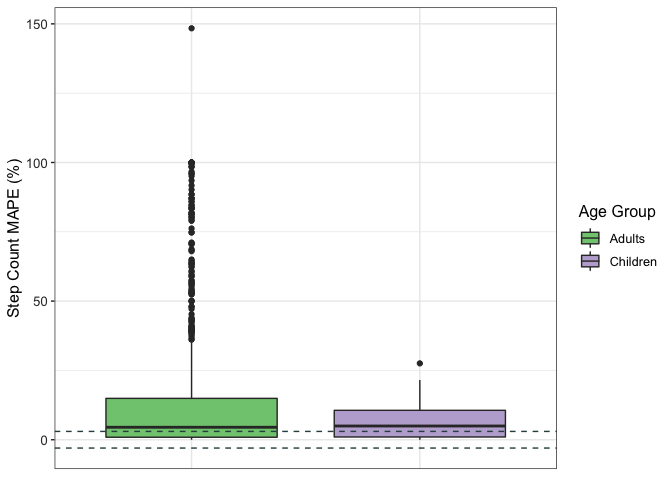
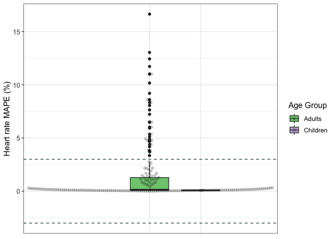
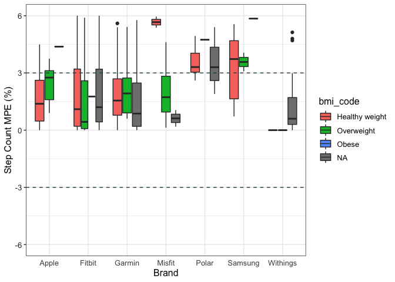

```r
df <- read_csv("wearable_review_data_validity.csv")
```

```
## Rows: 1672 Columns: 107
```

```
## ── Column specification ────────────────────────────────────────────────────────
## Delimiter: ","
## chr (62): Author, Substudy, Setting, Measured, Measure_Unit, Brand, Device, ...
## dbl (44): X1, Year, device_year, age_SD, weight_SD, height_SD, BMI_SD, actua...
## lgl  (1): n_15pctofcrit
```

```
## 
## ℹ Use `spec()` to retrieve the full column specification for this data.
## ℹ Specify the column types or set `show_col_types = FALSE` to quiet this message.
```


```r
summary(df$MPE)
```

```
##     Min.  1st Qu.   Median     Mean  3rd Qu.     Max.     NA's 
## -1.00000 -0.10583 -0.01450 -0.04315  0.01396  5.30000      294
```

## Data Cleaning 


```r
data <- df %>%
  select(Author, Year, Brand, device_name, device_year, location, Measured, Setting, Wear_Location, age, age_code, BMI, population_n, population_m, population_f, MPE)
str(data)
```

```
## tibble [1,672 × 16] (S3: tbl_df/tbl/data.frame)
##  $ Author       : chr [1:1672] "Dooley" "Dooley" "Dooley" "Boudreaux" ...
##  $ Year         : num [1:1672] 2017 2017 2017 2018 2018 ...
##  $ Brand        : chr [1:1672] "Apple" "Apple" "Apple" "Apple" ...
##  $ device_name  : chr [1:1672] "Apple Watch" "Apple Watch" "Apple Watch" "Apple Watch Series 2" ...
##  $ device_year  : num [1:1672] 2015 2015 2015 2016 2016 ...
##  $ location     : chr [1:1672] "TX, USA" "TX, USA" "TX, USA" "LA, USA" ...
##  $ Measured     : chr [1:1672] "HR" "HR" "HR" "HR" ...
##  $ Setting      : chr [1:1672] "Controlled" "Controlled" "Controlled" "Controlled" ...
##  $ Wear_Location: chr [1:1672] "Wrist" "Wrist" "Wrist" "Wrist" ...
##  $ age          : chr [1:1672] "22.55" "22.55" "22.55" "22.71" ...
##  $ age_code     : chr [1:1672] "A" "A" "A" "A" ...
##  $ BMI          : chr [1:1672] "24.6" "24.6" "24.6" "25.83" ...
##  $ population_n : chr [1:1672] "62" "62" "62" "50" ...
##  $ population_m : chr [1:1672] "26" "26" "26" "22" ...
##  $ population_f : chr [1:1672] "36" "36" "36" "28" ...
##  $ MPE          : num [1:1672] 0.00719 0.0011 -0.00533 NA NA ...
```


```r
data$age_code <- as.factor(data$age_code)
data$Brand <- as.factor(data$Brand)
data$Measured <- as.factor(data$Measured)
data$Setting <- as.factor(data$Setting)
data$Wear_Location <- as.factor(data$Wear_Location)
data$population_f <- as.numeric(data$population_f)
```

```
## Warning: NAs introduced by coercion
```

```r
data$population_m <- as.numeric(data$population_m)
```

```
## Warning: NAs introduced by coercion
```

```r
data$BMI <- as.numeric(data$BMI)
```

```
## Warning: NAs introduced by coercion
```

```r
data$age <- as.numeric(data$age)
```

```
## Warning: NAs introduced by coercion
```

```r
data$population_n <- as.numeric(data$population_n)
```

```
## Warning: NAs introduced by coercion
```

```r
str(data)
```

```
## tibble [1,672 × 16] (S3: tbl_df/tbl/data.frame)
##  $ Author       : chr [1:1672] "Dooley" "Dooley" "Dooley" "Boudreaux" ...
##  $ Year         : num [1:1672] 2017 2017 2017 2018 2018 ...
##  $ Brand        : Factor w/ 9 levels "Apple","Fitbit",..: 1 1 1 1 1 1 1 1 1 1 ...
##  $ device_name  : chr [1:1672] "Apple Watch" "Apple Watch" "Apple Watch" "Apple Watch Series 2" ...
##  $ device_year  : num [1:1672] 2015 2015 2015 2016 2016 ...
##  $ location     : chr [1:1672] "TX, USA" "TX, USA" "TX, USA" "LA, USA" ...
##  $ Measured     : Factor w/ 3 levels "EE","HR","SC": 2 2 2 2 2 2 3 3 3 3 ...
##  $ Setting      : Factor w/ 2 levels "Controlled","Free-Living": 1 1 1 1 1 1 1 1 1 1 ...
##  $ Wear_Location: Factor w/ 6 levels "LAF","Thigh",..: 6 6 6 6 6 6 6 6 6 6 ...
##  $ age          : num [1:1672] 22.6 22.6 22.6 22.7 22.7 ...
##  $ age_code     : Factor w/ 2 levels "A","C": 1 1 1 1 1 1 1 1 1 1 ...
##  $ BMI          : num [1:1672] 24.6 24.6 24.6 25.8 25.8 ...
##  $ population_n : num [1:1672] 62 62 62 50 50 50 31 31 31 31 ...
##  $ population_m : num [1:1672] 26 26 26 22 22 22 16 16 16 16 ...
##  $ population_f : num [1:1672] 36 36 36 28 28 28 15 15 15 15 ...
##  $ MPE          : num [1:1672] 0.00719 0.0011 -0.00533 NA NA ...
```

## Data Cleaning by Variable

### MPE (Outcome Variable)


```r
#convert to percentage
data <- data %>%
  mutate(mpe_percent = MPE*100)

summary(data)
```

```
##     Author               Year           Brand     device_name       
##  Length:1672        Min.   :2013   Fitbit  :961   Length:1672       
##  Class :character   1st Qu.:2016   Garmin  :282   Class :character  
##  Mode  :character   Median :2017   Withings:134   Mode  :character  
##                     Mean   :2017   Apple   :131                     
##                     3rd Qu.:2018   Polar   : 67                     
##                     Max.   :2019   Misfit  : 50                     
##                                    (Other) : 47                     
##   device_year     location         Measured         Setting    
##  Min.   :2008   Length:1672        EE: 334   Controlled :1561  
##  1st Qu.:2013   Class :character   HR: 271   Free-Living: 111  
##  Median :2014   Mode  :character   SC:1067                     
##  Mean   :2014                                                  
##  3rd Qu.:2015                                                  
##  Max.   :2016                                                  
##  NA's   :3                                                     
##    Wear_Location       age        age_code      BMI         population_n   
##  LAF      :  69   Min.   : 3.69   A:1644   Min.   :20.50   Min.   : 10.00  
##  Thigh    :   1   1st Qu.:23.60   C:  28   1st Qu.:23.40   1st Qu.: 19.00  
##  Torso    : 111   Median :30.80            Median :24.60   Median : 25.00  
##  Upper Arm:   6   Mean   :34.22            Mean   :24.55   Mean   : 29.38  
##  Waist/Hip: 389   3rd Qu.:35.80            3rd Qu.:25.83   3rd Qu.: 35.00  
##  Wrist    :1096   Max.   :87.00            Max.   :30.80   Max.   :185.00  
##                   NA's   :364              NA's   :767     NA's   :8       
##   population_m    population_f        MPE            mpe_percent      
##  Min.   : 0.00   Min.   : 0.00   Min.   :-1.00000   Min.   :-100.000  
##  1st Qu.: 8.00   1st Qu.: 9.50   1st Qu.:-0.10583   1st Qu.: -10.582  
##  Median :12.00   Median :12.00   Median :-0.01450   Median :  -1.450  
##  Mean   :14.98   Mean   :14.44   Mean   :-0.04315   Mean   :  -4.315  
##  3rd Qu.:19.00   3rd Qu.:18.00   3rd Qu.: 0.01396   3rd Qu.:   1.396  
##  Max.   :91.00   Max.   :96.00   Max.   : 5.30000   Max.   : 530.000  
##  NA's   :33      NA's   :33      NA's   :294        NA's   :294
```


```r
mpe_hist <- ggplot(data, aes(mpe_percent)) + 
                  geom_histogram(bins = 25) +
                  theme_classic()
plot(mpe_hist)
```

```
## Warning: Removed 294 rows containing non-finite values (stat_bin).
```

<!-- -->


```r
mpe_box <- ggplot(data, aes(mpe_percent)) + 
                geom_boxplot() +
                coord_flip() +
                theme_classic()
plot(mpe_box)
```

```
## Warning: Removed 294 rows containing non-finite values (stat_boxplot).
```

<!-- -->

### Removing missing data


```r
data <- data %>% drop_na(mpe_percent)
```

294 observations removed because of missing data on MPE.

### Outlier Analysis

#### Not Run

```{}
#creating a dataframe containing the extreme outliers
df_out <- data %>%
  identify_outliers("mpe_percent") %>%
        filter(is.outlier == TRUE)

#merging the outlier dataframe with our original data
total <- merge(data, df_out, all.x = TRUE)
#renaming those not outliers as FALSE instead of NA
total$is.outlier[is.na(total$is.outlier)] <- FALSE
table(total$is.outlier)

#subsetting the non-outliers in the data
df <- subset(total, is.outlier != TRUE)
```

### Outlier Analysis

#### Run


```r
data_no_outliers <- filter(data, mpe_percent < 200) #1672 before outlier removal
```

4 cases removed for having MPE percent greater than 300


```r
mpe_hist_clean <- ggplot(data_no_outliers, aes(mpe_percent)) + 
                  geom_histogram(bins = 30) +
                  theme_classic()
plot(mpe_hist_clean)
```

<!-- -->


```r
mpe_box_clean <- ggplot(data_no_outliers, aes(mpe_percent)) + 
                  geom_boxplot() +
                  coord_flip() +
                  theme_classic()

plot(mpe_box_clean)
```

<!-- -->

### AGE


```r
table(data_no_outliers$age_code)
```

```
## 
##    A    C 
## 1349   25
```

```r
levels(data_no_outliers$age_code) <- c("Adults", "Children", "Older Adults")
levels(data_no_outliers$age_code)
```

```
## [1] "Adults"       "Children"     "Older Adults"
```

### SEX


```r
data_no_outliers <- data_no_outliers %>%
        mutate(man_pre = population_m - population_f
        )

data_no_outliers <- data_no_outliers %>%
        mutate(sex = case_when(
                population_m > population_f ~ "Men",
                population_m < population_f ~ "Women"
        ))

data_no_outliers <- data_no_outliers %>%
        mutate(sex_10 = case_when(
                man_pre > -10 & man_pre < 10 ~ "Even",
                man_pre >= 10 ~ "Men",
                man_pre <= -10 ~ "Women"
        ))

table(data_no_outliers$sex_10)
```

```
## 
##  Even   Men Women 
##  1041   177   135
```

```r
data_no_outliers$sex_10 <- fct_relevel(data_no_outliers$sex_10, c("Women","Even","Men"))
```


```r
data_no_outliers$sex <- as.factor(data_no_outliers$sex)
data_no_outliers$sex_10 <- as.factor(data_no_outliers$sex_10)
```

### BMI


```r
data_no_outliers <- data_no_outliers %>%
        mutate(bmi_code = case_when(
                BMI >= 18.5 & BMI <= 24.9 ~ "Healthy weight",
                BMI > 24.9 & BMI <= 29.9 ~ "Overweight",
                BMI > 29.9 ~ "Obese"
        ))

table(data_no_outliers$BMI, data_no_outliers$bmi_code)
```

```
##        
##         Healthy weight Obese Overweight
##   20.5               1     0          0
##   20.9              12     0          0
##   21.4              12     0          0
##   21.5              35     0          0
##   21.6               1     0          0
##   22.14              4     0          0
##   22.25              3     0          0
##   22.35              3     0          0
##   22.4               1     0          0
##   22.5              30     0          0
##   22.6              37     0          0
##   22.7              15     0          0
##   22.84             10     0          0
##   22.9               2     0          0
##   23                 7     0          0
##   23.2              16     0          0
##   23.22              2     0          0
##   23.25              2     0          0
##   23.4              24     0          0
##   23.5              13     0          0
##   23.6              15     0          0
##   23.66              1     0          0
##   23.7               9     0          0
##   23.8               3     0          0
##   23.86              1     0          0
##   23.9              15     0          0
##   23.95              1     0          0
##   24                 6     0          0
##   24.05              2     0          0
##   24.09              1     0          0
##   24.2              24     0          0
##   24.3               8     0          0
##   24.41              2     0          0
##   24.6              42     0          0
##   24.62              2     0          0
##   24.7              24     0          0
##   24.9              44     0          0
##   25                 0     0          6
##   25.05              0     0          8
##   25.1               0     0         20
##   25.3               0     0          2
##   25.6               0     0         35
##   25.7               0     0         15
##   25.81              0     0          3
##   25.83              0     0         10
##   25.9               0     0          1
##   26                 0     0         40
##   26.1               0     0         54
##   26.3               0     0         15
##   26.4               0     0          8
##   26.6               0     0          4
##   26.7               0     0          2
##   27                 0     0         16
##   27.4               0     0          8
##   27.7               0     0          2
##   27.9               0     0          1
##   28                 0     0         14
##   28.1               0     0          4
##   28.3               0     0          4
##   28.9               0     0          1
##   29                 0     0          2
##   29.9               0     0          1
##   30                 0     2          0
##   30.8               0     1          0
```

### Wear Location


```r
table(data_no_outliers$Wear_Location)
```

```
## 
##       LAF     Thigh     Torso Upper Arm Waist/Hip     Wrist 
##        66         1        97         6       340       864
```

```r
data_no_outliers <- data_no_outliers %>%
        mutate(wear_loc = case_when(
                Wear_Location == "Wrist" ~ "Wrist",
                Wear_Location == "Waist/Hip" ~ "Hip",
                Wear_Location == "LAF" ~ "Other",
                Wear_Location == "Thigh" ~ "Other",
                Wear_Location == "Torso" ~ "Other",
                Wear_Location == "Upper Arm" ~ "Other"
        ))

table(data_no_outliers$Wear_Location, data_no_outliers$wear_loc)
```

```
##            
##             Hip Other Wrist
##   LAF         0    66     0
##   Thigh       0     1     0
##   Torso       0    97     0
##   Upper Arm   0     6     0
##   Waist/Hip 340     0     0
##   Wrist       0     0   864
```


```r
data_no_outliers$bmi_code <- as.factor(data_no_outliers$bmi_code)
data_no_outliers$bmi_code <- fct_relevel(data_no_outliers$bmi_code, c("Healthy weight","Overweight","Obese"))
```

## MPE for Step count, heart rate & energy expenditure across different groups


```r
#AGE GROUP
data_no_outliers %>%
    group_by(age_code, Measured) %>%
    get_summary_stats(mpe_percent, type = "mean_sd") %>%
    arrange(Measured)
```

<div class="kable-table">

|Measured |age_code |variable    |   n|   mean|     sd|
|:--------|:--------|:-----------|---:|------:|------:|
|EE       |Adults   |mpe_percent | 321|  0.120| 36.971|
|HR       |Adults   |mpe_percent | 176| -0.857|  5.917|
|HR       |Children |mpe_percent |   2|  1.500|  1.980|
|SC       |Adults   |mpe_percent | 852| -8.341| 26.263|
|SC       |Children |mpe_percent |  23|  1.469| 10.671|

</div>


```r
#SEX GROUP
data_no_outliers %>%
    group_by(sex, Measured) %>%
    get_summary_stats(mpe_percent, type = "mean_sd") %>%
    arrange(Measured)
```

<div class="kable-table">

|Measured |sex   |variable    |   n|    mean|     sd|
|:--------|:-----|:-----------|---:|-------:|------:|
|EE       |Men   |mpe_percent | 143|  -5.304| 38.708|
|EE       |Women |mpe_percent |  88|   6.698| 40.365|
|EE       |NA    |mpe_percent |  90|   2.307| 28.920|
|HR       |Men   |mpe_percent |  84|  -0.463|  4.633|
|HR       |Women |mpe_percent |  73|  -0.103|  7.108|
|HR       |NA    |mpe_percent |  21|  -4.834|  4.096|
|SC       |Men   |mpe_percent | 312|  -5.720| 27.724|
|SC       |Women |mpe_percent | 317| -13.192| 30.258|
|SC       |NA    |mpe_percent | 246|  -4.498| 14.298|

</div>


```r
#BMI GROUP
data_no_outliers %>%
    group_by(bmi_code, Measured) %>%
    get_summary_stats(mpe_percent, type = "mean_sd") %>%
    arrange(Measured)
```

<div class="kable-table">

|Measured |bmi_code       |variable    |   n|    mean|     sd|
|:--------|:--------------|:-----------|---:|-------:|------:|
|EE       |Healthy weight |mpe_percent | 137|  -3.546| 43.451|
|EE       |Overweight     |mpe_percent |  56|   7.204| 34.208|
|EE       |NA             |mpe_percent | 128|   0.945| 29.635|
|HR       |Healthy weight |mpe_percent |  64|  -2.338|  8.153|
|HR       |Overweight     |mpe_percent |  28|   0.997|  4.935|
|HR       |NA             |mpe_percent |  86|  -0.305|  3.488|
|SC       |Healthy weight |mpe_percent | 229|   2.230| 17.706|
|SC       |Overweight     |mpe_percent | 192| -11.427| 22.617|
|SC       |Obese          |mpe_percent |   3|   3.921| 34.051|
|SC       |NA             |mpe_percent | 451| -11.976| 29.301|

</div>


```r
#number of studies for each population and measures
data_no_outliers <- data_no_outliers %>%
  group_by(Measured, bmi_code, sex, age_code) %>%
      mutate(n_studies = n())
```

## Brand


```r
# Filtering out brands with less than 10 comparisons
table(data_no_outliers$Brand)
```

```
## 
##    Apple   Fitbit   Garmin      Mio   Misfit    Polar  Samsung Withings 
##       99      810      233       15       37       45       16      114 
##   Xiaomi 
##        5
```

```r
data_no_outliers <- filter(data_no_outliers, Brand != "Mio" & Brand != "Xiaomi")
```


```r
data_no_outliers %>%
    group_by(Brand, bmi_code, Measured) %>%
    get_summary_stats(mpe_percent, type = "mean_sd") %>%
    arrange(Brand, Measured)
```

<div class="kable-table">

|Brand    |Measured |bmi_code       |variable    |   n|    mean|     sd|
|:--------|:--------|:--------------|:-----------|---:|-------:|------:|
|Apple    |EE       |Healthy weight |mpe_percent |  20|  21.035| 54.081|
|Apple    |EE       |Overweight     |mpe_percent |   9|  36.471| 40.108|
|Apple    |EE       |NA             |mpe_percent |   1| -41.770|     NA|
|Apple    |HR       |Healthy weight |mpe_percent |  11|  -2.651|  2.361|
|Apple    |HR       |Overweight     |mpe_percent |  15|   3.795|  4.298|
|Apple    |HR       |NA             |mpe_percent |  23|  -0.513|  1.389|
|Apple    |SC       |Healthy weight |mpe_percent |  10|  15.513| 46.740|
|Apple    |SC       |Overweight     |mpe_percent |   8|  -0.799|  2.693|
|Apple    |SC       |NA             |mpe_percent |   2|  -6.140|  2.489|
|Fitbit   |EE       |Healthy weight |mpe_percent |  53|  -2.171| 28.496|
|Fitbit   |EE       |Overweight     |mpe_percent |  33|   1.773| 23.812|
|Fitbit   |EE       |NA             |mpe_percent |  77|   7.526| 30.825|
|Fitbit   |HR       |Healthy weight |mpe_percent |  22|  -3.578|  6.209|
|Fitbit   |HR       |Overweight     |mpe_percent |  13|  -2.231|  3.488|
|Fitbit   |HR       |NA             |mpe_percent |  37|  -0.454|  4.656|
|Fitbit   |SC       |Healthy weight |mpe_percent | 137|   2.059| 16.915|
|Fitbit   |SC       |Overweight     |mpe_percent | 150| -12.147| 23.923|
|Fitbit   |SC       |Obese          |mpe_percent |   3|   3.921| 34.051|
|Fitbit   |SC       |NA             |mpe_percent | 285|  -8.771| 28.936|
|Garmin   |EE       |Healthy weight |mpe_percent |  26|   1.921| 56.632|
|Garmin   |EE       |Overweight     |mpe_percent |   9| -16.366| 41.209|
|Garmin   |EE       |NA             |mpe_percent |  17| -18.825| 14.364|
|Garmin   |HR       |Healthy weight |mpe_percent |  31|  -1.347| 10.420|
|Garmin   |HR       |NA             |mpe_percent |  16|   0.152|  2.350|
|Garmin   |SC       |Healthy weight |mpe_percent |  38|  -1.863|  8.892|
|Garmin   |SC       |Overweight     |mpe_percent |  18| -16.013| 23.980|
|Garmin   |SC       |NA             |mpe_percent |  78| -10.173| 22.464|
|Misfit   |EE       |Healthy weight |mpe_percent |   3|   3.095| 48.652|
|Misfit   |EE       |Overweight     |mpe_percent |   2|  41.712| 37.161|
|Misfit   |EE       |NA             |mpe_percent |   3|  -6.584| 11.418|
|Misfit   |SC       |Healthy weight |mpe_percent |   7|   7.391|  8.567|
|Misfit   |SC       |Overweight     |mpe_percent |   7|  -5.910|  7.399|
|Misfit   |SC       |NA             |mpe_percent |  15| -37.353| 22.622|
|Polar    |EE       |Healthy weight |mpe_percent |   2|  18.048| 67.446|
|Polar    |EE       |Overweight     |mpe_percent |   3|  26.853| 24.065|
|Polar    |EE       |NA             |mpe_percent |  11|  15.009| 33.282|
|Polar    |SC       |Healthy weight |mpe_percent |  14|  11.649| 16.884|
|Polar    |SC       |Overweight     |mpe_percent |   3|  -9.570|  4.328|
|Polar    |SC       |NA             |mpe_percent |  12|  -3.980| 15.605|
|Samsung  |EE       |NA             |mpe_percent |   1|  -9.130|     NA|
|Samsung  |HR       |NA             |mpe_percent |   1|  -6.480|     NA|
|Samsung  |SC       |Healthy weight |mpe_percent |  11|  -0.186|  4.484|
|Samsung  |SC       |Overweight     |mpe_percent |   2|  -3.575|  0.686|
|Samsung  |SC       |NA             |mpe_percent |   1|  -5.850|     NA|
|Withings |EE       |Healthy weight |mpe_percent |  33| -26.872| 34.244|
|Withings |EE       |NA             |mpe_percent |  17| -11.614| 20.027|
|Withings |SC       |Healthy weight |mpe_percent |   7|   0.000|  0.000|
|Withings |SC       |Overweight     |mpe_percent |   4|   0.000|  0.000|
|Withings |SC       |NA             |mpe_percent |  53| -27.950| 37.185|

</div>


```r
data_no_outliers %>%
    group_by(Brand, age_code, Measured) %>%
    get_summary_stats(mpe_percent, type = "mean_sd") %>%
    arrange(Brand, Measured)
```

<div class="kable-table">

|Brand    |Measured |age_code |variable    |   n|    mean|     sd|
|:--------|:--------|:--------|:-----------|---:|-------:|------:|
|Apple    |EE       |Adults   |mpe_percent |  30|  23.572| 50.629|
|Apple    |HR       |Adults   |mpe_percent |  49|   0.326|  3.683|
|Apple    |SC       |Adults   |mpe_percent |  20|   6.823| 33.462|
|Fitbit   |EE       |Adults   |mpe_percent | 163|   3.208| 28.934|
|Fitbit   |HR       |Adults   |mpe_percent |  70|  -1.822|  5.177|
|Fitbit   |HR       |Children |mpe_percent |   2|   1.500|  1.980|
|Fitbit   |SC       |Adults   |mpe_percent | 554|  -7.348| 26.095|
|Fitbit   |SC       |Children |mpe_percent |  21|   2.030| 11.019|
|Garmin   |EE       |Adults   |mpe_percent |  52|  -8.026| 44.775|
|Garmin   |HR       |Adults   |mpe_percent |  47|  -0.837|  8.551|
|Garmin   |SC       |Adults   |mpe_percent | 132|  -8.664| 20.383|
|Garmin   |SC       |Children |mpe_percent |   2|  -4.425|  0.746|
|Misfit   |EE       |Adults   |mpe_percent |   8|   9.120| 36.545|
|Misfit   |SC       |Adults   |mpe_percent |  29| -18.963| 26.091|
|Polar    |EE       |Adults   |mpe_percent |  16|  17.610| 33.779|
|Polar    |SC       |Adults   |mpe_percent |  29|   2.987| 17.452|
|Samsung  |EE       |Adults   |mpe_percent |   1|  -9.130|     NA|
|Samsung  |HR       |Adults   |mpe_percent |   1|  -6.480|     NA|
|Samsung  |SC       |Adults   |mpe_percent |  14|  -1.074|  4.346|
|Withings |EE       |Adults   |mpe_percent |  50| -21.684| 30.823|
|Withings |SC       |Adults   |mpe_percent |  64| -23.146| 35.416|

</div>


```r
data_no_outliers %>%
    group_by(Brand, sex, Measured) %>%
    get_summary_stats(mpe_percent, type = "mean_sd") %>%
    arrange(Brand, Measured)
```

<div class="kable-table">

|Brand    |Measured |sex   |variable    |   n|    mean|     sd|
|:--------|:--------|:-----|:-----------|---:|-------:|------:|
|Apple    |EE       |Men   |mpe_percent |  14|  31.005| 46.002|
|Apple    |EE       |Women |mpe_percent |   7|  51.194| 65.339|
|Apple    |EE       |NA    |mpe_percent |   9|  -9.473| 25.662|
|Apple    |HR       |Men   |mpe_percent |  35|   1.227|  3.656|
|Apple    |HR       |Women |mpe_percent |   8|  -0.662|  2.792|
|Apple    |HR       |NA    |mpe_percent |   6|  -3.615|  1.594|
|Apple    |SC       |Men   |mpe_percent |  13|  12.334| 40.927|
|Apple    |SC       |Women |mpe_percent |   3|  -1.610|  2.787|
|Apple    |SC       |NA    |mpe_percent |   4|  -4.764|  2.163|
|Fitbit   |EE       |Men   |mpe_percent |  50|  11.218| 32.309|
|Fitbit   |EE       |Women |mpe_percent |  56|  -3.108| 24.566|
|Fitbit   |EE       |NA    |mpe_percent |  57|   2.387| 28.598|
|Fitbit   |HR       |Men   |mpe_percent |  32|  -1.603|  3.869|
|Fitbit   |HR       |Women |mpe_percent |  31|   0.011|  5.423|
|Fitbit   |HR       |NA    |mpe_percent |   9|  -8.175|  2.738|
|Fitbit   |SC       |Men   |mpe_percent | 220|  -8.611| 29.962|
|Fitbit   |SC       |Women |mpe_percent | 193|  -6.439| 27.080|
|Fitbit   |SC       |NA    |mpe_percent | 162|  -5.500| 16.223|
|Garmin   |EE       |Men   |mpe_percent |  37| -23.751| 25.885|
|Garmin   |EE       |Women |mpe_percent |  15|  30.761| 57.575|
|Garmin   |HR       |Men   |mpe_percent |   9|  -4.575|  7.867|
|Garmin   |HR       |Women |mpe_percent |  34|  -0.075|  9.043|
|Garmin   |HR       |NA    |mpe_percent |   4|   1.100|  1.780|
|Garmin   |SC       |Men   |mpe_percent |  36|  -3.647| 14.114|
|Garmin   |SC       |Women |mpe_percent |  46| -18.391| 28.905|
|Garmin   |SC       |NA    |mpe_percent |  52|  -3.370|  7.895|
|Misfit   |EE       |Men   |mpe_percent |   4|  19.318| 51.292|
|Misfit   |EE       |Women |mpe_percent |   3|  -6.584| 11.418|
|Misfit   |EE       |NA    |mpe_percent |   1|  15.435|     NA|
|Misfit   |SC       |Men   |mpe_percent |  14|   0.740| 10.333|
|Misfit   |SC       |Women |mpe_percent |  15| -37.353| 22.622|
|Polar    |EE       |Men   |mpe_percent |   5| -13.040| 21.158|
|Polar    |EE       |Women |mpe_percent |   2|  39.447| 14.377|
|Polar    |EE       |NA    |mpe_percent |   9|  29.785| 31.885|
|Polar    |SC       |Men   |mpe_percent |  19|   3.752| 16.575|
|Polar    |SC       |NA    |mpe_percent |  10|   1.533| 19.862|
|Samsung  |EE       |NA    |mpe_percent |   1|  -9.130|     NA|
|Samsung  |HR       |NA    |mpe_percent |   1|  -6.480|     NA|
|Samsung  |SC       |Men   |mpe_percent |  10|  -0.084|  4.714|
|Samsung  |SC       |Women |mpe_percent |   3|  -2.783|  1.454|
|Samsung  |SC       |NA    |mpe_percent |   1|  -5.850|     NA|
|Withings |EE       |Men   |mpe_percent |  33| -26.872| 34.244|
|Withings |EE       |Women |mpe_percent |   5| -23.087| 16.072|
|Withings |EE       |NA    |mpe_percent |  12|  -6.833| 20.117|
|Withings |SC       |Women |mpe_percent |  52| -27.906| 37.705|
|Withings |SC       |NA    |mpe_percent |  12|  -2.517|  4.578|

</div>

## PLOTS BY Measures

### Filtering the data by Measured


```r
val_data_sc <- filter(data_no_outliers, Measured == "SC") 
val_data_hr <- filter(data_no_outliers, Measured == "HR")
val_data_ee <- filter(data_no_outliers, Measured == "EE")
```


### Validity of Step count by Age

* Dashed grey lines indicate ± 3% measurement error


```r
#options(repr.plot.width = 25, repr.plot.height = 8)
age_sc_plot <- ggplot(data=subset(val_data_sc, !is.na(age_code)), aes(x = age_code, y = mpe_percent, fill = age_code)) +
                    geom_boxplot(na.rm = TRUE) +
                    #geom_beeswarm(alpha = 0.2, dodge.width=0.2, cex=2, na.rm = TRUE) +  
                    geom_hline(yintercept = 3, size = 0.5, colour = "darkslategray", linetype = "dashed") + 
                    geom_hline(yintercept = -3, size = 0.5, colour = "darkslategray", linetype = "dashed") +   
                    ylab("Step Count ME (%)") +
                    scale_fill_brewer(palette="Accent") +
                    theme_bw() +
                    labs(fill = "Age Group") +
                    theme(axis.text.x = element_blank(),
                          axis.title.x = element_blank(),
                          axis.ticks.x = element_blank(),
                        axis.text.y = element_text(colour = "grey20", size = 10),
                        strip.text = element_text(face = "italic"),
                        text = element_text(size = 12)) 
plot(age_sc_plot)
```

<!-- -->

### Validity of step count by Sex


```r
sex_sc_plot <- ggplot(data=subset(val_data_sc, !is.na(sex)), aes(x = sex, y = mpe_percent, fill = sex)) +
                    geom_boxplot(na.rm = TRUE) +
                    #geom_beeswarm(alpha = 0.2, dodge.width=0.2, cex=2, na.rm = TRUE) +  
                    geom_hline(yintercept = 3, size = 0.5, colour = "darkslategray", linetype = "dashed") + 
                    geom_hline(yintercept = -3, size = 0.5, colour = "darkslategray", linetype = "dashed") +   
                    ylab("Step Count ME (%)") +
                    scale_fill_brewer(palette="Dark2") +
                    theme_bw() +
                    labs(fill = "Gender") +
                    theme(axis.text.x = element_blank(),
                          axis.title.x = element_blank(),
                          axis.ticks.x = element_blank(),
                        axis.text.y = element_text(colour = "grey20", size = 10),
                        strip.text = element_text(face = "italic"),
                        text = element_text(size = 12)) 
plot(sex_sc_plot)
```

<!-- -->

### Validity of step count by BMI


```r
bmi_sc_plot <- ggplot(data=subset(val_data_sc, !is.na(bmi_code)), aes(x = bmi_code, y = mpe_percent, fill = bmi_code)) +
                    geom_boxplot(na.rm = TRUE) +                    
                    #geom_beeswarm(alpha = 0.2, dodge.width=0.2, cex=2, na.rm = TRUE) +  
                    geom_hline(yintercept = 3, size = 0.5, colour = "darkslategray", linetype = "dashed") + 
                    geom_hline(yintercept = -3, size = 0.5, colour = "darkslategray", linetype = "dashed") +   
                    ylab("Step Count ME (%)") +
                    scale_fill_brewer(palette="Set1") +
                    theme_bw() +
                    labs(fill = "BMI Category") +
                    theme(axis.text.x = element_blank(),
                          axis.title.x = element_blank(),
                          axis.ticks.x = element_blank(),
                        axis.text.y = element_text(colour = "grey20", size = 10),
                        strip.text = element_text(face = "italic"),
                        text = element_text(size = 12)) 
plot(bmi_sc_plot)
```

<!-- -->

### Validity of Heart rate by Age

* Dashed grey lines indicate ± 3% measurement error


```r
age_hr_plot <- ggplot(data=subset(val_data_hr, !is.na(age_code)), aes(x = age_code, y = mpe_percent, fill = age_code)) +
                    geom_boxplot(na.rm = TRUE) + 
                    geom_beeswarm(alpha = 0.2, dodge.width=0.2, cex=2, na.rm = TRUE) +  
                    geom_hline(yintercept = 3, size = 0.5, colour = "darkslategray", linetype = "dashed") + 
                    geom_hline(yintercept = -3, size = 0.5, colour = "darkslategray", linetype = "dashed") +   
                    ylab("Heart rate ME (%)") +
                    scale_fill_brewer(palette="Accent") +
                    theme_bw() +
                    labs(fill = "Age Group") +
                    theme(axis.text.x = element_blank(),
                          axis.title.x = element_blank(),
                          axis.ticks.x = element_blank(),
                        axis.text.y = element_text(colour = "grey20", size = 10),
                        strip.text = element_text(face = "italic"),
                        text = element_text(size = 12)) 
plot(age_hr_plot)
```

<!-- -->

### Validity of heart rate by sex


```r
sex_hr_plot <- ggplot(data=subset(val_data_hr, !is.na(sex)), aes(x = sex, y = mpe_percent, fill = sex)) +
                    geom_boxplot(na.rm = TRUE) + 
                    geom_beeswarm(alpha = 0.2, dodge.width=0.2, cex=2, na.rm = TRUE) +  
                    geom_hline(yintercept = 3, size = 0.5, colour = "darkslategray", linetype = "dashed") + 
                    geom_hline(yintercept = -3, size = 0.5, colour = "darkslategray", linetype = "dashed") +   
                    ylab("Heart rate ME (%)") +
                    scale_fill_brewer(palette="Dark2") +
                    theme_bw() +
                    labs(fill = "Gender") +
                    theme(axis.text.x = element_blank(),
                          axis.title.x = element_blank(),
                          axis.ticks.x = element_blank(),
                        axis.text.y = element_text(colour = "grey20", size = 10),
                        strip.text = element_text(face = "italic"),
                        text = element_text(size = 12)) 
plot(sex_hr_plot)
```

<!-- -->

### Validity of heart rate by BMI


```r
bmi_hr_plot <- ggplot(data=subset(val_data_hr, !is.na(bmi_code)), aes(x = bmi_code, y = mpe_percent, fill = bmi_code)) +
                    geom_boxplot(na.rm = TRUE) + 
                    geom_beeswarm(alpha = 0.2, dodge.width=0.2, cex=2, na.rm = TRUE) +  
                    geom_hline(yintercept = 3, size = 0.5, colour = "darkslategray", linetype = "dashed") + 
                    geom_hline(yintercept = -3, size = 0.5, colour = "darkslategray", linetype = "dashed") +   
                    ylab("Heart rate ME (%)") +
                    scale_fill_brewer(palette="Set1") +
                    theme_bw() +
                    labs(fill = "BMI Category") +
                    theme(axis.text.x = element_blank(),
                          axis.title.x = element_blank(),
                          axis.ticks.x = element_blank(),
                        axis.text.y = element_text(colour = "grey20", size = 10),
                        strip.text = element_text(face = "italic"),
                        text = element_text(size = 12)) 
plot(bmi_hr_plot)
```

<!-- -->

### Validity of Energy expenditure by Age

* Dashed grey lines indicate ± 3% measurement error


```r
age_ee_plot <- ggplot(data=subset(val_data_ee, !is.na(age_code)), aes(x = age_code, y = mpe_percent, fill = age_code)) +
                    geom_boxplot(na.rm = TRUE) + 
                    geom_beeswarm(alpha = 0.2, dodge.width=0.2, cex=2, na.rm = TRUE) +  
                    geom_hline(yintercept = 3, size = 0.5, colour = "darkslategray", linetype = "dashed") + 
                    geom_hline(yintercept = -3, size = 0.5, colour = "darkslategray", linetype = "dashed") +   
                    ylab("Energy expenditure ME (%)") +
                    scale_fill_brewer(palette="Accent") +
                    theme_bw() +
                    labs(fill = "Age Group") +
                    theme(axis.text.x = element_blank(),
                          axis.title.x = element_blank(),
                          axis.ticks.x = element_blank(),
                        axis.text.y = element_text(colour = "grey20", size = 10),
                        strip.text = element_text(face = "italic"),
                        text = element_text(size = 12)) 
plot(age_ee_plot)
```

<!-- -->

### Validity of energy expenditure by sex


```r
sex_ee_plot <- ggplot(data=subset(val_data_ee, !is.na(sex)), aes(x = sex, y = mpe_percent, fill = sex)) +
                    geom_boxplot(na.rm = TRUE) +
                    geom_beeswarm(alpha = 0.2, dodge.width=0.2, cex=2, na.rm = TRUE) +  
                    geom_hline(yintercept = 3, size = 0.5, colour = "darkslategray", linetype = "dashed") + 
                    geom_hline(yintercept = -3, size = 0.5, colour = "darkslategray", linetype = "dashed") +   
                    ylab("Energy expenditure ME (%)") +
                    scale_fill_brewer(palette="Dark2") +
                    theme_bw() +
                    labs(fill = "Gender") +
                    theme(axis.text.x = element_blank(),
                          axis.title.x = element_blank(),
                          axis.ticks.x = element_blank(),
                        axis.text.y = element_text(colour = "grey20", size = 10),
                        strip.text = element_text(face = "italic"),
                        text = element_text(size = 12))
plot(sex_ee_plot)
```

<!-- -->

### Validity of energy expenditure by BMI


```r
bmi_ee_plot <- ggplot(data=subset(val_data_ee, !is.na(bmi_code)), aes(x = bmi_code, y = mpe_percent, fill = bmi_code)) +
                    geom_boxplot(na.rm = TRUE) +   
                    geom_beeswarm(alpha = 0.2, dodge.width=0.2, cex=2, na.rm = TRUE) +  
                    geom_vline(xintercept = 3, size = 0.5, colour = "darkslategray", linetype = "dashed") + 
                    geom_vline(xintercept = -3, size = 0.5, colour = "darkslategray", linetype = "dashed") +   
                    ylab("Energy Expenditure ME (%)") +
                    scale_fill_brewer(palette="Set1") +
                    theme_bw() +
                    labs(fill = "BMI Category") +
                    theme(axis.text.x = element_blank(),
                          axis.title.x = element_blank(),
                          axis.ticks.x = element_blank(),
                        axis.text.y = element_text(colour = "grey20", size = 10),
                        strip.text = element_text(face = "italic"),
                        text = element_text(size = 12))
plot(bmi_ee_plot)
```

<!-- -->


```r
figure1 <- cowplot::plot_grid(age_sc_plot, sex_sc_plot, bmi_sc_plot, age_ee_plot, sex_ee_plot, bmi_ee_plot, age_hr_plot, sex_hr_plot, bmi_hr_plot, labels = c("A1","A2","A3","B1","B2","B3","C1","C2","C3"),label_size = 12)
```


```r
ggsave("figure1.png", plot = figure1, width = 16, height = 10)
```

## Regression Analysis

### Create a unique column for each study 


```r
val_data_sc$study_n <- str_c(val_data_sc$Author,"_", val_data_sc$Year, "_", val_data_sc$Brand)
val_data_hr$study_n <- str_c(val_data_hr$Author,"_", val_data_hr$Year, "_", val_data_hr$Brand)
val_data_ee$study_n <- str_c(val_data_ee$Author,"_", val_data_ee$Year, "_", val_data_ee$Brand)
```

## Step Count Models

### Step Count validity by Age


```r
sc_age_lm <- lm(mpe_percent ~ age_code + wear_loc, data = val_data_sc)
summary(sc_age_lm)
```

```
## 
## Call:
## lm(formula = mpe_percent ~ age_code + wear_loc, data = val_data_sc)
## 
## Residuals:
##     Min      1Q  Median      3Q     Max 
## -92.145  -2.415   6.641   9.231 156.185 
## 
## Coefficients:
##                  Estimate Std. Error t value Pr(>|t|)    
## (Intercept)       -9.2307     1.6550  -5.577 3.27e-08 ***
## age_codeChildren  10.3966     5.5934   1.859   0.0634 .  
## wear_locOther      0.5934     2.6752   0.222   0.8245    
## wear_locWrist      1.4462     2.0552   0.704   0.4818    
## ---
## Signif. codes:  0 '***' 0.001 '**' 0.01 '*' 0.05 '.' 0.1 ' ' 1
## 
## Residual standard error: 26.14 on 861 degrees of freedom
## Multiple R-squared:  0.004256,	Adjusted R-squared:  0.0007867 
## F-statistic: 1.227 on 3 and 861 DF,  p-value: 0.2988
```

```r
aov(sc_age_lm)
```

```
## Call:
##    aov(formula = sc_age_lm)
## 
## Terms:
##                 age_code wear_loc Residuals
## Sum of Squares    2162.2    352.0  588190.5
## Deg. of Freedom        1        2       861
## 
## Residual standard error: 26.1371
## Estimated effects may be unbalanced
```

```r
sc_age_lmer <- lmer(mpe_percent ~ age_code + wear_loc + (1 | study_n), data = val_data_sc)
summary(sc_age_lmer)
```

```
## Linear mixed model fit by REML ['lmerMod']
## Formula: mpe_percent ~ age_code + wear_loc + (1 | study_n)
##    Data: val_data_sc
## 
## REML criterion at convergence: 7963.4
## 
## Scaled residuals: 
##     Min      1Q  Median      3Q     Max 
## -3.8493 -0.1319  0.0781  0.3072  5.4304 
## 
## Random effects:
##  Groups   Name        Variance Std.Dev.
##  study_n  (Intercept) 165.7    12.87   
##  Residual             514.4    22.68   
## Number of obs: 865, groups:  study_n, 149
## 
## Fixed effects:
##                  Estimate Std. Error t value
## (Intercept)        -7.660      2.233  -3.431
## age_codeChildren    9.218      7.310   1.261
## wear_locOther       7.322      2.841   2.577
## wear_locWrist       1.588      2.495   0.636
## 
## Correlation of Fixed Effects:
##             (Intr) ag_cdC wr_lcO
## ag_cdChldrn -0.231              
## wear_lcOthr -0.328  0.032       
## wear_lcWrst -0.731  0.130  0.275
```

```r
multilevelR2(sc_age_lmer)
```

```
##         RB1         RB2          SB         MVP 
##  0.01209343 -0.06324330 -0.00525795  0.01149898
```

```r
tab_model(sc_age_lm, sc_age_lmer)
```

<table style="border-collapse:collapse; border:none;">
<tr>
<th style="border-top: double; text-align:center; font-style:normal; font-weight:bold; padding:0.2cm;  text-align:left; ">&nbsp;</th>
<th colspan="3" style="border-top: double; text-align:center; font-style:normal; font-weight:bold; padding:0.2cm; ">mpe percent</th>
<th colspan="3" style="border-top: double; text-align:center; font-style:normal; font-weight:bold; padding:0.2cm; ">mpe percent</th>
</tr>
<tr>
<td style=" text-align:center; border-bottom:1px solid; font-style:italic; font-weight:normal;  text-align:left; ">Predictors</td>
<td style=" text-align:center; border-bottom:1px solid; font-style:italic; font-weight:normal;  ">Estimates</td>
<td style=" text-align:center; border-bottom:1px solid; font-style:italic; font-weight:normal;  ">CI</td>
<td style=" text-align:center; border-bottom:1px solid; font-style:italic; font-weight:normal;  ">p</td>
<td style=" text-align:center; border-bottom:1px solid; font-style:italic; font-weight:normal;  ">Estimates</td>
<td style=" text-align:center; border-bottom:1px solid; font-style:italic; font-weight:normal;  ">CI</td>
<td style=" text-align:center; border-bottom:1px solid; font-style:italic; font-weight:normal;  col7">p</td>
</tr>
<tr>
<td style=" padding:0.2cm; text-align:left; vertical-align:top; text-align:left; ">(Intercept)</td>
<td style=" padding:0.2cm; text-align:left; vertical-align:top; text-align:center;  ">&#45;9.23</td>
<td style=" padding:0.2cm; text-align:left; vertical-align:top; text-align:center;  ">&#45;12.48&nbsp;&ndash;&nbsp;-5.98</td>
<td style=" padding:0.2cm; text-align:left; vertical-align:top; text-align:center;  "><strong>&lt;0.001</strong></td>
<td style=" padding:0.2cm; text-align:left; vertical-align:top; text-align:center;  ">&#45;7.66</td>
<td style=" padding:0.2cm; text-align:left; vertical-align:top; text-align:center;  ">&#45;12.04&nbsp;&ndash;&nbsp;-3.28</td>
<td style=" padding:0.2cm; text-align:left; vertical-align:top; text-align:center;  col7"><strong>0.001</strong></td>
</tr>
<tr>
<td style=" padding:0.2cm; text-align:left; vertical-align:top; text-align:left; ">age code [Children]</td>
<td style=" padding:0.2cm; text-align:left; vertical-align:top; text-align:center;  ">10.40</td>
<td style=" padding:0.2cm; text-align:left; vertical-align:top; text-align:center;  ">&#45;0.58&nbsp;&ndash;&nbsp;21.37</td>
<td style=" padding:0.2cm; text-align:left; vertical-align:top; text-align:center;  ">0.063</td>
<td style=" padding:0.2cm; text-align:left; vertical-align:top; text-align:center;  ">9.22</td>
<td style=" padding:0.2cm; text-align:left; vertical-align:top; text-align:center;  ">&#45;5.13&nbsp;&ndash;&nbsp;23.57</td>
<td style=" padding:0.2cm; text-align:left; vertical-align:top; text-align:center;  col7">0.208</td>
</tr>
<tr>
<td style=" padding:0.2cm; text-align:left; vertical-align:top; text-align:left; ">wear loc [Other]</td>
<td style=" padding:0.2cm; text-align:left; vertical-align:top; text-align:center;  ">0.59</td>
<td style=" padding:0.2cm; text-align:left; vertical-align:top; text-align:center;  ">&#45;4.66&nbsp;&ndash;&nbsp;5.84</td>
<td style=" padding:0.2cm; text-align:left; vertical-align:top; text-align:center;  ">0.825</td>
<td style=" padding:0.2cm; text-align:left; vertical-align:top; text-align:center;  ">7.32</td>
<td style=" padding:0.2cm; text-align:left; vertical-align:top; text-align:center;  ">1.75&nbsp;&ndash;&nbsp;12.90</td>
<td style=" padding:0.2cm; text-align:left; vertical-align:top; text-align:center;  col7"><strong>0.010</strong></td>
</tr>
<tr>
<td style=" padding:0.2cm; text-align:left; vertical-align:top; text-align:left; ">wear loc [Wrist]</td>
<td style=" padding:0.2cm; text-align:left; vertical-align:top; text-align:center;  ">1.45</td>
<td style=" padding:0.2cm; text-align:left; vertical-align:top; text-align:center;  ">&#45;2.59&nbsp;&ndash;&nbsp;5.48</td>
<td style=" padding:0.2cm; text-align:left; vertical-align:top; text-align:center;  ">0.482</td>
<td style=" padding:0.2cm; text-align:left; vertical-align:top; text-align:center;  ">1.59</td>
<td style=" padding:0.2cm; text-align:left; vertical-align:top; text-align:center;  ">&#45;3.31&nbsp;&ndash;&nbsp;6.49</td>
<td style=" padding:0.2cm; text-align:left; vertical-align:top; text-align:center;  col7">0.525</td>
</tr>
<tr>
<td colspan="7" style="font-weight:bold; text-align:left; padding-top:.8em;">Random Effects</td>
</tr>

<tr>
<td style=" padding:0.2cm; text-align:left; vertical-align:top; text-align:left; padding-top:0.1cm; padding-bottom:0.1cm;">&sigma;<sup>2</sup></td>
<td style=" padding:0.2cm; text-align:left; vertical-align:top; padding-top:0.1cm; padding-bottom:0.1cm; text-align:left;" colspan="3">&nbsp;</td>
<td style=" padding:0.2cm; text-align:left; vertical-align:top; padding-top:0.1cm; padding-bottom:0.1cm; text-align:left;" colspan="3">514.38</td>
</tr>

<tr>
<td style=" padding:0.2cm; text-align:left; vertical-align:top; text-align:left; padding-top:0.1cm; padding-bottom:0.1cm;">&tau;<sub>00</sub></td>
<td style=" padding:0.2cm; text-align:left; vertical-align:top; padding-top:0.1cm; padding-bottom:0.1cm; text-align:left;" colspan="3">&nbsp;</td>
<td style=" padding:0.2cm; text-align:left; vertical-align:top; padding-top:0.1cm; padding-bottom:0.1cm; text-align:left;" colspan="3">165.66 <sub>study_n</sub></td>

<tr>
<td style=" padding:0.2cm; text-align:left; vertical-align:top; text-align:left; padding-top:0.1cm; padding-bottom:0.1cm;">ICC</td>
<td style=" padding:0.2cm; text-align:left; vertical-align:top; padding-top:0.1cm; padding-bottom:0.1cm; text-align:left;" colspan="3">&nbsp;</td>
<td style=" padding:0.2cm; text-align:left; vertical-align:top; padding-top:0.1cm; padding-bottom:0.1cm; text-align:left;" colspan="3">0.24</td>

<tr>
<td style=" padding:0.2cm; text-align:left; vertical-align:top; text-align:left; padding-top:0.1cm; padding-bottom:0.1cm;">N</td>
<td style=" padding:0.2cm; text-align:left; vertical-align:top; padding-top:0.1cm; padding-bottom:0.1cm; text-align:left;" colspan="3">&nbsp;</td>
<td style=" padding:0.2cm; text-align:left; vertical-align:top; padding-top:0.1cm; padding-bottom:0.1cm; text-align:left;" colspan="3">149 <sub>study_n</sub></td>
<tr>
<td style=" padding:0.2cm; text-align:left; vertical-align:top; text-align:left; padding-top:0.1cm; padding-bottom:0.1cm; border-top:1px solid;">Observations</td>
<td style=" padding:0.2cm; text-align:left; vertical-align:top; padding-top:0.1cm; padding-bottom:0.1cm; text-align:left; border-top:1px solid;" colspan="3">865</td>
<td style=" padding:0.2cm; text-align:left; vertical-align:top; padding-top:0.1cm; padding-bottom:0.1cm; text-align:left; border-top:1px solid;" colspan="3">865</td>
</tr>
<tr>
<td style=" padding:0.2cm; text-align:left; vertical-align:top; text-align:left; padding-top:0.1cm; padding-bottom:0.1cm;">R<sup>2</sup> / R<sup>2</sup> adjusted</td>
<td style=" padding:0.2cm; text-align:left; vertical-align:top; padding-top:0.1cm; padding-bottom:0.1cm; text-align:left;" colspan="3">0.004 / 0.001</td>
<td style=" padding:0.2cm; text-align:left; vertical-align:top; padding-top:0.1cm; padding-bottom:0.1cm; text-align:left;" colspan="3">0.011 / 0.252</td>
</tr>

</table>

### Step Count validity by BMI


```r
sc_bmi_lm <- lm(mpe_percent ~ bmi_code + wear_loc, data = val_data_sc)
summary(sc_bmi_lm)
```

```
## 
## Call:
## lm(formula = mpe_percent ~ bmi_code + wear_loc, data = val_data_sc)
## 
## Residuals:
##     Min      1Q  Median      3Q     Max 
## -86.166  -5.628  -0.464   8.803 146.136 
## 
## Coefficients:
##                    Estimate Std. Error t value Pr(>|t|)    
## (Intercept)          2.3511     2.0177   1.165    0.245    
## bmi_codeOverweight -14.5848     2.0451  -7.132 4.45e-12 ***
## bmi_codeObese        0.2774    11.7747   0.024    0.981    
## wear_locOther        4.0532     3.2168   1.260    0.208    
## wear_locWrist       -0.0875     2.2110  -0.040    0.968    
## ---
## Signif. codes:  0 '***' 0.001 '**' 0.01 '*' 0.05 '.' 0.1 ' ' 1
## 
## Residual standard error: 20.2 on 414 degrees of freedom
##   (446 observations deleted due to missingness)
## Multiple R-squared:  0.1118,	Adjusted R-squared:  0.1033 
## F-statistic: 13.03 on 4 and 414 DF,  p-value: 5.264e-10
```

```r
aov(sc_bmi_lm)
```

```
## Call:
##    aov(formula = sc_bmi_lm)
## 
## Terms:
##                  bmi_code  wear_loc Residuals
## Sum of Squares   20480.19    795.75 168971.26
## Deg. of Freedom         2         2       414
## 
## Residual standard error: 20.20255
## Estimated effects may be unbalanced
## 446 observations deleted due to missingness
```

```r
sc_bmi_lmer <- lmer(mpe_percent ~ bmi_code + wear_loc + (1 | study_n), data = val_data_sc)
summary(sc_bmi_lmer)
```

```
## Linear mixed model fit by REML ['lmerMod']
## Formula: mpe_percent ~ bmi_code + wear_loc + (1 | study_n)
##    Data: val_data_sc
## 
## REML criterion at convergence: 3637.7
## 
## Scaled residuals: 
##     Min      1Q  Median      3Q     Max 
## -4.3832 -0.2488  0.0336  0.3404  6.5908 
## 
## Random effects:
##  Groups   Name        Variance Std.Dev.
##  study_n  (Intercept) 108.2    10.40   
##  Residual             312.5    17.68   
## Number of obs: 419, groups:  study_n, 78
## 
## Fixed effects:
##                    Estimate Std. Error t value
## (Intercept)          3.1058     2.8812   1.078
## bmi_codeOverweight  -9.1774     3.0083  -3.051
## bmi_codeObese       -0.9196    12.7789  -0.072
## wear_locOther        4.9127     3.2701   1.502
## wear_locWrist       -0.2743     2.6879  -0.102
## 
## Correlation of Fixed Effects:
##             (Intr) bm_cdOv bm_cdOb wr_lcO
## bm_cdOvrwgh -0.528                       
## bmi_codeObs -0.114  0.125                
## wear_lcOthr -0.234 -0.019  -0.061        
## wear_lcWrst -0.660  0.063  -0.010   0.254
```

```r
multilevelR2(sc_bmi_lmer)
```

```
##       RB1       RB2        SB       MVP 
## 0.3998167 0.3055444 0.3781041 0.0469140
```

```r
tab_model(sc_bmi_lm, sc_bmi_lmer)
```

<table style="border-collapse:collapse; border:none;">
<tr>
<th style="border-top: double; text-align:center; font-style:normal; font-weight:bold; padding:0.2cm;  text-align:left; ">&nbsp;</th>
<th colspan="3" style="border-top: double; text-align:center; font-style:normal; font-weight:bold; padding:0.2cm; ">mpe percent</th>
<th colspan="3" style="border-top: double; text-align:center; font-style:normal; font-weight:bold; padding:0.2cm; ">mpe percent</th>
</tr>
<tr>
<td style=" text-align:center; border-bottom:1px solid; font-style:italic; font-weight:normal;  text-align:left; ">Predictors</td>
<td style=" text-align:center; border-bottom:1px solid; font-style:italic; font-weight:normal;  ">Estimates</td>
<td style=" text-align:center; border-bottom:1px solid; font-style:italic; font-weight:normal;  ">CI</td>
<td style=" text-align:center; border-bottom:1px solid; font-style:italic; font-weight:normal;  ">p</td>
<td style=" text-align:center; border-bottom:1px solid; font-style:italic; font-weight:normal;  ">Estimates</td>
<td style=" text-align:center; border-bottom:1px solid; font-style:italic; font-weight:normal;  ">CI</td>
<td style=" text-align:center; border-bottom:1px solid; font-style:italic; font-weight:normal;  col7">p</td>
</tr>
<tr>
<td style=" padding:0.2cm; text-align:left; vertical-align:top; text-align:left; ">(Intercept)</td>
<td style=" padding:0.2cm; text-align:left; vertical-align:top; text-align:center;  ">2.35</td>
<td style=" padding:0.2cm; text-align:left; vertical-align:top; text-align:center;  ">&#45;1.62&nbsp;&ndash;&nbsp;6.32</td>
<td style=" padding:0.2cm; text-align:left; vertical-align:top; text-align:center;  ">0.245</td>
<td style=" padding:0.2cm; text-align:left; vertical-align:top; text-align:center;  ">3.11</td>
<td style=" padding:0.2cm; text-align:left; vertical-align:top; text-align:center;  ">&#45;2.56&nbsp;&ndash;&nbsp;8.77</td>
<td style=" padding:0.2cm; text-align:left; vertical-align:top; text-align:center;  col7">0.282</td>
</tr>
<tr>
<td style=" padding:0.2cm; text-align:left; vertical-align:top; text-align:left; ">bmi code [Overweight]</td>
<td style=" padding:0.2cm; text-align:left; vertical-align:top; text-align:center;  ">&#45;14.58</td>
<td style=" padding:0.2cm; text-align:left; vertical-align:top; text-align:center;  ">&#45;18.60&nbsp;&ndash;&nbsp;-10.56</td>
<td style=" padding:0.2cm; text-align:left; vertical-align:top; text-align:center;  "><strong>&lt;0.001</strong></td>
<td style=" padding:0.2cm; text-align:left; vertical-align:top; text-align:center;  ">&#45;9.18</td>
<td style=" padding:0.2cm; text-align:left; vertical-align:top; text-align:center;  ">&#45;15.09&nbsp;&ndash;&nbsp;-3.26</td>
<td style=" padding:0.2cm; text-align:left; vertical-align:top; text-align:center;  col7"><strong>0.002</strong></td>
</tr>
<tr>
<td style=" padding:0.2cm; text-align:left; vertical-align:top; text-align:left; ">bmi code [Obese]</td>
<td style=" padding:0.2cm; text-align:left; vertical-align:top; text-align:center;  ">0.28</td>
<td style=" padding:0.2cm; text-align:left; vertical-align:top; text-align:center;  ">&#45;22.87&nbsp;&ndash;&nbsp;23.42</td>
<td style=" padding:0.2cm; text-align:left; vertical-align:top; text-align:center;  ">0.981</td>
<td style=" padding:0.2cm; text-align:left; vertical-align:top; text-align:center;  ">&#45;0.92</td>
<td style=" padding:0.2cm; text-align:left; vertical-align:top; text-align:center;  ">&#45;26.04&nbsp;&ndash;&nbsp;24.20</td>
<td style=" padding:0.2cm; text-align:left; vertical-align:top; text-align:center;  col7">0.943</td>
</tr>
<tr>
<td style=" padding:0.2cm; text-align:left; vertical-align:top; text-align:left; ">wear loc [Other]</td>
<td style=" padding:0.2cm; text-align:left; vertical-align:top; text-align:center;  ">4.05</td>
<td style=" padding:0.2cm; text-align:left; vertical-align:top; text-align:center;  ">&#45;2.27&nbsp;&ndash;&nbsp;10.38</td>
<td style=" padding:0.2cm; text-align:left; vertical-align:top; text-align:center;  ">0.208</td>
<td style=" padding:0.2cm; text-align:left; vertical-align:top; text-align:center;  ">4.91</td>
<td style=" padding:0.2cm; text-align:left; vertical-align:top; text-align:center;  ">&#45;1.52&nbsp;&ndash;&nbsp;11.34</td>
<td style=" padding:0.2cm; text-align:left; vertical-align:top; text-align:center;  col7">0.134</td>
</tr>
<tr>
<td style=" padding:0.2cm; text-align:left; vertical-align:top; text-align:left; ">wear loc [Wrist]</td>
<td style=" padding:0.2cm; text-align:left; vertical-align:top; text-align:center;  ">&#45;0.09</td>
<td style=" padding:0.2cm; text-align:left; vertical-align:top; text-align:center;  ">&#45;4.43&nbsp;&ndash;&nbsp;4.26</td>
<td style=" padding:0.2cm; text-align:left; vertical-align:top; text-align:center;  ">0.968</td>
<td style=" padding:0.2cm; text-align:left; vertical-align:top; text-align:center;  ">&#45;0.27</td>
<td style=" padding:0.2cm; text-align:left; vertical-align:top; text-align:center;  ">&#45;5.56&nbsp;&ndash;&nbsp;5.01</td>
<td style=" padding:0.2cm; text-align:left; vertical-align:top; text-align:center;  col7">0.919</td>
</tr>
<tr>
<td colspan="7" style="font-weight:bold; text-align:left; padding-top:.8em;">Random Effects</td>
</tr>

<tr>
<td style=" padding:0.2cm; text-align:left; vertical-align:top; text-align:left; padding-top:0.1cm; padding-bottom:0.1cm;">&sigma;<sup>2</sup></td>
<td style=" padding:0.2cm; text-align:left; vertical-align:top; padding-top:0.1cm; padding-bottom:0.1cm; text-align:left;" colspan="3">&nbsp;</td>
<td style=" padding:0.2cm; text-align:left; vertical-align:top; padding-top:0.1cm; padding-bottom:0.1cm; text-align:left;" colspan="3">312.50</td>
</tr>

<tr>
<td style=" padding:0.2cm; text-align:left; vertical-align:top; text-align:left; padding-top:0.1cm; padding-bottom:0.1cm;">&tau;<sub>00</sub></td>
<td style=" padding:0.2cm; text-align:left; vertical-align:top; padding-top:0.1cm; padding-bottom:0.1cm; text-align:left;" colspan="3">&nbsp;</td>
<td style=" padding:0.2cm; text-align:left; vertical-align:top; padding-top:0.1cm; padding-bottom:0.1cm; text-align:left;" colspan="3">108.20 <sub>study_n</sub></td>

<tr>
<td style=" padding:0.2cm; text-align:left; vertical-align:top; text-align:left; padding-top:0.1cm; padding-bottom:0.1cm;">ICC</td>
<td style=" padding:0.2cm; text-align:left; vertical-align:top; padding-top:0.1cm; padding-bottom:0.1cm; text-align:left;" colspan="3">&nbsp;</td>
<td style=" padding:0.2cm; text-align:left; vertical-align:top; padding-top:0.1cm; padding-bottom:0.1cm; text-align:left;" colspan="3">0.26</td>

<tr>
<td style=" padding:0.2cm; text-align:left; vertical-align:top; text-align:left; padding-top:0.1cm; padding-bottom:0.1cm;">N</td>
<td style=" padding:0.2cm; text-align:left; vertical-align:top; padding-top:0.1cm; padding-bottom:0.1cm; text-align:left;" colspan="3">&nbsp;</td>
<td style=" padding:0.2cm; text-align:left; vertical-align:top; padding-top:0.1cm; padding-bottom:0.1cm; text-align:left;" colspan="3">78 <sub>study_n</sub></td>
<tr>
<td style=" padding:0.2cm; text-align:left; vertical-align:top; text-align:left; padding-top:0.1cm; padding-bottom:0.1cm; border-top:1px solid;">Observations</td>
<td style=" padding:0.2cm; text-align:left; vertical-align:top; padding-top:0.1cm; padding-bottom:0.1cm; text-align:left; border-top:1px solid;" colspan="3">419</td>
<td style=" padding:0.2cm; text-align:left; vertical-align:top; padding-top:0.1cm; padding-bottom:0.1cm; text-align:left; border-top:1px solid;" colspan="3">419</td>
</tr>
<tr>
<td style=" padding:0.2cm; text-align:left; vertical-align:top; text-align:left; padding-top:0.1cm; padding-bottom:0.1cm;">R<sup>2</sup> / R<sup>2</sup> adjusted</td>
<td style=" padding:0.2cm; text-align:left; vertical-align:top; padding-top:0.1cm; padding-bottom:0.1cm; text-align:left;" colspan="3">0.112 / 0.103</td>
<td style=" padding:0.2cm; text-align:left; vertical-align:top; padding-top:0.1cm; padding-bottom:0.1cm; text-align:left;" colspan="3">0.047 / 0.292</td>
</tr>

</table>

### Step Count validity by sex


```r
sc_sex_lm <- lm(mpe_percent ~ sex + wear_loc, data = val_data_sc)
summary(sc_sex_lm)
```

```
## 
## Call:
## lm(formula = mpe_percent ~ sex + wear_loc, data = val_data_sc)
## 
## Residuals:
##     Min      1Q  Median      3Q     Max 
## -94.818  -3.241   5.809  12.314 154.452 
## 
## Coefficients:
##               Estimate Std. Error t value Pr(>|t|)   
## (Intercept)    -5.5388     2.4198  -2.289  0.02242 * 
## sexWomen       -7.4456     2.3370  -3.186  0.00151 **
## wear_locOther   0.3570     3.4062   0.105  0.91656   
## wear_locWrist  -0.5128     2.6848  -0.191  0.84860   
## ---
## Signif. codes:  0 '***' 0.001 '**' 0.01 '*' 0.05 '.' 0.1 ' ' 1
## 
## Residual standard error: 29.18 on 620 degrees of freedom
##   (241 observations deleted due to missingness)
## Multiple R-squared:  0.01634,	Adjusted R-squared:  0.01158 
## F-statistic: 3.432 on 3 and 620 DF,  p-value: 0.01678
```

```r
aov(sc_sex_lm)
```

```
## Call:
##    aov(formula = sc_sex_lm)
## 
## Terms:
##                      sex wear_loc Residuals
## Sum of Squares    8690.9     75.5  527839.6
## Deg. of Freedom        1        2       620
## 
## Residual standard error: 29.17797
## Estimated effects may be unbalanced
## 241 observations deleted due to missingness
```

```r
sc_sex_lmer <- lmer(mpe_percent ~ sex + wear_loc + (1 | study_n), data = val_data_sc)
summary(sc_sex_lmer)
```

```
## Linear mixed model fit by REML ['lmerMod']
## Formula: mpe_percent ~ sex + wear_loc + (1 | study_n)
##    Data: val_data_sc
## 
## REML criterion at convergence: 5881.3
## 
## Scaled residuals: 
##     Min      1Q  Median      3Q     Max 
## -3.4633 -0.1723  0.1000  0.2950  4.8560 
## 
## Random effects:
##  Groups   Name        Variance Std.Dev.
##  study_n  (Intercept) 193.0    13.89   
##  Residual             646.1    25.42   
## Number of obs: 624, groups:  study_n, 114
## 
## Fixed effects:
##               Estimate Std. Error t value
## (Intercept)    -4.6294     3.2875  -1.408
## sexWomen       -6.2678     3.6786  -1.704
## wear_locOther   9.4757     3.7499   2.527
## wear_locWrist   0.3912     3.0837   0.127
## 
## Correlation of Fixed Effects:
##             (Intr) sexWmn wr_lcO
## sexWomen    -0.583              
## wear_lcOthr -0.270 -0.061       
## wear_lcWrst -0.614  0.065  0.306
```

```r
multilevelR2(sc_sex_lmer)
```

```
##         RB1         RB2          SB         MVP 
## -0.24088925 -0.23872836 -0.24039156  0.02743249
```

```r
tab_model(sc_sex_lm, sc_sex_lmer)
```

<table style="border-collapse:collapse; border:none;">
<tr>
<th style="border-top: double; text-align:center; font-style:normal; font-weight:bold; padding:0.2cm;  text-align:left; ">&nbsp;</th>
<th colspan="3" style="border-top: double; text-align:center; font-style:normal; font-weight:bold; padding:0.2cm; ">mpe percent</th>
<th colspan="3" style="border-top: double; text-align:center; font-style:normal; font-weight:bold; padding:0.2cm; ">mpe percent</th>
</tr>
<tr>
<td style=" text-align:center; border-bottom:1px solid; font-style:italic; font-weight:normal;  text-align:left; ">Predictors</td>
<td style=" text-align:center; border-bottom:1px solid; font-style:italic; font-weight:normal;  ">Estimates</td>
<td style=" text-align:center; border-bottom:1px solid; font-style:italic; font-weight:normal;  ">CI</td>
<td style=" text-align:center; border-bottom:1px solid; font-style:italic; font-weight:normal;  ">p</td>
<td style=" text-align:center; border-bottom:1px solid; font-style:italic; font-weight:normal;  ">Estimates</td>
<td style=" text-align:center; border-bottom:1px solid; font-style:italic; font-weight:normal;  ">CI</td>
<td style=" text-align:center; border-bottom:1px solid; font-style:italic; font-weight:normal;  col7">p</td>
</tr>
<tr>
<td style=" padding:0.2cm; text-align:left; vertical-align:top; text-align:left; ">(Intercept)</td>
<td style=" padding:0.2cm; text-align:left; vertical-align:top; text-align:center;  ">&#45;5.54</td>
<td style=" padding:0.2cm; text-align:left; vertical-align:top; text-align:center;  ">&#45;10.29&nbsp;&ndash;&nbsp;-0.79</td>
<td style=" padding:0.2cm; text-align:left; vertical-align:top; text-align:center;  "><strong>0.022</strong></td>
<td style=" padding:0.2cm; text-align:left; vertical-align:top; text-align:center;  ">&#45;4.63</td>
<td style=" padding:0.2cm; text-align:left; vertical-align:top; text-align:center;  ">&#45;11.09&nbsp;&ndash;&nbsp;1.83</td>
<td style=" padding:0.2cm; text-align:left; vertical-align:top; text-align:center;  col7">0.160</td>
</tr>
<tr>
<td style=" padding:0.2cm; text-align:left; vertical-align:top; text-align:left; ">sex [Women]</td>
<td style=" padding:0.2cm; text-align:left; vertical-align:top; text-align:center;  ">&#45;7.45</td>
<td style=" padding:0.2cm; text-align:left; vertical-align:top; text-align:center;  ">&#45;12.03&nbsp;&ndash;&nbsp;-2.86</td>
<td style=" padding:0.2cm; text-align:left; vertical-align:top; text-align:center;  "><strong>0.002</strong></td>
<td style=" padding:0.2cm; text-align:left; vertical-align:top; text-align:center;  ">&#45;6.27</td>
<td style=" padding:0.2cm; text-align:left; vertical-align:top; text-align:center;  ">&#45;13.49&nbsp;&ndash;&nbsp;0.96</td>
<td style=" padding:0.2cm; text-align:left; vertical-align:top; text-align:center;  col7">0.089</td>
</tr>
<tr>
<td style=" padding:0.2cm; text-align:left; vertical-align:top; text-align:left; ">wear loc [Other]</td>
<td style=" padding:0.2cm; text-align:left; vertical-align:top; text-align:center;  ">0.36</td>
<td style=" padding:0.2cm; text-align:left; vertical-align:top; text-align:center;  ">&#45;6.33&nbsp;&ndash;&nbsp;7.05</td>
<td style=" padding:0.2cm; text-align:left; vertical-align:top; text-align:center;  ">0.917</td>
<td style=" padding:0.2cm; text-align:left; vertical-align:top; text-align:center;  ">9.48</td>
<td style=" padding:0.2cm; text-align:left; vertical-align:top; text-align:center;  ">2.11&nbsp;&ndash;&nbsp;16.84</td>
<td style=" padding:0.2cm; text-align:left; vertical-align:top; text-align:center;  col7"><strong>0.012</strong></td>
</tr>
<tr>
<td style=" padding:0.2cm; text-align:left; vertical-align:top; text-align:left; ">wear loc [Wrist]</td>
<td style=" padding:0.2cm; text-align:left; vertical-align:top; text-align:center;  ">&#45;0.51</td>
<td style=" padding:0.2cm; text-align:left; vertical-align:top; text-align:center;  ">&#45;5.79&nbsp;&ndash;&nbsp;4.76</td>
<td style=" padding:0.2cm; text-align:left; vertical-align:top; text-align:center;  ">0.849</td>
<td style=" padding:0.2cm; text-align:left; vertical-align:top; text-align:center;  ">0.39</td>
<td style=" padding:0.2cm; text-align:left; vertical-align:top; text-align:center;  ">&#45;5.66&nbsp;&ndash;&nbsp;6.45</td>
<td style=" padding:0.2cm; text-align:left; vertical-align:top; text-align:center;  col7">0.899</td>
</tr>
<tr>
<td colspan="7" style="font-weight:bold; text-align:left; padding-top:.8em;">Random Effects</td>
</tr>

<tr>
<td style=" padding:0.2cm; text-align:left; vertical-align:top; text-align:left; padding-top:0.1cm; padding-bottom:0.1cm;">&sigma;<sup>2</sup></td>
<td style=" padding:0.2cm; text-align:left; vertical-align:top; padding-top:0.1cm; padding-bottom:0.1cm; text-align:left;" colspan="3">&nbsp;</td>
<td style=" padding:0.2cm; text-align:left; vertical-align:top; padding-top:0.1cm; padding-bottom:0.1cm; text-align:left;" colspan="3">646.10</td>
</tr>

<tr>
<td style=" padding:0.2cm; text-align:left; vertical-align:top; text-align:left; padding-top:0.1cm; padding-bottom:0.1cm;">&tau;<sub>00</sub></td>
<td style=" padding:0.2cm; text-align:left; vertical-align:top; padding-top:0.1cm; padding-bottom:0.1cm; text-align:left;" colspan="3">&nbsp;</td>
<td style=" padding:0.2cm; text-align:left; vertical-align:top; padding-top:0.1cm; padding-bottom:0.1cm; text-align:left;" colspan="3">193.00 <sub>study_n</sub></td>

<tr>
<td style=" padding:0.2cm; text-align:left; vertical-align:top; text-align:left; padding-top:0.1cm; padding-bottom:0.1cm;">ICC</td>
<td style=" padding:0.2cm; text-align:left; vertical-align:top; padding-top:0.1cm; padding-bottom:0.1cm; text-align:left;" colspan="3">&nbsp;</td>
<td style=" padding:0.2cm; text-align:left; vertical-align:top; padding-top:0.1cm; padding-bottom:0.1cm; text-align:left;" colspan="3">0.23</td>

<tr>
<td style=" padding:0.2cm; text-align:left; vertical-align:top; text-align:left; padding-top:0.1cm; padding-bottom:0.1cm;">N</td>
<td style=" padding:0.2cm; text-align:left; vertical-align:top; padding-top:0.1cm; padding-bottom:0.1cm; text-align:left;" colspan="3">&nbsp;</td>
<td style=" padding:0.2cm; text-align:left; vertical-align:top; padding-top:0.1cm; padding-bottom:0.1cm; text-align:left;" colspan="3">114 <sub>study_n</sub></td>
<tr>
<td style=" padding:0.2cm; text-align:left; vertical-align:top; text-align:left; padding-top:0.1cm; padding-bottom:0.1cm; border-top:1px solid;">Observations</td>
<td style=" padding:0.2cm; text-align:left; vertical-align:top; padding-top:0.1cm; padding-bottom:0.1cm; text-align:left; border-top:1px solid;" colspan="3">624</td>
<td style=" padding:0.2cm; text-align:left; vertical-align:top; padding-top:0.1cm; padding-bottom:0.1cm; text-align:left; border-top:1px solid;" colspan="3">624</td>
</tr>
<tr>
<td style=" padding:0.2cm; text-align:left; vertical-align:top; text-align:left; padding-top:0.1cm; padding-bottom:0.1cm;">R<sup>2</sup> / R<sup>2</sup> adjusted</td>
<td style=" padding:0.2cm; text-align:left; vertical-align:top; padding-top:0.1cm; padding-bottom:0.1cm; text-align:left;" colspan="3">0.016 / 0.012</td>
<td style=" padding:0.2cm; text-align:left; vertical-align:top; padding-top:0.1cm; padding-bottom:0.1cm; text-align:left;" colspan="3">0.027 / 0.251</td>
</tr>

</table>

## Energy Expenditure Models

### Energy Expenditure validity by Age

No EE studies on people other than adults.


```r
#ee_age_lm <- lm(mpe_percent ~ age_code + wear_loc, data = val_data_ee)
#summary(ee_age_lm)
#aov(ee_age_lm)

#ee_age_lmer <- lmer(mpe_percent ~ age_code + wear_loc + (1 | study_n), data = val_data_ee)
#summary(ee_age_lmer)

#tab_model(ee_age_lm, ee_age_lmer)
```

### Energy Expenditure validity by BMI


```r
val_data_ee <- filter(val_data_ee, bmi_code != "Obese")

ee_bmi_lm <- lm(mpe_percent ~ bmi_code + wear_loc, data = val_data_ee)
summary(ee_bmi_lm)
```

```
## 
## Call:
## lm(formula = mpe_percent ~ bmi_code + wear_loc, data = val_data_ee)
## 
## Residuals:
##      Min       1Q   Median       3Q      Max 
## -109.086  -21.227   -4.408   15.417  157.834 
## 
## Coefficients:
##                    Estimate Std. Error t value Pr(>|t|)  
## (Intercept)         -11.947      6.751  -1.770   0.0784 .
## bmi_codeOverweight    7.860      6.618   1.188   0.2365  
## wear_locOther        -4.070     12.495  -0.326   0.7450  
## wear_locWrist        13.173      7.500   1.756   0.0806 .
## ---
## Signif. codes:  0 '***' 0.001 '**' 0.01 '*' 0.05 '.' 0.1 ' ' 1
## 
## Residual standard error: 40.72 on 189 degrees of freedom
## Multiple R-squared:  0.03785,	Adjusted R-squared:  0.02258 
## F-statistic: 2.479 on 3 and 189 DF,  p-value: 0.06258
```

```r
aov(ee_bmi_lm)
```

```
## Call:
##    aov(formula = ee_bmi_lm)
## 
## Terms:
##                  bmi_code  wear_loc Residuals
## Sum of Squares    4593.98   7735.35 313386.93
## Deg. of Freedom         1         2       189
## 
## Residual standard error: 40.72017
## Estimated effects may be unbalanced
```

```r
ee_bmi_lmer <- lmer(mpe_percent ~ bmi_code + wear_loc + (1 | study_n), data = val_data_ee)
summary(ee_bmi_lmer)
```

```
## Linear mixed model fit by REML ['lmerMod']
## Formula: mpe_percent ~ bmi_code + wear_loc + (1 | study_n)
##    Data: val_data_ee
## 
## REML criterion at convergence: 1893.5
## 
## Scaled residuals: 
##     Min      1Q  Median      3Q     Max 
## -2.3687 -0.4679 -0.0377  0.3736  3.9231 
## 
## Random effects:
##  Groups   Name        Variance Std.Dev.
##  study_n  (Intercept) 979.9    31.30   
##  Residual             907.1    30.12   
## Number of obs: 193, groups:  study_n, 38
## 
## Fixed effects:
##                    Estimate Std. Error t value
## (Intercept)          10.542     11.004   0.958
## bmi_codeOverweight   10.865     11.909   0.912
## wear_locOther         3.492     10.500   0.333
## wear_locWrist        -4.174      8.794  -0.475
## 
## Correlation of Fixed Effects:
##             (Intr) bm_cdO wr_lcO
## bm_cdOvrwgh -0.473              
## wear_lcOthr -0.339  0.034       
## wear_lcWrst -0.706  0.015  0.437
```

```r
multilevelR2(ee_bmi_lmer)
```

```
##           RB1           RB2            SB           MVP 
## -0.0002189936 -0.0604043723 -0.0305944617  0.0132057233
```

```r
tab_model(ee_bmi_lm, ee_bmi_lmer)
```

<table style="border-collapse:collapse; border:none;">
<tr>
<th style="border-top: double; text-align:center; font-style:normal; font-weight:bold; padding:0.2cm;  text-align:left; ">&nbsp;</th>
<th colspan="3" style="border-top: double; text-align:center; font-style:normal; font-weight:bold; padding:0.2cm; ">mpe percent</th>
<th colspan="3" style="border-top: double; text-align:center; font-style:normal; font-weight:bold; padding:0.2cm; ">mpe percent</th>
</tr>
<tr>
<td style=" text-align:center; border-bottom:1px solid; font-style:italic; font-weight:normal;  text-align:left; ">Predictors</td>
<td style=" text-align:center; border-bottom:1px solid; font-style:italic; font-weight:normal;  ">Estimates</td>
<td style=" text-align:center; border-bottom:1px solid; font-style:italic; font-weight:normal;  ">CI</td>
<td style=" text-align:center; border-bottom:1px solid; font-style:italic; font-weight:normal;  ">p</td>
<td style=" text-align:center; border-bottom:1px solid; font-style:italic; font-weight:normal;  ">Estimates</td>
<td style=" text-align:center; border-bottom:1px solid; font-style:italic; font-weight:normal;  ">CI</td>
<td style=" text-align:center; border-bottom:1px solid; font-style:italic; font-weight:normal;  col7">p</td>
</tr>
<tr>
<td style=" padding:0.2cm; text-align:left; vertical-align:top; text-align:left; ">(Intercept)</td>
<td style=" padding:0.2cm; text-align:left; vertical-align:top; text-align:center;  ">&#45;11.95</td>
<td style=" padding:0.2cm; text-align:left; vertical-align:top; text-align:center;  ">&#45;25.26&nbsp;&ndash;&nbsp;1.37</td>
<td style=" padding:0.2cm; text-align:left; vertical-align:top; text-align:center;  ">0.078</td>
<td style=" padding:0.2cm; text-align:left; vertical-align:top; text-align:center;  ">10.54</td>
<td style=" padding:0.2cm; text-align:left; vertical-align:top; text-align:center;  ">&#45;11.16&nbsp;&ndash;&nbsp;32.25</td>
<td style=" padding:0.2cm; text-align:left; vertical-align:top; text-align:center;  col7">0.339</td>
</tr>
<tr>
<td style=" padding:0.2cm; text-align:left; vertical-align:top; text-align:left; ">bmi code [Overweight]</td>
<td style=" padding:0.2cm; text-align:left; vertical-align:top; text-align:center;  ">7.86</td>
<td style=" padding:0.2cm; text-align:left; vertical-align:top; text-align:center;  ">&#45;5.20&nbsp;&ndash;&nbsp;20.91</td>
<td style=" padding:0.2cm; text-align:left; vertical-align:top; text-align:center;  ">0.236</td>
<td style=" padding:0.2cm; text-align:left; vertical-align:top; text-align:center;  ">10.86</td>
<td style=" padding:0.2cm; text-align:left; vertical-align:top; text-align:center;  ">&#45;12.63&nbsp;&ndash;&nbsp;34.36</td>
<td style=" padding:0.2cm; text-align:left; vertical-align:top; text-align:center;  col7">0.363</td>
</tr>
<tr>
<td style=" padding:0.2cm; text-align:left; vertical-align:top; text-align:left; ">wear loc [Other]</td>
<td style=" padding:0.2cm; text-align:left; vertical-align:top; text-align:center;  ">&#45;4.07</td>
<td style=" padding:0.2cm; text-align:left; vertical-align:top; text-align:center;  ">&#45;28.72&nbsp;&ndash;&nbsp;20.58</td>
<td style=" padding:0.2cm; text-align:left; vertical-align:top; text-align:center;  ">0.745</td>
<td style=" padding:0.2cm; text-align:left; vertical-align:top; text-align:center;  ">3.49</td>
<td style=" padding:0.2cm; text-align:left; vertical-align:top; text-align:center;  ">&#45;17.22&nbsp;&ndash;&nbsp;24.21</td>
<td style=" padding:0.2cm; text-align:left; vertical-align:top; text-align:center;  col7">0.740</td>
</tr>
<tr>
<td style=" padding:0.2cm; text-align:left; vertical-align:top; text-align:left; ">wear loc [Wrist]</td>
<td style=" padding:0.2cm; text-align:left; vertical-align:top; text-align:center;  ">13.17</td>
<td style=" padding:0.2cm; text-align:left; vertical-align:top; text-align:center;  ">&#45;1.62&nbsp;&ndash;&nbsp;27.97</td>
<td style=" padding:0.2cm; text-align:left; vertical-align:top; text-align:center;  ">0.081</td>
<td style=" padding:0.2cm; text-align:left; vertical-align:top; text-align:center;  ">&#45;4.17</td>
<td style=" padding:0.2cm; text-align:left; vertical-align:top; text-align:center;  ">&#45;21.52&nbsp;&ndash;&nbsp;13.17</td>
<td style=" padding:0.2cm; text-align:left; vertical-align:top; text-align:center;  col7">0.636</td>
</tr>
<tr>
<td colspan="7" style="font-weight:bold; text-align:left; padding-top:.8em;">Random Effects</td>
</tr>

<tr>
<td style=" padding:0.2cm; text-align:left; vertical-align:top; text-align:left; padding-top:0.1cm; padding-bottom:0.1cm;">&sigma;<sup>2</sup></td>
<td style=" padding:0.2cm; text-align:left; vertical-align:top; padding-top:0.1cm; padding-bottom:0.1cm; text-align:left;" colspan="3">&nbsp;</td>
<td style=" padding:0.2cm; text-align:left; vertical-align:top; padding-top:0.1cm; padding-bottom:0.1cm; text-align:left;" colspan="3">907.06</td>
</tr>

<tr>
<td style=" padding:0.2cm; text-align:left; vertical-align:top; text-align:left; padding-top:0.1cm; padding-bottom:0.1cm;">&tau;<sub>00</sub></td>
<td style=" padding:0.2cm; text-align:left; vertical-align:top; padding-top:0.1cm; padding-bottom:0.1cm; text-align:left;" colspan="3">&nbsp;</td>
<td style=" padding:0.2cm; text-align:left; vertical-align:top; padding-top:0.1cm; padding-bottom:0.1cm; text-align:left;" colspan="3">979.89 <sub>study_n</sub></td>

<tr>
<td style=" padding:0.2cm; text-align:left; vertical-align:top; text-align:left; padding-top:0.1cm; padding-bottom:0.1cm;">ICC</td>
<td style=" padding:0.2cm; text-align:left; vertical-align:top; padding-top:0.1cm; padding-bottom:0.1cm; text-align:left;" colspan="3">&nbsp;</td>
<td style=" padding:0.2cm; text-align:left; vertical-align:top; padding-top:0.1cm; padding-bottom:0.1cm; text-align:left;" colspan="3">0.52</td>

<tr>
<td style=" padding:0.2cm; text-align:left; vertical-align:top; text-align:left; padding-top:0.1cm; padding-bottom:0.1cm;">N</td>
<td style=" padding:0.2cm; text-align:left; vertical-align:top; padding-top:0.1cm; padding-bottom:0.1cm; text-align:left;" colspan="3">&nbsp;</td>
<td style=" padding:0.2cm; text-align:left; vertical-align:top; padding-top:0.1cm; padding-bottom:0.1cm; text-align:left;" colspan="3">38 <sub>study_n</sub></td>
<tr>
<td style=" padding:0.2cm; text-align:left; vertical-align:top; text-align:left; padding-top:0.1cm; padding-bottom:0.1cm; border-top:1px solid;">Observations</td>
<td style=" padding:0.2cm; text-align:left; vertical-align:top; padding-top:0.1cm; padding-bottom:0.1cm; text-align:left; border-top:1px solid;" colspan="3">193</td>
<td style=" padding:0.2cm; text-align:left; vertical-align:top; padding-top:0.1cm; padding-bottom:0.1cm; text-align:left; border-top:1px solid;" colspan="3">193</td>
</tr>
<tr>
<td style=" padding:0.2cm; text-align:left; vertical-align:top; text-align:left; padding-top:0.1cm; padding-bottom:0.1cm;">R<sup>2</sup> / R<sup>2</sup> adjusted</td>
<td style=" padding:0.2cm; text-align:left; vertical-align:top; padding-top:0.1cm; padding-bottom:0.1cm; text-align:left;" colspan="3">0.038 / 0.023</td>
<td style=" padding:0.2cm; text-align:left; vertical-align:top; padding-top:0.1cm; padding-bottom:0.1cm; text-align:left;" colspan="3">0.013 / 0.526</td>
</tr>

</table>

### Energy Expenditure validity by sex


```r
ee_sex_lm <- lm(mpe_percent ~ sex + wear_loc, data = val_data_ee)
summary(ee_sex_lm)
```

```
## 
## Call:
## lm(formula = mpe_percent ~ sex + wear_loc, data = val_data_ee)
## 
## Residuals:
##     Min      1Q  Median      3Q     Max 
## -94.852 -26.755  -3.266  14.427 155.942 
## 
## Coefficients:
##               Estimate Std. Error t value Pr(>|t|)   
## (Intercept)    -16.624     10.596  -1.569  0.11890   
## sexWomen        22.937      7.553   3.037  0.00285 **
## wear_locOther   -5.510     15.259  -0.361  0.71859   
## wear_locWrist   11.476     11.243   1.021  0.30912   
## ---
## Signif. codes:  0 '***' 0.001 '**' 0.01 '*' 0.05 '.' 0.1 ' ' 1
## 
## Residual standard error: 43.07 on 142 degrees of freedom
##   (47 observations deleted due to missingness)
## Multiple R-squared:  0.08453,	Adjusted R-squared:  0.06519 
## F-statistic:  4.37 on 3 and 142 DF,  p-value: 0.005627
```

```r
aov(ee_sex_lm)
```

```
## Call:
##    aov(formula = ee_sex_lm)
## 
## Terms:
##                       sex  wear_loc Residuals
## Sum of Squares   19190.92   5131.13 263415.74
## Deg. of Freedom         1         2       142
## 
## Residual standard error: 43.07018
## Estimated effects may be unbalanced
## 47 observations deleted due to missingness
```

```r
ee_sex_lmer <- lmer(mpe_percent ~ sex + wear_loc + (1 | study_n), data = val_data_ee)
summary(ee_sex_lmer)
```

```
## Linear mixed model fit by REML ['lmerMod']
## Formula: mpe_percent ~ sex + wear_loc + (1 | study_n)
##    Data: val_data_ee
## 
## REML criterion at convergence: 1433.7
## 
## Scaled residuals: 
##     Min      1Q  Median      3Q     Max 
## -2.2595 -0.4859 -0.0443  0.4009  3.7617 
## 
## Random effects:
##  Groups   Name        Variance Std.Dev.
##  study_n  (Intercept) 1291.5   35.94   
##  Residual              930.1   30.50   
## Number of obs: 146, groups:  study_n, 29
## 
## Fixed effects:
##               Estimate Std. Error t value
## (Intercept)    19.2751    13.4512   1.433
## sexWomen       11.3552    15.2633   0.744
## wear_locOther  -0.3875    11.0054  -0.035
## wear_locWrist -11.6173    10.4512  -1.112
## 
## Correlation of Fixed Effects:
##             (Intr) sexWmn wr_lcO
## sexWomen    -0.437              
## wear_lcOthr -0.351 -0.030       
## wear_lcWrst -0.681 -0.051  0.493
```

```r
multilevelR2(ee_sex_lmer)
```

```
##         RB1         RB2          SB         MVP 
## -0.02564126 -0.39757122 -0.21335374  0.02048641
```

```r
tab_model(ee_sex_lm, ee_sex_lmer)
```

<table style="border-collapse:collapse; border:none;">
<tr>
<th style="border-top: double; text-align:center; font-style:normal; font-weight:bold; padding:0.2cm;  text-align:left; ">&nbsp;</th>
<th colspan="3" style="border-top: double; text-align:center; font-style:normal; font-weight:bold; padding:0.2cm; ">mpe percent</th>
<th colspan="3" style="border-top: double; text-align:center; font-style:normal; font-weight:bold; padding:0.2cm; ">mpe percent</th>
</tr>
<tr>
<td style=" text-align:center; border-bottom:1px solid; font-style:italic; font-weight:normal;  text-align:left; ">Predictors</td>
<td style=" text-align:center; border-bottom:1px solid; font-style:italic; font-weight:normal;  ">Estimates</td>
<td style=" text-align:center; border-bottom:1px solid; font-style:italic; font-weight:normal;  ">CI</td>
<td style=" text-align:center; border-bottom:1px solid; font-style:italic; font-weight:normal;  ">p</td>
<td style=" text-align:center; border-bottom:1px solid; font-style:italic; font-weight:normal;  ">Estimates</td>
<td style=" text-align:center; border-bottom:1px solid; font-style:italic; font-weight:normal;  ">CI</td>
<td style=" text-align:center; border-bottom:1px solid; font-style:italic; font-weight:normal;  col7">p</td>
</tr>
<tr>
<td style=" padding:0.2cm; text-align:left; vertical-align:top; text-align:left; ">(Intercept)</td>
<td style=" padding:0.2cm; text-align:left; vertical-align:top; text-align:center;  ">&#45;16.62</td>
<td style=" padding:0.2cm; text-align:left; vertical-align:top; text-align:center;  ">&#45;37.57&nbsp;&ndash;&nbsp;4.32</td>
<td style=" padding:0.2cm; text-align:left; vertical-align:top; text-align:center;  ">0.119</td>
<td style=" padding:0.2cm; text-align:left; vertical-align:top; text-align:center;  ">19.28</td>
<td style=" padding:0.2cm; text-align:left; vertical-align:top; text-align:center;  ">&#45;7.32&nbsp;&ndash;&nbsp;45.87</td>
<td style=" padding:0.2cm; text-align:left; vertical-align:top; text-align:center;  col7">0.154</td>
</tr>
<tr>
<td style=" padding:0.2cm; text-align:left; vertical-align:top; text-align:left; ">sex [Women]</td>
<td style=" padding:0.2cm; text-align:left; vertical-align:top; text-align:center;  ">22.94</td>
<td style=" padding:0.2cm; text-align:left; vertical-align:top; text-align:center;  ">8.01&nbsp;&ndash;&nbsp;37.87</td>
<td style=" padding:0.2cm; text-align:left; vertical-align:top; text-align:center;  "><strong>0.003</strong></td>
<td style=" padding:0.2cm; text-align:left; vertical-align:top; text-align:center;  ">11.36</td>
<td style=" padding:0.2cm; text-align:left; vertical-align:top; text-align:center;  ">&#45;18.82&nbsp;&ndash;&nbsp;41.53</td>
<td style=" padding:0.2cm; text-align:left; vertical-align:top; text-align:center;  col7">0.458</td>
</tr>
<tr>
<td style=" padding:0.2cm; text-align:left; vertical-align:top; text-align:left; ">wear loc [Other]</td>
<td style=" padding:0.2cm; text-align:left; vertical-align:top; text-align:center;  ">&#45;5.51</td>
<td style=" padding:0.2cm; text-align:left; vertical-align:top; text-align:center;  ">&#45;35.67&nbsp;&ndash;&nbsp;24.66</td>
<td style=" padding:0.2cm; text-align:left; vertical-align:top; text-align:center;  ">0.719</td>
<td style=" padding:0.2cm; text-align:left; vertical-align:top; text-align:center;  ">&#45;0.39</td>
<td style=" padding:0.2cm; text-align:left; vertical-align:top; text-align:center;  ">&#45;22.15&nbsp;&ndash;&nbsp;21.37</td>
<td style=" padding:0.2cm; text-align:left; vertical-align:top; text-align:center;  col7">0.972</td>
</tr>
<tr>
<td style=" padding:0.2cm; text-align:left; vertical-align:top; text-align:left; ">wear loc [Wrist]</td>
<td style=" padding:0.2cm; text-align:left; vertical-align:top; text-align:center;  ">11.48</td>
<td style=" padding:0.2cm; text-align:left; vertical-align:top; text-align:center;  ">&#45;10.75&nbsp;&ndash;&nbsp;33.70</td>
<td style=" padding:0.2cm; text-align:left; vertical-align:top; text-align:center;  ">0.309</td>
<td style=" padding:0.2cm; text-align:left; vertical-align:top; text-align:center;  ">&#45;11.62</td>
<td style=" padding:0.2cm; text-align:left; vertical-align:top; text-align:center;  ">&#45;32.28&nbsp;&ndash;&nbsp;9.05</td>
<td style=" padding:0.2cm; text-align:left; vertical-align:top; text-align:center;  col7">0.268</td>
</tr>
<tr>
<td colspan="7" style="font-weight:bold; text-align:left; padding-top:.8em;">Random Effects</td>
</tr>

<tr>
<td style=" padding:0.2cm; text-align:left; vertical-align:top; text-align:left; padding-top:0.1cm; padding-bottom:0.1cm;">&sigma;<sup>2</sup></td>
<td style=" padding:0.2cm; text-align:left; vertical-align:top; padding-top:0.1cm; padding-bottom:0.1cm; text-align:left;" colspan="3">&nbsp;</td>
<td style=" padding:0.2cm; text-align:left; vertical-align:top; padding-top:0.1cm; padding-bottom:0.1cm; text-align:left;" colspan="3">930.12</td>
</tr>

<tr>
<td style=" padding:0.2cm; text-align:left; vertical-align:top; text-align:left; padding-top:0.1cm; padding-bottom:0.1cm;">&tau;<sub>00</sub></td>
<td style=" padding:0.2cm; text-align:left; vertical-align:top; padding-top:0.1cm; padding-bottom:0.1cm; text-align:left;" colspan="3">&nbsp;</td>
<td style=" padding:0.2cm; text-align:left; vertical-align:top; padding-top:0.1cm; padding-bottom:0.1cm; text-align:left;" colspan="3">1291.45 <sub>study_n</sub></td>

<tr>
<td style=" padding:0.2cm; text-align:left; vertical-align:top; text-align:left; padding-top:0.1cm; padding-bottom:0.1cm;">ICC</td>
<td style=" padding:0.2cm; text-align:left; vertical-align:top; padding-top:0.1cm; padding-bottom:0.1cm; text-align:left;" colspan="3">&nbsp;</td>
<td style=" padding:0.2cm; text-align:left; vertical-align:top; padding-top:0.1cm; padding-bottom:0.1cm; text-align:left;" colspan="3">0.58</td>

<tr>
<td style=" padding:0.2cm; text-align:left; vertical-align:top; text-align:left; padding-top:0.1cm; padding-bottom:0.1cm;">N</td>
<td style=" padding:0.2cm; text-align:left; vertical-align:top; padding-top:0.1cm; padding-bottom:0.1cm; text-align:left;" colspan="3">&nbsp;</td>
<td style=" padding:0.2cm; text-align:left; vertical-align:top; padding-top:0.1cm; padding-bottom:0.1cm; text-align:left;" colspan="3">29 <sub>study_n</sub></td>
<tr>
<td style=" padding:0.2cm; text-align:left; vertical-align:top; text-align:left; padding-top:0.1cm; padding-bottom:0.1cm; border-top:1px solid;">Observations</td>
<td style=" padding:0.2cm; text-align:left; vertical-align:top; padding-top:0.1cm; padding-bottom:0.1cm; text-align:left; border-top:1px solid;" colspan="3">146</td>
<td style=" padding:0.2cm; text-align:left; vertical-align:top; padding-top:0.1cm; padding-bottom:0.1cm; text-align:left; border-top:1px solid;" colspan="3">146</td>
</tr>
<tr>
<td style=" padding:0.2cm; text-align:left; vertical-align:top; text-align:left; padding-top:0.1cm; padding-bottom:0.1cm;">R<sup>2</sup> / R<sup>2</sup> adjusted</td>
<td style=" padding:0.2cm; text-align:left; vertical-align:top; padding-top:0.1cm; padding-bottom:0.1cm; text-align:left;" colspan="3">0.085 / 0.065</td>
<td style=" padding:0.2cm; text-align:left; vertical-align:top; padding-top:0.1cm; padding-bottom:0.1cm; text-align:left;" colspan="3">0.020 / 0.590</td>
</tr>

</table>

## Heart Rate Models

### Heart Rate validity by Age


```r
#hr_age_lm <- lm(mpe_percent ~ age_code, data = val_data_hr)
#summary(hr_age_lm)
#aov(hr_age_lm)

#hr_age_lmer <- lmer(mpe_percent ~ age_code + (1 | study_n), data = val_data_hr)
#summary(hr_age_lmer)

#tab_model(hr_age_lm, hr_age_lmer)
```

Not run. Only 2 studies with children for heart rate and no studies with older adults. 

### Heart Rate validity by BMI


```r
hr_bmi_lm <- lm(mpe_percent ~ bmi_code, data = val_data_hr)
summary(hr_bmi_lm)
```

```
## 
## Call:
## lm(formula = mpe_percent ~ bmi_code, data = val_data_hr)
## 
## Residuals:
##      Min       1Q   Median       3Q      Max 
## -20.1620  -2.8495  -0.0437   3.1399  20.7393 
## 
## Coefficients:
##                    Estimate Std. Error t value Pr(>|t|)  
## (Intercept)         -2.3380     0.9172  -2.549   0.0125 *
## bmi_codeOverweight   3.3353     1.6625   2.006   0.0478 *
## ---
## Signif. codes:  0 '***' 0.001 '**' 0.01 '*' 0.05 '.' 0.1 ' ' 1
## 
## Residual standard error: 7.337 on 90 degrees of freedom
##   (77 observations deleted due to missingness)
## Multiple R-squared:  0.0428,	Adjusted R-squared:  0.03217 
## F-statistic: 4.025 on 1 and 90 DF,  p-value: 0.04784
```

```r
aov(hr_bmi_lm)
```

```
## Call:
##    aov(formula = hr_bmi_lm)
## 
## Terms:
##                 bmi_code Residuals
## Sum of Squares   216.676  4845.295
## Deg. of Freedom        1        90
## 
## Residual standard error: 7.337344
## Estimated effects may be unbalanced
## 77 observations deleted due to missingness
```

```r
hr_bmi_lmer <- lmer(mpe_percent ~ bmi_code + (1 | study_n), data = val_data_hr)
summary(hr_bmi_lmer)
```

```
## Linear mixed model fit by REML ['lmerMod']
## Formula: mpe_percent ~ bmi_code + (1 | study_n)
##    Data: val_data_hr
## 
## REML criterion at convergence: 604.8
## 
## Scaled residuals: 
##      Min       1Q   Median       3Q      Max 
## -2.83237 -0.44957  0.05295  0.41405  2.31983 
## 
## Random effects:
##  Groups   Name        Variance Std.Dev.
##  study_n  (Intercept) 19.28    4.391   
##  Residual             37.14    6.094   
## Number of obs: 92, groups:  study_n, 15
## 
## Fixed effects:
##                    Estimate Std. Error t value
## (Intercept)          -1.842      1.541  -1.196
## bmi_codeOverweight    3.020      3.257   0.927
## 
## Correlation of Fixed Effects:
##             (Intr)
## bm_cdOvrwgh -0.473
```

```r
multilevelR2(hr_bmi_lmer)
```

```
##         RB1         RB2          SB         MVP 
## -0.60451645 -0.34206442 -0.50400586  0.03345151
```

```r
tab_model(hr_bmi_lm, hr_bmi_lmer)
```

<table style="border-collapse:collapse; border:none;">
<tr>
<th style="border-top: double; text-align:center; font-style:normal; font-weight:bold; padding:0.2cm;  text-align:left; ">&nbsp;</th>
<th colspan="3" style="border-top: double; text-align:center; font-style:normal; font-weight:bold; padding:0.2cm; ">mpe percent</th>
<th colspan="3" style="border-top: double; text-align:center; font-style:normal; font-weight:bold; padding:0.2cm; ">mpe percent</th>
</tr>
<tr>
<td style=" text-align:center; border-bottom:1px solid; font-style:italic; font-weight:normal;  text-align:left; ">Predictors</td>
<td style=" text-align:center; border-bottom:1px solid; font-style:italic; font-weight:normal;  ">Estimates</td>
<td style=" text-align:center; border-bottom:1px solid; font-style:italic; font-weight:normal;  ">CI</td>
<td style=" text-align:center; border-bottom:1px solid; font-style:italic; font-weight:normal;  ">p</td>
<td style=" text-align:center; border-bottom:1px solid; font-style:italic; font-weight:normal;  ">Estimates</td>
<td style=" text-align:center; border-bottom:1px solid; font-style:italic; font-weight:normal;  ">CI</td>
<td style=" text-align:center; border-bottom:1px solid; font-style:italic; font-weight:normal;  col7">p</td>
</tr>
<tr>
<td style=" padding:0.2cm; text-align:left; vertical-align:top; text-align:left; ">(Intercept)</td>
<td style=" padding:0.2cm; text-align:left; vertical-align:top; text-align:center;  ">&#45;2.34</td>
<td style=" padding:0.2cm; text-align:left; vertical-align:top; text-align:center;  ">&#45;4.16&nbsp;&ndash;&nbsp;-0.52</td>
<td style=" padding:0.2cm; text-align:left; vertical-align:top; text-align:center;  "><strong>0.012</strong></td>
<td style=" padding:0.2cm; text-align:left; vertical-align:top; text-align:center;  ">&#45;1.84</td>
<td style=" padding:0.2cm; text-align:left; vertical-align:top; text-align:center;  ">&#45;4.90&nbsp;&ndash;&nbsp;1.22</td>
<td style=" padding:0.2cm; text-align:left; vertical-align:top; text-align:center;  col7">0.235</td>
</tr>
<tr>
<td style=" padding:0.2cm; text-align:left; vertical-align:top; text-align:left; ">bmi code [Overweight]</td>
<td style=" padding:0.2cm; text-align:left; vertical-align:top; text-align:center;  ">3.34</td>
<td style=" padding:0.2cm; text-align:left; vertical-align:top; text-align:center;  ">0.03&nbsp;&ndash;&nbsp;6.64</td>
<td style=" padding:0.2cm; text-align:left; vertical-align:top; text-align:center;  "><strong>0.048</strong></td>
<td style=" padding:0.2cm; text-align:left; vertical-align:top; text-align:center;  ">3.02</td>
<td style=" padding:0.2cm; text-align:left; vertical-align:top; text-align:center;  ">&#45;3.45&nbsp;&ndash;&nbsp;9.49</td>
<td style=" padding:0.2cm; text-align:left; vertical-align:top; text-align:center;  col7">0.356</td>
</tr>
<tr>
<td colspan="7" style="font-weight:bold; text-align:left; padding-top:.8em;">Random Effects</td>
</tr>

<tr>
<td style=" padding:0.2cm; text-align:left; vertical-align:top; text-align:left; padding-top:0.1cm; padding-bottom:0.1cm;">&sigma;<sup>2</sup></td>
<td style=" padding:0.2cm; text-align:left; vertical-align:top; padding-top:0.1cm; padding-bottom:0.1cm; text-align:left;" colspan="3">&nbsp;</td>
<td style=" padding:0.2cm; text-align:left; vertical-align:top; padding-top:0.1cm; padding-bottom:0.1cm; text-align:left;" colspan="3">37.14</td>
</tr>

<tr>
<td style=" padding:0.2cm; text-align:left; vertical-align:top; text-align:left; padding-top:0.1cm; padding-bottom:0.1cm;">&tau;<sub>00</sub></td>
<td style=" padding:0.2cm; text-align:left; vertical-align:top; padding-top:0.1cm; padding-bottom:0.1cm; text-align:left;" colspan="3">&nbsp;</td>
<td style=" padding:0.2cm; text-align:left; vertical-align:top; padding-top:0.1cm; padding-bottom:0.1cm; text-align:left;" colspan="3">19.28 <sub>study_n</sub></td>

<tr>
<td style=" padding:0.2cm; text-align:left; vertical-align:top; text-align:left; padding-top:0.1cm; padding-bottom:0.1cm;">ICC</td>
<td style=" padding:0.2cm; text-align:left; vertical-align:top; padding-top:0.1cm; padding-bottom:0.1cm; text-align:left;" colspan="3">&nbsp;</td>
<td style=" padding:0.2cm; text-align:left; vertical-align:top; padding-top:0.1cm; padding-bottom:0.1cm; text-align:left;" colspan="3">0.34</td>

<tr>
<td style=" padding:0.2cm; text-align:left; vertical-align:top; text-align:left; padding-top:0.1cm; padding-bottom:0.1cm;">N</td>
<td style=" padding:0.2cm; text-align:left; vertical-align:top; padding-top:0.1cm; padding-bottom:0.1cm; text-align:left;" colspan="3">&nbsp;</td>
<td style=" padding:0.2cm; text-align:left; vertical-align:top; padding-top:0.1cm; padding-bottom:0.1cm; text-align:left;" colspan="3">15 <sub>study_n</sub></td>
<tr>
<td style=" padding:0.2cm; text-align:left; vertical-align:top; text-align:left; padding-top:0.1cm; padding-bottom:0.1cm; border-top:1px solid;">Observations</td>
<td style=" padding:0.2cm; text-align:left; vertical-align:top; padding-top:0.1cm; padding-bottom:0.1cm; text-align:left; border-top:1px solid;" colspan="3">92</td>
<td style=" padding:0.2cm; text-align:left; vertical-align:top; padding-top:0.1cm; padding-bottom:0.1cm; text-align:left; border-top:1px solid;" colspan="3">92</td>
</tr>
<tr>
<td style=" padding:0.2cm; text-align:left; vertical-align:top; text-align:left; padding-top:0.1cm; padding-bottom:0.1cm;">R<sup>2</sup> / R<sup>2</sup> adjusted</td>
<td style=" padding:0.2cm; text-align:left; vertical-align:top; padding-top:0.1cm; padding-bottom:0.1cm; text-align:left;" colspan="3">0.043 / 0.032</td>
<td style=" padding:0.2cm; text-align:left; vertical-align:top; padding-top:0.1cm; padding-bottom:0.1cm; text-align:left;" colspan="3">0.033 / 0.364</td>
</tr>

</table>

### Heart Rate validity by sex


```r
hr_sex_lm <- lm(mpe_percent ~ sex, data = val_data_hr)
summary(hr_sex_lm)
```

```
## 
## Call:
## lm(formula = mpe_percent ~ sex, data = val_data_hr)
## 
## Residuals:
##      Min       1Q   Median       3Q      Max 
## -22.3974  -1.7044  -0.1817   2.3626  18.5040 
## 
## Coefficients:
##             Estimate Std. Error t value Pr(>|t|)
## (Intercept)  -0.6516     0.6915  -0.942    0.348
## sexWomen      0.5489     0.9880   0.556    0.579
## 
## Residual standard error: 6.029 on 147 degrees of freedom
##   (20 observations deleted due to missingness)
## Multiple R-squared:  0.002096,	Adjusted R-squared:  -0.004693 
## F-statistic: 0.3087 on 1 and 147 DF,  p-value: 0.5793
```

```r
aov(hr_sex_lm)
```

```
## Call:
##    aov(formula = hr_sex_lm)
## 
## Terms:
##                      sex Residuals
## Sum of Squares    11.221  5342.716
## Deg. of Freedom        1       147
## 
## Residual standard error: 6.028682
## Estimated effects may be unbalanced
## 20 observations deleted due to missingness
```

```r
hr_sex_lmer <- lmer(mpe_percent ~ sex + (1 | study_n), data = val_data_hr)
summary(hr_sex_lmer)
```

```
## Linear mixed model fit by REML ['lmerMod']
## Formula: mpe_percent ~ sex + (1 | study_n)
##    Data: val_data_hr
## 
## REML criterion at convergence: 924.4
## 
## Scaled residuals: 
##     Min      1Q  Median      3Q     Max 
## -3.5081 -0.4425  0.0291  0.4228  2.7813 
## 
## Random effects:
##  Groups   Name        Variance Std.Dev.
##  study_n  (Intercept) 13.30    3.647   
##  Residual             24.92    4.992   
## Number of obs: 149, groups:  study_n, 22
## 
## Fixed effects:
##             Estimate Std. Error t value
## (Intercept)  -0.3374     1.3058  -0.258
## sexWomen      0.4598     1.8928   0.243
## 
## Correlation of Fixed Effects:
##          (Intr)
## sexWomen -0.690
```

```r
multilevelR2(hr_sex_lmer)
```

```
##          RB1          RB2           SB          MVP 
## -0.076717920  0.074251764 -0.018901447  0.001389274
```

```r
tab_model(hr_sex_lm, hr_sex_lmer)
```

<table style="border-collapse:collapse; border:none;">
<tr>
<th style="border-top: double; text-align:center; font-style:normal; font-weight:bold; padding:0.2cm;  text-align:left; ">&nbsp;</th>
<th colspan="3" style="border-top: double; text-align:center; font-style:normal; font-weight:bold; padding:0.2cm; ">mpe percent</th>
<th colspan="3" style="border-top: double; text-align:center; font-style:normal; font-weight:bold; padding:0.2cm; ">mpe percent</th>
</tr>
<tr>
<td style=" text-align:center; border-bottom:1px solid; font-style:italic; font-weight:normal;  text-align:left; ">Predictors</td>
<td style=" text-align:center; border-bottom:1px solid; font-style:italic; font-weight:normal;  ">Estimates</td>
<td style=" text-align:center; border-bottom:1px solid; font-style:italic; font-weight:normal;  ">CI</td>
<td style=" text-align:center; border-bottom:1px solid; font-style:italic; font-weight:normal;  ">p</td>
<td style=" text-align:center; border-bottom:1px solid; font-style:italic; font-weight:normal;  ">Estimates</td>
<td style=" text-align:center; border-bottom:1px solid; font-style:italic; font-weight:normal;  ">CI</td>
<td style=" text-align:center; border-bottom:1px solid; font-style:italic; font-weight:normal;  col7">p</td>
</tr>
<tr>
<td style=" padding:0.2cm; text-align:left; vertical-align:top; text-align:left; ">(Intercept)</td>
<td style=" padding:0.2cm; text-align:left; vertical-align:top; text-align:center;  ">&#45;0.65</td>
<td style=" padding:0.2cm; text-align:left; vertical-align:top; text-align:center;  ">&#45;2.02&nbsp;&ndash;&nbsp;0.72</td>
<td style=" padding:0.2cm; text-align:left; vertical-align:top; text-align:center;  ">0.348</td>
<td style=" padding:0.2cm; text-align:left; vertical-align:top; text-align:center;  ">&#45;0.34</td>
<td style=" padding:0.2cm; text-align:left; vertical-align:top; text-align:center;  ">&#45;2.92&nbsp;&ndash;&nbsp;2.24</td>
<td style=" padding:0.2cm; text-align:left; vertical-align:top; text-align:center;  col7">0.796</td>
</tr>
<tr>
<td style=" padding:0.2cm; text-align:left; vertical-align:top; text-align:left; ">sex [Women]</td>
<td style=" padding:0.2cm; text-align:left; vertical-align:top; text-align:center;  ">0.55</td>
<td style=" padding:0.2cm; text-align:left; vertical-align:top; text-align:center;  ">&#45;1.40&nbsp;&ndash;&nbsp;2.50</td>
<td style=" padding:0.2cm; text-align:left; vertical-align:top; text-align:center;  ">0.579</td>
<td style=" padding:0.2cm; text-align:left; vertical-align:top; text-align:center;  ">0.46</td>
<td style=" padding:0.2cm; text-align:left; vertical-align:top; text-align:center;  ">&#45;3.28&nbsp;&ndash;&nbsp;4.20</td>
<td style=" padding:0.2cm; text-align:left; vertical-align:top; text-align:center;  col7">0.808</td>
</tr>
<tr>
<td colspan="7" style="font-weight:bold; text-align:left; padding-top:.8em;">Random Effects</td>
</tr>

<tr>
<td style=" padding:0.2cm; text-align:left; vertical-align:top; text-align:left; padding-top:0.1cm; padding-bottom:0.1cm;">&sigma;<sup>2</sup></td>
<td style=" padding:0.2cm; text-align:left; vertical-align:top; padding-top:0.1cm; padding-bottom:0.1cm; text-align:left;" colspan="3">&nbsp;</td>
<td style=" padding:0.2cm; text-align:left; vertical-align:top; padding-top:0.1cm; padding-bottom:0.1cm; text-align:left;" colspan="3">24.92</td>
</tr>

<tr>
<td style=" padding:0.2cm; text-align:left; vertical-align:top; text-align:left; padding-top:0.1cm; padding-bottom:0.1cm;">&tau;<sub>00</sub></td>
<td style=" padding:0.2cm; text-align:left; vertical-align:top; padding-top:0.1cm; padding-bottom:0.1cm; text-align:left;" colspan="3">&nbsp;</td>
<td style=" padding:0.2cm; text-align:left; vertical-align:top; padding-top:0.1cm; padding-bottom:0.1cm; text-align:left;" colspan="3">13.30 <sub>study_n</sub></td>

<tr>
<td style=" padding:0.2cm; text-align:left; vertical-align:top; text-align:left; padding-top:0.1cm; padding-bottom:0.1cm;">ICC</td>
<td style=" padding:0.2cm; text-align:left; vertical-align:top; padding-top:0.1cm; padding-bottom:0.1cm; text-align:left;" colspan="3">&nbsp;</td>
<td style=" padding:0.2cm; text-align:left; vertical-align:top; padding-top:0.1cm; padding-bottom:0.1cm; text-align:left;" colspan="3">0.35</td>

<tr>
<td style=" padding:0.2cm; text-align:left; vertical-align:top; text-align:left; padding-top:0.1cm; padding-bottom:0.1cm;">N</td>
<td style=" padding:0.2cm; text-align:left; vertical-align:top; padding-top:0.1cm; padding-bottom:0.1cm; text-align:left;" colspan="3">&nbsp;</td>
<td style=" padding:0.2cm; text-align:left; vertical-align:top; padding-top:0.1cm; padding-bottom:0.1cm; text-align:left;" colspan="3">22 <sub>study_n</sub></td>
<tr>
<td style=" padding:0.2cm; text-align:left; vertical-align:top; text-align:left; padding-top:0.1cm; padding-bottom:0.1cm; border-top:1px solid;">Observations</td>
<td style=" padding:0.2cm; text-align:left; vertical-align:top; padding-top:0.1cm; padding-bottom:0.1cm; text-align:left; border-top:1px solid;" colspan="3">149</td>
<td style=" padding:0.2cm; text-align:left; vertical-align:top; padding-top:0.1cm; padding-bottom:0.1cm; text-align:left; border-top:1px solid;" colspan="3">149</td>
</tr>
<tr>
<td style=" padding:0.2cm; text-align:left; vertical-align:top; text-align:left; padding-top:0.1cm; padding-bottom:0.1cm;">R<sup>2</sup> / R<sup>2</sup> adjusted</td>
<td style=" padding:0.2cm; text-align:left; vertical-align:top; padding-top:0.1cm; padding-bottom:0.1cm; text-align:left;" colspan="3">0.002 / -0.005</td>
<td style=" padding:0.2cm; text-align:left; vertical-align:top; padding-top:0.1cm; padding-bottom:0.1cm; text-align:left;" colspan="3">0.001 / 0.349</td>
</tr>

</table>

# Gender sensitivity analysis


```r
sc_sex_lmer <- lmer(mpe_percent ~ sex_10 + wear_loc + (1 | study_n), data = val_data_sc)
summary(sc_sex_lmer)
```

```
## Linear mixed model fit by REML ['lmerMod']
## Formula: mpe_percent ~ sex_10 + wear_loc + (1 | study_n)
##    Data: val_data_sc
## 
## REML criterion at convergence: 7823.1
## 
## Scaled residuals: 
##     Min      1Q  Median      3Q     Max 
## -3.8256 -0.1444  0.0675  0.3041  5.3583 
## 
## Random effects:
##  Groups   Name        Variance Std.Dev.
##  study_n  (Intercept) 167.9    12.96   
##  Residual             522.3    22.85   
## Number of obs: 849, groups:  study_n, 144
## 
## Fixed effects:
##               Estimate Std. Error t value
## (Intercept)   -12.2583     4.3810  -2.798
## sex_10Even      6.7422     4.4647   1.510
## sex_10Men       2.5603     5.9923   0.427
## wear_locOther   7.4128     2.8761   2.577
## wear_locWrist   0.6485     2.5303   0.256
## 
## Correlation of Fixed Effects:
##             (Intr) sx_10E sx_10M wr_lcO
## sex_10Even  -0.858                     
## sex_10Men   -0.655  0.670              
## wear_lcOthr -0.203  0.042  0.050       
## wear_lcWrst -0.285 -0.094 -0.035  0.266
```

```r
multilevelR2(sc_sex_lmer)
```

```
##          RB1          RB2           SB          MVP 
## -0.003121221 -0.077846498 -0.020331774  0.016685481
```

```r
ee_sex_lmer <- lmer(mpe_percent ~ sex_10 + wear_loc + (1 | study_n), data = val_data_ee)
summary(ee_sex_lmer)
```

```
## Linear mixed model fit by REML ['lmerMod']
## Formula: mpe_percent ~ sex_10 + wear_loc + (1 | study_n)
##    Data: val_data_ee
## 
## REML criterion at convergence: 1834.9
## 
## Scaled residuals: 
##     Min      1Q  Median      3Q     Max 
## -2.2947 -0.4803 -0.0405  0.4253  3.6882 
## 
## Random effects:
##  Groups   Name        Variance Std.Dev.
##  study_n  (Intercept) 992.5    31.50   
##  Residual             919.9    30.33   
## Number of obs: 188, groups:  study_n, 34
## 
## Fixed effects:
##               Estimate Std. Error t value
## (Intercept)     43.891     18.698   2.347
## sex_10Even     -35.723     18.538  -1.927
## sex_10Men      -24.425     23.251  -1.050
## wear_locOther    2.358     10.576   0.223
## wear_locWrist   -4.028      8.890  -0.453
## 
## Correlation of Fixed Effects:
##             (Intr) sx_10E sx_10M wr_lcO
## sex_10Even  -0.833                     
## sex_10Men   -0.685  0.671              
## wear_lcOthr -0.221  0.037  0.023       
## wear_lcWrst -0.412 -0.011  0.045  0.435
```

```r
multilevelR2(ee_sex_lmer)
```

```
##         RB1         RB2          SB         MVP 
## -0.01437342 -0.07402399 -0.04447897  0.07847957
```

```r
hr_sex_lmer <- lmer(mpe_percent ~ sex_10 + (1 | study_n), data = val_data_hr)
summary(hr_sex_lmer)
```

```
## Linear mixed model fit by REML ['lmerMod']
## Formula: mpe_percent ~ sex_10 + (1 | study_n)
##    Data: val_data_hr
## 
## REML criterion at convergence: 1032.6
## 
## Scaled residuals: 
##     Min      1Q  Median      3Q     Max 
## -3.5767 -0.4578 -0.0019  0.4644  2.9485 
## 
## Random effects:
##  Groups   Name        Variance Std.Dev.
##  study_n  (Intercept) 11.02    3.320   
##  Residual             23.16    4.812   
## Number of obs: 169, groups:  study_n, 29
## 
## Fixed effects:
##             Estimate Std. Error t value
## (Intercept)    3.502      2.227   1.572
## sex_10Even    -5.964      2.425  -2.460
## sex_10Men     -2.933      2.800  -1.048
## 
## Correlation of Fixed Effects:
##            (Intr) sx_10E
## sex_10Even -0.919       
## sex_10Men  -0.796  0.731
```

```r
multilevelR2(hr_sex_lmer)
```

```
##           RB1           RB2            SB           MVP 
## -0.0003142526  0.2328406364  0.0889764783  0.1090311004
```

```r
tab_model(sc_sex_lmer, ee_sex_lmer, hr_sex_lmer)
```

<table style="border-collapse:collapse; border:none;">
<tr>
<th style="border-top: double; text-align:center; font-style:normal; font-weight:bold; padding:0.2cm;  text-align:left; ">&nbsp;</th>
<th colspan="3" style="border-top: double; text-align:center; font-style:normal; font-weight:bold; padding:0.2cm; ">mpe percent</th>
<th colspan="3" style="border-top: double; text-align:center; font-style:normal; font-weight:bold; padding:0.2cm; ">mpe percent</th>
<th colspan="3" style="border-top: double; text-align:center; font-style:normal; font-weight:bold; padding:0.2cm; ">mpe percent</th>
</tr>
<tr>
<td style=" text-align:center; border-bottom:1px solid; font-style:italic; font-weight:normal;  text-align:left; ">Predictors</td>
<td style=" text-align:center; border-bottom:1px solid; font-style:italic; font-weight:normal;  ">Estimates</td>
<td style=" text-align:center; border-bottom:1px solid; font-style:italic; font-weight:normal;  ">CI</td>
<td style=" text-align:center; border-bottom:1px solid; font-style:italic; font-weight:normal;  ">p</td>
<td style=" text-align:center; border-bottom:1px solid; font-style:italic; font-weight:normal;  ">Estimates</td>
<td style=" text-align:center; border-bottom:1px solid; font-style:italic; font-weight:normal;  ">CI</td>
<td style=" text-align:center; border-bottom:1px solid; font-style:italic; font-weight:normal;  col7">p</td>
<td style=" text-align:center; border-bottom:1px solid; font-style:italic; font-weight:normal;  col8">Estimates</td>
<td style=" text-align:center; border-bottom:1px solid; font-style:italic; font-weight:normal;  col9">CI</td>
<td style=" text-align:center; border-bottom:1px solid; font-style:italic; font-weight:normal;  0">p</td>
</tr>
<tr>
<td style=" padding:0.2cm; text-align:left; vertical-align:top; text-align:left; ">(Intercept)</td>
<td style=" padding:0.2cm; text-align:left; vertical-align:top; text-align:center;  ">&#45;12.26</td>
<td style=" padding:0.2cm; text-align:left; vertical-align:top; text-align:center;  ">&#45;20.86&nbsp;&ndash;&nbsp;-3.66</td>
<td style=" padding:0.2cm; text-align:left; vertical-align:top; text-align:center;  "><strong>0.005</strong></td>
<td style=" padding:0.2cm; text-align:left; vertical-align:top; text-align:center;  ">43.89</td>
<td style=" padding:0.2cm; text-align:left; vertical-align:top; text-align:center;  ">7.00&nbsp;&ndash;&nbsp;80.78</td>
<td style=" padding:0.2cm; text-align:left; vertical-align:top; text-align:center;  col7"><strong>0.020</strong></td>
<td style=" padding:0.2cm; text-align:left; vertical-align:top; text-align:center;  col8">3.50</td>
<td style=" padding:0.2cm; text-align:left; vertical-align:top; text-align:center;  col9">&#45;0.90&nbsp;&ndash;&nbsp;7.90</td>
<td style=" padding:0.2cm; text-align:left; vertical-align:top; text-align:center;  0">0.118</td>
</tr>
<tr>
<td style=" padding:0.2cm; text-align:left; vertical-align:top; text-align:left; ">sex 10 [Even]</td>
<td style=" padding:0.2cm; text-align:left; vertical-align:top; text-align:center;  ">6.74</td>
<td style=" padding:0.2cm; text-align:left; vertical-align:top; text-align:center;  ">&#45;2.02&nbsp;&ndash;&nbsp;15.51</td>
<td style=" padding:0.2cm; text-align:left; vertical-align:top; text-align:center;  ">0.131</td>
<td style=" padding:0.2cm; text-align:left; vertical-align:top; text-align:center;  ">&#45;35.72</td>
<td style=" padding:0.2cm; text-align:left; vertical-align:top; text-align:center;  ">&#45;72.30&nbsp;&ndash;&nbsp;0.85</td>
<td style=" padding:0.2cm; text-align:left; vertical-align:top; text-align:center;  col7">0.056</td>
<td style=" padding:0.2cm; text-align:left; vertical-align:top; text-align:center;  col8">&#45;5.96</td>
<td style=" padding:0.2cm; text-align:left; vertical-align:top; text-align:center;  col9">&#45;10.75&nbsp;&ndash;&nbsp;-1.18</td>
<td style=" padding:0.2cm; text-align:left; vertical-align:top; text-align:center;  0"><strong>0.015</strong></td>
</tr>
<tr>
<td style=" padding:0.2cm; text-align:left; vertical-align:top; text-align:left; ">sex 10 [Men]</td>
<td style=" padding:0.2cm; text-align:left; vertical-align:top; text-align:center;  ">2.56</td>
<td style=" padding:0.2cm; text-align:left; vertical-align:top; text-align:center;  ">&#45;9.20&nbsp;&ndash;&nbsp;14.32</td>
<td style=" padding:0.2cm; text-align:left; vertical-align:top; text-align:center;  ">0.669</td>
<td style=" padding:0.2cm; text-align:left; vertical-align:top; text-align:center;  ">&#45;24.42</td>
<td style=" padding:0.2cm; text-align:left; vertical-align:top; text-align:center;  ">&#45;70.30&nbsp;&ndash;&nbsp;21.45</td>
<td style=" padding:0.2cm; text-align:left; vertical-align:top; text-align:center;  col7">0.295</td>
<td style=" padding:0.2cm; text-align:left; vertical-align:top; text-align:center;  col8">&#45;2.93</td>
<td style=" padding:0.2cm; text-align:left; vertical-align:top; text-align:center;  col9">&#45;8.46&nbsp;&ndash;&nbsp;2.60</td>
<td style=" padding:0.2cm; text-align:left; vertical-align:top; text-align:center;  0">0.296</td>
</tr>
<tr>
<td style=" padding:0.2cm; text-align:left; vertical-align:top; text-align:left; ">wear loc [Other]</td>
<td style=" padding:0.2cm; text-align:left; vertical-align:top; text-align:center;  ">7.41</td>
<td style=" padding:0.2cm; text-align:left; vertical-align:top; text-align:center;  ">1.77&nbsp;&ndash;&nbsp;13.06</td>
<td style=" padding:0.2cm; text-align:left; vertical-align:top; text-align:center;  "><strong>0.010</strong></td>
<td style=" padding:0.2cm; text-align:left; vertical-align:top; text-align:center;  ">2.36</td>
<td style=" padding:0.2cm; text-align:left; vertical-align:top; text-align:center;  ">&#45;18.51&nbsp;&ndash;&nbsp;23.23</td>
<td style=" padding:0.2cm; text-align:left; vertical-align:top; text-align:center;  col7">0.824</td>
<td style=" padding:0.2cm; text-align:left; vertical-align:top; text-align:center;  col8"></td>
<td style=" padding:0.2cm; text-align:left; vertical-align:top; text-align:center;  col9"></td>
<td style=" padding:0.2cm; text-align:left; vertical-align:top; text-align:center;  0"></td>
</tr>
<tr>
<td style=" padding:0.2cm; text-align:left; vertical-align:top; text-align:left; ">wear loc [Wrist]</td>
<td style=" padding:0.2cm; text-align:left; vertical-align:top; text-align:center;  ">0.65</td>
<td style=" padding:0.2cm; text-align:left; vertical-align:top; text-align:center;  ">&#45;4.32&nbsp;&ndash;&nbsp;5.61</td>
<td style=" padding:0.2cm; text-align:left; vertical-align:top; text-align:center;  ">0.798</td>
<td style=" padding:0.2cm; text-align:left; vertical-align:top; text-align:center;  ">&#45;4.03</td>
<td style=" padding:0.2cm; text-align:left; vertical-align:top; text-align:center;  ">&#45;21.57&nbsp;&ndash;&nbsp;13.51</td>
<td style=" padding:0.2cm; text-align:left; vertical-align:top; text-align:center;  col7">0.651</td>
<td style=" padding:0.2cm; text-align:left; vertical-align:top; text-align:center;  col8"></td>
<td style=" padding:0.2cm; text-align:left; vertical-align:top; text-align:center;  col9"></td>
<td style=" padding:0.2cm; text-align:left; vertical-align:top; text-align:center;  0"></td>
</tr>
<tr>
<td colspan="10" style="font-weight:bold; text-align:left; padding-top:.8em;">Random Effects</td>
</tr>

<tr>
<td style=" padding:0.2cm; text-align:left; vertical-align:top; text-align:left; padding-top:0.1cm; padding-bottom:0.1cm;">&sigma;<sup>2</sup></td>
<td style=" padding:0.2cm; text-align:left; vertical-align:top; padding-top:0.1cm; padding-bottom:0.1cm; text-align:left;" colspan="3">522.30</td>
<td style=" padding:0.2cm; text-align:left; vertical-align:top; padding-top:0.1cm; padding-bottom:0.1cm; text-align:left;" colspan="3">919.90</td>
<td style=" padding:0.2cm; text-align:left; vertical-align:top; padding-top:0.1cm; padding-bottom:0.1cm; text-align:left;" colspan="3">23.16</td>
</tr>

<tr>
<td style=" padding:0.2cm; text-align:left; vertical-align:top; text-align:left; padding-top:0.1cm; padding-bottom:0.1cm;">&tau;<sub>00</sub></td>
<td style=" padding:0.2cm; text-align:left; vertical-align:top; padding-top:0.1cm; padding-bottom:0.1cm; text-align:left;" colspan="3">167.94 <sub>study_n</sub></td>
<td style=" padding:0.2cm; text-align:left; vertical-align:top; padding-top:0.1cm; padding-bottom:0.1cm; text-align:left;" colspan="3">992.47 <sub>study_n</sub></td>
<td style=" padding:0.2cm; text-align:left; vertical-align:top; padding-top:0.1cm; padding-bottom:0.1cm; text-align:left;" colspan="3">11.02 <sub>study_n</sub></td>

<tr>
<td style=" padding:0.2cm; text-align:left; vertical-align:top; text-align:left; padding-top:0.1cm; padding-bottom:0.1cm;">ICC</td>
<td style=" padding:0.2cm; text-align:left; vertical-align:top; padding-top:0.1cm; padding-bottom:0.1cm; text-align:left;" colspan="3">0.24</td>
<td style=" padding:0.2cm; text-align:left; vertical-align:top; padding-top:0.1cm; padding-bottom:0.1cm; text-align:left;" colspan="3">0.52</td>
<td style=" padding:0.2cm; text-align:left; vertical-align:top; padding-top:0.1cm; padding-bottom:0.1cm; text-align:left;" colspan="3">0.32</td>

<tr>
<td style=" padding:0.2cm; text-align:left; vertical-align:top; text-align:left; padding-top:0.1cm; padding-bottom:0.1cm;">N</td>
<td style=" padding:0.2cm; text-align:left; vertical-align:top; padding-top:0.1cm; padding-bottom:0.1cm; text-align:left;" colspan="3">144 <sub>study_n</sub></td>
<td style=" padding:0.2cm; text-align:left; vertical-align:top; padding-top:0.1cm; padding-bottom:0.1cm; text-align:left;" colspan="3">34 <sub>study_n</sub></td>
<td style=" padding:0.2cm; text-align:left; vertical-align:top; padding-top:0.1cm; padding-bottom:0.1cm; text-align:left;" colspan="3">29 <sub>study_n</sub></td>
<tr>
<td style=" padding:0.2cm; text-align:left; vertical-align:top; text-align:left; padding-top:0.1cm; padding-bottom:0.1cm; border-top:1px solid;">Observations</td>
<td style=" padding:0.2cm; text-align:left; vertical-align:top; padding-top:0.1cm; padding-bottom:0.1cm; text-align:left; border-top:1px solid;" colspan="3">849</td>
<td style=" padding:0.2cm; text-align:left; vertical-align:top; padding-top:0.1cm; padding-bottom:0.1cm; text-align:left; border-top:1px solid;" colspan="3">188</td>
<td style=" padding:0.2cm; text-align:left; vertical-align:top; padding-top:0.1cm; padding-bottom:0.1cm; text-align:left; border-top:1px solid;" colspan="3">169</td>
</tr>
<tr>
<td style=" padding:0.2cm; text-align:left; vertical-align:top; text-align:left; padding-top:0.1cm; padding-bottom:0.1cm;">Marginal R<sup>2</sup> / Conditional R<sup>2</sup></td>
<td style=" padding:0.2cm; text-align:left; vertical-align:top; padding-top:0.1cm; padding-bottom:0.1cm; text-align:left;" colspan="3">0.017 / 0.256</td>
<td style=" padding:0.2cm; text-align:left; vertical-align:top; padding-top:0.1cm; padding-bottom:0.1cm; text-align:left;" colspan="3">0.078 / 0.557</td>
<td style=" padding:0.2cm; text-align:left; vertical-align:top; padding-top:0.1cm; padding-bottom:0.1cm; text-align:left;" colspan="3">0.109 / 0.396</td>
</tr>

</table>


## Step Count by Brand and Age


```r
age_sc_brand <- ggplot(val_data_sc, aes(x = Brand, y = mpe_percent, fill = age_code)) +
                    geom_boxplot(na.rm = TRUE) +   
                    geom_hline(yintercept = 3, size = 0.5, colour = "darkslategray", linetype = "dashed") + 
                    geom_hline(yintercept = -3, size = 0.5, colour = "darkslategray", linetype = "dashed") +   
                    scale_y_continuous(limits=c(-6, 6)) +
                    ylab("Step Count MPE (%)") +
                    scale_colour_brewer(palette="Dark2") +
                    theme_bw() +
                    theme(axis.ticks.x = element_blank(),
                        axis.text.y = element_text(colour = "grey20", size = 10),
                        strip.text = element_text(face = "italic"),
                        text = element_text(size = 12))
plot(age_sc_brand)
```

<!-- -->

## Step Count by Brand and BMI


```r
bmi_sc_brand <- ggplot(val_data_sc, aes(x = Brand, y = mpe_percent, fill = bmi_code)) +
                    geom_boxplot(na.rm = TRUE) +   
                    geom_hline(yintercept = 3, size = 0.5, colour = "darkslategray", linetype = "dashed") + 
                    geom_hline(yintercept = -3, size = 0.5, colour = "darkslategray", linetype = "dashed") +   
                    scale_y_continuous(limits=c(-6, 6)) +
                    ylab("Step Count MPE (%)") +
                    scale_colour_brewer(palette="Dark2") +
                    theme_bw() +
                    theme(axis.ticks.x = element_blank(),
                        axis.text.y = element_text(colour = "grey20", size = 10),
                        strip.text = element_text(face = "italic"),
                        text = element_text(size = 12))
plot(bmi_sc_brand)
```

<!-- -->

## Step Count by Brand and Sex


```r
sex_sc_brand <- ggplot(val_data_sc, aes(x = Brand, y = mpe_percent, fill = sex)) +
                    geom_boxplot(na.rm = TRUE) +   
                    geom_hline(yintercept = 3, size = 0.5, colour = "darkslategray", linetype = "dashed") + 
                    geom_hline(yintercept = -3, size = 0.5, colour = "darkslategray", linetype = "dashed") +   
                    scale_y_continuous(limits=c(-6, 6)) +
                    ylab("Step Count MPE (%)") +
                    scale_colour_brewer(palette="Dark2") +
                    theme_bw() +
                    theme(axis.ticks.x = element_blank(),
                        axis.text.y = element_text(colour = "grey20", size = 10),
                        strip.text = element_text(face = "italic"),
                        text = element_text(size = 12))
plot(sex_sc_brand)
```

<!-- -->

## Heart Rate by Brand and Age


```r
age_hr_brand <- ggplot(val_data_hr, aes(x = Brand, y = mpe_percent, fill = age_code)) +
                    geom_boxplot(na.rm = TRUE) +   
                    geom_hline(yintercept = 3, size = 0.5, colour = "darkslategray", linetype = "dashed") + 
                    geom_hline(yintercept = -3, size = 0.5, colour = "darkslategray", linetype = "dashed") +   
                    scale_y_continuous(limits=c(-6, 6)) +
                    ylab("Heart Rate MPE (%)") +
                    scale_colour_brewer(palette="Dark2") +
                    theme_bw() +
                    theme(axis.ticks.x = element_blank(),
                        axis.text.y = element_text(colour = "grey20", size = 10),
                        strip.text = element_text(face = "italic"),
                        text = element_text(size = 12))
plot(age_hr_brand)
```

<!-- -->

## Heart rate by Brand and BMI


```r
bmi_hr_brand <- ggplot(val_data_hr, aes(x = Brand, y = mpe_percent, fill = bmi_code)) +
                    geom_boxplot(na.rm = TRUE) +   
                    geom_hline(yintercept = 3, size = 0.5, colour = "darkslategray", linetype = "dashed") + 
                    geom_hline(yintercept = -3, size = 0.5, colour = "darkslategray", linetype = "dashed") +   
                    scale_y_continuous(limits=c(-6, 6)) +
                    ylab("Heart Rate MPE (%)") +
                    scale_colour_brewer(palette="Dark2") +
                    theme_bw() +
                    theme(axis.ticks.x = element_blank(),
                        axis.text.y = element_text(colour = "grey20", size = 10),
                        strip.text = element_text(face = "italic"),
                        text = element_text(size = 12))
plot(bmi_hr_brand)
```

<!-- -->

## Heart rate by Brand and Sex


```r
sex_hr_brand <- ggplot(val_data_hr, aes(x = Brand, y = mpe_percent, fill = sex)) +
                    geom_boxplot(na.rm = TRUE) +   
                    geom_hline(yintercept = 3, size = 0.5, colour = "darkslategray", linetype = "dashed") + 
                    geom_hline(yintercept = -3, size = 0.5, colour = "darkslategray", linetype = "dashed") +   
                    scale_y_continuous(limits=c(-6, 6)) +
                    ylab("Heart Rate MPE (%)") +
                    scale_colour_brewer(palette="Dark2") +
                    theme_bw() +
                    theme(axis.ticks.x = element_blank(),
                        axis.text.y = element_text(colour = "grey20", size = 10),
                        strip.text = element_text(face = "italic"),
                        text = element_text(size = 12))
plot(sex_hr_brand)
```

<!-- -->

## Energy Expenditure by Brand and BMI


```r
#options(repr.plot.width = 25, repr.plot.height = 8)
bmi_ee_brand <- ggplot(val_data_ee, aes(x = Brand, y = mpe_percent, fill = bmi_code)) +
                    geom_boxplot(na.rm = TRUE) +   
                    geom_hline(yintercept = 3, size = 0.5, colour = "darkslategray", linetype = "dashed") + 
                    geom_hline(yintercept = -3, size = 0.5, colour = "darkslategray", linetype = "dashed") +   
                    scale_y_continuous(limits=c(-6, 6)) +
                    ylab("Energy Expenditure MPE (%)") +
                    scale_colour_brewer(palette="Dark2") +
                    theme_bw() +
                    theme(axis.ticks.x = element_blank(),
                        axis.text.y = element_text(colour = "grey20", size = 10),
                        strip.text = element_text(face = "italic"),
                        text = element_text(size = 12))
plot(bmi_ee_brand)
```

<!-- -->

## Energy Expenditure by Brand and Age


```r
age_ee_brand <- ggplot(val_data_ee, aes(x = Brand, y = mpe_percent, fill = age_code)) +
                    geom_boxplot(na.rm = TRUE) +   
                    geom_hline(yintercept = 3, size = 0.5, colour = "darkslategray", linetype = "dashed") + 
                    geom_hline(yintercept = -3, size = 0.5, colour = "darkslategray", linetype = "dashed") +   
                    scale_y_continuous(limits=c(-6, 6)) +
                    ylab("Energy Expenditure MPE (%)") +
                    scale_colour_brewer(palette="Dark2") +
                    theme_bw() +
                    theme(axis.ticks.x = element_blank(),
                        axis.text.y = element_text(colour = "grey20", size = 10),
                        strip.text = element_text(face = "italic"),
                        text = element_text(size = 12))
plot(age_ee_brand)
```

<!-- -->

## Energy Expenditure by Brand and Sex


```r
sex_ee_brand <- ggplot(val_data_ee, aes(x = Brand, y = mpe_percent, fill = sex)) +
                    geom_boxplot(na.rm = TRUE) +   
                    geom_hline(yintercept = 3, size = 0.5, colour = "darkslategray", linetype = "dashed") + 
                    geom_hline(yintercept = -3, size = 0.5, colour = "darkslategray", linetype = "dashed") +   
                    scale_y_continuous(limits=c(-6, 6)) +
                    ylab("Energy Expenditure MPE (%)") +
                    scale_colour_brewer(palette="Dark2") +
                    theme_bw() +
                    theme(axis.ticks.x = element_blank(),
                        axis.text.y = element_text(colour = "grey20", size = 10),
                        strip.text = element_text(face = "italic"),
                        text = element_text(size = 12))
plot(sex_ee_brand)
```

<!-- -->


## Analysis by Brand

### Filtering the data by Brand


```r
#Step count
val_data_sc_apple <- filter(val_data_sc, Brand == "Apple")
val_data_sc_fitbit <- filter(val_data_sc, Brand == "Fitbit")
val_data_sc_garmin <- filter(val_data_sc, Brand == "Garmin")
val_data_sc_misfit <- filter(val_data_sc, Brand == "Misfit")
val_data_sc_polar <- filter(val_data_sc, Brand == "Polar")
val_data_sc_samsung <- filter(val_data_sc, Brand == "Samsung")
val_data_sc_withings <- filter(val_data_sc, Brand == "Withings")

#Heart rate
val_data_hr_apple <- filter(val_data_hr, Brand == "Apple")
val_data_hr_fitbit <- filter(val_data_hr, Brand == "Fitbit")
val_data_hr_garmin <- filter(val_data_hr, Brand == "Garmin")
val_data_hr_misfit <- filter(val_data_hr, Brand == "Misfit")
val_data_hr_polar <- filter(val_data_hr, Brand == "Polar")
val_data_hr_samsung <- filter(val_data_hr, Brand == "Samsung")
val_data_hr_withings <- filter(val_data_hr, Brand == "Withings")

#Energy expenditure
val_data_ee_apple <- filter(val_data_ee, Brand == "Apple")
val_data_ee_fitbit <- filter(val_data_ee, Brand == "Fitbit")
val_data_ee_garmin <- filter(val_data_ee, Brand == "Garmin")
val_data_ee_misfit <- filter(val_data_ee, Brand == "Misfit")
val_data_ee_polar <- filter(val_data_ee, Brand == "Polar")
val_data_ee_samsung <- filter(val_data_ee, Brand == "Samsung")
val_data_ee_withings <- filter(val_data_ee, Brand == "Withings")
```

## Step Count validity by brand, age, sex & bmi

### Apple

```{}
apple_sc_reg1 <- lm(mpe_percent ~ age_code, val_data_sc_apple, offset = n_studies)

apple_sc_reg2 <- lm(mpe_percent ~ sex, val_data_sc_apple, offset = n_studies)

apple_sc_reg3 <- lm(mpe_percent ~ bmi_code, val_data_sc_apple, offset = n_studies)

tab_model(apple_sc_reg1, apple_sc_reg2, apple_sc_reg3)
```

### Fitbit

```{}
fitbit_sc_reg1 <- lm(mpe_percent ~ age_code, val_data_sc_fitbit, offset = n_studies)

fitbit_sc_reg2 <- lm(mpe_percent ~ sex, val_data_sc_fitbit, offset = n_studies)

fitbit_sc_reg3 <- lm(mpe_percent ~ bmi_code, val_data_sc_fitbit, offset = n_studies)

tab_model(fitbit_sc_reg1, fitbit_sc_reg2, fitbit_sc_reg3)
```

### Garmin

```{}
garmin_sc_reg1 <- lm(mpe_percent ~ age_code, val_data_sc_garmin, offset = n_studies)

garmin_sc_reg2 <- lm(mpe_percent ~ sex, val_data_sc_garmin, offset = n_studies)

garmin_sc_reg3 <- lm(mpe_percent ~ bmi_code, val_data_sc_garmin, offset = n_studies)

tab_model(garmin_sc_reg1,garmin_sc_reg2, garmin_sc_reg3)
```

### Misfit

```{}
misfit_sc_reg1 <- lm(mpe_percent ~ age_code, val_data_sc_misfit, offset = n_studies)

#misfit_sc_reg2 <- lm(mpe_percent ~ sex, val_data_sc_misfit, offset = n_studies)

misfit_sc_reg3 <- lm(mpe_percent ~ bmi_code, val_data_sc_misfit, offset = n_studies)

tab_model(misfit_sc_reg1, misfit_sc_reg3)
```

### Polar

```{}
#polar_sc_reg1 <- lm(mpe_percent ~ age_code, val_data_sc_polar, offset = n_studies)

#polar_sc_reg2 <- lm(mpe_percent ~ sex, val_data_sc_polar, offset = n_studies)

polar_sc_reg3 <- lm(mpe_percent ~ bmi_code, val_data_sc_polar, offset = n_studies)

tab_model(polar_sc_reg3)
```

### Samsung

```{}
samsung_sc_reg1 <- lm(mpe_percent ~ age_code, val_data_sc_samsung, offset = n_studies)

samsung_sc_reg2 <- lm(mpe_percent ~ sex, val_data_sc_samsung, offset = n_studies)

samsung_sc_reg3 <- lm(mpe_percent ~ bmi_code, val_data_sc_samsung, offset = n_studies)

tab_model(samsung_sc_reg1, samsung_sc_reg2, samsung_sc_reg3)
```

### Withings

```{}
#withings_sc_reg1 <- lm(mpe_percent ~ age_code, val_data_sc_withings, offset = n_studies)

#withings_sc_reg2 <- lm(mpe_percent ~ sex, val_data_sc_withings, offset = n_studies)

withings_sc_reg3 <- lm(mpe_percent ~ bmi_code, val_data_sc_withings, offset = n_studies)

tab_model(withings_sc_reg3)
```

## Heart Rate validity by brand, age, sex & bmi

### Apple

```{}
#apple_hr_reg1 <- lm(mpe_percent ~ age_code, val_data_hr_apple, offset = n_studies)

apple_hr_reg2 <- lm(mpe_percent ~ sex, val_data_hr_apple, offset = n_studies)

apple_hr_reg3 <- lm(mpe_percent ~ bmi_code, val_data_hr_apple, offset = n_studies)

tab_model(apple_hr_reg2, apple_hr_reg3)
```

### Fitbit

```{}
fitbit_hr_reg1 <- lm(mpe_percent ~ age_code, val_data_hr_fitbit, offset = n_studies)

fitbit_hr_reg2 <- lm(mpe_percent ~ sex, val_data_hr_fitbit, offset = n_studies)

fitbit_hr_reg3 <- lm(mpe_percent ~ bmi_code, val_data_hr_fitbit, offset = n_studies)

tab_model(fitbit_hr_reg1, fitbit_hr_reg2, fitbit_hr_reg3)
```

### Garmin

```{}
#garmin_hr_reg1 <- lm(mpe_percent ~ age_code, val_data_hr_garmin, offset = n_studies)

garmin_hr_reg2 <- lm(mpe_percent ~ sex, val_data_hr_garmin, offset = n_studies)

#garmin_hr_reg3 <- lm(mpe_percent ~ bmi_code, val_data_hr_garmin, offset = n_studies)

tab_model(garmin_hr_reg2)
```

### Misfit

```{}
#misfit_hr_reg1 <- lm(mpe_percent ~ age_code, val_data_hr_misfit, offset = n_studies)

#misfit_hr_reg2 <- lm(mpe_percent ~ sex, val_data_hr_misfit, offset = n_studies)

#misfit_hr_reg3 <- lm(mpe_percent ~ bmi_code, val_data_hr_misfit, offset = n_studies)

#tab_model(misfit_hr_reg3)
```

### Polar

```{}
#polar_hr_reg1 <- lm(mpe_percent ~ age_code, val_data_hr_polar, offset = n_studies)

#polar_hr_reg2 <- lm(mpe_percent ~ sex, val_data_hr_polar, offset = n_studies)

#polar_hr_reg3 <- lm(mpe_percent ~ bmi_code, val_data_hr_polar, offset = n_studies)

#tab_model(polar_hr_reg1, polar_hr_reg2, polar_hr_reg3)
```

### Samsung

```{}
#samsung_hr_reg1 <- lm(mpe_percent ~ age_code, val_data_hr_samsung, offset = n_studies)

#samsung_hr_reg2 <- lm(mpe_percent ~ sex, val_data_hr_samsung, offset = n_studies)

#samsung_hr_reg3 <- lm(mpe_percent ~ bmi_code, val_data_hr_samsung, offset = n_studies)

#tab_model(samsung_hr_reg1, samsung_hr_reg2, samsung_hr_reg3)
```

### Withings

```{}
#withings_hr_reg1 <- lm(mpe_percent ~ age_code, val_data_hr_withings, offset = n_studies)

#withings_hr_reg2 <- lm(mpe_percent ~ sex, val_data_hr_withings, offset = n_studies)

#withings_hr_reg3 <- lm(mpe_percent ~ bmi_code, val_data_hr_withings, offset = n_studies)

#tab_model(withings_sc_reg3)
```

## Energy Expenditure validity by brand, age, sex & bmi

### Apple

```{}
#apple_ee_reg1 <- lm(mpe_percent ~ age_code, val_data_ee_apple, offset = n_studies)

apple_ee_reg2 <- lm(mpe_percent ~ sex, val_data_ee_apple, offset = n_studies)

apple_ee_reg3 <- lm(mpe_percent ~ bmi_code, val_data_ee_apple, offset = n_studies)

tab_model(apple_ee_reg2, apple_ee_reg3)
```

### Fitbit

```{}
#fitbit_ee_reg1 <- lm(mpe_percent ~ age_code, val_data_ee_fitbit, offset = n_studies)

fitbit_ee_reg2 <- lm(mpe_percent ~ sex, val_data_ee_fitbit, offset = n_studies)

fitbit_ee_reg3 <- lm(mpe_percent ~ bmi_code, val_data_ee_fitbit, offset = n_studies)

tab_model(fitbit_ee_reg2, fitbit_ee_reg3)
```

### Garmin

```{}
#garmin_ee_reg1 <- lm(mpe_percent ~ age_code, val_data_ee_garmin, offset = n_studies)

garmin_ee_reg2 <- lm(mpe_percent ~ sex, val_data_ee_garmin, offset = n_studies)

garmin_ee_reg3 <- lm(mpe_percent ~ bmi_code, val_data_ee_garmin, offset = n_studies)

tab_model(garmin_ee_reg2, garmin_ee_reg3)
```

### Misfit

```{}
#misfit_ee_reg1 <- lm(mpe_percent ~ age_code, val_data_ee_misfit, offset = n_studies)

#misfit_ee_reg2 <- lm(mpe_percent ~ sex, val_data_ee_misfit, offset = n_studies)

#misfit_ee_reg3 <- lm(mpe_percent ~ bmi_code, val_data_ee_misfit, offset = n_studies)

#tab_model(misfit_ee_reg1, misfit_ee_reg2, misfit_ee_reg3)
```

### Polar

```{}
#polar_ee_reg1 <- lm(mpe_percent ~ age_code, val_data_ee_polar, offset = n_studies)

#polar_ee_reg2 <- lm(mpe_percent ~ sex, val_data_ee_polar, offset = n_studies)

#polar_ee_reg3 <- lm(mpe_percent ~ bmi_code, val_data_ee_polar, offset = n_studies)

#tab_model(polar_ee_reg1, polar_ee_reg2)
```

### Samsung

```{}
#samsung_ee_reg1 <- lm(mpe_percent ~ age_code, val_data_ee_samsung, offset = n_studies)

#samsung_ee_reg2 <- lm(mpe_percent ~ sex, val_data_ee_samsung, offset = n_studies)

#samsung_ee_reg3 <- lm(mpe_percent ~ bmi_code, val_data_ee_samsung, offset = n_studies)

#tab_model(samsung_ee_reg1, samsung_ee_reg2, samsung_ee_reg3)
```

### Withings

```{}
#withings_ee_reg1 <- lm(mpe_percent ~ age_code, val_data_ee_withings, offset = n_studies)

#withings_ee_reg2 <- lm(mpe_percent ~ sex, val_data_ee_withings, offset = n_studies)

#withings_ee_reg3 <- lm(mpe_percent ~ bmi_code, val_data_ee_withings, offset = n_studies)

#tab_model(withings_ee_reg3)
```


