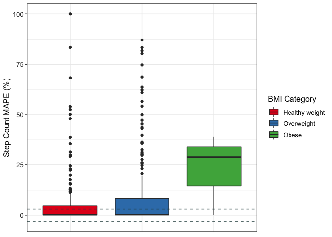
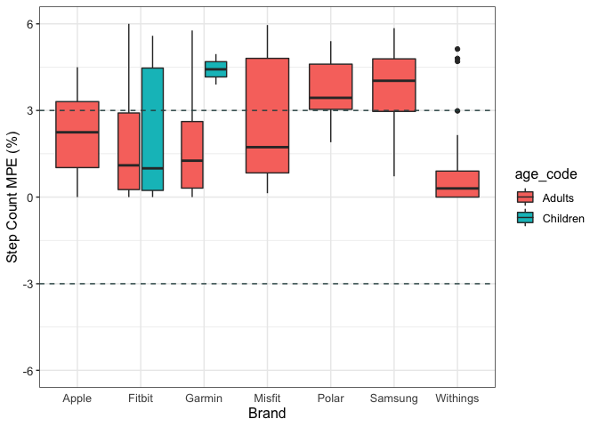
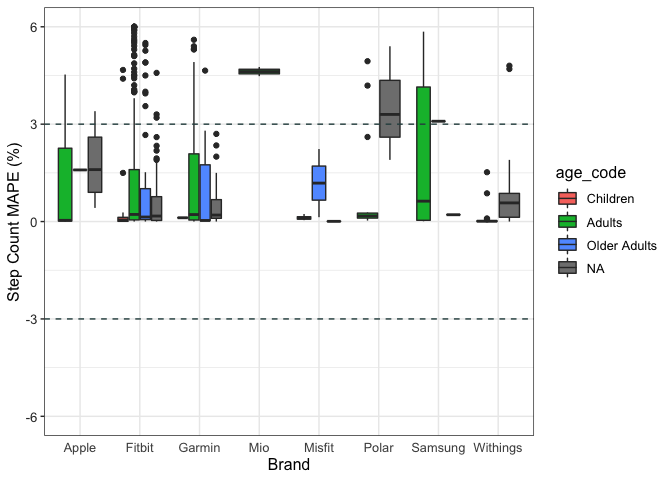
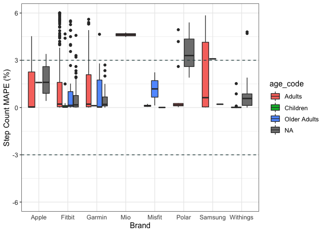

```r
df <- read_csv("wearable_review_data_validity.csv")
head(df)
```

<div class="kable-table">

| X1|Author    | Year|Substudy |Setting    |Measured |Measure_Unit |Brand |Device         |device_name          | device_year|Wear_Location |Wear_Info     |Type      |Good? |Criterion_Measure                         |Criterion_Type |Wear_Info_crit |Wear_Location_crit |population_n |population_m |population_f |population     |age_code |health_code |age   | age_SD|weight | weight_SD|height | height_SD|BMI   | BMI_SD|location |activity_type |test_type |activity_type_code |body_Motion |pace_code |pace_value |incline_code |incline_pct |activity_details                                                                                |bout_rest |epoch              | actual_n_analyzed|trend                                                                                                                                                           |CC_type |   CC|CC_bins |CC_all | CC_CI_pct|CC_CI_upper |CC_CI_lower |CC_pvalue |CC_significance |ES_type   |    ES| ES_CI_upper| ES_CI_lower|BA_LoA_upper |BA_LoA_lower | BA_LoA_width| devicemean| devicemean_SD| critmean| critmean_SD|device_v_crit |meandiff | meandiff_SD| meandiff_CI_upper| meandiff_CI_lower|        MPE|MPE_bin |MPE_SD |MPE_significance_test |MPE_significance_num | MAD| MAD_SD| MAD_CI_upper| MAD_CI_lower|   MAPE|MAPE_bin | MAPE_SD| MAPE_CI_upper| MAPE_CI_lower| RMSE|equivalencetesting | accuracypct| accuracypct_CI_upper| accuracypct_CI_lower| TEEstandardized| TEEstandardized_CI_upper| TEEstandardized_CI_lower| deviceSE| deviceCofV| critCofV|n_5pctofcrit |n_10pctofcrit |n_15pctofcrit | n_20pctofcrit| n_25pctofcrit| systematicbias_slope| systematicbias_intercept|systematicbias_probability |systematicbias_significance |Other |
|--:|:---------|----:|:--------|:----------|:--------|:------------|:-----|:--------------|:--------------------|-----------:|:-------------|:-------------|:---------|:-----|:-----------------------------------------|:--------------|:--------------|:------------------|:------------|:------------|:------------|:--------------|:--------|:-----------|:-----|------:|:------|---------:|:------|---------:|:-----|------:|:--------|:-------------|:---------|:------------------|:-----------|:---------|:----------|:------------|:-----------|:-----------------------------------------------------------------------------------------------|:---------|:------------------|-----------------:|:---------------------------------------------------------------------------------------------------------------------------------------------------------------|:-------|----:|:-------|:------|---------:|:-----------|:-----------|:---------|:---------------|:---------|-----:|-----------:|-----------:|:------------|:------------|------------:|----------:|-------------:|--------:|-----------:|:-------------|:--------|-----------:|-----------------:|-----------------:|----------:|:-------|:------|:---------------------|:--------------------|---:|------:|------------:|------------:|------:|:--------|-------:|-------------:|-------------:|----:|:------------------|-----------:|--------------------:|--------------------:|---------------:|------------------------:|------------------------:|--------:|----------:|--------:|:------------|:-------------|:-------------|-------------:|-------------:|--------------------:|------------------------:|:--------------------------|:---------------------------|:-----|
|  1|Dooley    | 2017|-        |Controlled |HR       |bpm          |Apple |Watch          |Apple Watch          |        2015|Wrist         |wrist, random |full-text |y     |Heart rate sensor chest strap (Polar T31) |chest strap    |chest          |Torso              |62           |26           |36           |healthy adults |A        |H           |22.55 |   4.34|72.02  |     18.99|170    |     11.00|24.6  |   4.77|TX, USA  |Rest: Seated  |Rest      |Se                 |NA          |NA        |NA         |N            |NA          |sedentary, seated baseline assessment, 10 min, HR assessed 3.5 minutes into each activity stage |yes       |unknown            |                62|good validity                                                                                                                                                   |NA      |   NA|NA      |NA     |        NA|NA          |NA          |NA        |NA              |Cohen's d |  0.04|          NA|          NA|NA           |NA           |           NA|      72.84|         12.08|    72.32|       12.21|over          |NA       |          NA|                NA|                NA|  0.0071903|± 3%    |NA     |0.78                  |ns                   |  NA|     NA|           NA|           NA| 0.0276|less 3%  |      NA|            NA|            NA|   NA|NA                 |          NA|                   NA|                   NA|              NA|                       NA|                       NA|       NA|         NA|       NA|NA           |NA            |NA            |            NA|            NA|                   NA|                       NA|NA                         |NA                          |NA    |
|  2|Dooley    | 2017|-        |Controlled |HR       |bpm          |Apple |Watch          |Apple Watch          |        2015|Wrist         |wrist, random |full-text |y     |Heart rate sensor chest strap (Polar T31) |chest strap    |chest          |Torso              |62           |26           |36           |healthy adults |A        |H           |22.55 |   4.34|72.02  |     18.99|170    |     11.00|24.6  |   4.77|TX, USA  |Rest: Seated  |Rest      |Se                 |NA          |NA        |NA         |N            |NA          |sedentary, seated baseline assessment, 10 min, HR assessed 3.5 minutes into each activity stage |yes       |unknown            |                62|good validity                                                                                                                                                   |NA      |   NA|NA      |NA     |        NA|NA          |NA          |NA        |NA              |Cohen's d |  0.01|          NA|          NA|NA           |NA           |           NA|      73.07|         11.45|    72.99|       11.30|over          |NA       |          NA|                NA|                NA|  0.0010960|± 3%    |NA     |0.76                  |ns                   |  NA|     NA|           NA|           NA| 0.0163|less 3%  |      NA|            NA|            NA|   NA|NA                 |          NA|                   NA|                   NA|              NA|                       NA|                       NA|       NA|         NA|       NA|NA           |NA            |NA            |            NA|            NA|                   NA|                       NA|NA                         |NA                          |NA    |
|  3|Dooley    | 2017|-        |Controlled |HR       |bpm          |Apple |Watch          |Apple Watch          |        2015|Wrist         |wrist, random |full-text |y     |Heart rate sensor chest strap (Polar T31) |chest strap    |chest          |Torso              |62           |26           |36           |healthy adults |A        |H           |22.55 |   4.34|72.02  |     18.99|170    |     11.00|24.6  |   4.77|TX, USA  |Rest: Seated  |Rest      |Se                 |NA          |NA        |NA         |N            |NA          |rest, seated recovery period, 10 min, HR assessed 3.5 minutes into each activity stage          |no        |unknown            |                62|underestimate                                                                                                                                                   |NA      |   NA|NA      |NA     |        NA|NA          |NA          |NA        |NA              |Cohen's d | -0.03|          NA|          NA|NA           |NA           |           NA|      84.02|         15.27|    84.47|       15.16|under         |NA       |          NA|                NA|                NA| -0.0053273|± 3%    |NA     |< .001                |sig                  |  NA|     NA|           NA|           NA| 0.0114|less 3%  |      NA|            NA|            NA|   NA|NA                 |          NA|                   NA|                   NA|              NA|                       NA|                       NA|       NA|         NA|       NA|NA           |NA            |NA            |            NA|            NA|                   NA|                       NA|NA                         |NA                          |NA    |
|  4|Boudreaux | 2018|-        |Controlled |HR       |bpm          |Apple |Watch Series 2 |Apple Watch Series 2 |        2016|Wrist         |wrist, random |full-text |y     |Electrocardiography (Quinton Q4500)       |ECG            |upper torso    |Torso              |50           |22           |28           |healthy adults |A        |H           |22.71 |   2.99|67.79  |     14.01|162.71 |      5.79|25.83 |   4.83|LA, USA  |Rest: Seated  |Rest      |Se                 |NA          |NA        |NA         |N            |NA          |rest, 5 min, mean of session                                                                    |NA        |average of session |                50|Across all devices, as exercise intensity increased, there was greater underestimation of HR. No device was valid for EE during cycling or resistance exercise. |ICC     | 0.99|VS      |0.99   |        NA|NA          |NA          |NA        |NA              |NA        |    NA|          NA|          NA|NA           |NA           |           NA|         NA|            NA|       NA|          NA|equal         |0.04     |        1.71|             -3.31|              3.39|         NA|NA      |NA     |NA                    |NA                   |  NA|     NA|           NA|           NA| 0.0121|less 3%  |      NA|            NA|            NA|   NA|NA                 |          NA|                   NA|                   NA|              NA|                       NA|                       NA|       NA|         NA|       NA|NA           |NA            |NA            |            NA|            NA|                   NA|                       NA|NA                         |NA                          |NA    |
|  5|Boudreaux | 2018|-        |Controlled |HR       |bpm          |Apple |Watch Series 2 |Apple Watch Series 2 |        2016|Wrist         |wrist, random |full-text |y     |Electrocardiography (Quinton Q4500)       |ECG            |upper torso    |Torso              |50           |22           |28           |healthy adults |A        |H           |22.71 |   2.99|67.79  |     14.01|162.71 |      5.79|25.83 |   4.83|LA, USA  |Rest: Seated  |Rest      |Se                 |NA          |NA        |NA         |N            |NA          |rest, 5 min, mean of session                                                                    |NA        |average of session |                50|Across all devices, as exercise intensity increased, there was greater underestimation of HR. No device was valid for EE during cycling or resistance exercise. |ICC     | 0.82|VS      |0.82   |        NA|NA          |NA          |NA        |NA              |NA        |    NA|          NA|          NA|NA           |NA           |           NA|         NA|            NA|       NA|          NA|equal         |0.02     |        1.71|             -3.33|              3.37|         NA|NA      |NA     |NA                    |NA                   |  NA|     NA|           NA|           NA| 0.0144|less 3%  |      NA|            NA|            NA|   NA|NA                 |          NA|                   NA|                   NA|              NA|                       NA|                       NA|       NA|         NA|       NA|NA           |NA            |NA            |            NA|            NA|                   NA|                       NA|NA                         |NA                          |NA    |
|  6|Boudreaux | 2018|-        |Controlled |HR       |bpm          |Apple |Watch Series 2 |Apple Watch Series 2 |        2016|Wrist         |wrist, random |full-text |y     |Electrocardiography (Quinton Q4500)       |ECG            |upper torso    |Torso              |50           |22           |28           |healthy adults |A        |H           |22.71 |   2.99|67.79  |     14.01|162.71 |      5.79|25.83 |   4.83|LA, USA  |Cycle         |Activity  |Mi                 |Mi          |NA        |NA         |N            |NA          |cycling, graded exercise test, 50W, 2 min, mean of intensity                                    |NA        |6 time points      |                50|Across all devices, as exercise intensity increased, there was greater underestimation of HR. No device was valid for EE during cycling or resistance exercise. |ICC     | 0.90|VS      |0.9    |        NA|NA          |NA          |NA        |NA              |NA        |    NA|          NA|          NA|NA           |NA           |           NA|         NA|            NA|       NA|          NA|over          |1.28     |        8.55|            -15.46|             18.03|         NA|NA      |NA     |NA                    |NA                   |  NA|     NA|           NA|           NA| 0.0299|less 3%  |      NA|            NA|            NA|   NA|NA                 |          NA|                   NA|                   NA|              NA|                       NA|                       NA|       NA|         NA|       NA|NA           |NA            |NA            |            NA|            NA|                   NA|                       NA|NA                         |NA                          |NA    |

</div>


```r
summary(df$MAPE)
```

```
##    Min. 1st Qu.  Median    Mean 3rd Qu.    Max.    NA's 
##  0.0000  0.0410  0.0984  0.1973  0.2120  5.9590    1014
```


## Data Cleaning 


```r
data <- df %>% 
    select(Author, Year, Brand, device_name, device_year, location, Measured, Setting, Wear_Location, age, age_code, 
           BMI, population_n, population_m, population_f, MPE, MAPE)
glimpse(data)
```

```
## Rows: 1,672
## Columns: 17
## $ Author        <chr> "Dooley", "Dooley", "Dooley", "Boudreaux", "Boudreaux", …
## $ Year          <dbl> 2017, 2017, 2017, 2018, 2018, 2018, 2017, 2017, 2017, 20…
## $ Brand         <chr> "Apple", "Apple", "Apple", "Apple", "Apple", "Apple", "A…
## $ device_name   <chr> "Apple Watch", "Apple Watch", "Apple Watch", "Apple Watc…
## $ device_year   <dbl> 2015, 2015, 2015, 2016, 2016, 2016, 2015, 2015, 2015, 20…
## $ location      <chr> "TX, USA", "TX, USA", "TX, USA", "LA, USA", "LA, USA", "…
## $ Measured      <chr> "HR", "HR", "HR", "HR", "HR", "HR", "SC", "SC", "SC", "S…
## $ Setting       <chr> "Controlled", "Controlled", "Controlled", "Controlled", …
## $ Wear_Location <chr> "Wrist", "Wrist", "Wrist", "Wrist", "Wrist", "Wrist", "W…
## $ age           <chr> "22.55", "22.55", "22.55", "22.71", "22.71", "22.71", "3…
## $ age_code      <chr> "A", "A", "A", "A", "A", "A", "A", "A", "A", "A", "A", "…
## $ BMI           <chr> "24.6", "24.6", "24.6", "25.83", "25.83", "25.83", "22.6…
## $ population_n  <chr> "62", "62", "62", "50", "50", "50", "31", "31", "31", "3…
## $ population_m  <chr> "26", "26", "26", "22", "22", "22", "16", "16", "16", "1…
## $ population_f  <chr> "36", "36", "36", "28", "28", "28", "15", "15", "15", "1…
## $ MPE           <dbl> 0.007190265, 0.001096041, -0.005327335, NA, NA, NA, 0.02…
## $ MAPE          <dbl> 0.0276, 0.0163, 0.0114, 0.0121, 0.0144, 0.0299, 0.0260, …
```


### MAPE - missing values


```r
data$MAPE <- abs(data$MPE * 100)
summary(data$MAPE)
```

```
##    Min. 1st Qu.  Median    Mean 3rd Qu.    Max.    NA's 
##   0.000   1.431   5.641  16.566  19.544 530.000     294
```


```r
data$population_f <- as.numeric(data$population_f)
data$population_m <- as.numeric(data$population_m)
data$BMI <- as.numeric(data$BMI)
data$age <- as.numeric(data$age)
data$population_n <- as.numeric(data$population_n)
```


```r
data <- data %>% mutate_if(is.character, as.factor) %>% drop_na(MAPE)

str(data)
```

```
## tibble [1,378 × 17] (S3: tbl_df/tbl/data.frame)
##  $ Author       : Factor w/ 148 levels "Abt","Adam Noah",..: 40 40 40 47 47 47 47 47 47 40 ...
##  $ Year         : num [1:1378] 2017 2017 2017 2017 2017 ...
##  $ Brand        : Factor w/ 9 levels "Apple","Fitbit",..: 1 1 1 1 1 1 1 1 1 2 ...
##  $ device_name  : Factor w/ 45 levels "Apple Watch",..: 1 1 1 1 1 1 1 1 1 7 ...
##  $ device_year  : num [1:1378] 2015 2015 2015 2015 2015 ...
##  $ location     : Factor w/ 63 levels "ACT, AUS","AZ, USA",..: 57 57 57 35 35 35 35 35 35 57 ...
##  $ Measured     : Factor w/ 3 levels "EE","HR","SC": 2 2 2 3 3 3 3 3 3 2 ...
##  $ Setting      : Factor w/ 2 levels "Controlled","Free-Living": 1 1 1 1 1 1 1 1 1 1 ...
##  $ Wear_Location: Factor w/ 6 levels "LAF","Thigh",..: 6 6 6 6 6 6 6 6 6 6 ...
##  $ age          : num [1:1378] 22.6 22.6 22.6 32 32 ...
##  $ age_code     : Factor w/ 2 levels "A","C": 1 1 1 1 1 1 1 1 1 1 ...
##  $ BMI          : num [1:1378] 24.6 24.6 24.6 22.6 22.6 22.6 22.6 22.6 22.6 24.6 ...
##  $ population_n : num [1:1378] 62 62 62 31 31 31 31 31 31 62 ...
##  $ population_m : num [1:1378] 26 26 26 16 16 16 16 16 16 26 ...
##  $ population_f : num [1:1378] 36 36 36 15 15 15 15 15 15 36 ...
##  $ MPE          : num [1:1378] 0.00719 0.0011 -0.00533 0.02617 0.01889 ...
##  $ MAPE         : num [1:1378] 0.719 0.11 0.533 2.617 1.889 ...
```

294 observations removed because of missing data on MAPE.

## Data Cleaning by Variable


```r
summary(data)
```

```
##        Author         Year           Brand               device_name 
##  Tedesco  : 85   Min.   :2013   Fitbit  :812   Fitbit Zip      :177  
##  Wahl     : 84   1st Qu.:2016   Garmin  :233   Fitbit One      :172  
##  Diaz     : 64   Median :2017   Withings:114   Fitbit Charge HR:135  
##  Singh    : 60   Mean   :2017   Apple   :101   Fitbit Flex     :108  
##  Woodman  : 44   3rd Qu.:2018   Polar   : 45   Apple Watch     : 95  
##  O'Connell: 43   Max.   :2019   Misfit  : 37   Garmin Vivofit  : 95  
##  (Other)  :998                  (Other) : 36   (Other)         :596  
##   device_year      location   Measured        Setting       Wear_Location
##  Min.   :2008   Ireland:128   EE:322   Controlled :1291   LAF      : 66  
##  1st Qu.:2013   Germany: 84   HR:178   Free-Living:  87   Thigh    :  1  
##  Median :2013   NY, USA: 78   SC:878                      Torso    : 97  
##  Mean   :2014   TX, USA: 73                               Upper Arm:  6  
##  3rd Qu.:2015   Denmark: 70                               Waist/Hip:340  
##  Max.   :2016   SA, AUS: 60                               Wrist    :868  
##  NA's   :3      (Other):885                                              
##       age        age_code      BMI         population_n     population_m  
##  Min.   : 3.69   A:1353   Min.   :20.50   Min.   : 10.00   Min.   : 0.00  
##  1st Qu.:23.60   C:  25   1st Qu.:23.20   1st Qu.: 18.50   1st Qu.: 8.00  
##  Median :28.87            Median :24.60   Median : 23.00   Median :11.00  
##  Mean   :34.40            Mean   :24.49   Mean   : 28.53   Mean   :14.77  
##  3rd Qu.:34.50            3rd Qu.:26.00   3rd Qu.: 32.00   3rd Qu.:18.00  
##  Max.   :87.00            Max.   :30.80   Max.   :185.00   Max.   :91.00  
##  NA's   :314              NA's   :665     NA's   :3        NA's   :21     
##   population_f        MPE                MAPE        
##  Min.   : 0.00   Min.   :-1.00000   Min.   :  0.000  
##  1st Qu.: 9.00   1st Qu.:-0.10583   1st Qu.:  1.431  
##  Median :11.00   Median :-0.01450   Median :  5.641  
##  Mean   :13.74   Mean   :-0.04315   Mean   : 16.566  
##  3rd Qu.:15.00   3rd Qu.: 0.01396   3rd Qu.: 19.544  
##  Max.   :96.00   Max.   : 5.30000   Max.   :530.000  
##  NA's   :21
```


```r
ggplot(data, aes(MAPE)) + 
  geom_histogram(bins = 25) +
  theme_classic(base_size = 12)
```

<!-- -->


```r
ggplot(data, aes(MAPE)) + 
                geom_boxplot() +
                coord_flip() +
                theme_classic(base_size = 12)
```

<!-- -->

### Outlier Analysis

#### Run


```r
data_no_outliers <- filter(data, MAPE < 200) #1672 before outlier removal
glimpse(data_no_outliers)
```

```
## Rows: 1,374
## Columns: 17
## $ Author        <fct> Dooley, Dooley, Dooley, Fokkema, Fokkema, Fokkema, Fokke…
## $ Year          <dbl> 2017, 2017, 2017, 2017, 2017, 2017, 2017, 2017, 2017, 20…
## $ Brand         <fct> Apple, Apple, Apple, Apple, Apple, Apple, Apple, Apple, …
## $ device_name   <fct> Apple Watch, Apple Watch, Apple Watch, Apple Watch, Appl…
## $ device_year   <dbl> 2015, 2015, 2015, 2015, 2015, 2015, 2015, 2015, 2015, 20…
## $ location      <fct> "TX, USA", "TX, USA", "TX, USA", "Netherlands", "Netherl…
## $ Measured      <fct> HR, HR, HR, SC, SC, SC, SC, SC, SC, HR, HR, HR, SC, SC, …
## $ Setting       <fct> Controlled, Controlled, Controlled, Controlled, Controll…
## $ Wear_Location <fct> Wrist, Wrist, Wrist, Wrist, Wrist, Wrist, Wrist, Wrist, …
## $ age           <dbl> 22.55, 22.55, 22.55, 32.00, 32.00, 32.00, 32.00, 32.00, …
## $ age_code      <fct> A, A, A, A, A, A, A, A, A, A, A, A, A, A, A, A, A, A, A,…
## $ BMI           <dbl> 24.60, 24.60, 24.60, 22.60, 22.60, 22.60, 22.60, 22.60, …
## $ population_n  <dbl> 62, 62, 62, 31, 31, 31, 31, 31, 31, 62, 50, 50, 31, 31, …
## $ population_m  <dbl> 26, 26, 26, 16, 16, 16, 16, 16, 16, 26, 32, 32, 16, 16, …
## $ population_f  <dbl> 36, 36, 36, 15, 15, 15, 15, 15, 15, 36, 18, 18, 15, 15, …
## $ MPE           <dbl> 0.007190265, 0.001096041, -0.005327335, 0.026173285, 0.0…
## $ MAPE          <dbl> 0.7190265, 0.1096041, 0.5327335, 2.6173285, 1.8887723, 1…
```

4 cases removed for having MAPE percent greater than 200%


```r
ggplot(data_no_outliers, aes(MAPE)) + 
                  geom_histogram(bins = 30) +
                  theme_classic()
```

<!-- -->


```r
ggplot(data_no_outliers, aes(MAPE)) + 
                  geom_boxplot() +
                  coord_flip() +
                  theme_classic()
```

<!-- -->

### AGE


```r
table(data_no_outliers$age_code)
```

```
## 
##    A    C 
## 1349   25
```

```r
levels(data_no_outliers$age_code) <- c("Adults", "Children", "Older Adults")
levels(data_no_outliers$age_code)
```

```
## [1] "Adults"       "Children"     "Older Adults"
```

### SEX


```r
data_no_outliers <- data_no_outliers %>%
        mutate(man_pre = population_m - population_f
        )

data_no_outliers <- data_no_outliers %>%
        mutate(sex = case_when(
                population_m > population_f ~ "Men",
                population_m < population_f ~ "Women"
        ))

data_no_outliers <- data_no_outliers %>%
        mutate(sex_10 = case_when(
                man_pre > -10 & man_pre < 10 ~ "Even",
                man_pre >= 10 ~ "Men",
                man_pre <= -10 ~ "Women"
        ))

table(data_no_outliers$sex_10)
```

```
## 
##  Even   Men Women 
##  1041   177   135
```

```r
data_no_outliers$sex_10 <- fct_relevel(data_no_outliers$sex_10, c("Women","Even","Men"))
```


```r
data_no_outliers$sex <- as.factor(data_no_outliers$sex)
data_no_outliers$sex_10 <- as.factor(data_no_outliers$sex_10)
```

### BMI


```r
data_no_outliers <- data_no_outliers %>%
        mutate(bmi_code = case_when(
                BMI >= 18.5 & BMI <= 24.9 ~ "Healthy weight",
                BMI > 24.9 & BMI <= 29.9 ~ "Overweight",
                BMI > 29.9 ~ "Obese"
        ))

table(data_no_outliers$BMI, data_no_outliers$bmi_code)
```

```
##        
##         Healthy weight Obese Overweight
##   20.5               1     0          0
##   20.9              12     0          0
##   21.4              12     0          0
##   21.5              35     0          0
##   21.6               1     0          0
##   22.14              4     0          0
##   22.25              3     0          0
##   22.35              3     0          0
##   22.4               1     0          0
##   22.5              30     0          0
##   22.6              37     0          0
##   22.7              15     0          0
##   22.84             10     0          0
##   22.9               2     0          0
##   23                 7     0          0
##   23.2              16     0          0
##   23.22              2     0          0
##   23.25              2     0          0
##   23.4              24     0          0
##   23.5              13     0          0
##   23.6              15     0          0
##   23.66              1     0          0
##   23.7               9     0          0
##   23.8               3     0          0
##   23.86              1     0          0
##   23.9              15     0          0
##   23.95              1     0          0
##   24                 6     0          0
##   24.05              2     0          0
##   24.09              1     0          0
##   24.2              24     0          0
##   24.3               8     0          0
##   24.41              2     0          0
##   24.6              42     0          0
##   24.62              2     0          0
##   24.7              24     0          0
##   24.9              44     0          0
##   25                 0     0          6
##   25.05              0     0          8
##   25.1               0     0         20
##   25.3               0     0          2
##   25.6               0     0         35
##   25.7               0     0         15
##   25.81              0     0          3
##   25.83              0     0         10
##   25.9               0     0          1
##   26                 0     0         40
##   26.1               0     0         54
##   26.3               0     0         15
##   26.4               0     0          8
##   26.6               0     0          4
##   26.7               0     0          2
##   27                 0     0         16
##   27.4               0     0          8
##   27.7               0     0          2
##   27.9               0     0          1
##   28                 0     0         14
##   28.1               0     0          4
##   28.3               0     0          4
##   28.9               0     0          1
##   29                 0     0          2
##   29.9               0     0          1
##   30                 0     2          0
##   30.8               0     1          0
```

```r
table(data_no_outliers$bmi_code)
```

```
## 
## Healthy weight          Obese     Overweight 
##            430              3            276
```

### Wear Location


```r
table(data_no_outliers$Wear_Location)
```

```
## 
##       LAF     Thigh     Torso Upper Arm Waist/Hip     Wrist 
##        66         1        97         6       340       864
```

```r
data_no_outliers <- data_no_outliers %>%
        mutate(wear_loc = case_when(
                Wear_Location == "Wrist" ~ "Wrist",
                Wear_Location == "Waist/Hip" ~ "Hip",
                Wear_Location == "LAF" ~ "Other",
                Wear_Location == "Thigh" ~ "Other",
                Wear_Location == "Torso" ~ "Other",
                Wear_Location == "Upper Arm" ~ "Other"
        ))

table(data_no_outliers$Wear_Location, data_no_outliers$wear_loc)
```

```
##            
##             Hip Other Wrist
##   LAF         0    66     0
##   Thigh       0     1     0
##   Torso       0    97     0
##   Upper Arm   0     6     0
##   Waist/Hip 340     0     0
##   Wrist       0     0   864
```

```r
table(data_no_outliers$wear_loc)
```

```
## 
##   Hip Other Wrist 
##   340   170   864
```


```r
data_no_outliers$bmi_code <- as.factor(data_no_outliers$bmi_code)
data_no_outliers$bmi_code <- fct_relevel(data_no_outliers$bmi_code, c("Healthy weight","Overweight","Obese"))
```


## MAPE for Step count, heart rate & energy expenditure across different groups


```r
#AGE GROUP
data_no_outliers %>%
    group_by(age_code, Measured) %>%
    get_summary_stats(MAPE, type = "mean_sd") %>%
    arrange(Measured)
```

<div class="kable-table">

|Measured |age_code |variable |   n|   mean|     sd|
|:--------|:--------|:--------|---:|------:|------:|
|EE       |Adults   |MAPE     | 321| 26.156| 26.088|
|HR       |Adults   |MAPE     | 176|  4.062|  4.377|
|HR       |Children |MAPE     |   2|  1.500|  1.980|
|SC       |Adults   |MAPE     | 852| 14.449| 23.460|
|SC       |Children |MAPE     |  23|  7.302|  7.771|

</div>


```r
#SEX GROUP
data_no_outliers %>%
    group_by(sex, Measured) %>%
    get_summary_stats(MAPE, type = "mean_sd") %>%
    arrange(Measured)
```

<div class="kable-table">

|Measured |sex   |variable |   n|   mean|     sd|
|:--------|:-----|:--------|---:|------:|------:|
|EE       |Men   |MAPE     | 143| 29.687| 25.281|
|EE       |Women |MAPE     |  88| 24.938| 32.337|
|EE       |NA    |MAPE     |  90| 21.739| 19.076|
|HR       |Men   |MAPE     |  84|  3.022|  3.527|
|HR       |Women |MAPE     |  73|  4.806|  5.207|
|HR       |NA    |MAPE     |  21|  5.387|  3.294|
|SC       |Men   |MAPE     | 312| 14.581| 24.252|
|SC       |Women |MAPE     | 317| 19.533| 26.596|
|SC       |NA    |MAPE     | 246|  7.061| 13.217|

</div>


```r
#BMI GROUP
data_no_outliers %>%
    group_by(bmi_code, Measured) %>%
    get_summary_stats(MAPE, type = "mean_sd") %>%
    arrange(Measured)
```

<div class="kable-table">

|Measured |bmi_code       |variable |   n|   mean|     sd|
|:--------|:--------------|:--------|---:|------:|------:|
|EE       |Healthy weight |MAPE     | 137| 29.897| 31.627|
|EE       |Overweight     |MAPE     |  56| 24.542| 24.693|
|EE       |NA             |MAPE     | 128| 22.859| 18.774|
|HR       |Healthy weight |MAPE     |  64|  6.178|  5.766|
|HR       |Overweight     |MAPE     |  28|  3.484|  3.577|
|HR       |NA             |MAPE     |  86|  2.615|  2.311|
|SC       |Healthy weight |MAPE     | 229|  8.142| 15.872|
|SC       |Overweight     |MAPE     | 192| 14.393| 20.846|
|SC       |Obese          |MAPE     |   3| 23.255| 19.272|
|SC       |NA             |MAPE     | 451| 17.252| 26.533|

</div>


```r
#number of studies for each population and measures
data_no_outliers <- data_no_outliers %>%
    group_by(Measured, bmi_code, sex, age_code) %>%
    mutate(n_studies = n()) 
glimpse(data_no_outliers)
```

```
## Rows: 1,374
## Columns: 23
## Groups: Measured, bmi_code, sex, age_code [32]
## $ Author        <fct> Dooley, Dooley, Dooley, Fokkema, Fokkema, Fokkema, Fokke…
## $ Year          <dbl> 2017, 2017, 2017, 2017, 2017, 2017, 2017, 2017, 2017, 20…
## $ Brand         <fct> Apple, Apple, Apple, Apple, Apple, Apple, Apple, Apple, …
## $ device_name   <fct> Apple Watch, Apple Watch, Apple Watch, Apple Watch, Appl…
## $ device_year   <dbl> 2015, 2015, 2015, 2015, 2015, 2015, 2015, 2015, 2015, 20…
## $ location      <fct> "TX, USA", "TX, USA", "TX, USA", "Netherlands", "Netherl…
## $ Measured      <fct> HR, HR, HR, SC, SC, SC, SC, SC, SC, HR, HR, HR, SC, SC, …
## $ Setting       <fct> Controlled, Controlled, Controlled, Controlled, Controll…
## $ Wear_Location <fct> Wrist, Wrist, Wrist, Wrist, Wrist, Wrist, Wrist, Wrist, …
## $ age           <dbl> 22.55, 22.55, 22.55, 32.00, 32.00, 32.00, 32.00, 32.00, …
## $ age_code      <fct> Adults, Adults, Adults, Adults, Adults, Adults, Adults, …
## $ BMI           <dbl> 24.60, 24.60, 24.60, 22.60, 22.60, 22.60, 22.60, 22.60, …
## $ population_n  <dbl> 62, 62, 62, 31, 31, 31, 31, 31, 31, 62, 50, 50, 31, 31, …
## $ population_m  <dbl> 26, 26, 26, 16, 16, 16, 16, 16, 16, 26, 32, 32, 16, 16, …
## $ population_f  <dbl> 36, 36, 36, 15, 15, 15, 15, 15, 15, 36, 18, 18, 15, 15, …
## $ MPE           <dbl> 0.007190265, 0.001096041, -0.005327335, 0.026173285, 0.0…
## $ MAPE          <dbl> 0.7190265, 0.1096041, 0.5327335, 2.6173285, 1.8887723, 1…
## $ man_pre       <dbl> -10, -10, -10, 1, 1, 1, 1, 1, 1, -10, 14, 14, 1, 1, 9, 9…
## $ sex           <fct> Women, Women, Women, Men, Men, Men, Men, Men, Men, Women…
## $ sex_10        <fct> Women, Women, Women, Even, Even, Even, Even, Even, Even,…
## $ bmi_code      <fct> Healthy weight, Healthy weight, Healthy weight, Healthy …
## $ wear_loc      <chr> "Wrist", "Wrist", "Wrist", "Wrist", "Wrist", "Wrist", "W…
## $ n_studies     <int> 36, 36, 36, 113, 113, 113, 113, 113, 113, 36, 41, 41, 11…
```

## Brand


```r
# Filtering out brands with less than 10 comparisons
table(data_no_outliers$Brand)
```

```
## 
##    Apple   Fitbit   Garmin      Mio   Misfit    Polar  Samsung Withings 
##       99      810      233       15       37       45       16      114 
##   Xiaomi 
##        5
```

```r
data_no_outliers <- filter(data_no_outliers, Brand != "Mio" & Brand != "Xiaomi")
```


```r
data_no_outliers %>%
    group_by(Brand, bmi_code, Measured) %>%
    get_summary_stats(MAPE, type = "mean_sd") %>%
    arrange(Brand, Measured)
```

<div class="kable-table">

|Brand    |Measured |bmi_code       |variable |   n|   mean|     sd|
|:--------|:--------|:--------------|:--------|---:|------:|------:|
|Apple    |EE       |Healthy weight |MAPE     |  20| 34.724| 46.058|
|Apple    |EE       |Overweight     |MAPE     |   9| 37.460| 39.069|
|Apple    |EE       |NA             |MAPE     |   1| 41.770|     NA|
|Apple    |HR       |Healthy weight |MAPE     |  11|  2.830|  2.120|
|Apple    |HR       |Overweight     |MAPE     |  15|  4.087|  4.001|
|Apple    |HR       |NA             |MAPE     |  23|  1.216|  0.812|
|Apple    |SC       |Healthy weight |MAPE     |  10| 16.355| 46.420|
|Apple    |SC       |Overweight     |MAPE     |   8|  2.472|  1.001|
|Apple    |SC       |NA             |MAPE     |   2|  6.140|  2.489|
|Fitbit   |EE       |Healthy weight |MAPE     |  53| 20.367| 19.850|
|Fitbit   |EE       |Overweight     |MAPE     |  33| 17.441| 16.017|
|Fitbit   |EE       |NA             |MAPE     |  77| 24.277| 20.260|
|Fitbit   |HR       |Healthy weight |MAPE     |  22|  5.320|  4.724|
|Fitbit   |HR       |Overweight     |MAPE     |  13|  2.788|  3.022|
|Fitbit   |HR       |NA             |MAPE     |  37|  3.796|  2.660|
|Fitbit   |SC       |Healthy weight |MAPE     | 137|  8.395| 14.811|
|Fitbit   |SC       |Overweight     |MAPE     | 150| 15.824| 21.651|
|Fitbit   |SC       |Obese          |MAPE     |   3| 23.255| 19.272|
|Fitbit   |SC       |NA             |MAPE     | 285| 16.597| 25.261|
|Garmin   |EE       |Healthy weight |MAPE     |  26| 37.737| 41.593|
|Garmin   |EE       |Overweight     |MAPE     |   9| 33.078| 27.722|
|Garmin   |EE       |NA             |MAPE     |  17| 18.836| 14.348|
|Garmin   |HR       |Healthy weight |MAPE     |  31|  7.975|  6.687|
|Garmin   |HR       |NA             |MAPE     |  16|  2.049|  1.034|
|Garmin   |SC       |Healthy weight |MAPE     |  38|  4.403|  7.920|
|Garmin   |SC       |Overweight     |MAPE     |  18| 16.013| 23.980|
|Garmin   |SC       |NA             |MAPE     |  78| 10.622| 22.252|
|Misfit   |EE       |Healthy weight |MAPE     |   3| 35.678| 21.726|
|Misfit   |EE       |Overweight     |MAPE     |   2| 41.712| 37.161|
|Misfit   |EE       |NA             |MAPE     |   3| 10.677|  4.940|
|Misfit   |SC       |Healthy weight |MAPE     |   7|  9.878|  4.825|
|Misfit   |SC       |Overweight     |MAPE     |   7|  6.549|  6.743|
|Misfit   |SC       |NA             |MAPE     |  15| 37.518| 22.328|
|Polar    |EE       |Healthy weight |MAPE     |   2| 47.692| 25.524|
|Polar    |EE       |Overweight     |MAPE     |   3| 26.853| 24.065|
|Polar    |EE       |NA             |MAPE     |  11| 29.082| 20.620|
|Polar    |SC       |Healthy weight |MAPE     |  14| 14.619| 14.179|
|Polar    |SC       |Overweight     |MAPE     |   3|  9.570|  4.328|
|Polar    |SC       |NA             |MAPE     |  12| 11.313| 11.008|
|Samsung  |EE       |NA             |MAPE     |   1|  9.130|     NA|
|Samsung  |HR       |NA             |MAPE     |   1|  6.480|     NA|
|Samsung  |SC       |Healthy weight |MAPE     |  11|  3.756|  2.152|
|Samsung  |SC       |Overweight     |MAPE     |   2|  3.575|  0.686|
|Samsung  |SC       |NA             |MAPE     |   1|  5.850|     NA|
|Withings |EE       |Healthy weight |MAPE     |  33| 34.496| 26.271|
|Withings |EE       |NA             |MAPE     |  17| 17.532| 14.759|
|Withings |SC       |Healthy weight |MAPE     |   7|  0.000|  0.000|
|Withings |SC       |Overweight     |MAPE     |   4|  0.000|  0.000|
|Withings |SC       |NA             |MAPE     |  53| 28.385| 36.847|

</div>


```r
data_no_outliers %>%
    group_by(Brand, age_code, Measured) %>%
    get_summary_stats(MAPE, type = "mean_sd") %>%
    arrange(Brand, Measured)
```

<div class="kable-table">

|Brand    |Measured |age_code |variable |   n|   mean|     sd|
|:--------|:--------|:--------|:--------|---:|------:|------:|
|Apple    |EE       |Adults   |MAPE     |  30| 35.779| 42.589|
|Apple    |HR       |Adults   |MAPE     |  49|  2.457|  2.740|
|Apple    |SC       |Adults   |MAPE     |  20|  9.780| 32.681|
|Fitbit   |EE       |Adults   |MAPE     | 163| 21.621| 19.420|
|Fitbit   |HR       |Adults   |MAPE     |  70|  4.153|  3.559|
|Fitbit   |HR       |Children |MAPE     |   2|  1.500|  1.980|
|Fitbit   |SC       |Adults   |MAPE     | 554| 14.737| 22.748|
|Fitbit   |SC       |Children |MAPE     |  21|  7.576|  8.093|
|Garmin   |EE       |Adults   |MAPE     |  52| 30.751| 33.261|
|Garmin   |HR       |Adults   |MAPE     |  47|  5.958|  6.130|
|Garmin   |SC       |Adults   |MAPE     | 132|  9.660| 19.927|
|Garmin   |SC       |Children |MAPE     |   2|  4.425|  0.746|
|Misfit   |EE       |Adults   |MAPE     |   8| 27.811| 23.381|
|Misfit   |SC       |Adults   |MAPE     |  29| 23.371| 22.079|
|Polar    |EE       |Adults   |MAPE     |  16| 30.990| 21.151|
|Polar    |SC       |Adults   |MAPE     |  29| 12.729| 12.083|
|Samsung  |EE       |Adults   |MAPE     |   1|  9.130|     NA|
|Samsung  |HR       |Adults   |MAPE     |   1|  6.480|     NA|
|Samsung  |SC       |Adults   |MAPE     |  14|  3.880|  1.981|
|Withings |EE       |Adults   |MAPE     |  50| 28.728| 24.243|
|Withings |SC       |Adults   |MAPE     |  64| 23.507| 35.173|

</div>


```r
data_no_outliers %>%
    group_by(Brand, sex, Measured) %>%
    get_summary_stats(MAPE, type = "mean_sd") %>%
    arrange(Brand, Measured)
```

<div class="kable-table">

|Brand    |Measured |sex   |variable |   n|   mean|     sd|
|:--------|:--------|:-----|:--------|---:|------:|------:|
|Apple    |EE       |Men   |MAPE     |  14| 34.412| 43.314|
|Apple    |EE       |Women |MAPE     |   7| 58.122| 58.186|
|Apple    |EE       |NA    |MAPE     |   9| 20.529| 16.893|
|Apple    |HR       |Men   |MAPE     |  35|  2.394|  3.002|
|Apple    |HR       |Women |MAPE     |   8|  1.866|  2.077|
|Apple    |HR       |NA    |MAPE     |   6|  3.615|  1.594|
|Apple    |SC       |Men   |MAPE     |  13| 12.965| 40.715|
|Apple    |SC       |Women |MAPE     |   3|  2.670|  0.982|
|Apple    |SC       |NA    |MAPE     |   4|  4.764|  2.163|
|Fitbit   |EE       |Men   |MAPE     |  50| 27.496| 20.019|
|Fitbit   |EE       |Women |MAPE     |  56| 16.926| 17.934|
|Fitbit   |EE       |NA    |MAPE     |  57| 21.081| 19.269|
|Fitbit   |HR       |Men   |MAPE     |  32|  3.073|  2.807|
|Fitbit   |HR       |Women |MAPE     |  31|  3.930|  3.666|
|Fitbit   |HR       |NA    |MAPE     |   9|  8.175|  2.738|
|Fitbit   |SC       |Men   |MAPE     | 220| 17.009| 26.107|
|Fitbit   |SC       |Women |MAPE     | 193| 16.663| 22.269|
|Fitbit   |SC       |NA    |MAPE     | 162|  8.431| 14.903|
|Garmin   |EE       |Men   |MAPE     |  37| 26.639| 22.815|
|Garmin   |EE       |Women |MAPE     |  15| 40.897| 50.366|
|Garmin   |HR       |Men   |MAPE     |   9|  6.525|  6.127|
|Garmin   |HR       |Women |MAPE     |  34|  6.297|  6.397|
|Garmin   |HR       |NA    |MAPE     |   4|  1.799|  0.683|
|Garmin   |SC       |Men   |MAPE     |  36|  6.818| 12.847|
|Garmin   |SC       |Women |MAPE     |  46| 18.577| 28.783|
|Garmin   |SC       |NA    |MAPE     |  52|  3.539|  7.820|
|Misfit   |EE       |Men   |MAPE     |   4| 43.755| 23.993|
|Misfit   |EE       |Women |MAPE     |   3| 10.677|  4.940|
|Misfit   |EE       |NA    |MAPE     |   1| 15.435|     NA|
|Misfit   |SC       |Men   |MAPE     |  14|  8.213|  5.892|
|Misfit   |SC       |Women |MAPE     |  15| 37.518| 22.328|
|Polar    |EE       |Men   |MAPE     |   5| 17.920| 16.088|
|Polar    |EE       |Women |MAPE     |   2| 39.447| 14.377|
|Polar    |EE       |NA    |MAPE     |   9| 36.372| 22.943|
|Polar    |SC       |Men   |MAPE     |  19| 12.536| 11.122|
|Polar    |SC       |NA    |MAPE     |  10| 13.095| 14.373|
|Samsung  |EE       |NA    |MAPE     |   1|  9.130|     NA|
|Samsung  |HR       |NA    |MAPE     |   1|  6.480|     NA|
|Samsung  |SC       |Men   |MAPE     |  10|  4.012|  2.084|
|Samsung  |SC       |Women |MAPE     |   3|  2.783|  1.454|
|Samsung  |SC       |NA    |MAPE     |   1|  5.850|     NA|
|Withings |EE       |Men   |MAPE     |  33| 34.496| 26.271|
|Withings |EE       |Women |MAPE     |   5| 23.087| 16.072|
|Withings |EE       |NA    |MAPE     |  12| 15.217| 14.249|
|Withings |SC       |Women |MAPE     |  52| 28.347| 37.368|
|Withings |SC       |NA    |MAPE     |  12|  2.534|  4.568|

</div>

## PLOTS BY Measures

### Filtering the data by Measured


```r
val_data_sc <- filter(data_no_outliers, Measured == "SC") 
val_data_hr <- filter(data_no_outliers, Measured == "HR")
val_data_ee <- filter(data_no_outliers, Measured == "EE")
```


### Validity of Step count by Age

* Dashed grey lines indicate ± 3% measurement error


```r
#options(repr.plot.width = 25, repr.plot.height = 8)
age_sc_plot <- ggplot(data=subset(val_data_sc, !is.na(age_code)), aes(x = age_code, y = MAPE, fill = age_code)) +
                    geom_boxplot(na.rm = TRUE) +
                    #geom_beeswarm(alpha = 0.2, dodge.width=0.2, cex=2, na.rm = TRUE) +  
                    geom_hline(yintercept = 3, size = 0.5, colour = "darkslategray", linetype = "dashed") + 
                    geom_hline(yintercept = -3, size = 0.5, colour = "darkslategray", linetype = "dashed") +   
                    ylab("Step Count MAPE (%)") +
                    scale_fill_brewer(palette="Accent") +
                    theme_bw() +
                    labs(fill = "Age Group") +
                    theme(axis.text.x = element_blank(),
                          axis.title.x = element_blank(),
                          axis.ticks.x = element_blank(),
                        axis.text.y = element_text(colour = "grey20", size = 10),
                        strip.text = element_text(face = "italic"),
                        text = element_text(size = 12)) 
plot(age_sc_plot)
```

<!-- -->

### Validity of step count by Sex


```r
sex_sc_plot <- ggplot(data=subset(val_data_sc, !is.na(sex)), aes(x = sex, y = MAPE, fill = sex)) +
                    geom_boxplot(na.rm = TRUE) +
                    #geom_beeswarm(alpha = 0.2, dodge.width=0.2, cex=2, na.rm = TRUE) +  
                    geom_hline(yintercept = 3, size = 0.5, colour = "darkslategray", linetype = "dashed") + 
                    geom_hline(yintercept = -3, size = 0.5, colour = "darkslategray", linetype = "dashed") +   
                    ylab("Step Count MAPE (%)") +
                    scale_fill_brewer(palette="Dark2") +
                    theme_bw() +
                    labs(fill = "Gender") +
                    theme(axis.text.x = element_blank(),
                          axis.title.x = element_blank(),
                          axis.ticks.x = element_blank(),
                        axis.text.y = element_text(colour = "grey20", size = 10),
                        strip.text = element_text(face = "italic"),
                        text = element_text(size = 12)) 
plot(sex_sc_plot)
```

<!-- -->

### Validity of step count by BMI


```r
bmi_sc_plot <- ggplot(data=subset(val_data_sc, !is.na(bmi_code)), aes(x = bmi_code, y = MAPE, fill = bmi_code)) +
                    geom_boxplot(na.rm = TRUE) +                    
                    #geom_beeswarm(alpha = 0.2, dodge.width=0.2, cex=2, na.rm = TRUE) +  
                    geom_hline(yintercept = 3, size = 0.5, colour = "darkslategray", linetype = "dashed") + 
                    geom_hline(yintercept = -3, size = 0.5, colour = "darkslategray", linetype = "dashed") +   
                    ylab("Step Count MAPE (%)") +
                    scale_fill_brewer(palette="Set1") +
                    theme_bw() +
                    labs(fill = "BMI Category") +
                    theme(axis.text.x = element_blank(),
                          axis.title.x = element_blank(),
                          axis.ticks.x = element_blank(),
                        axis.text.y = element_text(colour = "grey20", size = 10),
                        strip.text = element_text(face = "italic"),
                        text = element_text(size = 12)) 
plot(bmi_sc_plot)
```

<!-- -->

### Validity of Heart rate by Age

* Dashed grey lines indicate ± 3% measurement error


```r
age_hr_plot <- ggplot(data=subset(val_data_hr, !is.na(age_code)), aes(x = age_code, y = MAPE, fill = age_code)) +
                    geom_boxplot(na.rm = TRUE) + 
                    geom_beeswarm(alpha = 0.2, dodge.width=0.2, cex=2, na.rm = TRUE) +  
                    geom_hline(yintercept = 3, size = 0.5, colour = "darkslategray", linetype = "dashed") + 
                    geom_hline(yintercept = -3, size = 0.5, colour = "darkslategray", linetype = "dashed") +   
                    ylab("Heart rate MAPE (%)") +
                    scale_fill_brewer(palette="Accent") +
                    theme_bw() +
                    labs(fill = "Age Group") +
                    theme(axis.text.x = element_blank(),
                          axis.title.x = element_blank(),
                          axis.ticks.x = element_blank(),
                        axis.text.y = element_text(colour = "grey20", size = 10),
                        strip.text = element_text(face = "italic"),
                        text = element_text(size = 12)) 
plot(age_hr_plot)
```

<!-- -->

### Validity of heart rate by sex


```r
sex_hr_plot <- ggplot(data=subset(val_data_hr, !is.na(sex)), aes(x = sex, y = MAPE, fill = sex)) +
                    geom_boxplot(na.rm = TRUE) + 
                    geom_beeswarm(alpha = 0.2, dodge.width=0.2, cex=2, na.rm = TRUE) +  
                    geom_hline(yintercept = 3, size = 0.5, colour = "darkslategray", linetype = "dashed") + 
                    geom_hline(yintercept = -3, size = 0.5, colour = "darkslategray", linetype = "dashed") +   
                    ylab("Heart rate MAPE (%)") +
                    scale_fill_brewer(palette="Dark2") +
                    theme_bw() +
                    labs(fill = "Gender") +
                    theme(axis.text.x = element_blank(),
                          axis.title.x = element_blank(),
                          axis.ticks.x = element_blank(),
                        axis.text.y = element_text(colour = "grey20", size = 10),
                        strip.text = element_text(face = "italic"),
                        text = element_text(size = 12)) 
plot(sex_hr_plot)
```

<!-- -->

### Validity of heart rate by BMI


```r
bmi_hr_plot <- ggplot(data=subset(val_data_hr, !is.na(bmi_code)), aes(x = bmi_code, y = MAPE, fill = bmi_code)) +
                    geom_boxplot(na.rm = TRUE) + 
                    geom_beeswarm(alpha = 0.2, dodge.width=0.2, cex=2, na.rm = TRUE) +  
                    geom_hline(yintercept = 3, size = 0.5, colour = "darkslategray", linetype = "dashed") + 
                    geom_hline(yintercept = -3, size = 0.5, colour = "darkslategray", linetype = "dashed") +   
                    ylab("Heart rate MAPE (%)") +
                    scale_fill_brewer(palette="Set1") +
                    theme_bw() +
                    labs(fill = "BMI Category") +
                    theme(axis.text.x = element_blank(),
                          axis.title.x = element_blank(),
                          axis.ticks.x = element_blank(),
                        axis.text.y = element_text(colour = "grey20", size = 10),
                        strip.text = element_text(face = "italic"),
                        text = element_text(size = 12)) 
plot(bmi_hr_plot)
```

<!-- -->

### Validity of Energy expenditure by Age

* Dashed grey lines indicate ± 3% measurement error


```r
age_ee_plot <- ggplot(data=subset(val_data_ee, !is.na(age_code)), aes(x = age_code, y = MAPE, fill = age_code)) +
                    geom_boxplot(na.rm = TRUE) + 
                    geom_beeswarm(alpha = 0.2, dodge.width=0.2, cex=2, na.rm = TRUE) +  
                    geom_hline(yintercept = 3, size = 0.5, colour = "darkslategray", linetype = "dashed") + 
                    geom_hline(yintercept = -3, size = 0.5, colour = "darkslategray", linetype = "dashed") +   
                    ylab("Energy expenditure MAPE (%)") +
                    scale_fill_brewer(palette="Accent") +
                    theme_bw() +
                    labs(fill = "Age Group") +
                    theme(axis.text.x = element_blank(),
                          axis.title.x = element_blank(),
                          axis.ticks.x = element_blank(),
                        axis.text.y = element_text(colour = "grey20", size = 10),
                        strip.text = element_text(face = "italic"),
                        text = element_text(size = 12)) 
plot(age_ee_plot)
```

<!-- -->

### Validity of energy expenditure by sex


```r
sex_ee_plot <- ggplot(data=subset(val_data_ee, !is.na(sex)), aes(x = sex, y = MAPE, fill = sex)) +
                    geom_boxplot(na.rm = TRUE) +
                    geom_beeswarm(alpha = 0.2, dodge.width=0.2, cex=2, na.rm = TRUE) +  
                    geom_hline(yintercept = 3, size = 0.5, colour = "darkslategray", linetype = "dashed") + 
                    geom_hline(yintercept = -3, size = 0.5, colour = "darkslategray", linetype = "dashed") +   
                    ylab("Energy expenditure MAPE (%)") +
                    scale_fill_brewer(palette="Dark2") +
                    theme_bw() +
                    labs(fill = "Gender") +
                    theme(axis.text.x = element_blank(),
                          axis.title.x = element_blank(),
                          axis.ticks.x = element_blank(),
                        axis.text.y = element_text(colour = "grey20", size = 10),
                        strip.text = element_text(face = "italic"),
                        text = element_text(size = 12))
plot(sex_ee_plot)
```

<!-- -->

### Validity of energy expenditure by BMI


```r
bmi_ee_plot <- ggplot(data=subset(val_data_ee, !is.na(bmi_code)), aes(x = bmi_code, y = MAPE, fill = bmi_code)) +
                    geom_boxplot(na.rm = TRUE) +   
                    geom_beeswarm(alpha = 0.2, dodge.width=0.2, cex=2, na.rm = TRUE) +  
                    geom_hline(yintercept = 3, size = 0.5, colour = "darkslategray", linetype = "dashed") + 
                    geom_hline(yintercept = -3, size = 0.5, colour = "darkslategray", linetype = "dashed") +   
                    ylab("Energy Expenditure MAPE (%)") +
                    scale_fill_brewer(palette="Set1") +
                    theme_bw() +
                    labs(fill = "BMI Category") +
                    theme(axis.text.x = element_blank(),
                          axis.title.x = element_blank(),
                          axis.ticks.x = element_blank(),
                        axis.text.y = element_text(colour = "grey20", size = 10),
                        strip.text = element_text(face = "italic"),
                        text = element_text(size = 12))
plot(bmi_ee_plot)
```

<!-- -->


```r
figure1 <- cowplot::plot_grid(age_sc_plot, sex_sc_plot, bmi_sc_plot, age_ee_plot, sex_ee_plot, bmi_ee_plot, age_hr_plot, sex_hr_plot, bmi_hr_plot, labels = c("A1","A2","A3","B1","B2","B3","C1","C2","C3"),label_size = 12)
```


```r
ggsave("figure1.png", plot = figure1, width = 16, height = 10)
```

## Regression Analysis

### Create a unique column for each study 


```r
val_data_sc$study_n <- str_c(val_data_sc$Author,"_", val_data_sc$Year, "_", val_data_sc$Brand)
val_data_hr$study_n <- str_c(val_data_hr$Author,"_", val_data_hr$Year, "_", val_data_hr$Brand)
val_data_ee$study_n <- str_c(val_data_ee$Author,"_", val_data_ee$Year, "_", val_data_ee$Brand)
```

## Step Count Models

### Step Count validity by Age


```r
sc_age_lm <- lm(MAPE ~ age_code + wear_loc, data = val_data_sc)
summary(sc_age_lm)
```

```
## 
## Call:
## lm(formula = MAPE ~ age_code + wear_loc, data = val_data_sc)
## 
## Residuals:
##     Min      1Q  Median      3Q     Max 
## -19.794 -12.637  -9.357   0.243 134.663 
## 
## Coefficients:
##                  Estimate Std. Error t value Pr(>|t|)    
## (Intercept)       12.7572     1.4682   8.689  < 2e-16 ***
## age_codeChildren  -6.2379     4.9621  -1.257  0.20906    
## wear_locOther      7.0365     2.3732   2.965  0.00311 ** 
## wear_locWrist      0.9795     1.8232   0.537  0.59122    
## ---
## Signif. codes:  0 '***' 0.001 '**' 0.01 '*' 0.05 '.' 0.1 ' ' 1
## 
## Residual standard error: 23.19 on 861 degrees of freedom
## Multiple R-squared:  0.01384,	Adjusted R-squared:  0.0104 
## F-statistic: 4.027 on 3 and 861 DF,  p-value: 0.007369
```

```r
aov(sc_age_lm)
```

```
## Call:
##    aov(formula = sc_age_lm)
## 
## Terms:
##                 age_code wear_loc Residuals
## Sum of Squares    1172.4   5323.0  462907.8
## Deg. of Freedom        1        2       861
## 
## Residual standard error: 23.18706
## Estimated effects may be unbalanced
```

```r
sc_age_lmer <- lmer(MAPE ~ age_code + wear_loc + (1 | study_n), data = val_data_sc)
summary(sc_age_lmer)
```

```
## Linear mixed model fit by REML ['lmerMod']
## Formula: MAPE ~ age_code + wear_loc + (1 | study_n)
##    Data: val_data_sc
## 
## REML criterion at convergence: 7714.3
## 
## Scaled residuals: 
##     Min      1Q  Median      3Q     Max 
## -2.2033 -0.3810 -0.1778  0.0620  5.6124 
## 
## Random effects:
##  Groups   Name        Variance Std.Dev.
##  study_n  (Intercept) 126.1    11.23   
##  Residual             384.6    19.61   
## Number of obs: 865, groups:  study_n, 149
## 
## Fixed effects:
##                  Estimate Std. Error t value
## (Intercept)        10.965      1.938   5.659
## age_codeChildren   -2.770      6.350  -0.436
## wear_locOther      -4.171      2.459  -1.696
## wear_locWrist       3.629      2.163   1.678
## 
## Correlation of Fixed Effects:
##             (Intr) ag_cdC wr_lcO
## ag_cdChldrn -0.231              
## wear_lcOthr -0.327  0.032       
## wear_lcWrst -0.730  0.130  0.274
```

```r
multilevelR2(sc_age_lmer)
```

```
##         RB1         RB2          SB         MVP 
##  0.01758159 -0.13006467 -0.01515981  0.01721363
```

```r
tab_model(sc_age_lm, sc_age_lmer)
```

<table style="border-collapse:collapse; border:none;">
<tr>
<th style="border-top: double; text-align:center; font-style:normal; font-weight:bold; padding:0.2cm;  text-align:left; ">&nbsp;</th>
<th colspan="3" style="border-top: double; text-align:center; font-style:normal; font-weight:bold; padding:0.2cm; ">MAPE</th>
<th colspan="3" style="border-top: double; text-align:center; font-style:normal; font-weight:bold; padding:0.2cm; ">MAPE</th>
</tr>
<tr>
<td style=" text-align:center; border-bottom:1px solid; font-style:italic; font-weight:normal;  text-align:left; ">Predictors</td>
<td style=" text-align:center; border-bottom:1px solid; font-style:italic; font-weight:normal;  ">Estimates</td>
<td style=" text-align:center; border-bottom:1px solid; font-style:italic; font-weight:normal;  ">CI</td>
<td style=" text-align:center; border-bottom:1px solid; font-style:italic; font-weight:normal;  ">p</td>
<td style=" text-align:center; border-bottom:1px solid; font-style:italic; font-weight:normal;  ">Estimates</td>
<td style=" text-align:center; border-bottom:1px solid; font-style:italic; font-weight:normal;  ">CI</td>
<td style=" text-align:center; border-bottom:1px solid; font-style:italic; font-weight:normal;  col7">p</td>
</tr>
<tr>
<td style=" padding:0.2cm; text-align:left; vertical-align:top; text-align:left; ">(Intercept)</td>
<td style=" padding:0.2cm; text-align:left; vertical-align:top; text-align:center;  ">12.76</td>
<td style=" padding:0.2cm; text-align:left; vertical-align:top; text-align:center;  ">9.88&nbsp;&ndash;&nbsp;15.64</td>
<td style=" padding:0.2cm; text-align:left; vertical-align:top; text-align:center;  "><strong>&lt;0.001</strong></td>
<td style=" padding:0.2cm; text-align:left; vertical-align:top; text-align:center;  ">10.97</td>
<td style=" padding:0.2cm; text-align:left; vertical-align:top; text-align:center;  ">7.16&nbsp;&ndash;&nbsp;14.77</td>
<td style=" padding:0.2cm; text-align:left; vertical-align:top; text-align:center;  col7"><strong>&lt;0.001</strong></td>
</tr>
<tr>
<td style=" padding:0.2cm; text-align:left; vertical-align:top; text-align:left; ">age code [Children]</td>
<td style=" padding:0.2cm; text-align:left; vertical-align:top; text-align:center;  ">&#45;6.24</td>
<td style=" padding:0.2cm; text-align:left; vertical-align:top; text-align:center;  ">&#45;15.98&nbsp;&ndash;&nbsp;3.50</td>
<td style=" padding:0.2cm; text-align:left; vertical-align:top; text-align:center;  ">0.209</td>
<td style=" padding:0.2cm; text-align:left; vertical-align:top; text-align:center;  ">&#45;2.77</td>
<td style=" padding:0.2cm; text-align:left; vertical-align:top; text-align:center;  ">&#45;15.23&nbsp;&ndash;&nbsp;9.69</td>
<td style=" padding:0.2cm; text-align:left; vertical-align:top; text-align:center;  col7">0.663</td>
</tr>
<tr>
<td style=" padding:0.2cm; text-align:left; vertical-align:top; text-align:left; ">wear loc [Other]</td>
<td style=" padding:0.2cm; text-align:left; vertical-align:top; text-align:center;  ">7.04</td>
<td style=" padding:0.2cm; text-align:left; vertical-align:top; text-align:center;  ">2.38&nbsp;&ndash;&nbsp;11.69</td>
<td style=" padding:0.2cm; text-align:left; vertical-align:top; text-align:center;  "><strong>0.003</strong></td>
<td style=" padding:0.2cm; text-align:left; vertical-align:top; text-align:center;  ">&#45;4.17</td>
<td style=" padding:0.2cm; text-align:left; vertical-align:top; text-align:center;  ">&#45;9.00&nbsp;&ndash;&nbsp;0.66</td>
<td style=" padding:0.2cm; text-align:left; vertical-align:top; text-align:center;  col7">0.090</td>
</tr>
<tr>
<td style=" padding:0.2cm; text-align:left; vertical-align:top; text-align:left; ">wear loc [Wrist]</td>
<td style=" padding:0.2cm; text-align:left; vertical-align:top; text-align:center;  ">0.98</td>
<td style=" padding:0.2cm; text-align:left; vertical-align:top; text-align:center;  ">&#45;2.60&nbsp;&ndash;&nbsp;4.56</td>
<td style=" padding:0.2cm; text-align:left; vertical-align:top; text-align:center;  ">0.591</td>
<td style=" padding:0.2cm; text-align:left; vertical-align:top; text-align:center;  ">3.63</td>
<td style=" padding:0.2cm; text-align:left; vertical-align:top; text-align:center;  ">&#45;0.62&nbsp;&ndash;&nbsp;7.87</td>
<td style=" padding:0.2cm; text-align:left; vertical-align:top; text-align:center;  col7">0.094</td>
</tr>
<tr>
<td colspan="7" style="font-weight:bold; text-align:left; padding-top:.8em;">Random Effects</td>
</tr>

<tr>
<td style=" padding:0.2cm; text-align:left; vertical-align:top; text-align:left; padding-top:0.1cm; padding-bottom:0.1cm;">&sigma;<sup>2</sup></td>
<td style=" padding:0.2cm; text-align:left; vertical-align:top; padding-top:0.1cm; padding-bottom:0.1cm; text-align:left;" colspan="3">&nbsp;</td>
<td style=" padding:0.2cm; text-align:left; vertical-align:top; padding-top:0.1cm; padding-bottom:0.1cm; text-align:left;" colspan="3">384.60</td>
</tr>

<tr>
<td style=" padding:0.2cm; text-align:left; vertical-align:top; text-align:left; padding-top:0.1cm; padding-bottom:0.1cm;">&tau;<sub>00</sub></td>
<td style=" padding:0.2cm; text-align:left; vertical-align:top; padding-top:0.1cm; padding-bottom:0.1cm; text-align:left;" colspan="3">&nbsp;</td>
<td style=" padding:0.2cm; text-align:left; vertical-align:top; padding-top:0.1cm; padding-bottom:0.1cm; text-align:left;" colspan="3">126.06 <sub>study_n</sub></td>

<tr>
<td style=" padding:0.2cm; text-align:left; vertical-align:top; text-align:left; padding-top:0.1cm; padding-bottom:0.1cm;">ICC</td>
<td style=" padding:0.2cm; text-align:left; vertical-align:top; padding-top:0.1cm; padding-bottom:0.1cm; text-align:left;" colspan="3">&nbsp;</td>
<td style=" padding:0.2cm; text-align:left; vertical-align:top; padding-top:0.1cm; padding-bottom:0.1cm; text-align:left;" colspan="3">0.25</td>

<tr>
<td style=" padding:0.2cm; text-align:left; vertical-align:top; text-align:left; padding-top:0.1cm; padding-bottom:0.1cm;">N</td>
<td style=" padding:0.2cm; text-align:left; vertical-align:top; padding-top:0.1cm; padding-bottom:0.1cm; text-align:left;" colspan="3">&nbsp;</td>
<td style=" padding:0.2cm; text-align:left; vertical-align:top; padding-top:0.1cm; padding-bottom:0.1cm; text-align:left;" colspan="3">149 <sub>study_n</sub></td>
<tr>
<td style=" padding:0.2cm; text-align:left; vertical-align:top; text-align:left; padding-top:0.1cm; padding-bottom:0.1cm; border-top:1px solid;">Observations</td>
<td style=" padding:0.2cm; text-align:left; vertical-align:top; padding-top:0.1cm; padding-bottom:0.1cm; text-align:left; border-top:1px solid;" colspan="3">865</td>
<td style=" padding:0.2cm; text-align:left; vertical-align:top; padding-top:0.1cm; padding-bottom:0.1cm; text-align:left; border-top:1px solid;" colspan="3">865</td>
</tr>
<tr>
<td style=" padding:0.2cm; text-align:left; vertical-align:top; text-align:left; padding-top:0.1cm; padding-bottom:0.1cm;">R<sup>2</sup> / R<sup>2</sup> adjusted</td>
<td style=" padding:0.2cm; text-align:left; vertical-align:top; padding-top:0.1cm; padding-bottom:0.1cm; text-align:left;" colspan="3">0.014 / 0.010</td>
<td style=" padding:0.2cm; text-align:left; vertical-align:top; padding-top:0.1cm; padding-bottom:0.1cm; text-align:left;" colspan="3">0.017 / 0.260</td>
</tr>

</table>

### Step Count validity by BMI


```r
sc_bmi_lm <- lm(MAPE ~ bmi_code + wear_loc, data = val_data_sc)
summary(sc_bmi_lm)
```

```
## 
## Call:
## lm(formula = MAPE ~ bmi_code + wear_loc, data = val_data_sc)
## 
## Residuals:
##     Min      1Q  Median      3Q     Max 
## -19.376  -8.973  -5.841   1.089 139.387 
## 
## Coefficients:
##                    Estimate Std. Error t value Pr(>|t|)    
## (Intercept)          6.4451     1.8354   3.512 0.000495 ***
## bmi_codeOverweight   6.9766     1.8603   3.750 0.000202 ***
## bmi_codeObese       15.2989    10.7110   1.428 0.153950    
## wear_locOther       -0.6038     2.9262  -0.206 0.836622    
## wear_locWrist        2.5678     2.0113   1.277 0.202417    
## ---
## Signif. codes:  0 '***' 0.001 '**' 0.01 '*' 0.05 '.' 0.1 ' ' 1
## 
## Residual standard error: 18.38 on 414 degrees of freedom
##   (446 observations deleted due to missingness)
## Multiple R-squared:  0.03727,	Adjusted R-squared:  0.02797 
## F-statistic: 4.007 on 4 and 414 DF,  p-value: 0.003355
```

```r
aov(sc_bmi_lm)
```

```
## Call:
##    aov(formula = sc_bmi_lm)
## 
## Terms:
##                  bmi_code  wear_loc Residuals
## Sum of Squares    4650.81    762.15 139822.01
## Deg. of Freedom         2         2       414
## 
## Residual standard error: 18.37755
## Estimated effects may be unbalanced
## 446 observations deleted due to missingness
```

```r
sc_bmi_lmer <- lmer(MAPE ~ bmi_code + wear_loc + (1 | study_n), data = val_data_sc)
summary(sc_bmi_lmer)
```

```
## Linear mixed model fit by REML ['lmerMod']
## Formula: MAPE ~ bmi_code + wear_loc + (1 | study_n)
##    Data: val_data_sc
## 
## REML criterion at convergence: 3570.3
## 
## Scaled residuals: 
##     Min      1Q  Median      3Q     Max 
## -2.0024 -0.4347 -0.1986  0.0502  6.9629 
## 
## Random effects:
##  Groups   Name        Variance Std.Dev.
##  study_n  (Intercept)  73.89    8.596  
##  Residual             271.41   16.475  
## Number of obs: 419, groups:  study_n, 78
## 
## Fixed effects:
##                    Estimate Std. Error t value
## (Intercept)           5.409      2.548   2.123
## bmi_codeOverweight    3.782      2.656   1.424
## bmi_codeObese        14.298     11.496   1.244
## wear_locOther        -4.908      3.015  -1.628
## wear_locWrist         6.031      2.429   2.483
## 
## Correlation of Fixed Effects:
##             (Intr) bm_cdOv bm_cdOb wr_lcO
## bm_cdOvrwgh -0.526                       
## bmi_codeObs -0.107  0.119                
## wear_lcOthr -0.249 -0.022  -0.064        
## wear_lcWrst -0.672  0.068  -0.013   0.266
```

```r
multilevelR2(sc_bmi_lmer)
```

```
##        RB1        RB2         SB        MVP 
## 0.30669722 0.33758076 0.31354582 0.04777734
```

```r
tab_model(sc_bmi_lm, sc_bmi_lmer)
```

<table style="border-collapse:collapse; border:none;">
<tr>
<th style="border-top: double; text-align:center; font-style:normal; font-weight:bold; padding:0.2cm;  text-align:left; ">&nbsp;</th>
<th colspan="3" style="border-top: double; text-align:center; font-style:normal; font-weight:bold; padding:0.2cm; ">MAPE</th>
<th colspan="3" style="border-top: double; text-align:center; font-style:normal; font-weight:bold; padding:0.2cm; ">MAPE</th>
</tr>
<tr>
<td style=" text-align:center; border-bottom:1px solid; font-style:italic; font-weight:normal;  text-align:left; ">Predictors</td>
<td style=" text-align:center; border-bottom:1px solid; font-style:italic; font-weight:normal;  ">Estimates</td>
<td style=" text-align:center; border-bottom:1px solid; font-style:italic; font-weight:normal;  ">CI</td>
<td style=" text-align:center; border-bottom:1px solid; font-style:italic; font-weight:normal;  ">p</td>
<td style=" text-align:center; border-bottom:1px solid; font-style:italic; font-weight:normal;  ">Estimates</td>
<td style=" text-align:center; border-bottom:1px solid; font-style:italic; font-weight:normal;  ">CI</td>
<td style=" text-align:center; border-bottom:1px solid; font-style:italic; font-weight:normal;  col7">p</td>
</tr>
<tr>
<td style=" padding:0.2cm; text-align:left; vertical-align:top; text-align:left; ">(Intercept)</td>
<td style=" padding:0.2cm; text-align:left; vertical-align:top; text-align:center;  ">6.45</td>
<td style=" padding:0.2cm; text-align:left; vertical-align:top; text-align:center;  ">2.84&nbsp;&ndash;&nbsp;10.05</td>
<td style=" padding:0.2cm; text-align:left; vertical-align:top; text-align:center;  "><strong>&lt;0.001</strong></td>
<td style=" padding:0.2cm; text-align:left; vertical-align:top; text-align:center;  ">5.41</td>
<td style=" padding:0.2cm; text-align:left; vertical-align:top; text-align:center;  ">0.40&nbsp;&ndash;&nbsp;10.42</td>
<td style=" padding:0.2cm; text-align:left; vertical-align:top; text-align:center;  col7"><strong>0.034</strong></td>
</tr>
<tr>
<td style=" padding:0.2cm; text-align:left; vertical-align:top; text-align:left; ">bmi code [Overweight]</td>
<td style=" padding:0.2cm; text-align:left; vertical-align:top; text-align:center;  ">6.98</td>
<td style=" padding:0.2cm; text-align:left; vertical-align:top; text-align:center;  ">3.32&nbsp;&ndash;&nbsp;10.63</td>
<td style=" padding:0.2cm; text-align:left; vertical-align:top; text-align:center;  "><strong>&lt;0.001</strong></td>
<td style=" padding:0.2cm; text-align:left; vertical-align:top; text-align:center;  ">3.78</td>
<td style=" padding:0.2cm; text-align:left; vertical-align:top; text-align:center;  ">&#45;1.44&nbsp;&ndash;&nbsp;9.00</td>
<td style=" padding:0.2cm; text-align:left; vertical-align:top; text-align:center;  col7">0.155</td>
</tr>
<tr>
<td style=" padding:0.2cm; text-align:left; vertical-align:top; text-align:left; ">bmi code [Obese]</td>
<td style=" padding:0.2cm; text-align:left; vertical-align:top; text-align:center;  ">15.30</td>
<td style=" padding:0.2cm; text-align:left; vertical-align:top; text-align:center;  ">&#45;5.76&nbsp;&ndash;&nbsp;36.35</td>
<td style=" padding:0.2cm; text-align:left; vertical-align:top; text-align:center;  ">0.154</td>
<td style=" padding:0.2cm; text-align:left; vertical-align:top; text-align:center;  ">14.30</td>
<td style=" padding:0.2cm; text-align:left; vertical-align:top; text-align:center;  ">&#45;8.30&nbsp;&ndash;&nbsp;36.90</td>
<td style=" padding:0.2cm; text-align:left; vertical-align:top; text-align:center;  col7">0.214</td>
</tr>
<tr>
<td style=" padding:0.2cm; text-align:left; vertical-align:top; text-align:left; ">wear loc [Other]</td>
<td style=" padding:0.2cm; text-align:left; vertical-align:top; text-align:center;  ">&#45;0.60</td>
<td style=" padding:0.2cm; text-align:left; vertical-align:top; text-align:center;  ">&#45;6.36&nbsp;&ndash;&nbsp;5.15</td>
<td style=" padding:0.2cm; text-align:left; vertical-align:top; text-align:center;  ">0.837</td>
<td style=" padding:0.2cm; text-align:left; vertical-align:top; text-align:center;  ">&#45;4.91</td>
<td style=" padding:0.2cm; text-align:left; vertical-align:top; text-align:center;  ">&#45;10.83&nbsp;&ndash;&nbsp;1.02</td>
<td style=" padding:0.2cm; text-align:left; vertical-align:top; text-align:center;  col7">0.104</td>
</tr>
<tr>
<td style=" padding:0.2cm; text-align:left; vertical-align:top; text-align:left; ">wear loc [Wrist]</td>
<td style=" padding:0.2cm; text-align:left; vertical-align:top; text-align:center;  ">2.57</td>
<td style=" padding:0.2cm; text-align:left; vertical-align:top; text-align:center;  ">&#45;1.39&nbsp;&ndash;&nbsp;6.52</td>
<td style=" padding:0.2cm; text-align:left; vertical-align:top; text-align:center;  ">0.202</td>
<td style=" padding:0.2cm; text-align:left; vertical-align:top; text-align:center;  ">6.03</td>
<td style=" padding:0.2cm; text-align:left; vertical-align:top; text-align:center;  ">1.26&nbsp;&ndash;&nbsp;10.81</td>
<td style=" padding:0.2cm; text-align:left; vertical-align:top; text-align:center;  col7"><strong>0.013</strong></td>
</tr>
<tr>
<td colspan="7" style="font-weight:bold; text-align:left; padding-top:.8em;">Random Effects</td>
</tr>

<tr>
<td style=" padding:0.2cm; text-align:left; vertical-align:top; text-align:left; padding-top:0.1cm; padding-bottom:0.1cm;">&sigma;<sup>2</sup></td>
<td style=" padding:0.2cm; text-align:left; vertical-align:top; padding-top:0.1cm; padding-bottom:0.1cm; text-align:left;" colspan="3">&nbsp;</td>
<td style=" padding:0.2cm; text-align:left; vertical-align:top; padding-top:0.1cm; padding-bottom:0.1cm; text-align:left;" colspan="3">271.41</td>
</tr>

<tr>
<td style=" padding:0.2cm; text-align:left; vertical-align:top; text-align:left; padding-top:0.1cm; padding-bottom:0.1cm;">&tau;<sub>00</sub></td>
<td style=" padding:0.2cm; text-align:left; vertical-align:top; padding-top:0.1cm; padding-bottom:0.1cm; text-align:left;" colspan="3">&nbsp;</td>
<td style=" padding:0.2cm; text-align:left; vertical-align:top; padding-top:0.1cm; padding-bottom:0.1cm; text-align:left;" colspan="3">73.89 <sub>study_n</sub></td>

<tr>
<td style=" padding:0.2cm; text-align:left; vertical-align:top; text-align:left; padding-top:0.1cm; padding-bottom:0.1cm;">ICC</td>
<td style=" padding:0.2cm; text-align:left; vertical-align:top; padding-top:0.1cm; padding-bottom:0.1cm; text-align:left;" colspan="3">&nbsp;</td>
<td style=" padding:0.2cm; text-align:left; vertical-align:top; padding-top:0.1cm; padding-bottom:0.1cm; text-align:left;" colspan="3">0.21</td>

<tr>
<td style=" padding:0.2cm; text-align:left; vertical-align:top; text-align:left; padding-top:0.1cm; padding-bottom:0.1cm;">N</td>
<td style=" padding:0.2cm; text-align:left; vertical-align:top; padding-top:0.1cm; padding-bottom:0.1cm; text-align:left;" colspan="3">&nbsp;</td>
<td style=" padding:0.2cm; text-align:left; vertical-align:top; padding-top:0.1cm; padding-bottom:0.1cm; text-align:left;" colspan="3">78 <sub>study_n</sub></td>
<tr>
<td style=" padding:0.2cm; text-align:left; vertical-align:top; text-align:left; padding-top:0.1cm; padding-bottom:0.1cm; border-top:1px solid;">Observations</td>
<td style=" padding:0.2cm; text-align:left; vertical-align:top; padding-top:0.1cm; padding-bottom:0.1cm; text-align:left; border-top:1px solid;" colspan="3">419</td>
<td style=" padding:0.2cm; text-align:left; vertical-align:top; padding-top:0.1cm; padding-bottom:0.1cm; text-align:left; border-top:1px solid;" colspan="3">419</td>
</tr>
<tr>
<td style=" padding:0.2cm; text-align:left; vertical-align:top; text-align:left; padding-top:0.1cm; padding-bottom:0.1cm;">R<sup>2</sup> / R<sup>2</sup> adjusted</td>
<td style=" padding:0.2cm; text-align:left; vertical-align:top; padding-top:0.1cm; padding-bottom:0.1cm; text-align:left;" colspan="3">0.037 / 0.028</td>
<td style=" padding:0.2cm; text-align:left; vertical-align:top; padding-top:0.1cm; padding-bottom:0.1cm; text-align:left;" colspan="3">0.048 / 0.252</td>
</tr>

</table>

### Step Count validity by sex


```r
sc_sex_lm <- lm(MAPE ~ sex + wear_loc, data = val_data_sc)
summary(sc_sex_lm)
```

```
## 
## Call:
## lm(formula = MAPE ~ sex + wear_loc, data = val_data_sc)
## 
## Residuals:
##     Min      1Q  Median      3Q     Max 
## -25.666 -14.682  -9.678   1.338 134.244 
## 
## Coefficients:
##               Estimate Std. Error t value Pr(>|t|)    
## (Intercept)     11.340      2.105   5.386 1.02e-07 ***
## sexWomen         5.159      2.033   2.537  0.01142 *  
## wear_locOther    9.167      2.964   3.093  0.00207 ** 
## wear_locWrist    2.815      2.336   1.205  0.22856    
## ---
## Signif. codes:  0 '***' 0.001 '**' 0.01 '*' 0.05 '.' 0.1 ' ' 1
## 
## Residual standard error: 25.39 on 620 degrees of freedom
##   (241 observations deleted due to missingness)
## Multiple R-squared:  0.02495,	Adjusted R-squared:  0.02023 
## F-statistic: 5.288 on 3 and 620 DF,  p-value: 0.001321
```

```r
aov(sc_sex_lm)
```

```
## Call:
##    aov(formula = sc_sex_lm)
## 
## Terms:
##                      sex wear_loc Residuals
## Sum of Squares    3971.8   6252.1  399582.1
## Deg. of Freedom        1        2       620
## 
## Residual standard error: 25.38675
## Estimated effects may be unbalanced
## 241 observations deleted due to missingness
```

```r
sc_sex_lmer <- lmer(MAPE ~ sex + wear_loc + (1 | study_n), data = val_data_sc)
summary(sc_sex_lmer)
```

```
## Linear mixed model fit by REML ['lmerMod']
## Formula: MAPE ~ sex + wear_loc + (1 | study_n)
##    Data: val_data_sc
## 
## REML criterion at convergence: 5685.9
## 
## Scaled residuals: 
##     Min      1Q  Median      3Q     Max 
## -2.0088 -0.4083 -0.1861  0.0704  5.1633 
## 
## Random effects:
##  Groups   Name        Variance Std.Dev.
##  study_n  (Intercept) 139.5    11.81   
##  Residual             471.9    21.72   
## Number of obs: 624, groups:  study_n, 114
## 
## Fixed effects:
##               Estimate Std. Error t value
## (Intercept)      8.377      2.803   2.989
## sexWomen         6.428      3.134   2.051
## wear_locOther   -4.977      3.203  -1.554
## wear_locWrist    5.201      2.632   1.976
## 
## Correlation of Fixed Effects:
##             (Intr) sexWmn wr_lcO
## sexWomen    -0.583              
## wear_lcOthr -0.271 -0.061       
## wear_lcWrst -0.614  0.065  0.306
```

```r
multilevelR2(sc_sex_lmer)
```

```
##         RB1         RB2          SB         MVP 
## -0.20553065 -0.25053221 -0.21551000  0.04182788
```

```r
tab_model(sc_sex_lm, sc_sex_lmer)
```

<table style="border-collapse:collapse; border:none;">
<tr>
<th style="border-top: double; text-align:center; font-style:normal; font-weight:bold; padding:0.2cm;  text-align:left; ">&nbsp;</th>
<th colspan="3" style="border-top: double; text-align:center; font-style:normal; font-weight:bold; padding:0.2cm; ">MAPE</th>
<th colspan="3" style="border-top: double; text-align:center; font-style:normal; font-weight:bold; padding:0.2cm; ">MAPE</th>
</tr>
<tr>
<td style=" text-align:center; border-bottom:1px solid; font-style:italic; font-weight:normal;  text-align:left; ">Predictors</td>
<td style=" text-align:center; border-bottom:1px solid; font-style:italic; font-weight:normal;  ">Estimates</td>
<td style=" text-align:center; border-bottom:1px solid; font-style:italic; font-weight:normal;  ">CI</td>
<td style=" text-align:center; border-bottom:1px solid; font-style:italic; font-weight:normal;  ">p</td>
<td style=" text-align:center; border-bottom:1px solid; font-style:italic; font-weight:normal;  ">Estimates</td>
<td style=" text-align:center; border-bottom:1px solid; font-style:italic; font-weight:normal;  ">CI</td>
<td style=" text-align:center; border-bottom:1px solid; font-style:italic; font-weight:normal;  col7">p</td>
</tr>
<tr>
<td style=" padding:0.2cm; text-align:left; vertical-align:top; text-align:left; ">(Intercept)</td>
<td style=" padding:0.2cm; text-align:left; vertical-align:top; text-align:center;  ">11.34</td>
<td style=" padding:0.2cm; text-align:left; vertical-align:top; text-align:center;  ">7.21&nbsp;&ndash;&nbsp;15.47</td>
<td style=" padding:0.2cm; text-align:left; vertical-align:top; text-align:center;  "><strong>&lt;0.001</strong></td>
<td style=" padding:0.2cm; text-align:left; vertical-align:top; text-align:center;  ">8.38</td>
<td style=" padding:0.2cm; text-align:left; vertical-align:top; text-align:center;  ">2.87&nbsp;&ndash;&nbsp;13.88</td>
<td style=" padding:0.2cm; text-align:left; vertical-align:top; text-align:center;  col7"><strong>0.003</strong></td>
</tr>
<tr>
<td style=" padding:0.2cm; text-align:left; vertical-align:top; text-align:left; ">sex [Women]</td>
<td style=" padding:0.2cm; text-align:left; vertical-align:top; text-align:center;  ">5.16</td>
<td style=" padding:0.2cm; text-align:left; vertical-align:top; text-align:center;  ">1.17&nbsp;&ndash;&nbsp;9.15</td>
<td style=" padding:0.2cm; text-align:left; vertical-align:top; text-align:center;  "><strong>0.011</strong></td>
<td style=" padding:0.2cm; text-align:left; vertical-align:top; text-align:center;  ">6.43</td>
<td style=" padding:0.2cm; text-align:left; vertical-align:top; text-align:center;  ">0.27&nbsp;&ndash;&nbsp;12.58</td>
<td style=" padding:0.2cm; text-align:left; vertical-align:top; text-align:center;  col7"><strong>0.041</strong></td>
</tr>
<tr>
<td style=" padding:0.2cm; text-align:left; vertical-align:top; text-align:left; ">wear loc [Other]</td>
<td style=" padding:0.2cm; text-align:left; vertical-align:top; text-align:center;  ">9.17</td>
<td style=" padding:0.2cm; text-align:left; vertical-align:top; text-align:center;  ">3.35&nbsp;&ndash;&nbsp;14.99</td>
<td style=" padding:0.2cm; text-align:left; vertical-align:top; text-align:center;  "><strong>0.002</strong></td>
<td style=" padding:0.2cm; text-align:left; vertical-align:top; text-align:center;  ">&#45;4.98</td>
<td style=" padding:0.2cm; text-align:left; vertical-align:top; text-align:center;  ">&#45;11.27&nbsp;&ndash;&nbsp;1.31</td>
<td style=" padding:0.2cm; text-align:left; vertical-align:top; text-align:center;  col7">0.121</td>
</tr>
<tr>
<td style=" padding:0.2cm; text-align:left; vertical-align:top; text-align:left; ">wear loc [Wrist]</td>
<td style=" padding:0.2cm; text-align:left; vertical-align:top; text-align:center;  ">2.82</td>
<td style=" padding:0.2cm; text-align:left; vertical-align:top; text-align:center;  ">&#45;1.77&nbsp;&ndash;&nbsp;7.40</td>
<td style=" padding:0.2cm; text-align:left; vertical-align:top; text-align:center;  ">0.229</td>
<td style=" padding:0.2cm; text-align:left; vertical-align:top; text-align:center;  ">5.20</td>
<td style=" padding:0.2cm; text-align:left; vertical-align:top; text-align:center;  ">0.03&nbsp;&ndash;&nbsp;10.37</td>
<td style=" padding:0.2cm; text-align:left; vertical-align:top; text-align:center;  col7"><strong>0.049</strong></td>
</tr>
<tr>
<td colspan="7" style="font-weight:bold; text-align:left; padding-top:.8em;">Random Effects</td>
</tr>

<tr>
<td style=" padding:0.2cm; text-align:left; vertical-align:top; text-align:left; padding-top:0.1cm; padding-bottom:0.1cm;">&sigma;<sup>2</sup></td>
<td style=" padding:0.2cm; text-align:left; vertical-align:top; padding-top:0.1cm; padding-bottom:0.1cm; text-align:left;" colspan="3">&nbsp;</td>
<td style=" padding:0.2cm; text-align:left; vertical-align:top; padding-top:0.1cm; padding-bottom:0.1cm; text-align:left;" colspan="3">471.94</td>
</tr>

<tr>
<td style=" padding:0.2cm; text-align:left; vertical-align:top; text-align:left; padding-top:0.1cm; padding-bottom:0.1cm;">&tau;<sub>00</sub></td>
<td style=" padding:0.2cm; text-align:left; vertical-align:top; padding-top:0.1cm; padding-bottom:0.1cm; text-align:left;" colspan="3">&nbsp;</td>
<td style=" padding:0.2cm; text-align:left; vertical-align:top; padding-top:0.1cm; padding-bottom:0.1cm; text-align:left;" colspan="3">139.50 <sub>study_n</sub></td>

<tr>
<td style=" padding:0.2cm; text-align:left; vertical-align:top; text-align:left; padding-top:0.1cm; padding-bottom:0.1cm;">ICC</td>
<td style=" padding:0.2cm; text-align:left; vertical-align:top; padding-top:0.1cm; padding-bottom:0.1cm; text-align:left;" colspan="3">&nbsp;</td>
<td style=" padding:0.2cm; text-align:left; vertical-align:top; padding-top:0.1cm; padding-bottom:0.1cm; text-align:left;" colspan="3">0.23</td>

<tr>
<td style=" padding:0.2cm; text-align:left; vertical-align:top; text-align:left; padding-top:0.1cm; padding-bottom:0.1cm;">N</td>
<td style=" padding:0.2cm; text-align:left; vertical-align:top; padding-top:0.1cm; padding-bottom:0.1cm; text-align:left;" colspan="3">&nbsp;</td>
<td style=" padding:0.2cm; text-align:left; vertical-align:top; padding-top:0.1cm; padding-bottom:0.1cm; text-align:left;" colspan="3">114 <sub>study_n</sub></td>
<tr>
<td style=" padding:0.2cm; text-align:left; vertical-align:top; text-align:left; padding-top:0.1cm; padding-bottom:0.1cm; border-top:1px solid;">Observations</td>
<td style=" padding:0.2cm; text-align:left; vertical-align:top; padding-top:0.1cm; padding-bottom:0.1cm; text-align:left; border-top:1px solid;" colspan="3">624</td>
<td style=" padding:0.2cm; text-align:left; vertical-align:top; padding-top:0.1cm; padding-bottom:0.1cm; text-align:left; border-top:1px solid;" colspan="3">624</td>
</tr>
<tr>
<td style=" padding:0.2cm; text-align:left; vertical-align:top; text-align:left; padding-top:0.1cm; padding-bottom:0.1cm;">R<sup>2</sup> / R<sup>2</sup> adjusted</td>
<td style=" padding:0.2cm; text-align:left; vertical-align:top; padding-top:0.1cm; padding-bottom:0.1cm; text-align:left;" colspan="3">0.025 / 0.020</td>
<td style=" padding:0.2cm; text-align:left; vertical-align:top; padding-top:0.1cm; padding-bottom:0.1cm; text-align:left;" colspan="3">0.042 / 0.260</td>
</tr>

</table>

## Energy Expenditure Models

### Energy Expenditure validity by Age

No EE studies on people other than adults.


```r
#ee_age_lm <- lm(MAPE ~ age_code + wear_loc, data = val_data_ee)
#summary(ee_age_lm)
#aov(ee_age_lm)

#ee_age_lmer <- lmer(MAPE ~ age_code + wear_loc + (1 | study_n), data = val_data_ee)
#summary(ee_age_lmer)

#tab_model(ee_age_lm, ee_age_lmer)
```

### Energy Expenditure validity by BMI


```r
val_data_ee <- filter(val_data_ee, bmi_code != "Obese")

ee_bmi_lm <- lm(MAPE ~ bmi_code + wear_loc, data = val_data_ee)
summary(ee_bmi_lm)
```

```
## 
## Call:
## lm(formula = MAPE ~ bmi_code + wear_loc, data = val_data_ee)
## 
## Residuals:
##     Min      1Q  Median      3Q     Max 
## -33.053 -20.840  -8.574  10.166 126.008 
## 
## Coefficients:
##                    Estimate Std. Error t value Pr(>|t|)    
## (Intercept)          24.447      4.916   4.973 1.48e-06 ***
## bmi_codeOverweight   -7.281      4.819  -1.511    0.133    
## wear_locOther        -3.007      9.099  -0.330    0.741    
## wear_locWrist         8.606      5.461   1.576    0.117    
## ---
## Signif. codes:  0 '***' 0.001 '**' 0.01 '*' 0.05 '.' 0.1 ' ' 1
## 
## Residual standard error: 29.65 on 189 degrees of freedom
## Multiple R-squared:  0.02652,	Adjusted R-squared:  0.01107 
## F-statistic: 1.716 on 3 and 189 DF,  p-value: 0.1651
```

```r
aov(ee_bmi_lm)
```

```
## Call:
##    aov(formula = ee_bmi_lm)
## 
## Terms:
##                  bmi_code  wear_loc Residuals
## Sum of Squares    1139.57   3387.75 166180.77
## Deg. of Freedom         1         2       189
## 
## Residual standard error: 29.65238
## Estimated effects may be unbalanced
```

```r
ee_bmi_lmer <- lmer(MAPE ~ bmi_code + wear_loc + (1 | study_n), data = val_data_ee)
summary(ee_bmi_lmer)
```

```
## Linear mixed model fit by REML ['lmerMod']
## Formula: MAPE ~ bmi_code + wear_loc + (1 | study_n)
##    Data: val_data_ee
## 
## REML criterion at convergence: 1802.2
## 
## Scaled residuals: 
##     Min      1Q  Median      3Q     Max 
## -2.1861 -0.4971 -0.1668  0.3623  4.6775 
## 
## Random effects:
##  Groups   Name        Variance Std.Dev.
##  study_n  (Intercept) 373.9    19.34   
##  Residual             601.8    24.53   
## Number of obs: 193, groups:  study_n, 38
## 
## Fixed effects:
##                    Estimate Std. Error t value
## (Intercept)         23.8943     7.8656   3.038
## bmi_codeOverweight  -0.8593     7.9622  -0.108
## wear_locOther       -3.4316     8.4816  -0.405
## wear_locWrist        9.0175     6.8399   1.318
## 
## Correlation of Fixed Effects:
##             (Intr) bm_cdO wr_lcO
## bm_cdOvrwgh -0.421              
## wear_lcOthr -0.366  0.040       
## wear_lcWrst -0.761  0.007  0.432
```

```r
multilevelR2(ee_bmi_lmer)
```

```
##          RB1          RB2           SB          MVP 
##  0.002644572 -0.023083044 -0.007060587  0.020145709
```

```r
tab_model(ee_bmi_lm, ee_bmi_lmer)
```

<table style="border-collapse:collapse; border:none;">
<tr>
<th style="border-top: double; text-align:center; font-style:normal; font-weight:bold; padding:0.2cm;  text-align:left; ">&nbsp;</th>
<th colspan="3" style="border-top: double; text-align:center; font-style:normal; font-weight:bold; padding:0.2cm; ">MAPE</th>
<th colspan="3" style="border-top: double; text-align:center; font-style:normal; font-weight:bold; padding:0.2cm; ">MAPE</th>
</tr>
<tr>
<td style=" text-align:center; border-bottom:1px solid; font-style:italic; font-weight:normal;  text-align:left; ">Predictors</td>
<td style=" text-align:center; border-bottom:1px solid; font-style:italic; font-weight:normal;  ">Estimates</td>
<td style=" text-align:center; border-bottom:1px solid; font-style:italic; font-weight:normal;  ">CI</td>
<td style=" text-align:center; border-bottom:1px solid; font-style:italic; font-weight:normal;  ">p</td>
<td style=" text-align:center; border-bottom:1px solid; font-style:italic; font-weight:normal;  ">Estimates</td>
<td style=" text-align:center; border-bottom:1px solid; font-style:italic; font-weight:normal;  ">CI</td>
<td style=" text-align:center; border-bottom:1px solid; font-style:italic; font-weight:normal;  col7">p</td>
</tr>
<tr>
<td style=" padding:0.2cm; text-align:left; vertical-align:top; text-align:left; ">(Intercept)</td>
<td style=" padding:0.2cm; text-align:left; vertical-align:top; text-align:center;  ">24.45</td>
<td style=" padding:0.2cm; text-align:left; vertical-align:top; text-align:center;  ">14.75&nbsp;&ndash;&nbsp;34.14</td>
<td style=" padding:0.2cm; text-align:left; vertical-align:top; text-align:center;  "><strong>&lt;0.001</strong></td>
<td style=" padding:0.2cm; text-align:left; vertical-align:top; text-align:center;  ">23.89</td>
<td style=" padding:0.2cm; text-align:left; vertical-align:top; text-align:center;  ">8.38&nbsp;&ndash;&nbsp;39.41</td>
<td style=" padding:0.2cm; text-align:left; vertical-align:top; text-align:center;  col7"><strong>0.003</strong></td>
</tr>
<tr>
<td style=" padding:0.2cm; text-align:left; vertical-align:top; text-align:left; ">bmi code [Overweight]</td>
<td style=" padding:0.2cm; text-align:left; vertical-align:top; text-align:center;  ">&#45;7.28</td>
<td style=" padding:0.2cm; text-align:left; vertical-align:top; text-align:center;  ">&#45;16.79&nbsp;&ndash;&nbsp;2.23</td>
<td style=" padding:0.2cm; text-align:left; vertical-align:top; text-align:center;  ">0.133</td>
<td style=" padding:0.2cm; text-align:left; vertical-align:top; text-align:center;  ">&#45;0.86</td>
<td style=" padding:0.2cm; text-align:left; vertical-align:top; text-align:center;  ">&#45;16.57&nbsp;&ndash;&nbsp;14.85</td>
<td style=" padding:0.2cm; text-align:left; vertical-align:top; text-align:center;  col7">0.914</td>
</tr>
<tr>
<td style=" padding:0.2cm; text-align:left; vertical-align:top; text-align:left; ">wear loc [Other]</td>
<td style=" padding:0.2cm; text-align:left; vertical-align:top; text-align:center;  ">&#45;3.01</td>
<td style=" padding:0.2cm; text-align:left; vertical-align:top; text-align:center;  ">&#45;20.95&nbsp;&ndash;&nbsp;14.94</td>
<td style=" padding:0.2cm; text-align:left; vertical-align:top; text-align:center;  ">0.741</td>
<td style=" padding:0.2cm; text-align:left; vertical-align:top; text-align:center;  ">&#45;3.43</td>
<td style=" padding:0.2cm; text-align:left; vertical-align:top; text-align:center;  ">&#45;20.16&nbsp;&ndash;&nbsp;13.30</td>
<td style=" padding:0.2cm; text-align:left; vertical-align:top; text-align:center;  col7">0.686</td>
</tr>
<tr>
<td style=" padding:0.2cm; text-align:left; vertical-align:top; text-align:left; ">wear loc [Wrist]</td>
<td style=" padding:0.2cm; text-align:left; vertical-align:top; text-align:center;  ">8.61</td>
<td style=" padding:0.2cm; text-align:left; vertical-align:top; text-align:center;  ">&#45;2.17&nbsp;&ndash;&nbsp;19.38</td>
<td style=" padding:0.2cm; text-align:left; vertical-align:top; text-align:center;  ">0.117</td>
<td style=" padding:0.2cm; text-align:left; vertical-align:top; text-align:center;  ">9.02</td>
<td style=" padding:0.2cm; text-align:left; vertical-align:top; text-align:center;  ">&#45;4.48&nbsp;&ndash;&nbsp;22.51</td>
<td style=" padding:0.2cm; text-align:left; vertical-align:top; text-align:center;  col7">0.189</td>
</tr>
<tr>
<td colspan="7" style="font-weight:bold; text-align:left; padding-top:.8em;">Random Effects</td>
</tr>

<tr>
<td style=" padding:0.2cm; text-align:left; vertical-align:top; text-align:left; padding-top:0.1cm; padding-bottom:0.1cm;">&sigma;<sup>2</sup></td>
<td style=" padding:0.2cm; text-align:left; vertical-align:top; padding-top:0.1cm; padding-bottom:0.1cm; text-align:left;" colspan="3">&nbsp;</td>
<td style=" padding:0.2cm; text-align:left; vertical-align:top; padding-top:0.1cm; padding-bottom:0.1cm; text-align:left;" colspan="3">601.83</td>
</tr>

<tr>
<td style=" padding:0.2cm; text-align:left; vertical-align:top; text-align:left; padding-top:0.1cm; padding-bottom:0.1cm;">&tau;<sub>00</sub></td>
<td style=" padding:0.2cm; text-align:left; vertical-align:top; padding-top:0.1cm; padding-bottom:0.1cm; text-align:left;" colspan="3">&nbsp;</td>
<td style=" padding:0.2cm; text-align:left; vertical-align:top; padding-top:0.1cm; padding-bottom:0.1cm; text-align:left;" colspan="3">373.95 <sub>study_n</sub></td>

<tr>
<td style=" padding:0.2cm; text-align:left; vertical-align:top; text-align:left; padding-top:0.1cm; padding-bottom:0.1cm;">ICC</td>
<td style=" padding:0.2cm; text-align:left; vertical-align:top; padding-top:0.1cm; padding-bottom:0.1cm; text-align:left;" colspan="3">&nbsp;</td>
<td style=" padding:0.2cm; text-align:left; vertical-align:top; padding-top:0.1cm; padding-bottom:0.1cm; text-align:left;" colspan="3">0.38</td>

<tr>
<td style=" padding:0.2cm; text-align:left; vertical-align:top; text-align:left; padding-top:0.1cm; padding-bottom:0.1cm;">N</td>
<td style=" padding:0.2cm; text-align:left; vertical-align:top; padding-top:0.1cm; padding-bottom:0.1cm; text-align:left;" colspan="3">&nbsp;</td>
<td style=" padding:0.2cm; text-align:left; vertical-align:top; padding-top:0.1cm; padding-bottom:0.1cm; text-align:left;" colspan="3">38 <sub>study_n</sub></td>
<tr>
<td style=" padding:0.2cm; text-align:left; vertical-align:top; text-align:left; padding-top:0.1cm; padding-bottom:0.1cm; border-top:1px solid;">Observations</td>
<td style=" padding:0.2cm; text-align:left; vertical-align:top; padding-top:0.1cm; padding-bottom:0.1cm; text-align:left; border-top:1px solid;" colspan="3">193</td>
<td style=" padding:0.2cm; text-align:left; vertical-align:top; padding-top:0.1cm; padding-bottom:0.1cm; text-align:left; border-top:1px solid;" colspan="3">193</td>
</tr>
<tr>
<td style=" padding:0.2cm; text-align:left; vertical-align:top; text-align:left; padding-top:0.1cm; padding-bottom:0.1cm;">R<sup>2</sup> / R<sup>2</sup> adjusted</td>
<td style=" padding:0.2cm; text-align:left; vertical-align:top; padding-top:0.1cm; padding-bottom:0.1cm; text-align:left;" colspan="3">0.027 / 0.011</td>
<td style=" padding:0.2cm; text-align:left; vertical-align:top; padding-top:0.1cm; padding-bottom:0.1cm; text-align:left;" colspan="3">0.020 / 0.396</td>
</tr>

</table>

### Energy Expenditure validity by sex


```r
ee_sex_lm <- lm(MAPE ~ sex + wear_loc, data = val_data_ee)
summary(ee_sex_lm)
```

```
## 
## Call:
## lm(formula = MAPE ~ sex + wear_loc, data = val_data_ee)
## 
## Residuals:
##    Min     1Q Median     3Q    Max 
## -32.78 -22.95 -11.43  12.08 127.26 
## 
## Coefficients:
##               Estimate Std. Error t value Pr(>|t|)   
## (Intercept)    25.0072     8.0110   3.122  0.00218 **
## sexWomen       -0.9762     5.7102  -0.171  0.86450   
## wear_locOther  -3.3065    11.5365  -0.287  0.77482   
## wear_locWrist   7.7738     8.5000   0.915  0.36197   
## ---
## Signif. codes:  0 '***' 0.001 '**' 0.01 '*' 0.05 '.' 0.1 ' ' 1
## 
## Residual standard error: 32.56 on 142 degrees of freedom
##   (47 observations deleted due to missingness)
## Multiple R-squared:  0.01465,	Adjusted R-squared:  -0.006169 
## F-statistic: 0.7037 on 3 and 142 DF,  p-value: 0.5513
```

```r
aov(ee_sex_lm)
```

```
## Call:
##    aov(formula = ee_sex_lm)
## 
## Terms:
##                       sex  wear_loc Residuals
## Sum of Squares       0.87   2237.48 150564.79
## Deg. of Freedom         1         2       142
## 
## Residual standard error: 32.56249
## Estimated effects may be unbalanced
## 47 observations deleted due to missingness
```

```r
ee_sex_lmer <- lmer(MAPE ~ sex + wear_loc + (1 | study_n), data = val_data_ee)
summary(ee_sex_lmer)
```

```
## Linear mixed model fit by REML ['lmerMod']
## Formula: MAPE ~ sex + wear_loc + (1 | study_n)
##    Data: val_data_ee
## 
## REML criterion at convergence: 1376.5
## 
## Scaled residuals: 
##     Min      1Q  Median      3Q     Max 
## -2.1384 -0.4467 -0.1744  0.2999  4.3397 
## 
## Random effects:
##  Groups   Name        Variance Std.Dev.
##  study_n  (Intercept) 482.5    21.97   
##  Residual             682.7    26.13   
## Number of obs: 146, groups:  study_n, 29
## 
## Fixed effects:
##               Estimate Std. Error t value
## (Intercept)     22.571     10.081   2.239
## sexWomen         2.160     10.104   0.214
## wear_locOther   -2.067      9.386  -0.220
## wear_locWrist   11.820      8.677   1.362
## 
## Correlation of Fixed Effects:
##             (Intr) sexWmn wr_lcO
## sexWomen    -0.377              
## wear_lcOthr -0.397 -0.032       
## wear_lcWrst -0.762 -0.052  0.495
```

```r
multilevelR2(ee_sex_lmer)
```

```
##         RB1         RB2          SB         MVP 
## -0.13132225 -0.32010930 -0.20253788  0.02558201
```

```r
tab_model(ee_sex_lm, ee_sex_lmer)
```

<table style="border-collapse:collapse; border:none;">
<tr>
<th style="border-top: double; text-align:center; font-style:normal; font-weight:bold; padding:0.2cm;  text-align:left; ">&nbsp;</th>
<th colspan="3" style="border-top: double; text-align:center; font-style:normal; font-weight:bold; padding:0.2cm; ">MAPE</th>
<th colspan="3" style="border-top: double; text-align:center; font-style:normal; font-weight:bold; padding:0.2cm; ">MAPE</th>
</tr>
<tr>
<td style=" text-align:center; border-bottom:1px solid; font-style:italic; font-weight:normal;  text-align:left; ">Predictors</td>
<td style=" text-align:center; border-bottom:1px solid; font-style:italic; font-weight:normal;  ">Estimates</td>
<td style=" text-align:center; border-bottom:1px solid; font-style:italic; font-weight:normal;  ">CI</td>
<td style=" text-align:center; border-bottom:1px solid; font-style:italic; font-weight:normal;  ">p</td>
<td style=" text-align:center; border-bottom:1px solid; font-style:italic; font-weight:normal;  ">Estimates</td>
<td style=" text-align:center; border-bottom:1px solid; font-style:italic; font-weight:normal;  ">CI</td>
<td style=" text-align:center; border-bottom:1px solid; font-style:italic; font-weight:normal;  col7">p</td>
</tr>
<tr>
<td style=" padding:0.2cm; text-align:left; vertical-align:top; text-align:left; ">(Intercept)</td>
<td style=" padding:0.2cm; text-align:left; vertical-align:top; text-align:center;  ">25.01</td>
<td style=" padding:0.2cm; text-align:left; vertical-align:top; text-align:center;  ">9.17&nbsp;&ndash;&nbsp;40.84</td>
<td style=" padding:0.2cm; text-align:left; vertical-align:top; text-align:center;  "><strong>0.002</strong></td>
<td style=" padding:0.2cm; text-align:left; vertical-align:top; text-align:center;  ">22.57</td>
<td style=" padding:0.2cm; text-align:left; vertical-align:top; text-align:center;  ">2.64&nbsp;&ndash;&nbsp;42.50</td>
<td style=" padding:0.2cm; text-align:left; vertical-align:top; text-align:center;  col7"><strong>0.027</strong></td>
</tr>
<tr>
<td style=" padding:0.2cm; text-align:left; vertical-align:top; text-align:left; ">sex [Women]</td>
<td style=" padding:0.2cm; text-align:left; vertical-align:top; text-align:center;  ">&#45;0.98</td>
<td style=" padding:0.2cm; text-align:left; vertical-align:top; text-align:center;  ">&#45;12.26&nbsp;&ndash;&nbsp;10.31</td>
<td style=" padding:0.2cm; text-align:left; vertical-align:top; text-align:center;  ">0.864</td>
<td style=" padding:0.2cm; text-align:left; vertical-align:top; text-align:center;  ">2.16</td>
<td style=" padding:0.2cm; text-align:left; vertical-align:top; text-align:center;  ">&#45;17.82&nbsp;&ndash;&nbsp;22.14</td>
<td style=" padding:0.2cm; text-align:left; vertical-align:top; text-align:center;  col7">0.831</td>
</tr>
<tr>
<td style=" padding:0.2cm; text-align:left; vertical-align:top; text-align:left; ">wear loc [Other]</td>
<td style=" padding:0.2cm; text-align:left; vertical-align:top; text-align:center;  ">&#45;3.31</td>
<td style=" padding:0.2cm; text-align:left; vertical-align:top; text-align:center;  ">&#45;26.11&nbsp;&ndash;&nbsp;19.50</td>
<td style=" padding:0.2cm; text-align:left; vertical-align:top; text-align:center;  ">0.775</td>
<td style=" padding:0.2cm; text-align:left; vertical-align:top; text-align:center;  ">&#45;2.07</td>
<td style=" padding:0.2cm; text-align:left; vertical-align:top; text-align:center;  ">&#45;20.62&nbsp;&ndash;&nbsp;16.49</td>
<td style=" padding:0.2cm; text-align:left; vertical-align:top; text-align:center;  col7">0.826</td>
</tr>
<tr>
<td style=" padding:0.2cm; text-align:left; vertical-align:top; text-align:left; ">wear loc [Wrist]</td>
<td style=" padding:0.2cm; text-align:left; vertical-align:top; text-align:center;  ">7.77</td>
<td style=" padding:0.2cm; text-align:left; vertical-align:top; text-align:center;  ">&#45;9.03&nbsp;&ndash;&nbsp;24.58</td>
<td style=" padding:0.2cm; text-align:left; vertical-align:top; text-align:center;  ">0.362</td>
<td style=" padding:0.2cm; text-align:left; vertical-align:top; text-align:center;  ">11.82</td>
<td style=" padding:0.2cm; text-align:left; vertical-align:top; text-align:center;  ">&#45;5.34&nbsp;&ndash;&nbsp;28.98</td>
<td style=" padding:0.2cm; text-align:left; vertical-align:top; text-align:center;  col7">0.175</td>
</tr>
<tr>
<td colspan="7" style="font-weight:bold; text-align:left; padding-top:.8em;">Random Effects</td>
</tr>

<tr>
<td style=" padding:0.2cm; text-align:left; vertical-align:top; text-align:left; padding-top:0.1cm; padding-bottom:0.1cm;">&sigma;<sup>2</sup></td>
<td style=" padding:0.2cm; text-align:left; vertical-align:top; padding-top:0.1cm; padding-bottom:0.1cm; text-align:left;" colspan="3">&nbsp;</td>
<td style=" padding:0.2cm; text-align:left; vertical-align:top; padding-top:0.1cm; padding-bottom:0.1cm; text-align:left;" colspan="3">682.67</td>
</tr>

<tr>
<td style=" padding:0.2cm; text-align:left; vertical-align:top; text-align:left; padding-top:0.1cm; padding-bottom:0.1cm;">&tau;<sub>00</sub></td>
<td style=" padding:0.2cm; text-align:left; vertical-align:top; padding-top:0.1cm; padding-bottom:0.1cm; text-align:left;" colspan="3">&nbsp;</td>
<td style=" padding:0.2cm; text-align:left; vertical-align:top; padding-top:0.1cm; padding-bottom:0.1cm; text-align:left;" colspan="3">482.51 <sub>study_n</sub></td>

<tr>
<td style=" padding:0.2cm; text-align:left; vertical-align:top; text-align:left; padding-top:0.1cm; padding-bottom:0.1cm;">ICC</td>
<td style=" padding:0.2cm; text-align:left; vertical-align:top; padding-top:0.1cm; padding-bottom:0.1cm; text-align:left;" colspan="3">&nbsp;</td>
<td style=" padding:0.2cm; text-align:left; vertical-align:top; padding-top:0.1cm; padding-bottom:0.1cm; text-align:left;" colspan="3">0.41</td>

<tr>
<td style=" padding:0.2cm; text-align:left; vertical-align:top; text-align:left; padding-top:0.1cm; padding-bottom:0.1cm;">N</td>
<td style=" padding:0.2cm; text-align:left; vertical-align:top; padding-top:0.1cm; padding-bottom:0.1cm; text-align:left;" colspan="3">&nbsp;</td>
<td style=" padding:0.2cm; text-align:left; vertical-align:top; padding-top:0.1cm; padding-bottom:0.1cm; text-align:left;" colspan="3">29 <sub>study_n</sub></td>
<tr>
<td style=" padding:0.2cm; text-align:left; vertical-align:top; text-align:left; padding-top:0.1cm; padding-bottom:0.1cm; border-top:1px solid;">Observations</td>
<td style=" padding:0.2cm; text-align:left; vertical-align:top; padding-top:0.1cm; padding-bottom:0.1cm; text-align:left; border-top:1px solid;" colspan="3">146</td>
<td style=" padding:0.2cm; text-align:left; vertical-align:top; padding-top:0.1cm; padding-bottom:0.1cm; text-align:left; border-top:1px solid;" colspan="3">146</td>
</tr>
<tr>
<td style=" padding:0.2cm; text-align:left; vertical-align:top; text-align:left; padding-top:0.1cm; padding-bottom:0.1cm;">R<sup>2</sup> / R<sup>2</sup> adjusted</td>
<td style=" padding:0.2cm; text-align:left; vertical-align:top; padding-top:0.1cm; padding-bottom:0.1cm; text-align:left;" colspan="3">0.015 / -0.006</td>
<td style=" padding:0.2cm; text-align:left; vertical-align:top; padding-top:0.1cm; padding-bottom:0.1cm; text-align:left;" colspan="3">0.026 / 0.429</td>
</tr>

</table>

## Heart Rate Models

### Heart Rate validity by Age


```r
#hr_age_lm <- lm(MAPE ~ age_code, data = val_data_hr)
#summary(hr_age_lm)
#aov(hr_age_lm)

#hr_age_lmer <- lmer(MAPE ~ age_code + (1 | study_n), data = val_data_hr)
#summary(hr_age_lmer)

#tab_model(hr_age_lm, hr_age_lmer)
```

Not run. Only 2 studies with children for heart rate and no studies with older adults. 

### Heart Rate validity by BMI


```r
hr_bmi_lm <- lm(MAPE ~ bmi_code, data = val_data_hr)
summary(hr_bmi_lm)
```

```
## 
## Call:
## lm(formula = MAPE ~ bmi_code, data = val_data_hr)
## 
## Residuals:
##    Min     1Q Median     3Q    Max 
## -6.108 -3.589 -1.812  3.047 16.322 
## 
## Coefficients:
##                    Estimate Std. Error t value Pr(>|t|)    
## (Intercept)          6.1780     0.6509   9.491 3.26e-15 ***
## bmi_codeOverweight  -2.6937     1.1799  -2.283   0.0248 *  
## ---
## Signif. codes:  0 '***' 0.001 '**' 0.01 '*' 0.05 '.' 0.1 ' ' 1
## 
## Residual standard error: 5.207 on 90 degrees of freedom
##   (77 observations deleted due to missingness)
## Multiple R-squared:  0.05475,	Adjusted R-squared:  0.04424 
## F-statistic: 5.213 on 1 and 90 DF,  p-value: 0.02478
```

```r
aov(hr_bmi_lm)
```

```
## Call:
##    aov(formula = hr_bmi_lm)
## 
## Terms:
##                  bmi_code Residuals
## Sum of Squares   141.3375 2440.3483
## Deg. of Freedom         1        90
## 
## Residual standard error: 5.207205
## Estimated effects may be unbalanced
## 77 observations deleted due to missingness
```

```r
hr_bmi_lmer <- lmer(MAPE ~ bmi_code + (1 | study_n), data = val_data_hr)
summary(hr_bmi_lmer)
```

```
## Linear mixed model fit by REML ['lmerMod']
## Formula: MAPE ~ bmi_code + (1 | study_n)
##    Data: val_data_hr
## 
## REML criterion at convergence: 553.6
## 
## Scaled residuals: 
##     Min      1Q  Median      3Q     Max 
## -1.7088 -0.6235 -0.2743  0.4699  2.9589 
## 
## Random effects:
##  Groups   Name        Variance Std.Dev.
##  study_n  (Intercept)  6.339   2.518   
##  Residual             22.215   4.713   
## Number of obs: 92, groups:  study_n, 15
## 
## Fixed effects:
##                    Estimate Std. Error t value
## (Intercept)          5.5425     0.9776   5.670
## bmi_codeOverweight  -2.1682     2.0222  -1.072
## 
## Correlation of Fixed Effects:
##             (Intr)
## bm_cdOvrwgh -0.483
```

```r
multilevelR2(hr_bmi_lmer)
```

```
##         RB1         RB2          SB         MVP 
## -0.67824924 -0.05737148 -0.48471257  0.03404167
```

```r
tab_model(hr_bmi_lm, hr_bmi_lmer)
```

<table style="border-collapse:collapse; border:none;">
<tr>
<th style="border-top: double; text-align:center; font-style:normal; font-weight:bold; padding:0.2cm;  text-align:left; ">&nbsp;</th>
<th colspan="3" style="border-top: double; text-align:center; font-style:normal; font-weight:bold; padding:0.2cm; ">MAPE</th>
<th colspan="3" style="border-top: double; text-align:center; font-style:normal; font-weight:bold; padding:0.2cm; ">MAPE</th>
</tr>
<tr>
<td style=" text-align:center; border-bottom:1px solid; font-style:italic; font-weight:normal;  text-align:left; ">Predictors</td>
<td style=" text-align:center; border-bottom:1px solid; font-style:italic; font-weight:normal;  ">Estimates</td>
<td style=" text-align:center; border-bottom:1px solid; font-style:italic; font-weight:normal;  ">CI</td>
<td style=" text-align:center; border-bottom:1px solid; font-style:italic; font-weight:normal;  ">p</td>
<td style=" text-align:center; border-bottom:1px solid; font-style:italic; font-weight:normal;  ">Estimates</td>
<td style=" text-align:center; border-bottom:1px solid; font-style:italic; font-weight:normal;  ">CI</td>
<td style=" text-align:center; border-bottom:1px solid; font-style:italic; font-weight:normal;  col7">p</td>
</tr>
<tr>
<td style=" padding:0.2cm; text-align:left; vertical-align:top; text-align:left; ">(Intercept)</td>
<td style=" padding:0.2cm; text-align:left; vertical-align:top; text-align:center;  ">6.18</td>
<td style=" padding:0.2cm; text-align:left; vertical-align:top; text-align:center;  ">4.88&nbsp;&ndash;&nbsp;7.47</td>
<td style=" padding:0.2cm; text-align:left; vertical-align:top; text-align:center;  "><strong>&lt;0.001</strong></td>
<td style=" padding:0.2cm; text-align:left; vertical-align:top; text-align:center;  ">5.54</td>
<td style=" padding:0.2cm; text-align:left; vertical-align:top; text-align:center;  ">3.60&nbsp;&ndash;&nbsp;7.49</td>
<td style=" padding:0.2cm; text-align:left; vertical-align:top; text-align:center;  col7"><strong>&lt;0.001</strong></td>
</tr>
<tr>
<td style=" padding:0.2cm; text-align:left; vertical-align:top; text-align:left; ">bmi code [Overweight]</td>
<td style=" padding:0.2cm; text-align:left; vertical-align:top; text-align:center;  ">&#45;2.69</td>
<td style=" padding:0.2cm; text-align:left; vertical-align:top; text-align:center;  ">&#45;5.04&nbsp;&ndash;&nbsp;-0.35</td>
<td style=" padding:0.2cm; text-align:left; vertical-align:top; text-align:center;  "><strong>0.025</strong></td>
<td style=" padding:0.2cm; text-align:left; vertical-align:top; text-align:center;  ">&#45;2.17</td>
<td style=" padding:0.2cm; text-align:left; vertical-align:top; text-align:center;  ">&#45;6.19&nbsp;&ndash;&nbsp;1.85</td>
<td style=" padding:0.2cm; text-align:left; vertical-align:top; text-align:center;  col7">0.287</td>
</tr>
<tr>
<td colspan="7" style="font-weight:bold; text-align:left; padding-top:.8em;">Random Effects</td>
</tr>

<tr>
<td style=" padding:0.2cm; text-align:left; vertical-align:top; text-align:left; padding-top:0.1cm; padding-bottom:0.1cm;">&sigma;<sup>2</sup></td>
<td style=" padding:0.2cm; text-align:left; vertical-align:top; padding-top:0.1cm; padding-bottom:0.1cm; text-align:left;" colspan="3">&nbsp;</td>
<td style=" padding:0.2cm; text-align:left; vertical-align:top; padding-top:0.1cm; padding-bottom:0.1cm; text-align:left;" colspan="3">22.21</td>
</tr>

<tr>
<td style=" padding:0.2cm; text-align:left; vertical-align:top; text-align:left; padding-top:0.1cm; padding-bottom:0.1cm;">&tau;<sub>00</sub></td>
<td style=" padding:0.2cm; text-align:left; vertical-align:top; padding-top:0.1cm; padding-bottom:0.1cm; text-align:left;" colspan="3">&nbsp;</td>
<td style=" padding:0.2cm; text-align:left; vertical-align:top; padding-top:0.1cm; padding-bottom:0.1cm; text-align:left;" colspan="3">6.34 <sub>study_n</sub></td>

<tr>
<td style=" padding:0.2cm; text-align:left; vertical-align:top; text-align:left; padding-top:0.1cm; padding-bottom:0.1cm;">ICC</td>
<td style=" padding:0.2cm; text-align:left; vertical-align:top; padding-top:0.1cm; padding-bottom:0.1cm; text-align:left;" colspan="3">&nbsp;</td>
<td style=" padding:0.2cm; text-align:left; vertical-align:top; padding-top:0.1cm; padding-bottom:0.1cm; text-align:left;" colspan="3">0.22</td>

<tr>
<td style=" padding:0.2cm; text-align:left; vertical-align:top; text-align:left; padding-top:0.1cm; padding-bottom:0.1cm;">N</td>
<td style=" padding:0.2cm; text-align:left; vertical-align:top; padding-top:0.1cm; padding-bottom:0.1cm; text-align:left;" colspan="3">&nbsp;</td>
<td style=" padding:0.2cm; text-align:left; vertical-align:top; padding-top:0.1cm; padding-bottom:0.1cm; text-align:left;" colspan="3">15 <sub>study_n</sub></td>
<tr>
<td style=" padding:0.2cm; text-align:left; vertical-align:top; text-align:left; padding-top:0.1cm; padding-bottom:0.1cm; border-top:1px solid;">Observations</td>
<td style=" padding:0.2cm; text-align:left; vertical-align:top; padding-top:0.1cm; padding-bottom:0.1cm; text-align:left; border-top:1px solid;" colspan="3">92</td>
<td style=" padding:0.2cm; text-align:left; vertical-align:top; padding-top:0.1cm; padding-bottom:0.1cm; text-align:left; border-top:1px solid;" colspan="3">92</td>
</tr>
<tr>
<td style=" padding:0.2cm; text-align:left; vertical-align:top; text-align:left; padding-top:0.1cm; padding-bottom:0.1cm;">R<sup>2</sup> / R<sup>2</sup> adjusted</td>
<td style=" padding:0.2cm; text-align:left; vertical-align:top; padding-top:0.1cm; padding-bottom:0.1cm; text-align:left;" colspan="3">0.055 / 0.044</td>
<td style=" padding:0.2cm; text-align:left; vertical-align:top; padding-top:0.1cm; padding-bottom:0.1cm; text-align:left;" colspan="3">0.034 / 0.248</td>
</tr>

</table>

### Heart Rate validity by sex


```r
hr_sex_lm <- lm(MAPE ~ sex, data = val_data_hr)
summary(hr_sex_lm)
```

```
## 
## Call:
## lm(formula = MAPE ~ sex, data = val_data_hr)
## 
## Residuals:
##     Min      1Q  Median      3Q     Max 
## -4.6967 -2.6863 -1.5941  0.8952 17.6937 
## 
## Coefficients:
##             Estimate Std. Error t value Pr(>|t|)    
## (Intercept)   3.1689     0.5118   6.192 5.64e-09 ***
## sexWomen      1.6374     0.7312   2.239   0.0266 *  
## ---
## Signif. codes:  0 '***' 0.001 '**' 0.01 '*' 0.05 '.' 0.1 ' ' 1
## 
## Residual standard error: 4.462 on 147 degrees of freedom
##   (20 observations deleted due to missingness)
## Multiple R-squared:  0.03299,	Adjusted R-squared:  0.02641 
## F-statistic: 5.015 on 1 and 147 DF,  p-value: 0.02663
```

```r
aov(hr_sex_lm)
```

```
## Call:
##    aov(formula = hr_sex_lm)
## 
## Terms:
##                       sex Residuals
## Sum of Squares    99.8344 2926.2232
## Deg. of Freedom         1       147
## 
## Residual standard error: 4.461645
## Estimated effects may be unbalanced
## 20 observations deleted due to missingness
```

```r
hr_sex_lmer <- lmer(MAPE ~ sex + (1 | study_n), data = val_data_hr)
summary(hr_sex_lmer)
```

```
## Linear mixed model fit by REML ['lmerMod']
## Formula: MAPE ~ sex + (1 | study_n)
##    Data: val_data_hr
## 
## REML criterion at convergence: 837.1
## 
## Scaled residuals: 
##     Min      1Q  Median      3Q     Max 
## -2.1914 -0.5386 -0.1340  0.2136  3.6743 
## 
## Random effects:
##  Groups   Name        Variance Std.Dev.
##  study_n  (Intercept)  5.848   2.418   
##  Residual             14.067   3.751   
## Number of obs: 149, groups:  study_n, 22
## 
## Fixed effects:
##             Estimate Std. Error t value
## (Intercept)   3.0573     0.8989   3.401
## sexWomen      2.0989     1.3001   1.614
## 
## Correlation of Fixed Effects:
##          (Intr)
## sexWomen -0.691
```

```r
multilevelR2(hr_sex_lmer)
```

```
##         RB1         RB2          SB         MVP 
## -0.06271487  0.02449114 -0.03553148  0.05271750
```

```r
tab_model(hr_sex_lm, hr_sex_lmer)
```

<table style="border-collapse:collapse; border:none;">
<tr>
<th style="border-top: double; text-align:center; font-style:normal; font-weight:bold; padding:0.2cm;  text-align:left; ">&nbsp;</th>
<th colspan="3" style="border-top: double; text-align:center; font-style:normal; font-weight:bold; padding:0.2cm; ">MAPE</th>
<th colspan="3" style="border-top: double; text-align:center; font-style:normal; font-weight:bold; padding:0.2cm; ">MAPE</th>
</tr>
<tr>
<td style=" text-align:center; border-bottom:1px solid; font-style:italic; font-weight:normal;  text-align:left; ">Predictors</td>
<td style=" text-align:center; border-bottom:1px solid; font-style:italic; font-weight:normal;  ">Estimates</td>
<td style=" text-align:center; border-bottom:1px solid; font-style:italic; font-weight:normal;  ">CI</td>
<td style=" text-align:center; border-bottom:1px solid; font-style:italic; font-weight:normal;  ">p</td>
<td style=" text-align:center; border-bottom:1px solid; font-style:italic; font-weight:normal;  ">Estimates</td>
<td style=" text-align:center; border-bottom:1px solid; font-style:italic; font-weight:normal;  ">CI</td>
<td style=" text-align:center; border-bottom:1px solid; font-style:italic; font-weight:normal;  col7">p</td>
</tr>
<tr>
<td style=" padding:0.2cm; text-align:left; vertical-align:top; text-align:left; ">(Intercept)</td>
<td style=" padding:0.2cm; text-align:left; vertical-align:top; text-align:center;  ">3.17</td>
<td style=" padding:0.2cm; text-align:left; vertical-align:top; text-align:center;  ">2.16&nbsp;&ndash;&nbsp;4.18</td>
<td style=" padding:0.2cm; text-align:left; vertical-align:top; text-align:center;  "><strong>&lt;0.001</strong></td>
<td style=" padding:0.2cm; text-align:left; vertical-align:top; text-align:center;  ">3.06</td>
<td style=" padding:0.2cm; text-align:left; vertical-align:top; text-align:center;  ">1.28&nbsp;&ndash;&nbsp;4.83</td>
<td style=" padding:0.2cm; text-align:left; vertical-align:top; text-align:center;  col7"><strong>0.001</strong></td>
</tr>
<tr>
<td style=" padding:0.2cm; text-align:left; vertical-align:top; text-align:left; ">sex [Women]</td>
<td style=" padding:0.2cm; text-align:left; vertical-align:top; text-align:center;  ">1.64</td>
<td style=" padding:0.2cm; text-align:left; vertical-align:top; text-align:center;  ">0.19&nbsp;&ndash;&nbsp;3.08</td>
<td style=" padding:0.2cm; text-align:left; vertical-align:top; text-align:center;  "><strong>0.027</strong></td>
<td style=" padding:0.2cm; text-align:left; vertical-align:top; text-align:center;  ">2.10</td>
<td style=" padding:0.2cm; text-align:left; vertical-align:top; text-align:center;  ">&#45;0.47&nbsp;&ndash;&nbsp;4.67</td>
<td style=" padding:0.2cm; text-align:left; vertical-align:top; text-align:center;  col7">0.109</td>
</tr>
<tr>
<td colspan="7" style="font-weight:bold; text-align:left; padding-top:.8em;">Random Effects</td>
</tr>

<tr>
<td style=" padding:0.2cm; text-align:left; vertical-align:top; text-align:left; padding-top:0.1cm; padding-bottom:0.1cm;">&sigma;<sup>2</sup></td>
<td style=" padding:0.2cm; text-align:left; vertical-align:top; padding-top:0.1cm; padding-bottom:0.1cm; text-align:left;" colspan="3">&nbsp;</td>
<td style=" padding:0.2cm; text-align:left; vertical-align:top; padding-top:0.1cm; padding-bottom:0.1cm; text-align:left;" colspan="3">14.07</td>
</tr>

<tr>
<td style=" padding:0.2cm; text-align:left; vertical-align:top; text-align:left; padding-top:0.1cm; padding-bottom:0.1cm;">&tau;<sub>00</sub></td>
<td style=" padding:0.2cm; text-align:left; vertical-align:top; padding-top:0.1cm; padding-bottom:0.1cm; text-align:left;" colspan="3">&nbsp;</td>
<td style=" padding:0.2cm; text-align:left; vertical-align:top; padding-top:0.1cm; padding-bottom:0.1cm; text-align:left;" colspan="3">5.85 <sub>study_n</sub></td>

<tr>
<td style=" padding:0.2cm; text-align:left; vertical-align:top; text-align:left; padding-top:0.1cm; padding-bottom:0.1cm;">ICC</td>
<td style=" padding:0.2cm; text-align:left; vertical-align:top; padding-top:0.1cm; padding-bottom:0.1cm; text-align:left;" colspan="3">&nbsp;</td>
<td style=" padding:0.2cm; text-align:left; vertical-align:top; padding-top:0.1cm; padding-bottom:0.1cm; text-align:left;" colspan="3">0.29</td>

<tr>
<td style=" padding:0.2cm; text-align:left; vertical-align:top; text-align:left; padding-top:0.1cm; padding-bottom:0.1cm;">N</td>
<td style=" padding:0.2cm; text-align:left; vertical-align:top; padding-top:0.1cm; padding-bottom:0.1cm; text-align:left;" colspan="3">&nbsp;</td>
<td style=" padding:0.2cm; text-align:left; vertical-align:top; padding-top:0.1cm; padding-bottom:0.1cm; text-align:left;" colspan="3">22 <sub>study_n</sub></td>
<tr>
<td style=" padding:0.2cm; text-align:left; vertical-align:top; text-align:left; padding-top:0.1cm; padding-bottom:0.1cm; border-top:1px solid;">Observations</td>
<td style=" padding:0.2cm; text-align:left; vertical-align:top; padding-top:0.1cm; padding-bottom:0.1cm; text-align:left; border-top:1px solid;" colspan="3">149</td>
<td style=" padding:0.2cm; text-align:left; vertical-align:top; padding-top:0.1cm; padding-bottom:0.1cm; text-align:left; border-top:1px solid;" colspan="3">149</td>
</tr>
<tr>
<td style=" padding:0.2cm; text-align:left; vertical-align:top; text-align:left; padding-top:0.1cm; padding-bottom:0.1cm;">R<sup>2</sup> / R<sup>2</sup> adjusted</td>
<td style=" padding:0.2cm; text-align:left; vertical-align:top; padding-top:0.1cm; padding-bottom:0.1cm; text-align:left;" colspan="3">0.033 / 0.026</td>
<td style=" padding:0.2cm; text-align:left; vertical-align:top; padding-top:0.1cm; padding-bottom:0.1cm; text-align:left;" colspan="3">0.053 / 0.331</td>
</tr>

</table>

# Gender sensitivity analysis


```r
sc_sex_lmer <- lmer(MAPE ~ sex_10 + wear_loc + (1 | study_n), data = val_data_sc)
summary(sc_sex_lmer)
```

```
## Linear mixed model fit by REML ['lmerMod']
## Formula: MAPE ~ sex_10 + wear_loc + (1 | study_n)
##    Data: val_data_sc
## 
## REML criterion at convergence: 7572.1
## 
## Scaled residuals: 
##     Min      1Q  Median      3Q     Max 
## -2.1651 -0.3796 -0.1657  0.0528  5.6632 
## 
## Random effects:
##  Groups   Name        Variance Std.Dev.
##  study_n  (Intercept) 119.9    10.95   
##  Residual             389.4    19.73   
## Number of obs: 849, groups:  study_n, 144
## 
## Fixed effects:
##               Estimate Std. Error t value
## (Intercept)     19.719      3.745   5.266
## sex_10Even     -10.853      3.815  -2.845
## sex_10Men       -7.414      5.125  -1.446
## wear_locOther   -4.291      2.478  -1.732
## wear_locWrist    4.440      2.172   2.045
## 
## Correlation of Fixed Effects:
##             (Intr) sx_10E sx_10M wr_lcO
## sex_10Even  -0.857                     
## sex_10Men   -0.655  0.669              
## wear_lcOthr -0.205  0.043  0.050       
## wear_lcWrst -0.286 -0.094 -0.035  0.268
```

```r
multilevelR2(sc_sex_lmer)
```

```
##          RB1          RB2           SB          MVP 
##  0.005336763 -0.074811016 -0.012436467  0.037574686
```

```r
ee_sex_lmer <- lmer(MAPE ~ sex_10 + wear_loc + (1 | study_n), data = val_data_ee)
summary(ee_sex_lmer)
```

```
## Linear mixed model fit by REML ['lmerMod']
## Formula: MAPE ~ sex_10 + wear_loc + (1 | study_n)
##    Data: val_data_ee
## 
## REML criterion at convergence: 1744.1
## 
## Scaled residuals: 
##     Min      1Q  Median      3Q     Max 
## -2.2783 -0.5206 -0.1861  0.3969  4.5270 
## 
## Random effects:
##  Groups   Name        Variance Std.Dev.
##  study_n  (Intercept) 347.1    18.63   
##  Residual             603.4    24.56   
## Number of obs: 188, groups:  study_n, 34
## 
## Fixed effects:
##               Estimate Std. Error t value
## (Intercept)     34.821     12.195   2.855
## sex_10Even     -17.282     11.663  -1.482
## sex_10Men        5.604     14.841   0.378
## wear_locOther   -4.149      8.487  -0.489
## wear_locWrist   10.649      6.836   1.558
## 
## Correlation of Fixed Effects:
##             (Intr) sx_10E sx_10M wr_lcO
## sex_10Even  -0.795                     
## sex_10Men   -0.653  0.656              
## wear_lcOthr -0.260  0.050  0.022       
## wear_lcWrst -0.482 -0.015  0.052  0.427
```

```r
multilevelR2(ee_sex_lmer)
```

```
##          RB1          RB2           SB          MVP 
## 5.918361e-05 5.034352e-02 1.902781e-02 9.733870e-02
```

```r
hr_sex_lmer <- lmer(MAPE ~ sex_10 + (1 | study_n), data = val_data_hr)
summary(hr_sex_lmer)
```

```
## Linear mixed model fit by REML ['lmerMod']
## Formula: MAPE ~ sex_10 + (1 | study_n)
##    Data: val_data_hr
## 
## REML criterion at convergence: 939.6
## 
## Scaled residuals: 
##     Min      1Q  Median      3Q     Max 
## -2.2440 -0.5534 -0.1476  0.2531  3.7995 
## 
## Random effects:
##  Groups   Name        Variance Std.Dev.
##  study_n  (Intercept)  6.165   2.483   
##  Residual             13.252   3.640   
## Number of obs: 169, groups:  study_n, 29
## 
## Fixed effects:
##             Estimate Std. Error t value
## (Intercept)    5.703      1.671   3.414
## sex_10Even    -1.303      1.819  -0.716
## sex_10Men     -2.415      2.100  -1.150
## 
## Correlation of Fixed Effects:
##            (Intr) sx_10E
## sex_10Even -0.918       
## sex_10Men  -0.796  0.731
```

```r
multilevelR2(hr_sex_lmer)
```

```
##          RB1          RB2           SB          MVP 
## -0.001114050 -0.028412697 -0.009623437  0.024802063
```

```r
tab_model(sc_sex_lmer, ee_sex_lmer, hr_sex_lmer)
```

<table style="border-collapse:collapse; border:none;">
<tr>
<th style="border-top: double; text-align:center; font-style:normal; font-weight:bold; padding:0.2cm;  text-align:left; ">&nbsp;</th>
<th colspan="3" style="border-top: double; text-align:center; font-style:normal; font-weight:bold; padding:0.2cm; ">MAPE</th>
<th colspan="3" style="border-top: double; text-align:center; font-style:normal; font-weight:bold; padding:0.2cm; ">MAPE</th>
<th colspan="3" style="border-top: double; text-align:center; font-style:normal; font-weight:bold; padding:0.2cm; ">MAPE</th>
</tr>
<tr>
<td style=" text-align:center; border-bottom:1px solid; font-style:italic; font-weight:normal;  text-align:left; ">Predictors</td>
<td style=" text-align:center; border-bottom:1px solid; font-style:italic; font-weight:normal;  ">Estimates</td>
<td style=" text-align:center; border-bottom:1px solid; font-style:italic; font-weight:normal;  ">CI</td>
<td style=" text-align:center; border-bottom:1px solid; font-style:italic; font-weight:normal;  ">p</td>
<td style=" text-align:center; border-bottom:1px solid; font-style:italic; font-weight:normal;  ">Estimates</td>
<td style=" text-align:center; border-bottom:1px solid; font-style:italic; font-weight:normal;  ">CI</td>
<td style=" text-align:center; border-bottom:1px solid; font-style:italic; font-weight:normal;  col7">p</td>
<td style=" text-align:center; border-bottom:1px solid; font-style:italic; font-weight:normal;  col8">Estimates</td>
<td style=" text-align:center; border-bottom:1px solid; font-style:italic; font-weight:normal;  col9">CI</td>
<td style=" text-align:center; border-bottom:1px solid; font-style:italic; font-weight:normal;  0">p</td>
</tr>
<tr>
<td style=" padding:0.2cm; text-align:left; vertical-align:top; text-align:left; ">(Intercept)</td>
<td style=" padding:0.2cm; text-align:left; vertical-align:top; text-align:center;  ">19.72</td>
<td style=" padding:0.2cm; text-align:left; vertical-align:top; text-align:center;  ">12.37&nbsp;&ndash;&nbsp;27.07</td>
<td style=" padding:0.2cm; text-align:left; vertical-align:top; text-align:center;  "><strong>&lt;0.001</strong></td>
<td style=" padding:0.2cm; text-align:left; vertical-align:top; text-align:center;  ">34.82</td>
<td style=" padding:0.2cm; text-align:left; vertical-align:top; text-align:center;  ">10.76&nbsp;&ndash;&nbsp;58.88</td>
<td style=" padding:0.2cm; text-align:left; vertical-align:top; text-align:center;  col7"><strong>0.005</strong></td>
<td style=" padding:0.2cm; text-align:left; vertical-align:top; text-align:center;  col8">5.70</td>
<td style=" padding:0.2cm; text-align:left; vertical-align:top; text-align:center;  col9">2.40&nbsp;&ndash;&nbsp;9.00</td>
<td style=" padding:0.2cm; text-align:left; vertical-align:top; text-align:center;  0"><strong>0.001</strong></td>
</tr>
<tr>
<td style=" padding:0.2cm; text-align:left; vertical-align:top; text-align:left; ">sex 10 [Even]</td>
<td style=" padding:0.2cm; text-align:left; vertical-align:top; text-align:center;  ">&#45;10.85</td>
<td style=" padding:0.2cm; text-align:left; vertical-align:top; text-align:center;  ">&#45;18.34&nbsp;&ndash;&nbsp;-3.37</td>
<td style=" padding:0.2cm; text-align:left; vertical-align:top; text-align:center;  "><strong>0.005</strong></td>
<td style=" padding:0.2cm; text-align:left; vertical-align:top; text-align:center;  ">&#45;17.28</td>
<td style=" padding:0.2cm; text-align:left; vertical-align:top; text-align:center;  ">&#45;40.30&nbsp;&ndash;&nbsp;5.73</td>
<td style=" padding:0.2cm; text-align:left; vertical-align:top; text-align:center;  col7">0.140</td>
<td style=" padding:0.2cm; text-align:left; vertical-align:top; text-align:center;  col8">&#45;1.30</td>
<td style=" padding:0.2cm; text-align:left; vertical-align:top; text-align:center;  col9">&#45;4.89&nbsp;&ndash;&nbsp;2.29</td>
<td style=" padding:0.2cm; text-align:left; vertical-align:top; text-align:center;  0">0.475</td>
</tr>
<tr>
<td style=" padding:0.2cm; text-align:left; vertical-align:top; text-align:left; ">sex 10 [Men]</td>
<td style=" padding:0.2cm; text-align:left; vertical-align:top; text-align:center;  ">&#45;7.41</td>
<td style=" padding:0.2cm; text-align:left; vertical-align:top; text-align:center;  ">&#45;17.47&nbsp;&ndash;&nbsp;2.65</td>
<td style=" padding:0.2cm; text-align:left; vertical-align:top; text-align:center;  ">0.148</td>
<td style=" padding:0.2cm; text-align:left; vertical-align:top; text-align:center;  ">5.60</td>
<td style=" padding:0.2cm; text-align:left; vertical-align:top; text-align:center;  ">&#45;23.68&nbsp;&ndash;&nbsp;34.89</td>
<td style=" padding:0.2cm; text-align:left; vertical-align:top; text-align:center;  col7">0.706</td>
<td style=" padding:0.2cm; text-align:left; vertical-align:top; text-align:center;  col8">&#45;2.42</td>
<td style=" padding:0.2cm; text-align:left; vertical-align:top; text-align:center;  col9">&#45;6.56&nbsp;&ndash;&nbsp;1.73</td>
<td style=" padding:0.2cm; text-align:left; vertical-align:top; text-align:center;  0">0.252</td>
</tr>
<tr>
<td style=" padding:0.2cm; text-align:left; vertical-align:top; text-align:left; ">wear loc [Other]</td>
<td style=" padding:0.2cm; text-align:left; vertical-align:top; text-align:center;  ">&#45;4.29</td>
<td style=" padding:0.2cm; text-align:left; vertical-align:top; text-align:center;  ">&#45;9.15&nbsp;&ndash;&nbsp;0.57</td>
<td style=" padding:0.2cm; text-align:left; vertical-align:top; text-align:center;  ">0.084</td>
<td style=" padding:0.2cm; text-align:left; vertical-align:top; text-align:center;  ">&#45;4.15</td>
<td style=" padding:0.2cm; text-align:left; vertical-align:top; text-align:center;  ">&#45;20.89&nbsp;&ndash;&nbsp;12.60</td>
<td style=" padding:0.2cm; text-align:left; vertical-align:top; text-align:center;  col7">0.626</td>
<td style=" padding:0.2cm; text-align:left; vertical-align:top; text-align:center;  col8"></td>
<td style=" padding:0.2cm; text-align:left; vertical-align:top; text-align:center;  col9"></td>
<td style=" padding:0.2cm; text-align:left; vertical-align:top; text-align:center;  0"></td>
</tr>
<tr>
<td style=" padding:0.2cm; text-align:left; vertical-align:top; text-align:left; ">wear loc [Wrist]</td>
<td style=" padding:0.2cm; text-align:left; vertical-align:top; text-align:center;  ">4.44</td>
<td style=" padding:0.2cm; text-align:left; vertical-align:top; text-align:center;  ">0.18&nbsp;&ndash;&nbsp;8.70</td>
<td style=" padding:0.2cm; text-align:left; vertical-align:top; text-align:center;  "><strong>0.041</strong></td>
<td style=" padding:0.2cm; text-align:left; vertical-align:top; text-align:center;  ">10.65</td>
<td style=" padding:0.2cm; text-align:left; vertical-align:top; text-align:center;  ">&#45;2.84&nbsp;&ndash;&nbsp;24.14</td>
<td style=" padding:0.2cm; text-align:left; vertical-align:top; text-align:center;  col7">0.121</td>
<td style=" padding:0.2cm; text-align:left; vertical-align:top; text-align:center;  col8"></td>
<td style=" padding:0.2cm; text-align:left; vertical-align:top; text-align:center;  col9"></td>
<td style=" padding:0.2cm; text-align:left; vertical-align:top; text-align:center;  0"></td>
</tr>
<tr>
<td colspan="10" style="font-weight:bold; text-align:left; padding-top:.8em;">Random Effects</td>
</tr>

<tr>
<td style=" padding:0.2cm; text-align:left; vertical-align:top; text-align:left; padding-top:0.1cm; padding-bottom:0.1cm;">&sigma;<sup>2</sup></td>
<td style=" padding:0.2cm; text-align:left; vertical-align:top; padding-top:0.1cm; padding-bottom:0.1cm; text-align:left;" colspan="3">389.39</td>
<td style=" padding:0.2cm; text-align:left; vertical-align:top; padding-top:0.1cm; padding-bottom:0.1cm; text-align:left;" colspan="3">603.39</td>
<td style=" padding:0.2cm; text-align:left; vertical-align:top; padding-top:0.1cm; padding-bottom:0.1cm; text-align:left;" colspan="3">13.25</td>
</tr>

<tr>
<td style=" padding:0.2cm; text-align:left; vertical-align:top; text-align:left; padding-top:0.1cm; padding-bottom:0.1cm;">&tau;<sub>00</sub></td>
<td style=" padding:0.2cm; text-align:left; vertical-align:top; padding-top:0.1cm; padding-bottom:0.1cm; text-align:left;" colspan="3">119.89 <sub>study_n</sub></td>
<td style=" padding:0.2cm; text-align:left; vertical-align:top; padding-top:0.1cm; padding-bottom:0.1cm; text-align:left;" colspan="3">347.11 <sub>study_n</sub></td>
<td style=" padding:0.2cm; text-align:left; vertical-align:top; padding-top:0.1cm; padding-bottom:0.1cm; text-align:left;" colspan="3">6.17 <sub>study_n</sub></td>

<tr>
<td style=" padding:0.2cm; text-align:left; vertical-align:top; text-align:left; padding-top:0.1cm; padding-bottom:0.1cm;">ICC</td>
<td style=" padding:0.2cm; text-align:left; vertical-align:top; padding-top:0.1cm; padding-bottom:0.1cm; text-align:left;" colspan="3">0.24</td>
<td style=" padding:0.2cm; text-align:left; vertical-align:top; padding-top:0.1cm; padding-bottom:0.1cm; text-align:left;" colspan="3">0.37</td>
<td style=" padding:0.2cm; text-align:left; vertical-align:top; padding-top:0.1cm; padding-bottom:0.1cm; text-align:left;" colspan="3">0.32</td>

<tr>
<td style=" padding:0.2cm; text-align:left; vertical-align:top; text-align:left; padding-top:0.1cm; padding-bottom:0.1cm;">N</td>
<td style=" padding:0.2cm; text-align:left; vertical-align:top; padding-top:0.1cm; padding-bottom:0.1cm; text-align:left;" colspan="3">144 <sub>study_n</sub></td>
<td style=" padding:0.2cm; text-align:left; vertical-align:top; padding-top:0.1cm; padding-bottom:0.1cm; text-align:left;" colspan="3">34 <sub>study_n</sub></td>
<td style=" padding:0.2cm; text-align:left; vertical-align:top; padding-top:0.1cm; padding-bottom:0.1cm; text-align:left;" colspan="3">29 <sub>study_n</sub></td>
<tr>
<td style=" padding:0.2cm; text-align:left; vertical-align:top; text-align:left; padding-top:0.1cm; padding-bottom:0.1cm; border-top:1px solid;">Observations</td>
<td style=" padding:0.2cm; text-align:left; vertical-align:top; padding-top:0.1cm; padding-bottom:0.1cm; text-align:left; border-top:1px solid;" colspan="3">849</td>
<td style=" padding:0.2cm; text-align:left; vertical-align:top; padding-top:0.1cm; padding-bottom:0.1cm; text-align:left; border-top:1px solid;" colspan="3">188</td>
<td style=" padding:0.2cm; text-align:left; vertical-align:top; padding-top:0.1cm; padding-bottom:0.1cm; text-align:left; border-top:1px solid;" colspan="3">169</td>
</tr>
<tr>
<td style=" padding:0.2cm; text-align:left; vertical-align:top; text-align:left; padding-top:0.1cm; padding-bottom:0.1cm;">Marginal R<sup>2</sup> / Conditional R<sup>2</sup></td>
<td style=" padding:0.2cm; text-align:left; vertical-align:top; padding-top:0.1cm; padding-bottom:0.1cm; text-align:left;" colspan="3">0.038 / 0.264</td>
<td style=" padding:0.2cm; text-align:left; vertical-align:top; padding-top:0.1cm; padding-bottom:0.1cm; text-align:left;" colspan="3">0.097 / 0.427</td>
<td style=" padding:0.2cm; text-align:left; vertical-align:top; padding-top:0.1cm; padding-bottom:0.1cm; text-align:left;" colspan="3">0.025 / 0.334</td>
</tr>

</table>


## Step Count by Brand and Age


```r
age_sc_brand <- ggplot(val_data_sc, aes(x = Brand, y = MAPE, fill = age_code)) +
                    geom_boxplot(na.rm = TRUE) +   
                    geom_hline(yintercept = 3, size = 0.5, colour = "darkslategray", linetype = "dashed") + 
                    geom_hline(yintercept = -3, size = 0.5, colour = "darkslategray", linetype = "dashed") +   
                    scale_y_continuous(limits=c(-6, 6)) +
                    ylab("Step Count MPE (%)") +
                    scale_colour_brewer(palette="Dark2") +
                    theme_bw() +
                    theme(axis.ticks.x = element_blank(),
                        axis.text.y = element_text(colour = "grey20", size = 10),
                        strip.text = element_text(face = "italic"),
                        text = element_text(size = 12))
plot(age_sc_brand)
```

<!-- -->

## Step Count by Brand and BMI


```r
bmi_sc_brand <- ggplot(val_data_sc, aes(x = Brand, y = MAPE, fill = bmi_code)) +
                    geom_boxplot(na.rm = TRUE) +   
                    geom_hline(yintercept = 3, size = 0.5, colour = "darkslategray", linetype = "dashed") + 
                    geom_hline(yintercept = -3, size = 0.5, colour = "darkslategray", linetype = "dashed") +   
                    scale_y_continuous(limits=c(-6, 6)) +
                    ylab("Step Count MPE (%)") +
                    scale_colour_brewer(palette="Dark2") +
                    theme_bw() +
                    theme(axis.ticks.x = element_blank(),
                        axis.text.y = element_text(colour = "grey20", size = 10),
                        strip.text = element_text(face = "italic"),
                        text = element_text(size = 12))
plot(bmi_sc_brand)
```

<!-- -->

## Step Count by Brand and Sex


```r
sex_sc_brand <- ggplot(val_data_sc, aes(x = Brand, y = MAPE, fill = sex)) +
                    geom_boxplot(na.rm = TRUE) +   
                    geom_hline(yintercept = 3, size = 0.5, colour = "darkslategray", linetype = "dashed") + 
                    geom_hline(yintercept = -3, size = 0.5, colour = "darkslategray", linetype = "dashed") +   
                    scale_y_continuous(limits=c(-6, 6)) +
                    ylab("Step Count MPE (%)") +
                    scale_colour_brewer(palette="Dark2") +
                    theme_bw() +
                    theme(axis.ticks.x = element_blank(),
                        axis.text.y = element_text(colour = "grey20", size = 10),
                        strip.text = element_text(face = "italic"),
                        text = element_text(size = 12))
plot(sex_sc_brand)
```

<!-- -->

## Heart Rate by Brand and Age


```r
age_hr_brand <- ggplot(val_data_hr, aes(x = Brand, y = MAPE, fill = age_code)) +
                    geom_boxplot(na.rm = TRUE) +   
                    geom_hline(yintercept = 3, size = 0.5, colour = "darkslategray", linetype = "dashed") + 
                    geom_hline(yintercept = -3, size = 0.5, colour = "darkslategray", linetype = "dashed") +   
                    scale_y_continuous(limits=c(-6, 6)) +
                    ylab("Heart Rate MPE (%)") +
                    scale_colour_brewer(palette="Dark2") +
                    theme_bw() +
                    theme(axis.ticks.x = element_blank(),
                        axis.text.y = element_text(colour = "grey20", size = 10),
                        strip.text = element_text(face = "italic"),
                        text = element_text(size = 12))
plot(age_hr_brand)
```

<!-- -->

## Heart rate by Brand and BMI


```r
bmi_hr_brand <- ggplot(val_data_hr, aes(x = Brand, y = MAPE, fill = bmi_code)) +
                    geom_boxplot(na.rm = TRUE) +   
                    geom_hline(yintercept = 3, size = 0.5, colour = "darkslategray", linetype = "dashed") + 
                    geom_hline(yintercept = -3, size = 0.5, colour = "darkslategray", linetype = "dashed") +   
                    scale_y_continuous(limits=c(-6, 6)) +
                    ylab("Heart Rate MPE (%)") +
                    scale_colour_brewer(palette="Dark2") +
                    theme_bw() +
                    theme(axis.ticks.x = element_blank(),
                        axis.text.y = element_text(colour = "grey20", size = 10),
                        strip.text = element_text(face = "italic"),
                        text = element_text(size = 12))
plot(bmi_hr_brand)
```

<!-- -->

## Heart rate by Brand and Sex


```r
sex_hr_brand <- ggplot(val_data_hr, aes(x = Brand, y = MAPE, fill = sex)) +
                    geom_boxplot(na.rm = TRUE) +   
                    geom_hline(yintercept = 3, size = 0.5, colour = "darkslategray", linetype = "dashed") + 
                    geom_hline(yintercept = -3, size = 0.5, colour = "darkslategray", linetype = "dashed") +   
                    scale_y_continuous(limits=c(-6, 6)) +
                    ylab("Heart Rate MPE (%)") +
                    scale_colour_brewer(palette="Dark2") +
                    theme_bw() +
                    theme(axis.ticks.x = element_blank(),
                        axis.text.y = element_text(colour = "grey20", size = 10),
                        strip.text = element_text(face = "italic"),
                        text = element_text(size = 12))
plot(sex_hr_brand)
```

<!-- -->

## Energy Expenditure by Brand and BMI


```r
#options(repr.plot.width = 25, repr.plot.height = 8)
bmi_ee_brand <- ggplot(val_data_ee, aes(x = Brand, y = MAPE, fill = bmi_code)) +
                    geom_boxplot(na.rm = TRUE) +   
                    geom_hline(yintercept = 3, size = 0.5, colour = "darkslategray", linetype = "dashed") + 
                    geom_hline(yintercept = -3, size = 0.5, colour = "darkslategray", linetype = "dashed") +   
                    scale_y_continuous(limits=c(-6, 6)) +
                    ylab("Energy Expenditure MPE (%)") +
                    scale_colour_brewer(palette="Dark2") +
                    theme_bw() +
                    theme(axis.ticks.x = element_blank(),
                        axis.text.y = element_text(colour = "grey20", size = 10),
                        strip.text = element_text(face = "italic"),
                        text = element_text(size = 12))
plot(bmi_ee_brand)
```

<!-- -->

## Energy Expenditure by Brand and Age


```r
age_ee_brand <- ggplot(val_data_ee, aes(x = Brand, y = MAPE, fill = age_code)) +
                    geom_boxplot(na.rm = TRUE) +   
                    geom_hline(yintercept = 3, size = 0.5, colour = "darkslategray", linetype = "dashed") + 
                    geom_hline(yintercept = -3, size = 0.5, colour = "darkslategray", linetype = "dashed") +   
                    scale_y_continuous(limits=c(-6, 6)) +
                    ylab("Energy Expenditure MPE (%)") +
                    scale_colour_brewer(palette="Dark2") +
                    theme_bw() +
                    theme(axis.ticks.x = element_blank(),
                        axis.text.y = element_text(colour = "grey20", size = 10),
                        strip.text = element_text(face = "italic"),
                        text = element_text(size = 12))
plot(age_ee_brand)
```

<!-- -->

## Energy Expenditure by Brand and Sex


```r
sex_ee_brand <- ggplot(val_data_ee, aes(x = Brand, y = MAPE, fill = sex)) +
                    geom_boxplot(na.rm = TRUE) +   
                    geom_hline(yintercept = 3, size = 0.5, colour = "darkslategray", linetype = "dashed") + 
                    geom_hline(yintercept = -3, size = 0.5, colour = "darkslategray", linetype = "dashed") +   
                    scale_y_continuous(limits=c(-6, 6)) +
                    ylab("Energy Expenditure MPE (%)") +
                    scale_colour_brewer(palette="Dark2") +
                    theme_bw() +
                    theme(axis.ticks.x = element_blank(),
                        axis.text.y = element_text(colour = "grey20", size = 10),
                        strip.text = element_text(face = "italic"),
                        text = element_text(size = 12))
plot(sex_ee_brand)
```

<!-- -->


## Analysis by Brand

### Filtering the data by Brand


```r
#Step count
val_data_sc_apple <- filter(val_data_sc, Brand == "Apple")
val_data_sc_fitbit <- filter(val_data_sc, Brand == "Fitbit")
val_data_sc_garmin <- filter(val_data_sc, Brand == "Garmin")
val_data_sc_misfit <- filter(val_data_sc, Brand == "Misfit")
val_data_sc_polar <- filter(val_data_sc, Brand == "Polar")
val_data_sc_samsung <- filter(val_data_sc, Brand == "Samsung")
val_data_sc_withings <- filter(val_data_sc, Brand == "Withings")

#Heart rate
val_data_hr_apple <- filter(val_data_hr, Brand == "Apple")
val_data_hr_fitbit <- filter(val_data_hr, Brand == "Fitbit")
val_data_hr_garmin <- filter(val_data_hr, Brand == "Garmin")
val_data_hr_misfit <- filter(val_data_hr, Brand == "Misfit")
val_data_hr_polar <- filter(val_data_hr, Brand == "Polar")
val_data_hr_samsung <- filter(val_data_hr, Brand == "Samsung")
val_data_hr_withings <- filter(val_data_hr, Brand == "Withings")

#Energy expenditure
val_data_ee_apple <- filter(val_data_ee, Brand == "Apple")
val_data_ee_fitbit <- filter(val_data_ee, Brand == "Fitbit")
val_data_ee_garmin <- filter(val_data_ee, Brand == "Garmin")
val_data_ee_misfit <- filter(val_data_ee, Brand == "Misfit")
val_data_ee_polar <- filter(val_data_ee, Brand == "Polar")
val_data_ee_samsung <- filter(val_data_ee, Brand == "Samsung")
val_data_ee_withings <- filter(val_data_ee, Brand == "Withings")
```

## Step Count validity by brand, age, sex & bmi

### Apple

```{}
apple_sc_reg1 <- lm(MAPE ~ age_code, val_data_sc_apple, offset = n_studies)

apple_sc_reg2 <- lm(MAPE ~ sex, val_data_sc_apple, offset = n_studies)

apple_sc_reg3 <- lm(MAPE ~ bmi_code, val_data_sc_apple, offset = n_studies)

tab_model(apple_sc_reg1, apple_sc_reg2, apple_sc_reg3)
```

### Fitbit

```{}
fitbit_sc_reg1 <- lm(MAPE ~ age_code, val_data_sc_fitbit, offset = n_studies)

fitbit_sc_reg2 <- lm(MAPE ~ sex, val_data_sc_fitbit, offset = n_studies)

fitbit_sc_reg3 <- lm(MAPE ~ bmi_code, val_data_sc_fitbit, offset = n_studies)

tab_model(fitbit_sc_reg1, fitbit_sc_reg2, fitbit_sc_reg3)
```

### Garmin

```{}
garmin_sc_reg1 <- lm(MAPE ~ age_code, val_data_sc_garmin, offset = n_studies)

garmin_sc_reg2 <- lm(MAPE ~ sex, val_data_sc_garmin, offset = n_studies)

garmin_sc_reg3 <- lm(MAPE ~ bmi_code, val_data_sc_garmin, offset = n_studies)

tab_model(garmin_sc_reg1,garmin_sc_reg2, garmin_sc_reg3)
```

### Misfit

```{}
misfit_sc_reg1 <- lm(MAPE ~ age_code, val_data_sc_misfit, offset = n_studies)

#misfit_sc_reg2 <- lm(MAPE ~ sex, val_data_sc_misfit, offset = n_studies)

misfit_sc_reg3 <- lm(MAPE ~ bmi_code, val_data_sc_misfit, offset = n_studies)

tab_model(misfit_sc_reg1, misfit_sc_reg3)
```

### Polar

```{}
#polar_sc_reg1 <- lm(MAPE ~ age_code, val_data_sc_polar, offset = n_studies)

#polar_sc_reg2 <- lm(MAPE ~ sex, val_data_sc_polar, offset = n_studies)

polar_sc_reg3 <- lm(MAPE ~ bmi_code, val_data_sc_polar, offset = n_studies)

tab_model(polar_sc_reg3)
```

### Samsung

```{}
samsung_sc_reg1 <- lm(MAPE ~ age_code, val_data_sc_samsung, offset = n_studies)

samsung_sc_reg2 <- lm(MAPE ~ sex, val_data_sc_samsung, offset = n_studies)

samsung_sc_reg3 <- lm(MAPE ~ bmi_code, val_data_sc_samsung, offset = n_studies)

tab_model(samsung_sc_reg1, samsung_sc_reg2, samsung_sc_reg3)
```

### Withings

```{}
#withings_sc_reg1 <- lm(MAPE ~ age_code, val_data_sc_withings, offset = n_studies)

#withings_sc_reg2 <- lm(MAPE ~ sex, val_data_sc_withings, offset = n_studies)

withings_sc_reg3 <- lm(MAPE ~ bmi_code, val_data_sc_withings, offset = n_studies)

tab_model(withings_sc_reg3)
```

## Heart Rate validity by brand, age, sex & bmi

### Apple

```{}
#apple_hr_reg1 <- lm(MAPE ~ age_code, val_data_hr_apple, offset = n_studies)

apple_hr_reg2 <- lm(MAPE ~ sex, val_data_hr_apple, offset = n_studies)

apple_hr_reg3 <- lm(MAPE ~ bmi_code, val_data_hr_apple, offset = n_studies)

tab_model(apple_hr_reg2, apple_hr_reg3)
```

### Fitbit

```{}
fitbit_hr_reg1 <- lm(MAPE ~ age_code, val_data_hr_fitbit, offset = n_studies)

fitbit_hr_reg2 <- lm(MAPE ~ sex, val_data_hr_fitbit, offset = n_studies)

fitbit_hr_reg3 <- lm(MAPE ~ bmi_code, val_data_hr_fitbit, offset = n_studies)

tab_model(fitbit_hr_reg1, fitbit_hr_reg2, fitbit_hr_reg3)
```

### Garmin

```{}
#garmin_hr_reg1 <- lm(MAPE ~ age_code, val_data_hr_garmin, offset = n_studies)

garmin_hr_reg2 <- lm(MAPE ~ sex, val_data_hr_garmin, offset = n_studies)

#garmin_hr_reg3 <- lm(MAPE ~ bmi_code, val_data_hr_garmin, offset = n_studies)

tab_model(garmin_hr_reg2)
```

### Misfit

```{}
#misfit_hr_reg1 <- lm(MAPE ~ age_code, val_data_hr_misfit, offset = n_studies)

#misfit_hr_reg2 <- lm(MAPE ~ sex, val_data_hr_misfit, offset = n_studies)

#misfit_hr_reg3 <- lm(MAPE ~ bmi_code, val_data_hr_misfit, offset = n_studies)

#tab_model(misfit_hr_reg3)
```

### Polar

```{}
#polar_hr_reg1 <- lm(MAPE ~ age_code, val_data_hr_polar, offset = n_studies)

#polar_hr_reg2 <- lm(MAPE ~ sex, val_data_hr_polar, offset = n_studies)

#polar_hr_reg3 <- lm(MAPE ~ bmi_code, val_data_hr_polar, offset = n_studies)

#tab_model(polar_hr_reg1, polar_hr_reg2, polar_hr_reg3)
```

### Samsung

```{}
#samsung_hr_reg1 <- lm(MAPE ~ age_code, val_data_hr_samsung, offset = n_studies)

#samsung_hr_reg2 <- lm(MAPE ~ sex, val_data_hr_samsung, offset = n_studies)

#samsung_hr_reg3 <- lm(MAPE ~ bmi_code, val_data_hr_samsung, offset = n_studies)

#tab_model(samsung_hr_reg1, samsung_hr_reg2, samsung_hr_reg3)
```

### Withings

```{}
#withings_hr_reg1 <- lm(MAPE ~ age_code, val_data_hr_withings, offset = n_studies)

#withings_hr_reg2 <- lm(MAPE ~ sex, val_data_hr_withings, offset = n_studies)

#withings_hr_reg3 <- lm(MAPE ~ bmi_code, val_data_hr_withings, offset = n_studies)

#tab_model(withings_sc_reg3)
```

## Energy Expenditure validity by brand, age, sex & bmi

### Apple

```{}
#apple_ee_reg1 <- lm(MAPE ~ age_code, val_data_ee_apple, offset = n_studies)

apple_ee_reg2 <- lm(MAPE ~ sex, val_data_ee_apple, offset = n_studies)

apple_ee_reg3 <- lm(MAPE ~ bmi_code, val_data_ee_apple, offset = n_studies)

tab_model(apple_ee_reg2, apple_ee_reg3)
```

### Fitbit

```{}
#fitbit_ee_reg1 <- lm(MAPE ~ age_code, val_data_ee_fitbit, offset = n_studies)

fitbit_ee_reg2 <- lm(MAPE ~ sex, val_data_ee_fitbit, offset = n_studies)

fitbit_ee_reg3 <- lm(MAPE ~ bmi_code, val_data_ee_fitbit, offset = n_studies)

tab_model(fitbit_ee_reg2, fitbit_ee_reg3)
```

### Garmin

```{}
#garmin_ee_reg1 <- lm(MAPE ~ age_code, val_data_ee_garmin, offset = n_studies)

garmin_ee_reg2 <- lm(MAPE ~ sex, val_data_ee_garmin, offset = n_studies)

garmin_ee_reg3 <- lm(MAPE ~ bmi_code, val_data_ee_garmin, offset = n_studies)

tab_model(garmin_ee_reg2, garmin_ee_reg3)
```

### Misfit

```{}
#misfit_ee_reg1 <- lm(MAPE ~ age_code, val_data_ee_misfit, offset = n_studies)

#misfit_ee_reg2 <- lm(MAPE ~ sex, val_data_ee_misfit, offset = n_studies)

#misfit_ee_reg3 <- lm(MAPE ~ bmi_code, val_data_ee_misfit, offset = n_studies)

#tab_model(misfit_ee_reg1, misfit_ee_reg2, misfit_ee_reg3)
```

### Polar

```{}
#polar_ee_reg1 <- lm(MAPE ~ age_code, val_data_ee_polar, offset = n_studies)

#polar_ee_reg2 <- lm(MAPE ~ sex, val_data_ee_polar, offset = n_studies)

#polar_ee_reg3 <- lm(MAPE ~ bmi_code, val_data_ee_polar, offset = n_studies)

#tab_model(polar_ee_reg1, polar_ee_reg2)
```

### Samsung

```{}
#samsung_ee_reg1 <- lm(MAPE ~ age_code, val_data_ee_samsung, offset = n_studies)

#samsung_ee_reg2 <- lm(MAPE ~ sex, val_data_ee_samsung, offset = n_studies)

#samsung_ee_reg3 <- lm(MAPE ~ bmi_code, val_data_ee_samsung, offset = n_studies)

#tab_model(samsung_ee_reg1, samsung_ee_reg2, samsung_ee_reg3)
```

### Withings

```{}
#withings_ee_reg1 <- lm(MAPE ~ age_code, val_data_ee_withings, offset = n_studies)

#withings_ee_reg2 <- lm(MAPE ~ sex, val_data_ee_withings, offset = n_studies)

#withings_ee_reg3 <- lm(MAPE ~ bmi_code, val_data_ee_withings, offset = n_studies)

#tab_model(withings_ee_reg3)
```


